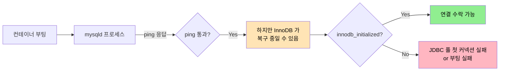
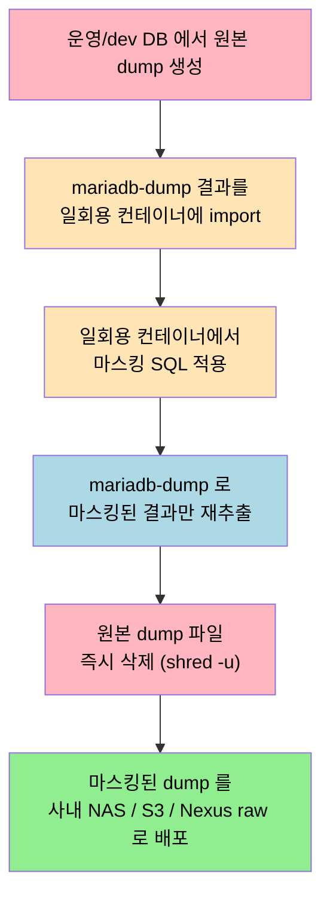

# DB 덤프와 로컬이관 — 함정·정책·사례 (심화)
---
> 03-01 본편이 "옵션이 왜 그렇게 짜여 있는가" 라면, 이 글은 "한 번 데이고 나면 절실한 함정과 정책"이다. 사람이 막 시작할 땐 안 보이지만, 운영 데이터를 두세 번 떠 오고 나면 모두가 같은 자리에서 다친다.


## 1. DEFINER 사고 — `ERROR 1449`

> 운영 DB 의 함수·프로시저·트리거가 *누구의 권한으로 만들어졌는지* 가 로컬 복원을 깨뜨린다.

복원 도중 다음 메시지를 만나면 거의 항상 같은 원인이다:

```text
ERROR 1449 (HY000): The user specified as a definer
  ('dev_user'@'%') does not exist
```

운영 DB 의 객체가 보통 이렇게 만들어져 있다:

```sql
CREATE DEFINER=`dev_user`@`%` PROCEDURE pr_apply_aprv_status(...)
BEGIN
    ...
END;
```

`DEFINER` 절은 *이 객체가 누구의 권한 컨텍스트에서 실행되어야 하는가* 를 지정한다. 로컬에 `dev_user` 가 없으니 객체 자체가 등록을 거부당한다. 대응은 세 가지다:

1. **로컬에 동일 계정 생성** — `CREATE USER 'dev_user'@'%' IDENTIFIED BY 'x'; GRANT ALL ON *.* TO 'dev_user'@'%';` 를 entrypoint 초입에 두는 임시 대응이다. 동작은 하지만, 운영 계정명이 로컬에 박혀 보안 시그니처가 흐려진다.
2. **덤프 파일에서 `DEFINER` 제거** — 가장 깨끗하다:
   ```bash
   perl -0777 -i -pe 's/DEFINER=`[^`]+`@`[^`]+`//g' ./.dumps/305p-dev/01_full.sql
   ```
   덤프 직후 자동으로 돌리도록 동기화 스크립트에 끼워 둔다. 객체는 *로컬 root* 권한으로 만들어진다.
3. **운영/dev DB 객체 생성 정책 수정** — 장기적으로 가장 좋은 답. `DEFINER` 명시를 줄이고 `SQL SECURITY INVOKER` 를 디폴트로 가져간다. 단, 이미 운영에 깔려 있는 수백 개 객체를 한 번에 바꾸기 어렵다.

응급 처치는 2, 장기 정책은 3 이다. 본 글의 동반 compose 는 `--log-bin-trust-function-creators=1` 도 같이 켜 두는데, 이 옵션이 함수/트리거 등록 시 DEFINER 검증을 완화해서 *어떤 사람의* 등록 시도라도 통과시키는 보조 안전장치다.


## 2. `initdb.d` 의 함정 — "왜 schema.sql 을 바꿨는데 안 먹지?"

> 가장 흔한 사고다. 답은 *볼륨이 살아 있는 한 안 먹는다* 이다.

MariaDB 공식 Docker 이미지의 `/docker-entrypoint-initdb.d/` 디렉토리는 **데이터 디렉토리가 비어 있는 첫 부팅 시점에만** 실행된다(Docker Hub 공식 이미지 문서). 다음 두 가지 동작이 동일한 메커니즘에서 나온다:

1. `MARIADB_DATABASE`, `MARIADB_USER` 등 환경변수도 첫 부팅에만 적용된다.
2. `initdb.d` 의 SQL 파일도 첫 부팅에만 실행된다.

볼륨이 살아 있는 한 위 두 가지가 모두 무시된다. 따라서 다음 시나리오가 함정이다:

- `schema.sql` 을 갈아치우고 `docker compose restart` 했는데 새 스키마가 안 보인다 — 정상.
- `MARIADB_DATABASE` 를 `TPS` 에서 `TPS_NEW` 로 바꿨는데 `TPS` 만 존재한다 — 정상.
- 동기화 스크립트가 `.dumps/305p-dev/01_full.sql` 을 갱신했는데, 컨테이너 안 DB 는 옛날 데이터다 — 정상.

대응은 *볼륨을 명시적으로 wipe* 하는 명령을 따로 두는 것이다. 동반 스크립트의 `--reset` 플래그가 이 역할이다:

```bash
docker compose down -v   # -v 로 볼륨까지 제거
docker compose up -d     # 빈 볼륨에 재시작 → entrypoint 다시 실행
```

`-v` 를 빼면 컨테이너만 새로 만들고 볼륨은 남기므로 시드가 안 먹는다. 이 한 글자가 모든 차이를 만든다. 팀에 공유할 때는 짧은 헬퍼를 둔다:

```bash
# Makefile
db-reset:
	docker compose down -v
	docker compose up -d mariadb
```

긴 문서를 읽기보다 명령 하나를 기억하는 쪽이 사고가 적다.


## 3. Healthcheck 의 진실 — `ping` 만으로는 부족

> `mysqladmin ping` 은 *프로세스가 응답하는가* 만 본다. *DB 가 일을 받을 수 있는가* 와는 다른 질문이다.



MariaDB 공식 문서는 healthcheck 로 `healthcheck.sh --connect --innodb_initialized` 를 제시한다(MariaDB 공식 문서). 두 플래그는 각각 다음을 잡는다:

| 플래그 | 의미 |
|--------|------|
| `--connect` | 클라이언트가 실제로 mysqld 에 *연결* 가능한가 |
| `--innodb_initialized` | InnoDB 가 *복구·초기화* 를 마쳤는가 |

`ping` 만으로 부족한 이유는 *시간 차* 다. 컨테이너 부팅 직후 mysqld 프로세스는 떠 있지만, InnoDB 가 redo log 복구·undo log 정리를 마치기 전에는 어떤 트랜잭션도 받지 못한다. 이 사이에 Spring Boot 가 `depends_on` 만 보고 먼저 붙으면, JDBC 풀이 처음 몇 개 커넥션을 잃거나 부팅 자체가 실패한다.

따라서 Compose 의 의존 선언도 *조건* 을 명시한다:

```yaml
operator:
  depends_on:
    mariadb:
      condition: service_healthy
```

`condition: service_healthy` 가 있어야 healthcheck 가 통과한 *뒤* 에야 operator 가 시작된다. 단순히 `depends_on: [mariadb]` 만 쓰면 컨테이너 *기동* 만 기다리고 *준비 완료* 는 기다리지 않는다. 한 줄 차이지만 부팅 실패율이 갈린다.

`start_period: 30s` 도 같이 둔다. 첫 30초 동안의 실패는 *건강 점수* 에 카운트하지 않는다. InnoDB 복구가 오래 걸리는 큰 덤프(수 GB) 의 경우 이 값을 더 길게 잡는다.


## 4. 대용량 복원 튜닝 — 어디까지 풀고 어디서 확인할 것인가

> 운영 안전장치를 일시적으로 풀어 속도를 얻고, 무결성 검증을 *별도의 단계* 로 분리한다.

로컬 복원을 한 번 해 보면 외래키·유니크 제약 검사가 row 당 비용을 크게 늘리는 것을 본다. 운영 복원이 아니라 *로컬 개발용* 복원이라면 다음 패턴이 자주 쓰인다:

```sql
SET FOREIGN_KEY_CHECKS=0;
SET UNIQUE_CHECKS=0;
SET AUTOCOMMIT=0;
SET SESSION sql_log_bin=0;

-- 덤프 본문 (INSERT, UPDATE, ...)

COMMIT;
SET FOREIGN_KEY_CHECKS=1;
SET UNIQUE_CHECKS=1;
```

각 라인이 사는 비용 측면:

1. `FOREIGN_KEY_CHECKS=0` — 행 삽입마다 참조 무결성 검증을 건너뛴다. 대량 INSERT 에서 가장 큰 가속.
2. `UNIQUE_CHECKS=0` — InnoDB 의 *insert buffer* 가 unique 인덱스 갱신을 배치 처리하게 한다.
3. `AUTOCOMMIT=0` + 마지막 `COMMIT` — row 마다 commit 하지 않고 한 번에 묶는다. WAL fsync 횟수가 극적으로 줄어든다.
4. `sql_log_bin=0` — 바이너리 로그 기록을 끈다. 로컬은 복제 슬레이브가 없으므로 안전. 디스크 IO 가 줄어든다.

대신 *검증은 어디서 하는가* 가 별도 단계로 빠진다. 다음 두 가지가 일반적이다.

| 검증 방식 | 방법 | 트레이드오프 |
|----------|------|------------|
| CHECKSUM | 운영과 로컬의 row count 와 `CHECKSUM TABLE tbl_name` 을 비교 | 빠르지만 어디가 다른지는 모름 |
| 샘플 비교 | 핵심 테이블 N 개에서 같은 키 범위를 SELECT 해 row 단위 diff | 직관적이지만 시간이 듦 |

로컬은 *동작 검증* 이 목적이므로 row 단위 무결성보다는 *기능별 시나리오가 돌아가는가* 가 진짜 검증이다. CHECKSUM 은 빠른 sanity check 로 두고, 평소 회귀 테스트가 본 검증대 역할을 한다.


## 5. 마스킹 정책 — 어느 컬럼이 위험한가

> 가장 위험한 것은 *마스킹 후의 데이터* 가 아니라 *마스킹 전의 원본* 이 개발자 PC 에 남는 것이다.

위험 컬럼 식별은 도메인마다 다르지만, 대체로 다음 6가지 카테고리가 공통이다:

| 카테고리 | 예시 컬럼 | 마스킹 방식 |
|----------|----------|------------|
| 사용자명 | `USER_NM`, `RGTR_NM`, `MDFR_NM` | `CONCAT('사용자', USER_ID)` |
| 이메일 | `EMAIL`, `EML_ADDR` | `CONCAT('user', USER_ID, '@example.com')` |
| 전화번호 | `TELNO`, `MBL_TELNO` | `'01000000000'` 고정 또는 마지막 4자리만 X |
| 인증 토큰 | `TOKEN`, `API_KEY`, `SECRET`, `REFRESH_TKN` | `NULL` 또는 무작위 32바이트 |
| 업무 본문 | `CN`, `DESC`, `MEMO`, `CMNT` | `'[REDACTED]'` 또는 길이만 보존한 X 패딩 |
| 네트워크 | `IP_ADDR`, `CLIENT_IP` | `'0.0.0.0'` 또는 /16 까지만 보존 |

마스킹 SQL 예시:

```sql
UPDATE TB_TRB_TK_001
SET
  USER_NM = CONCAT('사용자', USER_ID),
  EMAIL = CONCAT('user', USER_ID, '@example.com'),
  TELNO = '01000000000';

UPDATE TB_TRB_TJ_010
SET CMNT = REPEAT('X', LEAST(CHAR_LENGTH(CMNT), 100))
WHERE CMNT IS NOT NULL;

UPDATE TB_TRB_PL_046
SET API_KEY = NULL, REFRESH_TKN = NULL;
```

권장 흐름은 다음과 같다.



이 흐름의 핵심은 *원본이 사람 손에 닿지 않는다* 는 점이다. 마스킹 작업을 사람 PC 에서 직접 하면, 마스킹 도중 또는 직후의 원본 파일이 백업·tmp·휴지통 등에 남는다. 작업 자체를 격리된 환경(예: 일회용 컨테이너, sandbox VM)에서 자동화한다.


## 6. 팀 정책 문서 템플릿

> 정책은 짧고 명령 가능한 형태여야 지켜진다. 다음 템플릿은 팀 위키에 그대로 붙여 쓸 수 있다.

### 6.1 덤프 파일 정책

```markdown
## Database Dump Policy

1. 덤프 파일은 Git 에 커밋하지 않는다.
2. 보관 위치는 사내 NAS / Nexus raw repository / S3-compatible storage 중 하나.
3. 파일명은 `{서비스명}-{환경}{-masked|}-{YYYYMMDD}-{HHMM}.sql.gz` 형식. 생성일·기준 환경·마스킹 여부를 모두 드러낸다.
   예) `tps-workflow-devdb-masked-20260513-1500.sql.gz`
   예) `tps-operator-dev-20260514-0900.sql.gz` (마스킹 안 됨 — 격리 환경 전용)
4. 보관 기간: 최근 3개 또는 7일 중 짧은 쪽.
5. 민감정보가 포함된 덤프는 *반드시* 마스킹된 상태로만 배포한다.
6. 마스킹되지 않은 원본 dump 는 작업 PC 가 아닌 격리된 환경에서만 다룬다.
7. 접근 권한: 프로젝트 개발자 최소 권한 (기본은 NO).
```

### 6.2 로컬 DB 초기화 정책

```markdown
## Local DB Commands

- `make db-up`        — MariaDB 컨테이너만 기동
- `make db-reset`     — 볼륨 wipe + 재기동 (entrypoint 시드 재실행)
- `make db-sync`      — dev → local 동기화 스크립트 호출
- `make db-restore`   — 외부 dump 파일을 stdin pipe 로 적용
- `make db-shell`     — `mariadb` 클라이언트로 접속
- `make db-clean`     — 컨테이너와 볼륨 모두 삭제
```

명령 6 개를 외우게 두면 긴 절차 문서를 안 봐도 일이 굴러간다.

### 6.3 스키마 변경 정책

GitLab Database guidelines 의 발상을 줄여서 가져온다(GitLab 공식 문서):

```markdown
## Schema Change Policy

| 변경 유형 | 정책 |
|-----------|------|
| 컬럼 추가 | nullable → backfill → not null 순서 |
| 인덱스 추가 | 운영 EXPLAIN 결과 첨부 후 반영 |
| 대량 UPDATE | 로컬/dev 에서 예상 건수 확인 후 운영 적용 |
| 프로시저/트리거 변경 | 덤프 옵션(`--routines`, `--triggers`)에 포함되는지 확인 |
| DDL 변경 | 로컬 초기화 SQL 또는 migration 스크립트 동기화 |
```


## 7. 사례 트러블슈팅 5선

> 실무에서 한 번씩은 마주치는 다섯 가지. 모두 *증상 → 원인 → 처치 → 예방* 순으로 정리한다.

### 7.1 `initdb.d` SQL 이 실행되지 않음

| 단계 | 내용 |
|------|------|
| 증상 | `schema.sql` 또는 `data.sql` 을 갈아치웠는데 컨테이너 안 DB 가 옛날 상태 |
| 원인 | 볼륨이 살아 있어 `initdb.d` 가 첫 부팅 이후로는 실행되지 않음(§2 참고) |
| 처치 | `docker compose down -v && docker compose up -d`. `-v` 가 핵심 |
| 예방 | 시드 재적용이 필요한 워크플로엔 `make db-reset` 헬퍼 제공 |

### 7.2 한글이 깨짐 — `mojibake` 또는 `?` 표시

| 단계 | 내용 |
|------|------|
| 증상 | 운영에서는 멀쩡한 한글이 로컬에서는 `?` 또는 깨진 문자로 보임 |
| 원인 | 덤프 / 서버 / 클라이언트 셋 중 하나라도 utf8mb4 가 아님 |
| 처치 | 세 곳(덤프·서버·클라이언트) 모두 utf8mb4 로 정렬 (아래 설정 참고) |
| 예방 | charset 설정을 compose 와 동기화 스크립트에 박아 두고 사람이 매번 정하지 않게 한다 |

```bash
# 덤프
mariadb-dump --default-character-set=utf8mb4 ...
```
```yaml
# docker compose - mariadb command
- --character-set-server=utf8mb4
- --collation-server=utf8mb4_unicode_ci
```
```cnf
# ~/.my.cnf
[client]
default-character-set=utf8mb4
```

### 7.3 프로시저·함수·트리거 누락

| 단계 | 내용 |
|------|------|
| 증상 | INSERT 후 파생 row 가 안 생기거나, "function not found" 오류 |
| 원인 | 덤프 옵션에서 `--routines`, `--triggers`, `--events` 누락 |
| 처치 | 옵션 추가 후 재덤프 + 재시드 |
| 예방 | 동기화 스크립트의 `DUMP_ARGS` 에 세 옵션을 *항상* 포함한다. 빠뜨릴 수 없게 코드에 박는다 |

### 7.4 DEFINER 오류 (`ERROR 1449`)

| 단계 | 내용 |
|------|------|
| 증상 | 복원 도중 `The user specified as a definer ('xxx'@'%') does not exist` 메시지 |
| 원인 | 운영 객체의 DEFINER 가 로컬에 없는 계정 |
| 처치 | 덤프 파일에서 DEFINER 제거 (§1 의 perl one-liner) |
| 예방 | 동기화 스크립트가 덤프 직후 자동으로 DEFINER 제거를 돌리도록 끼워 둔다 |

### 7.5 Spring Boot 가 MariaDB 보다 먼저 붙어서 부팅 실패

| 단계 | 내용 |
|------|------|
| 증상 | `Communications link failure`, `Connection refused` 가 첫 몇 초 동안 반복되다 부팅 실패 |
| 원인 | `depends_on` 만 쓰면 컨테이너 *기동* 만 기다리고 *준비 완료* 는 기다리지 않음 |
| 처치 | healthcheck + `condition: service_healthy` 조합(§3 참고) |
| 예방 | compose 템플릿에 healthcheck 와 `condition: service_healthy` 를 기본으로 박는다 |


## 8. 면접 체크리스트 (심화)

작성한 정책을 스스로 검증한다:

- [ ] DEFINER 사고가 났을 때 *세 가지* 대응을 비교 설명할 수 있는가?
- [ ] `/docker-entrypoint-initdb.d` 가 언제 실행되고 언제 실행되지 *않는지* 한 문장으로 설명할 수 있는가?
- [ ] `healthcheck.sh --connect --innodb_initialized` 의 두 플래그가 각각 무엇을 보는지 설명할 수 있는가?
- [ ] 대용량 복원을 가속할 때 푸는 4가지 안전장치와 *어디서 검증을 회수* 하는지 답할 수 있는가?
- [ ] 위험 컬럼 6 카테고리(이름·이메일·전화·토큰·본문·IP) 각각의 마스킹 전략을 한 줄로 말할 수 있는가?
- [ ] 팀에 정책을 배포할 때 *문서 한 페이지* 와 *Makefile 6 명령* 중 어느 쪽이 더 잘 지켜지는지 의견을 가지고 있는가?
- [ ] 5가지 트러블슈팅 사례 각각의 *예방* 단계를 동반 스크립트/Compose 의 어느 줄과 매칭할 수 있는가?


## 9. 참고

본문에서 인용한 출처:

- MariaDB `mariadb-dump` 옵션 — https://mariadb.com/docs/server/clients-and-utilities/backup-restore-and-import-clients/mariadb-dump
- MariaDB 복원 가이드 — https://mariadb.com/docs/server/mariadb-quickstart-guides/mariadb-restore-guide
- MariaDB Docker Official Image — https://hub.docker.com/_/mariadb
- MariaDB healthcheck.sh — https://mariadb.com/docs/server/server-management/automated-mariadb-deployment-and-administration/docker-and-mariadb/using-healthcheck-sh
- GitLab Database guidelines — https://docs.gitlab.com/development/database/

본편: [03-01.DB덤프와 로컬이관](./03-01.DB덤프와%20로컬이관.md)
