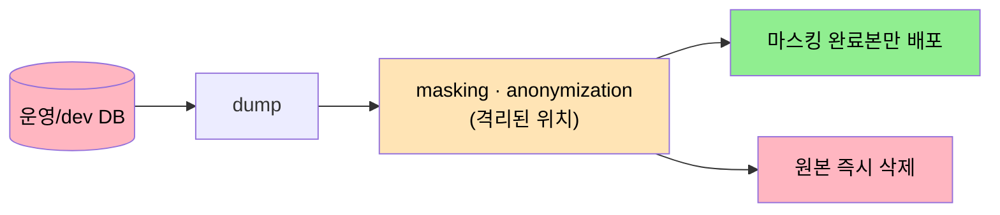
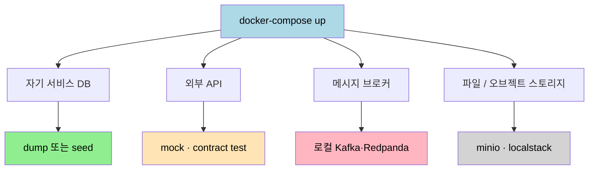

# 로컬 개발환경 운영 모델
---
> 자기 DB 를 로컬로 옮기는 일이 첫걸음이라면, 그 다음은 *팀 전체가 어떤 로컬 환경 모델을 채택할 것인가* 다. 정답은 하나가 아니다. seed, 덤프, 마스킹 덤프, 원격 dev 환경, Cloud Dev Environment, Preview Environment, stub/mock 까지 — 의존 종류와 팀 규모에 따라 조합이 달라진다.

## 1. 왜 이 문서가 따로인가

> 03-01 본편이 "DB 를 어떻게 로컬로 가져오는가" 라면, 본 문서는 "그 위에 어떤 운영 모델을 얹는가" 다.

03-01 §6 에서 5가지 모델을 같이 다루다 한 절이 본문 절반을 차지하게 됐다. 운영 모델은 독립적으로 참조될 일이 많고(예: 신규 서비스 시작 시 어떤 모델로 갈지 결정), 분리하는 편이 검색과 인용에 유리하다.

기준 한 줄: *재현 가능한 로컬 환경을 만드는 도구는 dump 만이 아니다*. dump 는 도구의 하나일 뿐이고, 정책은 *어떤 의존을 어떤 도구로 끊을지* 의 선택이다.

## 2. 운영 모델 5가지

> 정답은 하나가 아니다. 보통 seed·덤프·마스킹된 덤프·원격 dev 환경 네 가지 중 하나 또는 조합이며, 거기에 Cloud Dev Environment 와 Preview Environment 가 추상 한 단계 위에 얹힌다.

### 2.1 GitLab — seed 중심

GitLab 은 development seed 파일과 Data Seeder 를 별도로 두고 운영한다(GitLab 공식 문서). seed 파일은 로컬 기능 검증용 레코드를 채우고, Data Seeder 는 특정 namespace 에 테스트 데이터를 주입한다. 운영 데이터 의존을 줄이고 *재현성* 을 얻는 대신, 스키마 변경마다 seed 도 같이 고쳐야 한다는 비용을 받아들이는 모델이다.

이 모델의 핵심은 "신규 개발자가 명령 하나로 같은 상태를 만들 수 있다" 는 점이다. 온보딩 비용이 압도적으로 싸진다. GitLab Database guidelines 도 DB 변경 시 EXPLAIN·migration 검토를 별도 리뷰 대상으로 두는데, seed 정책이 같이 굴러가야 그 검토가 가능하다.

### 2.2 보통의 SI·사내 시스템 — 덤프 중심

운영 또는 개발 DB 를 떠 와 로컬에 복원한다. 빠르고, *현실 데이터 분포* 기반의 트러블슈팅이 가능하다는 장점이 있다. 단점 네 가지가 따라온다:

1. 개인정보·민감정보 유출 위험 — 이름·이메일·토큰·업무 본문이 그대로 개발자 PC 에 떨어진다.
2. 덤프 파일 비대화 — 로컬 복원 시간이 길어지고, 디스크가 빠르게 채워진다.
3. 상태 불명확 — "이 덤프가 언제 기준인지" 모르면 다른 동료와 다른 결과가 나와 혼란.
4. 팀 간 불일치 — 각자 다른 시점의 덤프를 쓰면 같은 버그를 다른 방식으로 만난다.

따라서 덤프 중심은 *초기 이관·장애 재현* 용으로는 훌륭하지만, 장기 표준으로는 seed 와 섞는 것이 안전하다. 03-01 의 동반 스크립트 `sync-dev-to-local.sh` 가 이 모델의 실행본이다.

### 2.3 익명화된 덤프 — 현실적 중간

정책상 가장 중요한 것은 "마스킹 후" 가 아니라 *마스킹 전의 원본이 개발자 PC 에 남지 않게 하는 것* 이다. 마스킹은 SQL `UPDATE` 한 줄로 끝나지만, 원본이 한 번 노출되면 회수가 불가능하다. 컬럼별 마스킹 예시·격리 절차는 [`./03-02.DB덤프와 로컬이관 (심화).md`](./03-02.DB덤프와%20로컬이관%20(심화).md) §5 참고.

### 2.4 원격 개발 환경 — Shopify 모델

Shopify 는 Developer Infrastructure 팀을 Local Environments 와 Cloud Environments 로 분리해 모델링한다(Shopify Engineering 블로그). Local Environments 팀은 로컬에서의 repo clone·dependency 설치·backing service 실행을 돕고, Cloud Environments 팀은 원격·on-demand 개발 환경을 다룬다.

서비스 수가 많아 로컬 컴퓨터가 다 못 띄우는 규모가 되면 자연스럽게 이 방향으로 간다. 우리 맥락은 아직 로컬 Docker Compose 로 충분하지만, *언제 이 방향으로 넘어갈지* 는 머리에 둬야 한다.

### 2.5 stub·mock 서버 — Toss 모델

Toss 의 "신용대출 파트너 mock server" 사례는 *외부 의존(파트너 API) 을 mock 으로 대체* 하는 패턴을 보여 준다(Toss tech 블로그, *신용대출 파트너 mock server 2편*). 본 글의 주제(자기 DB 의 로컬 복원) 와는 결이 다르지만, 같은 발상이 한 단계 위에 있다: *재현 가능한 로컬 환경을 만드는 도구는 dump 만이 아니다*.

Phauer 의 블로그 글 "Smooth Local Development with Docker-Compose, Seeding, Stubs, and Faker" 는 docker-compose 와 seed script 로 로컬 개발 환경을 자동화하는 패턴을 정리한다. 외부 인프라 의존 없이 `docker-compose up` 만으로 DB 와 stub 서비스를 띄우는 발상이 실무에서 널리 쓰인다(Phauer, 2018).

## 3. 한 단계 위의 추상 — Cloud Dev / Preview Environment

> 위 다섯 가지가 *내부 구성 도구* 라면, 다음 두 가지는 *어디서 그 구성을 굴리는가* 의 선택이다.

| 모델 | 적합한 상황 | 비고 |
|------|------------|------|
| Cloud Dev Environment | 로컬에서 모든 서비스를 다 띄울 수 없을 때(예: 마이크로서비스 30+) | gitpod, GitHub Codespaces, Coder 같은 도구. Shopify Cloud Environments 팀 모델의 일반화 |
| Preview Environment | PR 별 통합 검증이 필요할 때 | PR 단위로 일회용 환경을 띄워 QA·이해관계자 확인. 데이터는 보통 마스킹 dump 또는 seed |

Cloud Dev Environment 는 *개발자 PC 가 가벼워진다* 는 장점과 *인프라 비용이 든다* 는 비용을 함께 받는다. Preview Environment 는 *PR 단계에서 통합 검증이 가능하다* 는 장점과 *PR 마다 환경을 띄우는 비용·정리 자동화* 의 부담을 받는다. 두 가지 모두 "팀 규모가 일정 임계를 넘어야" 비용 대비 이득이 난다.

## 4. 의존 종류별 대체 도구

> dump 와 mock·stub 은 경쟁이 아니라 각자 다른 의존을 끊는 도구다. 어느 도구를 쓸지는 *무엇이 의존인지* 가 결정한다.

| 의존 종류 | 대체 도구 |
|----------|----------|
| 자기 서비스 DB | 로컬 DB + dump 또는 seed |
| 외부 API · 파트너 시스템 | mock server / contract test (Toss 사례) |
| 메시지 브로커 | 로컬 Kafka·Redpanda 컨테이너 |
| 파일 / 오브젝트 스토리지 | minio · localstack |
| 분산 캐시 | 로컬 Redis 컨테이너 |
| 인증 / SSO | 사내 IdP mock 또는 dev 테넌트 |

자기 DB 는 dump 또는 seed 로, 외부 의존은 stub·mock 으로 대체해 `docker-compose up` 한 번으로 전체가 떠야 한다. Phauer 가 "seeding + stub" 을 한 묶음으로 권장하는 이유다.

## 5. 한 줄 비교 — 어느 모델을 선택할 것인가

| 방식 | 적합한 상황 | 위험 |
|------|------------|------|
| seed 중심 (GitLab) | 신규 개발자 온보딩이 잦고, 재현성이 가장 중요 | 스키마 변경 비용 |
| 덤프 중심 | 초기 이관·장애 재현·SQL 검증 | 개인정보·상태 불명확 |
| 마스킹 덤프 | 위 둘의 절충, 컴플라이언스 요구 있음 | 마스킹 정책 유지 비용 |
| 원격 dev 환경 (Shopify) | 서비스 수가 많아 로컬이 무거움 | 인프라 비용 |
| stub·mock 중심 (Toss·Phauer) | 외부 의존이 많고 자체 DB 의존은 작을 때 | mock 과 실 API 의 drift 관리 |

대부분의 팀은 *둘 이상의 조합* 으로 운영한다. 예를 들어 자기 DB 는 마스킹 덤프 + seed 혼합, 외부 API 는 stub, 메시지 브로커는 로컬 컨테이너. 한 모델만 선택하기보다 *각 의존을 어느 도구로 끊을지* 매핑하는 표 한 장이 팀 정책이다.

## 6. 면접 대비 요약

### 한 줄 정의

로컬 개발환경 운영 모델은 *어떤 의존을 어떤 도구로 끊어 재현 가능한 환경을 만들 것인가* 의 선택이다. seed·덤프·마스킹·원격·stub 다섯 가지 중 둘 이상을 조합하는 것이 보통이다.

### 핵심 포인트 3가지

1. **dump 와 stub 은 경쟁이 아니다.** 자기 DB 는 dump/seed 로, 외부 API 는 stub 으로 — 각자 다른 의존을 끊는 도구다.
2. **모델 선택은 팀 규모와 컴플라이언스가 결정한다.** 온보딩 빈도가 높으면 seed, 외부 의존이 많으면 stub, 서비스 수가 많으면 Cloud Dev Environment 로 자연스럽게 넘어간다.
3. **Cloud Dev / Preview Environment 는 *어디서 굴리는가* 의 선택이다.** 내부 도구(seed/dump/stub) 와는 직교한다 — 두 축을 함께 설계한다.

### 자주 묻는 질문

**Q: 우리 팀(중소 SI) 은 어떤 모델로 시작해야 하나?**
A: 1단계는 덤프 중심 + 동기화 스크립트(03-01 참고). 컴플라이언스 요구가 생기면 마스킹 덤프, 신규 개발자 온보딩이 잦아지면 seed 추가. 한 번에 끝내려 하면 실패한다.

**Q: stub 과 mock 의 차이는?**
A: 좁은 의미로 mock 은 *호출 검증* 까지 하고 stub 은 *응답만 제공* 한다. Toss 의 mock server 는 실제 파트너 API 의 응답 패턴을 흉내내 *로컬 통합 테스트가 외부 호출 없이 굴러가게* 하는 용도다.

**Q: Cloud Dev Environment 는 언제부터 고려해야 하나?**
A: *개발자 PC 의 메모리·CPU 가 부족해서 모든 서비스를 한 번에 못 띄우는 시점* 이 임계다. 서비스 수가 20~30 개를 넘으면 자연스럽게 그 임계에 닿는다.

## 7. 참고

본문에서 인용한 출처:

- GitLab Development seed files — https://docs.gitlab.com/development/development_seed_files/
- GitLab Database guidelines — https://docs.gitlab.com/development/database/
- Shopify Developer Infrastructure Teams — https://shopify.engineering/modelling-developer-infrastructure-teams
- Phauer, "Smooth Local Development with Docker-Compose, Seeding, Stubs, and Faker" (2018) — https://phauer.com/2018/local-development-docker-compose-seeding-stubs/
- Toss tech, "신용대출 파트너 mock server (2편)" — https://toss.tech/article/credit-loan-partner-mock-server-2

짝 문서:

- [03-01. DB 덤프와 로컬이관](./03-01.DB덤프와%20로컬이관.md) — `mariadb-dump` 옵션 풀이, docker compose entrypoint, 단계별 적용
- [03-02. DB 덤프와 로컬이관 (심화)](./03-02.DB덤프와%20로컬이관%20(심화).md) — DEFINER, initdb.d 함정, 마스킹 정책, 사례 트러블슈팅
