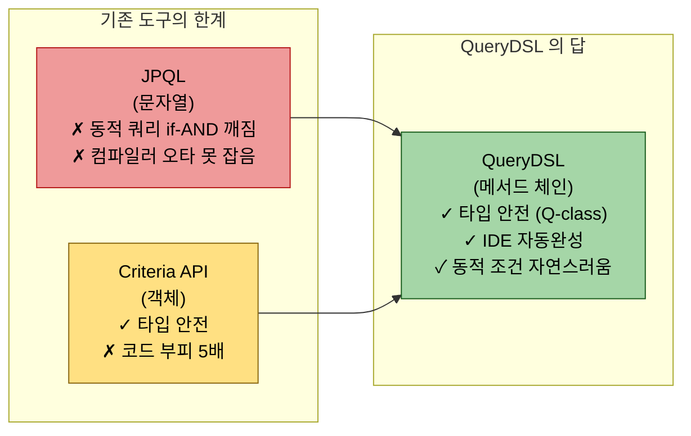
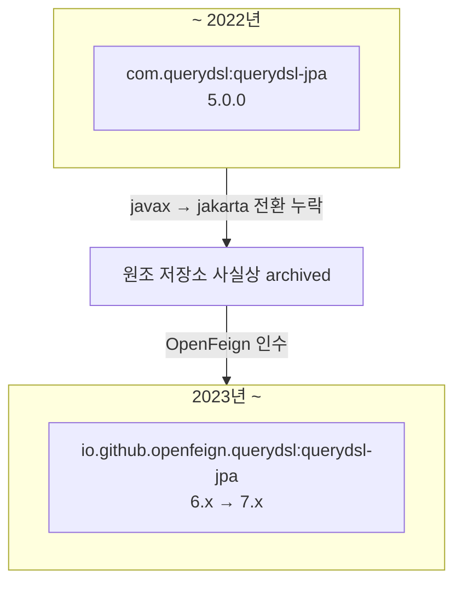

# QueryDSL 입문과 6.12의 위치

---

> **이 문서를 읽고 나면, QueryDSL 의 등장 동기(JPQL 문자열 한계 + Criteria API 가독성 한계) 를 한 문장으로 설명하고, 원조 저장소 archived 사실과 OpenFeign fork 의 표준화 흐름을 짚을 수 있으며, 본 학습 묶음이 7.x 대신 6.12 를 고른 기준을 면접에서 답할 수 있다.**

QueryDSL이 등장한 동기는 JPQL의 문자열 한계와 Criteria API의 가독성 한계를 동시에 해소하기 위함이다. 2026년 5월 시점에는 원조 저장소가 멈췄고 OpenFeign 포크가 사실상 표준이다. 본 학습 묶음이 7.x 대신 6.12를 고른 이유까지 짚는다.


## QueryDSL은 왜 등장했는가

> JPA로 동적 쿼리를 짜다 보면 어느 순간 코드가 무너진다. 그 무너짐의 정체를 들여다본다.

JPQL·Criteria API 의 한계가 어떻게 QueryDSL 의 등장으로 이어졌는지 한 그림으로 보면 다음과 같다.



QueryDSL 은 *두 도구의 약점을 모두 우회* 한 자리에 놓인 도구다.

JPA가 표준화한 쿼리 언어는 두 가지다. 문자열 기반 JPQL과 객체 기반 Criteria API다. 둘 다 출발점은 좋았지만 실무에서 다음 세 가지 상황을 만나면 약점이 드러난다.

1. **검색 조건이 동적으로 변한다.** 사용자가 이름·이메일·상태·가입 기간을 0개에서 4개까지 임의 조합으로 검색한다고 하자. JPQL이라면 `StringBuilder`에 조건마다 `if`로 `AND` 절을 붙여 만들어야 한다. 콤마와 공백 한 칸 차이로 쿼리가 깨진다.
2. **컴파일러가 컬럼 오타를 못 잡는다.** `select m from Member m where m.emial = :email`라고 쳐도 IDE는 빨갛게 표시하지 않는다. 런타임에 실행하기 전까지 발견이 미뤄진다.
3. **Criteria API는 객체로 안전한 대신 코드 부피가 5배로 늘어난다.** `CriteriaBuilder`, `CriteriaQuery`, `Root`, `Predicate`를 일일이 엮으면 한 화면에 한 쿼리가 안 들어간다.

QueryDSL은 세 가지 약점을 동시에 푼다. 

1. 빌드 타임에 엔티티마다 `Q타입`(예: `QMember`) 메타모델을 자동 생성해, 문자열 대신 `member.email.eq(email)`처럼 메서드 체이닝으로 조건을 표현한다. 
2. 컬럼 이름이 바뀌면 컴파일 에러가 즉시 뜨고, IDE 자동완성이 동작한다. 
3. 동적 쿼리도 `BooleanExpression`을 합치는 형태라 if 분기 없이 `null` 처리만으로 끝난다.


## JPA Criteria와 무엇이 다른가

> 둘 다 "타입 안전한 쿼리 빌더"라는 같은 슬로건을 내걸지만, 가독성과 학습 비용이 갈린다.

같은 쿼리를 두 방식으로 써 보면 차이가 분명해진다. "20세 이상이고 팀 이름이 'A'인 회원을 이름 오름차순으로 조회한다"라는 요구를 보자.

```java
// JPA Criteria — 표준 명세, 객체 그래프 조립
CriteriaBuilder cb = em.getCriteriaBuilder();
CriteriaQuery<Member> cq = cb.createQuery(Member.class);
Root<Member> m = cq.from(Member.class);
Join<Member, Team> t = m.join("team");
cq.select(m)
  .where(
      cb.and(
          cb.greaterThanOrEqualTo(m.get("age"), 20),
          cb.equal(t.get("name"), "A")
      )
  )
  .orderBy(cb.asc(m.get("name")));
List<Member> result = em.createQuery(cq).getResultList();
```

```java
// QueryDSL — 같은 쿼리
List<Member> result = queryFactory
        .selectFrom(member)
        .join(member.team, team)
        .where(member.age.goe(20)
                , team.name.eq("A"))
        .orderBy(member.name.asc())
        .fetch();
```

QueryDSL 쪽이 한 화면에 들어오는 점, `member.age.goe(20)`처럼 영문 SQL 어휘에 가까운 점, `select`와 `from`이 한 호출로 묶이는 점에서 읽기가 가볍다. Criteria API도 안전하지만 일상 코드 리뷰에서 "이 쿼리가 무엇을 하는지" 한눈에 파악되는 비율이 떨어진다.

학습 비용도 갈린다. Criteria API는 `CriteriaBuilder`라는 팩토리를 매번 거쳐야 하고, `Path<X>` 같은 제네릭 추상층이 한 단계 더 있다. QueryDSL은 Q 메타모델이 곧바로 컬럼을 노출하기 때문에 SQL을 아는 개발자가 마찰 없이 옮겨 탄다.


## Q클래스란 무엇인가

> **QueryDSL을 쓴다는 말의 절반은 "Q클래스를 쓴다"는 말이다.** *무엇이고, 왜 필요하며, 어떻게 동작하는지* 한 자리에 모은다. 어디에 생성되는지·왜 보이지 않는지는 셋업 챕터(01-02)가 다루고, 본 절은 개념에 집중한다.

### 한 줄 정의

Q클래스는 *엔티티마다 빌드 타임에 자동 생성되는 정적 메타모델 클래스* 다. 

- 엔티티 `Member`가 있으면 빌드 산출물로 `QMember`가 만들어지고, `QMember.member.email`처럼 *컬럼을 객체 필드처럼* 가리킨다. 
- 이 객체 필드가 SQL에서 어떤 컬럼인지·어떤 타입인지를 컴파일러가 알고 있다.

### 왜 필요한가 — 문자열의 두 가지 죽음

JPQL은 쿼리 본문이 문자열이다. 두 가지 죽음이 따라온다.

1. **컬럼명 오타가 런타임에야 잡힌다.** `m.emial`로 쳐도 컴파일은 통과한다. 운영 코드에서 같은 컬럼이 수십 군데 흩어져 있으면 한 곳을 놓치고 배포된다.
2. **엔티티 컬럼을 리네임할 때 흔적이 남는다.** `email`을 `emailAddress`로 바꾸면 IDE의 *Rename Field* 가 JPQL 문자열 안의 `email`은 건드리지 못한다. 전역 grep으로 잡아야 하는데, 변수명·다른 엔티티의 같은 단어와 섞여 잘못 바꾸기 쉽다.

Q클래스는 같은 문제를 *컴파일 타임 검증* 으로 풀어 준다.

```java
queryFactory
        .selectFrom(member)
        .where(member.email.eq(emailParam))   // member.email 이 곧 Member.email 필드
        .fetch();
```

엔티티의 `email` 필드를 `emailAddress`로 바꾸면 annotationProcessor가 새 빌드에서 `QMember.email`을 `QMember.emailAddress`로 다시 만든다. 그 순간 모든 호출부가 *컴파일 에러* 로 떠오른다. IDE *Rename Field* 가 Q필드 참조까지 일괄로 잡아 주는 환경(IntelliJ 등)이라면 한 번에 정리된다.

### 무엇으로 만들어지는가 — annotationProcessor의 역할

Q클래스는 직접 작성하지 않는다. *어노테이션 프로세서* 가 컴파일 시점에 엔티티를 스캔해 만든다.

```
@Entity Member.java
    │
    │  ./gradlew compileJava
    ▼
┌────────────────────────────────────────┐
│ querydsl-apt (annotationProcessor)     │
│   - @Entity 가 붙은 클래스 스캔        │
│   - 필드별 PathType 결정               │
│   - QMember.java 소스 코드 생성        │
└────────────────────────────────────────┘
    │
    ▼
build/generated/sources/annotationProcessor/.../QMember.java
    │
    │  javac
    ▼
QMember.class (런타임 사용)
```

핵심 두 가지.

1. Q클래스는 *소스* 가 한 번 생성된 뒤 *컴파일러* 가 다시 .class로 만든다. 사람이 만든 일반 클래스와 같다. 런타임에 마법이 일어나지 않는다.
2. annotationProcessor가 동작해야 한다. 좌표 누락이나 `:jakarta` 분류자 누락으로 프로세서가 안 돌면 `cannot find symbol: class QMember` 에러가 뜬다. 셋업 함정은 01-02에서 표로 정리한다.

### 안을 들여다본다

생성된 `QMember.java`의 첫머리는 보통 다음과 같다.

```java
@Generated("com.querydsl.codegen.DefaultEntitySerializer")
public class QMember extends EntityPathBase<Member> {

    public static final QMember member = new QMember("member1");

    public final NumberPath<Long> id = createNumber("id", Long.class);
    public final StringPath name = createString("name");
    public final NumberPath<Integer> age = createNumber("age", Integer.class);
    public final StringPath email = createString("email");
    public final EnumPath<MemberStatus> status = createEnum("status", MemberStatus.class);
    public final QTeam team;   // 연관 엔티티는 다시 Q타입

    public QMember(String variable) {
        super(Member.class, variable);
        this.team = new QTeam(forProperty("team"));
    }
}
```

네 가지 약속이 보인다.

1. **`EntityPathBase<Member>`를 상속한다.** 모든 Q클래스의 공통 부모다. `selectFrom(member)`에서 `member`가 *Member의 경로* 라는 사실이 이 상속으로 전달된다.
2. **컬럼이 *Path 객체* 로 표현된다.** `id`는 `NumberPath<Long>`, `name`은 `StringPath`, `status`는 `EnumPath<MemberStatus>`. Path 타입이 *어떤 연산이 가능한가* 를 결정한다. `StringPath`만 `contains`/`startsWith`를 제공하고, `NumberPath`만 `goe`/`loe`를 제공한다. 타입에 맞지 않는 연산은 컴파일이 거부한다.
3. **`static final QMember member` 정적 인스턴스가 있다.** 모든 쿼리의 진입점이다. 이름이 `"member1"`인 이유는 SQL alias 충돌 회피용 기본값이다. *자기 참조 조인* (같은 엔티티를 한 쿼리에 두 번 등장시키는 경우)에 두 번째 인스턴스를 `new QMember("memberSub")`로 만들어 alias를 분리한다. 같은 기법이 02-04의 PathBuilder, 02-06의 sub-select에서 다시 나타난다.
4. **연관 엔티티는 또 Q타입을 들고 있다.** `member.team.name`이 자연스럽게 동작하는 이유다. `team`은 `QTeam`이고, 그 안의 `name`은 다시 `StringPath`다. 객체 그래프를 *컴파일 타임에 추적* 할 수 있다는 의미다.

### 한 번 만들면 끝이 아닌 이유

엔티티가 바뀌면 Q클래스도 *반드시* 다시 만들어져야 한다. 정확히는 다음 세 시점에 재생성이 필요하다.

1. 엔티티 필드 추가·삭제·이름 변경
2. `@Embedded` 또는 `@ManyToOne` 같은 매핑 변경
3. `@Entity`가 새로 붙거나 떨어진 클래스

`./gradlew clean compileJava`가 가장 확실한 재생성 명령이다. `clean` 단계에서 옛 Q소스를 지우는 설정(01-02의 `clean.doFirst { delete file(querydslDir) }`)을 함께 두면 *옛 Q필드 잔존* 으로 컴파일이 깨지는 사례를 막을 수 있다.

### Q클래스 없이도 가능한가

가능하다. *PathBuilder* 라는 동적 path 빌더를 직접 만들어 같은 역할을 흉내낼 수 있다.

```java
PathBuilder<Member> m = new PathBuilder<>(Member.class, "member");
queryFactory.selectFrom(m)
        .where(m.getString("email").eq("a@b.com"))
        .fetch();
```

- 다만 컴파일 타임 검증이 사라진다. `getString("emial")` 오타가 그대로 통과해 런타임 에러가 된다. 
- 새 프로젝트라면 Q클래스가 표준이다. PathBuilder는 *Q클래스 import가 어려운 모듈 경계*·*같은 엔티티에 다른 alias가 필요한 sub-query* 같은 특수 상황에서 의식적으로 선택한다. 02-04와 02-06에서 그 *언제* 를 다룬다.

### 정리

> Q클래스는 "엔티티의 컬럼을 *타입을 가진 객체* 로 다시 표현한 메타모델"이다. annotationProcessor가 빌드 타임에 만들어 주고, JVM 런타임에는 평범한 클래스로 동작한다. 컴파일러가 컬럼 오타와 타입 불일치를 잡아 주는 *비용 없는 안전망* 이 본질이다.

생성 경로·IDE 인식 함정·재생성 트리거 설정은 01-02에서 코드로 짚는다.


## 2026년 5월 기준 거버넌스

> 같은 라이브러리에 두 좌표가 떠다닌다. 어느 쪽이 살아 있는지부터 정리한다.

QueryDSL은 본래 Mysema라는 회사가 시작했고 이후 `querydsl/querydsl` GitHub 저장소에서 커뮤니티가 이어 받았다. 그런데 마지막 정식 릴리즈가 5.0.0(2021년)에서 멈췄고, 이슈와 PR이 1년 넘게 답을 받지 못한 상태가 길게 이어졌다. Spring Boot 3가 등장하면서 JPA가 `javax.persistence`에서 `jakarta.persistence`로 패키지를 옮겼고, 원조 저장소는 그 변화에 따라가지 못했다.

OpenFeign 조직이 2023년 즈음 fork를 만들어 유지보수를 가져갔다. 좌표는 다음과 같이 바뀐다.

| 구분 | 원조 (멈춤) | OpenFeign fork (활성) |
|------|------------|----------------------|
| groupId | `com.querydsl` | `io.github.openfeign.querydsl` |
| 마지막 메이저 | 5.0.0 (2021) | 6.12 (2024-06), 7.1 (2024-10) |
| jakarta 지원 | 부분 패치만 | 정식 지원 |
| 활동 상태 | 사실상 archived | 정기 릴리즈 진행 |

2026년 5월 시점에서 Spring Boot 3 프로젝트라면 OpenFeign 좌표가 정답이다. 인터넷에 떠도는 옛 블로그 예제가 `com.querydsl` 좌표를 쓰는 경우가 많으니, 의존성 좌표 한 줄을 그대로 복사하기 전에 한 번 더 확인한다.



> 다이어그램 풀이: 원조 저장소가 jakarta 전환을 따라가지 못해 멈췄고, OpenFeign 조직이 fork로 가지를 새로 키웠다. 좌표가 바뀐 만큼 빌드 파일을 짤 때 첫 줄부터 영향을 받는다.


## 6.12 vs 7.x — 어느 쪽을 골라야 하는가

> 7.1이 더 최신인데 본 묶음이 굳이 6.12를 기준으로 잡은 이유를 정리한다.

OpenFeign fork는 6.x와 7.x를 동시에 유지한다. 둘은 호환 코드가 거의 같지만, 빌드 설정과 Kotlin 지원에서 갈린다.

| 항목 | 6.12 | 7.x (7.1 기준) |
|------|------|---------------|
| 릴리즈 | 2024-06-09 | 2024-10-21 |
| Java 최소 | 11 | 17 |
| Kotlin 지원 | kapt 중심 | KSP 정식 도입 |
| 빌드 설정 | annotationProcessor 표준 | 일부 플러그인 재정리 |
| 사내 레퍼런스 | 가장 흔히 보이는 안정 버전 | 도입 사례 누적 중 |

본 묶음이 6.12를 고른 이유는 두 가지다.

1. **현장에서 가장 많이 검색되는 버전이다.** 사내 위키, Stack Overflow, 한국어 블로그 예제가 6.x 라인을 가장 많이 다룬다. 학습 후 곧바로 다른 코드를 읽는 비용이 가장 낮다.
2. **Spring Boot 3.2.3과의 매칭이 검증되어 있다.** 6.12는 Spring Boot 3.2 세대와 함께 운영된 사례가 많고, 빌드 설정이 가장 단순하다.

7.x를 새 프로젝트에서 골라도 무방하다. 코드 작성 패턴(`JPAQueryFactory`, `BooleanExpression`, `@QueryProjection`)은 거의 같다. 빌드 설정 차이와 KSP 관련 이슈는 02-03 마이그레이션 챕터에서 따로 정리한다.


## QueryDSL이 풀어 주는 실무 시나리오

> 추상 설명을 한 번 닫고, 실제로 어떤 화면이 QueryDSL의 단골 손님인지 본다.

쇼핑몰의 관리자 검색 화면을 떠올려 보자. 운영자는 다음 조건을 임의로 조합해서 회원을 찾는다. 이름 부분 일치, 이메일 도메인, 가입 기간(시작·종료), 주문 횟수 임계값, 회원 상태(`ACTIVE`/`DORMANT`/`BANNED`). 어떤 화면에서는 한두 개만 채우고, 어떤 화면에서는 다섯 개를 다 채운다.

JPQL로 짜면 보통 다음 모양이 된다.

```java
StringBuilder jpql = new StringBuilder("select m from Member m where 1=1 ");
Map<String, Object> params = new HashMap<>();
if (name != null) {
    jpql.append("and m.name like :name ");
    params.put("name", "%" + name + "%");
}
if (emailDomain != null) {
    jpql.append("and m.email like :emailDomain ");
    params.put("emailDomain", "%@" + emailDomain);
}
// ... 조건이 늘어날수록 코드가 복제된다.
```

- `1=1`을 임시 앵커로 박는 관습은 동적 조건을 일관되게 붙이려는 회피책이다. 결과적으로 SQL은 의미 없는 술어를 항상 끼고 다닌다. 새 조건이 추가되면 같은 패턴을 한 번 더 쓰는 비용이 든다.

같은 화면을 QueryDSL로 짜면 다음과 같이 변한다.

```java
List<Member> result = queryFactory
        .selectFrom(member)
        .where(
                nameContains(name)
                , emailDomainEq(emailDomain)
                , joinedBetween(start, end)
                , orderCountGoe(minOrderCount)
                , statusEq(status)
        )
        .fetch();

private BooleanExpression nameContains(String name) {
    return name == null ? null : member.name.contains(name);
}
```

- `where`가 가변 인자(`Predicate...`)를 받기 때문에 `null`인 항목은 자동으로 무시된다. 조건마다 `BooleanExpression` 메서드를 분리하면 같은 조건을 다른 화면에서 재사용할 수 있다. 이 패턴은 01-04에서 깊게 다룬다.


## 학습 후 자주 받는 오해

> 시작 단계에서 자주 보이는 두 가지 오해를 짚어 둔다.

1. **"QueryDSL을 쓰면 JPA를 안 써도 된다"는 오해.** QueryDSL은 JPA를 대체하지 않는다. `JPAQueryFactory`는 내부적으로 `EntityManager`를 받아 JPQL을 만들고, 영속성 컨텍스트도 그대로 따른다. 단지 쿼리를 만드는 방법이 문자열에서 메서드 체이닝으로 바뀐 것뿐이다.
2. **"Q클래스는 한 번만 만들면 끝"이라는 오해.** 엔티티가 바뀌면 Q클래스도 매번 다시 생성해야 한다. 빌드 산출물(`build/generated/sources/.../Q*.java`)을 IDE가 새로 인식하지 못해 컴파일 에러가 뜨는 일이 빈번하다. 재생성 트리거의 *왜* 는 본 챕터의 "Q클래스란 무엇인가" 절에 정리했고, *어디·어떻게* 의 셋업 함정은 01-02에서 자세히 다룬다.


## 면접에서 받을 만한 질문

> 챕터 마무리 점검. 답을 입으로 한 번 말해 본다.

1. JPA Criteria가 있는데 왜 QueryDSL을 쓰는가?
   - 답 요지: 가독성과 동적 쿼리 처리 비용. Criteria는 객체 안전성을 얻는 대신 코드 부피가 커지고, 동적 조건마다 `Predicate` 조립이 번거롭다. QueryDSL은 메서드 체이닝과 `BooleanExpression` 분리로 같은 안전성을 유지하면서 한 화면 가독성을 회복한다.
2. 원조 `com.querydsl`을 쓰면 안 되는가?
   - 답 요지: Spring Boot 3 환경(jakarta) 호환이 정식으로 보강되어 있지 않고, 마지막 릴리즈가 2년 넘게 멈춰 있다. OpenFeign fork(`io.github.openfeign.querydsl`)가 jakarta를 정식 지원하고 정기 릴리즈를 한다.
3. 새 프로젝트인데 6.12와 7.1 중 무엇을 고를까?
   - 답 요지: 사내 레퍼런스가 6.x에 몰려 있다면 6.12, Kotlin/KSP 비중이 크거나 Java 17 신규 프로젝트라면 7.1. 코드 작성 방식은 거의 동일하므로 빌드 설정 학습 비용이 결정 요인이다.
4. QueryDSL이 SQL을 쓰는가?
   - 답 요지: JPA 위에 얹히는 라이브러리이므로 최종적으로는 JPQL을 통해 SQL이 생성된다. 따라서 영속성 컨텍스트, 1차 캐시, 페치 조인 같은 JPA 메커니즘이 그대로 적용된다.
5. Q클래스가 무엇이고, 어떻게 만들어지는가?
   - 답 요지: 엔티티마다 빌드 타임에 annotationProcessor가 생성하는 정적 메타모델 클래스. `EntityPathBase<T>`를 상속하고 컬럼을 `StringPath`/`NumberPath` 같은 타입드 path 객체로 노출해 컴파일 타임 오타·타입 불일치 검증을 제공한다. 엔티티가 바뀌면 반드시 다시 생성해야 하며, 런타임에는 평범한 .class 파일로 동작한다.


## 관련 문서

> 본 입문 문서가 묶음 내 다른 챕터와 어떻게 연결되는지 3개 링크. README MOC 가 전체 학습 지도이며, 01-02 가 좌표·빌드 설정으로, 03-03 이 7.x 마이그레이션 비용으로 이어진다.

- [README (MOC)](README.md) — 9개 챕터 전체 지도
- [01-02. 프로젝트 셋업 (Gradle 6.12)](01-02.프로젝트%20셋업%20(Gradle%206.12).md) — 좌표·빌드 설정 실제 코드
- [03-03. 대안 비교와 6.12→7.x 마이그레이션](03-03.대안%20비교와%206.12-7.x%20마이그레이션.md) — 7.x 차이와 옮겨 타는 비용
- [Spring 통합 MOC](../../11_spring/README.md) — Spring 카테고리 진입점
