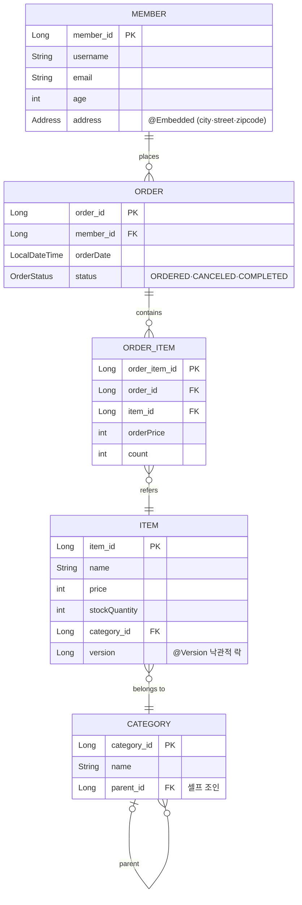
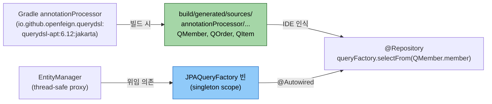
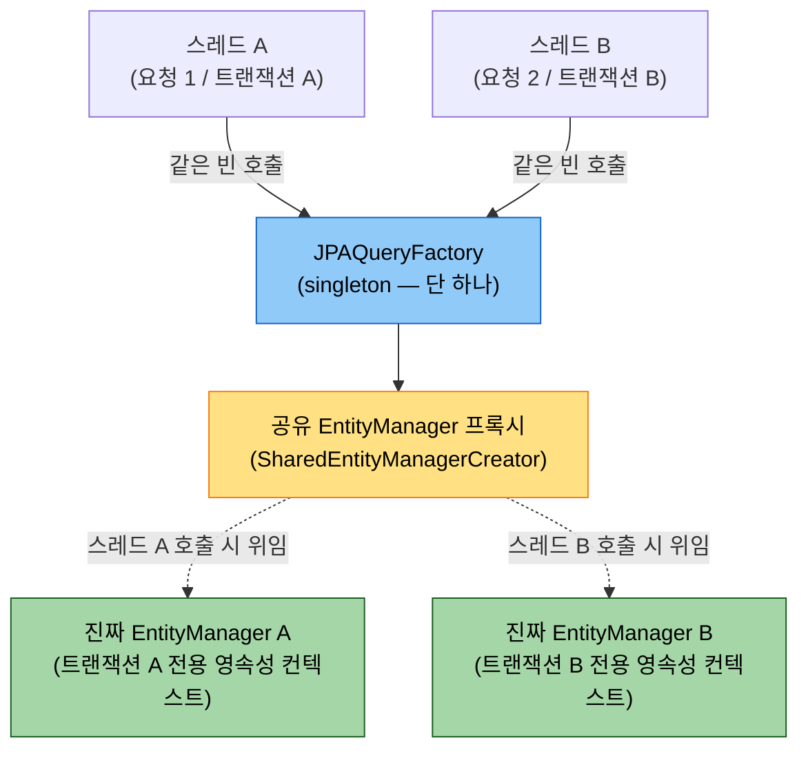

# 프로젝트 셋업 (Gradle 6.12)

---

> **이 문서를 읽고 나면, Spring Boot 3.2.3 + Gradle 8.x 환경에 OpenFeign QueryDSL 6.12 를 좌표·annotationProcessor·Q클래스 경로 세 자리에 맞춰 붙일 수 있고, `JPAQueryFactory` 빈을 singleton 스코프로 등록할 수 있으며, jakarta 분류자 누락·Q클래스 가시성 같은 흔한 함정을 진단할 수 있다.**

Spring Boot 3.2.3 + Gradle 8.x 환경에서 OpenFeign QueryDSL 6.12를 붙이는 표준 설정을 한 호흡으로 정리한다. annotationProcessor 좌표가 jakarta 분류자(`:jakarta`)를 요구하는 점, Q클래스 생성 경로를 IDE에 보이게 만드는 점이 가장 자주 막히는 함정이다.


## 학습 도메인 — 이후 모든 챕터의 공용 엔티티

> 이후 모든 챕터가 공유하는 *Member-Order-Item* 쇼핑몰 도메인을 한 자리에 못 박는다. 각 챕터의 코드 예제가 이 모델을 전제로 동작하므로, 본 절을 한 번 익혀 두면 이후 챕터의 SQL·Q-class 가 바로 읽힌다.

도메인 관계를 한 그림으로 보면 다음과 같다.



- Member 1 : N Order, Order 1 : N OrderItem, OrderItem N : 1 Item, Item N : 1 Category 로 이어지는 사슬이 fetch join·페이징·서브쿼리 모든 챕터의 예제 토대가 된다. 
- Category 는 `parent_id` 로 자기 자신을 참조하는 *셀프 조인* 구조이고, Member 의 주소는 별도 테이블이 아니라 `@Embedded` 값 타입(Address)으로 Member 테이블에 합쳐진다.

> 이후 모든 챕터가 같은 도메인을 재사용한다. 챕터마다 새 엔티티를 만들지 않는다.

쇼핑몰 미니 모델을 쓴다. 회원이 주문을 내고, 주문이 주문 항목을 가지며, 주문 항목이 상품을 가리키고, 상품이 카테고리에 속하는 다섯 엔티티(+ 값 타입 Address)다. 회원의 주소는 별도 테이블이 아니라 `@Embedded` 값 타입으로 Member 안에 들어간다.

```java
// Member.java
@Entity
@Getter @NoArgsConstructor(access = PROTECTED)
public class Member {
    @Id @GeneratedValue
    @Column(name = "member_id")
    private Long id;
    @Column(nullable = false, length = 50)
    private String username;
    @Column(length = 100)
    private String email;
    private int age;
    @Embedded
    private Address address;   // city·street·zipcode (값 타입)
    // ... 빌더 등 생략
}

// Address.java — 값 타입(@Embeddable)
@Embeddable
@Getter @NoArgsConstructor(access = PROTECTED)
public class Address {
    private String city;
    private String street;
    private String zipcode;
}

// Order.java
@Entity @Table(name = "orders")
@Getter @NoArgsConstructor(access = PROTECTED)
public class Order {
    @Id @GeneratedValue
    @Column(name = "order_id")
    private Long id;
    @ManyToOne(fetch = LAZY) @JoinColumn(name = "member_id")
    private Member member;
    @OneToMany(mappedBy = "order", cascade = ALL)
    private List<OrderItem> orderItems = new ArrayList<>();
    private LocalDateTime orderDate;
    @Enumerated(EnumType.STRING) private OrderStatus status;   // ORDERED·CANCELED·COMPLETED
}

// OrderItem.java
@Entity
@Getter @NoArgsConstructor(access = PROTECTED)
public class OrderItem {
    @Id @GeneratedValue
    @Column(name = "order_item_id")
    private Long id;
    @ManyToOne(fetch = LAZY) @JoinColumn(name = "order_id")
    private Order order;
    @ManyToOne(fetch = LAZY) @JoinColumn(name = "item_id")
    private Item item;
    private int orderPrice;
    private int count;
}

// Item.java
@Entity
@Getter @NoArgsConstructor(access = PROTECTED)
public class Item {
    @Id @GeneratedValue
    @Column(name = "item_id")
    private Long id;
    @Column(nullable = false) private String name;
    private int price;
    private int stockQuantity;
    @ManyToOne(fetch = LAZY) @JoinColumn(name = "category_id")
    private Category category;
    @Version private Long version;   // 낙관적 락 (03-05 락과 동시성)
}

// Category.java — 셀프 조인
@Entity
@Getter @NoArgsConstructor(access = PROTECTED)
public class Category {
    @Id @GeneratedValue
    @Column(name = "category_id")
    private Long id;
    @Column(nullable = false) private String name;
    @ManyToOne(fetch = LAZY) @JoinColumn(name = "parent_id")
    private Category parent;   // 자기 참조 (서브쿼리·셀프 조인 연습)
}
```

- `Order` 테이블 이름을 `orders`로 매핑한 이유는 일부 DB(예: PostgreSQL, Oracle)에서 `order`가 예약어이기 때문이다.
- `Address`는 엔티티가 아니라 `@Embeddable` *값 타입*이라 별도 테이블 없이 `member` 테이블의 컬럼(city·street·zipcode)으로 들어간다. QueryDSL 에서는 `member.address.city` 처럼 점으로 접근한다.
- `Item.version`은 `@Version` 낙관적 락 필드로, 락·동시성 챕터(03-05)의 예제 토대가 된다.
- `Category.parent`는 자기 자신을 참조하는 셀프 조인 구조로, 상관 서브쿼리·셀프 조인 예제에 쓰인다.
- 이후 챕터의 모든 예제는 이 도메인을 그대로 가져다 쓴다.


## build.gradle 표준 설정

> 6.12를 붙이는 가장 단순한 형태를 한 번에 보여 준 뒤 줄 단위로 풀이한다.

다음이 Spring Boot 3.2.3 + QueryDSL 6.12 환경의 표준이다. Java 17, Gradle 8.x를 가정한다.

```groovy
// build.gradle
plugins {
    id 'java'
    id 'org.springframework.boot' version '3.2.3'
    id 'io.spring.dependency-management' version '1.1.4'
}

group = 'com.example'
version = '0.0.1'

java {
    sourceCompatibility = '17'
}

ext {
    set('querydslVersion', '6.12')
}

repositories {
    mavenCentral()
}

dependencies {
    implementation 'org.springframework.boot:spring-boot-starter-data-jpa'
    implementation 'org.springframework.boot:spring-boot-starter-web'

    implementation "io.github.openfeign.querydsl:querydsl-jpa:${querydslVersion}"
    annotationProcessor "io.github.openfeign.querydsl:querydsl-apt:${querydslVersion}:jakarta"
    annotationProcessor 'jakarta.annotation:jakarta.annotation-api'
    annotationProcessor 'jakarta.persistence:jakarta.persistence-api'

    compileOnly 'org.projectlombok:lombok'
    annotationProcessor 'org.projectlombok:lombok'

    runtimeOnly 'com.h2database:h2'
    testImplementation 'org.springframework.boot:spring-boot-starter-test'
}

// QueryDSL Q클래스 생성 경로
def querydslDir = "build/generated/sources/annotationProcessor/java/main"

sourceSets {
    main.java.srcDirs += querydslDir
}

tasks.withType(JavaCompile).configureEach {
    options.generatedSourceOutputDirectory = file(querydslDir)
}

clean.doFirst {
    delete file(querydslDir)
}

tasks.named('test') {
    useJUnitPlatform()
}
```

핵심 다섯 줄을 짚어 본다.

1. `set('querydslVersion', '6.12')` — 한 곳에서 버전을 관리해 추후 6.12에서 7.1로 옮길 때 변경 지점을 줄인다.
2. `io.github.openfeign.querydsl:querydsl-jpa` — 런타임 라이브러리. 옛 `com.querydsl:querydsl-jpa`와 헷갈리지 않는다.
3. `querydsl-apt:6.12:jakarta` — Q클래스를 생성하는 어노테이션 프로세서다. **`:jakarta` 분류자가 빠지면 javax 기반으로 동작해 Spring Boot 3에서 컴파일이 깨진다.** 가장 흔한 첫 실수다.
4. `jakarta.annotation-api`, `jakarta.persistence-api` — annotationProcessor가 메타모델을 만들 때 참조하는 jakarta API. 일반 implementation이 아니라 annotationProcessor 의존성이라는 점이 헷갈리기 쉽다.
5. `sourceSets.main.java.srcDirs += querydslDir` — 생성된 Q클래스를 컴파일러가 소스로 인식하게 한다.


## Q클래스가 어디에 생기는가

> 한 번 빌드한 뒤 어떤 파일이 어디에 떨어지는지 눈으로 확인하면 디버깅이 쉬워진다. *Q클래스가 무엇이고 왜 필요한가* 는 [01-01의 "Q클래스란 무엇인가" 절](01-01.QueryDSL%20입문과%206.12의%20위치.md)에 정리되어 있다. 본 절은 *어디에·언제* 만들어지는지에 집중한다.

`./gradlew compileJava`를 실행하면 다음 경로에 Q클래스가 생성된다.

```
build/
└── generated/
    └── sources/
        └── annotationProcessor/
            └── java/
                └── main/
                    └── com/runnershigh/querydsl/domain/
                        ├── QMember.java
                        ├── QOrder.java
                        ├── QOrderItem.java
                        ├── QItem.java
                        ├── QCategory.java
                        └── QAddress.java
```

Q클래스의 첫 줄은 다음과 비슷하다. 잠깐 들여다보면 메타모델이 어떻게 동작하는지 감이 잡힌다.

```java
@Generated("com.querydsl.codegen.DefaultEntitySerializer")
public class QMember extends EntityPathBase<Member> {
    public static final QMember member = new QMember("member1");

    public final NumberPath<Long> id = createNumber("id", Long.class);
    public final StringPath username = createString("username");
    public final StringPath email = createString("email");
    public final NumberPath<Integer> age = createNumber("age", Integer.class);
    public final QAddress address;   // @Embedded 값 타입 → 중첩 Q타입
    // ...
}
```

- `QMember.member`라는 정적 인스턴스가 모든 쿼리의 진입점이다. 
- 이후 챕터에서는 `import static com.example.domain.QMember.member;`로 가져와 짧게 쓴다. 이름이 `member1`인 이유는 같은 엔티티를 한 쿼리에서 두 번 조인해야 할 때(자기 참조 등) 별칭 충돌을 피하기 위함이다.


## IDE에서 Q클래스가 안 보일 때

> Gradle 빌드는 통과하는데 IntelliJ가 빨갛게 표시하는 함정이 있다. 원인 두 가지를 짚는다.

1. **Build/Run 위임 설정 문제.** IntelliJ의 Gradle 설정에서 `Build, Execution, Deployment > Build Tools > Gradle > Build and run using`가 IntelliJ IDEA로 되어 있으면 Q클래스 생성이 누락된다. 위임 대상을 Gradle로 바꾸고, 한 번 `./gradlew clean build`를 돌리면 해소된다.
2. **`generated` 폴더가 소스 루트로 등록되지 않음.** `sourceSets.main.java.srcDirs += querydslDir` 한 줄이 빠지면 IDE가 생성 폴더를 인식하지 못한다. 빌드 후에도 빨간 줄이 그대로면 이 줄을 다시 점검한다.

위 두 항목으로도 해결되지 않으면 `File > Invalidate Caches / Restart`를 한 번 실행한다. 캐시가 꼬여 있는 경우가 의외로 잦다.


## JPAQueryFactory 빈 등록

> QueryDSL 쿼리는 `JPAQueryFactory`라는 단일 진입점에서 시작한다. 빈으로 등록해 의존성 주입을 받는다.

### `JPAQueryFactory` 란

`JPAQueryFactory`는 QueryDSL로 JPA 쿼리를 만들어 주는 *팩토리 객체*다. `queryFactory.selectFrom(member)...` 처럼 모든 QueryDSL 쿼리가 이 객체의 `select` / `selectFrom` 메서드에서 출발한다.

- **무슨 일을 하나** — 호출할 때마다 새 `JPAQuery<T>` 인스턴스를 만들어 돌려준다. 이 `JPAQuery`가 메서드 체이닝(`.where()`, `.join()`, `.fetch()`)으로 쌓이다가 마지막에 JPQL로 번역되어 `EntityManager`를 통해 실행된다. 즉 *QueryDSL 자체는 JPQL을 짜 주는 도구*이고, 실제 DB 통신은 위임받은 `EntityManager`가 맡는다.
- **왜 EntityManager가 필요한가** — `JPAQueryFactory`는 생성자에서 `EntityManager`를 받아 들고 있다(`new JPAQueryFactory(em)`). 완성된 JPQL을 실행하고 결과를 영속성 컨텍스트에 올리는 일은 결국 `EntityManager`의 몫이기 때문이다. `EntityManager`가 무엇이고 영속성 컨텍스트가 어떻게 동작하는지는 [JPA 노트 `01-02.JPA 시작과 영속성 컨텍스트`](../jpa/01-02.JPA%20시작과%20영속성%20컨텍스트.md)에 정리돼 있다.
- **왜 빈으로 두나** — 내부에 상태가 없어(매 쿼리마다 새 `JPAQuery`를 만든다) 한 번 빈으로 등록해 모든 리포지토리가 공유해도 안전하다. 자세한 스레드 안전성 근거는 아래 [§`JPAQueryFactory` 빈 스코프](#jpaqueryfactory-빈-스코프--singleton-vs-request) 절에서 다룬다.

`EntityManager`를 주입받는 방법은 두 가지다. 메서드 파라미터로 받으면 Spring이 컨테이너에서 `EntityManager` 빈을 주입한다. 또는 필드에 `@PersistenceContext`로 받아도 된다.

### `@PersistenceContext` 란

`@PersistenceContext`는 JPA 표준(`jakarta.persistence` 패키지)이 정의한 `EntityManager` 주입 어노테이션이다. 

- 스프링 전용 `@Autowired`와 목적은 비슷하지만 출처가 다르다. 
- `@Autowired`는 스프링 컨테이너에 등록된 빈을 찾아 꽂는 반면, `@PersistenceContext`는 JPA 스펙이 규정한 방식으로 *현재 영속성 컨텍스트에 묶인* `EntityManager`를 주입한다.  그래서 JPA 표준만 쓰는 코드(스프링 비의존)에서도 동작한다.

여기서 주입되는 것은 진짜 `EntityManager`가 아니라 스프링이 감싼 *공유 프록시*다. 

- 왜 프록시냐면, `EntityManager` 자체는 1차 캐시·영속성 컨텍스트를 들고 있어 스레드 안전하지 않기 때문이다. 
- 프록시는 메서드가 실제로 호출되는 시점에 *현재 트랜잭션의 진짜 `EntityManager`*를 찾아 위임한다. 덕분에 빈을 하나만 등록해도 요청·트랜잭션마다 올바른 `EntityManager`가 자동으로 연결된다(상세 메커니즘은 아래 [§`@PersistenceContext` 프록시 메커니즘](#persistencecontext-프록시-메커니즘) 절).

```java
@Configuration
public class QueryDslConfig {

    @Bean
    public JPAQueryFactory jpaQueryFactory(EntityManager em) {
        return new JPAQueryFactory(em);
    }
}
```

```java
@Configuration
public class QueryDslConfig {

    @PersistenceContext
    private EntityManager em;

    @Bean
    public JPAQueryFactory jpaQueryFactory() {
        return new JPAQueryFactory(em);
    }
}
```

- 두 방식의 결과는 같다. 다만 테스트에서 `@PersistenceContext`보다 메서드 파라미터 방식이 모킹하기 쉽다. 본 묶음은 메서드 파라미터 방식을 표준으로 잡는다.

- `JPAQueryFactory`는 스레드 안전하다. 한 번 빈으로 등록해 두면 모든 리포지토리에서 공유해 써도 무방하다. 내부적으로 매 쿼리마다 새 `JPAQuery` 인스턴스를 만들기 때문에 상태가 누수되지 않는다.


## 첫 쿼리로 셋업 검증

> 설정이 끝났는지 확인하는 가장 빠른 방법은 짧은 쿼리 하나를 돌려 보는 것이다.

```java
@SpringBootTest
@Transactional
class QuerydslSmokeTest {

    @Autowired EntityManager em;
    @Autowired JPAQueryFactory queryFactory;

    @Test
    void Q클래스가_쿼리에_사용된다() {
        em.persist(Member.builder()
                .username("alice")
                .email("alice@example.com")
                .age(30)
                .address(new Address("Seoul", "Gangnam-daero 1", "06000"))
                .build());
        em.flush();
        em.clear();

        Member result = queryFactory
                .selectFrom(member)
                .where(member.username.eq("alice"))
                .fetchOne();

        assertThat(result.getUsername()).isEqualTo("alice");
    }
}
```

- 이 테스트가 통과하면 다음 네 가지가 모두 정상이다. annotationProcessor가 동작했고, Q클래스가 생성됐고, IDE가 Q클래스를 인식하며, `JPAQueryFactory` 빈이 컨텍스트에 올라왔다는 뜻이다. 
- 어느 한 단계가 빠지면 실패가 다른 모양으로 나오니, 셋업 직후 한 번 돌려 보는 습관을 들인다.


## 자주 마주치는 빌드 에러

> 처음 6.12를 붙일 때 9할은 다음 세 메시지 중 하나에서 막힌다.

| 에러 메시지 | 진짜 원인 | 해결 |
|------------|----------|------|
| `cannot find symbol: class QMember` | annotationProcessor가 동작 안 함 | `:jakarta` 분류자, jakarta.persistence-api annotationProcessor 누락 점검 |
| `package javax.persistence does not exist` | 옛 좌표(`com.querydsl`) 또는 javax-classifier 사용 | OpenFeign 좌표로 교체, `:jakarta` 분류자 명시 |
| IntelliJ만 빨간 줄, `./gradlew build`는 통과 | IDE 위임 설정·소스 루트 등록 문제 | Build delegate를 Gradle로, `srcDirs` 등록 |

본 표를 한 번 본 뒤에도 같은 에러가 반복되면 `./gradlew clean compileJava --info`로 어떤 어노테이션 프로세서가 등록되는지 출력해 본다. 등록된 프로세서 목록에 `JPAAnnotationProcessor`가 없으면 좌표 문제다.


## `JPAQueryFactory` 빈 스코프 — singleton vs request

> `JPAQueryFactory` 자체는 *stateful 한 EntityManager 를 위임 의존* 하지만, EntityManager 는 thread-safe proxy 로 주입되므로 빈을 singleton 으로 등록해도 안전하다. request 스코프는 *불필요한 객체 생성 비용* 만 추가한다.

annotationProcessor → Q클래스 → JPAQueryFactory 빈 → 쿼리 작성으로 이어지는 셋업 흐름을 한 그림으로 보면 다음과 같다.



본격적인 설명에 앞서 용어 세 개를 일상 비유로 깔아 둔다. 이 절이 어렵게 느껴지는 이유는 대개 *singleton·프록시·스레드 안전성* 이라는 단어가 한꺼번에 쏟아지기 때문이다.

- **singleton(싱글톤)** — 애플리케이션 전체에서 *딱 하나만* 만들어 모두가 공유하는 객체. 식당으로 치면 *주방장 한 명*. 손님(요청)이 100명이 와도 주방장은 한 명이다.
- **스레드(thread)** — 동시에 들어오는 *요청 한 줄기*. 손님 100명이 동시에 주문하면 스레드 100개가 동시에 같은 주방장을 부른다.
- **스레드 안전하지 않다** — 여러 손님이 *같은 도마 하나* 를 동시에 쓰면 재료가 섞여 주문이 엉킨다. JPA 의 `EntityManager` 가 바로 이 *도마* 다 — 1차 캐시·영속성 컨텍스트라는 작업판을 들고 있어 동시에 여럿이 쓰면 안 된다.

여기서 핵심 질문이 나온다. **주방장(JPAQueryFactory)을 한 명만 두는 건 좋은데, 그 주방장이 도마(EntityManager)도 하나만 들고 있으면 동시 주문이 섞이지 않을까?** 이 절은 그 질문에 "안 섞인다, 왜냐하면 그 도마가 사실은 *손님마다 진짜 도마로 바꿔 주는 마법 도마(프록시)* 이기 때문" 이라고 답한다.

위 빈 등록 예제는 `JPAQueryFactory` 를 *기본 스코프(singleton)* 으로 등록한다. 이 선택은 Spring Boot 환경에서 *대부분 안전* 하지만, 무엇 때문에 안전한지 / 어떤 경우에 무너지는지를 짚고 가야 한다.

### 왜 singleton 이 안전한가

`JPAQueryFactory` 자체는 *내부 상태가 없다*. 생성자에서 받은 `EntityManager` 를 들고만 있고, 매 쿼리 호출마다 새 `JPAQuery<T>` 인스턴스를 만들어 돌려준다. 여러 스레드가 같은 `JPAQueryFactory` 를 동시에 호출해도 *서로 다른 JPAQuery 인스턴스* 를 받아 각자 작업한다.

문제는 `EntityManager` 다. JPA 의 `EntityManager` 는 *스레드 안전하지 않다* — 영속성 컨텍스트 / 1차 캐시가 있어 동시 접근이 위험. 그런데 singleton `JPAQueryFactory` 에 *어떤 EntityManager* 를 박아 두는지가 핵심.

```java
@Bean
public JPAQueryFactory jpaQueryFactory(EntityManager em) {  // ← 어떤 em?
    return new JPAQueryFactory(em);
}
```

- 위 코드에서 주입되는 `em` 은 Spring 이 *프록시* 로 감싼 *공유 EntityManager*. 
- 실제 호출 시점에 프록시가 *현재 트랜잭션의 EntityManager* 로 위임한다 — 즉 *요청별 EntityManager* 가 자연스럽게 해결된다. 이게 Spring 의 핵심 마법.

그림으로 보면, 스레드 A·B 가 동시에 *같은 singleton 주방장* 을 부르고 *같은 마법 도마(프록시)* 를 잡지만, 마법 도마가 각자 *자기 트랜잭션의 진짜 도마* 로 갈라 준다. 그래서 진짜 작업판은 끝까지 섞이지 않는다.



요점은 *공유되는 것(주방장·마법 도마)* 과 *갈라지는 것(진짜 도마)* 을 구분하는 데 있다. singleton 으로 공유돼도 안전한 이유는 정작 위험한 부품(진짜 `EntityManager`)이 프록시 뒤에서 스레드마다 갈라지기 때문이다.

### `@PersistenceContext` 프록시 메커니즘

```java
@Configuration
public class QueryDslConfig {

    @PersistenceContext           // ← 일반 @Autowired EntityManager 와 동일
    private EntityManager em;

    @Bean
    public JPAQueryFactory jpaQueryFactory() {
        return new JPAQueryFactory(em);  // ← 프록시 EntityManager 가 박힘
    }
}
```

- `@PersistenceContext` (또는 그냥 `EntityManager` 주입) 가 만드는 객체는 *진짜 EntityManager* 가 아니라 *Spring 의 SharedEntityManagerCreator 프록시*. 
- 실제 메서드 호출 시점에 `TransactionSynchronizationManager` 에서 현재 트랜잭션의 진짜 EntityManager 를 찾아 위임한다.

결과: singleton `JPAQueryFactory` 가 *요청별 트랜잭션의 EntityManager* 를 자동으로 본다. 명시적 request scope 불필요.

### 함정 — `new JPAQueryFactory(em)` 의 변종 패턴

다음 두 변종은 위 마법을 깨뜨린다.

```java
// ✗ 변종 1 — 트랜잭션 없는 컨텍스트에서 em 을 새로 만들어 박음
@Bean
public JPAQueryFactory jpaQueryFactory(EntityManagerFactory emf) {
    return new JPAQueryFactory(emf.createEntityManager());  // ← 매번 새 em
}
```

`emf.createEntityManager()` 가 매번 *새 EntityManager* 를 만들어 돌려준다. 이 em 은 Spring 의 트랜잭션 관리 밖이라 *영속성 컨텍스트가 요청과 분리* 된다. 같은 트랜잭션의 다른 JPA repository 호출과 *EntityManager 가 달라서* `entity.collection.size()` 같은 lazy 호출이 깨진다.

```java
// ✗ 변종 2 — prototype 스코프
@Bean
@Scope(BeanDefinition.SCOPE_PROTOTYPE)
public JPAQueryFactory jpaQueryFactory(EntityManager em) {
    return new JPAQueryFactory(em);
}
```

prototype 으로 매 호출마다 새 인스턴스를 만든다. *EntityManager 는 같은 프록시* 라 동작은 하지만 *불필요한 객체 생성* — singleton 이 충분.

### request scope 가 필요한 자리

대부분 환경에서 request scope 는 불필요. 다만 다음 두 시나리오에서 검토할 수 있다.

1. **Reactive 환경 (`spring-webflux`)** — `EntityManager` 의 ThreadLocal 가정이 무너진다. `JPAQueryFactory` 와 JPA 조합 자체가 권장되지 않는 환경. 사용하려면 명시적 컨텍스트 전달 필요.
2. **CompletableFuture / 별도 스레드 풀에서 JPA 호출** — `@Async` 메서드 안에서 JPA 호출은 *새 트랜잭션* 이 시작되거나 부모 트랜잭션과 분리되는데, Spring 의 트랜잭션 propagation 정책이 잘못 잡혀 있으면 EntityManager 가 따라가지 않는다. JPAQueryFactory 자체는 문제가 없지만 *호출 측의 트랜잭션 경계* 점검 필요.

### 한눈 요약 — 네 가지 빈 등록 패턴

위 내용을 한 표로 압축한다. 결론은 *기본 singleton + 프록시 EntityManager* 가 정답이고, 나머지는 불필요하거나 위험하다는 것이다.

| 패턴 | 안전? | 한 줄 이유 |
|------|------|-----------|
| **singleton + 주입 `EntityManager`** (표준) | ✅ | EntityManager 가 프록시라 호출 시점에 트랜잭션별 진짜 EM 으로 위임 |
| `prototype` 스코프 | ⚠️ 동작은 함 | EM 은 같은 프록시라 깨지진 않지만 매번 새 인스턴스 — 불필요한 비용 |
| `request` 스코프 | ⚠️ 대개 불필요 | 표준 singleton 으로 충분. Reactive·`@Async` 같은 특수 상황에서만 검토 |
| `new JPAQueryFactory(emf.createEntityManager())` | ❌ | 트랜잭션 밖 새 EM — 다른 JPA 호출과 영속성 컨텍스트가 달라 lazy 가 깨짐 |

### 자기점검 — singleton + 공유 em 프록시 정상 동작 확인

위 § "스모크 테스트" 의 코드가 통과하면 *프록시 EntityManager* 가 정상 동작 중이다. 추가로 한 단계 확인하려면 다음 테스트를 더한다.

```java
@SpringBootTest
@Transactional
class JPAQueryFactoryScopeTest {

    @Autowired JPAQueryFactory queryFactory;
    @Autowired EntityManager entityManager;

    @Test
    void factoryAndEmShareSameSession() {
        // QueryDSL 로 저장한 엔티티를 같은 트랜잭션에서 JPA 로 조회 가능해야 함
        // (같은 EntityManager / 영속성 컨텍스트 공유 증거)
        entityManager.persist(Member.builder()
                .username("alice").email("u@b.com").age(30)
                .address(new Address("Seoul", "Gangnam-daero 1", "06000"))
                .build());
        Long count = queryFactory.select(QMember.member.count()).from(QMember.member).fetchOne();
        assertThat(count).isEqualTo(1L);
    }
}
```

같은 트랜잭션 안에서 JPA `persist` 와 QueryDSL `select` 가 *같은 영속성 컨텍스트* 를 본다면 프록시 메커니즘이 정상 동작. 변종 1 같이 새 em 을 만들었다면 이 테스트가 `0` 을 반환하며 실패한다.


## 면접에서 받을 만한 질문

> 셋업은 코드 작성보다 함정이 많다. 답을 입으로 한 번 말해 둔다.

1. `:jakarta` 분류자가 왜 필요한가?
   - 답 요지: OpenFeign fork의 `querydsl-apt`는 javax용과 jakarta용 두 변형을 함께 배포한다. Spring Boot 3는 jakarta를 쓰므로 분류자로 명시하지 않으면 javax 변형이 잡혀 컴파일 단계부터 패키지를 못 찾는다.
2. Q클래스가 생기는 정확한 경로는?
   - 답 요지: `build/generated/sources/annotationProcessor/java/main` 아래 엔티티와 같은 패키지로 생성된다. Gradle 표준 경로이며, IDE도 같은 위치를 보아야 한다.
3. `JPAQueryFactory`를 빈으로 두는 게 안전한가?
   - 답 요지: 안전하다. 내부 상태가 없고 매 쿼리마다 새 `JPAQuery`를 만들어 반환하기 때문에 멀티 스레드 환경에서 공유해도 문제가 없다.
4. `clean.doFirst { delete file(querydslDir) }`를 왜 두는가?
   - 답 요지: 엔티티 컬럼이 바뀌면 옛 Q클래스가 남아 컴파일이 깨질 수 있다. clean 단계에서 명시적으로 지워 새 빌드 결과만 남게 한다.


## 관련 문서

> 본 셋업 문서가 묶음 내 다른 챕터와 어떻게 연결되는지. 좌표 배경은 01-01, 본격 문법은 01-03, 멀티 모듈 Q클래스 가시성은 03-02 로 이어진다.

- [01-01. QueryDSL 입문과 6.12의 위치](01-01.QueryDSL%20입문과%206.12의%20위치.md) — 좌표가 두 개 떠다니는 이유
- [01-03. 기본 문법과 조인](01-03.기본%20문법과%20조인.md) — 셋업 후 첫 쿼리들
- [03-02. 테스트와 멀티모듈](03-02.테스트와%20멀티모듈.md) — `@DataJpaTest` 환경에서 `JPAQueryFactory` 주입과 모듈 간 Q클래스 가시성
- [Spring Boot Gradle Plugin 공식 문서](https://docs.spring.io/spring-boot/docs/3.2.3/gradle-plugin/reference/htmlsingle/)
