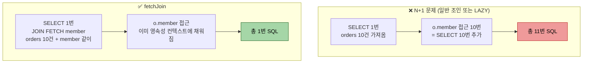
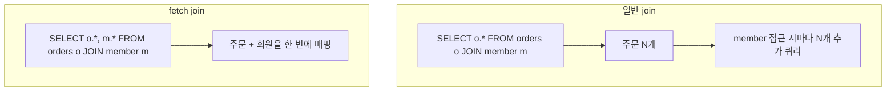

# 기본 문법과 조인

---

> **이 문서를 읽고 나면, `JPAQueryFactory.select/from/where/join` 의 메서드 체인이 어떤 SQL 로 변환되는지 그릴 수 있고, 일반 조인과 페치 조인의 결정적 차이(SQL 결과 컬럼 수 vs 영속성 그래프 채움)를 구분하며, `QMember("memberSub")` 같은 별칭 충돌 회피 패턴을 적용할 수 있다.**

`JPAQueryFactory`로 첫 쿼리를 짜는 방법부터, 일반 조인과 페치 조인의 결정적 차이까지 짚는다. SQL을 한 줄씩 떠올리면서 메서드 체인이 무엇으로 변환되는지 머릿속에서 그리는 훈련이 핵심이다.


## 진입점은 JPAQueryFactory 하나다

> 모든 QueryDSL 쿼리는 `JPAQueryFactory`에서 시작한다. 다른 진입점은 없다.

리포지토리의 시작 형태는 다음과 같다.

```java
@Repository
@RequiredArgsConstructor
public class MemberQueryRepository {

    private final JPAQueryFactory queryFactory;

    public List<Member> findAll() {
        return queryFactory
                .selectFrom(member)
                .fetch();
    }
}
```

- `selectFrom(member)`는 `select(member).from(member)`의 단축이다. 
- 같은 엔티티를 select와 from에 동시에 두는 흔한 경우를 짧게 쓰기 위한 편의 메서드다. select와 from 대상이 다르면 `select(...).from(...)`로 풀어 써야 한다.

`member`는 `QMember.member`의 정적 임포트다. 본 챕터의 모든 코드 블록은 다음 두 줄을 생략한다.

```java
import static com.runnershigh.querydsl.domain.QMember.member;
import static com.runnershigh.querydsl.domain.QOrder.order;
```


## select / where / orderBy 기본 골격

> SQL을 알고 있다면 70%는 직관적이다. 나머지 30%만 짚는다.

다음 쿼리는 "20세 이상의 회원을 이름 오름차순으로 조회하되 상위 10명만"을 표현한다.

```java
List<Member> result = queryFactory
        .selectFrom(member)
        .where(member.age.goe(20))
        .orderBy(member.username.asc())
        .limit(10)
        .fetch();
```

`goe`는 "greater or equal"이다. 비교 메서드 이름이 SQL 어휘와 다른 점이 첫 진입 장벽이다.

| QueryDSL | SQL |
|---------|-----|
| `eq` | `=` |
| `ne` | `<>` |
| `gt` / `goe` | `>` / `>=` |
| `lt` / `loe` | `<` / `<=` |
| `between(a, b)` | `between a and b` |
| `in(a, b, c)` | `in (a, b, c)` |
| `isNull` / `isNotNull` | `is null` / `is not null` |
| `like("%kim%")` | `like` (와일드카드 직접 명시) |
| `contains("kim")` | `like '%kim%'` (와일드카드 자동) |
| `startsWith("kim")` | `like 'kim%'` |

- 비교 메서드를 외우기보다, 헷갈릴 때 IDE 자동완성으로 메서드 이름을 훑는 습관이 빠르다. `member.age.`까지 입력하면 IDE가 사용 가능한 메서드를 모두 보여 준다.


## fetch 메서드 다섯 가지

> 쿼리를 끝맺는 메서드가 다섯 종류 있다. 의도가 다르므로 헷갈리면 버그가 된다.

```java
.fetch()         // List<T> — 0개 이상
.fetchOne()     // T — 정확히 1개. 0개면 null, 2개 이상이면 NonUniqueResultException
.fetchFirst()   // T — limit(1) + fetchOne. 첫 번째 한 건만
  
// dprecated  
.fetchCount()   // long — 별도 카운트 쿼리 실행 (deprecated, 6.x 후반부터 권장 안 함)
.fetchResults() // QueryResults<T> — 콘텐츠와 카운트 동시 (deprecated)
```

- `fetchCount`와 `fetchResults`가 deprecated인 이유는 카운트 쿼리를 자동 생성하는 동작이 페치 조인과 만나면 의도와 어긋나기 때문이다. 실제 프로덕션에서는 다음 두 패턴을 쓴다.

```java
// 카운트만 필요할 때
Long total = queryFactory
        .select(member.count())
        .from(member)
        .where(member.age.goe(20))
        .fetchOne();

// 페이지 정보 + 콘텐츠
List<Member> content = queryFactory
        .selectFrom(member)
        .where(member.age.goe(20))
        .offset(0)
  			.limit(10)
        .fetch();
```

- 페이징 시 카운트 쿼리를 분리하는 이유와 `PageableExecutionUtils` 사용은 01-06에서 다룬다.


## 일반 조인과 leftJoin

> SQL과 1:1로 대응된다. 다만 조건의 위치가 한 군데 헷갈린다.

주문과 회원을 inner join하고, 회원 이름이 "user_00001"인 주문만 조회한다.

```java
List<Order> result = queryFactory
        .selectFrom(order)
        .join(order.member, member)
        .where(member.username.eq("user_00001"))
        .fetch();
```

- `join(order.member, member)`은 두 인자를 받는다. 
- 첫 인자(`order.member`)는 조인할 연관 경로, 둘째(`member`)는 별칭으로 쓸 Q타입 인스턴스다. 별칭이 있어야 `where`나 `select`에서 회원 컬럼에 접근할 수 있다.

leftJoin은 `leftJoin(...)` 한 단어만 바꾸면 된다.

```java
List<Tuple> result = queryFactory
        .select(order, member)
        .from(order)
        .leftJoin(order.member, member)
        .fetch();
```

leftJoin은 회원이 없는 주문도 결과에 포함되며, 그 경우 튜플의 `member` 위치가 null로 나온다.

### on 절로 조인 조건 추가

조인 자체에 추가 조건을 걸고 싶을 때는 `on`을 붙인다. 예를 들어 "회원이 있되 나이가 20세 이상인 회원과만 조인한다"는 다음과 같다.

```java
List<Tuple> result = queryFactory
        .select(order, member)
        .from(order)
        .leftJoin(order.member, member).on(member.age.goe(20))
        .fetch();
```

- `on`을 `where`에 둔 것과 결과가 다르다. `on`은 조인 단계에서 필터링하므로 주문 전체가 결과에 남고 매칭되지 않은 회원은 null로 나온다. 
- `where`로 옮기면 inner join처럼 주문 자체가 결과에서 빠진다. SQL의 `LEFT JOIN ... ON ...`과 같은 의미다.

### 조인 메서드 한눈에 보기 — 종류와 오버로딩

QueryDSL `JPAQuery` 의 조인 메서드는 *다섯 종류* 이고, 각각 *두 가지 오버로딩* 을 가진다. 여기에 `fetchJoin()` 수식어가 더해져 헷갈리기 쉬우므로 한 자리에 모은다.

#### 다섯 가지 조인 메서드

| 메서드 | 번역되는 SQL | 의미 |
|--------|-------------|------|
| `join(...)` | `INNER JOIN` | 양쪽 다 매칭되는 행만. `innerJoin` 의 별칭 — 완전히 같다 |
| `innerJoin(...)` | `INNER JOIN` | 위와 동일. 명시적으로 inner 임을 드러내고 싶을 때 |
| `leftJoin(...)` | `LEFT OUTER JOIN` | 왼쪽(from) 전부 + 매칭 안 되면 오른쪽 null |
| `rightJoin(...)` | `RIGHT OUTER JOIN` | 오른쪽 전부 + 매칭 안 되면 왼쪽 null |

> `join` 과 `innerJoin` 은 *이름만 다른 같은 메서드* 다. 둘 다 INNER JOIN 으로 번역된다. 팀 컨벤션에 따라 하나로 통일해 쓰면 된다.

#### 각 메서드의 두 가지 오버로딩

같은 `join`/`leftJoin` 이라도 *인자를 어떻게 주느냐* 에 따라 두 갈래로 나뉜다.

```java
// 오버로딩 A — 연관 경로 조인 (매핑된 FK 관계를 따라감)
//   ON 절이 매핑 정보로 자동 생성된다. 가장 흔한 형태.
queryFactory.selectFrom(order)
    .join(order.member, member)     // order.member = 연관 경로, member = 별칭
    .fetch();

// 오버로딩 B — 엔티티 루트 조인 (관계 없이 임의 조건으로, theta join)
//   ON 으로 조인 조건을 직접 명시해야 한다.
queryFactory.selectFrom(order)
    .join(member).on(order.member.eq(member))   // 관계 매핑 없이 조건 수동
    .fetch();
```

A는 엔티티에 `@ManyToOne` / `@OneToMany` 로 *매핑된 연관관계를 따라가는* 경우다. B는 *매핑이 없는 두 엔티티를 임의 조건으로* 붙일 때(연관관계 없는 조인, theta join) 쓴다. 실무의 9할은 A이고, B는 매핑되지 않은 엔티티를 조건만으로 엮어야 할 때만 등장한다.

#### `fetchJoin()` 은 별도 메서드가 아니다

가장 흔한 오해 — `fetchJoin` 은 `join` 과 나란한 독립 메서드가 *아니라*, join 호출 뒤에 붙이는 *수식어* 다.

```java
queryFactory.selectFrom(order)
    .join(order.member, member).fetchJoin()   // ← join + .fetchJoin() 체이닝
    .fetch();
```

`fetchJoin()` 은 *바로 앞의 조인* 을 "연관 엔티티를 영속성 컨텍스트까지 한 번에 채우는 조인"으로 승격시킨다. 그래서 `innerJoin().fetchJoin()`, `leftJoin().fetchJoin()` 모두 가능하다 — inner 든 left 든 거기에 fetch 의미를 더하는 것뿐이다. fetchJoin 의 동작·함정은 다음 절에서 따로 깊이 다룬다.

#### JPA 에서 `rightJoin` 주의

`rightJoin` 은 문법상 존재하지만 *JPA 실무에서는 거의 쓰지 않는다*. JPQL 의 연관 경로 조인은 "from 쪽 엔티티에서 연관을 따라가는" 방향이 자연스러워서, 같은 결과를 `leftJoin` 으로 방향만 바꿔 표현하는 편이 읽기 쉽다. right join 이 떠오르면 대개 *from 절의 주체를 바꾸고 leftJoin 으로 재작성* 하는 게 정석이다.


## fetchJoin — N+1을 막는 핵심 무기

> 일반 조인과 글자 하나(`fetchJoin()`)만 다르지만 동작은 완전히 다르다.

N+1 문제와 fetch join 의 차이를 SQL 횟수로 보면 다음과 같다.



`fetchJoin()` 의 한 글자 차이가 *SQL 11번 → 1번* 으로 줄인다. 주문과 주문을 낸 회원을 한 쿼리로 가져와 N+1 문제를 막는다.

```java
List<Order> result = queryFactory
        .selectFrom(order)
        .join(order.member, member).fetchJoin()
        .fetch();
```

- 일반 `join`만 쓰면 SQL은 inner join을 하지만, JPA는 결과를 매핑할 때 주문 엔티티만 만들고 `Member`는 프록시로 둔다. 이후 
- `order.getMember().getUsername()`을 호출하면 추가 쿼리가 나간다(N+1). `fetchJoin`을 붙이면 한 번의 SQL로 주문과 회원을 동시에 채운다.



> 다이어그램 풀이: 일반 join은 SQL은 한 번이지만 영속성 컨텍스트에 회원이 채워지지 않아 추가 쿼리가 발생한다. fetch join은 SELECT 절에 회원 컬럼까지 포함해 한 번에 모든 컬럼을 가져온다.

- fetch join은 강력하지만 페이징과 만나면 함정이 생긴다. 페이지+컬렉션 페치 조인에서 발생하는 `HHH000104` 경고는 01-06에서 깊이 다룬다. 본 챕터에서는 "일반 조인과 다르다"는 점만 기억한다.

### `join().fetchJoin()` 인자 순서 함정

`fetchJoin()` 은 *바로 앞의 `join` 호출* 에만 적용된다. 메서드 체이닝의 위치를 잘못 두면 *조용히 일반 join 으로 동작* 한다 — 컴파일 에러가 안 나고 SQL 도 비슷해 보여 발견이 늦다.

```java
// ✗ 의도와 다르게 동작 — orderItems 만 fetchJoin, member 는 일반 join
List<Order> bad = queryFactory.selectFrom(order)
    .join(order.member, member)
    .join(order.orderItems, orderItem).fetchJoin()  // ← orderItems 만 fetchJoin
    .where(member.id.eq(1L))
    .fetch();
```

위 코드는 `member` 도 *프록시* 로 남아 이후 `order.getMember().getUsername()` 호출이 N+1 을 일으킨다. `fetchJoin()` 이 *바로 직전* 의 `join(order.orderItems, orderItem)` 에만 붙기 때문이다.

```java
// ✓ 두 join 모두 fetchJoin
List<Order> good = queryFactory.selectFrom(order)
    .join(order.member, member).fetchJoin()             // ← member fetchJoin
    .join(order.orderItems, orderItem).fetchJoin()      // ← orderItems fetchJoin
    .where(member.id.eq(1L))
    .fetch();
```

규칙: *fetchJoin 하고 싶은 모든 join 뒤에 `.fetchJoin()` 을 붙인다*. 한 번에 묶을 수 없다.

### 컬렉션 fetchJoin 의 데카르트 곱 함정

`@OneToMany` 또는 `@ManyToMany` 같은 *컬렉션 연관* 을 fetchJoin 할 때, 결과 행이 *컬렉션 크기만큼 증식* 한다.

```java
List<Order> orders = queryFactory.selectFrom(order)
    .join(order.items, item).fetchJoin()   // ← items 가 컬렉션
    .fetch();
```

한 주문이 3 개의 아이템을 가지면 SQL 결과는 *주문 3 행* (각 행이 같은 주문 + 다른 아이템). JPA 가 같은 주문 엔티티에 *같은 인스턴스* 를 반환하지만, *결과 List 의 크기* 는 부풀려진 그대로다.

해결 두 가지:
- `distinct()` 추가 — `selectFrom(order).distinct().join(order.items, item).fetchJoin()...`
- 두 단계 쿼리 — 주문 PK 만 페이지로 가져오고 아이템은 별도 쿼리로

페이징과 결합되면 `HHH000104` 경고와 함께 *메모리에서 페이징* 으로 빠진다. 자세한 내용과 해결 패턴은 [01-06. 페이징과 fetch join 함정](01-06.페이징과%20fetch%20join%20함정.md) 이 깊이 다룬다.


## 집계 — count, sum, avg, max, min

> 집계 함수는 메서드 호출로 표현하고, 결과는 `Tuple` 또는 단일 값으로 받는다.

도시별 회원 수와 평균 나이를 구한다. `member.address.city`는 `@Embedded` 값 타입 컬럼이라 별도 조인 없이 그대로 `groupBy` 에 쓸 수 있다.

```java
List<Tuple> result = queryFactory
        .select(member.address.city, member.count(), member.age.avg())
        .from(member)
        .groupBy(member.address.city)
        .having(member.count().goe(2L))
        .fetch();

for (Tuple row : result) {
    String city = row.get(member.address.city);
    Long count = row.get(member.count());
    Double avgAge = row.get(member.age.avg());
}
```

`Tuple`은 컬럼 위치가 아니라 표현식 자체로 값을 꺼낸다. `row.get(0)`이 아니라 `row.get(member.address.city)`이다. SQL의 별칭 인덱싱과 다른 점이다. 컬럼 순서가 바뀌어도 `get` 호출이 깨지지 않는 장점이 있는 대신, DTO로 곧장 받는 방식이 더 안전하다. DTO 매핑은 01-05에서 다룬다.

### `member.count()` 는 어디서 세는가 — `Stream.count()` 와의 차이

회원 수를 셀 때 두 방식이 있는데, *세는 주체가 DB냐 JVM이냐* 가 결정적으로 다르다.

```java
// ① QueryDSL — DB가 센다. SQL: select count(member.id) from member
long a = queryFactory.select(member.count()).from(member).fetchOne();

// ② Java Stream — 1000건을 전부 메모리로 가져온 뒤 JVM이 센다
long b = queryFactory.selectFrom(member).fetch().stream().count();
```

①의 `member.count()`는 *집계를 DB에 위임* 한다. SQL `count()`로 번역되어 DB가 센 숫자 하나만 돌려받으므로 네트워크로 오가는 데이터가 거의 없다. 반면 ②의 `stream().count()`는 *행 전체를 일단 다 가져온 뒤* JVM 메모리에서 요소를 하나씩 센다. 1,000건이면 1,000건을 모두 끌어오므로 행 수만 필요한 상황에서는 메모리·네트워크 낭비다. 표로 대비하면 다음과 같다.

| 구분 | `member.count()` (QueryDSL) | `stream().count()` (Java Stream) |
|------|---------------------------|----------------------------------|
| 세는 위치 | DB 안 (`SELECT count(...)`) | JVM 메모리 안 |
| 가져오는 데이터 | 숫자 1개 | 행 전체 |
| 반환 타입 | `NumberExpression<Long>` (쿼리 조각) | `long` (즉시 값) |
| 대량 데이터 | 유리 | 불리 (전부 로드) |

결론: *행 수만 필요하면 항상 `member.count()`*. `stream().count()`는 이미 어떤 이유로 엔티티 목록을 메모리에 들고 있고 그 개수만 추가로 셀 때나 의미가 있다.

### `count()` vs `countDistinct()` — 중복을 빼고 셀 때

`member.count()` 가 *행 전체 개수* 를 센다면, `member.countDistinct()` 는 *중복을 제거한 고유 값의 개수* 를 센다. SQL의 `count(*)` 와 `count(distinct ...)` 의 차이 그대로다.

```java
// 전체 행 수 — SQL: select count(member.id) from member
Long total = queryFactory.select(member.count()).from(member).fetchOne();

// 고유 도시 수 — SQL: select count(distinct member.address.city) from member
Long cityKinds = queryFactory
        .select(member.address.city.countDistinct())
        .from(member)
        .fetchOne();
```

위 두 결과가 *언제 갈라지는가* 가 핵심이다. 1,000명이 4개 도시에 흩어져 있다면 `count()`는 `1000`, `city.countDistinct()`는 `4`를 돌려준다.

- **`count()`** — "회원이 몇 명인가"처럼 *행을 세는* 질문에.
- **`countDistinct()`** — "회원들이 사는 도시는 몇 종류인가"처럼 *중복을 걷어낸 종류 수* 를 묻는 질문에.

주의할 점 하나 — 조인으로 행이 뻥튀기되는 상황에서 `countDistinct()` 가 특히 쓸모 있다. 예를 들어 회원과 주문을 조인하면 주문이 여러 건인 회원은 결과 행에 여러 번 나타나는데, 이때 *순수한 회원 수* 를 세려면 `member.id.countDistinct()` 로 중복을 제거해야 `member.count()` 의 부풀려진 숫자를 피할 수 있다. (조인과 데카르트 곱 함정은 위 fetchJoin 절 참고.)

> `member.countDistinct()` 는 엔티티의 *식별자(PK) 기준 distinct* 로 동작한다. 특정 컬럼의 고유값을 세려면 `member.address.city.countDistinct()` 처럼 *컬럼 경로에* `.countDistinct()` 를 붙인다.

### `fetchOne()` 의 nullable 함정 — count 결과를 `long` 에 담을 때 NPE 경고

위 ① 코드를 IDE에 넣으면 *언박싱 NullPointerException 가능성* 경고가 뜬다. 이유는 `fetchOne()` 의 반환 타입에 있다.

```java
long total = queryFactory.select(member.count()).from(member).fetchOne();
//   ^^^^ primitive long                                      ^^^^^^^^ Long (= @Nullable)
```

`fetchOne()` 은 시그니처상 *결과가 없으면 `null`을 반환* 하도록 설계돼 있다(`@Nullable T`). 그 `Long`을 primitive `long`에 대입하면 자동 언박싱(`Long` → `long`)이 일어나는데, 만약 값이 `null`이면 언박싱하는 순간 NPE가 터진다. 정적 분석기는 "여기서 null이면 NPE 난다"를 미리 잡아 경고하는 것이다.

실제로 `count()` 는 행이 0건이어도 `0L`을 돌려주므로 *런타임에는 거의 NPE가 나지 않는다*. 그러나 타입 시스템은 그 도메인 지식을 모르고 "`fetchOne()`은 null일 수 있다"만 보므로 경고는 정당하다.

#### 경고 회피 네 가지 방법

상황에 따라 골라 쓴다. 위로 갈수록 권장된다.

```java
// ✅ 방법 1 — 래퍼 타입(Long)으로 받기 (가장 깔끔, 표준)
//    언박싱 자체가 일어나지 않아 경고가 사라진다.
Long total = queryFactory.select(member.count()).from(member).fetchOne();

// ✅ 방법 2 — null 방어 후 언박싱 (0 보장이 필요할 때)
Long result = queryFactory.select(member.count()).from(member).fetchOne();
long safe = result != null ? result : 0L;

// ✅ 방법 3 — Optional 로 감싸 의도를 드러내기
long total3 = Optional.ofNullable(
        queryFactory.select(member.count()).from(member).fetchOne()
).orElse(0L);

// △ 방법 4 — requireNonNull 로 "절대 null 아님"을 단언 (count 처럼 0L 보장될 때만)
//    null 이면 즉시 NPE 를 던지지만, 의도가 명시되어 경고는 사라진다.
long total4 = Objects.requireNonNull(
        queryFactory.select(member.count()).from(member).fetchOne()
);
```

`count`·`sum` 처럼 *결과가 0건이어도 값이 보장되는* 집계는 **방법 1**이 정석이다. 반대로 `where` 가 붙어 *진짜로 결과가 없을 수 있는* 단건 조회(`selectOne` 등)는 **방법 2 또는 3**으로 null 을 명시적으로 다루는 편이 안전하다. 방법 4는 "여기는 절대 null 아님"을 코드로 선언하고 싶을 때만 쓴다 — 잘못 쓰면 경고만 숨기고 NPE 위험은 그대로다.

> 근본 원리: 경고는 *`Long`(nullable)을 `long`(non-null)에 자동 언박싱* 할 때만 난다. **변수 타입을 `long`이 아니라 `Long`으로 두는 순간** 언박싱이 사라져 경고도 사라진다. 나머지는 "그래도 primitive 로 쓰고 싶을 때"의 변형일 뿐이다.


## Expressions로 SQL 표현 직접 끼우기

> QueryDSL이 제공하지 않는 SQL 함수는 `Expressions`로 우회한다.

예를 들어 PostgreSQL의 `date_trunc('day', order_date)`로 일자별 주문 수를 집계하고 싶다고 하자.

```java
StringTemplate dayBucket = Expressions.stringTemplate(
        "function('date_trunc', 'day', {0})", order.orderDate
);

List<Tuple> result = queryFactory
        .select(dayBucket, order.count())
        .from(order)
        .groupBy(dayBucket)
        .orderBy(dayBucket.asc())
        .fetch();
```

`{0}`은 첫 번째 인자에 대응하는 자리표시자다. JPQL이 SQL 함수를 인식하려면 `function('함수명', 인자...)` 문법을 통해야 하므로, 위 패턴은 거의 그대로 쓴다.

`Expressions.numberTemplate`, `Expressions.booleanTemplate`도 같은 원리다. 비표준 SQL을 끼우는 도구라고 기억하면 충분하다.


## case 표현식

> 조건 분기를 select 절이나 order 절에 넣는다.

주문 상태별 정렬 우선순위를 다르게 매기는 예다.

```java
NumberExpression<Integer> rank = new CaseBuilder()
        .when(order.status.eq(OrderStatus.ORDERED)).then(1)
        .when(order.status.eq(OrderStatus.COMPLETED)).then(2)
        .otherwise(3);   // CANCELED

List<Order> result = queryFactory
        .selectFrom(order)
        .orderBy(rank.asc(), order.orderDate.asc())
        .fetch();
```

복잡한 case는 SQL이나 native query로 빠지는 게 가독성에 낫다. 두세 단계 분기까지가 QueryDSL `CaseBuilder`의 임계점이다.


## 별칭 충돌과 자기 참조 조인

> 같은 엔티티를 한 쿼리에서 두 번 참조해야 할 때가 있다. 그때만 별칭을 직접 만든다.

회원이 자기와 같은 도시에 사는 다른 회원을 모두 찾는 쿼리를 보자. `QMember.member` 인스턴스를 두 번 쓰면 별칭이 충돌한다. 새 별칭을 만든다.

```java
QMember m1 = new QMember("m1");
QMember m2 = new QMember("m2");

List<Tuple> result = queryFactory
        .select(m1, m2)
        .from(m1, m2)
        .where(m1.address.city.eq(m2.address.city), m1.id.ne(m2.id))
        .fetch();
```

- 기본 인스턴스(`QMember.member`)는 별칭 `member1`을 갖는다. 새 별칭은 충돌하지 않는 임의 이름을 준다. 자기 참조나 같은 엔티티 두 번 조인이 아니면 기본 인스턴스 그대로 쓴다.


## 면접에서 받을 만한 질문

> 기본 문법은 SQL을 안다면 어렵지 않다. 다만 fetch 종류와 fetchJoin 의미는 자주 묻는다.

1. `fetchOne()`과 `fetchFirst()`의 차이는?
   - 답 요지: `fetchOne`은 정확히 1건을 기대하며 2건 이상이면 예외를 던진다. `fetchFirst`는 결과가 여러 건이어도 첫 1건만 반환한다(내부적으로 `limit(1)` + `fetchOne`).
2. `join`과 `fetchJoin`의 SQL은 어떻게 다른가?
   - 답 요지: SQL의 inner join 자체는 동일하다. 차이는 SELECT 절이다. `fetchJoin`은 조인 대상 엔티티의 컬럼까지 SELECT에 포함해 영속성 컨텍스트에 한 번에 채운다. 일반 `join`은 주문 컬럼만 가져와 회원은 프록시로 두므로 N+1 가능성이 남는다.
3. `Tuple`을 그냥 써도 되는가?
   - 답 요지: 빠른 검증·임시 분석에는 무방하지만, 도메인 의미가 약하고 컴파일 타임 안전성을 제공하지 못한다. 프로덕션 코드는 DTO로 받는 방식을 권장한다(`Projections.constructor` 또는 `@QueryProjection`).
4. `on`과 `where`의 차이는?
   - 답 요지: `on`은 조인 단계 필터로, leftJoin에서 매칭 실패 시 null이 남는다. `where`는 조인 후 필터로, 매칭 실패 행 자체가 결과에서 사라진다. inner join에서는 두 위치가 같지만 outer join에서 의미가 다르다.


## 관련 문서

> 본 기본 문법 문서가 묶음 내 다른 챕터와 어떻게 연결되는지. 도메인·빈 등록은 01-02, 동적 조건은 01-04, fetch join 함정은 01-06 으로 자연스럽게 이어진다.

- [01-02. 프로젝트 셋업 (Gradle 6.12)](01-02.프로젝트%20셋업%20(Gradle%206.12).md) — 도메인 정의와 `JPAQueryFactory` 빈 등록
- [01-04. 동적 쿼리](01-04.동적%20쿼리.md) — `where`에 가변 인자를 활용하는 패턴
- [01-06. 페이징과 fetch join 함정](01-06.페이징과%20fetch%20join%20함정.md) — fetch join이 페이징과 만나면 발생하는 문제
- [01-05. 프로젝션과 DTO 매핑](01-05.프로젝션과%20DTO%20매핑.md) — Tuple 대신 DTO로 받는 방법
