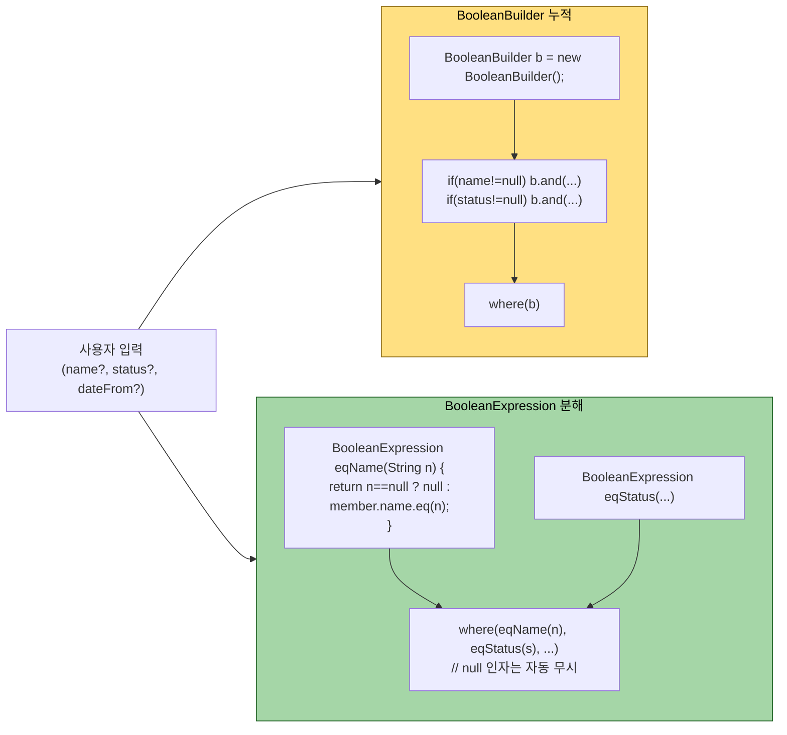
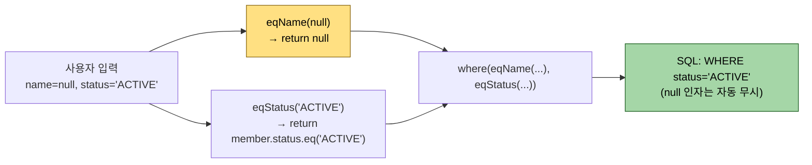

# 동적 쿼리

---

> **`BooleanBuilder` 와 `BooleanExpression` 메서드 분해 두 패턴의 차이를 재사용성·가독성·null 안전성 세 축에서 비교할 수 있고, 동적 정렬에서 `OrderSpecifier` 와 sort key 화이트리스트로 외부 입력을 안전히 받을 수 있으며, 어느 패턴을 어디에 쓸지 운영 코드에 적용할 수 있다.**

QueryDSL의 진가는 동적 쿼리에서 드러난다. `BooleanBuilder`와 `BooleanExpression` 메서드 분해 두 가지 패턴이 있는데, 같은 결과를 만들면서 재사용성과 가독성이 갈린다. 어느 쪽을 어디에 써야 하는지 트레이드오프를 한 번에 정리한다.

두 패턴이 어떻게 갈리는지 한눈에 보면 다음과 같다.



- BooleanExpression 메서드 분해 쪽이 재사용성에서 이긴다 같은 `eqName` 을 다른 쿼리에서도 쓸 수 있고, where 가 null 인자를 자동으로 거른다. 
- BooleanBuilder 는 *한 쿼리 안에서 OR 누적* 같은 작은 작업에 강하다.


## 동적 쿼리란 무엇인가

> 검색 조건이 호출 시점에 결정되는 쿼리다. 컴파일 타임에는 어느 조건이 들어올지 모른다.

쇼핑몰 회원 검색 화면을 다시 떠올려 보자. 운영자가 다음 조건 중 일부 또는 전부를 채워 검색한다.

1. 이름 부분 일치
2. 이메일 도메인
3. 가입 기간(시작·종료)
4. 회원 상태(`ACTIVE`/`DORMANT`/`BANNED`)
5. 최소 주문 횟수

다섯 조건이 0개에서 5개까지 임의 조합으로 들어온다. 정적 JPQL로 짜면 `1=1`로 시작해서 `if` 문으로 `AND`를 붙이는 형태가 된다. QueryDSL은 두 가지 방식으로 이 패턴을 처리한다. `BooleanBuilder`와 `BooleanExpression` 메서드 분해다.


## 패턴 1 — BooleanBuilder

> 가장 직관적인 방식이다. 빈 빌더를 만들어 조건이 있을 때만 `and`로 추가한다.

```java
public List<Member> searchByBuilder(MemberSearchCond cond) {
    BooleanBuilder builder = new BooleanBuilder();

  	// 이름 검색
    if (StringUtils.hasText(cond.getName())) {
        builder.and(member.name.contains(cond.getName()));
    }
  
  	// 이메일 검색
    if (StringUtils.hasText(cond.getEmailDomain())) {
        builder.and(member.email.endsWith("@" + cond.getEmailDomain()));
    }
  
  	// 날짜 검색
    if (cond.getStart() != null && cond.getEnd() != null) {
        builder.and(member.joinedAt.between(cond.getStart(), cond.getEnd()));
    }
  
  	// 상태 검색
    if (cond.getStatus() != null) {
        builder.and(member.status.eq(cond.getStatus()));
    }

    return queryFactory
            .selectFrom(member)
            .where(builder)
            .fetch();
}
```

- 장점은 직관성이다. 조건이 늘어나면 `if` 블록을 하나 더 쓰면 된다. SQL 작성 경험이 있다면 사고 흐름과 코드가 1:1로 맞는다.

단점은 두 가지다.

1. **재사용이 어렵다.** "이름 검색" 로직을 다른 화면에서도 쓰고 싶다면 `if` 블록을 복사해야 한다.
2. **읽기 시점에 의도가 흐려진다.** `where` 절을 보면 `where(builder)`라는 한 줄만 보이고, 어떤 조건들이 합쳐지는지는 메서드 위쪽까지 거슬러 올라가야 알 수 있다.

조건이 두세 개 이내고 일회성 화면이면 BooleanBuilder가 가볍다. 그 이상이면 다음 패턴으로 넘어간다.


## 패턴 2 — BooleanExpression 메서드 분해

> 조건마다 별도 메서드로 추출하고 `where`의 가변 인자에 나열한다. null이면 조건 자체가 무시된다.

```java
public List<Member> searchByExpressions(MemberSearchCond cond) {
    return queryFactory
            .selectFrom(member)
            .where(
                    nameContains(cond.getName())
                    , emailDomainEq(cond.getEmailDomain())
                    , joinedBetween(cond.getStart(), cond.getEnd())
                    , statusEq(cond.getStatus())
            )
            .fetch();
}

// 이름 함수
private BooleanExpression nameContains(String name) {
    return StringUtils.hasText(name) ? member.name.contains(name) : null;
}

// 이메일 함수
private BooleanExpression emailDomainEq(String domain) {
    return StringUtils.hasText(domain) ? member.email.endsWith("@" + domain) : null;
}

// 날짜 함수
private BooleanExpression joinedBetween(LocalDateTime start, LocalDateTime end) {
    if (start == null || end == null) return null;
    return member.joinedAt.between(start, end);
}

private BooleanExpression statusEq(MemberStatus status) {
    return status == null ? null : member.status.eq(status);
}
```

- 이 패턴의 핵심은 `where(...)`가 가변 인자를 받는다는 점이다. `null`로 들어온 인자는 자동으로 무시된다. 

조건마다 메서드를 분리하면 다음 세 가지 이득이 생긴다.

1. **메서드 시그니처가 의도를 노출한다.** `nameContains(String)` 한 줄만 봐도 무엇을 하는지 안다. 호출부의 `where`도 자연어처럼 읽힌다.
2. **재사용이 가능하다.** "이름 검색"을 다른 리포지토리에서도 쓰고 싶다면 메서드를 그대로 호출하거나, 같은 도메인의 검색 클래스로 추출한다.
3. **조합 메서드를 만들 수 있다.** `BooleanExpression`은 `and`, `or`로 다른 표현식과 결합 가능하다. "활성 회원이면서 신규 가입자"같은 도메인 의미의 술어를 한 메서드로 만들 수 있다.

```java
private BooleanExpression activeAndRecentlyJoined() {
    return member.status.eq(MemberStatus.ACTIVE)
            .and(member.joinedAt.after(LocalDateTime.now().minusDays(30)));
}
```


## null 반환의 비밀

> 메서드 분해 패턴은 "조건이 없으면 null을 반환한다"는 규약을 따른다. 이 약속이 깨지면 패턴 전체가 무너진다.

null 반환 규약이 `where` 의 가변 인자 처리와 어떻게 맞물리는지 다음 그림으로 보면 명확하다.



규약이 깨지는 흔한 함정 — `return n.equals(value)` 같은 *null 인자 자체에 메서드를 호출* 하면 NPE. 항상 null 체크 후 표현식 반환이어야 한다.

`where`의 가변 인자가 null을 무시한다는 사실은 QueryDSL이 명시한 동작이다. 다만 두 가지를 함께 기억해야 한다.

1. **`and`로 직접 결합할 때는 null이 위험하다.** `expr1.and(expr2)`에서 `expr1`이 null이면 `NullPointerException`이 난다. 가변 인자 위치가 아니라 `and` 체인에서 null을 받지 않도록 주의한다.
2. **null과 false는 다르다.** "조건이 적용되지 않는다"가 null의 의미다. "조건이 거짓"은 명시적인 false 표현식이다. 두 의미를 혼동하면 결과 셋이 의도와 달라진다.

`Optional`을 쓰는 변형도 있지만 가독성이 떨어져 권장하지 않는다.

```java
// 권장: null 반환
private BooleanExpression nameContains(String name) {
    return StringUtils.hasText(name) ? member.name.contains(name) : null;
}

// 비권장: Optional 우회 — 호출부에서 .orElse(null)이 강제된다
private Optional<BooleanExpression> nameContainsOpt(String name) {
    return StringUtils.hasText(name)
            ? Optional.of(member.name.contains(name))
            : Optional.empty();
}
```


## 두 패턴 비교

> 같은 결과를 만든다. 차이는 코드 부피와 재사용성이다.

| 비교 축 | BooleanBuilder | BooleanExpression 분해 |
|---------|---------------|----------------------|
| 학습 비용 | 낮음 (if 분기) | 보통 (null 규약·메서드 추출) |
| 가독성(메인) | 보통 | 높음 (where 절이 자연어) |
| 가독성(보조) | 낮음 (if 블록 누적) | 높음 (메서드 단위 분해) |
| 재사용성 | 낮음 (블록 복제) | 높음 (메서드 재호출) |
| 조건 결합 | 명시적 `and` 호출 | `and`/`or`로 자유 결합 |
| 권장 사용처 | 일회성·2~3개 조건 | 4개 이상·재사용 가능성 |

대부분의 도메인 코드는 메서드 분해 패턴이 더 잘 늙는다. 검색 조건은 시간이 지날수록 늘어나기 때문이다. 처음에 BooleanBuilder로 시작했다가 조건이 5개를 넘어가는 시점에 분해하는 리팩터링이 흔하다.


## or 조건과 그룹핑

> 가변 인자는 모두 AND로 묶인다. OR이나 괄호 그룹은 직접 표현해야 한다.

"이름이 'kim'으로 시작하거나 이메일이 'kim@'으로 시작하는 회원"을 찾고 싶다고 하자. 다음과 같이 표현한다.

```java
BooleanExpression nameOrEmail = member.name.startsWith("kim")
        .or(member.email.startsWith("kim@")); // 추가 조건

List<Member> result = queryFactory
        .selectFrom(member)
        .where(nameOrEmail, member.status.eq(MemberStatus.ACTIVE))
        .fetch();
```

- `where`가 받은 두 인자는 AND로 결합되므로 결과 SQL은 `(name like 'kim%' or email like 'kim@%') and status = 'ACTIVE'`다. 
- 괄호가 자동으로 잘 잡히는 점이 SQL 직접 작성보다 안전하다.

OR 조건이 많아지면 별도 메서드로 추출해 의도에 이름을 붙인다.

```java
private BooleanExpression matchesKim() {
    return member.name.startsWith("kim")
            .or(member.email.startsWith("kim@"));
}
```


## in 절과 컬렉션 입력

> 컬렉션을 그대로 받아 `in` 절로 변환한다. 빈 컬렉션 처리만 주의한다.

```java
private BooleanExpression statusIn(List<MemberStatus> statuses) {
    if (statuses == null || statuses.isEmpty()) return null;
    return member.status.in(statuses);
}
```

- `statuses`가 빈 리스트면 SQL에 `status in ()`이 들어가 DB별로 다른 에러를 낸다. 반드시 비어 있는지 검사한 뒤 null로 떨어뜨린다.


## 동적 정렬

> 검색 화면은 정렬 기준도 동적이다. `OrderSpecifier`로 표현한다.

### `OrderSpecifier` 란

`OrderSpecifier` 는 QueryDSL 에서 *"어떤 컬럼을, 어느 방향으로 정렬할지"를 담는 한 개의 정렬 명세* 다. 

- `orderBy()` 에 넘기는 인자가 바로 이 타입이다. 평소엔 `member.name.asc()` 처럼 *경로에서 바로* 만들어 쓰지만(이것도 내부적으로 `OrderSpecifier` 를 돌려준다), 정렬 기준이 *런타임에 결정* 될 때는 `OrderSpecifier` 를 직접 생성해야 한다.

```java
member.name.asc()                              // 정적 — 내부적으로 OrderSpecifier 반환
  
new OrderSpecifier<>(Order.ASC, member.name)   // 동적 — 방향·컬럼을 변수로 조립
```

- **생성자 두 인자** — 첫째 `com.querydsl.core.types.Order`(`ASC`/`DESC`, *JPA 의 `@Order` 나 도메인 Order 엔티티와는 무관한 정렬 방향 enum*), 둘째 정렬 대상 경로(`member.name` 같은 Q-path).
- **제네릭 `<?>`** — 정렬 컬럼 타입이 `String`·`Integer` 등 제각각이라, 여러 키를 한 메서드에서 반환하려면 와일드카드로 받는다.
- **여러 개 나열 가능** — `orderBy(spec1, spec2)` 처럼 *주 정렬·보조 정렬* 을 순서대로 넘긴다. SQL 의 `ORDER BY a, b` 와 같다.

```java
public List<Member> search(MemberSearchCond cond, String sortKey, boolean asc) {
    OrderSpecifier<?> order = orderBySortKey(sortKey, asc);
  
    return queryFactory
            .selectFrom(member)
            .where(/* 동적 조건 */)
            .orderBy(order)
            .fetch();
}

private OrderSpecifier<?> orderBySortKey(String sortKey, boolean asc) {
    Order direction = asc ? Order.ASC : Order.DESC;
    return switch (sortKey) {
        case "name"     -> new OrderSpecifier<>(direction, member.name);
        case "joinedAt" -> new OrderSpecifier<>(direction, member.joinedAt);
        default          -> new OrderSpecifier<>(direction, member.id);
    };
}
```

- `switch`로 허용된 정렬 키만 매핑하는 점이 핵심이다. 사용자가 보낸 문자열을 그대로 쓰면 컬럼이 아닌 값이 들어와 SQL Injection 가능성이 생긴다. 화이트리스트 매핑이 안전 장치다.

정렬 키가 수십 개로 늘어나 `switch` 분기가 부담스러워지면 `PathBuilder.get(sortKey)`로 키-경로 매핑을 한 줄로 줄이는 변형이 있다. 다만 문자열 기반 접근이므로 *화이트리스트 검증이 더 중요해진다* — 컴파일러가 더 이상 컬럼명을 검증해 주지 않기 때문이다. PathBuilder 의 *정의·트레이드오프* 자체는 [02-01.PathBuilder — 동적 path 빌더 깊이](02-01.PathBuilder%20%E2%80%94%20%EB%8F%99%EC%A0%81%20path%20%EB%B9%8C%EB%8D%94%20%EA%B9%8A%EC%9D%B4.md) 에서 다루고, 운영 코드의 실무 응용은 [03-03. 실무 변형 모음](03-03.실무%20변형%20모음.md) 이 짚는다.


## 실무 시나리오 — 조건 객체 + 분해 패턴

> 실제 화면 단위로 보면 다음 조합이 가장 흔하다. 조건은 DTO로, 술어는 메서드로 분리한다.

```java
@Builder
public record MemberSearchCond(
        String name,
        String emailDomain,
        LocalDateTime start,
        LocalDateTime end,
        MemberStatus status,
        Integer minOrderCount
) {}

@Repository
@RequiredArgsConstructor
public class MemberSearchRepository {

    private final JPAQueryFactory queryFactory;

    public List<Member> search(MemberSearchCond cond) {
        return queryFactory
                .selectFrom(member)
                .where(
                        nameContains(cond.name())
                        , emailDomainEq(cond.emailDomain())
                        , joinedBetween(cond.start(), cond.end())
                        , statusEq(cond.status())
                )
                .fetch();
    }

    private BooleanExpression nameContains(String name) {
        return StringUtils.hasText(name) ? member.name.contains(name) : null;
    }

    private BooleanExpression emailDomainEq(String domain) {
        return StringUtils.hasText(domain) ? member.email.endsWith("@" + domain) : null;
    }

    private BooleanExpression joinedBetween(LocalDateTime start, LocalDateTime end) {
        if (start == null || end == null) return null;
        return member.joinedAt.between(start, end);
    }

    private BooleanExpression statusEq(MemberStatus status) {
        return status == null ? null : member.status.eq(status);
    }
}
```

같은 도메인에서 다른 화면이 같은 조건을 쓴다면 메서드를 묶어 별도 `MemberPredicates` 클래스로 추출한다. 한 클래스가 너무 비대해지지 않게 도메인 단위로 쪼갠다.


## 면접에서 받을 만한 질문

> 동적 쿼리 패턴은 백엔드 면접에서 자주 나온다. 두 패턴의 트레이드오프를 입으로 말할 수 있어야 한다.

1. `BooleanBuilder`와 `BooleanExpression` 메서드 분해 중 어느 쪽을 선호하는가?
   - 답 요지: 조건이 4개 이상이거나 재사용 가능성이 있다면 메서드 분해가 낫다. 가변 인자에 null 무시 규약이 있어 if 분기가 사라지고, 메서드 시그니처에 의도가 드러난다. 일회성 2~3개 조건이면 BooleanBuilder가 가볍다.
2. `where`의 가변 인자에 null이 들어오면 어떻게 처리되는가?
   - 답 요지: 자동 무시된다. 따라서 조건 메서드는 "조건이 없으면 null"이라는 규약으로 작성한다. 다만 `and` 체인에서는 null이 NPE를 일으키므로 가변 인자 위치에서만 안전하다.
3. 동적 정렬을 사용자 입력으로 받을 때 주의점은?
   - 답 요지: 화이트리스트 매핑이 필요하다. 사용자가 보낸 문자열을 그대로 컬럼명으로 쓰면 안 되고, switch나 Map으로 허용된 키만 `OrderSpecifier`로 변환한다.
4. 빈 컬렉션을 `in` 절에 넘기면 어떻게 되는가?
   - 답 요지: DB별로 다르지만 대부분 SQL 에러가 난다. 컬렉션이 비어 있는지 사전에 검사해 null로 떨어뜨려 조건 자체를 무시하게 만든다.


## 관련 문서

> 본 동적 쿼리 문서가 묶음 내 다른 챕터와 어떻게 연결되는지. where 가변 인자 기초는 01-03, 운영 규모 표현식 합성은 02-04(Hooks·ThreadLocal) 로 확장된다.

- [01-03. 기본 문법과 조인](01-03.기본%20문법과%20조인.md) — `where` 가변 인자의 기초
- [01-05. 프로젝션과 DTO 매핑](01-05.프로젝션과%20DTO%20매핑.md) — 검색 결과를 DTO로 받는 방법
- [jpa/03-05. 커스텀 리포지토리 패턴](../jpa/03-05.커스텀%20리포지토리%20패턴.md) — 검색 메서드를 Spring Data JPA에 통합
