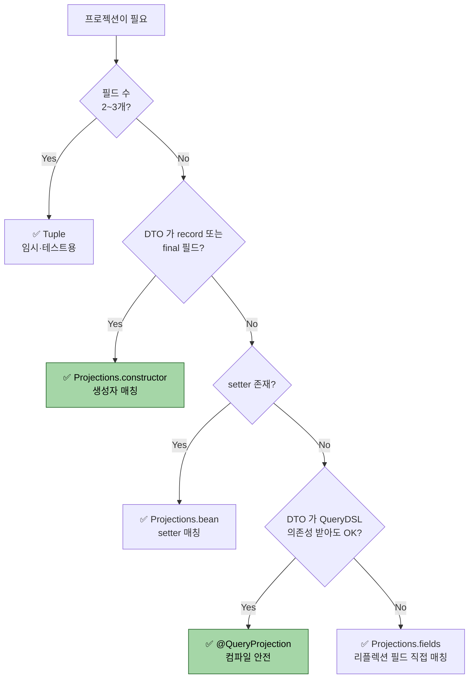
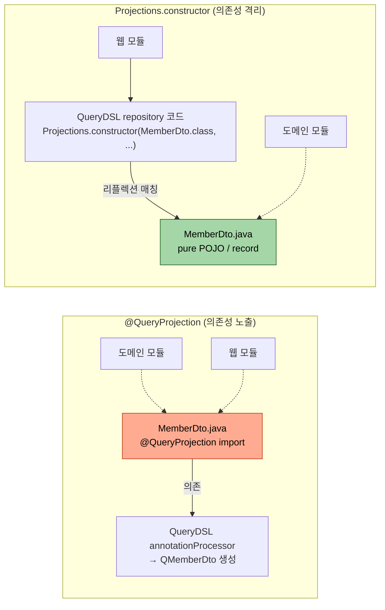

# 프로젝션과 DTO 매핑

---

> **QueryDSL 의 네 가지 프로젝션 방식(Tuple·Projections.fields/bean/constructor·@QueryProjection) 을 상황별로 고를 수 있고, `@QueryProjection` 의 트레이드오프(컴파일 안전성 vs QueryDSL 의존성 노출)를 면접에서 설명하며, 결정 트리에 따라 운영 코드에 적용할 수 있다.**

**엔티티 전체를 가져오는 대신 필요한 필드만 골라 DTO로 받는 기술이 프로젝션이다.** 

- QueryDSL이 제공하는 네 가지 방식(Tuple·Projections.fields/bean/constructor·@QueryProjection)을 한 자리에 정리하고, 어느 상황에 무엇을 골라야 하는지를 결정 트리 형태로 정리한다.

네 방식의 선택 기준을 한 그림으로 보면 다음과 같다.



- `@QueryProjection` 이 컴파일 안전성으로는 가장 강하지만 *DTO 클래스에 QueryDSL 의존성이 박힌다* 
- 도메인 모듈을 QueryDSL 의존성에서 떨어뜨리려는 클린 아키텍처 환경에서는 `Projections.constructor` 가 더 자연스러운 선택이다.


## 왜 프로젝션이 필요한가?

> 엔티티를 통째로 가져오면 의도하지 않은 컬럼까지 SELECT에 끌려 들어온다.

회원 검색 API가 응답으로 다음 네 필드만 내려준다고 하자. id, 이름, 팀 이름, 가입일. 그런데 `selectFrom(member)`로 회원을 통째로 가져오면 SELECT 절에 회원의 모든 컬럼(이메일, 상태, 비밀번호 해시 등)이 끌려 나온다. 다음 세 가지 비용이 발생한다.

1. **네트워크 비용.** DB에서 애플리케이션으로 옮기는 데이터양이 늘어난다.
2. **메모리 비용.** 영속성 컨텍스트가 엔티티를 통째로 매핑한다.
3. **API 노출 위험.** 컨트롤러에서 엔티티를 그대로 응답으로 내려주는 코드가 생기면 민감 컬럼이 외부로 새어 나간다.

프로젝션은 SELECT 절에 표현식을 직접 명시해 필요한 컬럼만 가져온다. 엔티티가 아닌 값 객체나 DTO로 결과를 받는다.


## 방식 1 — Tuple

> 가장 가볍지만 도메인 의미가 없다. 빠른 검증·임시 분석에만 쓴다.

```java
List<Tuple> result = queryFactory
        .select(member.id, member.name, team.name, member.joinedAt)
        .from(member)
        .leftJoin(member.team, team)
        .fetch();

for (Tuple row : result) {
    Long id = row.get(member.id);
    String name = row.get(member.name);
    String teamName = row.get(team.name);
    LocalDateTime joinedAt = row.get(member.joinedAt);
}
```

`Tuple`은 `Map<Expression, Object>`처럼 동작한다. 키가 표현식이라 컬럼 위치가 바뀌어도 깨지지 않는 장점이 있는 대신, 다음 두 가지 단점이 크다.

1. **타입 안전성이 한 단계 약하다.** 호출부에서 `row.get(member.id)`처럼 표현식을 다시 적어야 한다. 컴파일러가 "이 row가 그 표현식을 가졌는지" 검증하지 못한다.
2. **외부로 노출하기 부적합하다.** `Tuple`은 QueryDSL 타입이다. 서비스 계층 시그니처에 `List<Tuple>`이 떠다니면 도메인 의미가 흐려진다.

Tuple은 다음 두 상황에만 한정한다. 잠깐 SQL 결과를 확인하는 디버깅, 또는 한 곳에서만 쓰이는 통계 SQL의 임시 결과 처리. 그 외 모든 경우는 DTO로 받는다.


## 방식 2 — Projections.bean / fields

> Setter 또는 필드에 값을 직접 주입한다. DTO에 기본 생성자가 필요하다.

DTO 정의는 Lombok으로 다음과 같다.

```java
@Getter @Setter
@NoArgsConstructor
public class MemberSearchResult {
    private Long id;
    private String name;
    private String teamName;
    private LocalDateTime joinedAt;
}
```

`Projections.bean`은 setter를 호출해 값을 주입한다. 컬럼 별칭과 setter 이름이 일치해야 한다.

```java
List<MemberSearchResult> result = queryFactory
        .select(Projections.bean(MemberSearchResult.class
                , member.id
                , member.name
                , team.name.as("teamName")
                , member.joinedAt
        ))
        .from(member)
        .leftJoin(member.team, team)
        .fetch();
```

- `team.name`을 그대로 두면 setter 이름이 `setName`이 되어 회원의 `name`과 충돌한다. `as("teamName")`으로 별칭을 주면 setter 이름이 `setTeamName`으로 매핑된다.
- `Projections.fields`는 setter 없이 리플렉션으로 필드에 직접 값을 넣는다. 불변 DTO에는 부적합하지만 setter를 만들기 싫을 때 쓴다.

두 방식의 단점은 동일하다. **컴파일 타임에 필드 매핑을 검증하지 못한다.** 컬럼명을 잘못 적거나 타입이 안 맞으면 런타임에야 발견된다.


## 방식 3 — Projections.constructor

> 생성자 인자 순서로 값을 매핑한다. 불변 DTO에 잘 맞는다.

DTO를 다음과 같이 생성자 기반으로 정의한다.

```java
@Getter
public class MemberSearchResult {
    private final Long id;
    private final String name;
    private final String teamName;
    private final LocalDateTime joinedAt;

    public MemberSearchResult(Long id, String name, String teamName, LocalDateTime joinedAt) {
        this.id = id;
        this.name = name;
        this.teamName = teamName;
        this.joinedAt = joinedAt;
    }
}
```

쿼리에서는 다음과 같이 쓴다.

```java
List<MemberSearchResult> result = queryFactory
        .select(Projections.constructor(MemberSearchResult.class
                , member.id
                , member.name
                , team.name
                , member.joinedAt
        ))
        .from(member)
        .leftJoin(member.team, team)
        .fetch();
```

- setter나 별칭 매핑이 필요 없다. 인자 순서와 타입만 맞으면 된다. 그런데 여전히 한계가 있다. 
- **인자 순서가 틀리거나 표현식 하나가 빠져도 컴파일 타임에 잡히지 않는다.** 같은 타입의 인자가 두 개(예: id와 teamId 둘 다 Long)면 순서가 바뀌어도 컴파일이 통과하고 실행 시까지 발견되지 않는다.

자바 16+ 환경에서는 record로 같은 효과를 더 짧게 낸다.

```java
public record MemberSearchResult(Long id, String name, String teamName, LocalDateTime joinedAt) {}
```

- record는 생성자가 자동 생성되므로 `Projections.constructor` 방식과 즉시 호환된다. Spring Boot 3.2.3 + Java 17 환경이라면 record가 첫 선택이다.


## 방식 4 — @QueryProjection

> DTO 생성자에 어노테이션을 달아 Q타입을 생성한다. 컴파일 타임 안전성이 가장 강하다.

```java
@Getter
public class MemberSearchResult {
    private final Long id;
    private final String name;
    private final String teamName;
    private final LocalDateTime joinedAt;

    @QueryProjection
    public MemberSearchResult(Long id, String name, String teamName, LocalDateTime joinedAt) {
        this.id = id;
        this.name = name;
        this.teamName = teamName;
        this.joinedAt = joinedAt;
    }
}
```

`@QueryProjection`을 붙인 뒤 빌드하면 `QMemberSearchResult`가 생성된다. 쿼리에서는 `new`로 직접 호출한다.

```java
List<MemberSearchResult> result = queryFactory
        .select(new QMemberSearchResult(
                member.id
                , member.name
                , team.name
                , member.joinedAt
        ))
        .from(member)
        .leftJoin(member.team, team)
        .fetch();
```

이 방식의 장점은 **인자 개수·타입·순서가 컴파일러에 의해 100% 검증된다**는 점이다. 표현식 하나가 빠지거나 순서가 바뀌면 빌드가 실패한다. record와 결합하면 가장 짧으면서 가장 안전한 형태가 된다.

```java
public record MemberSearchResult(
        Long id,
        String name,
        String teamName,
        LocalDateTime joinedAt
) {
    @QueryProjection
    public MemberSearchResult { }
}
```

record의 컴팩트 생성자에 `@QueryProjection`을 달아도 동작한다.


## @QueryProjection의 트레이드오프

> 컴파일 안전성 대신 DTO가 QueryDSL 의존성을 갖게 된다.

두 방식의 의존 방향 차이를 한 그림으로 보면 다음과 같다.



`@QueryProjection` 은 DTO 가 *QueryDSL 의존성을 직접 import* 하므로 도메인 모듈이 QueryDSL 에 묶인다. `Projections.constructor` 는 DTO 가 pure POJO 라 도메인이 QueryDSL 로부터 격리된다 — 클린 아키텍처 환경에서 후자가 자연스러운 이유.

`@QueryProjection`을 쓰면 DTO가 `com.querydsl.core.annotations.QueryProjection`을 import한다. 이 의존성이 두 가지 의미를 갖는다.

1. **DTO 모듈이 QueryDSL을 알아야 한다.** 멀티 모듈에서 DTO 모듈을 별도로 분리했다면 그 모듈에 QueryDSL 의존성이 생긴다.
2. **DTO를 다른 ORM으로 옮기기 어려워진다.** JOOQ나 MyBatis로 갈아탈 때 DTO를 그대로 쓰지 못하고 수정해야 한다.

순수성을 중시한다면 `Projections.constructor`를, 안전성을 중시한다면 `@QueryProjection`을 고른다. 실무에서는 후자가 더 흔하다. ORM을 통째로 갈아타는 일은 드물고, 빌드 시 잡히는 버그가 더 큰 가치를 주기 때문이다.


## 네 방식 비교 정리

> 결정 트리에 가까운 표 한 장으로 마무리한다.

| 방식 | 안전성 | 코드 부피 | 의존성 결합 | 권장 사용처 |
|------|-------|---------|-----------|-----------|
| `Tuple` | 낮음 | 짧음 | QueryDSL 타입 노출 | 디버깅·임시 분석만 |
| `Projections.bean` | 낮음 | 보통 | DTO에 setter 필요 | 옛 코드 유지보수 |
| `Projections.fields` | 낮음 | 짧음 | 리플렉션으로 필드 주입 | 거의 안 씀 |
| `Projections.constructor` | 중간 | 짧음 | 없음 | DTO 순수성이 중요할 때 |
| `@QueryProjection` | 높음 | 짧음 | DTO에 QueryDSL 의존 | 안전성 우선·일반 권장 |

- 새 코드를 짠다면 `@QueryProjection` + record 조합이 가장 짧으면서 안전하다. 
- DTO 모듈을 따로 떼서 QueryDSL을 모르게 만들고 싶다면 `Projections.constructor` + record를 쓴다.


## 중첩 DTO 매핑

> 응답 DTO 안에 또 다른 DTO를 두는 경우가 있다. 가능하지만 한계가 있다.

회원 검색 결과에 팀 정보 객체를 묶고 싶다고 하자.

```java
public record TeamInfo(Long id, String name) {
    @QueryProjection
    public TeamInfo { }
}

public record MemberSearchResult(
        Long id,
        String name,
        TeamInfo team,
        LocalDateTime joinedAt
) {
    @QueryProjection
    public MemberSearchResult { }
}
```

쿼리는 다음처럼 중첩한다.

```java
List<MemberSearchResult> result = queryFactory
        .select(new QMemberSearchResult(
                member.id
                , member.name
                , new QTeamInfo(team.id, team.name)
                , member.joinedAt
        ))
        .from(member)
        .leftJoin(member.team, team)
        .fetch();
```

leftJoin이라 팀이 없는 회원은 `TeamInfo` 인자가 모두 null로 전달된다. record의 코드 흐름상 빈 객체가 만들어지는 점에 주의한다. 이 경우는 호출부에서 null 처리를 따로 한다.


## 컬렉션 결과 매핑의 한계

> 일대다 관계를 한 번의 쿼리로 매핑하는 자동 기능은 없다.

주문과 그 주문의 모든 항목을 한 번에 묶어 받고 싶다고 하자. SQL 한 방으로는 주문당 N개의 행이 나온다. QueryDSL은 그 N개 행을 자동으로 주문 1개 + 항목 N개로 묶지 않는다.

### 왜 자동 매핑이 안 되는가 — 행이 평평하다

근본 원인은 *SQL 조인 결과가 계층 구조가 아니라 평평한 행(flat rows)* 이라는 데 있다. 주문 1건에 항목 3개를 조인하면 결과는 다음처럼 *주문 컬럼이 반복된 3행* 이다.

| order_id | status | order_item_id | item | count |
|----------|--------|---------------|------|-------|
| 1 | ORDERED | 100 | A | 2 |
| 1 | ORDERED | 101 | B | 1 |
| 1 | ORDERED | 102 | C | 3 |

- ORM 이 이 3행을 "주문 1개 + 항목 3개"로 되돌리려면 *어느 컬럼이 부모 식별자인지* 를 알고 같은 PK 행을 묶어야 한다. 
- fetch join 은 매핑 메타정보(`@OneToMany`)가 있어 이 그룹핑을 자동으로 하지만, *프로젝션(`select(...)`)으로 평평한 컬럼만 고르면* QueryDSL 은 그 행들을 묶을 근거가 없다
- DTO 생성자는 *한 행 = 한 객체* 로만 매핑하기 때문이다. 그래서 프로젝션으로는 1:N 을 한 번에 못 받는다.

### 해결 패턴 1 — 두 단계 쿼리 (권장)

주문을 먼저 조회하고, 그 주문 ID 들로 항목을 한 번 더 조회해 애플리케이션에서 묶는다.

```java
// 1단계 — 주문만 조회 (필요하면 여기서 페이징)
List<Order> orders = queryFactory
        .selectFrom(order)
        .where(/* 조건 */)
        .fetch();

// 2단계 — 주문 ID 컬렉션으로 항목 일괄 조회 (IN 절 한 번)
List<Long> orderIds = orders.stream().map(Order::getId).toList();
List<OrderItem> items = queryFactory
        .selectFrom(orderItem)
        .where(orderItem.order.id.in(orderIds))
        .fetch();

// 3단계 — 메모리에서 주문 ID 기준 그룹핑해 결합
Map<Long, List<OrderItem>> itemsByOrder = items.stream()
        .collect(Collectors.groupingBy(it -> it.getOrder().getId()));
// 이제 order.getId() 로 itemsByOrder 에서 항목 목록을 꺼내 DTO 로 조립
```

쿼리가 두 번 나가지만 *각 쿼리가 평평한 행을 그대로 받아* 안전하다. 1단계에 LIMIT 을 걸어도 *주문 단위로* 잘리므로 페이징이 정상 동작한다.

### 해결 패턴 2 — fetch join + distinct

컬렉션을 fetch join 하면 SQL 은 한 번이다. 단 *데카르트 곱으로 행이 부풀고* `distinct` 로 줄여야 하며, *페이징과 만나면 `HHH000104` 메모리 페이징* 함정이 있다(01-06 에서 상세). 컬렉션이 작고 페이징이 없을 때만 적합하다.

### 왜 쿼리 2번이 1번보다 나은가

"쿼리 2번 = 비용 2배" 라는 직관은 *틀린 경우가 많다*. fetch join 1번은 데카르트 곱으로 *전송 행이 폭증* 하고(주문 1천 × 항목 평균 5 = 5천 행), 페이징이 막혀 메모리 위험까지 안는다. 두 단계 쿼리는 각각 *정확히 필요한 행만*(주문 1천 + 항목 5천을 IN 절로 한 번) 가져오고 LIMIT 도 정상이라, *데이터가 클수록 두 단계가 유리* 하다.

| 기준 | fetch join + distinct (1번) | 두 단계 쿼리 (2번) |
|------|---------------------------|-------------------|
| 쿼리 수 | 1 | 2 |
| 전송 행 | 데카르트 곱으로 증식 | 부모·자식 각각 정확히 |
| 페이징 | ❌ 메모리 페이징(HHH000104) | ✅ 1단계에서 정상 |
| 메모리 안전 | 데이터 크면 위험 | 안전 |
| 권장 | 컬렉션 작고 페이징 없을 때 | *대부분의 실무* |

대부분의 실무에서는 첫 패턴(두 단계)이 안전하다. 페이징·메모리 안전·코드 가독성을 고려하면 트레이드오프가 명확히 두 단계 쪽이다.


## 면접에서 받을 만한 질문

> 프로젝션 선택 기준은 자주 묻는다. 트레이드오프를 입으로 말할 수 있어야 한다.

1. `Projections.constructor`와 `@QueryProjection`의 차이를 한 문장으로 말하면?
   - 답 요지: `Projections.constructor`는 DTO에 QueryDSL 의존성이 없는 대신 인자 순서·개수·타입의 검증이 런타임으로 미뤄진다. `@QueryProjection`은 컴파일 타임에 100% 검증되는 대신 DTO가 QueryDSL을 import한다.
2. `Tuple`을 컨트롤러 응답으로 그대로 내려도 되는가?
   - 답 요지: 안 된다. `Tuple`은 QueryDSL 내부 타입이므로 외부 API 응답에 노출하면 도메인 경계가 무너진다. 반드시 DTO로 변환해서 내려준다.
3. `Projections.bean`은 왜 잘 안 쓰는가?
   - 답 요지: setter를 강제하므로 불변 DTO 설계와 충돌한다. 또한 컬럼명과 setter 이름이 일치해야 하는 규약이 추가 부담이고, `team.name`처럼 충돌 가능한 컬럼은 별칭을 일일이 줘야 한다. record와 `Projections.constructor` 또는 `@QueryProjection`이 더 깔끔하다.
4. 회원 1명에 주문 N개를 한 번의 쿼리로 받으려면?
   - 답 요지: 한 번의 SQL로는 row N개가 나오므로 QueryDSL이 자동으로 1+N으로 묶지 못한다. 두 단계 조회 후 애플리케이션에서 그룹핑하거나, fetch join + distinct를 쓴다(페이징과 함께면 함정이 있다).


## 관련 문서

> 본 프로젝션 문서가 묶음 내 다른 챕터와 어떻게 연결되는지. `Tuple` 기초는 01-03, 서브쿼리 alias 우회는 02-03(ExpressionUtils.as) 으로 이어진다.

- [01-03. 기본 문법과 조인](01-03.기본%20문법과%20조인.md) — `Tuple`이 등장하는 기초 쿼리
- [01-04. 동적 쿼리](01-04.동적%20쿼리.md) — DTO와 동적 조건 결합
- [01-06. 페이징과 fetch join 함정](01-06.페이징과%20fetch%20join%20함정.md) — 컬렉션 페치 조인 + 페이징의 위험
- [jpa/03-05. 커스텀 리포지토리 패턴](../jpa/03-05.커스텀%20리포지토리%20패턴.md) — DTO 매핑 메서드를 리포지토리에 통합
