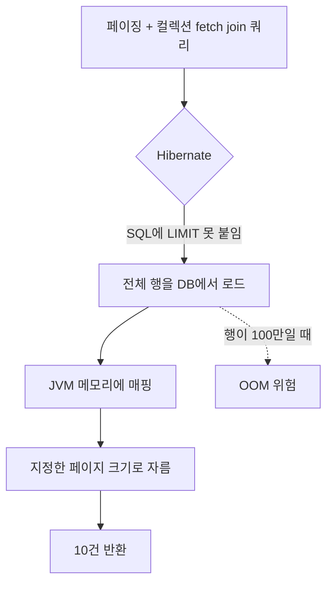
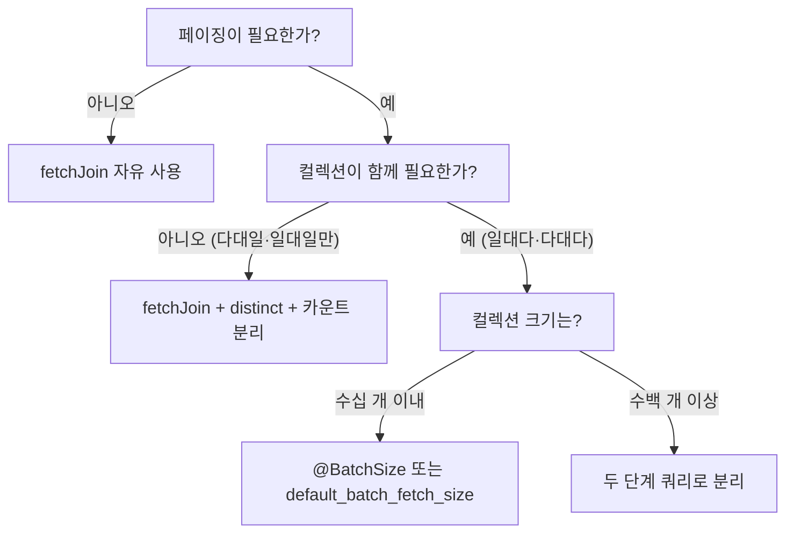

# 페이징과 fetch join 함정

---

> **이 문서를 읽고 나면, `HHH000104` 경고의 정체(LIMIT 무시 + 메모리 페이징) 와 운영 트래픽에서 OOM 으로 이어지는 메커니즘을 설명할 수 있고, 두 가지 해결 패턴(distinct + 컬렉션 페치 분리 / `@BatchSize` + 페이지 단위 in-query) 을 상황에 맞게 선택해 적용할 수 있다.**

페이징과 컬렉션 페치 조인을 같이 쓰면 Hibernate는 SQL의 LIMIT을 던지고 메모리에서 잘라낸다. 데이터가 적을 때는 모르고 지나가다가, 운영 트래픽에서 OOM으로 만나는 함정이다. 경고 메시지 `HHH000104`의 정체와 두 가지 해결 패턴을 정리한다.


## 함정의 정체 — HHH000104

> Hibernate가 콘솔에 흘리는 한 줄 경고를 무시하면 며칠 뒤 OOM이 온다.

다음 쿼리를 보자. 회원과 회원의 주문을 페치 조인하면서 페이징을 함께 적용한다.

```java
List<Member> result = queryFactory
        .selectFrom(member)
        .leftJoin(member.orders, order).fetchJoin()
        .offset(0).limit(10)
        .fetch();
```

빌드는 통과하고 테스트도 통과한다. 그런데 콘솔에 다음 경고가 한 줄 찍힌다.

```
WARN o.h.q.SqlExceptionHelper - HHH000104: firstResult/maxResults specified
with collection fetch; applying in memory
```

말 그대로다. 페이징 매개변수(`offset`, `limit`)가 컬렉션 페치 조인과 함께 지정됐다는 안내다. **Hibernate는 이 경우 SQL에 LIMIT을 붙이지 않고, 전체 결과를 메모리로 가져온 뒤 자바에서 잘라낸다.** 회원이 100명이고 주문이 평균 50개라면, 한 번의 SQL로 5000행을 메모리에 올린 뒤 그 중 10건만 잘라 반환한다.

데이터가 적을 때는 동작이 같아 보인다. 그러나 운영 환경에서 회원이 10만 명, 주문이 평균 100개로 자라면 1000만 행을 한 번에 가져오는 쿼리가 된다. JVM 힙이 폭발한다.


## 왜 이런 일이 일어나는가

> 일대다 페치 조인이 만드는 SQL의 행 모양과, 페이징 의미가 충돌하기 때문이다.

회원 1명에 주문 3개가 있는 상황을 SQL로 보면 다음과 같다.

```sql
SELECT m.*, o.*
FROM member m
LEFT JOIN orders o ON o.member_id = m.id
```

| m.id | m.name | o.id | o.product |
|------|--------|------|-----------|
| 1 | kim | 100 | A |
| 1 | kim | 101 | B |
| 1 | kim | 102 | C |
| 2 | lee | NULL | NULL |

회원 2명이 결과 4행이 된다. 이 SQL에 `LIMIT 1`을 붙이면 회원이 잘리는 게 아니라 행이 잘린다. 결과는 `[kim, A]` 한 조합만 들어와 회원 1명이 주문 1개만 가진 것처럼 잘못 매핑된다. Hibernate가 그걸 막기 위해 SQL에 LIMIT을 못 붙이는 것이다.

대신 SQL은 LIMIT 없이 전체를 가져오고, 자바 메모리에서 회원 단위로 그룹핑한 뒤 페이징 범위만큼 자른다. 안전하지만 메모리 폭발 위험이 함께 들어온다.



> 다이어그램 풀이: 페이징과 컬렉션 fetch join이 만나면 SQL은 전체를 가져오고 메모리에서 자른다. 데이터 크기가 작을 때는 보이지 않다가 운영에서 한꺼번에 터진다.


## 해결 패턴 1 — 두 단계 쿼리

> 가장 안전하고 흔히 쓰는 패턴이다. 회원을 먼저 페이징하고, 주문을 별도 쿼리로 가져온다.

```java
// 1단계: 회원만 페이징
List<Member> members = queryFactory
        .selectFrom(member)
        .offset(pageable.getOffset())
        .limit(pageable.getPageSize())
        .fetch();

// 2단계: 회원 ID 컬렉션으로 주문 일괄 조회
List<Long> memberIds = members.stream().map(Member::getId).toList();
List<Order> orders = queryFactory
        .selectFrom(order)
        .where(order.buyer.id.in(memberIds))
        .fetch();

// 3단계: 메모리에서 결합
Map<Long, List<Order>> ordersByMember = orders.stream()
        .collect(Collectors.groupingBy(o -> o.getBuyer().getId()));

List<MemberWithOrders> result = members.stream()
        .map(m -> new MemberWithOrders(m, ordersByMember.getOrDefault(m.getId(), List.of())))
        .toList();
```

쿼리가 두 번 나가지만 안전하다. SQL은 각각 LIMIT을 정상적으로 사용하고, 메모리에 올라오는 행 수가 페이지 크기에 비례한다.

이 패턴은 Hibernate의 `@BatchSize` 또는 `default_batch_fetch_size`와 결합하면 더 단순해진다. 회원 페이징만 하고 컬렉션은 lazy로 두면 Hibernate가 알아서 IN 쿼리로 묶어 가져온다. 자세한 설정은 마지막 섹션에서 다룬다.


## 해결 패턴 2 — distinct + 카운트 분리

> 일대일·일대다인데 컬렉션이 작을 때 한 번의 SQL로 처리한다. 페치 조인 결과를 `distinct`로 줄이고 카운트를 별도 쿼리로 분리한다.

```java
public Page<Member> searchPage(Pageable pageable) {
    List<Member> content = queryFactory
            .selectFrom(member)
            .leftJoin(member.team, team).fetchJoin()  // 일대일은 안전
            .offset(pageable.getOffset())
            .limit(pageable.getPageSize())
            .fetch();

    Long total = queryFactory
            .select(member.count())
            .from(member)
            .fetchOne();

    return new PageImpl<>(content, pageable, total);
}
```

핵심 두 가지다.

1. **일대일·다대일 페치 조인만 페이징과 함께 쓴다.** `member.team`은 `@ManyToOne`이므로 회원 한 명에 팀 한 개로 행이 곱해지지 않는다. SQL에 LIMIT이 정상적으로 붙는다.
2. **카운트 쿼리를 별도로 짠다.** `fetchResults()`는 deprecated이므로 콘텐츠와 카운트를 따로 작성한다. 카운트 쿼리에는 페치 조인이 들어가면 안 된다.

일대다 페치 조인을 굳이 한 번에 묶고 싶다면 `distinct`로 행을 회원 단위로 압축할 수 있다. 다만 데이터 크기에 따라 메모리 폭발 위험이 그대로다. 본 묶음은 일대다 페치 조인 + 페이징을 권장하지 않는다.


## PageableExecutionUtils로 카운트 최적화

> 마지막 페이지 검증이 필요 없는 경우 카운트 쿼리를 생략한다.

`PageableExecutionUtils.getPage`는 콘텐츠 결과로 카운트를 추론한다. 페이지 크기보다 결과가 적거나, 첫 페이지에서 결과가 페이지 크기보다 적으면 카운트 쿼리를 호출하지 않는다.

```java
public Page<Member> searchPage(Pageable pageable) {
    List<Member> content = queryFactory
            .selectFrom(member)
            .leftJoin(member.team, team).fetchJoin()
            .offset(pageable.getOffset())
            .limit(pageable.getPageSize())
            .fetch();

    JPAQuery<Long> countQuery = queryFactory
            .select(member.count())
            .from(member);

    return PageableExecutionUtils.getPage(content, pageable, countQuery::fetchOne);
}
```

`countQuery::fetchOne`은 `Supplier<Long>`이다. `getPage`가 카운트 쿼리가 필요하다고 판단할 때만 실행된다. 큰 테이블에서 카운트는 무거운 연산이라 이 한 줄로 운영 비용이 줄어드는 사례가 많다.

다음 두 경우에 카운트가 생략된다.

1. 첫 페이지(`offset == 0`)이고 콘텐츠 수가 페이지 크기보다 작다 — 전체가 한 페이지에 들어간다.
2. 마지막 페이지로 추정되는 경우(콘텐츠 수가 페이지 크기보다 작다) — 전체 = offset + 콘텐츠 수.


## @BatchSize로 N+1 문제 우회

> 페치 조인 대신 lazy + batch로 컬렉션 N+1을 막는 방법이 있다.

`Member` 엔티티에 다음을 붙인다.

```java
@Entity
public class Member {
    // ...
    @BatchSize(size = 100)
    @OneToMany(mappedBy = "buyer", fetch = LAZY)
    private List<Order> orders = new ArrayList<>();
}
```

또는 전역 설정으로 모든 컬렉션에 적용한다.

```yaml
# application.yml
spring:
  jpa:
    properties:
      hibernate:
        default_batch_fetch_size: 100
```

이렇게 두면 회원을 페이징한 뒤 `member.getOrders()`를 처음 호출하는 순간, Hibernate가 페이지에 포함된 모든 회원의 주문을 IN 쿼리로 한 번에 가져온다.

```sql
SELECT * FROM orders WHERE member_id IN (?, ?, ?, ..., ?);
```

쿼리가 두 번 나가지만(회원 페이징 + 주문 IN), SQL이 각각 LIMIT을 정상 사용해 메모리 안전성이 보장된다. Hibernate 6.4+에서 default 값이 변화했으므로 사용 전 설정값을 확인한다.


## 페이징·페치 조인 결정 트리

> 어느 패턴을 골라야 하는지 한 장으로 정리한다.



> 다이어그램 풀이: 페이징이 없으면 자유롭게 fetch join을 쓴다. 페이징이 있으면 다대일·일대일은 안전하지만 일대다·다대다는 컬렉션 크기에 따라 batch 또는 두 단계 분리로 가져간다.


## 자주 마주치는 추가 함정

> 페이징·페치 조인 영역에서 자주 발견되는 부수 함정 세 가지를 정리한다.

1. **`fetchResults()`가 페이징 카운트를 자동 생성하는 함정.** 6.x 후반부터 deprecated이며 카운트 쿼리가 페치 조인을 그대로 따라가 무거운 SQL이 만들어진다. 별도 카운트 쿼리를 짜는 패턴으로 옮긴다.
2. **컬렉션 페치 조인 + 정렬의 행 곱 문제.** 회원의 주문을 페치 조인하면서 `orderBy(member.name)`만 두면 같은 회원이 주문 수만큼 반복된다. `distinct`를 함께 써야 회원 단위로 압축된다.
3. **카운트 쿼리에서 fetch join 사용.** 카운트 쿼리는 SELECT count(*) 한 번이면 끝이다. 페치 조인을 끼우면 의미 없는 행 곱이 생기고 카운트 값이 틀어진다. 카운트 쿼리는 항상 페치 조인 없이 짠다.


## 면접에서 받을 만한 질문

> 페이징과 fetch join은 면접에서 거의 필수다. SQL 수준에서 답할 수 있어야 한다.

1. `HHH000104` 경고가 의미하는 바는?
   - 답 요지: 페이징(offset/limit)과 컬렉션 페치 조인이 함께 지정되어 Hibernate가 SQL에 LIMIT을 붙이지 못하고 전체 결과를 메모리에 올린 뒤 잘라냈다는 안내다. 데이터 크기가 커지면 OOM 위험이 있다.
2. 일대다 페치 조인 + 페이징을 어떻게 처리하는가?
   - 답 요지: 두 단계 쿼리로 분리하거나, lazy + `@BatchSize`로 처리한다. 컬렉션을 fetch join + distinct로 한 번에 가져가는 방법은 데이터가 적을 때만 안전하다.
3. `PageableExecutionUtils.getPage`의 이점은?
   - 답 요지: 카운트 쿼리를 항상 실행하지 않고, 페이지 정보로 추정 가능하면 생략한다. 큰 테이블에서 카운트가 무거운 경우 운영 비용을 줄인다.
4. `@BatchSize`와 페치 조인의 차이는?
   - 답 요지: 페치 조인은 한 번의 SQL로 부모와 컬렉션을 가져온다. `@BatchSize`는 lazy 로딩을 IN 쿼리로 묶어 N+1을 N번이 아닌 1~몇 번으로 줄인다. 페이징 안전성 측면에서 `@BatchSize`가 더 무난하다.


## 관련 문서

> 본 페이징·fetch join 함정 문서가 묶음 내 다른 챕터와 어떻게 연결되는지. fetch join 기초는 01-03, dedup 집계 보충은 02-03(countDistinct), 동시성 환경 페이징은 03-05 로 이어진다.

- [01-03. 기본 문법과 조인](01-03.기본%20문법과%20조인.md) — fetch join의 기본 동작
- [01-05. 프로젝션과 DTO 매핑](01-05.프로젝션과%20DTO%20매핑.md) — 두 단계 쿼리 결과를 DTO로 묶는 방법
- [03-01. 커스텀 리포지토리 패턴](03-01.커스텀%20리포지토리%20패턴.md) — 페이지 결과를 Spring Data JPA에 통합
