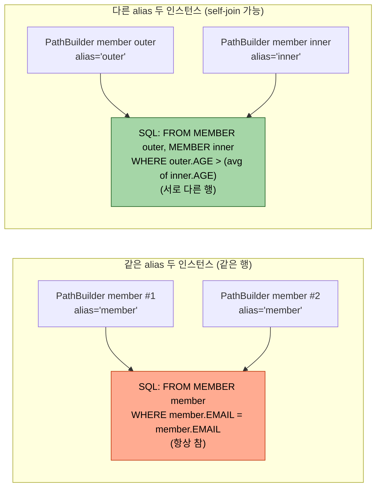
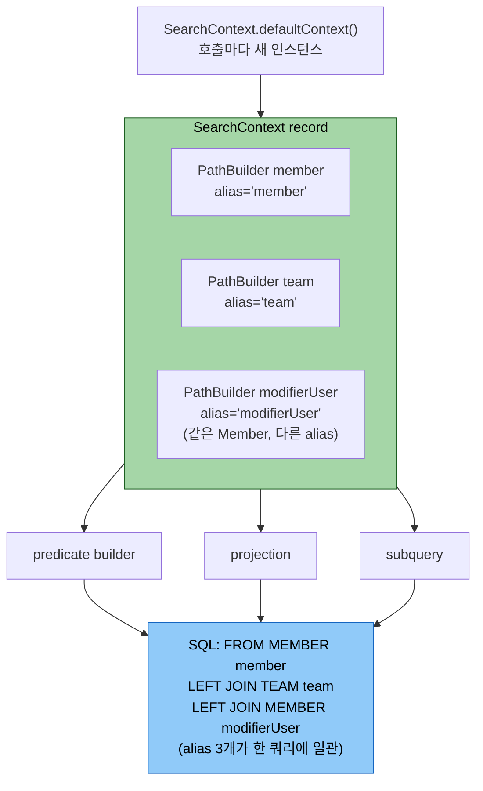

# PathBuilder — 동적 path 빌더 깊이

---

> **PathBuilder 가 필요한 네 가지 동기(자기참조 join·모듈 경계·EmbeddedId 두 단계 접근·동적 정렬 키)를 구분하고, Q-class 와의 트레이드오프를 컴파일 안전성·alias 자유도·모듈 경계 세 축에서 설명할 수 있으며, 컨텍스트 record 로 PathBuilder 묶음을 캡슐화하는 패턴을 운영 코드에 적용할 수 있다.**

1장에서 Q-class 라는 컴파일타임 메타모델을 익혔다면, 본 챕터는 그 메타모델을 *문자열로 동적으로 흉내내는* `PathBuilder` 의 정의·생성·자료형 접근·SQL 별칭·트레이드오프를 끝까지 본다. 

- Q-class 가 "정적 안전망" 이라면 PathBuilder 는 "동적 자유" — 같은 엔티티에 다른 alias 가 필요한 sub-query, Q-class import 가 어려운 모듈 경계, 정렬 키 수십 개를 한 매핑으로 줄이는 동적 정렬 같은 자리에서 의식적으로 선택한다.


## 왜 1장 Q-class 만으로는 부족한가

> Q-class 의 정적 안전성이 *오히려 걸림돌이 되는* 자리가 운영 코드베이스에는 흔하다. 이 절은 PathBuilder 가 *언제* 필요한지를 네 가지 구체적인 상황으로 정리하고, 이어지는 "정의와 생성" 절부터 그 상황들을 실제로 풀어 가는 사용법을 다룬다.

1장 01-01 § "Q클래스 없이도 가능한가"(L181~193)가 PathBuilder 의 존재를 11줄로 짧게 짚었다. 그 절은 "Q-class 가 안 될 때 도망갈 곳" 정도로 소개하고 02-04(현재 03-04)로 라우팅하는 구조였다. 본 챕터는 그 *언제* 를 한 자리에서 본다.

PathBuilder 가 *필요한* 네 가지 구체 동기는 다음과 같다. 미리 강도를 구분해 두면 — **네 가지 중 셋은 "Q-class 로도 되지만 불편" 이고, 모듈 경계 하나만 "Q-class 로는 불가능" 이다.** PathBuilder 를 *반드시* 써야 하는 자리는 사실상 모듈 경계뿐이고, 나머지는 *더 짧고 안전해서* 고르는 선택이다.

1. **자기참조 join** — *Q-class 로도 됨, 단 명시성에서 불리*. 같은 엔티티를 한 쿼리에 두 번 등장시키는 경우다. 
   - 1장 01-03 § "별칭 충돌과 자기 참조 조인" 이 `QMember("memberSub")` 두 번째 인스턴스로 풀었듯, Q-class 도 `new QMember("approver")` 처럼 alias 인스턴스를 손으로 선언하면 self-join 이 된다. 
   - 차이는 *강제성* — Q-class 는 기본 싱글톤(`QMember.member`)을 무심코 두 번 쓰면 같은 alias 가 되는 함정이 있지만, PathBuilder 는 생성 시 alias 를 반드시 적게 해 *모든 인스턴스* 가 명시적이다.
2. **Q-class import 가 어려운 모듈 경계** — *Q-class 로는 불가능에 가까운 유일한 자리*. 
   - 다른 모듈의 Q-class 가 컴파일 가시성 밖이거나 annotationProcessor 생성이 누락된 환경에서는 `QXxx` 를 import 하는 코드가 *컴파일 자체를 못 한다*. 
   - PathBuilder 는 엔티티 클래스(`Xxx.class`)만 있으면 메타모델을 흉내내므로 사실상 유일한 탈출구다.
   - 다만 PathBuilder 가 *유일한* 해법은 아니다. 모듈 구조를 손볼 수 있다면 "도메인 모듈에서 Q-class 를 빌드해 공유" 하는 정공법이 있고, 그 셋업·함정은 [03-02 § 멀티모듈 해결 패턴](03-01.테스트와%20멀티모듈.md) 이 다룬다. PathBuilder 는 *모듈 구조를 못 건드릴 때* 의 우회로다.
3. **EmbeddedId 두 단계 접근** — *Q-class 가 오히려 자연스러움*. 
   - 복합키 엔티티에서 `entity.id.subField` 를 Q-class 는 `QEntity.entity.id.subField` 로 그냥 쓰지만, PathBuilder 는 `get("id", XId.class)` 단계를 직접 캡슐화해야 한다. 
   - 이건 PathBuilder 의 *장점이 아니라 감수해야 할 비용* 이며, 다른 동기(모듈 경계 등) 때문에 PathBuilder 를 쓸 때 따라오는 추가 작업이다.
4. **동적 정렬 키 수십 개** — *Q-class 로도 되지만 장황*. 
   - 정렬 키가 수십 개면 Q-class 는 `switch` 로 키마다 `QEntity.field` 를 분기해야 하지만, PathBuilder 는 `pathBuilder.get(sortKey)` 한 줄로 문자열을 컬럼에 매핑한다. 
   - 1장 01-04 § "동적 정렬"(L215~242) 이 한 줄 라우팅으로만 짚었던 자리다. 키가 고정이면 Q-class 의 `switch` 로도 충분하다.


## 정의와 생성

> `PathBuilder<EntityType>` 는 *엔티티 타입 + 문자열 alias* 두 인자로 생성되며, alias 가 그대로 SQL 별칭으로 박힌다는 점이 핵심이다. 
>
> - 자료형 접근은 `getString`/`getNumber`/`getDateTime`/`get` 네 가지가 표준이고, EmbeddedId 같은 중첩 키는 두 단계로 파고든다. 
> - 다음 절은 이 alias 가 *SQL 에 어떻게 박히는지* 를 깊게 본다.

PathBuilder 는 *엔티티의 경로를 문자열로 가리키는 동적 path 빌더* 다. `PathBuilder<EntityType>` 형태로 타입 인자를 받고, 생성 시 alias 를 직접 짓는다.

```java
import com.querydsl.core.types.dsl.PathBuilder;

PathBuilder<Member> m = new PathBuilder<>(Member.class, "member");
```

- 여기서 `"member"` 가 *SQL 별칭으로 그대로 박힌다*. 즉 위 PathBuilder 가 쿼리에 들어가면 `... FROM MEMBER member ...` 가 만들어진다. 
- 같은 별칭으로 두 인스턴스를 만들면 SQL 상으로는 동일 별칭이라 같은 테이블 인스턴스를 가리키고, 다른 별칭으로 두 인스턴스를 만들면 SQL 의 서로 다른 alias 가 되어 self-join 이 가능해진다.

자료형별 컬럼 접근은 다음 네 가지가 표준이다.

```java
m.getString("email")                      // StringPath — VARCHAR 컬럼
m.getNumber("age", Integer.class)         // NumberPath<Integer> — INT 컬럼
m.getDateTime("joinedAt", LocalDateTime.class)  // DateTimePath — TIMESTAMP 컬럼
m.get("useFlag", UseFlag.class)           // PathBuilder<UseFlag> — embedded 타입
```

EmbeddedId 를 가진 엔티티는 두 단계로 접근한다.

```java
PathBuilder<ApprovalBasicEntity> approvalBasic =
    new PathBuilder<>(ApprovalBasicEntity.class, "approvalBasic");

PathBuilder<ApprovalBasicId> approvalBasicId =
    approvalBasic.get("id", ApprovalBasicId.class);

approvalBasicId.getString("atrzId")            // approvalBasic.ATRZ_ID
approvalBasicId.getNumber("vsrn", Integer.class)  // approvalBasic.VSRN
```

- 첫 줄이 *엔티티 자체* 의 PathBuilder, 둘째 줄이 *그 안의 EmbeddedId* 의 PathBuilder. 두 단계가 어색해 보여도 이 분리가 이름 충돌을 막는다. 
- EmbeddedId 안에 `id` 필드가 또 있으면 `approvalBasic.getString("id")` 가 모호해지기 때문이다.


## 별칭이 SQL 에 박히는 방식

> PathBuilder 의 alias 문자열이 *SQL FROM 절의 별칭으로 1:1 매핑* 되며, 같은 alias 의 두 인스턴스는 같은 행을, 다른 alias 의 두 인스턴스는 self-join 가능한 별 행을 가리킨다. 이 매핑 규칙이 컨텍스트 record 패턴(다음 절) 의 정합성 기반이다.

PathBuilder 가 만드는 SQL 별칭을 정확히 파악하면, 같은 쿼리 안에서 PathBuilder 인스턴스를 *언제 같이 묶고 언제 분리* 해야 하는지가 명확해진다.

PathBuilder 의 alias 가 SQL 에 박히는 두 패턴을 한눈에 보면 다음과 같다.



- 같은 alias 두 인스턴스가 *같은 행* 이 되는 함정은 디버깅이 어렵다
- Java 객체로는 다른 인스턴스이지만 SQL 별칭이 같아 *항상 참* 조건이 만들어진다. 이 함정을 피하는 게 다음 "컨텍스트 record" 패턴이 존재하는 이유다.

### 같은 alias 두 번 만들면 같은 인스턴스

```java
PathBuilder<Member> a = new PathBuilder<>(Member.class, "member");
PathBuilder<Member> b = new PathBuilder<>(Member.class, "member");

queryFactory.selectFrom(a)
    .where(a.getString("email").eq(b.getString("email")))  // 같은 alias라 같은 행 비교
    .fetch();
```

위 쿼리는 SQL 상 `WHERE member.EMAIL = member.EMAIL` 로 평탄화돼 *항상 참* 이 된다 — 같은 행을 자기 자신과 비교하기 때문이다.

### 다른 alias 두 번 만들면 self-join 가능

```java
PathBuilder<Member> outer = new PathBuilder<>(Member.class, "outer");
PathBuilder<Member> inner = new PathBuilder<>(Member.class, "inner");

queryFactory.select(outer.getString("name"))
    .from(outer)
    .where(outer.getNumber("age", Integer.class).gt(
        JPAExpressions.select(inner.getNumber("age", Integer.class).avg())
            .from(inner)
            .where(inner.getString("dept").eq(outer.getString("dept")))
    ))
    .fetch();
```

- 같은 `Member` 테이블이지만 alias 가 달라 outer 와 inner 가 서로 다른 행으로 평가된다. 
- 1장 01-03 § "별칭 충돌과 자기 참조 조인" 의 `QMember("memberSub")` 와 같은 의미 — 다만 PathBuilder 는 *모든 인스턴스* 에 명시적 별칭을 강제한다.

#### 실제 데이터로 보는 self-join — "자기 도시 평균보다 많은 나이"

말로는 와닿지 않으니 작은 데이터로 본다. "각 회원이 *자기가 사는 도시의 평균 나이* 보다 많은가?" 를 묻는 쿼리다 (실습 `Ch13` 의 실습1 과 같은 구조).

- `outer` = *지금 판정 중인 한 명*
- `inner` = *그 사람과 같은 도시에 사는 모든 회원* (평균을 내는 집합)

회원 데이터가 다음과 같다고 하자.

| id | name | city | age |
|----|------|------|-----|
| 1 | alice | 서울 | 30 |
| 2 | bob | 서울 | 24 |
| 3 | carol | 부산 | 50 |
| 4 | dave | 부산 | 40 |

도시별 평균은 *서울 = (30+24)/2 = 27*, *부산 = (50+40)/2 = 45* 다. 이제 outer 의 각 행을 *자기 도시 inner 평균* 과 비교한다.

| outer (한 명) | outer.city | 같은 도시 inner 평균 | outer.age > 평균? | 결과 |
|---------------|-----------|----------------------|-------------------|------|
| alice (30) | 서울 | 27 | 30 > 27 ✅ | 포함 |
| bob (24) | 서울 | 27 | 24 > 27 ❌ | 제외 |
| carol (50) | 부산 | 45 | 50 > 45 ✅ | 포함 |
| dave (40) | 부산 | 45 | 40 > 45 ❌ | 제외 |

- 결과는 `alice, carol` 두 명. 핵심은 **inner 의 평균이 outer 의 도시에 따라 달라진다** 는 점이다
- alice 를 볼 땐 서울 평균(27), carol 을 볼 땐 부산 평균(45). 이게 `inner.city = outer.city` 상관 조건이 하는 일이다.

위 표를 만드는 코드는 다음과 같다. `address.city` 는 임베디드 필드라 `get("address").getString("city")` 두 단계로 접근한다.

```java
PathBuilder<Member> outer = new PathBuilder<>(Member.class, "outerMember");
PathBuilder<Member> inner = new PathBuilder<>(Member.class, "innerMember");  // 다른 alias

List<Member> result = queryFactory
        .selectFrom(outer)
        .where(outer.getNumber("age", Integer.class).gt(
                JPAExpressions
                        .select(inner.getNumber("age", Integer.class).avg())
                        .from(inner)
                        .where(inner.get("address").getString("city")     // inner 의 도시 =
                                .eq(outer.get("address").getString("city")))  // outer 의 도시
        ))
        .fetch();
// 결과: alice, carol — 각자 자기 도시 평균보다 나이가 많은 회원
```

**그럼 두 alias 를 똑같이 `"member"` 로 줬다면?** 같은 alias 라 DB 는 outer 와 inner 를 *같은 한 행* 으로 평탄화한다. 그러면 inner 서브쿼리는 "같은 도시 사람들" 이 아니라 *outer 자기 자신 한 행* 만 보게 된다. `inner.city = outer.city` 가 사실상 `자기.city = 자기.city`(항상 참) 라, inner 집합이 *자기 한 명* 으로 줄기 때문이다.

> ⚠️ 여기서 헷갈리기 쉬운 점 — *`avg()` 가 고장 난 게 아니다*. `avg` 는 주어진 행의 평균을 정확히 낸다. 다만 그 *주어진 행* 이 "같은 도시 N명" 이어야 하는데 "자기 한 명" 으로 줄어든 게 문제다. `avg({30})` = 30 은 SQL 상 완벽히 정상 연산이다 — 한 개짜리 집합의 평균은 그 값 자체니까. 버그는 `avg` 가 아니라 *평균을 낼 모집단을 정하는 `from(inner) + where` 조건* 에 있다. 비유하면 "우리 반 평균 키보다 큰가?" 를 물어야 하는데 반(班)이 *나 혼자인 반* 으로 정의돼, "내 키가 나 혼자 평균(=내 키)보다 큰가?" → 항상 아니오가 된 셈이다.

| outer (한 명) | "같은 alias" inner 집합 | inner 평균 | outer.age > 평균? | 결과 |
|---------------|--------------------------|------------|-------------------|------|
| alice (30) | {alice} 자기 자신뿐 | 30 | 30 > 30 ❌ | 제외 |
| bob (24) | {bob} 자기 자신뿐 | 24 | 24 > 24 ❌ | 제외 |
| carol (50) | {carol} 자기 자신뿐 | 50 | 50 > 50 ❌ | 제외 |
| dave (40) | {dave} 자기 자신뿐 | 40 | 40 > 40 ❌ | 제외 |

- 조건이 전부 `자기 나이 > 자기 나이` → **항상 거짓 → 결과 0 건**. 위 "다른 alias" 표(alice·carol 포함)와 정반대다.

위 예제에서 alias 한 글자만 바꾸면 이 함정에 빠진다. 코드상 변수는 둘이지만 alias 문자열이 같다.

```java
PathBuilder<Member> outer = new PathBuilder<>(Member.class, "member");
PathBuilder<Member> inner = new PathBuilder<>(Member.class, "member");  // ❌ 같은 alias

List<Member> result = queryFactory
        .selectFrom(outer)
        .where(outer.getNumber("age", Integer.class).gt(
                JPAExpressions
                        .select(inner.getNumber("age", Integer.class).avg())
                        .from(inner)
                        .where(inner.get("address").getString("city")
                                .eq(outer.get("address").getString("city")))
        ))
        .fetch();
// 결과: 0 건 — outer 와 inner 가 같은 행으로 평탄화돼 "자기 나이 > 자기 나이"
```

한 줄로 기억하면 — **alias 가 다르면 "남들과 비교", 같으면 "자기 자신과 비교"** 다. self-join 의 모든 함정이 이 한 문장에서 나온다.

### 컨텍스트 record 로 한 번에 묶는 패턴

검색·정렬·서브쿼리에서 같은 별칭을 일관되게 재사용하려면, 한 번 만든 PathBuilder 묶음을 record 로 캡슐화하는 패턴이 자주 등장한다.

```java
public record SearchContext(
    PathBuilder<Member> member,
    PathBuilder<Team> team,
    PathBuilder<Member> modifierUser
) {
    public static SearchContext defaultContext() {
        return new SearchContext(
            new PathBuilder<>(Member.class, "member"),
            new PathBuilder<>(Team.class, "team"),
            new PathBuilder<>(Member.class, "modifierUser")  // 같은 Member, 다른 alias
        );
    }
}
```

- `defaultContext()` 가 호출마다 새 인스턴스를 만들기 때문에 동시 호출 사이에 별칭이 섞이지 않는다. 
- 모든 헬퍼(predicate builder, projection, 서브쿼리)가 같은 context 를 받아 같은 PathBuilder 를 참조하므로 SQL 별칭이 일관된다.


## 타입 안전성 트레이드오프

> PathBuilder 의 *문자열 기반 컬럼 접근* 이 alias 자유도·모듈 경계 같은 동적 자유를 주는 대가로 컴파일 안전성을 잃는다. 이를 보완하는 세 가지 표준 방법(화이트리스트 검증·단위 테스트·상수 추출)이 있으며, 새 프로젝트는 Q-class 가 기본이고 PathBuilder 는 *명확한 동기가 있을 때만* 의식적으로 선택한다.

PathBuilder 의 모든 컬럼 접근은 *문자열 기반* 이다. 이 한 사실에서 모든 트레이드오프가 파생된다.

```java
m.getString("emial")  // 오타. 컴파일 통과. 런타임에 SQL 에러
```

Q-class 였다면 `QMember.member.emial` 이 컴파일 단계에서 빨갛게 떨어지지만, PathBuilder 는 SQL 실행 시점까지 검증을 미룬다. 이를 보완하는 세 가지 표준 방법이 있다.

1. **화이트리스트 검증** — 사용자 입력으로 들어오는 sort key·search column 을 enum 으로 정의해 *정책 단계에서* 허용 컬럼만 통과시킨다. 컴파일러 대신 정책이 일차 게이트가 된다.
2. **단위 테스트** — PathBuilder 를 쓰는 쿼리는 반드시 `@DataJpaTest` 또는 in-memory DB 통합 테스트로 한 번 실행해 본다. 컬럼 오타가 있으면 *테스트가 빨갛게 떨어진다*.
3. **상수 추출** — 자주 쓰는 컬럼명은 `static final String COL_EMAIL = "email"` 같은 상수로 추출해 오타 위험 면을 줄인다.

| 비교 축 | Q-class | PathBuilder |
|---------|---------|-------------|
| 컴파일 안전성 | 강 | 약 (문자열) |
| alias 자유도 | 정적 (`memberSub` 같은 부가 인스턴스만) | 완전 자유 |
| 모듈 경계 | annotationProcessor 의존 | 엔티티 클래스만 있으면 됨 |
| EmbeddedId 접근 | `QE.e.id.sub` 자연스러움 | 두 단계 `get` 필수 |
| 정렬 키 수십 개 매핑 | `switch` 분기 N개 | `m.get(sortKey)` 한 줄 |
| 적합한 상황 | 새 프로젝트, 일반 검색 | 운영 코드베이스의 특수 패턴 |

새 프로젝트라면 Q-class 가 표준이다. PathBuilder 는 *위 네 가지 동기 중 하나* 가 명확할 때 의식적으로 선택한다.


## 운영 코드 reference

> TPS operator 의 결재 도메인에서 PathBuilder 가 *컨텍스트 record* 로 묶여 한 쿼리에서 협력하는 세 사례를 본다 (결재 관리 5필드 / 결재 이력 6필드 / 나의 할일 24필드). 공통 원칙은 *같은 쿼리 안에서 같은 엔티티 인스턴스를 가리키는 모든 표현식은 같은 PathBuilder 를 공유* — record 가 그 공유의 단위다.

TPS operator 의 결재 도메인에서 PathBuilder 가 어떻게 *컨텍스트 record* 로 묶여 쓰이는지 세 가지 사례를 본다.

> **읽는 법** — 아래 세 사례의 *record 코드* 와 *JOIN 종류·테이블 구성* 은 실제 운영 코드(`...QueryContext` + `...TableQueryAdapter`)를 직접 확인해 옮긴 것이다. *SQL 골격* 의 JOIN 종류(INNER/LEFT)·테이블·alias 는 실제와 일치하며, 생략하거나 SQL 관례로 옮긴 것은 *개별 조인 키 컬럼명* 뿐이다. 핵심으로 기억할 것 — 실제 JOIN 은 record 가 *아니라* 그 record 를 받아 쿼리를 조립하는 **adapter** 에 있다. record(`defaultContext`)는 별칭 그릇일 뿐 JOIN 을 하지 않는다.

컨텍스트 record 패턴이 PathBuilder 들을 어떻게 한 쿼리에 일관되게 연결하는지는 다음 그림으로 정리된다.



- `defaultContext()` 가 호출마다 *새 인스턴스* 를 반환하므로 동시 호출 사이에 alias 가 섞이지 않고, 같은 호출 안의 모든 헬퍼(predicate·projection·subquery)는 *같은 record 의 같은 PathBuilder* 를 받아 SQL alias 가 일관된다.

### 결재 관리 — 5 개 PathBuilder

```java
// operator/ticket/src/main/java/.../query/management/ApprovalManagementListQueryContext.java:17-36
public record ApprovalManagementListQueryContext(
    PathBuilder<ApprovalBasicEntity> approvalBasic,
    PathBuilder<ApprovalBasicId> approvalBasicId,
    PathBuilder<UseFlag> useFlag,
    PathBuilder<SoftDeleteFlag> softDeleteFlag,
    PathBuilder<AprvUserEntity> modifierUser
) {
    public static ApprovalManagementListQueryContext defaultContext() {
        PathBuilder<ApprovalBasicEntity> approvalBasic =
            new PathBuilder<>(ApprovalBasicEntity.class, "approvalBasic");
        return new ApprovalManagementListQueryContext(
            approvalBasic,
            approvalBasic.get("id", ApprovalBasicId.class),
            approvalBasic.get("useFlag", UseFlag.class),
            approvalBasic.get("softDeleteFlag", SoftDeleteFlag.class),
            new PathBuilder<>(AprvUserEntity.class, "approvalManagementModifierUser")
        );
    }
}
```

- `approvalBasic` 한 인스턴스에서 *EmbeddedId 1 개 + Embedded 객체 2 개* 가 파생되고, LEFT JOIN 용 `modifierUser` 는 별도 alias 로 분리. 다섯 PathBuilder 가 한 record 에 묶여 같은 쿼리 안에서 일관된 별칭으로 SQL 에 박힌다.

**defaultContext() 가 직접 SQL 을 만들지는 않는다.** 이 메서드는 "이 쿼리에서 쓸 PathBuilder 5개" 를 미리 만들어 *별칭을 확정한 설계도(record)* 를 돌려줄 뿐이고, 실제 SQL 은 이 record 를 쿼리(`select().from().leftJoin()...`)에 끼울 때 나온다. 중요한 건 **5개 PathBuilder 가 테이블 5개가 아니라는 점** 이다 — `new PathBuilder<>(...)` 로 만든 둘만 테이블(또는 조인)이 되고, `approvalBasic.get(...)` 으로 *파생* 된 셋은 같은 테이블의 *컬럼 경로* 다.

| PathBuilder | 생성 방식 | SQL 에서의 정체 |
|-------------|----------|-----------------|
| `approvalBasic` | `new PathBuilder<>(..., "approvalBasic")` | **메인 테이블** → `FROM ..._BASIC approvalBasic` |
| `approvalBasicId` | `approvalBasic.get("id", ...)` | 같은 테이블의 **복합키 컬럼** → `approvalBasic.ATRZ_ID` 등 |
| `useFlag` | `approvalBasic.get("useFlag", ...)` | 같은 테이블의 **embedded 컬럼** → `approvalBasic.USE_FLAG` |
| `softDeleteFlag` | `approvalBasic.get("softDeleteFlag", ...)` | 같은 테이블의 **embedded 컬럼** → `approvalBasic.DEL_FLAG` |
| `modifierUser` | `new PathBuilder<>(..., "...ModifierUser")` | **별도 테이블** → `LEFT JOIN ..._USER ...ModifierUser` |

그래서 이 record 를 쓴 쿼리가 만드는 SQL 골격은 다음과 같다 — 테이블은 *2개*(`approvalBasic` + 조인된 user), 나머지 셋은 전부 `approvalBasic.*` 컬럼으로 녹아든다.

```sql
SELECT ...
FROM      ..._BASIC  approvalBasic                                  -- approvalBasic (new)
LEFT JOIN ..._USER   approvalManagementModifierUser                 -- modifierUser (new)
       ON approvalManagementModifierUser.USER_ID = approvalBasic.MDFR_ID
WHERE  approvalBasic.USE_FLAG = 'Y'      -- useFlag       (파생, 같은 테이블 컬럼)
  AND  approvalBasic.DEL_FLAG = 'N'      -- softDeleteFlag (파생, 같은 테이블 컬럼)
  AND  approvalBasic.ATRZ_ID = ?         -- approvalBasicId.atrzId (파생, 같은 테이블 컬럼)
```

### 결재 이력 — 같은 테이블 두 별칭 self-join

```java
// .../query/history/ApprovalHistoryListQueryContext.java
public record ApprovalHistoryListQueryContext(
    PathBuilder<ApprovalProgressEntity> progress,        // TB_TPS_AZ_005 (메인)
    PathBuilder<ApprovalProgressId> progressId,          // progress 의 EmbeddedId (파생)
    PathBuilder<ApprovalTargetBasicEntity> approvalStep, // TB_TPS_AZ_003 (조인)
    PathBuilder<ApprovalTargetBasicId> approvalStepId,   // approvalStep 의 EmbeddedId (파생)
    PathBuilder<AprvUserEntity> approverUser,            // TB_TPS_CM_001 결재자
    PathBuilder<AprvUserEntity> applicantUser            // TB_TPS_CM_001 요청자 (같은 테이블, 다른 alias)
) {
    public static ApprovalHistoryListQueryContext defaultContext() {
        PathBuilder<ApprovalProgressEntity> progress =
            new PathBuilder<>(ApprovalProgressEntity.class, "approvalProgress");
        PathBuilder<ApprovalTargetBasicEntity> approvalStep =
            new PathBuilder<>(ApprovalTargetBasicEntity.class, "approvalHistoryStep");
        return new ApprovalHistoryListQueryContext(
            progress,
            progress.get("id", ApprovalProgressId.class),
            approvalStep,
            approvalStep.get("id", ApprovalTargetBasicId.class),
            new PathBuilder<>(AprvUserEntity.class, "approvalHistoryApproverUser"),
            new PathBuilder<>(AprvUserEntity.class, "approvalHistoryApplicantUser")
        );
    }
}
```

**먼저 짚을 것 — 이 record 자체는 JOIN 을 하지 않는다.** `defaultContext()` 안 어디에도 `leftJoin` 이 없다. 이건 *PathBuilder 6개를 만들어 별칭만 확정한 그릇* 일 뿐이고, 실제 JOIN 은 *이 context(`ctx`) 를 받아 쿼리를 조립하는 adapter* (`ApprovalHistoryTableQueryAdapter`)에 있다. 실제 코드는 다음과 같다.

```java
// ApprovalHistoryTableQueryAdapter — 여기서 비로소 JOIN SQL 이 생긴다
queryFactory
    .select(...)
    .from(ctx.progress())                                  // FROM TB_TPS_AZ_005
    .innerJoin(ctx.approvalStep()).on(                     // INNER JOIN TB_TPS_AZ_003
        ctx.approvalStepId().getString("atrzId")
                .eq(ctx.progressId().getString("atrzId")),         // 복합키 3개로 매칭 —
        ctx.approvalStepId().getNumber("vsrn", Integer.class)
                .eq(ctx.progressId().getNumber("vsrn", Integer.class)),  // EmbeddedId 파생
        ctx.approvalStepId().getNumber("atrzSn", Integer.class)
                .eq(ctx.progressId().getNumber("atrzSn", Integer.class)) // PathBuilder 가 쓰이는 자리
    )
    .leftJoin(ctx.approverUser())                          // LEFT JOIN TB_TPS_CM_001 (결재자)
        .on(ctx.approverUser().getString("userId")
                .eq(ctx.progress().getString("aprvrId")))
    .leftJoin(ctx.applicantUser())                         // LEFT JOIN TB_TPS_CM_001 (요청자)
        .on(ctx.applicantUser().getString("userId")
                .eq(ctx.progress().getString("rgtrId")))
    .fetch();
```

즉 record 는 *재료(별칭 박힌 PathBuilder)* 준비, JOIN 은 adapter 가 한다. `ctx.approverUser()` 는 그저 `"approvalHistoryApproverUser"` alias 가 박힌 PathBuilder 일 뿐, adapter 가 `.leftJoin(...).on(...)` 을 호출해야 JOIN 이 생긴다. 여기서 *EmbeddedId 파생* (`progressId`·`approvalStepId`)이 왜 record 에 들어 있었는지도 드러난다 — `approvalStep` 조인 조건이 단일 컬럼이 아니라 **복합키 3개(atrzId·vsrn·atrzSn) 매칭** 이라, 그 컬럼들을 꺼내려면 EmbeddedId PathBuilder 가 필요하다.

- 6개 중 `new` 로 만든 넷(`progress`·`approvalStep`·`approverUser`·`applicantUser`)이 테이블/조인이 되고, `progressId`·`approvalStepId` 는 각 메인의 EmbeddedId *컬럼 경로* 다 (파생).
- 핵심은 `approverUser`/`applicantUser` — 같은 `AprvUserEntity` (TB_TPS_CM_001) 를 *결재자용 / 요청자용 두 별칭* 으로 분리했다. Q-class 단일 정적 인스턴스로는 alias 가 하나라 self-join 자체가 안 되는 자리다.

그래서 조립된 SQL 골격은 다음과 같다 (위 adapter 코드와 대응). 같은 `TB_TPS_CM_001` 이 alias 가 둘이라 *두 번* 등장한다.

```sql
SELECT ...
FROM       TB_TPS_AZ_005  approvalProgress                        -- progress (new, 메인)
INNER JOIN TB_TPS_AZ_003  approvalHistoryStep                     -- approvalStep (new)
        ON approvalHistoryStep.ATRZ_ID  = approvalProgress.ATRZ_ID   -- 복합키 3개 매칭
       AND approvalHistoryStep.VSRN     = approvalProgress.VSRN      -- (progressId /
       AND approvalHistoryStep.ATRZ_SN  = approvalProgress.ATRZ_SN   --  approvalStepId)
LEFT  JOIN TB_TPS_CM_001  approvalHistoryApproverUser             -- 결재자 alias (new)
        ON approvalHistoryApproverUser.USER_ID  = approvalProgress.APRVR_ID
LEFT  JOIN TB_TPS_CM_001  approvalHistoryApplicantUser            -- 요청자 alias (new)
        ON approvalHistoryApplicantUser.USER_ID = approvalProgress.RGTR_ID
```

- `approvalStep` 은 **INNER JOIN** 이고 조건이 *복합키 3개(ATRZ_ID·VSRN·ATRZ_SN)* 다 — 이게 `progressId`·`approvalStepId` EmbeddedId PathBuilder 가 record 에 들어 있던 이유다.
- `approverUser`/`applicantUser` 는 같은 테이블이지만 alias 가 달라 *결재자 정보* 와 *요청자 정보* 를 한 행에 동시에 가져온다. alias 를 똑같이 줬다면 두 JOIN 이 같은 인스턴스로 평탄화돼 결재자=요청자인 행만 나오는 함정에 빠진다 (앞 § "실제 데이터로 보는 self-join" 의 0건 함정과 같은 원리).

> 컬럼명(`ATRZ_ID`·`VSRN`·`APRVR_ID` 등)은 실제 코드의 필드명(`atrzId`·`vsrn`·`aprvrId`)을 SQL 컬럼 관례로 옮긴 것이라 실제 DB 컬럼과 미세하게 다를 수 있으나, JOIN 종류(INNER/LEFT)와 조인 키 구조는 `ApprovalHistoryTableQueryAdapter` 실제 코드와 일치한다.

### 나의 할일 — 24 필드 record (테이블 14 + EmbeddedId 10)

```java
// .../query/mytodo/MyToListQueryContext.java — record 필드 24개 (발췌)
public record MyToListQueryContext(
    PathBuilder<ApprovalExecutionBasicEntity> aprvExcn,         // TB_TPS_AZ_006 (메인) — new
    PathBuilder<ApprovalProgressEntity> progress,              // TB_TPS_AZ_005 — new
    PathBuilder<ApprovalProgressId> progressId,                //   progress 의 EmbeddedId — 파생
    PathBuilder<ApprovalTargetApproverEntity> approver,        // TB_TPS_AZ_004 — new
    PathBuilder<ApprovalTargetApproverId> approverId,          //   approver 의 EmbeddedId — 파생
    PathBuilder<ApprovalTargetBasicEntity> aprvStep,           // TB_TPS_AZ_003 — new
    PathBuilder<ApprovalTargetBasicId> aprvStepId,             //   파생
    /* ... ticket / wfTrigger / wfComponent / aprvBasic / dmndUser / menu
           / pageMapping / pageCompn / sttsCode + 각 EmbeddedId ... */
    PathBuilder<CommonCodeReferenceEntity> sttsCode            // TB_TPS_CM_037 — new
) { ... }
```

여기서 **"14" 는 PathBuilder 개수가 아니라 *테이블* 개수다.** record 필드는 실제로 *24개* 이고, 그중 `new PathBuilder<>(...)` 로 만든 **테이블이 14개**(aprvExcn 메인 + 조인 13), `xxx.get("id", ...Id.class)` 로 *파생* 된 **EmbeddedId 가 10개** 다. 파생 10개는 새 테이블이 아니라 각 테이블의 *복합키 컬럼 경로* 라, JOIN 조건(앞 결재 이력처럼 복합키 매칭)이나 SELECT 컬럼에 쓰인다.

- 14개 테이블이 한 쿼리에서 협력한다 — 메인 결재실행 + 단계(진행·정의·결재자) + 티켓 매핑·본문 + 워크플로 트리거·컴포넌트 + 결재 마스터 + 상신자·메뉴 + 페이지·컴포넌트 매핑 + 상태 코드.
- 실제 `ApprovalToDoTableQueryAdapter` 의 조립: **INNER JOIN 4개**(aprvBasic·pageMapping·pageCompn·dmndUser) + **LEFT JOIN 6개**(menu·tcktAprvExcn·ticket·wfTrigger·wfComponent·sttsCode) + 결재 권한 EXISTS 서브쿼리 + 스칼라 서브쿼리.

```sql
SELECT ...
FROM        TB_TPS_AZ_006  aprvExcn                       -- aprvExcn (메인, new)
INNER JOIN  TB_TPS_AZ_001  aprvBasic        ON ...        -- 결재 마스터 (new)
INNER JOIN  TB_TPS_AT_002  pageMapping      ON ...        -- 단계-페이지 (new)
INNER JOIN  TB_TPS_AT_003  pageCompn        ON ...        -- 페이지-컴포넌트 (new)
INNER JOIN  TB_TPS_CM_001  dmndUser         ON ...        -- 상신자 (new)
LEFT  JOIN  TB_TPS_AT_001  menu             ON ...        -- 메뉴 (new)
LEFT  JOIN  TB_TRB_TK_010  tcktAprvExcn     ON ...        -- 결재-티켓 매핑 (new)
LEFT  JOIN  TB_TRB_TK_001  ticket           ON ...        -- 티켓 본문 (new)
LEFT  JOIN  TB_TRB_WK_006  wfTrigger        ON ...        -- 워크플로 트리거 (new)
LEFT  JOIN  TB_TRB_WK_005  wfComponent      ON ...        -- 워크플로 컴포넌트 (new)
LEFT  JOIN  TB_TPS_CM_037  sttsCode         ON ...        -- 상태 코드 (new)
WHERE  EXISTS ( SELECT 1 FROM ... )                       -- 결재 권한 EXISTS (progress·approver 사용)
ORDER BY ...
```

- 조인·서브쿼리가 아무리 많아도 *같은 컨텍스트의 같은 PathBuilder* 를 공유하므로, 24개 표현식이 가리키는 alias 가 한 SQL 안에서 어긋나지 않는다. 이게 record 로 묶는 이유다.

> JOIN 종류(INNER 4 / LEFT 6)와 테이블·alias 구성은 `ApprovalToDoTableQueryAdapter`·`MyToListQueryContext` 실제 코드와 일치한다. `ON ...` 의 개별 조인 키만 생략했다(progress·approver 등은 EXISTS 서브쿼리에서 쓰여 메인 JOIN 목록엔 안 나온다).

세 사례 모두 공통 원칙은 같다 — **한 쿼리 안에서 같은 엔티티 인스턴스를 가리키는 모든 표현식은 같은 PathBuilder 를 공유해야 한다**. 컨텍스트 record 가 그 공유의 단위다.


## 면접에서 받을 만한 질문

> 본 챕터의 핵심을 *그림 없이 말로 설명할 수 있는 수준* 으로 압축한 5개 질문. 세 동기(자기참조·모듈경계·동적 정렬) + EmbeddedId 두 단계 + 컨텍스트 record 동시 호출 안전성 — 이 다섯 축이 모두 들어왔는지 자가 점검 도구다.

1. PathBuilder 를 쓰는 이유 세 가지를 들 수 있는가? (자기참조 join · 모듈 경계 · 동적 정렬 키)
2. `@EmbeddedId` 에서 PathBuilder 두 단계 접근(`m.get("id").getString("sub")`) 이 왜 필요한가?
3. Q-class 와 PathBuilder 의 컴파일 안전성 차이를 어떻게 보완할 수 있는가?
4. 같은 엔티티를 두 번 별칭 다르게 join 할 때 Q-class 만으로 안 되는 이유는?
5. 컨텍스트 record 로 PathBuilder 를 묶는 패턴이 동시 호출 안전성에 어떻게 기여하는가?

## 관련 문서

> 본 문서가 다룬 PathBuilder 가 묶음 안의 다른 챕터와 어떻게 연결되는지 5개 링크. 01-01 이 도입을 짧게 짚었고 01-03 이 Q-class 두 번째 인스턴스 패턴을, 02-02 가 함께 등장하는 서브쿼리 빌더를, 03-04·03-06 이 응용 사례를 다룬다.

- [01-01. QueryDSL 입문과 6.12의 위치](01-01.QueryDSL%20입문과%206.12의%20위치.md) § "Q클래스 없이도 가능한가" — PathBuilder 의 짧은 도입
- [01-03. 기본 문법과 조인](01-03.기본%20문법과%20조인.md) § "별칭 충돌과 자기 참조 조인" — Q-class 두 번째 인스턴스로 푸는 동일 문제
- [02-02. JPAExpressions — 서브쿼리 합성](02-02.JPAExpressions%20%E2%80%94%20%EC%84%9C%EB%B8%8C%EC%BF%BC%EB%A6%AC%20%ED%95%A9%EC%84%B1.md) — PathBuilder 와 함께 등장하는 서브쿼리 빌더
- [03-03. 실무 변형 모음](03-03.실무%20변형%20모음.md) § "PathBuilder 기반 메타모델" — Q-class 회피 / EmbeddedId / 상관 서브쿼리 / 동적 검색 추상 베이스 응용
- [03-05. window 함수 없는 JPA QueryDSL의 ROW_NUMBER 대체](03-05.window%20함수%20없는%20JPA%20QueryDSL의%20ROW_NUMBER%20대체.md) — PathBuilder 3 개가 한 SQL 패턴에 결합되는 사례 통째 분해
