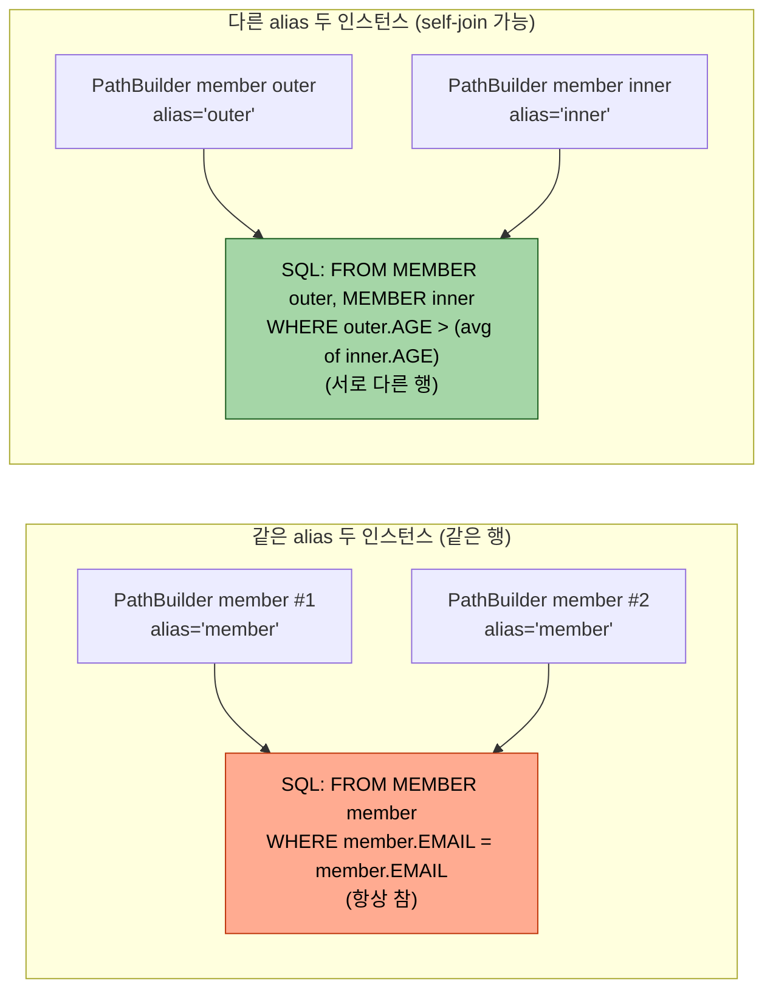
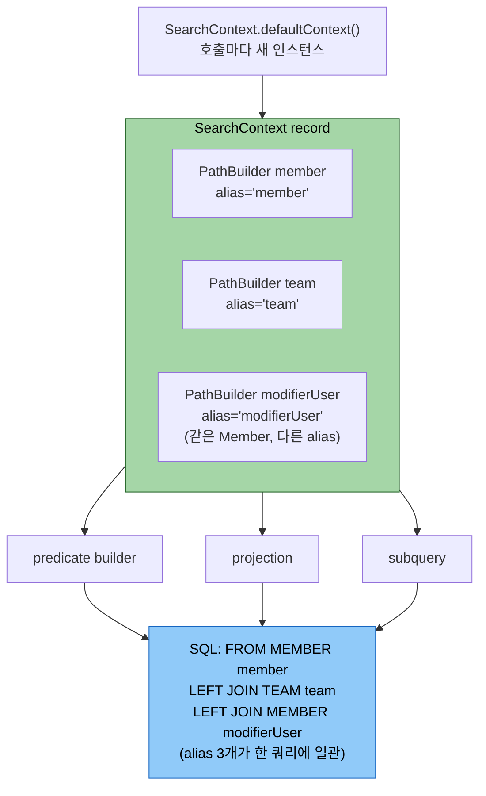

# PathBuilder — 동적 path 빌더 깊이

---

> **이 문서를 읽고 나면, PathBuilder 가 필요한 네 가지 동기(자기참조 join·모듈 경계·EmbeddedId 두 단계 접근·동적 정렬 키)를 구분하고, Q-class 와의 트레이드오프를 컴파일 안전성·alias 자유도·모듈 경계 세 축에서 설명할 수 있으며, 컨텍스트 record 로 PathBuilder 묶음을 캡슐화하는 패턴을 운영 코드에 적용할 수 있다.**

1장에서 Q-class 라는 컴파일타임 메타모델을 익혔다면, 본 챕터는 그 메타모델을 *문자열로 동적으로 흉내내는* `PathBuilder` 의 정의·생성·자료형 접근·SQL 별칭·트레이드오프를 끝까지 본다. Q-class 가 "정적 안전망" 이라면 PathBuilder 는 "동적 자유" — 같은 엔티티에 다른 alias 가 필요한 sub-query, Q-class import 가 어려운 모듈 경계, 정렬 키 수십 개를 한 매핑으로 줄이는 동적 정렬 같은 자리에서 의식적으로 선택한다.

## 왜 1장 Q-class 만으로는 부족한가

> Q-class 의 정적 안전성이 *오히려 막는* 자리가 운영 코드베이스에는 흔하다 — 자기참조 join, 모듈 경계, EmbeddedId 두 단계 접근, 동적 정렬 키 수십 개. 본 절은 PathBuilder 가 *언제* 필요한지 네 가지 구체 동기로 못 박는다. 다음 절 "정의와 생성" 부터는 그 동기를 받는 도구의 사용법으로 들어간다.

1장 01-01 § "Q클래스 없이도 가능한가"(L181~193)가 PathBuilder 의 존재를 11줄로 짧게 짚었다. 그 절은 "Q-class 가 안 될 때 도망갈 곳" 정도로 소개하고 02-04(현재 03-04)로 라우팅하는 구조였다. 본 챕터는 그 *언제* 를 한 자리에서 본다.

PathBuilder 가 *필요한* 네 가지 구체 동기는 다음과 같다.

1. **자기참조 join** — 같은 엔티티를 한 쿼리에 두 번 등장시키는 경우. 1장 01-03 § "별칭 충돌과 자기 참조 조인" 이 `QMember("memberSub")` 두 번째 인스턴스로 풀었다면, PathBuilder 는 *모든 인스턴스* 를 명시적 alias 로 만든다.
2. **Q-class import 가 어려운 모듈 경계** — 다른 모듈의 Q-class 가 컴파일 가시성 밖이거나 annotationProcessor 생성이 누락된 환경에서, 엔티티 클래스만으로 메타모델을 흉내내야 할 때.
3. **EmbeddedId 두 단계 접근** — 복합키 엔티티에서 `entity.id.subField` 형태로 두 번 파고들어야 할 때, Q-class 는 `QEntity.entity.id.subField` 로 자연스럽지만 PathBuilder 는 한 단계를 직접 캡슐화해야 한다.
4. **동적 정렬 키 수십 개** — `switch` 분기 대신 `pathBuilder.get(sortKey)` 한 줄 매핑으로 줄이는 패턴. 1장 01-04 § "동적 정렬"(L215~242) 이 한 줄 라우팅으로만 짚었던 자리다.

## 정의와 생성

> `PathBuilder<EntityType>` 는 *엔티티 타입 + 문자열 alias* 두 인자로 생성되며, alias 가 그대로 SQL 별칭으로 박힌다는 점이 핵심이다. 자료형 접근은 `getString`/`getNumber`/`getDateTime`/`get` 네 가지가 표준이고, EmbeddedId 같은 중첩 키는 두 단계로 파고든다. 다음 절은 이 alias 가 *SQL 에 어떻게 박히는지* 를 깊게 본다.

PathBuilder 는 *엔티티의 경로를 문자열로 가리키는 동적 path 빌더* 다. `PathBuilder<EntityType>` 형태로 타입 인자를 받고, 생성 시 alias 를 직접 짓는다.

```java
import com.querydsl.core.types.dsl.PathBuilder;

PathBuilder<Member> m = new PathBuilder<>(Member.class, "member");
```

여기서 `"member"` 가 *SQL 별칭으로 그대로 박힌다*. 즉 위 PathBuilder 가 쿼리에 들어가면 `... FROM MEMBER member ...` 가 만들어진다. 같은 별칭으로 두 인스턴스를 만들면 SQL 상으로는 동일 별칭이라 같은 테이블 인스턴스를 가리키고, 다른 별칭으로 두 인스턴스를 만들면 SQL 의 서로 다른 alias 가 되어 self-join 이 가능해진다.

자료형별 컬럼 접근은 다음 네 가지가 표준이다.

```java
m.getString("email")                      // StringPath — VARCHAR 컬럼
m.getNumber("age", Integer.class)         // NumberPath<Integer> — INT 컬럼
m.getDateTime("joinedAt", LocalDateTime.class)  // DateTimePath — TIMESTAMP 컬럼
m.get("useFlag", UseFlag.class)           // PathBuilder<UseFlag> — embedded 타입
```

EmbeddedId 를 가진 엔티티는 두 단계로 접근한다.

```java
PathBuilder<ApprovalBasicEntity> approvalBasic =
    new PathBuilder<>(ApprovalBasicEntity.class, "approvalBasic");
PathBuilder<ApprovalBasicId> approvalBasicId =
    approvalBasic.get("id", ApprovalBasicId.class);

approvalBasicId.getString("atrzId")            // approvalBasic.ATRZ_ID
approvalBasicId.getNumber("vsrn", Integer.class)  // approvalBasic.VSRN
```

첫 줄이 *엔티티 자체* 의 PathBuilder, 둘째 줄이 *그 안의 EmbeddedId* 의 PathBuilder. 두 단계가 어색해 보여도 이 분리가 이름 충돌을 막는다. EmbeddedId 안에 `id` 필드가 또 있으면 `approvalBasic.getString("id")` 가 모호해지기 때문이다.

## 별칭이 SQL 에 박히는 방식

> PathBuilder 의 alias 문자열이 *SQL FROM 절의 별칭으로 1:1 매핑* 되며, 같은 alias 의 두 인스턴스는 같은 행을, 다른 alias 의 두 인스턴스는 self-join 가능한 별 행을 가리킨다. 이 매핑 규칙이 컨텍스트 record 패턴(다음 절) 의 정합성 기반이다.

PathBuilder 가 만드는 SQL 별칭을 정확히 파악하면, 같은 쿼리 안에서 PathBuilder 인스턴스를 *언제 같이 묶고 언제 분리* 해야 하는지가 명확해진다.

PathBuilder 의 alias 가 SQL 에 박히는 두 패턴을 한눈에 보면 다음과 같다.



같은 alias 두 인스턴스가 *같은 행* 이 되는 함정은 디버깅이 어렵다 — Java 객체로는 다른 인스턴스이지만 SQL 별칭이 같아 *항상 참* 조건이 만들어진다. 이 함정을 피하는 게 다음 "컨텍스트 record" 패턴이 존재하는 이유다.

### 같은 alias 두 번 만들면 같은 인스턴스

```java
PathBuilder<Member> a = new PathBuilder<>(Member.class, "member");
PathBuilder<Member> b = new PathBuilder<>(Member.class, "member");

queryFactory.selectFrom(a)
    .where(a.getString("email").eq(b.getString("email")))  // 같은 alias라 같은 행 비교
    .fetch();
```

위 쿼리는 SQL 상 `WHERE member.EMAIL = member.EMAIL` 로 평탄화돼 *항상 참* 이 된다 — 같은 행을 자기 자신과 비교하기 때문이다.

### 다른 alias 두 번 만들면 self-join 가능

```java
PathBuilder<Member> outer = new PathBuilder<>(Member.class, "outer");
PathBuilder<Member> inner = new PathBuilder<>(Member.class, "inner");

queryFactory.select(outer.getString("name"))
    .from(outer)
    .where(outer.getNumber("age", Integer.class).gt(
        JPAExpressions.select(inner.getNumber("age", Integer.class).avg())
            .from(inner)
            .where(inner.getString("dept").eq(outer.getString("dept")))
    ))
    .fetch();
```

같은 `Member` 테이블이지만 alias 가 달라 outer 와 inner 가 서로 다른 행으로 평가된다. 1장 01-03 § "별칭 충돌과 자기 참조 조인" 의 `QMember("memberSub")` 와 같은 의미 — 다만 PathBuilder 는 *모든 인스턴스* 에 명시적 별칭을 강제한다.

### 컨텍스트 record 로 한 번에 묶는 패턴

검색·정렬·서브쿼리에서 같은 별칭을 일관되게 재사용하려면, 한 번 만든 PathBuilder 묶음을 record 로 캡슐화하는 패턴이 자주 등장한다.

```java
public record SearchContext(
    PathBuilder<Member> member,
    PathBuilder<Team> team,
    PathBuilder<Member> modifierUser
) {
    public static SearchContext defaultContext() {
        return new SearchContext(
            new PathBuilder<>(Member.class, "member"),
            new PathBuilder<>(Team.class, "team"),
            new PathBuilder<>(Member.class, "modifierUser")  // 같은 Member, 다른 alias
        );
    }
}
```

`defaultContext()` 가 호출마다 새 인스턴스를 만들기 때문에 동시 호출 사이에 별칭이 섞이지 않는다. 모든 헬퍼(predicate builder, projection, 서브쿼리)가 같은 context 를 받아 같은 PathBuilder 를 참조하므로 SQL 별칭이 일관된다.

## 타입 안전성 트레이드오프

> PathBuilder 의 *문자열 기반 컬럼 접근* 이 alias 자유도·모듈 경계 같은 동적 자유를 주는 대가로 컴파일 안전성을 잃는다. 이를 보완하는 세 가지 표준 방법(화이트리스트 검증·단위 테스트·상수 추출)이 있으며, 새 프로젝트는 Q-class 가 기본이고 PathBuilder 는 *명확한 동기가 있을 때만* 의식적으로 선택한다.

PathBuilder 의 모든 컬럼 접근은 *문자열 기반* 이다. 이 한 사실에서 모든 트레이드오프가 파생된다.

```java
m.getString("emial")  // 오타. 컴파일 통과. 런타임에 SQL 에러
```

Q-class 였다면 `QMember.member.emial` 이 컴파일 단계에서 빨갛게 떨어지지만, PathBuilder 는 SQL 실행 시점까지 검증을 미룬다. 이를 보완하는 세 가지 표준 방법이 있다.

1. **화이트리스트 검증** — 사용자 입력으로 들어오는 sort key·search column 을 enum 으로 정의해 *정책 단계에서* 허용 컬럼만 통과시킨다. 컴파일러 대신 정책이 일차 게이트가 된다.
2. **단위 테스트** — PathBuilder 를 쓰는 쿼리는 반드시 `@DataJpaTest` 또는 in-memory DB 통합 테스트로 한 번 실행해 본다. 컬럼 오타가 있으면 *테스트가 빨갛게 떨어진다*.
3. **상수 추출** — 자주 쓰는 컬럼명은 `static final String COL_EMAIL = "email"` 같은 상수로 추출해 오타 위험 면을 줄인다.

| 비교 축 | Q-class | PathBuilder |
|---------|---------|-------------|
| 컴파일 안전성 | 강 | 약 (문자열) |
| alias 자유도 | 정적 (`memberSub` 같은 부가 인스턴스만) | 완전 자유 |
| 모듈 경계 | annotationProcessor 의존 | 엔티티 클래스만 있으면 됨 |
| EmbeddedId 접근 | `QE.e.id.sub` 자연스러움 | 두 단계 `get` 필수 |
| 정렬 키 수십 개 매핑 | `switch` 분기 N개 | `m.get(sortKey)` 한 줄 |
| 적합한 상황 | 새 프로젝트, 일반 검색 | 운영 코드베이스의 특수 패턴 |

새 프로젝트라면 Q-class 가 표준이다. PathBuilder 는 *위 네 가지 동기 중 하나* 가 명확할 때 의식적으로 선택한다.

## 운영 코드 reference

> TPS operator 의 결재 도메인에서 PathBuilder 가 *컨텍스트 record* 로 5개·6개·14개씩 묶여 한 쿼리에서 협력하는 세 사례를 본다. 공통 원칙은 *같은 쿼리 안에서 같은 엔티티 인스턴스를 가리키는 모든 표현식은 같은 PathBuilder 를 공유* — record 가 그 공유의 단위다.

TPS operator 의 결재 도메인에서 PathBuilder 가 어떻게 *컨텍스트 record* 로 묶여 쓰이는지 세 가지 사례를 본다.

컨텍스트 record 패턴이 PathBuilder 들을 어떻게 한 쿼리에 일관되게 연결하는지 다음 그림이 박는다.



`defaultContext()` 가 호출마다 *새 인스턴스* 를 반환하므로 동시 호출 사이에 alias 가 섞이지 않고, 같은 호출 안의 모든 헬퍼(predicate·projection·subquery)는 *같은 record 의 같은 PathBuilder* 를 받아 SQL alias 가 일관된다.

### 결재 관리 — 5 개 PathBuilder

```java
// operator/ticket/src/main/java/.../query/management/ApprovalManagementListQueryContext.java:17-36
public record ApprovalManagementListQueryContext(
    PathBuilder<ApprovalBasicEntity> approvalBasic,
    PathBuilder<ApprovalBasicId> approvalBasicId,
    PathBuilder<UseFlag> useFlag,
    PathBuilder<SoftDeleteFlag> softDeleteFlag,
    PathBuilder<AprvUserEntity> modifierUser
) {
    public static ApprovalManagementListQueryContext defaultContext() {
        PathBuilder<ApprovalBasicEntity> approvalBasic =
            new PathBuilder<>(ApprovalBasicEntity.class, "approvalBasic");
        return new ApprovalManagementListQueryContext(
            approvalBasic,
            approvalBasic.get("id", ApprovalBasicId.class),
            approvalBasic.get("useFlag", UseFlag.class),
            approvalBasic.get("softDeleteFlag", SoftDeleteFlag.class),
            new PathBuilder<>(AprvUserEntity.class, "approvalManagementModifierUser")
        );
    }
}
```

`approvalBasic` 한 인스턴스에서 *EmbeddedId 1 개 + Embedded 객체 2 개* 가 파생되고, LEFT JOIN 용 `modifierUser` 는 별도 alias 로 분리. 다섯 PathBuilder 가 한 record 에 묶여 같은 쿼리 안에서 일관된 별칭으로 SQL 에 박힌다.

### 결재 이력 — 같은 테이블 두 별칭 self-join

```java
// .../query/history/ApprovalHistoryListQueryContext.java
new PathBuilder<>(AprvUserEntity.class, "approvalHistoryApproverUser"),   // 결재자
new PathBuilder<>(AprvUserEntity.class, "approvalHistoryApplicantUser")   // 요청자
```

같은 `AprvUserEntity` (TB_TPS_CM_001) 를 *결재자용 / 요청자용 두 별칭* 으로 분리한 사례. LEFT JOIN 을 두 번 걸어 한 쪽은 `aprvrId` 와 매칭, 다른 쪽은 `rgtrId` 와 매칭한다. Q-class 단일 정적 인스턴스로는 alias 가 하나라 self-join 자체가 안 된다.

### 나의 할일 — 14 개 PathBuilder

```java
// .../query/mytodo/MyToListQueryContext.java
public record MyToListQueryContext(
    PathBuilder<ApprovalExecutionBasicEntity> aprvExcn,
    PathBuilder<ApprovalProgressEntity> progress,
    PathBuilder<ApprovalProgressId> progressId,
    PathBuilder<ApprovalTargetApproverEntity> approver,
    /* ... 14 개 ... */
) { ... }
```

메인 결재실행 + 단계 진행 + 결재자 정의 + 티켓 매핑 + 워크플로 트리거 + 결재 마스터 + 메뉴 + 페이지·컴포넌트 + 상태 코드 — 14 개 PathBuilder 가 한 쿼리 안에서 협력한다. INNER JOIN 4 + LEFT JOIN 6 + EXISTS 서브쿼리 + 스칼라 서브쿼리가 *같은 컨텍스트* 의 PathBuilder 들을 공유해 별칭이 깨지지 않는다.

세 사례 모두 공통 원칙은 같다 — **한 쿼리 안에서 같은 엔티티 인스턴스를 가리키는 모든 표현식은 같은 PathBuilder 를 공유해야 한다**. 컨텍스트 record 가 그 공유의 단위다.

## 면접에서 받을 만한 질문

> 본 챕터의 핵심을 *그림 없이 말로 설명할 수 있는 수준* 으로 압축한 5개 질문. 세 동기(자기참조·모듈경계·동적 정렬) + EmbeddedId 두 단계 + 컨텍스트 record 동시 호출 안전성 — 이 다섯 축이 모두 들어왔는지 자가 점검 도구다.

1. PathBuilder 를 쓰는 이유 세 가지를 들 수 있는가? (자기참조 join · 모듈 경계 · 동적 정렬 키)
2. `@EmbeddedId` 에서 PathBuilder 두 단계 접근(`m.get("id").getString("sub")`) 이 왜 필요한가?
3. Q-class 와 PathBuilder 의 컴파일 안전성 차이를 어떻게 보완할 수 있는가?
4. 같은 엔티티를 두 번 별칭 다르게 join 할 때 Q-class 만으로 안 되는 이유는?
5. 컨텍스트 record 로 PathBuilder 를 묶는 패턴이 동시 호출 안전성에 어떻게 기여하는가?

## 관련 문서

> 본 문서가 다룬 PathBuilder 가 묶음 안의 다른 챕터와 어떻게 연결되는지 5개 링크. 01-01 이 도입을 짧게 짚었고 01-03 이 Q-class 두 번째 인스턴스 패턴을, 02-02 가 함께 등장하는 서브쿼리 빌더를, 03-04·03-06 이 응용 사례를 다룬다.

- [01-01. QueryDSL 입문과 6.12의 위치](01-01.QueryDSL%20입문과%206.12의%20위치.md) § "Q클래스 없이도 가능한가" — PathBuilder 의 짧은 도입
- [01-03. 기본 문법과 조인](01-03.기본%20문법과%20조인.md) § "별칭 충돌과 자기 참조 조인" — Q-class 두 번째 인스턴스로 푸는 동일 문제
- [02-02. JPAExpressions — 서브쿼리 합성](02-02.JPAExpressions%20%E2%80%94%20%EC%84%9C%EB%B8%8C%EC%BF%BC%EB%A6%AC%20%ED%95%A9%EC%84%B1.md) — PathBuilder 와 함께 등장하는 서브쿼리 빌더
- [03-04. 실무 변형 모음](03-04.실무%20변형%20모음.md) § "PathBuilder 기반 메타모델" — Q-class 회피 / EmbeddedId / 상관 서브쿼리 / 동적 검색 추상 베이스 응용
- [03-06. window 함수 없는 JPA QueryDSL의 ROW_NUMBER 대체](03-06.window%20함수%20없는%20JPA%20QueryDSL의%20ROW_NUMBER%20대체.md) — PathBuilder 3 개가 한 SQL 패턴에 결합되는 사례 통째 분해
