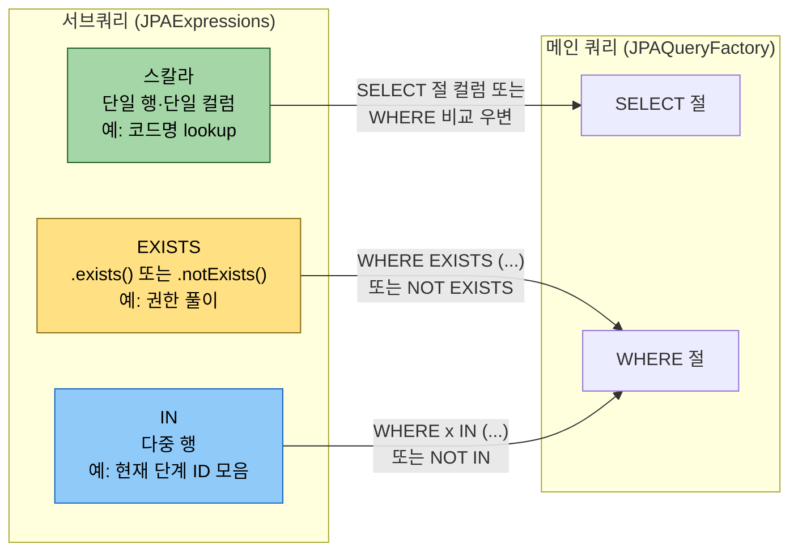
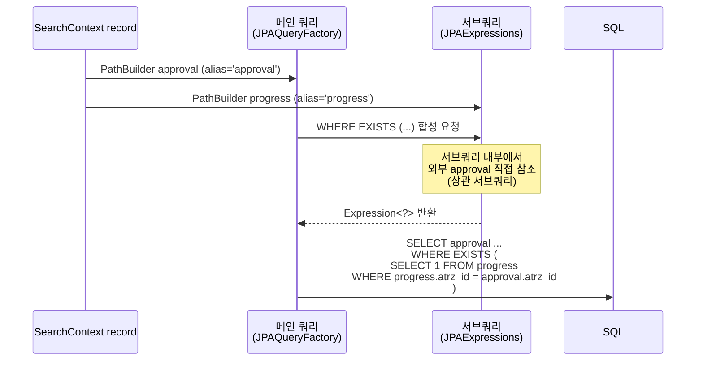

# JPAExpressions — 서브쿼리 합성

---

> **이 문서를 읽고 나면, `JPAExpressions` 가 만드는 서브쿼리 세 형태(스칼라·EXISTS·IN)를 자리에 맞게 쓸 수 있고, 상관 서브쿼리에서 외부 PathBuilder 를 어떻게 참조하는지 설명할 수 있으며, JPA QueryDSL 의 sub-query LIMIT 제약을 우회하는 두 패턴(상관 서브쿼리 + ROW_NUMBER 대체)을 선택해 적용할 수 있다.**

1장에서 `JPAQueryFactory` 로 메인 쿼리를 짜는 법을 익혔다면, 본 챕터는 그 메인 쿼리 안에 *끼울 sub-select* 를 만드는 `JPAExpressions` 의 세 가지 사용 형태(스칼라·EXISTS·IN), 상관 서브쿼리, JPA QueryDSL 의 LIMIT 제약을 끝까지 본다. 

1장 전체에서 0회 등장하던 서브쿼리 빌더가 운영 코드의 권한 풀이·코드명 lookup·현재 단계 판정의 척추이기 때문에, 본 챕터 없이는 결재 도메인 코드를 못 읽는다.


## 왜 서브쿼리가 별도 빌더인가

> 메인 쿼리(`JPAQueryFactory`) 는 `JPAQuery<T>` 를 반환해 `.fetch()` 로 끝나고, 서브쿼리(`JPAExpressions`) 는 `Expression<?>` 으로 끝나 메인의 select/where/orderBy 인자에 *합성* 된다. 
>
> - 두 진입점이 분리된 본질적 이유는 *반환 타입의 차이* 다. 다음 절 "세 가지 사용 형태" 부터 그 합성이 어디에 박히는지 자리별로 본다.

메인 쿼리는 `JPAQueryFactory.select(...).from(...)` 으로 시작한다. 이 진입점은 *결과를 fetch 하는* 쿼리를 위한 것이다.

서브쿼리는 다르다. 서브쿼리의 결과는 fetch 되지 않고 *메인 쿼리의 select / where / orderBy 인자로 합성* 된다. 따라서 서브쿼리 빌더는 `Expression<?>` 타입을 반환해야 메인 쿼리가 받아들일 수 있다. 이 역할을 하는 정적 진입점이 `JPAExpressions` 다.

```java
import com.querydsl.jpa.JPAExpressions;

// 메인 쿼리
queryFactory.select(member)
    .from(member)
    .where(
        member.id.in(                              // ← 메인의 where 인자
            JPAExpressions.select(other.fkId)      // ← 서브쿼리 진입점
                .from(other)
                .where(...)
        )
    )
    .fetch();
```

- 위 구조에서 `JPAExpressions.select(...).from(...).where(...)` 가 만든 sub-query 는 *fetch 되지 않는다 
- `member.id.in(...)` 에 합성될 `Expression<?>` 으로 변환되어 SQL 평탄화 시점에 `WHERE member.id IN (SELECT ...)` 로 박힌다.

진입점이 달라야 하는 이유는 본질적으로 *반환 타입의 차이* 다. `JPAQueryFactory` 의 진입점은 `JPAQuery<T>` 를 반환해 `.fetch()` 로 끝낼 수 있어야 하고, `JPAExpressions` 의 진입점은 `Expression<?>` 으로 끝나야 메인 쿼리가 받아들인다.


## 세 가지 사용 형태

> 서브쿼리는 SQL 자리에 따라 *스칼라(단일 행·단일 컬럼) / EXISTS(존재 여부) / IN(다중 행)* 세 형태로 갈리고, 각각 `.select(...).from(...).where(...)` 다음에 빈 호출, `.exists()`, 결과 그대로 세 가지 마무리가 달라진다. 
>
> 다음 절 "상관 서브쿼리" 는 이 세 형태가 *외부 PathBuilder 를 참조* 할 때의 패턴을 본다.

`JPAExpressions` 가 만드는 서브쿼리는 SQL 상에서 세 가지 자리에 박힌다. 자리에 따라 빌더의 마지막 메서드가 달라진다.

세 형태가 메인 쿼리의 어느 자리에 합성되는지 한 그림으로 보면 다음과 같다.



### 1. 스칼라 서브쿼리 — SELECT 절 또는 비교 우변

스칼라 서브쿼리는 *단일 컬럼·단일 행* 을 반환해 SELECT 결과의 한 컬럼이 되거나 WHERE 비교의 우변에 박힌다.

```java
// SELECT 절 — 결재명을 메인 쿼리의 컬럼 한 자리로
queryFactory.select(
        approval.atrzId,
        JPAExpressions.select(code.cdNm)
            .from(code)
            .where(
                code.upCd.eq("000133"),
                code.cd.eq(approval.atrzSeCd)
            )
    )
    .from(approval)
    .fetch();
```

SQL 평탄화는 다음과 같다.

```sql
SELECT
    approval.ATRZ_ID,
    (
      SELECT code.CD_NM FROM TB_CODE code
      WHERE code.UP_CD = '000133' AND code.CD = approval.ATRZ_SE_CD
    )
FROM TB_APPROVAL approval
```

WHERE 비교 우변에 박을 때는 다음과 같다.

```java
// WHERE 비교 — 같은 atrzId 안에서 최신 vsrn 만
queryFactory.selectFrom(approval)
    .where(
        approval.vsrn.eq(
            JPAExpressions.select(sub.vsrn.max())
                .from(sub)
                .where(sub.atrzId.eq(approval.atrzId))
        )
    )
    .fetch();
```

- 두 예제의 *위치는 다르다* — 첫 예제는 메인 쿼리의 **SELECT 절** 에, 둘째 예제는 메인 쿼리의 **WHERE 비교 우변** 에 박힌다. 
- 하지만 *서브쿼리 자체의 조건은 같다*: **`JPAExpressions.select(...)` 의 인자가 반드시 단일 표현식** 이어야 한다 (첫 예제는 `code.cdNm`, 둘째는 `sub.vsrn.max()` — 둘 다 하나). 
- 스칼라 서브쿼리는 *단일 행·단일 컬럼* 을 반환해야 비교·대입이 성립하기 때문이다. 메인 쿼리의 어느 자리에 박히든 이 규칙은 동일하다.

### 2. EXISTS 술어 — WHERE 절

EXISTS 는 *서브쿼리에 행이 한 개라도 있는지* 만 판정한다. 따라서 SELECT 절의 내용은 의미가 없고, QueryDSL 은 이를 명시적으로 `.selectOne()` 으로 표현한다.

```java
// 결재자로 매핑된 사용자만
queryFactory.selectFrom(approval)
    .where(
        JPAExpressions.selectOne()
            .from(approver)
            .where(
                approver.atrzId.eq(approval.atrzId),
                approver.userId.eq(currentUser)
            )
            .exists()
    )
    .fetch();
```

SQL 평탄화는 `EXISTS (SELECT 1 FROM TB_APPROVER approver WHERE ...)`.

`.selectOne()` 은 `SELECT 1` 의 평탄화로, EXISTS 안의 SELECT 컬럼이 실제로는 의미 없음을 코드에서도 드러내는 관습이다. `.exists()` 가 `BooleanExpression` 을 반환하므로 메인 쿼리의 `.where(...)` 또는 다른 BooleanExpression 과 `.and()` / `.or()` 로 자유롭게 합성된다.

NOT EXISTS 가 필요하면 `.notExists()` 를 쓴다.

### 3. IN 절 sub-select — WHERE 절

IN 절의 우변에 서브쿼리를 박는 형태.

```java
// 활성 부서에 속한 멤버만
queryFactory.selectFrom(member)
    .where(
        member.deptId.in(
            JPAExpressions.select(dept.id)
                .from(dept)
                .where(dept.active.eq(true))
        )
    )
    .fetch();
```

- SQL 평탄화는 `WHERE member.DEPT_ID IN (SELECT dept.ID FROM TB_DEPT dept WHERE dept.ACTIVE = true)`.

세 형태의 공통점은 *서브쿼리 자체가 fetch 되지 않는다* 는 것 — 메인 쿼리의 한 자리에 합성될 표현식으로 변환된다.


## 상관 서브쿼리 — 외부 PathBuilder 직접 참조

> 서브쿼리 안에서 *메인 쿼리의 PathBuilder 를 직접 참조* 하면 행마다 평가되는 상관 서브쿼리가 만들어진다. 
>
> EXISTS·스칼라 어느 자리든 같은 패턴이며, 02-01 컨텍스트 record 가 *외부와 내부 PathBuilder 를 같은 객체* 로 공유하는 단위가 된다.

상관 서브쿼리(correlated subquery)는 *서브쿼리 안에서 외부 쿼리의 컬럼을 참조* 하는 형태다. SQL 에서 `WHERE sub.col = outer.col` 같은 결합 조건이 들어가는 자리.

QueryDSL 에서는 외부 PathBuilder 를 *그대로* 참조하면 평탄화 시점에 알아서 상관 조건으로 박힌다.

```java
PathBuilder<ApprovalBasicEntity> approval =
    new PathBuilder<>(ApprovalBasicEntity.class, "approval");
PathBuilder<ApprovalBasicEntity> sub =
    new PathBuilder<>(ApprovalBasicEntity.class, "sub");

// 서브쿼리 
queryFactory.selectFrom(approval)
    .where(
        approval.get("id").getNumber("vsrn", Integer.class).eq(
            JPAExpressions.select(
                    sub.get("id").getNumber("vsrn", Integer.class).max()
                )
                .from(sub)
                .where(
                    sub.get("id").getString("atrzId").eq(
                        approval.get("id").getString("atrzId")  // ← 외부 alias 직접 참조
                    )
                )
        )
    )
    .fetch();
```

마지막 `sub.atrzId.eq(approval.atrzId)` 가 상관 조건이다. SQL 평탄화 결과는 다음과 같다.

```sql
SELECT * FROM TB_APPROVAL approval
WHERE approval.VSRN = (
    SELECT MAX(sub.VSRN)
    FROM TB_APPROVAL sub
    WHERE sub.ATRZ_ID = approval.ATRZ_ID  -- 외부 approval 의 ATRZ_ID 와 상관
)
```

상관 서브쿼리가 자연스럽게 작성되려면 *외부의 PathBuilder 와 서브쿼리의 PathBuilder 가 다른 alias* 여야 한다. 같은 alias 면 같은 행을 비교하게 돼 의미가 깨진다. 02-01 § "다른 alias 두 번 만들면 self-join 가능" 의 원칙이 그대로 적용된다.


## JPA QueryDSL 의 제약 — sub-query 의 LIMIT / OFFSET

> JPQL 표준은 sub-query 에서 `LIMIT`/`OFFSET` 을 허용하지 않으므로, QueryDSL 도 같은 제약을 따른다. 
>
> *"각 그룹별 최신 1건"* 같은 native SQL 패턴이 필요할 때 03-06 의 ROW_NUMBER 대체 패턴 또는 상관 서브쿼리(`max(...)` 비교) 두 갈래로 우회한다.

JPA 표준의 JPQL 은 sub-query 에서 `LIMIT` / `OFFSET` 사용에 제약이 있었다. 

- Hibernate 6.x 부터 *지원이 확대* 됐지만, QueryDSL 6.12 의 sub-query 빌더에서 `.limit(n)` 을 직접 호출하면 일부 dialect 와 패턴 조합에서 작동하지 않는다. 
- 7.x 에서 추가 개선이 들어왔으며 자세한 차이는 [03-03. 대안 비교와 6.12→7.x 마이그레이션](03-03.대안%20비교와%206.12-7.x%20마이그레이션.md) 에서 다룬다.

### 왜 DB 마다 다른가 — 3층 번역 구조

같은 `.limit(1L)` 코드가 MariaDB 에선 되고 PostgreSQL 에선 깨지는 이유는, QueryDSL 코드가 SQL 에 도달하기까지 *세 층* 을 거치면서 각 층의 규칙이 다르기 때문이다.

```
QueryDSL (.limit(1L))  →  JPQL/HQL  →  Hibernate dialect  →  실제 SQL
   (1) 빌더 API           (2) JPA 표준     (3) DB 방언 번역      (4) DB 실행
```

1. **JPQL(JPA 표준) 층** — 명세에는 *서브쿼리 LIMIT 문법이 정의돼 있지 않다*. "표준만 따르면" 어느 DB 든 안 돼야 한다. 그래서 출발점은 *모두 제약* 이다.
2. **Hibernate dialect 층** — 여기가 갈리는 지점이다. Hibernate 는 HQL 을 *각 DB 방언으로 번역* 하는데, 서브쿼리 안 LIMIT 을 *그 DB 의 SQL 로 옮길 수 있느냐* 가 dialect 마다 다르다.
   - **MariaDB / MySQL dialect**: 이들 DB 의 SQL 은 스칼라 서브쿼리에 `ORDER BY ... LIMIT 1` 을 *느슨하게 허용* 한다. Hibernate 가 그대로 번역해 동작한다.
   - **PostgreSQL dialect**: PostgreSQL 은 SQL 표준에 더 엄격해, *스칼라 위치*(SELECT 한 컬럼·비교 우변)의 서브쿼리에 LIMIT 을 거는 형태를 Hibernate 가 안전하게 평탄화하지 못한다. 그 결과 LIMIT 이 빠진 채 번역돼 서브쿼리가 여러 행을 반환하고 `more than one row` 로 실패한다.
3. **DB 실행 층** — 번역된 SQL 을 DB 가 실행한다. 여기선 이미 dialect 가 정한 SQL 대로 돌 뿐이다.

즉 *"JPA 가 막는다"* 가 아니라 *"DB 방언마다 SQL 능력이 다르고, Hibernate 의 번역도 그에 맞춰 달라서"* 환경 의존적인 것이다. 그래서 우회책(`max()`/`min()` 집계)은 *어느 dialect 에서나 단일 행을 보장하는 표준 SQL* 로 이 차이를 비켜간다 — 집계 함수는 모든 DB 가 동일하게 단일 값을 반환하기 때문이다.

운영 코드에서 "현재 진행 중인 단계 한 건" 같은 `LIMIT 1` 스칼라 서브쿼리가 필요할 때는 다음 두 방식을 검토한다.

```java
// 방식 1 — JPAExpressions.select(...).limit(1L) 직접 호출 (6.12 + MariaDB/MySQL 에서 동작)
JPAExpressions
    .select(p.get("id").getNumber("atrzSn", Integer.class))
    .from(p)
    .where(...)
    .orderBy(
        new CaseBuilder()
            .when(s.getString("ordrDsgnYn").eq("Y")).then(0)
            .otherwise(1).asc(),
        p.get("id").getNumber("atrzSn", Integer.class).asc()
    )
    .limit(1L);
```

> 위 `orderBy` 의 `new CaseBuilder().when(...).then(0).otherwise(1)` 은 *조건부 정렬 키* 를 만드는 QueryDSL 의 CASE 표현식 빌더다 — 여기선 "지정 결재(`ordrDsgnYn='Y'`) 를 먼저(0), 나머지는 나중에(1)" 정렬한다. CaseBuilder 의 문법과 NULLS LAST 응용은 [02-03 § NULLS LAST — 형태 2 CASE 기반](02-03.정렬·집계·프로젝션%20보충.md) 이 다룬다.

```java
// 방식 2 — LIMIT 미지원 환경이면 윈도 함수 평탄화 또는 GROUP BY + MAX/MIN 으로 우회
// 자세한 패턴은 03-06 에서 통째 분해
```

운영 코드의 `curAtrzSnSubquery` 는 방식 1 을 채택했다. MariaDB 기준에서 `ORDER BY ... LIMIT 1` 스칼라 서브쿼리가 안정적으로 평탄화되기 때문이다.

> **실측 — PostgreSQL 에서는 방식 1 이 깨진다.** 
>
> - 실습 `Ch10` 에서 `JPAExpressions.select(...).orderBy(...).limit(1L)` 을 스칼라 위치(SELECT 절)에 넣고 PostgreSQL 로 실행하면, *LIMIT 이 서브쿼리에 평탄화되지 않아* 서브쿼리가여러 행을 반환하고 `ERROR: more than one row returned by a subquery used as an expression` 으로 실패한다. 
> - 같은 코드가 MariaDB 에서는 동작한다 — 노트가 "환경 의존적" 이라 한 게 이 차이다. **PostgreSQL 이면 방식 1 을 쓰지 말고 `max(...)`/`min(...)` 집계로 단일 행을 보장하는 방식 2 로 우회한다.** (집계는 항상 한 행이라 평탄화가 안전하다.)


## `function('xxx', ...)` — MariaDB/MySQL native 함수 호출

> JPQL 표준이 제공하지 않는 DB 벤더 함수를 `Expressions.template`/`Expressions.numberTemplate` 으로 호출한다. 
>
> 다음 절 "Hibernate dialect FUNCTION 등록" 이 *이 호출이 부팅 시 어떻게 인식되어야 하는지* 운영 전제 조건을 본다.

서브쿼리 안에서 dialect 가 직접 지원하지 않는 SQL 함수를 호출할 때 — 또는 표준 SQL 함수지만 QueryDSL 의 `Expressions.stringTemplate` 만으로는 *함수 호출임을 명시* 해야 할 때 — 다음 형태를 쓴다.

```java
// 표준 SQL함수이나 지원을 직접적으로 안하는 경우
Expressions.stringTemplate(
    "function('group_concat', concat({0}, '-', {1}))",
    pageRef.getString("pageNm"),
    pageCompn.getString("pageCompnNm")
)
```

- `function('group_concat', ...)` 의 형태가 Hibernate 에게 *이건 SQL function 으로 평탄화하라* 는 신호다. 
- 일반 `stringTemplate("group_concat({0})", ...)` 와의 차이는 *dialect 매핑* 이 들어간다는 점 — Hibernate 가 함수 이름을 dialect 의 함수 테이블에서 찾아 알맞은 SQL 토큰으로 변환한다.

운영 코드에서 자주 등장하는 함수 호출:

| 함수 호출 | 산출 SQL | 용도 |
|-----------|---------|------|
| `function('regexp_instr', {0}, {1})` | `regexp_instr(col, 'kw')` | 키워드 부분일치 |
| `function('date_format', {0}, {1})` | `DATE_FORMAT(col, '%Y-%m-%d %H:%i:%s')` | datetime → 문자열, 글로벌 검색에서 비교용 |
| `function('group_concat', concat({0},'-',{1}))` | `GROUP_CONCAT(CONCAT(a,'-',b))` | 다대다 매핑을 한 문자열로 합성 |
| `function('replace', {0}, ' ', '')` | `REPLACE(col, ' ', '')` | 공백 제거 후 비교 |
| `cast({0} as integer)` (template 직접) | `CAST(col AS INTEGER)` | 문자열 → 숫자 변환, 권한 풀이의 roleId 매칭 |
| `function('coalesce', {0}, '')` 또는 `coalesce({0}, '')` | `COALESCE(col, '')` | NULL 안전 합성 |

- `function('xxx', ...)` 와 `xxx({0}, {1})` 의 직접 호출은 결과 SQL 이 같지만, *dialect 가 함수 이름을 모르면 어떻게 처리되는지* 가 다르다.
-  `function()` 형태는 Hibernate 가 dialect 함수 테이블을 *반드시 거치므로* 미등록 함수는 깔끔하게 `FunctionNotFoundException` 으로 떨어진다. 
- 직접 호출은 dialect 의 syntax 검증 없이 SQL 에 그대로 박혀 *실행 시점에 DB 에서 실패* — 디버깅이 더 어렵다.

### 운영 코드 reference

```java
// .../query/management/ApprovalManagementListQuerySupport.java
public static StringExpression dateTimeAsString(DateTimeExpression<?> dateTime) {
    return Expressions.stringTemplate(
        "function('date_format', {0}, {1})",
        dateTime,
        Expressions.constant(DATE_TIME_FORMAT)
    );
}

public static BooleanExpression regexp(Expression<String> expression, String keyword) {
    return Expressions.numberTemplate(
        Integer.class,
        "function('regexp_instr', {0}, {1})",
        expression,
        keyword
    ).gt(0);
}
```

- `regexp_instr` 는 MariaDB / MySQL 8.x 의 정규식 함수. PostgreSQL 환경이면 `function('regexp_match', ...)` 으로 dialect 가 알아서 대응한다 — *함수 이름을 dialect 에 위임* 하는 게 핵심 이득이다.


## Hibernate dialect FUNCTION 등록 — 운영 환경 전제 조건

> `function('xxx', ...)` 호출이 부팅 시 인식되려면 Hibernate 6 의 `FunctionContributor` SPI 또는 커스텀 dialect 로 함수 등록이 필요하다. 등록 누락 시 *부팅은 통과하지만 쿼리 실행 시 SQL 에러* 가 발생하므로 운영 위생의 기본이다.

위 `function('group_concat', ...)` / `function('regexp_instr', ...)` 가 작동하려면 *Hibernate 가 그 이름을 함수로 인식* 하고 있어야 한다. Hibernate 6.x 부터는 표준 함수 다수가 자동 등록되지만, MariaDB / MySQL 의 일부 함수는 사용자가 dialect 에 등록해 줘야 한다.

### MetadataBuilderContributor 등록 패턴

```java
import org.hibernate.boot.MetadataBuilder;
import org.hibernate.boot.spi.MetadataBuilderContributor;
import org.hibernate.dialect.function.StandardSQLFunction;
import org.hibernate.type.StandardBasicTypes;

// 함수등록
public class CustomFunctionContributor implements MetadataBuilderContributor {

    @Override
    public void contribute(MetadataBuilder metadataBuilder) {
        metadataBuilder.applySqlFunction(
            "group_concat",
            new StandardSQLFunction("group_concat", StandardBasicTypes.STRING)
        );
      
        metadataBuilder.applySqlFunction(
            "regexp_instr",
            new StandardSQLFunction("regexp_instr", StandardBasicTypes.INTEGER)
        );
    }
}
```

- `META-INF/services/org.hibernate.boot.spi.MetadataBuilderContributor` 에 위 클래스의 FQCN 을 등록하면 Spring Boot 가 부팅 시 자동 적용한다. Hibernate 6.x 에서는 `FunctionContributor` 인터페이스로 약간 다른 형태도 가능.

### Spring Boot properties 로 간단 등록

복잡한 함수가 아니라면 `application.yml` 만으로 끝낼 수도 있다.

```yaml
spring:
  jpa:
    properties:
      hibernate:
        metadata_builder_contributor: org.example.CustomFunctionContributor
```

- 또는 Hibernate 6.4 부터 `function-contributor` SPI 가 더 깔끔하다.
-  `META-INF/services/org.hibernate.boot.model.FunctionContributor` 등록.

### 학습자 입장에서의 실수 패턴

> 운영 코드가 `function('group_concat', ...)` 을 쓰는데 IDE 에서는 보이지만, 학습자가 작은 프로젝트에서 같은 코드를 짜면 *부팅 시 `FunctionNotFoundException`* 으로 떨어진다.

- 원인은 dialect 에 함수가 등록되지 않은 것. 운영 환경은 누군가 `MetadataBuilderContributor` 를 등록해 둔 *전제* 위에 동작한다. 
- 학습자는 이 전제를 인지하고 자신의 작은 프로젝트에서도 같은 등록을 해 줘야 동일 코드가 동작한다.

### dialect 별 호환성 표

| 함수 | MariaDB 10.5+ | MySQL 8.0+ | PostgreSQL 12+ | H2 | Oracle 19+ |
|------|---------------|------------|----------------|-----|------------|
| `group_concat` | ✓ | ✓ | ✗ (`string_agg`) | ✓ | ✗ (`listagg`) |
| `regexp_instr` | ✓ | ✓ | ✗ (`regexp_match`) | ✗ | ✓ |
| `date_format` | ✓ | ✓ | ✗ (`to_char`) | ✓ | ✗ (`to_char`) |
| `coalesce` | ✓ | ✓ | ✓ | ✓ | ✓ |
| `cast as` | ✓ | ✓ | ✓ | ✓ | ✓ |

- DB 마이그레이션을 고려해야 하면 *함수명 추상화* — 운영 코드에서 직접 `function('regexp_instr', ...)` 을 쓰지 말고 `Support.regexp(expr, kw)` 같은 헬퍼 메서드로 한 번 감싸서 *함수명 의존을 한 곳에 모은다*. dialect 가 바뀔 때 헬퍼 한 곳만 고치면 된다.


## 운영 코드 reference

> TPS operator 결재 도메인의 *공통코드 lookup·권한 풀이·현재 단계 판정* 네 자리에서 `JPAExpressions` 가 어떻게 박혀 있는지 실제 코드로 본다. 공통 패턴은 *상관 서브쿼리 + 컨텍스트 record 의 PathBuilder 공유* 다.

상관 서브쿼리가 외부와 내부 PathBuilder 를 어떻게 공유하는지 다음 그림으로 잡힌다.



- 상관 서브쿼리의 핵심은 *내부 PathBuilder 와 외부 PathBuilder 가 같은 컨텍스트 record 에서 나온다* 는 점이다 — 02-01 의 record 패턴이 이 자리에서 직접 보상받는다.
- TPS operator 의 결재 도메인에서 `JPAExpressions` 가 어떻게 SELECT·WHERE 자리마다 다른 형태로 박히는지 네 가지 사례를 본다.

### 스칼라 서브쿼리 — 공통코드 lookup

```java
// .../query/management/ApprovalManagementListQuerySupport.java
public static StringExpression commonCodeName(String upCd, StringExpression cdExpression, String alias) {
    PathBuilder<CommonCodeReferenceEntity> codeRef =
        new PathBuilder<>(CommonCodeReferenceEntity.class, alias);
  
    return Expressions.stringTemplate(
        "({0})",
        JPAExpressions
            .select(codeRef.getString("cdNm"))
            .from(codeRef)
            .where(
                codeRef.get("id").getString("upCd").eq(upCd),
                codeRef.get("id").getString("cd").eq(cdExpression)
            )
    );
}
```

- 코드 ID 를 한글 코드명으로 변환하는 *표준 패턴*. 
- SELECT 절에 결과 컬럼 한 자리를 차지한다. `Expressions.stringTemplate("({0})", ...)` 으로 한 번 더 감싼 이유는 메인 쿼리의 alias 부여(`.as("atrzSeNm")`) 가 자연스럽게 붙도록 *expression 한 단위로 평탄화* 하기 위함이다.

### 스칼라 서브쿼리 — GROUP_CONCAT

```java
// ApprovalManagementListQuerySupport.aprvTrgtPageCompTxtExpr
return Expressions.stringTemplate(
    "({0})",
    JPAExpressions.select(Expressions.stringTemplate(
            "function('group_concat', concat({0}, '-', {1}))",
            pageRef.getString("pageNm"),
            pageCompn.getString("pageCompnNm")
        ))
        .from(trigger)
        .innerJoin(pageRef).on(...)
        .innerJoin(pageCompn).on(...)
        .where(...)
        .groupBy(...)
);
```

- 결재 트리거 페어를 하나의 합성 문자열로 묶어 결과 컬럼으로 노출한다. 
- 메인 쿼리의 페이지네이션이 깨지지 않도록 *결과 행 수를 늘리지 않는 스칼라 서브쿼리* 로 평탄화하는 게 핵심.

### EXISTS — 권한 매핑 판정

```java
// .../adapter/mytodo/ApprovalToDoTableQueryAdapter.java:159-168
private BooleanExpression atrzPermissionExists(MyToListQueryContext ctx, String userId) {
    return JPAExpressions.selectOne()
        .from(approverSubPath())
        .where(
            approverSubPath().get("id").getString("atrzId").eq(ctx.aprvExcn().getString("atrzId")),
            approverSubPath().get("id").getNumber("vsrn",               Integer.class).eq(ctx.aprvExcn().getNumber("vsrn", Integer.class)),
            directApproverMatch(approverSubPath(), userId).or(roleApproverMatch(approverSubPath(), userId))
        )
        .exists();
}
```

- "이 결재의 결재자로 사용자가 매핑되어 있는가" 를 EXISTS 로 판정. 외부 `ctx.aprvExcn()` 의 PathBuilder 를 직접 참조하는 *상관 EXISTS* 형태.

### EXISTS — 3 중 OR 합성

```java
// .../adapter/mytodo/ApprovalToDoTableQueryAdapter.java:180-217 roleApproverMatch
// 역할 관련
BooleanExpression viaAt008 = JPAExpressions.selectOne().from(rum)
    .where(rum.roleId.eq(role.roleId), rum.userId.eq(userId)).exists();

// 대결 관련
BooleanExpression viaAt012 = JPAExpressions.selectOne().from(rtum)
    .where(rtum.roleId.eq(role.roleId), rtum.userId.eq(userId)).exists();

// 인수자 관련
BooleanExpression viaCm004 = JPAExpressions.selectOne().from(alt)
    .where(alt.roleId.eq(role.roleId), alt.acptrId.eq(userId), ...).exists();

return aprvrSeCd.eq("03").and(
    JPAExpressions.selectOne().from(role)
        .where(..., viaAt008.or(viaAt012).or(viaCm004))
        .exists()
);
```

- 세 개의 독립 EXISTS 가 OR 로 묶이고, 그 묶음이 다시 *외부 EXISTS 안의 WHERE 조건* 으로 들어간다. 
- EXISTS 가 `BooleanExpression` 을 반환하기 때문에 다른 BooleanExpression 처럼 자유롭게 합성된다.

### 스칼라 서브쿼리 + LIMIT 1 — 현재 단계 판정

```java
// .../adapter/mytodo/ApprovalToDoTableQueryAdapter.java:227-270
return JPAExpressions
    .select(pAtrzSn)
    .from(p)
    .innerJoin(s).on(...)
    .where(
        p.get("id").getString("atrzExcnId").eq(ctx.aprvExcn().getString("atrzExcnId")),
        p.getDateTime("dmndDt", LocalDateTime.class).isNotNull(),
        p.getDateTime("cmptnDt", LocalDateTime.class).isNull(),
        stepPermitted
    )
    .orderBy(
        new CaseBuilder().when(s.getString("ordrDsgnYn").eq("Y")).then(0).otherwise(1).asc(),
        pAtrzSn.asc()
    )
    .limit(1L);
```

- ROW_NUMBER 같은 윈도 함수 없이 *진행 중인 현재 단계의 atrzSn 한 건* 을 가져오는 스칼라 서브쿼리. 
- `ORDER BY ... LIMIT 1` 의 평탄화로 윈도 함수 한 의미를 흉내낸다. 본 패턴이 *왜 윈도 함수의 대체* 가 되는지는 [03-06](03-06.window%20함수%20없는%20JPA%20QueryDSL의%20ROW_NUMBER%20대체.md) 가 한 케이스 통째로 분해한다.


## 면접에서 받을 만한 질문

> 본 챕터의 핵심을 *그림 없이 말로 설명할 수 있는 수준* 으로 압축. JPAQueryFactory 와 JPAExpressions 의 진입점 분리 이유 + 세 형태(스칼라·EXISTS·IN) + 상관 서브쿼리 + LIMIT 제약 우회 — 이 네 축이 자가 점검 도구다.

1. `JPAExpressions` 와 `JPAQueryFactory` 의 진입점을 왜 분리했는가? 반환 타입 관점에서 답할 수 있는가?
2. EXISTS 빌더가 `.selectOne()` 으로 시작하는 이유는?
3. 상관 서브쿼리에서 외부 PathBuilder 를 직접 참조하면 SQL 어떻게 평탄화되는가?
4. sub-query 의 `LIMIT 1` 이 JPA QueryDSL 에서 *왜 환경 의존적* 인가? 우회 방법 두 가지를 들 수 있는가?
5. ROW_NUMBER 같은 윈도 함수 없이 "그룹별 최신 한 행" 을 가져오려면 어떤 패턴이 표준인가?

## 관련 문서

> 본 문서가 다룬 JPAExpressions 가 묶음 안의 다른 챕터와 어떻게 연결되는지 4개 링크. 01-03 의 메인 쿼리 문법, 02-01 의 PathBuilder 컨텍스트 record, 03-04·03-06 의 응용 사례로 연결된다.

- [01-03. 기본 문법과 조인](01-03.기본%20문법과%20조인.md) — 메인 쿼리의 `JPAQueryFactory` 진입점과 비교
- [02-01. PathBuilder — 동적 path 빌더 깊이](02-01.PathBuilder%20%E2%80%94%20%EB%8F%99%EC%A0%81%20path%20%EB%B9%8C%EB%8D%94%20%EA%B9%8A%EC%9D%B4.md) — 서브쿼리의 alias 분리에 필수인 PathBuilder
- [03-03. 대안 비교와 6.12→7.x 마이그레이션](03-03.대안%20비교와%206.12-7.x%20마이그레이션.md) — sub-query LIMIT 의 7.x 개선 차이
- [03-04. 실무 변형 모음](03-04.실무%20변형%20모음.md) § "상관 서브쿼리" — 상관 서브쿼리 응용 패턴
- [03-06. window 함수 없는 JPA QueryDSL의 ROW_NUMBER 대체](03-06.window%20함수%20없는%20JPA%20QueryDSL의%20ROW_NUMBER%20대체.md) — 스칼라 서브쿼리 + ORDER BY + LIMIT 1 의 한 케이스 통째 분해
