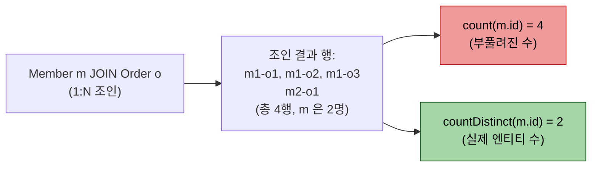
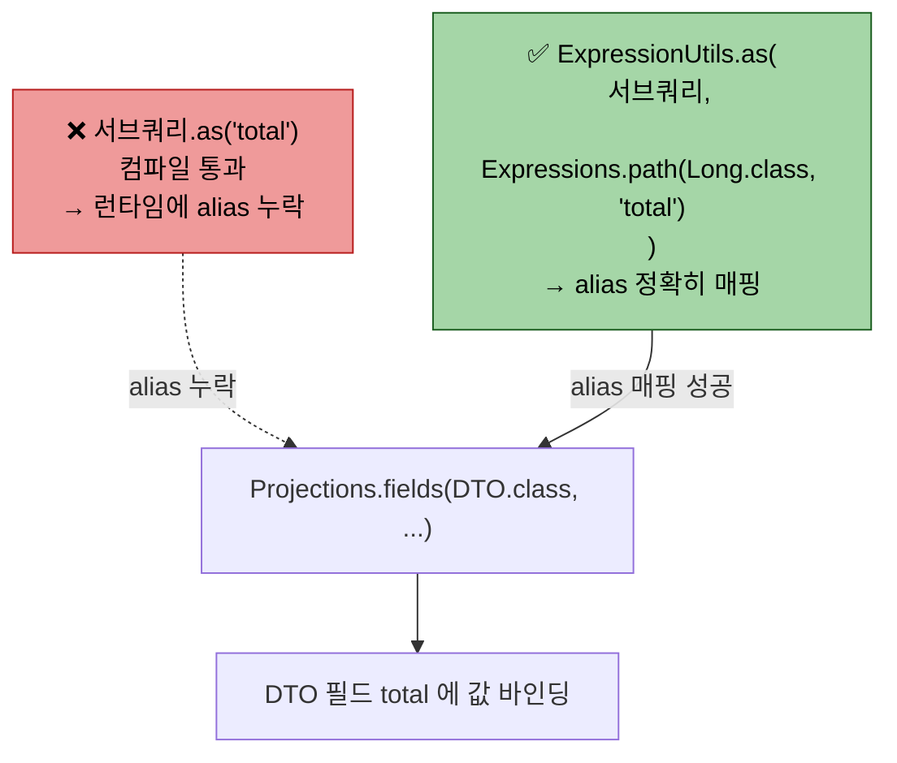

# 정렬·집계·프로젝션 보충 — NULLS LAST / countDistinct / ExpressionUtils.as

---

> **이 문서를 읽고 나면, 동적 정렬에서 NULL 처리를 API(`.nullsLast()`)·CASE 두 형태로 구현하고, dedup 집계를 `countDistinct` 로 표현하며, `Projections.fields` 안에서 서브쿼리에 alias 를 부여하는 `ExpressionUtils.as` 우회를 적용할 수 있다.**

1장에서 동적 정렬·집계·프로젝션의 *기본기* 를 익혔다면, 본 챕터는 운영 코드에서 자주 등장하지만 1장이 짚지 않은 세 보충 — 정렬의 NULL 처리, 집계의 dedup 변형, 서브쿼리에 alias 부여하는 우회 — 를 한 자리에서 본다. 세 주제 모두 1장 챕터의 한 절 분량으로 들어가도 어색하지 않을 *작은* 토픽이라, 본 챕터는 짧고 빠른 참조용으로 설계됐다.

## NULLS LAST — 동적 정렬의 NULL 처리

> 동적 정렬에서 NULL 이 어디로 가는지를 *API 형태(`.nullsLast()`)* 와 *CASE 기반* 두 형태로 통제한다. 둘의 결정적 차이는 *tie-breaker 분리 가능 여부* — 사용자 정렬과 별개의 보조 정렬 키가 필요할 때 CASE 가 답이다.

1장 01-04 § "동적 정렬"(L215~242)이 `OrderSpecifier` 동적 정렬과 sort key 화이트리스트 트레이드오프를 다뤘다. 그러나 *정렬 컬럼에 NULL 이 섞이면 어디로 갈지* 는 짚지 않았다. 표준 SQL 의 `NULLS LAST` / `NULLS FIRST` 가 dialect 별로 동작이 다르고, JPA QueryDSL 도 두 형태로 표현한다.

### 형태 1 — API 형태 (`.nullsLast()` / `.nullsFirst()`)

같은 컬럼의 정렬 방향에 NULL 처리를 부여하는 표준 형태.

```java
queryFactory.selectFrom(member)
    .orderBy(member.joinedAt.desc().nullsLast())
    .fetch();
```

SQL 평탄화는 dialect 가 지원하면 `ORDER BY member.JOINED_AT DESC NULLS LAST`, 미지원 dialect 면 QueryDSL 이 *CASE 평탄화* 로 우회한다.

```java
member.joinedAt.desc()                    // NULL 위치 dialect 기본값
member.joinedAt.desc().nullsLast()        // NULL 을 마지막에
member.joinedAt.asc().nullsFirst()        // NULL 을 처음에
```

이 형태는 *같은 컬럼* 의 정렬 방향에만 NULL 위치를 붙일 수 있다. 사용자 정렬과 *별개로* NULL 처리를 끼우고 싶을 때는 다음 형태를 쓴다.

### 형태 2 — CASE 기반 (별도 정렬 키로 끼움)

별도 표현식을 정렬 키로 만들어 사용자 정렬 *앞이나 뒤* 에 끼우는 형태.

```java
// CUR_ATRZ_SN 이 NULL 이면 후순위로 미루고, 그 뒤에 사용자 정렬 적용
OrderSpecifier<?> nullsLast = new CaseBuilder()
    .when(curAtrzSn.isNull()).then(1)
    .otherwise(0)
    .asc();

queryFactory.selectFrom(approval)
    .orderBy(nullsLast, member.joinedAt.desc())  // ← nullsLast 가 먼저
    .fetch();
```

SQL 평탄화는 `ORDER BY CASE WHEN curAtrzSn IS NULL THEN 1 ELSE 0 END ASC, member.JOINED_AT DESC` 형태가 된다. NULL 인 행은 1, NOT NULL 인 행은 0 — ASC 정렬에서 0 이 먼저 잡혀 *내 차례인 결재가 앞으로* 노출되는 의미.

### 두 형태의 차이

| 비교 축 | API 형태 (`.nullsLast()`) | CASE 기반 (`new CaseBuilder()...`) |
|---------|---------------------------|------------------------------------|
| 적용 대상 | 같은 컬럼의 정렬 방향에 NULL 위치 부여 | 별도 정렬 키 한 자리 추가 |
| 사용자 정렬과 결합 | 단일 컬럼 동작 — 별개 결합 불가 | 정렬 키 배열에 자유롭게 끼움 |
| dialect 호환성 | dialect 미지원 시 QueryDSL 이 우회 | CASE 는 모든 SQL 표준 |
| 사용처 | 단일 컬럼 정렬에서 NULL 위치 보정 | tie-breaker, NULLS LAST, 우선순위 그룹 정렬 |

운영 코드의 `withTieBreaker` 가 형태 2 를 채택한 이유는 "내 차례 결재 먼저" 가 *사용자 정렬과 별개의 우선순위 그룹* 이기 때문이다.

```java
// .../adapter/mytodo/ApprovalToDoTableQueryAdapter.java:272-282
private OrderSpecifier<?>[] withTieBreaker(NumberExpression<Integer> curAtrzSn, OrderSpecifier<?>[] base) {
    OrderSpecifier<?> nullsLast = new CaseBuilder()
        .when(curAtrzSn.isNull()).then(1)
        .otherwise(0)
        .asc();
    OrderSpecifier<?>[] result = new OrderSpecifier<?>[base.length + 1];
    result[0] = nullsLast;                              // ← 사용자 정렬 앞에 끼움
    System.arraycopy(base, 0, result, 1, base.length);
    return result;
}
```

`result[0]` 에 NULLS LAST CASE 를 박고 그 뒤에 사용자 정렬을 이어 붙인다. ORDER BY 의 첫 키가 NULLS LAST → 같은 우선순위 그룹 안에서 사용자 정렬이 적용되는 *2단 정렬* 이 된다.

## countDistinct — 집계의 dedup 변형

> `count()` 가 행 수를 세고 `countDistinct()` 가 *중복 제거 후* 행 수를 센다. M:N 조인이 끼면 같은 엔티티가 여러 번 잡혀 `count()` 가 부풀어 오르므로, *정확한 엔티티 수* 를 원할 때 `countDistinct(엔티티.id)` 를 쓴다.

`count` 와 `countDistinct` 의 차이가 M:N 조인에서 실제로 어떻게 갈리는지 한눈에 보면 다음과 같다.



페이징 쿼리의 *전체 카운트* 가 부풀어 오르는 흔한 함정의 원인이 바로 이 자리다 — 페치 조인이 결과 행을 늘리고 `count()` 가 그 부풀린 수를 셀 때 `countDistinct` 가 정정한다.

1장 01-03 § "집계 — count, sum, avg, max, min"(L203~227)이 다섯 가지 표준 집계를 다뤘다. 운영 코드에서 자주 등장하는 *DISTINCT 변형* — `countDistinct(col)` — 은 거기서 짚지 않았다.

### 의미와 SQL 평탄화

```java
queryFactory.select(approval.atrzId.countDistinct())
    .from(approval)
    .fetchOne();
```

평탄화 결과는 `SELECT COUNT(DISTINCT approval.ATRZ_ID) FROM TB_APPROVAL approval`. `count()` 가 행 수를 세는 반면 `countDistinct()` 는 *unique 값의 수* 를 센다.

### 언제 필요한가

두 가지 운영 패턴에서 쓰인다.

1. **LEFT JOIN 이 한 PK 를 여러 행으로 부풀릴 때** — 결재 한 건이 N 개 페이지에 매핑되어 있으면 LEFT JOIN 결과는 N 행. count 페이지네이션에는 *결재 수* 가 필요하지 *행 수* 가 아니다.
2. **권한 다중 매칭으로 같은 PK 가 여러 EXISTS 가지에 잡힐 때** — 사용자가 직접 결재자이면서 역할로도 결재자라면 같은 결재 실행이 여러 row 에 잡힐 수 있다. dedup 된 결재 실행 수가 필요하다.

### 운영 코드 reference

```java
// .../adapter/management/ApprovalManagementTableQueryAdapter.java:52-63
public int selectAprvMngCount(SelectAprvMngListQuery request) {
    /* ... resolve / context / predicate / orders ... */
    Long count = applyJoins(
        queryFactory.select(ctx.approvalBasicId().getString("atrzId").countDistinct()),  // ← dedup
        ctx
    ).where(predicate).fetchOne();
    return count == null ? 0 : count.intValue();
}
```

이 사례는 *최신 vsrn 필터* 가 이미 한 atrzId 당 한 행만 남기지만, v3 의 `COUNT(DISTINCT ATRZ_ID)` 의미를 보존하기 위해 명시적으로 `countDistinct()` 를 쓴다. 한 건이라도 의미가 흐려지면 안 되는 자리라 *의도를 코드로 드러낸다*.

```java
// .../adapter/mytodo/ApprovalToDoTableQueryAdapter.java:70-88
@Override
public int countMyToList(SelectMyToListQuery request, String userId) {
    bindUserId(userId);
    try {
        /* ... */
        Long count = applyJoins(
            queryFactory.select(ctx.aprvExcn().getString("atrzExcnId").countDistinct())  // ← 권한 다중 매칭 dedup
                .from(ctx.aprvExcn()),
            ctx
        ).where(predicate).fetchOne();
        return Optional.ofNullable(count).map(Long::intValue).orElse(0);
    } finally { clearUserId(); }
}
```

이 사례는 *권한 다중 매칭* 으로 같은 결재 실행이 여러 row 에 잡힐 수 있어 dedup 결과 수가 필요하다. find 쿼리에서는 같은 의미를 `groupBy(atrzExcnId)` 로 풀고, count 쿼리는 `countDistinct(atrzExcnId)` 로 푼다 — 두 표현이 같은 의미의 SQL 변형.

### count() / countDistinct() 결정 가이드

| 상황 | 사용 |
|------|------|
| 단순 행 수 | `count()` |
| LEFT JOIN 이 PK 를 부풀리는 환경에서 PK 수 | `countDistinct(pk)` |
| 권한·매핑 다중성으로 같은 PK 가 여러 row | `countDistinct(pk)` + find 는 `groupBy(pk)` |
| 의미 보존 명시 (v3 의 `COUNT(DISTINCT ...)` 1:1 이식) | `countDistinct(col)` |

## ExpressionUtils.as — 서브쿼리에 alias 부여

> `Projections.fields(...)` 안에서 *서브쿼리 결과* 를 DTO 필드와 매칭하려면 alias 가 필요한데, `JPAExpressions.select(...).as("name")` 은 컴파일은 통과하지만 *동작하지 않는다*. `ExpressionUtils.as(서브쿼리, Expressions.path(...))` 우회가 정답이다 — 이 함정의 정확한 모양을 다음 그림으로 박는다.



1장 01-05 § "방식 2 — Projections.bean / fields"(L66~104) 이 `expression.as("name")` 형태로 alias 를 붙이는 표준 패턴을 다뤘다. 그러나 *서브쿼리에 alias 를 붙여야 할 때* — 예를 들어 스칼라 서브쿼리의 결과를 DTO 의 한 필드에 매핑해야 할 때 — 표준 `.as("name")` 이 통하지 않는다.

### 문제

```java
// 컴파일 에러 — SubQueryExpression 에는 .as(String) 메서드가 없음
Projections.fields(
    DTO.class,
    JPAExpressions.select(...).from(...).limit(1L).as("curAtrzSn")  // ✗
);
```

`SubQueryExpression<T>` 타입은 `Expression<T>` 의 하위지만 `.as(String)` 메서드를 노출하지 않는다. 일반 `StringPath` / `NumberPath` 가 alias 부여를 위해 가지고 있는 메서드가 서브쿼리에는 없는 셈.

### 해법 — ExpressionUtils.as

`com.querydsl.core.types.ExpressionUtils.as(expression, path)` 가 우회 도구다. 임의 `Expression<T>` 와 alias 가 들어 있는 `Path<T>` 를 결합한 새 표현식을 반환한다.

```java
import com.querydsl.core.types.ExpressionUtils;
import com.querydsl.core.types.dsl.Expressions;

Projections.fields(
    DTO.class,
    ExpressionUtils.as(
        JPAExpressions.select(p.atrzSn).from(p).where(...).orderBy(...).limit(1L),
        Expressions.path(Integer.class, "curAtrzSn")
    )
);
```

`Expressions.path(Type.class, "alias")` 가 *alias 만 가진 빈 Path* 다. `ExpressionUtils.as(서브쿼리, 빈 Path)` 가 두 인자를 결합해 *서브쿼리의 결과를 빈 Path 의 alias 로 노출* 한다. 평탄화하면 `(SELECT ... LIMIT 1) AS curAtrzSn` 이 된다.

### 운영 코드 reference

```java
// .../adapter/mytodo/ApprovalToDoTableQueryAdapter.java:117
return applyJoins(
    queryFactory.select(Projections.fields(
        ApprovalMyToDetailDto.class,
        ctx.aprvExcn().getString("atrzExcnId").as("atrzExcnId"),
        /* ... */
        ExpressionUtils.as(
            curAtrzSnSubquery(ctx, userId),
            Expressions.path(Integer.class, "curAtrzSn")
        ),
        /* ... */
    )).from(ctx.aprvExcn()), ctx
).where(predicate).groupBy(...).orderBy(...).fetch();
```

DTO 의 `curAtrzSn` 필드에 *진행 중 단계의 atrzSn 한 건* 을 매핑한다. 서브쿼리 자체가 `Projections.fields` 의 인자로 들어가 alias `"curAtrzSn"` 가 DTO 필드명과 일치하므로 매핑이 성공한다.

### `Expressions.path` 의 자료형 인자

`Expressions.path(Type.class, "alias")` 의 첫 인자는 *서브쿼리의 반환 자료형* 과 정확히 일치해야 한다. `JPAExpressions.select(p.atrzSn)` 의 `p.atrzSn` 이 `NumberPath<Integer>` 면 `Expressions.path(Integer.class, ...)` — 타입이 어긋나면 런타임 매핑 실패.

문자열 서브쿼리는 `Expressions.path(String.class, ...)`, 날짜 서브쿼리는 `Expressions.path(LocalDateTime.class, ...)` 처럼 자료형을 맞춘다.

## 면접에서 받을 만한 질문

> 본 챕터 세 보충(NULLS LAST·countDistinct·ExpressionUtils.as) 가 *그림 없이 말로 설명할 수 있는 수준* 으로 박혔는지 자가 점검. 특히 *왜 `.as()` 가 안 되는지* 가 핵심 함정 질문이다.

1. `.nullsLast()` API 와 CASE 기반 NULLS LAST 의 차이는? 사용자 정렬과 별개의 tie-breaker 가 필요할 때 어느 쪽을 쓰는가?
2. `count()` 와 `countDistinct()` 의 평탄화 SQL 차이는? LEFT JOIN 이 한 PK 를 여러 행으로 부풀리는 환경에서 어느 쪽이 맞는가?
3. count 쿼리의 `countDistinct(pk)` 와 find 쿼리의 `groupBy(pk)` 는 같은 의미를 다른 구문으로 표현한다 — 왜 두 방식이 필요한가?
4. `Projections.fields` 의 인자로 서브쿼리를 넣을 때 alias 를 어떻게 부여하는가? `.as("name")` 이 왜 안 되는가?
5. `Expressions.path(Type.class, "alias")` 의 자료형 인자가 어긋나면 어떤 증상이 나타나는가?

## 관련 문서

> 본 문서의 세 보충 주제가 묶음 내 다른 챕터와 어떻게 연결되는지 4개 링크. 1장 동적 정렬·프로젝션 본편(01-04·01-05)과 02-02 서브쿼리 빌더로 자연스럽게 이어진다.

- [01-03. 기본 문법과 조인](01-03.기본%20문법과%20조인.md) § "집계 — count, sum, avg, max, min" — 표준 집계 다섯 가지
- [01-04. 동적 쿼리](01-04.동적%20쿼리.md) § "동적 정렬" — `OrderSpecifier` 기본 사용
- [01-05. 프로젝션과 DTO 매핑](01-05.프로젝션과%20DTO%20매핑.md) — `Projections.fields/bean/constructor` 와 alias 매핑
- [02-02. JPAExpressions — 서브쿼리 합성](02-02.JPAExpressions%20%E2%80%94%20%EC%84%9C%EB%B8%8C%EC%BF%BC%EB%A6%AC%20%ED%95%A9%EC%84%B1.md) — `ExpressionUtils.as` 가 감싸는 서브쿼리 빌더
- [03-06. window 함수 없는 JPA QueryDSL의 ROW_NUMBER 대체](03-06.window%20함수%20없는%20JPA%20QueryDSL의%20ROW_NUMBER%20대체.md) — 본 챕터의 세 보충이 한 SQL 패턴에 결합되는 사례
