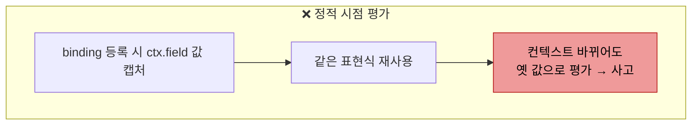
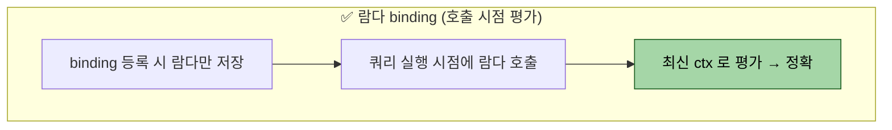

# 표현식 합성 — Functional Predicate Supplier 와 transform groupBy

---

> **이 문서를 읽고 나면, querydsl 표현식을 *람다로 바인딩해 지연 평가하는 함정* 을 피할 수 있고, `transform(groupBy)` 와 SQL `GROUP BY` 의 차이를 적용 시점에 맞게 선택할 수 있다.**

1장에서 `BooleanBuilder` 와 `BooleanExpression` 메서드 분해 두 가지 동적 쿼리 패턴을 익혔다면, 본 챕터는 그 패턴을 *운영 코드 규모로 키운* 두 가지 합성 기법을 본다.

- **Functional Predicate Supplier** (Context → Expression 람다로 binding 등록)
- **`fetch()` / `transform()` 의 group by 결합 패턴** (1:N 결과를 애플리케이션 메모리에서 재조립)

1장 분해 패턴이 *하나의 쿼리* 안에서 풀려고 한다면, 본 챕터의 두 기법은 *여러 쿼리가 공유하는 표현식 인프라* 를 만드는 데 쓴다.

> 본 챕터의 초판은 위 두 기법에 더해 **Hooks 4분할 · ThreadLocal userId 캡처 · BooleanBuilder.or() 가상값 누적** 세 절을 같이 묶었다. 세 절은 TPS 결재 도메인의 *운영 코드 변형* 성격이 강해 [03-03. 실무 변형 모음](03-03.실무%20변형%20모음.md) 의 §Hooks 4 분할 · §ThreadLocal userId 캡처 · §BooleanBuilder.or() 누적 으로 이동했다. 일반 합성 패턴은 본 챕터, TPS 운영 코드 변형은 03-03 으로 분리.


## 왜 이 두 기법이 함께 가는가

> 운영 코드의 검색·정렬·상세조건은 *재사용 · 동적 합성 · 1:N 재조립* 압력을 동시에 받으며, 두 기법이 각각 한 자리씩 답을 준다. 1장의 분해 패턴은 *한 쿼리 내부* 가 단위였다면, 본 챕터의 단위는 *여러 쿼리가 공유하는 표현식 인프라* 다.

운영 코드의 표현식이 받는 두 가지 압력에 본 챕터가 답한다.

1. **재사용 + 지연 평가** — 같은 표현식이 projection / where / order by 세 자리에 박힌다 (예: `submitReceiveCdExpr` 가 SELECT alias / WHERE 검색 / ORDER BY 세 곳에서). 정적 시점에 평가하면 컨텍스트가 바뀐 뒤 같은 표현식이 재사용돼 사고가 난다 — **Functional Predicate Supplier** 의 람다 binding 이 이를 *호출 시점 평가* 로 미룬다.
2. **1:N 결과 재조립** — fetch join 의 N+1 / 카티시안 곱 함정 없이 1:N 을 풀려면 *애플리케이션 메모리에서* 그룹을 묶는 길이 깔끔하다. **`transform(groupBy)`** 가 그 자리를 채운다.

두 기법은 **PathBuilder 컨텍스트** ([02-01](02-01.PathBuilder%20%E2%80%94%20%EB%8F%99%EC%A0%81%20path%20%EB%B9%8C%EB%8D%94%20%EA%B9%8A%EC%9D%B4.md)) 와 **JPAExpressions 서브쿼리** ([02-02](02-02.JPAExpressions%20%E2%80%94%20%EC%84%9C%EB%B8%8C%EC%BF%BC%EB%A6%AC%20%ED%95%A9%EC%84%B1.md)) 가 만든 *재료* 위에서 *조립* 단계를 담당한다.


## Functional Predicate Supplier — `ctx -> ctx.field` 람다 binding

> binding 등록 시점에 *값을 평가하지 말고 람다를 등록* 한다. 정적 시점에 표현식을 평가하면 컨텍스트가 바뀐 뒤 같은 표현식이 재사용돼 사고가 난다 — 람다 binding 이 이를 *호출 시점 평가* 로 미룬다.

Functional Predicate Supplier 의 정적 평가 함정과 람다 평가의 차이가 다음 그림으로 잡힌다.





운영 코드의 registry 가 컬럼별 표현식을 어떻게 등록하는지부터.

```java
// .../query/management/ApprovalManagementListQuerySupport.java
bindings.put(ApprovalManagementListColumn.ATRZ_ID,
    QueryColumnBindingBuilder.<ApprovalManagementListQueryContext>builder()
        .detailTextRegexp(ctx -> ctx.approvalBasicId().getString("atrzId"))  // 상세검색 정규식
        .orderByComparable(ctx -> ctx.approvalBasicId().getString("atrzId")) // 정렬 조건
        .build());
```

- `.detailTextRegexp(ctx -> ...)` 의 인자가 *람다* — `Function<Context, Expression<?>>`. 
- 컬럼 enum 마다 *어떤 PathBuilder 의 어떤 필드* 를 매핑할지를 람다 한 줄로 등록한다.

### 왜 람다인가 — *지연 평가* 의 필요성

#### 용어부터 — Predicate / Supplier / Functional

이 패턴 이름에 익숙해지자.

- **Predicate** — WHERE 절에 들어가는 *조건 표현식*. `member.username.eq("kim")` 같은 것. QueryDSL 의 `Predicate` 인터페이스가 정확한 타입.
- **Supplier** — "달라고 하면 주는 사람". Java 표준 `Supplier<T>` 는 인자 없이 T 를 돌려주는 함수다. 본 패턴은 정확히는 `Function<Context, Expression>` (Context 를 받아 표현식을 돌려줌) 이지만, 의미상 *필요할 때 표현식을 공급* 하는 역할이라 Supplier 로 부른다.
- **Functional** — 위 두 가지를 *함수(람다)* 로 표현했다는 뜻. 람다 자체를 등록해 둔다.

세 단어를 합치면 **"조건 표현식을 람다로 등록해두고, 필요할 때 호출해서 받아오는 패턴"**.

#### 무엇을 해결하나

운영 코드에는 컬럼이 수십 개고, 각 컬럼마다 *어디서 어떻게 검색·정렬할지* 가 정해져 있다. 

- 예: `ATRZ_ID` 컬럼은 `approvalBasic` 테이블의 `atrzId` 필드로 LIKE 검색, 
- `MDFR_LABEL` 컬럼은 `modifierUser` 테이블의 `userName` 필드로 정렬. 이 *컬럼 → 표현식 매핑* 을 어딘가에 저장해 둬야 한다.

가장 단순한 방법은 *표현식 자체* 를 Map 에 박는 것이다.

```java
// ✗ 잘못된 패턴 — 정적 시점에 표현식 평가
bindings.put(ATRZ_ID,
    QueryColumnBindingBuilder.<Context>builder()
        .detailTextRegexp(defaultContext().approvalBasicId().getString("atrzId"))  // 정적 시점
        .build());
```

- *Map 을 만드는 그 순간* `defaultContext()` 가 한 번 실행되고, 그때 만들어진 PathBuilder 인스턴스가 Map 에 박힌다. 
- 이후 **모든 쿼리가 같은 PathBuilder 인스턴스를 공유** 한다.

#### 왜 공유가 위험한가

PathBuilder 는 그냥 "SQL 별칭 + 컬럼 경로" 를 들고 있는 객체로 보이지만, 내부에 *메타정보 캐시* (자료형 정보, 캐스팅 path 등) 를 가진다.

- 동시 요청 두 개가 같은 PathBuilder 에 동시에 캐스팅을 부르면 캐시가 섞일 수 있다.
- 같은 쿼리 안에서 *self-join 이나 sub-query* 가 필요할 때 (02-01 참고), 별칭이 다른 두 번째 PathBuilder 가 필요하다. 그런데 Map 에 박힌 PathBuilder 는 *별칭 X* 하나뿐 — 같은 쿼리에서 *별칭 Y* 가 필요한 sub-query 를 만들 수 없다.

#### 람다가 해결하는 방식

람다는 *표현식이 아니라 "표현식을 만드는 레시피"* 를 저장한다.

```java
// ✓ 람다 패턴 — 표현식이 아닌 람다(레시피) 저장
bindings.put(ATRZ_ID,
    QueryColumnBindingBuilder.<Context>builder()
        .detailTextRegexp(ctx -> ctx.approvalBasicId().getString("atrzId"))  // 호출 시점 평가
        .build());
```

쿼리 실행 시점에 다음 흐름이 돈다.

```
매 쿼리:
  ① Context ctx = defaultContext()  ← 이번 쿼리 전용 새 PathBuilder
  ② Expression<?> expr = bindings.get(ATRZ_ID).apply(ctx)  ← 람다에 ctx 주입
  ③ 쿼리 빌더에 expr 끼움
```

- 매 쿼리마다 새 PathBuilder 인스턴스가 생기고, 람다는 *그 인스턴스를 받아서* 표현식을 만든다.
- 충돌 위험이 사라지고 별칭 일관성도 자동. 한 쿼리 안에서는 모든 람다가 같은 Context 를 받으니 같은 별칭으로 묶이고, sub-query 가 필요하면 그 sub-query 전용 Context 를 별도로 만들어 다른 람다에 주입하면 된다.

### Registry 빌더의 구조

`QueryColumnBindingBuilder` 는 컬럼당 여러 *용도* 의 람다를 받는다.

```java
QueryColumnBinding<Context> binding =
    QueryColumnBindingBuilder.<Context>builder()
        .detailTextRegexp(ctx -> ctx.field.getString("col"))     // 상세 검색 T 타입
        .detailSelection(ctx -> ctx.field.getString("col"), Function.identity())  // S/R 타입
        .detailDateTimeRange(ctx -> ctx.field.getDateTime("col", LocalDateTime.class))  // D 타입
        .orderByComparable(ctx -> ctx.field.getString("col"))     // 정렬용
        .build();
```

각 람다는 *그 용도가 실제로 호출될 때* 평가된다. 사용자가 "T 타입 상세검색" 만 요청하면 `detailSelection` / `detailDateTimeRange` 람다는 호출되지 않는다. 등록 비용은 람다 하나 만큼.

### Method reference 형태

람다가 *static 헬퍼 메서드* 를 그대로 호출만 하면 method reference 로 더 간결하게.

```java
// 가상 컬럼 — Support 의 static 헬퍼를 method reference 로
bindings.put(ATRZ_SE_NM_LABEL,
    QueryColumnBindingBuilder.<Context>builder()
        .orderByComparable(ApprovalManagementListQuerySupport::atrzSeNmExpr)
        .build());
```

`ApprovalManagementListQuerySupport::atrzSeNmExpr` 가 `Function<Context, StringExpression>` 으로 자동 변환된다. 람다 `ctx -> atrzSeNmExpr(ctx)` 와 같은 의미지만 훨씬 간결.

### 운영 코드 reference

운영 코드의 `createRegistry()` 가 어떻게 15 개 binding 을 등록하는지 풀로 본다. 길지만, 같은 패턴이 반복돼서 한 binding 의 구조만 익히면 나머지 14 개는 *읽는* 데만 도움이 된다.

본 코드에서 봐야 할 *세 가지 축* 부터.

| 축 | 무엇을 보는가 | 코드의 어느 자리 |
|----|--------------|------------------|
| **컬럼 종류** | 일반 컬럼(DB 에 직접 있음) vs 가상 컬럼(SQL 로 합성) | 주석 `// 일반` / `// 가상` |
| **용도 등록** | detailTextRegexp(검색T) / detailSelection(검색S) / detailDateTimeRange(검색D) / orderByComparable(정렬) — 한 컬럼에 여러 용도 등록 가능 | 각 binding 의 `.xxxx(...)` 메서드 |
| **람다 vs method reference** | `context -> ...` (인라인 람다) vs `Class::method` (헬퍼 호출만 하면 단축) | binding 인자 |

```java
// .../query/management/ApprovalManagementListQuerySupport.java
// createRegistry (line 184~288) — 15 개 binding 전체.
//
// 메서드 1 회 호출로 'Column → 컬럼별 람다 묶음' 의 immutable Map 을 만들어
// 이를 'Map::get' 으로 SAM 인터페이스 (QueryColumnBindingRegistry) 에 매핑한다.
// 결과적으로 Registry 가 곧 함수 한 자리 (Column → Binding) 가 된다.
private static QueryColumnBindingRegistry<ApprovalManagementListColumn, ApprovalManagementListQueryContext> createRegistry() {
    // EnumMap 사용 이유: Column 이 enum 이라 HashMap 보다 빠르고, 누락 컬럼이 명시적이라 디버깅 쉬움.
    Map<ApprovalManagementListColumn, QueryColumnBinding<ApprovalManagementListQueryContext>> bindings =
        new EnumMap<>(ApprovalManagementListColumn.class);

    // --- 일반 컬럼 (DB 컬럼 직접 매핑) — 람다(context -> ...) 로 등록 ---

    // ATRZ_ID: 결재 ID. EmbeddedId(approvalBasicId) 안의 atrzId 필드.
    // 상세검색(REGEXP)·정렬 두 용도 모두 등록 → 사용자가 어느 용도를 호출하든 평가됨.
    bindings.put(
        ApprovalManagementListColumn.ATRZ_ID,
        QueryColumnBindingBuilder.<ApprovalManagementListQueryContext>builder()
            .detailTextRegexp(context -> context.approvalBasicId().getString("atrzId"))    // 검색 T 타입
            .orderByComparable(context -> context.approvalBasicId().getString("atrzId"))   // 정렬
            .build()
    );

    // VSRN: 결재 버전(숫자). 정렬만 등록 — 상세검색은 정책에서 막혀 있음.
    bindings.put(
        ApprovalManagementListColumn.VSRN,
        QueryColumnBindingBuilder.<ApprovalManagementListQueryContext>builder()
            .orderByComparable(context -> context.approvalBasicId().getNumber("vsrn", Integer.class))
            .build()
    );

    // ATRZ_NM: 결재명(텍스트). 검색·정렬 둘 다.
    bindings.put(
        ApprovalManagementListColumn.ATRZ_NM,
        QueryColumnBindingBuilder.<ApprovalManagementListQueryContext>builder()
            .detailTextRegexp(context -> context.approvalBasic().getString("atrzNm"))
            .orderByComparable(context -> context.approvalBasic().getString("atrzNm"))
            .build()
    );

    // ATRZ_EXPLN: 결재 설명. 텍스트라 검색만 (긴 텍스트는 정렬 의미 약함).
    bindings.put(
        ApprovalManagementListColumn.ATRZ_EXPLN,
        QueryColumnBindingBuilder.<ApprovalManagementListQueryContext>builder()
            .detailTextRegexp(context -> context.approvalBasic().getString("atrzExpln"))
            .build()
    );

    // ATRZ_SE_CD: 결재 구분 코드값. 코드값 매칭이라 selection(S 타입) — Function.identity() 는 입력을 그대로 비교.
    bindings.put(
        ApprovalManagementListColumn.ATRZ_SE_CD,
        QueryColumnBindingBuilder.<ApprovalManagementListQueryContext>builder()
            .detailSelection(context -> context.approvalBasic().getString("atrzSeCd"), Function.identity())  // 검색 S 타입
            .orderByComparable(context -> context.approvalBasic().getString("atrzSeCd"))
            .build()
    );

    // --- 가상 컬럼 (DB 에 직접 컬럼이 없고 SQL 로 합성) — method reference 로 헬퍼 호출 ---

    // ATRZ_SE_NM_LABEL: 결재구분명(공통 코드 lookup). atrzSeNmExpr 헬퍼가 sub-query 로 코드명 가져옴.
    // 'context -> atrzSeNmExpr(context)' 와 동일, method reference 가 더 간결.
    bindings.put(
        ApprovalManagementListColumn.ATRZ_SE_NM_LABEL,              // ← 가상 컬럼 (method reference)
        QueryColumnBindingBuilder.<ApprovalManagementListQueryContext>builder()
            .orderByComparable(ApprovalManagementListQuerySupport::atrzSeNmExpr)
            .build()
    );

    // ATRZ_GDNC_TYPE_CD: 안내유형 코드값. 위 ATRZ_SE_CD 와 같은 패턴.
    bindings.put(
        ApprovalManagementListColumn.ATRZ_GDNC_TYPE_CD,
        QueryColumnBindingBuilder.<ApprovalManagementListQueryContext>builder()
            .detailSelection(context -> context.approvalBasic().getString("atrzGdncTypeCd"), Function.identity())
            .orderByComparable(context -> context.approvalBasic().getString("atrzGdncTypeCd"))
            .build()
    );

    // ATRZ_GDNC_TYPE_NM_LABEL: 안내유형명(공통 코드 lookup) — 가상 컬럼.
    bindings.put(
        ApprovalManagementListColumn.ATRZ_GDNC_TYPE_NM_LABEL,                       // ← 가상 컬럼
        QueryColumnBindingBuilder.<ApprovalManagementListQueryContext>builder()
            .orderByComparable(ApprovalManagementListQuerySupport::atrzGdncTypeNmExpr)
            .build()
    );

    // ATRZ_GDNC_WORDS: 안내 문구(텍스트). 검색만.
    bindings.put(
        ApprovalManagementListColumn.ATRZ_GDNC_WORDS,
        QueryColumnBindingBuilder.<ApprovalManagementListQueryContext>builder()
            .detailTextRegexp(context -> context.approvalBasic().getString("atrzGdncWords"))
            .build()
    );

    // USE_YN: 사용 여부(Y/N). embedded UseFlag 안의 useYn 필드.
    bindings.put(
        ApprovalManagementListColumn.USE_YN,
        QueryColumnBindingBuilder.<ApprovalManagementListQueryContext>builder()
            .detailSelection(context -> context.useFlag().getString("useYn"), Function.identity())
            .orderByComparable(context -> context.useFlag().getString("useYn"))
            .build()
    );

    // USE_YN_LABEL: '사용' / '사용안함' CASE 라벨 — useYnLabel 헬퍼가 CaseBuilder 로 생성.
    bindings.put(
        ApprovalManagementListColumn.USE_YN_LABEL,                                  // ← 가상 컬럼
        QueryColumnBindingBuilder.<ApprovalManagementListQueryContext>builder()
            .orderByComparable(ApprovalManagementListQuerySupport::useYnLabel)
            .build()
    );

    // MDFCN_DT: 수정일시(datetime). detailDateTimeRange 는 시작/끝 범위 검색용 (D 타입).
    bindings.put(
        ApprovalManagementListColumn.MDFCN_DT,
        QueryColumnBindingBuilder.<ApprovalManagementListQueryContext>builder()
            .detailDateTimeRange(context -> context.approvalBasic().getDateTime("mdfcnDt", LocalDateTime.class))  // 검색 D 타입
            .orderByComparable(context -> context.approvalBasic().getDateTime("mdfcnDt", LocalDateTime.class))
            .build()
    );

    // MDFR_ID: 수정자 ID(원본). 검색·정렬.
    bindings.put(
        ApprovalManagementListColumn.MDFR_ID,
        QueryColumnBindingBuilder.<ApprovalManagementListQueryContext>builder()
            .detailTextRegexp(context -> context.approvalBasic().getString("mdfrId"))
            .orderByComparable(context -> context.approvalBasic().getString("mdfrId"))
            .build()
    );

    // MDFR_LABEL: '이름(ID)' 형태 라벨 — modifierUserLabelExpr 가 CONCAT 으로 합성.
    bindings.put(
        ApprovalManagementListColumn.MDFR_LABEL,                                    // ← 가상 컬럼
        QueryColumnBindingBuilder.<ApprovalManagementListQueryContext>builder()
            .orderByComparable(ApprovalManagementListQuerySupport::modifierUserLabelExpr)
            .build()
    );

    // APRV_TRGT_PAGE_COMP_TXT: 결재대상 페이지·컴포넌트 텍스트 — GROUP_CONCAT 상관 서브쿼리.
    bindings.put(
        ApprovalManagementListColumn.APRV_TRGT_PAGE_COMP_TXT,                       // ← 가상 컬럼
        QueryColumnBindingBuilder.<ApprovalManagementListQueryContext>builder()
            .orderByComparable(ApprovalManagementListQuerySupport::aprvTrgtPageCompTxtExpr)
            .build()
    );

    // 등록 끝났으니 immutable 화 — 이후 누구도 변경 못 함 (싱글톤 등록 후 read-only).
    Map<ApprovalManagementListColumn, QueryColumnBinding<ApprovalManagementListQueryContext>> immutable = Map.copyOf(bindings);
    // 'Map::get' 가 그대로 Registry SAM 인터페이스 시그니처 (Column → Binding) 와 일치 → 별도 구현 클래스 없이 함수 한 줄로 매핑.
    return immutable::get;
}
```

#### 위 코드를 보고 읽어야 할 것

이 긴 코드에서 핵심은 *한 binding 의 구조* 뿐이다. 나머지는 같은 패턴 반복.

**(1) 한 binding 의 모양** — `bindings.put(컬럼, 빌더로 람다 묶음 만들기)` 의 3 단 구조.
```java
bindings.put(
    ApprovalManagementListColumn.ATRZ_ID,                              // ① 어느 컬럼?
    QueryColumnBindingBuilder.<...>builder()                            // ② 빌더 시작
        .detailTextRegexp(context -> context.field.getString("col"))   // ③ 용도별 람다
        .orderByComparable(context -> context.field.getString("col"))
        .build()                                                        // ④ 묶음 완성
);
```

**(2) 한 컬럼이 여러 용도를 가질 수 있다** — `ATRZ_ID` 는 *상세검색(detailTextRegexp)* 과 *정렬(orderByComparable)* 양쪽에 같은 표현식을 등록한다. 사용자가 검색만 하면 정렬 람다는 호출되지 않는다. *호출되지 않은 람다는 평가 비용 0* — 등록만 가벼움.

**(3) 일반 컬럼 10 개 vs 가상 컬럼 5 개의 차이**.

| 종류 | 등록 방식 | 표현식 형태 | 예시 |
|------|----------|-------------|------|
| **일반 컬럼** | 인라인 람다 `context -> context.X.getY("col")` | PathBuilder 의 컬럼 경로 한 줄 | `ATRZ_ID`, `VSRN`, `ATRZ_NM` 등 10 개 |
| **가상 컬럼** | method reference `Support::헬퍼` | static 헬퍼가 sub-query / CASE / CONCAT 으로 합성 | `*_LABEL` 4 개 + `APRV_TRGT_PAGE_COMP_TXT` |

- 가상 컬럼은 DB 에 컬럼이 없으니 헬퍼가 *SQL 표현식* 을 만들어 돌려준다.
- atrzSeNmExpr` 는 공통 코드 sub-query, `useYnLabel` 은 CASE 라벨, `modifierUserLabelExpr` 는 `CONCAT(이름, '(', ID, ')')`. 람다 시그니처가 `Function<Context, StringExpression>` 으로 똑같으니 일반 컬럼과 가상 컬럼이 *registry 입장에선 구분되지 않는다*.
- 외부 호출자는 컬럼만 알면 됨.

**(4) 마지막 두 줄 — Map 이 곧 Registry 가 되는 트릭**.

```java
Map<...> immutable = Map.copyOf(bindings);   // ① immutable 화
return immutable::get;                         // ② Map::get 을 Registry 로 반환
```

- `QueryColumnBindingRegistry` 가 *메서드 하나뿐인 인터페이스* (SAM = Single Abstract Method) 이고, 그 메서드 시그니처가 `Column → Binding` 
- 이다. `Map<Column, Binding>::get` 도 같은 시그니처라 *그대로 끼울 수 있다*. 별도 구현 클래스 (`class MyRegistry implements Registry { Binding find(Column c) { return map.get(c); } }`) 가 필요 없다 — 한 줄로 끝.

> 정리: createRegistry 는 *컬럼별 람다 묶음을 EnumMap 에 모은 뒤, Map::get 을 그대로 Registry 인터페이스로 반환* 한다. 
>
> - 호출자가 `registry.find(ATRZ_ID)` 를 부르면 내부적으론 `map.get(ATRZ_ID)` 가 실행돼 Binding 묶음이 나오고, 거기서 원하는 용도 (`detailTextRegexp` / `orderByComparable`) 의 람다를 꺼내 *그 시점의 ctx 로 평가* 한다.


> 본 챕터 초판은 §Functional Predicate Supplier 뒤에 §Hooks 4 분할 · §ThreadLocal userId 캡처 · §BooleanBuilder.or() 누적 세 절이 이어졌습니다. 세 절 모두 TPS 결재 도메인의 *운영 코드 변형* 성격이라 [03-03. 실무 변형 모음](03-03.실무%20변형%20모음.md) 으로 옮겼고, 본 챕터는 다음 §`fetch()` / `transform()` 으로 바로 이어집니다.


## `fetch()` / `transform()` 의 group by 결합 패턴

> 일반 `fetch()` 는 행 리스트를 반환하지만, `transform(groupBy(...))` 는 *그룹 키로 묶어 Map 또는 컬렉션 트리* 를 반환한다. 1:N 결과를 *애플리케이션 메모리에서 재조립* 할 때 fetch join 의 대안이 된다.

1장 01-03 § "fetch 메서드 다섯 가지" 가 `fetch()` / `fetchOne()` / `fetchFirst()` / `fetchCount()` (deprecated) / `fetchResults()` (deprecated) 를 다뤘다. 운영 코드에서 빠진 한 가지가 `transform()` — *결과 집계를 코드에서 푸는* 도구.

```java
// 결재 ID 별로 페이지 목록을 묶기
import com.querydsl.core.group.GroupBy;
import static com.querydsl.core.group.GroupBy.*;

Map<String, List<String>> approvalPages = queryFactory
    .from(approval)
    .leftJoin(page).on(page.approvalId.eq(approval.id))
    .transform(
        groupBy(approval.id).as(GroupBy.list(page.name))
    );
```

- `transform(groupBy(...).as(...))` 가 *결과 행을 메모리에서 집계* 해 `Map` 으로 돌려준다. 
- 한 결재가 N 개 페이지를 가지면 SQL 결과는 N 행이지만, transform 이 같은 결재 ID 끼리 묶어 `Map<approvalId, List<pageName>>` 으로 만들어 준다.

### SQL `GROUP BY` 와의 차이

- **SQL `.groupBy()`** — DB 에서 그룹화. 한 그룹당 하나의 행이 결과로. 집계 함수 (count/sum/group_concat) 가 필요.
- **`transform(groupBy(...))`** — DB 는 raw 행을 모두 반환하고 *Java 가 메모리에서 묶음*. 집계 함수 없이도 묶음 가능.

운영 코드는 거의 *SQL `.groupBy()`* 를 쓴다 — `findMyToList` 의 `groupBy(atrzExcnId)` 는 권한 다중 매칭으로 부풀려진 행을 *DB 에서 dedup*. `transform()` 은 페이지·컴포넌트 같은 *N+1 의존 데이터* 를 한 번에 가져올 때 유용하지만 *결과 크기가 큰* 경우 메모리 부담이 있다.

### 결정 가이드

| 상황 | 사용 |
|------|------|
| dedup 만 필요 (한 PK 가 여러 행으로 부풀려짐) | SQL `.groupBy(pk)` |
| 같은 PK 의 자식 컬렉션 같이 가져오기 | `transform(groupBy(pk).as(GroupBy.list(child)))` |
| 자식 컬렉션이 큼 (N x M 행 가능) | SQL `.groupBy()` + 자식 별도 쿼리 (2 단계 fetch) |
| 통계 / 합계 | SQL `.groupBy()` + 집계 함수 |

운영 코드의 `findMyToList` 는 첫 번째 — dedup 만 필요해서 SQL `.groupBy(atrzExcnId)` 로 충분.


## 면접에서 받을 만한 질문

> 두 기법(Functional Predicate Supplier · transform groupBy) 과 *왜 람다인가 · 왜 transform 인가* 의 동기를 *그림 없이* 설명할 수 있는지 자가 점검. Hooks 4 분할 · ThreadLocal · BooleanBuilder.or() 관련 면접 질문은 03-03 §면접 질문 6~8 에 있습니다.

1. Registry binding 에 람다를 쓰는 이유는? 직접 `Expression<?>` 을 넘기면 어떤 문제가 생기는가?
2. SQL `.groupBy()` 와 `transform(groupBy(...))` 의 차이는? 권한 다중 매칭 dedup 에는 어느 쪽이 맞는가?


## 관련 문서

> 본 문서의 두 합성 기법이 묶음 내 다른 챕터와 어떻게 연결되는지 링크. 01-04 동적 쿼리 본편(BooleanBuilder/BooleanExpression 분해) 과 02-01 PathBuilder 컨텍스트 record 가 본 챕터의 *전제 인프라* 이고, TPS 운영 코드 변형 세 가지(Hooks 4 분할 · ThreadLocal · BooleanBuilder.or() 누적) 는 03-03 으로 분리됐다.

- [01-04. 동적 쿼리](01-04.동적%20쿼리.md) — `BooleanBuilder` / `BooleanExpression` 기본 사용 (03-03 §BooleanBuilder.or() 누적이 이 토대를 OR 방향으로 확장한다)
- [02-01. PathBuilder — 동적 path 빌더 깊이](02-01.PathBuilder%20%E2%80%94%20%EB%8F%99%EC%A0%81%20path%20%EB%B9%8C%EB%8D%94%20%EA%B9%8A%EC%9D%B4.md) — Functional Predicate Supplier 의 인자가 되는 컨텍스트
- [02-02. JPAExpressions — 서브쿼리 합성](02-02.JPAExpressions%20%E2%80%94%20%EC%84%9C%EB%B8%8C%EC%BF%BC%EB%A6%AC%20%ED%95%A9%EC%84%B1.md) — Registry binding 안에서 호출되는 EXISTS / scalar
- [02-03. 정렬·집계·프로젝션 보충](02-03.%EC%A0%95%EB%A0%AC%C2%B7%EC%A7%91%EA%B3%84%C2%B7%ED%94%84%EB%A1%9C%EC%A0%9D%EC%85%98%20%EB%B3%B4%EC%B6%A9.md) — orderByComparable 가 만드는 ORDER BY 의 NULLS LAST / countDistinct
- [03-03. 실무 변형 모음](03-03.실무%20변형%20모음.md) §Hooks 4 분할 · §ThreadLocal userId 캡처 · §BooleanBuilder.or() 누적 — 본 챕터에서 이동한 TPS 운영 코드 변형 세 절, 그리고 §"동적 검색 추상 베이스" — Functional Predicate Supplier 의 운영 응용
