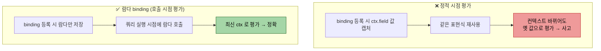
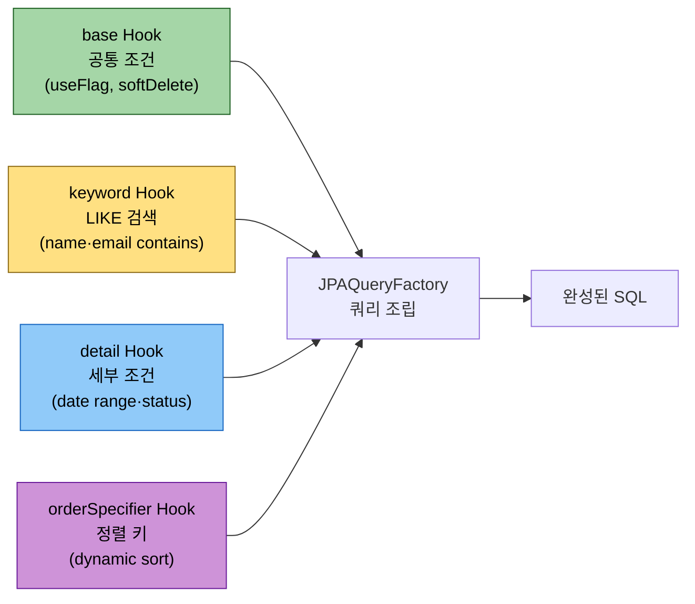

# Hooks·ThreadLocal·BooleanBuilder 누적 — 표현식 합성 패턴

---

> **이 문서를 읽고 나면, 운영 규모 표현식 인프라의 네 기법(Functional Predicate Supplier·Hooks 4분할·ThreadLocal userId 캡처·BooleanBuilder.or() 누적) 을 설명할 수 있고, 람다 binding 으로 정적 시점 평가 함정을 피할 수 있으며, ThreadLocal 의 미정리 사고를 어떻게 방지하는지 코드로 적용할 수 있다.**

1장에서 `BooleanBuilder` 와 `BooleanExpression` 메서드 분해 두 가지 동적 쿼리 패턴을 익혔다면, 본 챕터는 그 패턴을 *운영 코드 규모로 키운* 네 가지 합성 기법을 본다. **Functional Predicate Supplier** (Context → Expression 람다로 binding 등록), **Hooks 추상화** (base / keyword / detail / orderSpecifier 4 분할), **ThreadLocal 로 userId 캡처** (싱글톤 빈에서 요청별 컨텍스트 주입), **BooleanBuilder.or() 누적** (가상값 분기 합산). 1장 분해 패턴이 *하나의 쿼리* 안에서 풀려고 한다면, 본 챕터의 네 기법은 *여러 쿼리가 공유하는 표현식 인프라* 를 만드는 데 쓴다.

## 왜 이 네 기법이 함께 가는가

> 운영 코드의 검색·정렬·상세조건은 *재사용·요청별 컨텍스트·OR 분기 합산* 세 압력을 동시에 받으며, 네 기법이 각각 한 압력씩 받는 구조다. 1장의 분해 패턴은 *한 쿼리 내부* 가 단위였다면, 본 챕터의 단위는 *여러 쿼리가 공유하는 표현식 인프라* 다.

운영 코드의 검색·정렬·상세조건 표현식은 다음 세 가지 압력을 동시에 받는다.

1. **재사용** — 같은 표현식이 projection / where / order by 세 자리에 박힌다 (예: `submitReceiveCdExpr` 가 SELECT alias / WHERE 검색 / ORDER BY 세 곳에서)
2. **요청별 컨텍스트** — `userId` 같은 요청 의존 값이 표현식 빌드 시점에 필요한데, 빈은 싱글톤
3. **동적 합성** — 사용자 검색·상세조건이 *허용된 조합* 안에서 가변적이라 정적 if/else 로 풀 수 없음

세 압력에 대응하는 네 기법이 하나의 인프라로 묶인다. **PathBuilder 컨텍스트** ([02-01](02-01.PathBuilder%20%E2%80%94%20%EB%8F%99%EC%A0%81%20path%20%EB%B9%8C%EB%8D%94%20%EA%B9%8A%EC%9D%B4.md)) 와 **JPAExpressions 서브쿼리** ([02-02](02-02.JPAExpressions%20%E2%80%94%20%EC%84%9C%EB%B8%8C%EC%BF%BC%EB%A6%AC%20%ED%95%A9%EC%84%B1.md)) 가 *재료* 였다면, 본 챕터는 그 재료들을 *조립* 하는 패턴이다.

## Functional Predicate Supplier — `ctx -> ctx.field` 람다 binding

> binding 등록 시점에 *값을 평가하지 말고 람다를 등록* 한다. 정적 시점에 표현식을 평가하면 컨텍스트가 바뀐 뒤 같은 표현식이 재사용돼 사고가 난다 — 람다 binding 이 이를 *호출 시점 평가* 로 미룬다.

Functional Predicate Supplier 의 정적 평가 함정과 람다 평가의 차이가 다음 그림으로 잡힌다.



운영 코드의 registry 가 컬럼별 표현식을 어떻게 등록하는지부터.

```java
// .../query/management/ApprovalManagementListQuerySupport.java
bindings.put(ApprovalManagementListColumn.ATRZ_ID,
    QueryColumnBindingBuilder.<ApprovalManagementListQueryContext>builder()
        .detailTextRegexp(ctx -> ctx.approvalBasicId().getString("atrzId"))
        .orderByComparable(ctx -> ctx.approvalBasicId().getString("atrzId"))
        .build());
```

`.detailTextRegexp(ctx -> ...)` 의 인자가 *람다* — `Function<Context, Expression<?>>`. 컬럼 enum 마다 *어떤 PathBuilder 의 어떤 필드* 를 매핑할지를 람다 한 줄로 등록한다.

### 왜 람다인가 — *지연 평가* 의 필요성

람다 대신 직접 `Expression<?>` 을 넘기면 다음 문제가 생긴다.

```java
// ✗ 잘못된 패턴 — 정적 시점에 표현식 평가
bindings.put(ATRZ_ID,
    QueryColumnBindingBuilder.<Context>builder()
        .detailTextRegexp(defaultContext().approvalBasicId().getString("atrzId"))  // 정적 시점
        .build());
```

`defaultContext()` 가 *정적 초기화 시점에 한 번* 호출돼 PathBuilder 한 묶음이 생기지만, 이 PathBuilder 는 *이후 모든 쿼리에서 같은 인스턴스* 가 된다. 동시 요청이 같은 PathBuilder 를 공유하면 별칭은 SQL 상 문제 없지만 *PathBuilder 가 캐싱하는 메타정보* (캐스팅 path 등) 가 요청 사이에 섞일 위험이 있다. 또한 같은 컨텍스트 안에서 *다른 alias 의 PathBuilder* 가 필요한 sub-query 와 충돌한다.

람다는 *호출 시점* 에 평가된다. 매 쿼리마다 새 `defaultContext()` 가 만들어지고, 그 컨텍스트가 람다에 주입돼 *이번 쿼리의 PathBuilder 인스턴스* 가 표현식에 박힌다. 별칭 일관성이 자연스럽게 보장된다.

### Registry 빌더의 구조

`QueryColumnBindingBuilder` 는 컬럼당 여러 *용도* 의 람다를 받는다.

```java
QueryColumnBinding<Context> binding =
    QueryColumnBindingBuilder.<Context>builder()
        .detailTextRegexp(ctx -> ctx.field.getString("col"))     // 상세 검색 T 타입
        .detailSelection(ctx -> ctx.field.getString("col"), Function.identity())  // S/R 타입
        .detailDateTimeRange(ctx -> ctx.field.getDateTime("col", LocalDateTime.class))  // D 타입
        .orderByComparable(ctx -> ctx.field.getString("col"))     // 정렬용
        .build();
```

각 람다는 *그 용도가 실제로 호출될 때* 평가된다. 사용자가 "T 타입 상세검색" 만 요청하면 `detailSelection` / `detailDateTimeRange` 람다는 호출되지 않는다. 등록 비용은 람다 하나 만큼.

### Method reference 형태

람다가 *static 헬퍼 메서드* 를 그대로 호출만 하면 method reference 로 더 간결하게.

```java
// 가상 컬럼 — Support 의 static 헬퍼를 method reference 로
bindings.put(ATRZ_SE_NM_LABEL,
    QueryColumnBindingBuilder.<Context>builder()
        .orderByComparable(ApprovalManagementListQuerySupport::atrzSeNmExpr)
        .build());
```

`ApprovalManagementListQuerySupport::atrzSeNmExpr` 가 `Function<Context, StringExpression>` 으로 자동 변환된다. 람다 `ctx -> atrzSeNmExpr(ctx)` 와 같은 의미지만 훨씬 간결.

### 운영 코드 reference

```java
// .../query/management/ApprovalManagementListQuerySupport.java createRegistry
private static QueryColumnBindingRegistry<Column, Context> createRegistry() {
    Map<Column, QueryColumnBinding<Context>> bindings = new EnumMap<>(Column.class);

    bindings.put(USE_YN_LABEL,                                      // 가상 컬럼
        QueryColumnBindingBuilder.<Context>builder()
            .orderByComparable(ApprovalManagementListQuerySupport::useYnLabel)
            .build());
    bindings.put(MDFR_LABEL,                                         // 가상 컬럼
        QueryColumnBindingBuilder.<Context>builder()
            .orderByComparable(ApprovalManagementListQuerySupport::modifierUserLabelExpr)
            .build());
    // ... 13 개 binding ...

    Map<Column, QueryColumnBinding<Context>> immutable = Map.copyOf(bindings);
    return immutable::get;
}
```

마지막 줄 `return immutable::get` 가 흥미롭다 — `Map::get` 자체를 `QueryColumnBindingRegistry` 인터페이스의 single abstract method 로 매핑. *Registry 가 그 자체로 함수* 인 셈.

## Hooks 추상화 — base / keyword / detail / orderSpecifier 4 분할

> 검색 표현식을 *base(공통 조건)·keyword(LIKE 검색)·detail(세부 조건)·orderSpecifier(정렬)* 네 갈래로 분할해 도메인별 변경을 한 자리에 가둔다. 4분할은 Strategy 패턴의 일종이며, 모든 검색 쿼리가 같은 4축 인터페이스를 따른다.

Hooks 4분할이 한 쿼리에서 어떻게 조립되는지 다음 그림으로 박힌다.



도메인이 늘어도 4축은 그대로다 — 결재·티켓·코드 등 새 도메인은 자기 4 Hook 만 구현하면 같은 검색 인프라를 재사용한다.

Registry 가 *컬럼별 표현식 매핑* 이라면, Hooks 는 *쿼리 단위 합성 전략* 이다. 4 가지 메서드로 분할.

```java
public interface QuerydslQueryHooks<Column, Context> {
    Predicate basePredicate(Context ctx);                          // 항상 합산되는 WHERE
    Predicate keywordPredicate(Context ctx, Column col, String kw); // 글로벌 검색 OR 가지
    Predicate detailPredicate(Context ctx, ResolvedDetailCondition<Column> dc); // 상세 검색 AND 가지
    OrderSpecifier<?> orderSpecifier(Context ctx, Column col, SortDirection d); // 동적 정렬 식
}
```

### 왜 4 개로 분할하는가

각 메서드가 *부모 추상 클래스* (`AbstractQuerydslListQueryRepository`) 의 다른 단계에서 호출된다.

| Hook 메서드 | 호출 시점 | 합성 방식 |
|-------------|----------|----------|
| `basePredicate` | `buildPredicate` 진입 시 1회 | 모든 다른 술어와 AND |
| `keywordPredicate` | `searchObj.column=ALL` 일 때 글로벌 컬럼 각각에 1회 | 컬럼 N개 결과를 OR 결합 |
| `detailPredicate` | `searchObj.detail` 항목 각각에 1회 | 항목 N개 결과를 AND 결합 |
| `orderSpecifier` | `sortObj.column` 마다 1회 (registry 가 처리 못 할 때 fallback) | OrderSpecifier 배열에 추가 |

4 메서드의 *조합 위치* 가 다르기 때문에 한 메서드에 합쳐 두면 부모가 분기 책임을 떠안게 된다. 분할이 책임을 위쪽으로 올리는 패턴.

### `default` 메서드로 빈 구현 제공

interface 의 모든 메서드가 `default` 로 *null 반환* 을 제공한다.

```java
public interface QuerydslQueryHooks<Column, Context> {
    default Predicate basePredicate(Context ctx) { return null; }
    default Predicate keywordPredicate(Context ctx, Column col, String kw) { return null; }
    default Predicate detailPredicate(Context ctx, ResolvedDetailCondition<Column> dc) { return null; }
    default OrderSpecifier<?> orderSpecifier(Context ctx, Column col, SortDirection d) { return null; }
}
```

부모는 null 반환을 *"이 hook 은 안 쓴다"* 로 해석. 06 결재 이력의 `ApprovalHistoryListQuerySupport.createHooks` 는 `basePredicate` 만 override 하고 나머지는 default null 을 그대로 둔다 — 검색·상세조건이 정책에 등록되어 있지 않으므로.

### Hooks 인스턴스 — static? 매 쿼리마다?

운영 코드는 두 가지 패턴을 모두 보여준다.

```java
// 패턴 A — static 인스턴스 (userId 의존 없음)
// ApprovalManagementListQuerySupport
private static final QuerydslQueryHooks<...> HOOKS = createHooks();

// 패턴 B — 매 쿼리마다 새 인스턴스 (userId 의존)
// MyToListQuerySupport
@Override
protected QuerydslQueryHooks<...> hooks() { return createHooks(currentUserId()); }
```

패턴 A 는 hooks 가 *순수 함수* — context 와 column 만으로 표현식을 만들 수 있다면 static 1 회 생성으로 충분. 패턴 B 는 hooks 가 *외부 상태* (userId 같은 요청별 값) 에 의존하면 매 쿼리마다 새 인스턴스를 만들어 그 상태를 클로저로 캡처.

### 운영 코드 reference

```java
// .../query/management/ApprovalManagementListQuerySupport.java createHooks
private static QuerydslQueryHooks<Column, Context> createHooks() {
    return new QuerydslQueryHooks<>() {
        @Override
        public Predicate basePredicate(Context ctx) {
            return ctx.softDeleteFlag().getString("delYn").eq("N")
                .and(ctx.approvalBasic().getString("atrzSeCd").ne("03"));
        }

        @Override
        public Predicate keywordPredicate(Context ctx, Column col, String kw) {
            String literal = escapeRegexpLiteral(kw);
            return switch (col) {
                case ATRZ_ID -> regexp(ctx.approvalBasicId().getString("atrzId"), literal);
                case USE_YN_LABEL -> regexp(useYnLabelNormalized(ctx), normalizeUseYnKeyword(literal));
                case APRV_TRGT_PAGE_COMP_TXT -> aprvTrgtPageCompKeywordPredicate(ctx, literal);
                // ... 9 가지 case ...
                default -> null;
            };
        }
        // detailPredicate / orderSpecifier 는 default null
    };
}
```

`switch` 안에서 각 컬럼이 어떤 식으로 검색되는지를 한 자리에 모은다. 컬럼이 정책의 `GLOBAL_SEARCH_COLUMNS` 에 없으면 부모가 이 case 에 도달하지 않는다 — 정책이 일차 게이트.

## ThreadLocal 로 userId 캡처 — 싱글톤 빈에서 요청별 컨텍스트 주입

> 싱글톤 검색 빈이 *요청별 userId* 를 알아야 권한 풀이가 가능한데, 메서드 인자로 매번 전달하기에는 호출 깊이가 너무 깊다. ThreadLocal 이 그 자리를 채우지만, `clearUserId` 누락 시 스레드 풀 재사용으로 *다른 사용자의 권한이 새는* 사고가 난다 — try/finally 패턴이 절대 의무다.

`MyToListQuerySupport` 는 Spring 빈이라 싱글톤이다. 그러나 표현식 헬퍼(`submitReceiveCdExpr` / `currentStepPermittedExists`)는 *요청별 userId* 가 필요하다. 두 사실이 충돌한다.

해결: `ThreadLocal<String>` 으로 userId 를 *현재 스레드* 에 박는다.

```java
public abstract class MyToListQuerySupport ... {

    private final ThreadLocal<String> currentUserId = new ThreadLocal<>();

    protected void bindUserId(String userId) { this.currentUserId.set(userId); }
    protected void clearUserId() { this.currentUserId.remove(); }
    protected String currentUserId() {
        String userId = currentUserId.get();
        if (userId == null)
            throw new TpsException(INTERNAL_ERROR, "userId must be bound before list query execution", "");
        return userId;
    }

    @Override
    protected QuerydslQueryHooks<...> hooks() {
        return createHooks(currentUserId());  // ← ThreadLocal 에서 읽어 클로저로 캡처
    }
}
```

### 라이프사이클 — try/finally 필수

호출 측 어댑터가 `bindUserId` → 쿼리 → `clearUserId` 의 try/finally 를 반드시 지킨다.

```java
@Override
public List<...> findMyToList(SelectMyToListQuery request, String userId) {
    bindUserId(userId);
    try {
        // 쿼리 실행 — hooks() 가 호출되면 ThreadLocal 에서 userId 읽음
        return queryFactory.select(...).from(...).fetch();
    } finally {
        clearUserId();  // ← 풀 재사용 환경의 누수 차단
    }
}
```

`clearUserId` 를 빠뜨리면 같은 스레드에서 처리되는 *다음 요청* 이 이전 사용자의 userId 를 본다. Tomcat 등 스레드 풀 환경에서 이 누수는 *심각한 권한 사고* 가 된다 — 다른 사용자의 결재 목록이 노출될 수 있다.

### `null` 검증으로 강제

`currentUserId()` 가 ThreadLocal 에서 *null* 을 보면 `IllegalStateException` 으로 거부한다. 누군가 `bindUserId` 호출을 빠뜨리고 쿼리를 호출하면 hooks 가 표현식을 만드는 시점에 깔끔하게 실패. *컴파일러가 못 잡는 절차 의존* 을 런타임 검증으로 보완.

### 왜 메서드 인자로 그냥 받지 않는가

가장 단순한 해결책은 *모든 hooks 메서드에 userId 인자 추가* 다. 그러나 그러면 `QuerydslQueryHooks` 인터페이스를 *모든 도메인* 이 공유하는데 한 도메인의 사정으로 인터페이스가 더러워진다. 결재 도메인만 userId 가 필요하고 다른 검색은 안 필요할 수 있다.

ThreadLocal 은 *인터페이스를 깨끗하게 유지하면서 도메인 의존 상태를 주입* 하는 우회. 트레이드오프는 라이프사이클 강제 (try/finally 누수 위험) — 그래서 `currentUserId()` 의 null 검증이 필수다.

### Spring 의 `RequestContextHolder` 대안

`RequestContextHolder.currentRequestAttributes()` 로 Spring 의 요청 컨텍스트에서 userId 를 꺼낼 수도 있다. 두 방식의 차이:

| 비교 축 | `ThreadLocal` 직접 | `RequestContextHolder` |
|---------|---------------------|------------------------|
| 결합도 | Spring 의존 없음 — 순수 Java | Spring web 의존 |
| 비-HTTP 컨텍스트 (batch, test) | 동작 | 별도 mock 필요 |
| 누수 위험 | clearUserId 누락 시 위험 | Spring 이 요청 종료 시 자동 정리 |
| 코드 양 | 5 라인 helper 추가 | 무 |

결재 도메인이 ThreadLocal 직접을 선택한 이유는 *비-HTTP 환경* (스케줄링·테스트) 에서도 동작해야 하기 때문.

## BooleanBuilder.or() 누적 — 가상값 분기 합산

> 검색 조건이 *OR 로 묶이는 여러 분기* 일 때 `BooleanBuilder.or()` 를 반복 호출해 누적한다. `BooleanExpression.or()` 메서드 분해와의 차이는 *가상값(null safe) 처리 자유도* — Builder 가 null 분기를 깔끔하게 흡수한다.

1장 01-04 의 `BooleanBuilder` 가 *단일 폼의 동적 검색* 을 풀었다면, 운영 코드는 *한 컬럼의 값이 가상 분기를 가질 때* 의 합산에 같은 도구를 다른 방식으로 쓴다.

```java
// .../query/mytodo/MyToListQuerySupport.java atrzPrgrsSttsCdDetailPredicate
protected static Predicate atrzPrgrsSttsCdDetailPredicate(
    Context ctx, String userId, List<String> values
) {
    if (values == null || values.isEmpty()) return null;

    BooleanBuilder builder = new BooleanBuilder();
    boolean hasExcn = values.contains("EXCN");           // 가상값 1
    boolean hasTodo = values.contains("TODO");           // 가상값 2
    List<String> remaining = values.stream()             // 일반 코드값들
        .filter(v -> !"EXCN".equals(v) && !"TODO".equals(v))
        .toList();

    if (hasExcn) {
        builder.or(isExcnInProgress(ctx).and(currentStepPermittedExists(ctx, userId).not()));
    }
    if (hasTodo) {
        builder.or(isExcnInProgress(ctx).and(currentStepPermittedExists(ctx, userId)));
    }
    if (!remaining.isEmpty()) {
        builder.or(ctx.aprvExcn().getString("atrzPrgrsSttsCd").in(remaining));
    }
    return builder;
}
```

### 의미 — *논리적으로 같은 코드값* 의 가상 분기

`ATRZ_PRGRS_STTS_CD` 컬럼 자체는 `WAIT / EXCN / APRV / RJCT` 같은 *실제* 코드값을 가진다. 그런데 클라이언트는 `EXCN` 을 *두 가지 의미* 로 나눠 검색하고 싶다.

- **`EXCN`** = 진행 중이지만 *내 차례가 아닌* 행
- **`TODO`** = 진행 중이고 *내 차례인* 행 (DB 값으로는 `EXCN` 과 동일)

DB 컬럼 한 값이 두 가상값으로 갈라진다. `EXCN` / `TODO` 는 *클라이언트가 본 가상 값* 이고 DB 평탄화는 다음과 같다.

```sql
-- EXCN: 진행 중이지만 내 차례 아님
atrzPrgrsSttsCd='EXCN' AND NOT EXISTS(현재 단계가 내 차례)

-- TODO: 진행 중이고 내 차례
atrzPrgrsSttsCd='EXCN' AND EXISTS(현재 단계가 내 차례)
```

### `BooleanBuilder.or()` 누적의 이점

가상값이 *동시에 여러 개* 들어올 수 있다. `EXCN` + `TODO` 가 같이 오면 진행 중인 모든 행, `EXCN` + `WAIT` 면 진행 중이지만 내 차례 아닌 행 + 대기 행.

`BooleanBuilder` 의 `.or()` 누적은 *조건부 추가* 의 자연스러운 표현이다.

```java
BooleanBuilder b = new BooleanBuilder();
if (조건1) b.or(술어1);
if (조건2) b.or(술어2);
if (조건3) b.or(술어3);
return b;  // 빈 builder 면 자동으로 WHERE 무영향
```

1장 01-04 § "패턴 1 — BooleanBuilder" 가 `.and()` 누적으로 *동적 AND* 를 만들었다면, 본 패턴은 같은 도구를 `.or()` 로 써서 *동적 OR* 를 만든다.

### 빈 builder 의 의미

`new BooleanBuilder()` 가 *아무것도 추가되지 않은 상태* 면 `getValue()` 가 null. QueryDSL 의 `.where(null)` 은 *무영향* 으로 해석돼 WHERE 절에 아무것도 추가되지 않는다. `values` 가 빈 리스트일 때 method 가 null 을 반환하는 게 안전한 이유.

## `fetch()` / `transform()` 의 group by 결합 패턴

> 일반 `fetch()` 는 행 리스트를 반환하지만, `transform(groupBy(...))` 는 *그룹 키로 묶어 Map 또는 컬렉션 트리* 를 반환한다. 1:N 결과를 *애플리케이션 메모리에서 재조립* 할 때 fetch join 의 대안이 된다.

1장 01-03 § "fetch 메서드 다섯 가지" 가 `fetch()` / `fetchOne()` / `fetchFirst()` / `fetchCount()` (deprecated) / `fetchResults()` (deprecated) 를 다뤘다. 운영 코드에서 빠진 한 가지가 `transform()` — *결과 집계를 코드에서 푸는* 도구.

```java
// 결재 ID 별로 페이지 목록을 묶기
import com.querydsl.core.group.GroupBy;
import static com.querydsl.core.group.GroupBy.*;

Map<String, List<String>> approvalPages = queryFactory
    .from(approval)
    .leftJoin(page).on(page.approvalId.eq(approval.id))
    .transform(
        groupBy(approval.id).as(GroupBy.list(page.name))
    );
```

`transform(groupBy(...).as(...))` 가 *결과 행을 메모리에서 집계* 해 `Map` 으로 돌려준다. 한 결재가 N 개 페이지를 가지면 SQL 결과는 N 행이지만, transform 이 같은 결재 ID 끼리 묶어 `Map<approvalId, List<pageName>>` 으로 만들어 준다.

### SQL `GROUP BY` 와의 차이

- **SQL `.groupBy()`** — DB 에서 그룹화. 한 그룹당 하나의 행이 결과로. 집계 함수 (count/sum/group_concat) 가 필요.
- **`transform(groupBy(...))`** — DB 는 raw 행을 모두 반환하고 *Java 가 메모리에서 묶음*. 집계 함수 없이도 묶음 가능.

운영 코드는 거의 *SQL `.groupBy()`* 를 쓴다 — `findMyToList` 의 `groupBy(atrzExcnId)` 는 권한 다중 매칭으로 부풀려진 행을 *DB 에서 dedup*. `transform()` 은 페이지·컴포넌트 같은 *N+1 의존 데이터* 를 한 번에 가져올 때 유용하지만 *결과 크기가 큰* 경우 메모리 부담이 있다.

### 결정 가이드

| 상황 | 사용 |
|------|------|
| dedup 만 필요 (한 PK 가 여러 행으로 부풀려짐) | SQL `.groupBy(pk)` |
| 같은 PK 의 자식 컬렉션 같이 가져오기 | `transform(groupBy(pk).as(GroupBy.list(child)))` |
| 자식 컬렉션이 큼 (N x M 행 가능) | SQL `.groupBy()` + 자식 별도 쿼리 (2 단계 fetch) |
| 통계 / 합계 | SQL `.groupBy()` + 집계 함수 |

운영 코드의 `findMyToList` 는 첫 번째 — dedup 만 필요해서 SQL `.groupBy(atrzExcnId)` 로 충분.

## 면접에서 받을 만한 질문

> 네 기법(Functional Predicate Supplier·Hooks 4분할·ThreadLocal·BooleanBuilder.or()) 과 *왜 람다인가·왜 4분할인가·왜 ThreadLocal 인가* 의 동기를 *그림 없이* 설명할 수 있는지 자가 점검.

1. Registry binding 에 람다를 쓰는 이유는? 직접 `Expression<?>` 을 넘기면 어떤 문제가 생기는가?
2. `QuerydslQueryHooks` 의 4 메서드(base / keyword / detail / orderSpecifier)가 왜 분할되어 있는가? 한 메서드로 합치면 어떤 책임이 어디로 흘러가는가?
3. ThreadLocal 로 userId 를 캡처하는 이유는? `clearUserId` 를 빠뜨리면 어떤 사고가 나는가?
4. `BooleanBuilder.or()` 누적과 1장의 `.and()` 누적은 같은 도구를 다른 방식으로 쓴다 — 각각이 어떤 의미인가?
5. SQL `.groupBy()` 와 `transform(groupBy(...))` 의 차이는? 권한 다중 매칭 dedup 에는 어느 쪽이 맞는가?

## 관련 문서

> 본 문서의 네 합성 기법이 묶음 내 다른 챕터와 어떻게 연결되는지 링크. 01-04 동적 쿼리 본편(BooleanBuilder/BooleanExpression 분해) 과 02-01 PathBuilder 컨텍스트 record 가 본 챕터의 *전제 인프라* 다.

- [01-04. 동적 쿼리](01-04.동적%20쿼리.md) — `BooleanBuilder` / `BooleanExpression` 기본 사용 (본 챕터의 *누적 OR* 가 확장한다)
- [02-01. PathBuilder — 동적 path 빌더 깊이](02-01.PathBuilder%20%E2%80%94%20%EB%8F%99%EC%A0%81%20path%20%EB%B9%8C%EB%8D%94%20%EA%B9%8A%EC%9D%B4.md) — Functional Predicate Supplier 의 인자가 되는 컨텍스트
- [02-02. JPAExpressions — 서브쿼리 합성](02-02.JPAExpressions%20%E2%80%94%20%EC%84%9C%EB%B8%8C%EC%BF%BC%EB%A6%AC%20%ED%95%A9%EC%84%B1.md) — Hooks 안에서 호출되는 EXISTS / scalar
- [02-03. 정렬·집계·프로젝션 보충](02-03.%EC%A0%95%EB%A0%AC%C2%B7%EC%A7%91%EA%B3%84%C2%B7%ED%94%84%EB%A1%9C%EC%A0%9D%EC%85%98%20%EB%B3%B4%EC%B6%A9.md) — Hooks orderSpecifier 가 만드는 ORDER BY 의 NULLS LAST / countDistinct
- [03-04. 실무 변형 모음](03-04.실무%20변형%20모음.md) § "동적 검색 추상 베이스" — Functional Predicate Supplier 의 운영 응용
