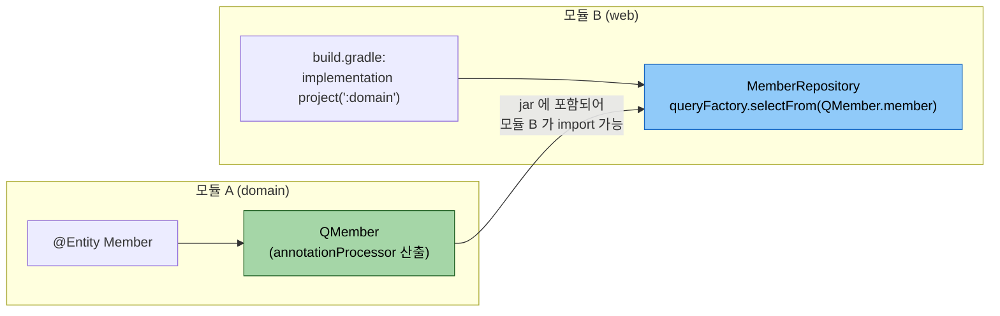
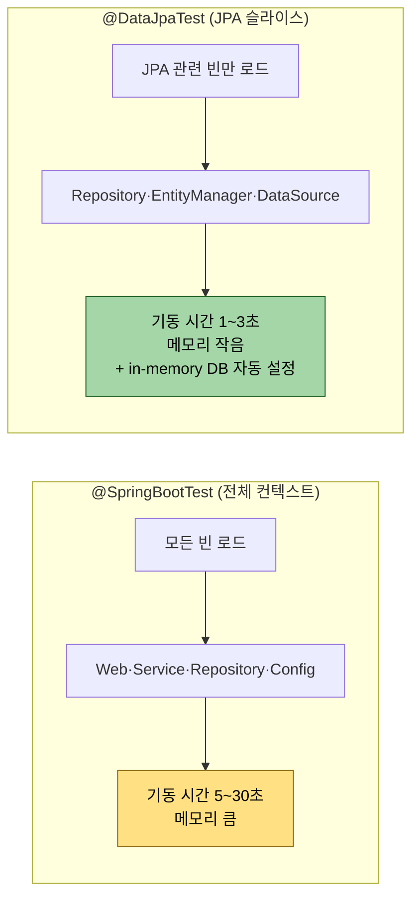

# 테스트와 멀티모듈

---

> **이 문서를 읽고 나면, `@DataJpaTest` 환경에서 QueryDSL 리포지토리를 검증할 수 있고, `JPAQueryFactory` 빈을 테스트 슬라이스에 어떻게 주입하는지 적용할 수 있으며, 멀티 모듈 환경에서 다른 모듈의 Q클래스 가시성을 확보하는 두 패턴(생성 경로 공유 / 별 q-module 분리) 을 선택할 수 있다.**

QueryDSL 리포지토리는 `@DataJpaTest`로 가볍게 검증할 수 있다. 다만 `JPAQueryFactory` 빈을 별도로 등록해야 한다는 한 가지 함정이 있다. 멀티 모듈로 분리하면 다른 모듈의 Q클래스를 어떻게 보이게 할지가 관건이다. 두 주제를 한 챕터에서 묶어 다룬다.

멀티 모듈 환경의 Q클래스 가시성 문제를 한 그림으로 보면 다음과 같다.



핵심은 *Q클래스가 모듈 A 의 jar 산출물에 포함되어야* 모듈 B 가 import 할 수 있다는 점. annotationProcessor 의 출력 경로를 sourceSets 에 포함시키는 Gradle 설정이 필요하다.


## 테스트 슬라이스 선택지

> 리포지토리 테스트는 통합 테스트보다 가볍게 짤 수 있다. 슬라이스 셋이 두 가지다.

두 슬라이스의 무게 차이를 한 그림으로 보면 다음과 같다.



리포지토리 단위 검증에는 `@DataJpaTest` 가 *5~10배 빠른* 피드백을 준다. 트레이드오프는 *JPAQueryFactory 빈이 자동 로드되지 않는다* 는 점 — 다음 절에서 보완한다.

`@SpringBootTest`로 전체 컨텍스트를 띄우면 모든 빈이 올라와 안전하지만 무겁다. JPA 리포지토리만 검증하면 된다면 `@DataJpaTest`가 더 빠르다.

| 슬라이스 | 띄우는 빈 | 트랜잭션 | 속도 |
|---------|---------|---------|------|
| `@SpringBootTest` | 전체 컨텍스트 | 기본 비활성, `@Transactional` 명시 | 느림 |
| `@DataJpaTest` | JPA 관련만 (`EntityManager`, `JpaRepository`, `DataSource`) | 자동 활성, 테스트 후 롤백 | 빠름 |

리포지토리 단위 테스트는 `@DataJpaTest`가 표준이다. 한 가지 단점은 `@DataJpaTest`가 `JPAQueryFactory` 빈을 자동으로 올리지 않는다는 점이다. 직접 등록해야 한다.


## @DataJpaTest에 JPAQueryFactory 붙이기

> 두 줄짜리 `@TestConfiguration`이 답이다.

```java
@TestConfiguration
public class QueryDslTestConfig {

    @Bean
    public JPAQueryFactory jpaQueryFactory(EntityManager em) {
        return new JPAQueryFactory(em);
    }
}
```

테스트 클래스에서는 `@Import`로 가져온다.

```java
@DataJpaTest
@Import(QueryDslTestConfig.class)
class MemberRepositoryImplTest {

    @Autowired EntityManager em;
    @Autowired MemberRepository repository;

    @Test
    void 이름_부분일치로_검색한다() {
        em.persist(new Member("kim"));
        em.persist(new Member("park"));
        em.flush();
        em.clear();

        MemberSearchCond cond = MemberSearchCond.builder()
                .name("ki")
                .build();

        List<Member> result = repository.search(cond);

        assertThat(result).hasSize(1);
        assertThat(result.get(0).getName()).isEqualTo("kim");
    }
}
```

`@DataJpaTest`가 자동으로 트랜잭션을 걸고 테스트 후 롤백하므로 데이터가 누적되지 않는다. `em.flush()` + `em.clear()` 한 번 끼워 영속성 컨텍스트 캐시가 결과에 영향을 주지 않게 만든다.

운영 코드의 `QueryDslConfig`를 그대로 가져다 쓰는 변형도 있다.

```java
@DataJpaTest
@Import(QueryDslConfig.class)  // 운영 설정 재사용
class MemberRepositoryImplTest {
    // ...
}
```

설정이 단순하면 `QueryDslConfig`를 직접 import하는 편이 중복이 없다. 테스트용 빈을 따로 만든다면 `@TestConfiguration`이 더 명확하다.


## 인메모리 DB vs Testcontainers

> `@DataJpaTest`는 기본적으로 인메모리 DB(H2)를 띄운다. 운영 DB와 다른 SQL 방언이라 함정이 생긴다.

QueryDSL 자체는 JPQL을 만들기 때문에 DB 종류를 거의 타지 않는다. 그러나 native query, DB 함수(`Expressions.stringTemplate`), 격리 수준 시나리오 등은 H2와 운영 DB(PostgreSQL/MySQL)에서 결과가 갈린다.

세 가지 선택지가 있다.

1. **H2로 빠르게.** 단순 CRUD와 검색 로직이라면 H2가 충분하다.
2. **Testcontainers로 운영 DB 그대로.** 도커가 필요하지만 SQL 호환성 문제가 사라진다.
3. **혼합.** 빠른 단위 테스트는 H2, 핵심 통합 테스트는 Testcontainers로.

Testcontainers 셋업은 Spring Boot 3.1+에서 `@ServiceConnection` 한 줄로 부쩍 단순해졌다.

```java
@DataJpaTest
@Import(QueryDslTestConfig.class)
@Testcontainers
class MemberRepositoryImplPostgresTest {

    @Container
    @ServiceConnection
    static PostgreSQLContainer<?> postgres = new PostgreSQLContainer<>("postgres:15");

    // 테스트 메서드들
}
```

`@ServiceConnection`이 컨테이너의 호스트·포트·DB 이름을 자동으로 Spring 설정에 주입한다. 옛날의 `@DynamicPropertySource` 보일러플레이트가 사라졌다.

### `@AutoConfigureTestDatabase(replace = Replace.NONE)` — H2 자동 교체를 끄는 스위치

`@DataJpaTest`는 *기본적으로* 프로젝트에 설정된 DataSource 를 무시하고 인메모리 H2 로 **바꿔치기(replace)** 한다. 이 동작을 끄는 어노테이션이 `@AutoConfigureTestDatabase(replace = Replace.NONE)` 다. 두 어노테이션의 책임을 분리해 보면 이렇다.

| 어노테이션 | 책임 |
|-----------|------|
| `@DataJpaTest` | JPA 슬라이스만 띄운다 (Repository·EntityManager·트랜잭션). `@Service`·`@Controller` 빈은 안 올린다. 각 테스트는 트랜잭션으로 감싸 끝나면 **자동 롤백**한다 |
| `@AutoConfigureTestDatabase(replace = Replace.NONE)` | "테스트용 DB 로 바꿔치기" 를 **하지 마라**. `application-test.yml` 에 적힌 *실제 DataSource* 를 그대로 쓰게 한다 |

`replace` 의 값은 세 가지다.

- `Replace.ANY` (기본값): 설정된 DataSource 가 무엇이든 인메모리로 교체. *H2 가 클래스패스에 있어야* 동작한다.
- `Replace.AUTO_CONFIGURED`: 스프링이 자동 구성한 DataSource 만 교체.
- `Replace.NONE`: 교체하지 않음 — *실제 DB 로 테스트* 한다.

우리 실습이 `Replace.NONE` 인 이유는, 검증 대상이 **PostgreSQL 에서만 정확한 동작** (예: `sum(int*int)` 이 bigint 반환, 윈도우 함수, `Expressions` DB 함수) 이기 때문이다. 

- H2 로 바꿔치기하면 방언이 달라 같은 QueryDSL 코드가 다른 SQL·다른 결과를 내, 통과해도 운영 DB 에서 깨질 수 있다 (§위 "인메모리 DB vs Testcontainers" 의 함정과 같은 맥락).

```java
@DataJpaTest
@AutoConfigureTestDatabase(replace = Replace.NONE)   // H2 로 바꾸지 말고 실제 DB 사용
@ActiveProfiles("test")                              // application-test.yml 의 DataSource 적용
@Import(QuerydslConfig.class)                         // JPAQueryFactory 빈 수동 등록 (위 절 참고)
class SomeRepositoryTest { ... }
```

> 정리하면 `Replace.NONE` + `@ActiveProfiles("test")` 조합이 "H2 대신 `application-test.yml` 의 실제 DB 로 슬라이스 테스트" 를 만든다. Testcontainers 가 *도커로 운영 DB 를 띄우는* 길이라면, 이쪽은 *이미 떠 있는 외부 DB(우리는 Supabase)에 붙는* 더 가벼운 길이다.


## given-when-then으로 테스트 가독성 확보

> 한 테스트가 무엇을 검증하는지 한눈에 보이게 만든다.

```java
@Test
void 페이징_결과는_지정한_페이지_크기를_따른다() {
    // given
    for (int i = 0; i < 25; i++) {
        em.persist(new Member("member" + i));
    }
    em.flush();
    em.clear();

    // when
    Page<Member> page = repository.searchPage(
            MemberSearchCond.builder().build()
            , PageRequest.of(0, 10)
    );

    // then
    assertThat(page.getContent()).hasSize(10);
    assertThat(page.getTotalElements()).isEqualTo(25);
    assertThat(page.getTotalPages()).isEqualTo(3);
}
```

테스트 이름은 한글로 의도를 드러내고, given-when-then 주석으로 단계를 구분한다. 한 메서드 안에서 검증이 두 시나리오로 갈리면 분리한다.


## fragment 단위 테스트

> 02-01에서 다룬 fragment 패턴은 fragment 단위로 테스트가 가능하다.

```java
@DataJpaTest
@Import({QueryDslTestConfig.class, MemberSearchFragmentImpl.class})
class MemberSearchFragmentTest {

    @Autowired MemberSearchFragment fragment;

    @Test
    void 활성_회원만_조회한다() {
        // ...
    }
}
```

`@Import`에 fragment 구현 클래스 자체를 등록해 메인 리포지토리 없이 fragment만 테스트한다. 단위 테스트 범위가 좁아져 실패 시 원인 파악이 빠르다.


## 멀티모듈 셋업의 핵심 의문

> 도메인 모듈을 분리하면 그 모듈의 엔티티에서 만든 Q클래스를 다른 모듈이 어떻게 보는가?

전형적인 멀티모듈 구조를 가정한다.

```
project-root/
├── settings.gradle
├── build.gradle              (공통 설정)
├── domain/                   (엔티티 + Q클래스 생성 위치)
│   ├── build.gradle
│   └── src/main/java/com/example/domain/Member.java
├── repository/               (Q클래스 사용)
│   ├── build.gradle
│   └── src/main/java/com/example/repository/MemberRepositoryImpl.java
└── api/                      (Spring Boot 앱)
    └── build.gradle
```

- `Member` 엔티티는 `domain` 모듈에 있고, `domain` 모듈을 빌드하면 `domain/build/generated/.../QMember.java`가 생긴다. `repository` 모듈은 `domain`을 의존하므로 `Member`는 import 가능하지만, `QMember`는 안 보일 수 있다.

문제의 본질은 한 가지다. **Q클래스는 `domain` 모듈의 빌드 산출물이지 소스가 아니다.** Gradle은 의존 모듈의 컴파일 산출물(JAR 안의 `.class`)은 자동으로 보여 주지만, 의존 모듈의 generated 소스를 자동으로 다른 모듈에 노출하지는 않는다.


## 멀티모듈 해결 패턴 — 도메인 모듈에서 Q클래스 빌드

> 가장 단순한 패턴이다. Q클래스를 만드는 모듈에 annotationProcessor를 두고, 의존하는 모듈은 그대로 사용한다.

`domain/build.gradle`:

```groovy
dependencies {
    api 'org.springframework.boot:spring-boot-starter-data-jpa'

    api "io.github.openfeign.querydsl:querydsl-jpa:${querydslVersion}"
    annotationProcessor "io.github.openfeign.querydsl:querydsl-apt:${querydslVersion}:jakarta"
    annotationProcessor 'jakarta.annotation:jakarta.annotation-api'
    annotationProcessor 'jakarta.persistence:jakarta.persistence-api'
}

def querydslDir = "build/generated/sources/annotationProcessor/java/main"

sourceSets {
    main.java.srcDirs += querydslDir
}

tasks.withType(JavaCompile).configureEach {
    options.generatedSourceOutputDirectory = file(querydslDir)
}
```

핵심은 `api 'querydsl-jpa'`다. `api`로 노출하면 `domain`을 의존하는 모듈이 자동으로 querydsl 타입을 쓸 수 있다. `repository` 모듈은 다음만 추가하면 된다.

```groovy
// repository/build.gradle
dependencies {
    api project(':domain')
}
```

빌드 순서는 Gradle이 결정한다. `repository`를 빌드하기 전에 `domain`이 먼저 빌드되어 Q클래스가 만들어지고, 그 결과가 컴파일 클래스패스에 포함된다.

이 패턴이 작동하는 이유는 Gradle이 의존 프로젝트의 `compileJava` 결과(`.class` 파일들)를 다음 프로젝트의 컴파일 클래스패스에 자동으로 포함하기 때문이다. Q클래스도 `.class` 형태가 되면 일반 클래스와 구분되지 않는다.


## 멀티모듈 함정 — IDE 인식 문제

> Gradle 빌드는 통과하는데 IntelliJ가 다른 모듈의 Q클래스를 빨갛게 표시하는 함정이 있다.

원인은 IDE 위임 설정이다. `repository` 모듈이 `domain`의 generated 소스를 IDE 차원에서 인식하려면, `domain` 모듈에서 한 번 컴파일이 끝나야 한다. IntelliJ의 `Build, Execution, Deployment > Build Tools > Gradle > Build and run using`이 IntelliJ로 되어 있으면 generated 폴더 인식이 어긋나는 경우가 있다.

해결 순서는 단순하다.

1. `./gradlew clean build`를 한 번 돌린다.
2. IntelliJ의 Gradle 새로고침 버튼을 누른다.
3. 그래도 안 보이면 `File > Invalidate Caches / Restart`.

이 함정은 셋업 직후에는 거의 항상 만나고, 한 번 풀고 나면 잘 나오지 않는다.


## 멀티모듈 변형 — 별도 querydsl-classes 모듈

> Q클래스만 모은 모듈을 만드는 패턴도 있다. 도메인 모듈을 깔끔하게 두고 싶을 때 쓴다.

```
project-root/
├── domain/                   (엔티티만)
├── domain-querydsl/          (Q클래스만 — annotationProcessor 적용)
└── repository/
```

`domain-querydsl/build.gradle`은 `domain`을 의존하고 annotationProcessor만 활성화한다. Q클래스가 별도 모듈로 떨어진다.

장점은 도메인 모듈이 어떤 ORM 도구도 알지 못하는 순수 모듈로 유지되는 점이다. 단점은 모듈 수가 늘고 빌드 그래프가 복잡해지는 점이다. 도메인 순수성이 절대적인 프로젝트가 아니면 첫 번째 패턴(도메인 모듈에서 Q클래스 빌드)이 더 가볍다.


## CI에서 Q클래스 캐싱 주의

> Gradle 빌드 캐시가 켜져 있으면 의존 모듈의 generated 산출물을 재생성하지 않을 수 있다.

GitHub Actions 같은 CI에서 Gradle 캐시를 적극 활용하면 빌드가 빨라진다. 다만 엔티티가 바뀌었는데 Q클래스가 옛 캐시에서 복원되면 컴파일이 깨진다. 다음 두 가지로 방어한다.

1. **캐시 키에 소스 해시를 포함한다.** `actions/cache`에서 `key`에 `**/*.java` 해시를 넣는다.
2. **이상 동작 시 `./gradlew clean compileJava`로 강제 재생성.** 의심되면 캐시를 일단 무시하고 빌드를 돌려 본다.

운영 환경에서 한 번 디버깅한 뒤로는 거의 마주치지 않지만, 빌드가 갑자기 깨질 때 의심해 볼 후보다.


## 면접에서 받을 만한 질문

> 테스트와 빌드 환경 질문은 신입보다 경력자에게 자주 나온다. 함정과 해결을 한 문장씩 말할 수 있어야 한다.

1. `@DataJpaTest`만으로 QueryDSL 테스트가 되는가?
   - 답 요지: 안 된다. `JPAQueryFactory` 빈을 별도로 등록해야 한다. `@TestConfiguration` + `@Import` 조합이 표준이며, 운영의 `QueryDslConfig`를 직접 import해도 된다.
2. 멀티모듈에서 다른 모듈의 Q클래스가 안 보일 때 무엇을 점검하는가?
   - 답 요지: Q클래스를 만드는 모듈의 annotationProcessor 설정, 의존 노출(`api` vs `implementation`), 빌드 순서, IDE의 generated 소스 인식. `./gradlew clean build` + IDE 새로고침이 첫 시도다.
3. Testcontainers를 굳이 쓸 이유는?
   - 답 요지: H2와 운영 DB의 SQL 방언 차이 때문이다. native query, DB 함수, 격리 수준 동작이 다르므로 핵심 통합 테스트는 운영 DB와 같은 엔진으로 검증해야 안전하다. 단순 CRUD는 H2로도 충분하다.
4. fragment 단위 테스트의 이점은?
   - 답 요지: 한 fragment만 컨텍스트에 올려 검증 범위를 좁히면 실패 원인 파악이 빠르고, 테스트 자체도 가벼워진다. 특히 통계용 fragment처럼 도메인 영속성과 분리된 메서드를 테스트할 때 유용하다.


## 관련 문서

> 본 테스트·멀티모듈 문서가 묶음 내 다른 챕터와 어떻게 연결되는지. 단일 모듈 셋업은 01-02, 커스텀 리포지토리 패턴은 jpa/03-05 로 자연스럽게 이어진다.

- [01-02. 프로젝트 셋업 (Gradle 6.12)](01-02.프로젝트%20셋업%20(Gradle%206.12).md) — 단일 모듈 셋업과 비교
- [jpa/03-05. 커스텀 리포지토리 패턴](../jpa/03-05.커스텀%20리포지토리%20패턴.md) — fragment를 만들 때의 단위
- [11_spring/04_testing/01-01. 테스트 피라미드와 Spring 테스트 종류](../../11_spring/04_testing/01-01.테스트%20피라미드와%20Spring%20테스트%20종류.md) — `@DataJpaTest`·슬라이스가 전체 테스트 계층에서 차지하는 위치 (본 문서의 JPA 슬라이스를 더 넓은 맥락에서 봄)
- [Spring Boot Test 문서](https://docs.spring.io/spring-boot/docs/3.2.3/reference/htmlsingle/#features.testing)
