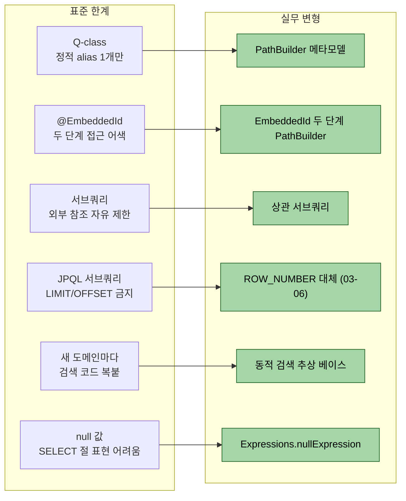
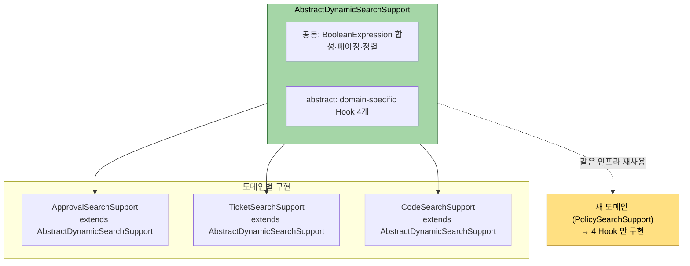
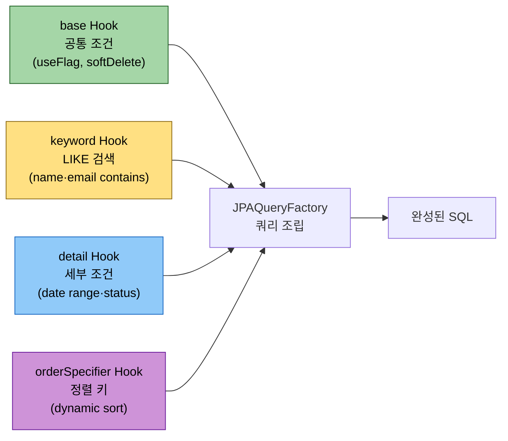

# 실무 변형 모음

---

> **이 문서를 읽고 나면, 표준에서 비껴난 여섯 가지 실무 변형(PathBuilder 메타모델·Embedded ID 접근·상관 서브쿼리·JPQL limit 한계·동적 검색 추상 베이스·nullExpression) 을 운영 코드에서 식별하고, 각 변형이 어떤 표준 한계를 우회하는지 설명하며, 새 도메인에 같은 패턴을 적용할 수 있다.**

본 학습 묶음의 1장·2장은 표준 패턴을 다룬다. 실제 운영 코드베이스에서는 표준에서 살짝 비껴난 변형이 자주 등장하는데, 이유가 있다. 본 챕터는 PathBuilder 기반 메타모델, Embedded ID 접근, 상관 서브쿼리, JPQL 서브쿼리 한계, 동적 검색 추상 베이스, nullExpression 자리잡기 등 여섯 가지 변형을 한 자리에 모은다.

여섯 변형이 *어떤 표준 한계를 우회하는지* 한 그림으로 정리하면 다음과 같다.



- 여섯 변형이 모두 *표준이 못 푸는 자리를 보완* 한다는 점에서 공통이다. 1·2장의 표준 도구가 일반 검색을 80% 해결하고, 본 챕터의 변형이 나머지 20% 의 모서리를 처리한다.


## 본 챕터의 위치

> 표준 학습이 끝난 뒤에 보면 좋은 부록이다. 새 프로젝트라면 표준 패턴이 우선이다.

운영 시스템에서는 다음 제약이 새 패턴을 만든다.

1. 엔티티 추가가 빈번하지 않고, Q-class 생성이 끊겨도 기존 코드가 동작해야 한다.
2. 복합 키(`@EmbeddedId`)가 도메인 표준이라 단일 `@Id` 가정이 깨진다.
3. 동적 검색·정렬·페이징을 한 화면씩 짜기 어려워 추상 베이스로 묶는다.
4. 사내 모듈 경계 정책으로 다른 도메인의 엔티티를 import할 수 없는 경우가 있다.

이런 제약이 본 챕터의 여섯 가지 변형을 만든다. 각 변형이 표준에서 어떻게 갈라졌고 왜 그 비용이 정당한지를 짚는다.


## PathBuilder 기반 메타모델 — Q-class 회피

> Q-class를 import하지 않고 `PathBuilder<EntityType>`로 alias만 정의한다.

PathBuilder 의 *정의·생성·자료형 접근·트레이드오프* 자체는 [02-01.PathBuilder — 동적 path 빌더 깊이](02-01.PathBuilder%20%E2%80%94%20%EB%8F%99%EC%A0%81%20path%20%EB%B9%8C%EB%8D%94%20%EA%B9%8A%EC%9D%B4.md) 가 다룬다. 본 절은 그 *언제* — Q-class 회피 정책 / EmbeddedId / 상관 서브쿼리 / 동적 검색 추상 베이스 — 를 확장한다.

본 학습 묶음의 표준은 `import static com.example.domain.QMember.member`다. 그런데 운영 코드베이스에서는 다음 형태를 흔히 본다.

```java
private static final PathBuilder<Member> MEMBER =
        new PathBuilder<>(Member.class, "member");

private static final PathBuilder<Team> TEAM =
        new PathBuilder<>(Team.class, "team");
```

`PathBuilder`는 QueryDSL이 제공하는 동적 path 빌더다. Q-class와 같은 역할을 하지만 컬럼 접근이 문자열 기반이다.

```java
queryFactory
        .selectFrom(MEMBER)
        .where(MEMBER.getString("name").contains("kim"))
        .orderBy(MEMBER.getNumber("age", Integer.class).asc())
        .fetch();
```

이 변형이 정당한 이유는 두 가지다.

1. **annotationProcessor 빌드가 실패해도 컴파일이 살아남는다.** 새 엔티티가 추가되었는데 Q-class 생성이 누락된 상태에서도 기존 PathBuilder 정의가 망가지지 않는다.
2. **여러 모듈에서 같은 엔티티를 다른 alias로 다룰 때 자유롭다.** Q-class는 한 엔티티당 정적 인스턴스가 고정되지만, PathBuilder는 이름을 임의로 짓는다.

대신 잃는 것이 있다.

1. **컴파일 타임 컬럼 검증이 약해진다.** `getString("naem")`이 컴파일에 통과한다. 런타임에야 발견된다.
2. **IDE 자동완성이 동작하지 않는다.** 컬럼명을 직접 외워야 한다.

새 프로젝트라면 표준 Q-class가 안전하다. 사내 빌드 정책이나 모듈 경계 때문에 Q-class import를 피해야 하는 환경에서만 PathBuilder로 옮긴다.

### Q-class 가 있어도 PathBuilder 를 쓰는 이유 — TPS 결재 도메인 사례

> 결재 도메인은 Q-class 가 *정상 생성되어 있음에도* PathBuilder 만 씁니다. 위 두 가지 일반론(빌드 안전성·alias 자유)보다 한 단계 더 구체적인 네 가지 강제력이 결재 도메인 코드 안에서 직접 관찰됩니다.

먼저 분포부터 보겠습니다. `operator/ticket/src/main/java/.../approval/` 디렉토리의 프로덕션 코드에서 `new PathBuilder<>(` 생성 라인이 78건이고, 같은 디렉토리의 Q-class import(`import ...Q[A-Z]*Entity` / `Q[A-Z]*Id`)는 0건입니다. 

- 같은 모듈의 `build/generated/sources/annotationProcessor/.../approval/entity/` 안에 `QApprovalBasicEntity`·`QAprvUserEntity` 같은 Q-class 가 정상 생성되어 있다는 점이 핵심입니다. 
- *Q-class 가 있어도 안 쓴다*는 뜻이므로, 위 일반론 ⓛ "annotationProcessor 빌드 실패에 대한 안전성" 은 결재 도메인의 실제 채택 이유가 아닙니다. 진짜 이유는 아래 네 가지입니다.

| 이유 | Q-class 의 한계 | PathBuilder 의 해결 | 출처 |
|------|-----------------|---------------------|------|
| 같은 테이블 두 alias self-join | 엔티티당 정적 싱글톤 1개만 존재 | 생성 시점에 alias 이름을 임의 지정 | `ApprovalHistoryListQueryContext.java:39,40` |
| 헬퍼 함수가 alias 를 외부 주입 | alias 가 컴파일 타임 상수 — 함수 인자로 흘릴 수 없음 | `PathBuilder` 자체가 1급 값이라 함수 시그니처에 그대로 받음 | `ApprovalApproverPredicates.java:35` |
| Cross-aggregate read 모델 | 도메인마다 Q-class 가 흩어져 일관된 별칭 그릇이 없음 | 14 alias 를 한 record 에 묶어 모든 헬퍼에 동일 인스턴스로 전달 | `MyToListQueryContext.java:14~82` |
| Alias 응결 단위로서 record | 정적 import 는 *재사용* 만 강조하고 *응결* 은 표현하지 못함 | 컨텍스트 record 가 "이 쿼리 한 번의 alias 한 벌" 을 응결 | 같은 파일 JavaDoc 35~40 |

#### 이유 1 — 같은 테이블 두 alias 로 self-join

결재 이력 화면은 한 쿼리 안에서 사용자 테이블(`AprvUserEntity`, TB_TPS_CM_001)을 두 별칭으로 동시에 참조해야 합니다. 결재자 정보와 요청자 정보를 같은 행에 함께 내려야 하기 때문입니다. `ApprovalHistoryListQueryContext` 가 그 두 별칭을 다음과 같이 풉니다.

```java
// ApprovalHistoryListQueryContext.java:39~40
new PathBuilder<>(AprvUserEntity.class, "approvalHistoryApproverUser"),
new PathBuilder<>(AprvUserEntity.class, "approvalHistoryApplicantUser")
```

- Q-class 정적 싱글톤은 `QAprvUserEntity.aprvUserEntity` 인스턴스가 JVM 안에 하나뿐이므로 두 인스턴스를 동시에 못 만듭니다. 
- 회피책으로 `new QAprvUserEntity("approverUser")` 처럼 alias 생성자를 쓸 수는 있지만, 그러면 *정적 import 로 짧게 쓰기* 라는 Q-class 의 핵심 이점이 사라집니다. 
- PathBuilder 는 생성 시점에 alias 를 인자로 받는 것이 본질이라 두 별칭을 자연스럽게 분리합니다.

#### 이유 2 — predicate 헬퍼 함수가 alias 를 외부에서 주입받음

결재선 권한 판정 술어는 두 화면에서 재사용됩니다. 내 할일 목록(`ApprovalToDoTableQueryAdapter`)과 결재 실행 화면(`ApprovalExecutionBasicQuerySupport`) 입니다. 

두 호출처가 *서로 다른 서브쿼리 컨텍스트* 안에서 같은 권한 판정을 실행하므로, alias 도 호출처별로 다릅니다. 그래서 술어 함수가 alias 를 외부 파라미터로 받습니다.

```java
// ApprovalApproverPredicates.java:35~38
public static BooleanExpression directApproverMatch(
        PathBuilder<ApprovalTargetApproverEntity> aprvrSub
        , String userId
) { ... }
```

- Q-class 의 정적 import 구조에서는 alias 가 컴파일 타임 상수이므로 함수 시그니처의 일반 파라미터로 흘릴 수 없습니다. 
- PathBuilder 는 *일반 객체* 이기 때문에 함수 인자·필드·record 컴포넌트 어디에든 흘려보낼 수 있습니다. 
- 결재처럼 같은 술어를 여러 화면이 다른 alias 로 합성해 써야 하는 도메인에서는 이 한 가지 차이가 결정적입니다.

#### 이유 3 — Cross-aggregate read 모델

"내가 처리할 결재 목록" 쿼리는 결재 4테이블

- `ApprovalExecutionBasicEntity`
- `ApprovalProgressEntity`
- `ApprovalTargetApproverEntity`
- `ApprovalTargetBasicEntity`)

티켓 2테이블

- `TicketApprovalMappingEntity`
- `TicketEntity`

워크플로 2테이블

- `WorkflowApprovalTriggerEntity`
-  `WorkflowComponentEntity` 

결재 마스터

- `ApprovalBasicEntity` 

사용자·메뉴 참조

- `AprvUserReferenceEntity`
- `AprvMenuReferenceEntity`

페이지·컴포넌트 매핑

- `ApprovalTargetPageMappingEntity`
- `ApprovalTargetPageComponentEntity`

공통 코드

- `CommonCodeReferenceEntity`

`MyToListQueryContext` record 시그니처에 14 개 PathBuilder 와 그에 딸린 8 개 EmbeddedId PathBuilder 가 함께 들어 있습니다.

- 별칭 14곳을 *한 곳에서 합성* 하지 않으면 헬퍼가 다른 헬퍼와 별칭을 어긋나게 만들 위험이 항상 따라옵니다. 
- 컨텍스트 record 가 그 위험을 한 자리에서 막아 줍니다. 02-01 의 결재 관리 5필드 사례보다 두 배 이상 큰 cross-aggregate 케이스라는 점은 [02-01. PathBuilder 깊이](02-01.PathBuilder%20%E2%80%94%20%EB%8F%99%EC%A0%81%20path%20%EB%B9%8C%EB%8D%94%20%EA%B9%8A%EC%9D%B4.md) 에서 사용 패턴까지 이어 보면 됩니다.

#### 이유 4 — 클래스 JavaDoc 본인이 채택 동기를 박아둠

`MyToListQueryContext` 클래스 JavaDoc 이 채택 이유를 직접 명문화합니다.

```java
// MyToListQueryContext.java:35~40 (요약)
// 같은 쿼리 안에서 동일 테이블을 가리킬 때는 반드시 같은 PathBuilder 인스턴스를
// 써야 QueryDSL 이 생성하는 SQL 의 별칭이 일관된다. 그래서 한 번 만든 별칭
// 한 벌을 record 로 묶어 모든 헬퍼(JOIN 빌더, WHERE 표현식, 서브쿼리 등)에
// 컨텍스트 단위로 전달한다.
```

- Q-class 는 *컬럼 안전성* 이 강점이고, PathBuilder 는 *alias 응결과 합성 자유* 가 강점입니다. 
- 결재처럼 self-join·외부 alias 주입·cross-aggregate 가 한 쿼리에 동시에 필요한 도메인에서는 후자의 가치가 더 큽니다.


## Embedded ID 접근

> 복합 키 엔티티는 `@EmbeddedId`로 모델링한다. PathBuilder로 그 안의 필드를 한 번 더 파고든다.

회원 활동 이력처럼 (회원ID + 일자) 같은 자연 키를 갖는 도메인을 가정한다.

```java
@Embeddable
@Getter @NoArgsConstructor(access = PROTECTED)
public class MemberActivityId implements Serializable {
    private Long memberId;
    private LocalDate activityDate;
}

@Entity
public class MemberActivity {
    @EmbeddedId
    private MemberActivityId id;
    private int loginCount;
    // ...
}
```

PathBuilder로 EmbeddedId 안의 필드에 접근하는 패턴은 다음과 같다.

```java
private static final PathBuilder<MemberActivity> ACT =
        new PathBuilder<>(MemberActivity.class, "act");
private static final PathBuilder<MemberActivityId> ACT_ID =
        ACT.get("id", MemberActivityId.class);

queryFactory
        .selectFrom(ACT)
        .where(
                ACT_ID.getNumber("memberId", Long.class).eq(memberId)
                , ACT_ID.get("activityDate", LocalDate.class).between(start, end)
        )
        .orderBy(ACT_ID.get("activityDate", LocalDate.class).asc())
        .fetch();
```

- `ACT.get("id", ...)`로 EmbeddedId 자체를 PathBuilder로 한 번 캡슐화하고, 그 안의 필드는 `getString`/`getNumber`로 접근한다. 
- 두 번 파고드는 것이 어색해 보이지만 이 패턴이 이름 충돌을 막는다. EmbeddedId 안에 `id` 필드가 또 있으면 `ACT.getString("id")`가 모호해지기 때문이다.

Q-class를 쓰는 표준 패턴이라면 `QMemberActivity.memberActivity.id.memberId`로 자연스럽게 빠진다. PathBuilder를 쓸 때만 위 한 단계를 명시적으로 거친다.


## 임베디드 값 객체 중첩 접근

> Embedded ID와 같은 메커니즘이 임베디드 값 객체에도 적용된다.

`UseFlag`처럼 `@Embeddable` 값 객체로 사용 여부를 캡슐화하는 패턴이 흔하다.

```java
@Embeddable
public class UseFlag {
    @Column(name = "use_yn")
    private String useYn;
}

@Entity
public class Member {
    @Embedded
    private UseFlag useFlag;
    // ...
}
```

PathBuilder로 접근할 때는 다음과 같이 두 단계 `get`을 쓴다.

```java
queryFactory
        .selectFrom(MEMBER)
        .where(MEMBER.get("useFlag").get("useYn").eq("Y"))
        .fetch();
```

- `MEMBER.get("useFlag")`가 임베디드 객체에 대한 path를 만들고, 그 위에서 `get("useYn")`이 실제 컬럼 path가 된다. 
- 이 패턴은 `SoftDeleteFlag`, `AuditTrail`, `Money` 같은 도메인 값 객체에서 같은 모양으로 반복된다.


## JPAExpressions로 상관 서브쿼리

> "회원별 최신 주문" 같은 쿼리는 max를 뽑아 외부 쿼리와 결합한다.

회원의 가장 최근 주문을 한 줄씩 뽑는다고 하자. 표준 SQL이라면 다음과 같이 짠다.

```sql
SELECT m.*, o.*
FROM member m
JOIN orders o ON o.buyer_id = m.id
WHERE o.ordered_at = (
    SELECT MAX(o2.ordered_at) FROM orders o2 WHERE o2.buyer_id = m.id
)
```

QueryDSL에서는 `JPAExpressions`로 서브쿼리를 표현한다.

```java
PathBuilder<Order> latest = new PathBuilder<>(Order.class, "latest");

JPQLQuery<LocalDateTime> maxOrderedAt = JPAExpressions
        .select(latest.get("orderedAt", LocalDateTime.class).max())
        .from(latest)
        .where(latest.get("buyer").get("id").eq(MEMBER.get("id")));

List<Tuple> result = queryFactory
        .select(MEMBER, ORDER)
        .from(MEMBER)
        .join(ORDER).on(ORDER.get("buyer").get("id").eq(MEMBER.get("id")))
        .where(ORDER.get("orderedAt", LocalDateTime.class).eq(maxOrderedAt))
        .fetch();
```

핵심 두 가지다.

1. **서브쿼리용 별도 alias를 만든다.** 외부 쿼리의 `ORDER`와 별개로 `latest`라는 새 PathBuilder를 정의해야 같은 테이블을 두 번 참조하는 SQL이 생성된다.
2. **상관 조건은 외부 alias를 직접 참조한다.** `latest.get(...).eq(MEMBER.get("id"))`처럼 외부 쿼리의 PathBuilder를 그대로 쓴다.

이 패턴은 "버전이 여러 개일 때 최신만", "이력 테이블에서 최근 한 건만" 같은 화면에 그대로 적용된다.


## JPQL 서브쿼리의 limit 한계 — 두 단계 fetch + record copy

> JPQL 서브쿼리는 `limit/order by`를 지원하지 않는다. SQL이 되더라도 JPQL 단계에서 막힌다.

"회원별 가장 일찍 등록된 주문 항목 한 개만 가져오기"처럼 서브쿼리에 정렬과 limit이 동시에 필요한 경우가 있다. 표준 SQL은 다음과 같이 짠다.

```sql
SELECT (SELECT product_name FROM order_item
        WHERE order_id = o.id ORDER BY id ASC LIMIT 1)
FROM orders o
WHERE o.buyer_id = ?
```

QueryDSL에서 같은 의미를 `JPAExpressions`로 짜면 JPQL이 다음 에러를 던진다.

```
QuerySyntaxException: subquery cannot have order by/limit
```

해결 패턴은 두 단계 fetch + record copy다. 외부 쿼리에서 자리만 잡고, 안쪽 1행은 별도 호출로 채운다.

```java
// 1단계 — 자리만 잡고 안쪽은 null로 둔다
List<OrderSummary> outline = queryFactory
        .select(Projections.constructor(OrderSummary.class
                , ORDER.get("id", Long.class)
                , ORDER.get("orderedAt", LocalDateTime.class)
                , Expressions.nullExpression(String.class)  // firstProductName
        ))
        .from(ORDER)
        .where(ORDER.get("buyer").get("id").eq(buyerId))
        .fetch();

// 2단계 — 1단계 결과의 ID로 limit 1 쿼리를 한 번 더 돌린다
List<OrderSummary> result = outline.stream()
        .map(s -> new OrderSummary(
                s.id()
                , s.orderedAt()
                , queryFactory
                        .select(ITEM.get("productName", String.class))
                        .from(ITEM)
                        .where(ITEM.get("order").get("id").eq(s.id()))
                        .orderBy(ITEM.get("id", Long.class).asc())
                        .limit(1)
                        .fetchOne()
        ))
        .toList();
```

- 이 패턴이 정당한 이유는 record가 불변이라 새 인스턴스로 copy하는 비용이 작고, 코드 의도가 한눈에 들어오기 때문이다. 
- 외부 쿼리 결과 N개에 대해 안쪽 쿼리가 N번 더 나가지만, batch가 50~100건 단위로 묶이는 화면에서는 문제가 되지 않는다.

수만 건이 되면 native query로 폴백하는 편이 나을 수 있다. 결정 기준은 화면이 받는 페이지 크기다.


## DTO 자리만 잡는 nullExpression 패턴

> 코드명 lookup 위치가 아직 정해지지 않았을 때 자리만 비워 두고 후속 작업으로 미룬다.

도메인 코드(`status`)와 그 한글명(`statusName`)을 함께 응답으로 내보내야 한다고 하자. 한글명은 별도 코드 테이블에서 lookup해야 하는데, 그 헬퍼가 아직 준비되지 않았다.

이때 `Expressions.nullExpression(...)`으로 자리만 잡는다.

```java
List<MemberSearchResult> result = queryFactory
        .select(Projections.constructor(MemberSearchResult.class
                , MEMBER.get("id", Long.class)
                , MEMBER.get("name", String.class)
                , MEMBER.get("status", MemberStatus.class)
                , Expressions.nullExpression(String.class)  // TODO statusName lookup
        ))
        .from(MEMBER)
        .fetch();
```

- DTO 시그니처는 그대로 유지되고, 호출부는 `null`이 들어온다는 사실만 알면 된다. 후속에서 코드 lookup 헬퍼가 준비되면 해당 표현식만 교체한다
- 주의는 한 가지다. 컴파일은 통과하지만 운영에 그대로 배포하면 안 된다. **TODO 주석에 후속 plan 또는 ticket 번호를 함께 남겨야** 잊혀지지 않는다.


## 동적 검색 추상 베이스 — 한 클래스로 묶기

> 화면마다 동적 검색 코드를 반복 작성하는 비용이 크다면 추상 베이스로 묶는다.

추상 베이스가 새 도메인을 어떻게 흡수하는지 한 그림으로 보면 다음과 같다.



- 추상 베이스가 *검색 인프라(공통)* 와 *도메인 특화(Hook 4개)* 를 분리한다 — 새 도메인은 4 Hook 만 구현하면 같은 페이징·정렬·합성 인프라를 재사용한다.
- 본 절은 *추상 베이스 한 클래스* 의 골격을 다룬다. 그 안에서 사용되는 *표현식 합성 패턴* — Functional Predicate Supplier, Hooks 4 분할, ThreadLocal userId 캡처, BooleanBuilder.or() 누적 — 의 *왜* 와 *어떻게* 는 [02-04. Hooks·ThreadLocal·BooleanBuilder 누적](02-04.Hooks%C2%B7ThreadLocal%C2%B7BooleanBuilder%20%EB%88%84%EC%A0%81%20%E2%80%94%20%ED%91%9C%ED%98%84%EC%8B%9D%20%ED%95%A9%EC%84%B1%20%ED%8C%A8%ED%84%B4.md) 가 다룬다.

다음과 같은 패턴이 흔하다.

```java
public abstract class AbstractDynamicSearchRepository<C, E> {

    protected final JPAQueryFactory queryFactory;

    protected AbstractDynamicSearchRepository(JPAQueryFactory queryFactory) {
        this.queryFactory = queryFactory;
    }

  	// 검색 함수
    public Page<E> search(C cond, Pageable pageable) {
        PathBuilder<E> entity = entityPath();
        BooleanBuilder predicate = buildPredicate(cond, entity);

        List<E> content = queryFactory
                .selectFrom(entity)
                .where(predicate)
                .orderBy(buildOrderSpecifiers(pageable, entity))
                .offset(pageable.getOffset())
                .limit(pageable.getPageSize())
                .fetch();

        JPAQuery<Long> countQuery = queryFactory
                .select(entity.get("id", Long.class).count())
                .from(entity)
                .where(predicate);

        return PageableExecutionUtils.getPage(content, pageable, countQuery::fetchOne);
    }

    protected abstract PathBuilder<E> entityPath();
    protected abstract BooleanBuilder buildPredicate(C cond, PathBuilder<E> entity);
    protected abstract OrderSpecifier<?>[] buildOrderSpecifiers(Pageable pageable, PathBuilder<E> entity);
}
```

서브클래스는 술어 빌드만 구현한다.

```java
@Repository
public class MemberSearchRepository extends AbstractDynamicSearchRepository<MemberSearchCond, Member> {

    private static final PathBuilder<Member> ENTITY = new PathBuilder<>(Member.class, "member");

    public MemberSearchRepository(JPAQueryFactory queryFactory) {
        super(queryFactory);
    }

    @Override
    protected PathBuilder<Member> entityPath() { return ENTITY; }

    @Override
    protected BooleanBuilder buildPredicate(MemberSearchCond cond, PathBuilder<Member> e) {
        BooleanBuilder b = new BooleanBuilder();
        if (StringUtils.hasText(cond.name())) b.and(e.getString("name").contains(cond.name()));
        if (cond.status() != null)             b.and(e.get("status").eq(cond.status()));
        return b;
    }
    // orderSpecifiers 동일
}
```

이 추상화가 정당한 시점은 다음 둘이 동시에 만족할 때다.

1. **세 개 이상의 화면이 같은 검색·정렬·페이징 골격을 갖는다.**
2. **`PathBuilder` 패턴이 이미 코드베이스 표준이다.** 그렇지 않으면 추상 베이스가 두 패턴(Q-class와 PathBuilder)을 모두 만족시키느라 복잡해진다.

새 프로젝트라면 03-01의 fragment 패턴이 더 가볍다. 추상 베이스는 같은 패턴이 충분히 반복된 뒤에야 정당하다.


## Cross-domain 회피 — native query 폴백

> 사내 모듈 경계 정책 때문에 다른 도메인의 엔티티를 import할 수 없을 때, 한 쿼리에서만 native로 빠진다.

운영 시스템에서는 종종 "주문 도메인 모듈에서 워크플로우 도메인 엔티티를 import하면 안 된다"는 정책이 있다. 그런데 한 화면에서 두 도메인을 조인해야 한다면 다음 두 가지 선택지가 있다.

1. **read 모델용 별도 모듈 신설.** 두 도메인을 모두 import 가능한 read 전용 모듈을 만든다. 정도의 차이는 있지만 코드량이 많다.
2. **native query 폴백.** 한 메서드만 `@Query(value = "...", nativeQuery = true)`로 빠진다. 정책을 우회하지 않고 이 메서드 하나만 예외 처리한다는 의도가 명시된다.

경험적으로는 두 번째가 더 간결한 경우가 많다. 단, native query는 컬럼 매핑을 직접 작성해야 하므로 DTO와 SQL을 함께 검토하는 코드 리뷰 단계가 필요하다.


## Hooks 4 분할 — TPS 결재 도메인 운영 코드

> Hooks 4분할은 querydsl 합성 패턴의 Strategy 일반화입니다. 본 절은 그 일반 원리가 TPS 결재 도메인의 `ApprovalManagementListQuerySupport` / `ApprovalHistoryListQuerySupport` / `MyToListQuerySupport` 에서 어떻게 구체화되는지를 봅니다. 02-04 §Functional Predicate Supplier 의 Registry 가 *컬럼별 표현식 매핑* 이라면, Hooks 는 *쿼리 단위 합성 전략* 입니다.

검색 표현식을 *base(공통 조건)·keyword(LIKE 검색)·detail(세부 조건)·orderSpecifier(정렬)* 네 갈래로 분할해 도메인별 변경을 한 자리에 가둔다. 4분할은 Strategy 패턴의 일종이며, 모든 검색 쿼리가 같은 4축 인터페이스를 따른다.

Hooks 4분할이 한 쿼리에서 어떻게 조립되는지 다음 그림으로 박힌다.



도메인이 늘어도 4축은 그대로다 — 결재·티켓·코드 등 새 도메인은 자기 4 Hook 만 구현하면 같은 검색 인프라를 재사용한다.

Registry 가 *컬럼별 표현식 매핑* 이라면, Hooks 는 *쿼리 단위 합성 전략* 이다. 4 가지 메서드로 분할.

```java
public interface QuerydslQueryHooks<Column, Context> {
    Predicate basePredicate(Context ctx);                          // 항상 합산되는 WHERE
  
    Predicate keywordPredicate(Context ctx, Column col, String kw); // 글로벌 검색 OR 가지
  
    Predicate detailPredicate(Context ctx, ResolvedDetailCondition<Column> dc); // 상세 검색 AND 가지
  
    OrderSpecifier<?> orderSpecifier(Context ctx, Column col, SortDirection d); // 동적 정렬 식
}
```

### 왜 4 개로 분할하는가

각 메서드가 *부모 추상 클래스* (`AbstractQuerydslListQueryRepository`) 의 다른 단계에서 호출된다.

| Hook 메서드 | 호출 시점 | 합성 방식 |
|-------------|----------|----------|
| `basePredicate` | `buildPredicate` 진입 시 1회 | 모든 다른 술어와 AND |
| `keywordPredicate` | `searchObj.column=ALL` 일 때 글로벌 컬럼 각각에 1회 | 컬럼 N개 결과를 OR 결합 |
| `detailPredicate` | `searchObj.detail` 항목 각각에 1회 | 항목 N개 결과를 AND 결합 |
| `orderSpecifier` | `sortObj.column` 마다 1회 (registry 가 처리 못 할 때 fallback) | OrderSpecifier 배열에 추가 |

- 4 메서드의 *조합 위치* 가 다르기 때문에 한 메서드에 합쳐 두면 부모가 분기 책임을 떠안게 된다. 분할이 책임을 위쪽으로 올리는 패턴.

### `default` 메서드로 빈 구현 제공

interface 의 모든 메서드가 `default` 로 *null 반환* 을 제공한다.

```java
public interface QuerydslQueryHooks<Column, Context> {
    default Predicate basePredicate(Context ctx) { return null; }
    default Predicate keywordPredicate(Context ctx, Column col, String kw) { return null; }
    default Predicate detailPredicate(Context ctx, ResolvedDetailCondition<Column> dc) { return null; }
    default OrderSpecifier<?> orderSpecifier(Context ctx, Column col, SortDirection d) { return null; }
}
```

- 부모는 null 반환을 *"이 hook 은 안 쓴다"* 로 해석. 06 결재 이력의 `ApprovalHistoryListQuerySupport.createHooks` 는 `basePredicate` 만 override 하고 나머지는 default null 을 그대로 둔다 — 검색·상세조건이 정책에 등록되어 있지 않으므로.

### Hooks 인스턴스 — static? 매 쿼리마다?

운영 코드는 두 가지 패턴을 모두 보여준다.

```java
// 패턴 A — static 인스턴스 (userId 의존 없음)
// ApprovalManagementListQuerySupport
private static final QuerydslQueryHooks<...> HOOKS = createHooks();

// 패턴 B — 매 쿼리마다 새 인스턴스 (userId 의존)
// MyToListQuerySupport
@Override
protected QuerydslQueryHooks<...> hooks() { return createHooks(currentUserId()); }
```

패턴 A 는 hooks 가 *순수 함수* — context 와 column 만으로 표현식을 만들 수 있다면 static 1 회 생성으로 충분. 패턴 B 는 hooks 가 *외부 상태* (userId 같은 요청별 값) 에 의존하면 매 쿼리마다 새 인스턴스를 만들어 그 상태를 클로저로 캡처.

### 운영 코드 reference

```java
// .../query/management/ApprovalManagementListQuerySupport.java createHooks
private static QuerydslQueryHooks<Column, Context> createHooks() {
    return new QuerydslQueryHooks<>() {
        @Override
        public Predicate basePredicate(Context ctx) {
            return ctx.softDeleteFlag().getString("delYn").eq("N")
                .and(ctx.approvalBasic().getString("atrzSeCd").ne("03"));
        }

        @Override
        public Predicate keywordPredicate(Context ctx, Column col, String kw) {
            String literal = escapeRegexpLiteral(kw);
            return switch (col) {
                case ATRZ_ID -> regexp(ctx.approvalBasicId().getString("atrzId"), literal);
                case USE_YN_LABEL -> regexp(useYnLabelNormalized(ctx), normalizeUseYnKeyword(literal));
                case APRV_TRGT_PAGE_COMP_TXT -> aprvTrgtPageCompKeywordPredicate(ctx, literal);
                // ... 9 가지 case ...
                default -> null;
            };
        }
        // detailPredicate / orderSpecifier 는 default null
    };
}
```

`switch` 안에서 각 컬럼이 어떤 식으로 검색되는지를 한 자리에 모은다. 컬럼이 정책의 `GLOBAL_SEARCH_COLUMNS` 에 없으면 부모가 이 case 에 도달하지 않는다 — 정책이 일차 게이트.


## ThreadLocal userId 캡처 — TPS 결재 권한 사례

> Spring 싱글톤 검색 빈 + 요청별 권한 풀이가 충돌하는 일반 상황의 TPS 해법입니다. ThreadLocal 이 그 자리를 채우지만, `clearUserId` 누락 시 스레드 풀 재사용으로 *다른 사용자의 권한이 새는* 사고가 납니다 — try/finally 패턴이 절대 의무입니다.

`MyToListQuerySupport` 는 Spring 빈이라 싱글톤이다. 그러나 표현식 헬퍼(`submitReceiveCdExpr` / `currentStepPermittedExists`)는 *요청별 userId* 가 필요하다. 두 사실이 충돌한다.

해결: `ThreadLocal<String>` 으로 userId 를 *현재 스레드* 에 박는다.

```java
public abstract class MyToListQuerySupport ... {

    private final ThreadLocal<String> currentUserId = new ThreadLocal<>();

    protected void bindUserId(String userId) { this.currentUserId.set(userId); }
    protected void clearUserId() { this.currentUserId.remove(); }
    protected String currentUserId() {
        String userId = currentUserId.get();
        if (userId == null)
            throw new TpsException(INTERNAL_ERROR, "userId must be bound before list query execution", "");
        return userId;
    }

    @Override
    protected QuerydslQueryHooks<...> hooks() {
        return createHooks(currentUserId());  // ← ThreadLocal 에서 읽어 클로저로 캡처
    }
}
```

### 라이프사이클 — try/finally 필수

호출 측 어댑터가 `bindUserId` → 쿼리 → `clearUserId` 의 try/finally 를 반드시 지킨다.

```java
@Override
public List<...> findMyToList(SelectMyToListQuery request, String userId) {
    bindUserId(userId);
    try {
        // 쿼리 실행 — hooks() 가 호출되면 ThreadLocal 에서 userId 읽음
        return queryFactory.select(...).from(...).fetch();
    } finally {
        clearUserId();  // ← 풀 재사용 환경의 누수 차단
    }
}
```

- `clearUserId` 를 빠뜨리면 같은 스레드에서 처리되는 *다음 요청* 이 이전 사용자의 userId 를 본다. 
- Tomcat 등 스레드 풀 환경에서 이 누수는 *심각한 권한 사고* 가 된다 — 다른 사용자의 결재 목록이 노출될 수 있다.

### `null` 검증으로 강제

`currentUserId()` 가 ThreadLocal 에서 *null* 을 보면 `IllegalStateException` 으로 거부한다. 누군가 `bindUserId` 호출을 빠뜨리고 쿼리를 호출하면 hooks 가 표현식을 만드는 시점에 깔끔하게 실패. *컴파일러가 못 잡는 절차 의존* 을 런타임 검증으로 보완.

### 왜 메서드 인자로 그냥 받지 않는가

가장 단순한 해결책은 *모든 hooks 메서드에 userId 인자 추가* 다. 그러나 그러면 `QuerydslQueryHooks` 인터페이스를 *모든 도메인* 이 공유하는데 한 도메인의 사정으로 인터페이스가 더러워진다. 결재 도메인만 userId 가 필요하고 다른 검색은 안 필요할 수 있다.

ThreadLocal 은 *인터페이스를 깨끗하게 유지하면서 도메인 의존 상태를 주입* 하는 우회. 트레이드오프는 라이프사이클 강제 (try/finally 누수 위험) — 그래서 `currentUserId()` 의 null 검증이 필수다.

### Spring 의 `RequestContextHolder` 대안

`RequestContextHolder.currentRequestAttributes()` 로 Spring 의 요청 컨텍스트에서 userId 를 꺼낼 수도 있다. 두 방식의 차이:

| 비교 축 | `ThreadLocal` 직접 | `RequestContextHolder` |
|---------|---------------------|------------------------|
| 결합도 | Spring 의존 없음 — 순수 Java | Spring web 의존 |
| 비-HTTP 컨텍스트 (batch, test) | 동작 | 별도 mock 필요 |
| 누수 위험 | clearUserId 누락 시 위험 | Spring 이 요청 종료 시 자동 정리 |
| 코드 양 | 5 라인 helper 추가 | 무 |

결재 도메인이 ThreadLocal 직접을 선택한 이유는 *비-HTTP 환경* (스케줄링·테스트) 에서도 동작해야 하기 때문.


## BooleanBuilder.or() 누적 — TPS 가상값(EXCN/TODO) 분기

> BooleanBuilder.or() 누적은 querydsl 동적 쿼리의 일반 기법이지만, TPS 결재 도메인이 *DB 컬럼 한 값을 두 가상값으로 갈라* 검색하는 합산 패턴을 본 절에서 봅니다. `BooleanExpression.or()` 메서드 분해와의 차이는 *가상값(null safe) 처리 자유도* — Builder 가 null 분기를 깔끔하게 흡수합니다.

1장 01-04 의 `BooleanBuilder` 가 *단일 폼의 동적 검색* 을 풀었다면, 운영 코드는 *한 컬럼의 값이 가상 분기를 가질 때* 의 합산에 같은 도구를 다른 방식으로 쓴다.

```java
// .../query/mytodo/MyToListQuerySupport.java atrzPrgrsSttsCdDetailPredicate
protected static Predicate atrzPrgrsSttsCdDetailPredicate(
    Context ctx, String userId, List<String> values
) {
    if (values == null || values.isEmpty()) return null;

    BooleanBuilder builder = new BooleanBuilder();
    boolean hasExcn = values.contains("EXCN");           // 가상값 1
    boolean hasTodo = values.contains("TODO");           // 가상값 2
  
    List<String> remaining = values.stream()             // 일반 코드값들
        .filter(v -> !"EXCN".equals(v) && !"TODO".equals(v))
        .toList();

    if (hasExcn) {
        builder.or(isExcnInProgress(ctx).and(currentStepPermittedExists(ctx, userId).not()));
    }
    if (hasTodo) {
        builder.or(isExcnInProgress(ctx).and(currentStepPermittedExists(ctx, userId)));
    }
    if (!remaining.isEmpty()) {
        builder.or(ctx.aprvExcn().getString("atrzPrgrsSttsCd").in(remaining));
    }
    return builder;
}
```

### 의미 — *논리적으로 같은 코드값* 의 가상 분기

`ATRZ_PRGRS_STTS_CD` 컬럼 자체는 `WAIT / EXCN / APRV / RJCT` 같은 *실제* 코드값을 가진다. 그런데 클라이언트는 `EXCN` 을 *두 가지 의미* 로 나눠 검색하고 싶다.

- **`EXCN`** = 진행 중이지만 *내 차례가 아닌* 행
- **`TODO`** = 진행 중이고 *내 차례인* 행 (DB 값으로는 `EXCN` 과 동일)

DB 컬럼 한 값이 두 가상값으로 갈라진다. `EXCN` / `TODO` 는 *클라이언트가 본 가상 값* 이고 DB 평탄화는 다음과 같다.

```sql
-- EXCN: 진행 중이지만 내 차례 아님
atrzPrgrsSttsCd='EXCN' AND NOT EXISTS(현재 단계가 내 차례)

-- TODO: 진행 중이고 내 차례
atrzPrgrsSttsCd='EXCN' AND EXISTS(현재 단계가 내 차례)
```

### `BooleanBuilder.or()` 누적의 이점

가상값이 *동시에 여러 개* 들어올 수 있다. `EXCN` + `TODO` 가 같이 오면 진행 중인 모든 행, `EXCN` + `WAIT` 면 진행 중이지만 내 차례 아닌 행 + 대기 행.

`BooleanBuilder` 의 `.or()` 누적은 *조건부 추가* 의 자연스러운 표현이다.

```java
BooleanBuilder b = new BooleanBuilder();
if (조건1) b.or(술어1);
if (조건2) b.or(술어2);
if (조건3) b.or(술어3);
return b;  // 빈 builder 면 자동으로 WHERE 무영향
```

- 1장 01-04 § "패턴 1 — BooleanBuilder" 가 `.and()` 누적으로 *동적 AND* 를 만들었다면, 본 패턴은 같은 도구를 `.or()` 로 써서 *동적 OR* 를 만든다.

### 빈 builder 의 의미

`new BooleanBuilder()` 가 *아무것도 추가되지 않은 상태* 면 `getValue()` 가 null. QueryDSL 의 `.where(null)` 은 *무영향* 으로 해석돼 WHERE 절에 아무것도 추가되지 않는다. `values` 가 빈 리스트일 때 method 가 null 을 반환하는 게 안전한 이유.


## 외과적 변경 — 별도 SupportRepository 신설을 피한다

> 새 메서드 하나 때문에 새 클래스를 만들지 않는다. 기존 RepositoryImpl에 직접 추가한다.

표준 학습은 02-01에서 fragment 패턴을 권장한다. 그런데 운영 코드베이스에서는 "기존 `XxxRepositoryImpl`에 메서드를 직접 추가하고, fragment 분할은 클래스가 비대해진 뒤에 한다"는 정책을 쓰는 경우가 있다.

이 정책의 이유는 두 가지다.

1. **클래스 수 폭발 방지.** 메서드 하나마다 fragment를 만들면 한 도메인에 fragment가 10개 넘는 일이 생긴다.
2. **변경 비용 최소화.** 새 클래스를 만드는 순간 의존성 주입 설정·테스트 클래스·문서가 따라온다.

분기 기준은 단순하다. 클래스가 500~700줄을 넘기는 시점에 fragment로 쪼갠다. 그 전까지는 한 클래스에 모은다.


## 변형 정리 — 어느 변형을 언제 도입하는가

> 열 가지 변형은 동시에 도입하지 않는다. 비용이 큰 변형은 정당화 조건이 따로 있다.

| 변형 | 표준 대비 비용 | 정당화 조건 |
|------|--------------|-----------|
| PathBuilder 메타모델 | 컴파일 타임 안전성 약화 | Q-class import 회피가 정책 |
| Embedded ID 두 단계 접근 | 코드 한 줄 길어짐 | 도메인이 `@EmbeddedId` 표준 |
| 임베디드 값 객체 접근 | 코드 한 줄 길어짐 | `UseFlag` 류 도메인 표준 |
| `JPAExpressions` 상관 서브쿼리 | 학습 곡선 한 단계 | 최신/최대값 추출이 화면에 자주 |
| 두 단계 fetch + record copy | 쿼리가 N번 추가 | JPQL 서브쿼리 limit 필요 |
| 동적 검색 추상 베이스 | 한 클래스에 추상화 짐 | 같은 골격이 3개 이상 반복 |
| Cross-domain native 폴백 | 컬럼 매핑 수동 | 모듈 경계 정책이 절대적 |
| Hooks 4 분할 (base/keyword/detail/order) | 인터페이스 4 메서드 강제 | 검색 화면이 정책 기반 다도메인 |
| ThreadLocal userId 캡처 | try/finally 라이프사이클 강제 | 싱글톤 빈 + 요청별 권한 + 비-HTTP 컨텍스트 |
| BooleanBuilder.or() 가상값 누적 | 가상값 사전 정의 | DB 컬럼 하나가 두 가상값으로 갈라짐 |

새 프로젝트라면 1~2개만 도입하고 나머지는 기존 패턴을 유지한다. 변형이 늘어날수록 학습 곡선이 가팔라지고 코드 리뷰 비용이 커진다.


## 면접·코드 리뷰에서 받을 만한 질문

> 표준에서 비껴난 변형은 늘 "왜?"라는 질문을 받는다. 이유를 입으로 말할 수 있어야 한다.

1. PathBuilder를 쓰는 이유는?
   - 답 요지: Q-class 생성 의존성을 끊고, 모듈 경계 정책이나 빌드 안정성을 우선시할 때 도입한다. 새 프로젝트라면 표준 Q-class가 안전하다.
2. `@EmbeddedId`에서 PathBuilder 두 단계 접근이 왜 필요한가?
   - 답 요지: Embedded 객체 안의 필드 이름이 외부 엔티티 필드와 충돌할 수 있다. `path.get("id", IdType.class)`로 한 번 캡슐화한 뒤 그 위에서 필드별 접근을 풀어 의도를 명확히 한다.
3. JPQL 서브쿼리에서 `limit`이 안 되는데 한 건만 가져오려면?
   - 답 요지: 두 단계 fetch + record copy 패턴이 안전하다. 외부 쿼리에서 자리만 잡고 안쪽은 별도 호출로 채운다. 화면 페이지 크기가 충분히 크면 native query 폴백이 더 가볍다.
4. 동적 검색 추상 베이스를 처음부터 만들지 않는 이유는?
   - 답 요지: 추상화는 같은 패턴이 충분히 반복된 뒤에 정당하다. 두 화면 이하라면 직접 작성한 코드가 베이스 + 서브클래스보다 짧고 읽기 쉽다.
5. `Expressions.nullExpression`을 운영에 그대로 두면 무엇이 위험한가?
   - 답 요지: DTO 응답에 항상 null이 채워져 클라이언트에서 디폴트 값으로 보이거나 NPE를 일으킬 수 있다. TODO 주석과 ticket 번호로 후속 추적이 보장될 때만 임시로 둔다.
6. `QuerydslQueryHooks` 의 4 메서드(base / keyword / detail / orderSpecifier)가 왜 분할되어 있는가? 한 메서드로 합치면 어떤 책임이 어디로 흘러가는가?
   - 답 요지: 4 메서드 각각이 부모 추상 클래스의 *다른 단계* 에서 호출된다(base=진입 1회, keyword=글로벌 컬럼 OR, detail=상세 AND, order=정렬 fallback). 한 메서드로 합치면 부모가 분기 책임을 떠안아 합성 흐름이 흐려진다. 분할은 책임을 *위쪽으로* 올리는 패턴이다.
7. ThreadLocal 로 userId 를 캡처하는 이유는? `clearUserId` 를 빠뜨리면 어떤 사고가 나는가?
   - 답 요지: 싱글톤 검색 빈이 *요청별 userId* 를 알아야 권한 풀이가 가능한데, 메서드 인자로 매번 전달하기엔 호출 깊이가 너무 깊다. ThreadLocal 이 그 자리를 채우지만, `clearUserId` 누락 시 스레드 풀 재사용으로 *다른 사용자의 권한이 새는* 사고가 난다 — try/finally 패턴이 절대 의무다.
8. `BooleanBuilder.or()` 누적과 1장의 `.and()` 누적은 같은 도구를 다른 방식으로 쓴다 — 각각이 어떤 의미인가?
   - 답 요지: `.and()` 누적은 *단일 폼의 동적 AND 검색* 을 푼다. `.or()` 누적은 *DB 컬럼 한 값이 두 가상값으로 갈라질 때* 의 OR 합산을 푼다 (TPS 결재의 `EXCN` / `TODO` 같은 사례). 같은 `BooleanBuilder` 가 누적 방향만 바꿔도 다른 의미가 된다.


## 관련 문서

> 본 실무 변형 모음이 묶음 내 다른 챕터와 어떻게 연결되는지. Q-class 표준 비교 출발점은 01-03, PathBuilder 깊이는 02-01, ROW_NUMBER 대체는 03-06 으로 이어진다.

- [01-03. 기본 문법과 조인](01-03.기본%20문법과%20조인.md) — Q-class 표준 패턴과의 비교 출발점
- [01-04. 동적 쿼리](01-04.동적%20쿼리.md) — `BooleanBuilder` vs `BooleanExpression`, 추상 베이스 도입 전 단계
- [01-05. 프로젝션과 DTO 매핑](01-05.프로젝션과%20DTO%20매핑.md) — `Projections.constructor` 표준, `nullExpression`은 그 변형
- [01-06. 페이징과 fetch join 함정](01-06.페이징과%20fetch%20join%20함정.md) — 두 단계 fetch 패턴이 페이징·페치 조인 함정에서도 같은 모양
- [jpa/03-05. 커스텀 리포지토리 패턴](../jpa/03-05.커스텀%20리포지토리%20패턴.md) — fragment 패턴과 외과적 변경 정책의 분기점
