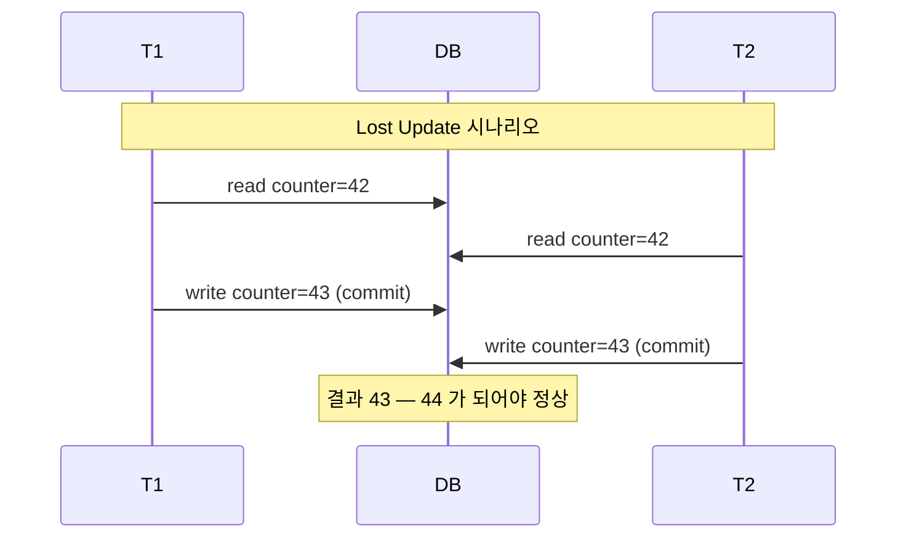
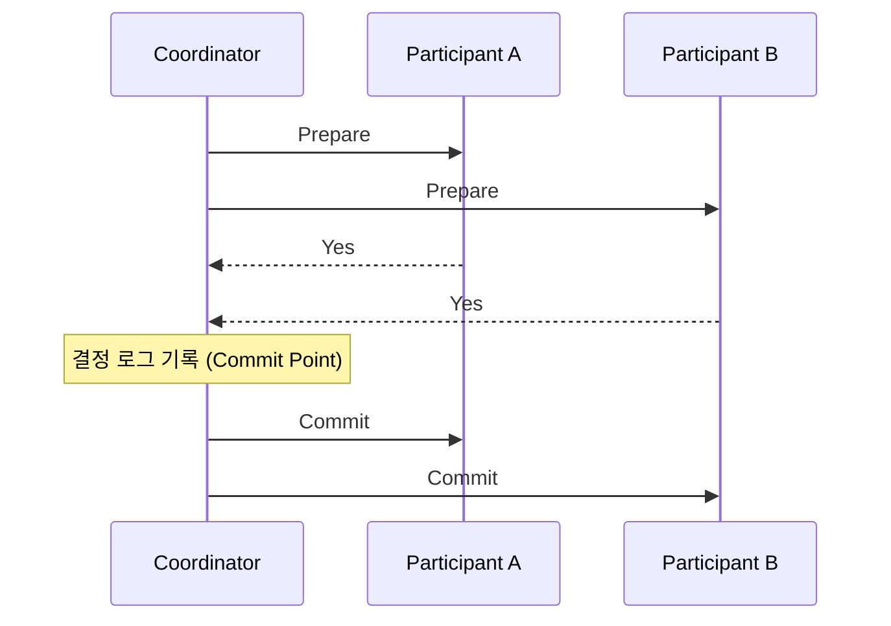

# 트랜잭션과 격리 수준

---

> 트랜잭션은 여러 읽기·쓰기를 하나의 논리적 단위로 묶어 "전체 성공 또는 전체 실패" 를 보장하는 추상이다. 그런데 이 추상이 무엇을 보장하는지·무엇은 보장하지 않는지를 정확히 짚지 않으면 운영 중 lost update, write skew 같은 함정에 발이 묶인다. 본 챕터는 ACID 의 정의를 다시 깎아 보고, PostgreSQL 의 MVCC 가 격리 수준을 어떻게 구현하며, Serializable 의 세 가지 구현이 어떻게 다른지 정리한다.


## 왜 트랜잭션이 필요한가

> 한 작업이 여러 행을 건드릴 때 중간 실패가 발생하면 데이터가 절반만 바뀐 상태로 남는다. 트랜잭션은 이 부분 실패를 막는 추상이다.

은행 송금이 표준 사례다. A 계좌에서 1만 원을 빼고 B 계좌에 1만 원을 더해야 하는데, A 출금 직후 서버가 죽으면 어떻게 되는가. 트랜잭션 없이 두 SQL 을 따로 실행하면 1만 원이 사라진 채 결산이 끝난다. 트랜잭션은 두 변경을 묶어 둘 다 반영되거나 둘 다 취소되도록 보장한다.

```sql
BEGIN;
  UPDATE accounts SET balance = balance - 10000 WHERE id = 'A';
  UPDATE accounts SET balance = balance + 10000 WHERE id = 'B';
COMMIT;
```

`COMMIT` 까지 도달하지 못하고 서버가 죽으면 DB 가 자동으로 `ROLLBACK` 한다. 이 자체는 단순해 보이지만, 동시에 여러 트랜잭션이 같은 행을 만질 때 어떻게 보이게 할 것인가가 격리 수준 문제로 이어진다.


## ACID — 무엇을 보장하고 무엇은 보장하지 않는가

> ACID 는 Atomicity, Consistency, Isolation, Durability 의 머리글자다. 네 글자가 같은 무게로 보이지만 실제로 DB 가 책임지는 범위는 글자마다 다르다.

**Atomicity (원자성)** 는 "All or Nothing" 이다. 트랜잭션 도중 오류가 나면 모든 변경이 롤백된다. 동시성과는 무관하다는 점이 자주 오해되는데, 동시 실행 트랜잭션 간 간섭을 막는 것은 Isolation 이지 Atomicity 가 아니다.

**Consistency (일관성)** 는 함정이 가장 큰 글자다. ACID 의 C 는 "애플리케이션 불변식 유지" 를 뜻하는데, 이 책임은 사실상 애플리케이션 쪽이다. "모든 계좌 합계가 상수여야 한다" 같은 규칙은 DB 가 자동으로 알 수 없다. 외래키·체크 제약조건처럼 DB 가 도와주는 부분은 있지만, 핵심 불변식의 정의와 강제는 SQL 문 자체를 짜는 사람의 몫이다.

| 책임 주체 | 강제 가능한 규칙 | 예 |
|----------|-----------------|-----|
| DB 가 강제 | 스키마 제약 | NOT NULL, FOREIGN KEY, CHECK |
| 애플리케이션이 강제 | 도메인 불변식 | "모든 좌석은 한 사람만 점유" |

또 한 가지, "Consistency" 라는 단어는 컨텍스트마다 다섯 가지 다른 의미로 쓰인다. ACID 의 일관성, 복제본 간 일관성(Eventually Consistent), 일관된 스냅샷, Consistent Hashing, CAP 의 일관성(Linearizability) 이 모두 같은 단어를 쓴다. 면접에서 "Consistency 가 뭔가요" 라고 물으면 어느 컨텍스트인지 먼저 짚는 편이 안전하다.

**Isolation (격리성)** 은 동시 실행 트랜잭션 간 간섭을 막는다. 이상적으로는 모든 트랜잭션이 마치 순차 실행되는 것처럼 보여야 하지만(Serializable), 그러면 처리량이 무너지므로 실제 DB 들은 약한 격리 수준을 함께 제공한다. 본 챕터의 절반은 이 격리 수준 트레이드오프를 다룬다.

**Durability (지속성)** 는 커밋된 데이터가 영구 저장된다는 약속이다. WAL(Write-Ahead Log) + `fsync` + 복제로 구현한다. 다만 "완벽한 지속성" 은 존재하지 않는다. 디스크 자체가 깨지거나 데이터센터가 타면 어떤 단일 서버 보장도 무너지므로, 운영에서는 복제와 백업을 함께 두는 정도가 현실의 답이다.


## PostgreSQL 의 MVCC

> 같은 행을 여러 트랜잭션이 동시에 읽고 쓰는 상황에서 PostgreSQL 은 락이 아니라 버전 관리로 푼다. 이것이 MVCC(다중 버전 동시성 제어) 다.

핵심 약속은 한 줄이다. **Readers never block Writers, Writers never block Readers**. 행을 읽는 트랜잭션과 같은 행을 쓰는 트랜잭션이 만나도 서로 멈추지 않는다. 같은 행을 동시에 *수정* 하는 두 트랜잭션끼리만 블로킹이 일어난다.

구현 측면으로 들어가면, PostgreSQL 은 행을 갱신할 때 기존 행을 덮어쓰지 않고 새 버전을 만든다. 각 행에는 "어떤 트랜잭션이 만들었고 어떤 트랜잭션이 삭제 표시했는가" 를 가리키는 `xmin`·`xmax` 메타데이터가 붙는다. 다른 트랜잭션이 읽을 때는 자기 트랜잭션 ID 와 스냅샷 정보로 "지금 보이는 버전" 을 골라낸다. 그 결과 한 시점의 일관된 스냅샷을 락 없이 만들 수 있다.

대신 비용이 있다. 더 이상 어떤 트랜잭션도 보지 못하는 옛 행 버전들이 디스크에 누적되므로 `VACUUM` 이 주기적으로 청소해 주지 않으면 테이블이 부풀어 오른다. 운영에서는 `autovacuum` 이 자동으로 돌지만, 대량 업데이트 직후에는 수동 `VACUUM ANALYZE` 가 필요한 경우가 있다.

운영에서 흔히 부딪히는 함정 한 가지가 **long-running transaction** 이다. 한 트랜잭션이 한 시간 동안 열려 있으면 그 시점 이후 만들어진 dead tuple 이 회수되지 못한다 — 그 트랜잭션이 옛 버전을 *볼 수도 있으므로* `xmin horizon` 이 막히기 때문이다. 결과적으로 무관한 다른 테이블의 bloat 가 폭주하는 사고가 일어난다. PostgreSQL 운영에서는 `pg_stat_activity` 의 `xact_start` 가 오래된 세션을 정기적으로 점검하고, `pgstattuple` 같은 진단 함수로 dead tuple 비율을 모니터링한다.


## 경쟁 조건 — 어디서 무엇이 깨지는가

> 격리 수준을 이해하려면 먼저 어떤 함정이 있는지 카탈로그를 익혀야 한다. 여섯 가지가 있다.

**Dirty Read** 는 커밋되지 않은 변경을 다른 트랜잭션이 읽는 현상이다. T1 이 `x = 3` 으로 쓰고 아직 커밋 안 했는데 T2 가 그 값을 읽었다면, T1 이 롤백할 경우 T2 는 존재한 적 없는 값을 본 셈이다.

**Dirty Write** 는 커밋되지 않은 변경을 다른 트랜잭션이 덮어쓰는 현상이다. 두 트랜잭션이 같은 행의 다른 컬럼을 동시에 변경하는데, 한쪽이 다른 쪽 미커밋 변경을 덮어쓰면 두 컬럼 사이의 일관성이 깨진다. 가장 약한 격리 수준에서도 Dirty Write 는 보통 막힌다.

**Read Skew (Non-repeatable Read)** 는 한 트랜잭션 안에서 같은 행을 두 번 읽었더니 값이 달라지는 현상이다. 백업·분석 쿼리처럼 긴 읽기 트랜잭션에서 자주 부딪힌다.

**Lost Update** 는 두 트랜잭션이 같은 행을 read-modify-write 패턴으로 갱신할 때, 나중 커밋이 앞 커밋을 덮어써 한 변경이 사라지는 현상이다. 카운터 증가, 재고 차감이 대표 사례다.

**Write Skew** 는 두 트랜잭션이 *같은 조건* 으로 읽고 *서로 다른 행* 을 쓰는데, 두 변경이 합쳐지면 도메인 불변식이 깨지는 현상이다. 흔한 예가 의사 두 명의 동시 퇴근 시나리오다. "최소 한 명은 당직" 이라는 규칙이 있는데, 두 의사가 동시에 "다른 한 명이 남아 있으니 나는 퇴근해도 되겠다" 고 판단하고 각자 자기 행을 업데이트하면 결과적으로 0명이 남는다.

**Phantom** 은 검색 조건에 맞는 새 행이 끼어들면서 발생한다. T1 이 `WHERE room=123 AND time=...` 으로 빈 결과를 받고 예약을 삽입하는 사이, T2 가 같은 조건으로 같은 일을 하면 두 예약이 동시에 들어간다. Write Skew 의 한 변형이다.




## 격리 수준 — 보호 범위와 함정

> SQL 표준은 4단계를 정의한다. 그런데 같은 이름이 DB 마다 다른 의미를 갖는 함정이 있다.

표로 보면 보호 범위가 한눈에 들어온다.

| 격리 수준 | Dirty Read | Read Skew | Phantom | Lost Update | Write Skew |
|-----------|-----------|-----------|---------|-------------|------------|
| Read Uncommitted | 가능 | 가능 | 가능 | 가능 | 가능 |
| Read Committed | 차단 | 가능 | 가능 | 가능 | 가능 |
| Snapshot Isolation | 차단 | 차단 | 차단 | DB 별 | 가능 |
| Serializable | 차단 | 차단 | 차단 | 차단 | 차단 |

Snapshot Isolation 의 Lost Update 칸이 "DB 별" 인 이유는 PostgreSQL·Oracle·SQL Server 가 자동으로 감지해 충돌 시 트랜잭션을 중단시키지만 MySQL InnoDB 는 그렇지 않기 때문이다. 한 코드 베이스를 PostgreSQL 에서 MySQL 로 옮길 때 락 전략이 의도치 않게 깨지는 흔한 함정이다.

이름 함정은 더 심하다. PostgreSQL 의 `REPEATABLE READ` 는 사실 Snapshot Isolation 이고, MySQL InnoDB 의 `REPEATABLE READ` 는 SI 보다 약하다. Oracle 의 `SERIALIZABLE` 은 진짜 직렬화가 아니라 Snapshot Isolation 이다. 면접에서 "MySQL Repeatable Read 는 Phantom 을 막나요" 같은 질문이 나오는 배경이 여기 있다.

| DB | 표시 이름 | 실제 의미 |
|------|----------|----------|
| PostgreSQL | Repeatable Read | Snapshot Isolation |
| MySQL InnoDB | Repeatable Read | 약한 MVCC (gap lock 으로 일부 phantom 차단) |
| Oracle | Serializable | Snapshot Isolation (진짜 직렬화 아님) |
| SQL Server | Snapshot | Snapshot Isolation |

PostgreSQL 의 기본값은 `READ COMMITTED` 다. 운영 코드 대부분이 이 기본값에서 동작한다는 의미고, 따라서 lost update·write skew 는 애플리케이션이 따로 막아 줘야 한다. 무엇을 어떻게 막는지가 다음 절의 주제다.


## Lost Update 방지 패턴

> 같은 행을 두 트랜잭션이 read-modify-write 로 갱신할 때, 한쪽 변경이 사라지는 사고를 막는 네 가지 길이 있다.

첫째는 **원자적 연산** 이다. SQL 한 문장 안에서 read-modify-write 를 끝내면 DB 가 내부적으로 락을 잡아 안전하게 처리한다. 카운터 증가가 대표 예다.

```sql
UPDATE counters SET value = value + 1 WHERE key = 'page_view';
```

이 한 문장이면 lost update 가 원천적으로 발생하지 않는다. 아예 SQL 로 표현 가능한 모든 변경은 이렇게 짜는 편이 안전하다.

둘째는 **명시적 잠금** 이다. `SELECT ... FOR UPDATE` 로 행을 잠근 뒤 비즈니스 로직을 거쳐 갱신한다. 비관 락 패턴이며, ORM 측면 적용은 [`./querydsl/02-05.락과 동시성 제어.md`](./querydsl/02-05.락과%20동시성%20제어.md) 가 자세히 다룬다.

```sql
BEGIN;
SELECT * FROM items WHERE id = 1234 FOR UPDATE;
-- 비즈니스 검증
UPDATE items SET stock = stock - 1 WHERE id = 1234;
COMMIT;
```

셋째는 **자동 감지** 다. PostgreSQL·Oracle·SQL Server 는 SI 격리 수준에서 lost update 를 자동으로 감지해 트랜잭션을 중단시킨다. 호출처는 재시도 정책을 두면 된다. 단, MySQL InnoDB 는 자동 감지가 없다.

넷째는 **Compare-and-Set** 이다. update 의 where 절에 "원래 값" 을 명시해 다른 누군가가 바꿨으면 0 행만 영향을 받게 한다.

```sql
UPDATE wiki SET content = 'new'
WHERE id = 1234 AND content = 'old';
-- affected rows = 0 → 다른 트랜잭션이 먼저 바꿨다는 신호, 재시도
```

이는 사실 JPA 의 `@Version` 이 내부적으로 만들어 내는 SQL 과 정확히 같은 패턴이다. 격리 수준을 올리지 않고도 lost update 를 막을 수 있어 처리량이 좋다.


## Write Skew 방지 패턴

> Write Skew 는 같은 조건을 읽고 서로 다른 행을 쓰기 때문에 SI 의 스냅샷만으로는 막을 수 없다. 세 가지 길이 있다.

첫째는 다시 **`SELECT ... FOR UPDATE`** 다. 의사 당직 시나리오라면 "현재 당직 중인 의사 전부" 를 미리 잠궈서 동시 퇴근 판단을 직렬화한다.

```sql
BEGIN;
SELECT * FROM doctors
  WHERE on_call = true AND shift_id = 1234
  FOR UPDATE;
UPDATE doctors SET on_call = false
  WHERE name = 'Aaliyah' AND shift_id = 1234;
COMMIT;
```

둘째는 **충돌 구체화(Materializing Conflicts)** 다. 잠금 대상이 "아직 존재하지 않는 행" 이라 락을 잡을 수 없는 경우(예: phantom 회의실 예약), 락 대상이 되어 줄 인공 행을 도메인에 추가한다. 회의실 예약 시나리오에서는 "회의실 × 시간 슬롯" 행을 미리 만들어 두고 그 행에 락을 건다. 코드가 이상해지므로 마지막 수단이다.

셋째이자 가장 권장되는 길은 **Serializable 격리 수준** 으로 올리는 것이다. PostgreSQL 의 `SERIALIZABLE` 은 SSI(Serializable Snapshot Isolation) 로 구현되어 있어 처리량이 2PL 보다 훨씬 낫다. 다음 절에서 자세히 본다.


## Serializable 의 세 가지 구현

> SQL 표준의 Serializable 은 결과만 정의하지 구현은 정의하지 않는다. 대표적인 세 가지 길이 있다.

**Actual Serial Execution (VoltDB, Redis)** 는 가장 단순한 길이다. 모든 트랜잭션을 단일 스레드로 순차 실행하면 동시성 문제가 원천 차단된다. 구현이 쉽고 디버그가 쉬운 대신 멀티코어 CPU 를 쓰지 못해 처리량 한계가 분명하다. 인메모리 DB 에 짧은 트랜잭션을 모아 둔 환경에서만 통한다.

**Two-Phase Locking (MySQL, SQL Server)** 은 비관 락 기반이다. 읽기는 공유 락, 쓰기는 배타 락을 잡고 트랜잭션 끝까지 유지한다. 결과는 직렬 실행과 동일하지만 데드락이 자주 발생하고 Writers 가 Readers 를 막아 처리량이 떨어진다.

**Serializable Snapshot Isolation (PostgreSQL, CockroachDB, FoundationDB)** 은 낙관적 동시성 제어다. SI 위에서 트랜잭션이 자유롭게 진행하다가 커밋 시점에 직렬화 충돌이 있었는지 검사한다. 충돌 트랜잭션은 자동 중단되어 호출처가 재시도한다. Readers 가 Writers 를 막지 않아 처리량이 2PL 보다 훨씬 높고, 분산 환경에서도 확장 가능하다.

| 기법 | 처리량 | 지연 시간 | 확장성 | 사용 사례 |
|------|--------|----------|--------|-----------|
| Serial Execution | 낮음 | 낮음 | 샤딩 필요 | VoltDB, Redis |
| 2PL | 중간 | 높음 | 제한적 | MySQL, SQL Server |
| SSI | 높음 | 낮음 | 좋음 | PostgreSQL, CockroachDB |

PostgreSQL 운영 환경이면 `SERIALIZABLE` 은 부담스럽지 않은 옵션이다. 단, 충돌 시 재시도 로직을 호출처에 둬야 하므로 트랜잭션 경계 전체가 idempotent 하게 짜여야 한다.


## 분산 트랜잭션 — 2PC 와 그 한계

> 여러 DB 또는 여러 마이크로서비스에 걸친 트랜잭션을 한 번에 커밋하려는 시도가 2PC(Two-Phase Commit) 다. 이름이 비슷한 2PL 과는 완전히 다른 주제다.

흐름은 두 단계다. Coordinator 가 모든 Participant 에게 "커밋 가능한가" 묻고(Phase 1: Prepare), 모두 "Yes" 를 받으면 결정 로그를 쓴 뒤 "커밋해라" 를 내려보낸다(Phase 2: Commit). 한 명이라도 "No" 면 모두에게 Abort 를 보낸다.



문제는 Phase 1 직후 Coordinator 가 죽을 때다. Participant 들은 "Prepare 까지는 했는데 Commit 인지 Abort 인지 모르는" In-Doubt 상태에 빠진다. 이 동안 락은 풀리지 않으므로 다른 트랜잭션 전체가 줄을 서 대기한다. Coordinator 가 복구되어 결정 로그를 읽거나 관리자가 수동 개입하기 전까지 시스템이 부분 정지한다.

XA 트랜잭션이 운영에서 환영받지 못하는 이유가 여기 모인다. Coordinator 는 Single Point of Failure 가 되고, In-Doubt 동안 락이 유지되어 가용성이 떨어지며, XA 가 시스템 간 공통 분모만 지원하다 보니 각 DB 의 강점을 못 살린다. Orphaned In-Doubt 트랜잭션은 자동 회복도 어렵다.

대안으로 두 갈래가 있다. 단일 DB 내부의 분산 트랜잭션(CockroachDB, TiDB, Spanner) 은 Coordinator 와 Participant 가 같은 시스템 안에 있어 SPOF 문제가 약하다. 마이크로서비스 간 분산 트랜잭션은 Saga 패턴(Choreography 또는 Orchestration) 으로 빠지는 편이 운영 비용이 낮다. Saga 의 이론과 구현은 [`../05_data/`](../05_data/) 와 [`../../04_messaging/`](../../04_messaging/) 가 다룬다.


## 격리 수준 선택 가이드 — 실무

> 워크로드에 맞춰 어느 격리 수준에 어떤 방어 패턴을 결합할지 정리한다.

| 상황 | 권장 격리 수준 | 보강 패턴 |
|------|---------------|----------|
| 일반 OLTP (대부분 케이스) | Read Committed (기본값) | 카운터·재고는 원자적 UPDATE 또는 `@Version` |
| 백업·분석 긴 읽기 | Snapshot Isolation | 별도 보강 없음 |
| 결제·재고 차감 | Read Committed + 비관 락 | `SELECT ... FOR UPDATE`, 짧은 트랜잭션 |
| 의사 당직 같은 Write Skew 도메인 | Serializable (SSI) | 재시도 정책 |
| 회의실 예약 같은 Phantom 도메인 | Serializable 또는 충돌 구체화 | 재시도 정책 |

가장 자주 보는 패턴은 첫 줄과 셋째 줄이다. 일반 조회·수정은 Read Committed 에 `@Version` 을 결합해 lost update 를 막고, 결제·재고처럼 충돌이 잦은 자리만 비관 락을 쓴다. ORM 적용 코드는 [`./querydsl/02-05.락과 동시성 제어.md`](./querydsl/02-05.락과 동시성 제어.md) 의 패턴을 그대로 가져다 쓸 수 있다.


## 면접 대비 체크리스트

> 본 챕터를 읽은 뒤 다음 질문에 답할 수 있어야 한다.

1. ACID 의 C(Consistency) 가 사실은 애플리케이션 책임이라는 주장의 근거를 한 문장으로 댈 수 있는가?
2. PostgreSQL 의 `REPEATABLE READ` 가 왜 진짜 Repeatable Read 가 아니라 Snapshot Isolation 인가? MySQL InnoDB 의 같은 이름과 어떻게 다른가?
3. Lost Update 와 Write Skew 의 차이를 한 시나리오로 설명할 수 있는가?
4. PostgreSQL 의 SI 격리 수준은 Lost Update 를 자동 감지하지만 Write Skew 는 막지 못한다. 그 이유는?
5. Serializable 의 세 가지 구현(Serial Execution, 2PL, SSI) 의 트레이드오프를 비교할 수 있는가?
6. PostgreSQL SSI 가 어떤 시점에 충돌을 감지하는가? 그 결과 호출처는 무엇을 준비해야 하는가?
7. 2PC 의 Coordinator 가 Phase 1 직후 죽으면 무엇이 잠기는가? In-Doubt 트랜잭션을 풀어 주는 두 가지 길은?
8. XA 트랜잭션이 운영에서 환영받지 못하는 네 가지 이유를 들 수 있는가? 마이크로서비스 환경에서의 대안은?

각 질문에 막히면 위 절을 다시 본다.


## 관련 문서

- [`./README.md`](./README.md) — 05_data 진입
- [`./querydsl/02-05.락과 동시성 제어.md`](./querydsl/02-05.락과 동시성 제어.md) — 격리 수준의 ORM 적용, `@Version`·`@Lock`·`setLockMode`
- [`../05_data/README.md`](../05_data/README.md) — 복제·합의·분산 트랜잭션의 상위 이론
- [`../../04_messaging/README.md`](../../04_messaging/README.md) — Saga·Outbox 같은 분산 트랜잭션의 메시징 구현


## 참고 자료

- DDIA Chapter 7 — Transactions (Martin Kleppmann, 2017)
- *A Critique of ANSI SQL Isolation Levels* — Berenson et al., 1995
- *Serializable Snapshot Isolation in PostgreSQL* — Ports & Grittner, 2012
- [PostgreSQL Documentation — Transaction Isolation](https://www.postgresql.org/docs/current/transaction-iso.html)
