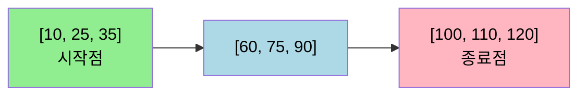
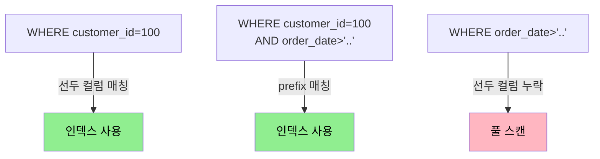

# 인덱스 이론

---

> [`./01-02.저장소와 검색.md`](./01-02.저장소와%20검색.md) 가 인덱스의 *자료구조* (B-Tree·LSM-Tree·Hash·역색인) 를 다뤘다면, 본 챕터는 그 위에서 SQL 사용자가 만나는 *형태* 를 정리한다. 복합 인덱스의 컬럼 순서가 왜 중요한지, 커버링 인덱스가 어떤 비용으로 어떤 이득을 사는지, 부분·표현식 인덱스가 무엇을 푸는지, GIN·GiST·BRIN 같은 특수 인덱스가 어디서 빛나는지를 한 자리에 모은다.


## B-Tree vs B+Tree — 거의 모든 RDBMS 가 B+Tree 인 이유

> 이름은 B-Tree 라고 부르지만, 운영 RDBMS 의 기본 인덱스는 사실 거의 모두 B+Tree 다. 두 변형의 차이가 운영 쿼리 성능을 가른다.

원조 B-Tree 는 모든 노드(루트·내부·리프) 에 키와 값을 함께 저장한다. B+Tree 는 값을 리프 노드에만 두고, 내부 노드는 키 분기 정보만 갖는다. 그리고 리프 노드들이 좌에서 우로 향하는 단방향(또는 양방향) 연결 리스트로 묶여 있다.

이 두 차이가 결정적 이득을 만든다.

1. 내부 노드가 가벼워져 한 페이지에 더 많은 키를 담을 수 있고 branching factor 가 늘어 트리 깊이가 줄어든다.
2. 범위 쿼리가 한 번의 트리 탐색 + 리프 리스트 순회로 끝난다. `WHERE id BETWEEN 100 AND 200` 같은 쿼리에서 시작점만 찾으면 그 다음은 리프 리스트를 따라가면 된다.

PostgreSQL·MySQL·Oracle·SQL Server 모두 이 형태를 쓰는 이유다.



범위 쿼리는 시작점 리프를 트리에서 찾고, 그 다음은 리프 연결 리스트를 따라 종료점까지 순회한다.

본 문서에서는 관례에 따라 두 이름을 혼용하지만, "B-Tree 인덱스" 라고 적힌 자리는 거의 항상 B+Tree 를 가리킨다.


## 복합 인덱스 — 컬럼 순서가 모든 것

> 두 컬럼 이상을 묶은 인덱스는 운영에서 흔히 쓴다. 그런데 컬럼 순서를 잘못 정하면 인덱스가 전혀 안 쓰이는 함정에 자주 빠진다.

복합 인덱스 `(customer_id, order_date)` 가 있다고 하자. 이 인덱스의 키는 두 컬럼의 결합값으로 정렬된다. 마치 사전에서 성으로 먼저 정렬하고 같은 성 안에서 이름으로 정렬하는 것과 같다.



```sql
CREATE INDEX idx_orders ON orders (customer_id, order_date);

-- 인덱스 사용 가능
SELECT * FROM orders WHERE customer_id = 100;
SELECT * FROM orders WHERE customer_id = 100 AND order_date > '2026-01-01';

-- 인덱스 사용 불가 (선두 컬럼 customer_id 가 없음)
SELECT * FROM orders WHERE order_date > '2026-01-01';
```

규칙은 단순하다. **선두 컬럼(leftmost prefix) 부터 차례로** 조건이 있어야 인덱스를 쓴다. `(a, b, c)` 인덱스라면 `a`, `(a, b)`, `(a, b, c)` 형태의 조건은 인덱스를 타지만 `b`, `(b, c)`, `c` 만 있는 조건은 풀 스캔으로 떨어진다.

순서를 정할 때는 두 기준을 본다. 첫째는 **선택도(selectivity)** 로, 카디널리티가 높아 결과를 빨리 좁히는 컬럼을 앞에 둔다. 둘째는 **쿼리 패턴** 인데, 단독으로도 자주 검색되는 컬럼을 앞에 두면 그 인덱스 하나가 두 가지 패턴(단독 + 복합) 을 모두 처리한다. 두 기준이 충돌할 때는 운영 쿼리 빈도를 먼저 따져 결정한다.


## 커버링 인덱스 — Index-Only Scan

> 인덱스만 봐도 쿼리에 답할 수 있으면 테이블 자체를 읽지 않아도 된다. 이를 Index-Only Scan 이라고 부른다.

`(customer_id, order_date, total_amount)` 처럼 결과로 돌려줄 컬럼까지 모두 인덱스에 포함시키면, 테이블 힙 파일 접근이 사라진다.

```sql
CREATE INDEX idx_covering ON orders (customer_id, order_date) INCLUDE (total_amount);

-- 이 쿼리는 인덱스만 스캔해도 답이 나온다
SELECT order_date, total_amount FROM orders WHERE customer_id = 100;
```

PostgreSQL 은 11 부터 `INCLUDE` 절을 지원한다. INCLUDE 컬럼은 정렬이나 검색 조건에는 쓰이지 않고 단순히 페이로드로 따라간다는 점이 다중 컬럼 인덱스와 다르다. 이 구분이 중요한 이유는 `(a, b, INCLUDE c)` 의 인덱스 키는 `(a, b)` 만으로 정렬되어 있어 `c` 로 검색하거나 정렬할 수 없다는 점이다.

PostgreSQL 의 한 가지 함정이 있다. Index-Only Scan 은 visibility map 이 "이 페이지에 한정적으로 모든 튜플이 가시적이다" 라고 답해 줄 때만 동작한다. MVCC 때문에 인덱스 항목이 가리키는 튜플이 현재 트랜잭션에 보이는지 알 수 없어 힙을 한 번 더 봐야 하는 경우가 많기 때문이다(자세한 MVCC 동작은 [`./01-04.트랜잭션과 격리 수준.md`](./01-04.트랜잭션과%20격리%20수준.md) 참고). `VACUUM` 이 visibility map 을 갱신하므로, 자주 갱신되는 테이블에서는 Index-Only Scan 이 의도와 달리 일반 Index Scan 으로 떨어진다.


## 부분 인덱스 — 일부 행만 인덱싱

> 모든 행을 인덱싱할 필요가 없을 때, 조건에 맞는 행만 인덱스에 넣어 크기와 갱신 비용을 줄인다. PostgreSQL 의 가장 강력한 기능 중 하나다.

```sql
-- 활성 사용자만 인덱싱
CREATE INDEX idx_active_users ON users (last_login_at)
WHERE is_active = true;

-- 미완료 주문만 인덱싱
CREATE INDEX idx_pending_orders ON orders (created_at)
WHERE status IN ('PENDING', 'PROCESSING');
```

비활성 사용자 99% 와 활성 사용자 1% 가 섞인 1억 행 테이블이라면, 일반 인덱스는 1억 항목이 들어가지만 부분 인덱스는 100만 항목만 가진다. 인덱스가 100배 작아지니 메모리에 통째로 올라가 검색이 빨라지고, 비활성 사용자 갱신 시 인덱스 갱신 비용도 사라진다.

부분 인덱스를 쓰려면 쿼리의 `WHERE` 조건이 인덱스 정의의 조건을 *포함* 해야 한다. PostgreSQL 옵티마이저가 부분 인덱스를 쓸 수 있다고 판단하려면 쿼리 조건이 인덱스 조건을 만족함을 증명할 수 있어야 한다. 단순히 같은 표현이면 자동으로 매칭되지만, 미묘한 차이(예: `is_active = true` 와 `is_active IS TRUE`) 에서 매칭이 빠지는 경우가 있다.


## 표현식 인덱스 — 함수 적용 결과를 인덱싱

> 컬럼 자체가 아니라 함수의 결과를 인덱싱한다. 함수 호출이 들어간 쿼리의 인덱스 사용 가능 여부가 이 형태로 갈린다.

```sql
-- 인덱스 사용 불가 — 함수가 컬럼을 감싸면 일반 인덱스가 안 통한다
SELECT * FROM users WHERE LOWER(email) = 'alice@example.com';

-- 표현식 인덱스로 해결
CREATE INDEX idx_email_lower ON users (LOWER(email));

-- 이제 위 쿼리가 인덱스를 탄다
```

대소문자 무시 검색, JSON 경로 추출, 날짜 트런케이션 같은 자리에서 흔히 쓴다. 단점은 인덱스 정의에 함수가 박혀 있어 운영 시 함수 변경이 인덱스 재생성으로 이어진다는 점, 그리고 옵티마이저가 표현식 매칭을 잘 못 알아채는 경우가 있다는 점이다. 운영 적용 전 `EXPLAIN ANALYZE` 로 인덱스 사용 여부를 반드시 확인한다.


## 특수 인덱스 — GIN·GiST·BRIN·Hash

> B-Tree 가 못 푸는 워크로드를 위한 PostgreSQL 의 변형들이다. 각자 다른 자료구조 위에서 다른 가정을 한다.

**GIN(Generalized Inverted Index)** 은 역색인의 일반화 형태다. "한 행이 여러 키를 갖는" 워크로드에 적합하다. 배열, JSONB, 전문 검색이 대표 사용처다.

```sql
-- 태그 배열 검색
CREATE INDEX idx_tags ON products USING gin (tags);
SELECT * FROM products WHERE tags @> ARRAY['sale', 'new'];

-- JSONB 경로 검색
CREATE INDEX idx_meta ON events USING gin (metadata);
SELECT * FROM events WHERE metadata @> '{"user": {"role": "admin"}}';

-- 전문 검색
CREATE INDEX idx_fts ON articles USING gin (to_tsvector('english', content));
SELECT * FROM articles WHERE to_tsvector('english', content) @@ to_tsquery('postgresql');
```

GIN 의 단점은 갱신 비용이 크다는 점이다. 한 행 추가 시 그 행이 가진 모든 키마다 인덱스를 갱신해야 한다. 그래서 PostgreSQL 은 GIN 갱신을 모았다가 일괄 처리하는 `fastupdate` 옵션을 기본 켜 둔다.

**GiST(Generalized Search Tree)** 는 트리 구조의 일반화로, 거리·범위 같은 비-동등 비교가 의미 있는 데이터에 쓴다. PostGIS 의 공간 인덱스, `tsrange` 같은 범위 타입 인덱스가 대표 사용처다.

```sql
-- 공간 인덱스 (PostGIS)
CREATE INDEX idx_geom ON locations USING gist (geom);
SELECT * FROM locations
WHERE ST_DWithin(geom, ST_MakePoint(127.0, 37.5)::geography, 1000);

-- 범위 타입 인덱스
CREATE INDEX idx_period ON reservations USING gist (period);
SELECT * FROM reservations WHERE period && '[2026-05-01, 2026-05-08)'::tsrange;
```

GiST 의 인덱스 선택은 GIN 보다 약하지만, 유연성이 높아 사용자 정의 자료형의 인덱스를 만들 때도 쓴다.

**BRIN(Block Range Index)** 은 거대한 테이블이 물리적으로 정렬되어 있을 때 빛난다. 각 페이지 범위(보통 128페이지) 의 최소·최대값만 저장하므로 인덱스 크기가 일반 B-Tree 의 1/100 수준까지 줄어든다.

```sql
-- 시계열 로그 테이블 (created_at 으로 자연 정렬)
CREATE INDEX idx_logs_brin ON logs USING brin (created_at);
SELECT * FROM logs WHERE created_at BETWEEN '2026-05-01' AND '2026-05-02';
```

BRIN 은 정렬되지 않은 테이블에서는 거의 쓸모가 없다. 시계열 로그처럼 INSERT 순서가 곧 정렬 순서인 데이터에서 진가가 나온다. 인덱스가 작아 캐시 효율이 좋고, 갱신 비용도 거의 없다.

**Hash 인덱스** 는 등가 비교(`=`) 만 처리한다. PostgreSQL 10 부터 WAL 지원이 추가되어 안전하게 쓸 수 있게 됐지만, B-Tree 가 등가 검색에서도 충분히 빠르고 범위·정렬까지 지원하므로 대부분 자리에서 B-Tree 가 기본 선택이다. Hash 인덱스가 의미 있는 자리는 키 길이가 수백 바이트 이상인 컬럼(예: URL 전체) 의 등가 검색뿐이다. B-Tree 는 키를 실제 저장하지만 Hash 는 해시값만 저장하기 때문이다.


## 인덱스 선택 가이드

| 워크로드 | 권장 인덱스 |
|---------|------------|
| 범용 OLTP, 등가 + 범위 + 정렬 | B-Tree |
| 일부 행만 자주 검색 | 부분 인덱스 (B-Tree 위) |
| 함수 결과로 검색 | 표현식 인덱스 |
| 결과 컬럼이 인덱스 키와 가까울 때 | 커버링 인덱스 (`INCLUDE`) |
| 배열·JSONB·전문 검색 | GIN |
| 공간·범위 타입 | GiST |
| 거대한 시계열·로그 (자연 정렬) | BRIN |
| 키 길이 수백 바이트 이상 등가 검색 | Hash |


## 인덱스 비용 — 만들기 전에 본다

> "쿼리가 느리니 인덱스를 추가하자" 는 흔한 첫 반응이지만, 인덱스에는 세 가지 비용이 따른다.

첫째는 **쓰기 비용** 이다. INSERT/UPDATE/DELETE 마다 모든 관련 인덱스를 갱신해야 한다. 인덱스 N 개라면 쓰기 비용이 거의 N 배가 된다. 핫 테이블에 인덱스를 5~6 개 이상 두면 쓰기 처리량이 눈에 띄게 떨어진다.

둘째는 **디스크 비용** 이다. B-Tree 인덱스는 보통 테이블 크기의 30~50% 정도를 추가로 쓴다. GIN 인덱스는 키 분포에 따라 테이블 크기를 넘기기도 한다.

셋째는 **유지보수 비용** 이다. PostgreSQL 의 B-Tree 는 시간이 지나면서 단편화되어 인덱스 크기가 부풀어 오른다(bloat). `REINDEX CONCURRENTLY` 또는 `pg_repack` 으로 주기적으로 정리해 주지 않으면 인덱스 효율이 떨어진다.

인덱스를 추가하기 전 두 질문을 먼저 던진다. "이 쿼리가 정말 자주 실행되는가" 와 "이미 있는 인덱스를 활용할 수는 없는가". 운영에서는 `pg_stat_user_indexes` 의 `idx_scan` 값이 0 인 인덱스를 정기적으로 찾아 제거하는 작업이 인덱스 추가만큼이나 중요하다.


## EXPLAIN ANALYZE 로 확인하기

> 인덱스를 만들었다고 해서 옵티마이저가 반드시 쓰는 것은 아니다. 추정 비용에 따라 풀 스캔이 더 빠르다고 판단하면 인덱스를 무시한다. 운영 검증의 표준 도구가 `EXPLAIN ANALYZE` 다.

```sql
EXPLAIN (ANALYZE, BUFFERS) SELECT * FROM orders WHERE customer_id = 100;
```

출력에서 두 가지를 본다. **Plan 노드 종류** 가 `Index Scan` 또는 `Index Only Scan` 인지(아니면 `Seq Scan` 으로 떨어졌는지), 그리고 **Buffers: shared hit/read** 값이다. hit 은 메모리 캐시 적중, read 는 디스크에서 가져온 페이지 수다. read 가 큰 쿼리는 디스크 I/O 가 병목임을 의미하므로 인덱스 추가 또는 `shared_buffers` 조정이 답이 된다.

인덱스가 있는데도 옵티마이저가 안 쓰는 흔한 이유는 통계가 오래됐을 때다. `ANALYZE table_name` 으로 통계를 갱신하면 종종 해결된다. 그래도 안 풀리면 `random_page_cost` 같은 설정값이 운영 환경에 안 맞을 수 있어 DBA 의 점검이 필요하다.


## 인덱스 사용을 막는 흔한 함정

> 의도와 달리 인덱스가 안 먹는 패턴들이다.

함수가 컬럼을 감싸면 일반 인덱스가 안 통한다. `WHERE LOWER(email) = ...` 는 표현식 인덱스가 따로 있어야 한다. 컬럼에 연산이 가해진 경우도 마찬가지다. `WHERE created_at + INTERVAL '1 day' < now()` 는 `WHERE created_at < now() - INTERVAL '1 day'` 로 다시 쓰면 인덱스를 탄다.

`OR` 조건은 옵티마이저가 두 인덱스를 따로 쓰고 결과를 합치는 BitmapOr 로 풀거나, 안 되면 풀 스캔으로 떨어진다. 한 컬럼에 대한 OR 은 `IN` 으로 다시 쓰는 편이 안전하다.

`NULL` 검색은 일반 B-Tree 가 NULL 을 인덱스 끝에 모아 두므로 `WHERE col IS NULL` 도 인덱스를 탈 수 있다. 단 옵티마이저가 NULL 빈도를 낮게 추정하면 풀 스캔으로 갈 수 있어 검증이 필요하다. 정렬과 결합될 때는 NULL 위치가 핵심이다 — PostgreSQL 의 `ORDER BY col DESC` 는 기본 `NULLS FIRST` 라 인덱스가 `(col)` 만 있으면(기본 ASC + NULLS LAST) 정렬 방향이 어긋나 인덱스가 정렬에 안 쓰인다. 정렬용 인덱스는 쿼리의 `ORDER BY` 와 같은 방향(`DESC NULLS FIRST` 등) 으로 만든다.

`LIKE` 의 와일드카드 위치도 영향이 크다. `WHERE name LIKE 'kim%'` 는 인덱스 prefix 매칭으로 해결되지만, `WHERE name LIKE '%kim%'` 은 prefix 가 없어 인덱스를 못 쓴다. 후자가 운영 요구라면 `pg_trgm` 익스텐션 + GIN 인덱스 조합이 표준 답이다.


## 면접 대비 체크리스트

> 본 챕터를 읽은 뒤 다음 질문에 답할 수 있어야 한다.

1. B-Tree 와 B+Tree 의 차이가 운영 쿼리(범위 검색·정렬) 성능에 어떻게 이어지는가?
2. 복합 인덱스 `(a, b, c)` 가 `WHERE b = ?` 단독 조건에 안 쓰이는 이유를 한 문장으로 설명할 수 있는가?
3. 커버링 인덱스의 PostgreSQL 한정 함정(visibility map, MVCC) 은 무엇인가?
4. 부분 인덱스가 90% 가 비활성·10% 가 활성인 1억 행 테이블에서 어떤 비용을 줄이는가?
5. 표현식 인덱스가 필요한 자리(`LOWER(email)`) 와 그 운영 함정은?
6. GIN·GiST·BRIN 의 적합 워크로드를 한 줄씩 댈 수 있는가?
7. 인덱스가 있는데도 옵티마이저가 안 쓰는 흔한 이유 두 가지는?
8. `pg_trgm` + GIN 조합이 어떤 검색 패턴을 푸는가? 왜 일반 B-Tree 가 그 자리에 안 맞는가?
9. 인덱스 추가의 세 가지 비용을 들 수 있는가? 어떤 인덱스를 정기적으로 *제거* 해야 하는가?


## 관련 문서

- [`./README.md`](./README.md) — 05_data 진입
- [`./01-02.저장소와 검색.md`](./01-02.저장소와%20검색.md) — B-Tree·LSM·해시 자료구조 자체
- [`./01-04.트랜잭션과 격리 수준.md`](./01-04.트랜잭션과%20격리%20수준.md) — Index-Only Scan 의 visibility map / MVCC 연결
- [`./postgres/README.md`](./postgres/README.md) — GIN·GiST·BRIN 의 PostgreSQL 운영 측면 (후속 Phase)


## 참고 자료

- [PostgreSQL Documentation — Indexes](https://www.postgresql.org/docs/current/indexes.html)
- [Use The Index, Luke](https://use-the-index-luke.com/) — 실전 인덱스 사용 가이드
- DDIA Chapter 3 — Storage and Retrieval (Martin Kleppmann, 2017)
- *Database Internals* (Alex Petrov, 2019)
