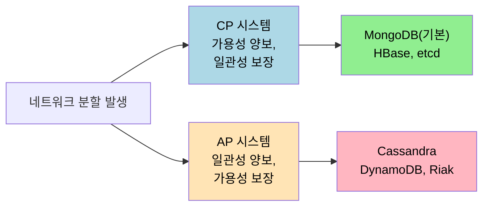
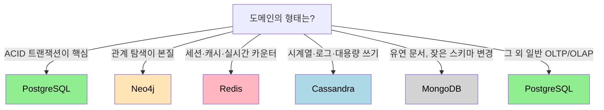

# NoSQL 비교

---

> NoSQL 은 단일 기술이 아니라 "관계형이 아닌" 다양한 시스템의 묶음이다. 문서 DB, 키-값 저장소, 와이드 컬럼, 그래프 DB 가 각자 다른 가정 위에서 다른 트레이드오프를 갖는다. 본 챕터는 [`./01-01.데이터 모델과 쿼리 언어.md`](./01-01.데이터%20모델과%20쿼리%20언어.md) 의 모델 분류를 *제품* 차원에서 비교한다. MongoDB·Redis·Cassandra·Neo4j 가 어디서 빛나고 어디서 한계에 부딪히는지가 본 챕터의 질문이다.


## NoSQL 이 등장한 배경

> 2000 년대 후반 대형 웹 서비스의 운영 요구가 RDBMS 의 가정과 어긋나기 시작했다. 그 어긋남이 NoSQL 의 출현 동기다.

세 가지 압력이 모였다. 첫째는 **수평 확장의 어려움** 이다. RDBMS 는 단일 서버 수직 확장에 최적화되어 있고, 샤딩을 직접 운영하는 비용이 크다. 둘째는 **유연한 스키마 요구** 다. 사용자 입력처럼 형태가 자주 바뀌는 데이터를 매번 마이그레이션으로 처리하는 비용이 높다. 셋째는 **높은 쓰기 처리량** 이다. SNS·게임·IoT 가 초당 수만 건 쓰기를 요구하기 시작했다.

NoSQL 시스템들이 이 압력에 다르게 응답한다. 일부는 데이터 모델을 바꾸고(문서·그래프), 일부는 분산 운영을 첫날부터 가정하며(Cassandra·DynamoDB), 일부는 메모리 위에서 단순함을 끝까지 끌고 간다(Redis·Memcached). 한 가지로 묶기 어려운 다양한 시스템이 모인 이유가 여기 있다.


## CAP 와 BASE — 분산 시스템의 약속

> 분산 시스템은 이상적인 일관성과 가용성을 동시에 못 가진다. 어느 쪽을 양보할지의 결정이 NoSQL 시스템 선택의 핵심이다.

CAP 정리는 분산 시스템이 세 가지 속성 — Consistency, Availability, Partition tolerance — 중 두 가지만 동시에 보장할 수 있다고 말한다. 정확히는 네트워크 분할(P) 이 발생했을 때 일관성(C) 과 가용성(A) 중 하나를 양보해야 한다는 뜻이다. 클라우드 환경에서 P 는 사실상 회피 불가능하므로 실제 선택은 CP 와 AP 사이가 된다.

| 분류 | 양보하는 것 | 보장하는 것 | 대표 시스템 |
|------|------------|------------|------------|
| CP | Availability | Consistency | MongoDB(기본), HBase, etcd |
| AP | Consistency | Availability | Cassandra, DynamoDB, Riak |

CAP 정리는 거친 분류라 운영에서는 더 정밀한 모델(예: PACELC) 을 쓰지만, 첫 결정에는 충분하다. 자세한 분산 합의·일관성 모델은 [`../05_data/`](../05_data/) 가 다룬다.



ACID 의 대척점에 자주 놓이는 BASE 도 같은 맥락이다. **B**asically **A**vailable, **S**oft state, **E**ventually consistent. 모든 노드가 즉시 같은 답을 내는 강한 일관성을 포기하는 대신, 시간이 지나면서 수렴한다는 약속만 한다. 사용자 프로필 사진이 캐시에 잠깐 옛 버전이 보이는 정도는 비즈니스가 수용할 수 있다는 가정 위에서 동작한다.


## Document DB — MongoDB·CouchDB

> JSON 같은 자기 기술 문서를 1급 시민으로 다루는 DB 다. one-to-many 트리 구조와 유연한 스키마가 강점이다.

MongoDB 의 한 문서는 한 사용자에 대한 모든 정보를 한 곳에 담는다.

```json
{
  "_id": "user123",
  "name": "Alice",
  "orders": [
    {"id": "ord001", "items": [{"product": "Laptop", "price": 999}]}
  ]
}
```

문서 모델의 강점은 데이터 지역성이다. 한 사용자의 정보를 한 번의 조회로 가져올 수 있고, JOIN 비슷한 작업이 거의 필요 없다. 단점은 many-to-many 관계가 들어오면 무너진다는 점이다(자세한 모델 차원의 비교는 [`./01-01.데이터 모델과 쿼리 언어.md`](./01-01.데이터%20모델과%20쿼리%20언어.md)).

운영 측면에서 MongoDB 는 다음을 제공한다. 유연한 스키마(문서마다 다른 필드 가능), 중첩 문서와 배열, JSON 기반 쿼리 언어와 Aggregation Pipeline, 필드·복합·전문 검색 인덱스, 4.0 부터의 멀티 문서 트랜잭션. 적합한 자리는 콘텐츠 관리 시스템, 제품 카탈로그, 사용자 프로필처럼 한 객체에 속한 정보 묶음이 핵심인 도메인이다.

CouchDB 는 같은 문서 모델을 HTTP API 와 multi-master 복제 위에 얹는다. 오프라인 우선 모바일 앱처럼 충돌이 잦은 환경을 위해 만들어졌다. AWS DocumentDB 는 MongoDB API 호환 관리형 서비스인데, 내부 엔진은 다르다.


## Key-Value Store — Redis·DynamoDB·Memcached

> 가장 단순한 데이터 모델이다. 키 하나에 값 하나가 매핑되고, GET/SET/DEL 인터페이스만으로 끝난다.

```
Key                   Value
"user:123"     →     {"name": "Alice", "email": "..."}
"session:abc"  →     {"user_id": 123, "expires": 3600}
"counter:views" →    42
```

Redis 가 다른 키-값 저장소와 갈리는 지점은 **값의 종류** 다. 단순 문자열뿐 아니라 List, Hash, Set, Sorted Set, Stream, Bitmap 같은 자료구조를 직접 제공한다. 각 자료구조가 그 자체로 흔한 운영 문제의 답이 된다.

| 타입 | 운영 사용처 |
|------|------------|
| String | 단순 캐싱, 카운터(`INCR`) |
| Hash | 객체 필드 단위 갱신 |
| List | 메시지 큐, 최근 항목 타임라인 |
| Set | 태그, 팔로워 집합, 중복 제거 |
| Sorted Set | 리더보드, 시간 순 인덱스, 우선순위 큐 |
| Stream | append-only 로그, Consumer Group |
| Bitmap | 일별 활성 사용자 같은 비트 단위 집계 |

운영 자리는 세션 저장소, Cache-Aside 캐시(자세한 패턴은 [`./01-07.캐싱 전략.md`](./01-07.캐싱%20전략.md)), 실시간 리더보드, Rate Limiting, Pub/Sub 메시징 등이다. 단점은 메모리 제약과 복잡한 쿼리 지원의 부재다. 모든 데이터를 메모리에 올려야 하므로 GB 수십~수백 단위까지가 실용 한계다.

DynamoDB 는 AWS 가 제공하는 관리형 키-값/문서 하이브리드다. 자동 샤딩과 거의 무한한 처리량 확장을 약속하는 대신 데이터 모델링과 쿼리 패턴에 강한 제약을 둔다(파티션 키와 정렬 키 설계가 운영의 80% 다). Memcached 는 더 단순한 캐시 전용 시스템으로, 자료구조 없이 문자열만 저장한다.


## Wide-Column — Cassandra·HBase·Bigtable

> 행 키 안에 가변적인 컬럼 묶음을 두는 모델이다. 거대한 시계열·로그 데이터의 쓰기 처리량에서 빛난다.

이름이 "와이드 컬럼" 이지만 실제로는 키-값 저장소의 변형에 가깝다. 행 키 안에 여러 컬럼 패밀리가 있고, 각 컬럼 패밀리 안의 컬럼은 행마다 달라도 된다. 같은 행 키에 속한 컬럼들이 디스크에서 인접하게 저장되어 시계열 같은 워크로드의 범위 쿼리가 효율적이다.

Cassandra 는 LSM-tree([`./01-02.저장소와 검색.md`](./01-02.저장소와%20검색.md) 참고) 위에 마스터리스 링 토폴로지를 얹은 시스템이다. 모든 노드가 동등하고 데이터는 일관된 해싱으로 분산된다. AP 시스템의 대표라 가용성을 우선한다. CQL 은 SQL 비슷한 인터페이스지만 JOIN 이 없고 파티션 키 기반 접근만 효율적이다.

```sql
CREATE TABLE user_activity (
    user_id uuid,
    activity_date date,
    activity_type text,
    PRIMARY KEY ((user_id), activity_date, activity_type)
) WITH CLUSTERING ORDER BY (activity_date DESC);
```

`PRIMARY KEY` 가 두 부분으로 갈리는 점이 핵심이다. 첫 괄호 `(user_id)` 가 파티션 키로 데이터 분산을 결정하고, 그 뒤가 클러스터링 키로 같은 파티션 안의 정렬 순서를 결정한다. `WHERE user_id = ?` 같은 파티션 키 기반 쿼리는 한 노드만 보면 끝나지만 파티션 키 없는 쿼리는 전체 클러스터를 훑는 비효율이 발생한다.

운영 자리는 시계열 측정값, IoT 센서 데이터, 로그·이벤트 저장, 거대한 사용자 활동 기록 등이다. 단점은 학습 곡선이다. 데이터 모델을 쿼리 패턴에 맞게 미리 설계해야 하고, 잘못된 파티션 키 선택은 hot partition 으로 이어진다.

HBase 는 같은 모델을 HDFS 위에 얹어 Hadoop 생태계와 통합한다. Bigtable 은 Google 의 관리형 서비스다. 셋 모두 같은 가족이라고 봐도 된다.


## Graph DB — Neo4j·Amazon Neptune

> 관계 자체가 데이터의 본질일 때 쓴다. 정점과 간선 위 가변 길이 패턴 매칭이 빠르다.

Neo4j 의 데이터 모델은 Property Graph 다. 정점과 간선 모두에 라벨과 키-값 속성이 붙는다. Cypher 쿼리가 패턴 매칭으로 답한다.

```cypher
// "내가 산 상품을 산 다른 사람들이 또 산 상품 추천"
MATCH (me:User {name: 'Alice'})-[:PURCHASED]->(p)<-[:PURCHASED]-(other)
      -[:PURCHASED]->(rec)
WHERE NOT (me)-[:PURCHASED]->(rec)
RETURN rec.name, COUNT(*) AS score
ORDER BY score DESC LIMIT 10
```

같은 추천 쿼리를 SQL 로 짜면 self-join 두 번에 NOT EXISTS 까지 따라온다. 그래프 모델의 강점은 이런 가변 깊이 관계 탐색에서 분명해진다. 친구의 친구 N 단계, 최단 경로, 사이클 탐지 같은 알고리즘이 첫 시민이다.

운영 자리는 소셜 네트워크의 친구 관계, 추천 엔진, 사기 탐지(이상 거래 패턴), 지식 그래프, 네트워크 토폴로지 분석 등이다. 단점은 집계 쿼리와 OLTP 트랜잭션이 약하다는 점이다. 한 도메인 안에서도 그래프가 핵심 부분에만 쓰이고 나머지는 RDBMS 가 받치는 구성이 흔하다.

Amazon Neptune 은 Property Graph 와 RDF Triple-Store 를 모두 지원하는 관리형 서비스다. TigerGraph 는 더 큰 그래프와 병렬 분석에 최적화된 변형이다.


## 비교 요약

| 유형 | 데이터 모델 | 강점 | 약점 | 대표 |
|------|------------|------|------|------|
| Document | JSON 문서 | 유연 스키마, 데이터 지역성 | many-to-many 약함, 분산 트랜잭션 제한 | MongoDB |
| Key-Value | 키 → 값 | 빠름, 자료구조 풍부(Redis) | 복잡 쿼리 불가, 메모리 한계 | Redis, DynamoDB |
| Wide-Column | 행 키 + 컬럼 패밀리 | 대용량 쓰기, 시계열 | 학습 곡선, 모델링 난이도 | Cassandra |
| Graph | 정점 + 간선 | 관계 탐색, 가변 깊이 | 집계 약함, OLTP 한계 | Neo4j |


## 선택 가이드

> 도메인의 모양을 한 줄로 요약한 뒤 거기 맞는 모델을 고른다.



이 결정 트리는 거칠지만 첫 선택에는 쓸 만하다. 운영 환경에서 한 시스템만 고집하기보다 polyglot persistence 가 흔하다. 트랜잭션은 PostgreSQL, 캐시는 Redis, 검색은 Elasticsearch, 분석은 ClickHouse 같은 식으로 모델별 강점을 자리에 맞춘다. 단점은 운영 복잡도다. 각 시스템마다 백업·모니터링·HA 가 따로 따라와 인프라 비용이 늘어난다.


## NewSQL — RDBMS 의 분산 진화

> NoSQL 의 수평 확장과 RDBMS 의 ACID 를 동시에 가지려는 시도다.

| 제품 | 호환 SQL | 특징 |
|------|---------|------|
| CockroachDB | PostgreSQL | 지리적 분산, 강한 일관성 |
| TiDB | MySQL | HTAP(OLTP+OLAP), 분산 쿼리 |
| YugabyteDB | PostgreSQL | 다지역 복제, 단일 노드 PostgreSQL 호환 API |
| Google Spanner | 자체 | 전역 일관성, 원자 시계 기반 TrueTime |

Spanner 가 시작점이었다. 원자 시계와 GPS 동기화로 지구 규모의 외부 일관성을 보장하는 시스템이다. CockroachDB·TiDB·YugabyteDB 가 같은 발상을 오픈소스로 구현했다. 운영에서 PostgreSQL 호환 API 를 유지한다는 점이 도입 비용을 크게 낮춘다.

NewSQL 이 모든 자리에서 단일 PostgreSQL 을 대체하지는 못한다. 단일 노드 처리량과 지연 시간은 여전히 단일 PostgreSQL 이 더 좋다. 지리적 분산이나 거대 트랜잭션 처리량이 핵심 요구일 때 NewSQL 이 가치를 가진다.


## 면접 대비 체크리스트

1. NoSQL 등장의 세 가지 운영 압력은 무엇이고, 각 NoSQL 카테고리가 어디에 응답했는가?
2. CAP 정리에서 P 가 사실상 강제되는 이유는? CP 와 AP 사이의 운영 결정 기준은?
3. ACID 와 BASE 의 대비를 한 시나리오로 설명할 수 있는가?
4. Cassandra 의 PRIMARY KEY 가 두 부분으로 나뉘는 이유와 hot partition 의 의미는?
5. Redis 의 자료구조(List·Set·Sorted Set·Stream) 가 각각 어떤 운영 문제의 답인지?
6. MongoDB 의 강점이 발휘되는 도메인과 무너지는 도메인을 구분할 수 있는가?
7. 그래프 DB 가 SQL 의 재귀 CTE 대비 표현력에서 앞서는 자리와 그 한계는?
8. Polyglot persistence 의 가치와 운영 비용을 한 문장씩 댈 수 있는가?
9. NewSQL 이 단일 PostgreSQL 을 대체하지 *않는* 자리는 어디인가?


## 관련 문서

- [`./README.md`](./README.md) — 05_data 진입
- [`./01-01.데이터 모델과 쿼리 언어.md`](./01-01.데이터%20모델과%20쿼리%20언어.md) — 모델 차원의 추상 비교
- [`./01-02.저장소와 검색.md`](./01-02.저장소와%20검색.md) — Cassandra 의 LSM-tree 기반
- [`./01-07.캐싱 전략.md`](./01-07.캐싱%20전략.md) — Redis 를 캐시로 쓰는 패턴
- [`../05_data/README.md`](../05_data/README.md) — CAP·합의·복제의 분산 이론


## 참고 자료

- DDIA Chapter 2·9 (Martin Kleppmann, 2017)
- [MongoDB Documentation](https://docs.mongodb.com/)
- [Redis Documentation](https://redis.io/docs/)
- [Apache Cassandra Documentation](https://cassandra.apache.org/doc/)
- [Neo4j Documentation](https://neo4j.com/docs/)
- *Spanner: Google's Globally-Distributed Database* (Corbett et al., 2012)
