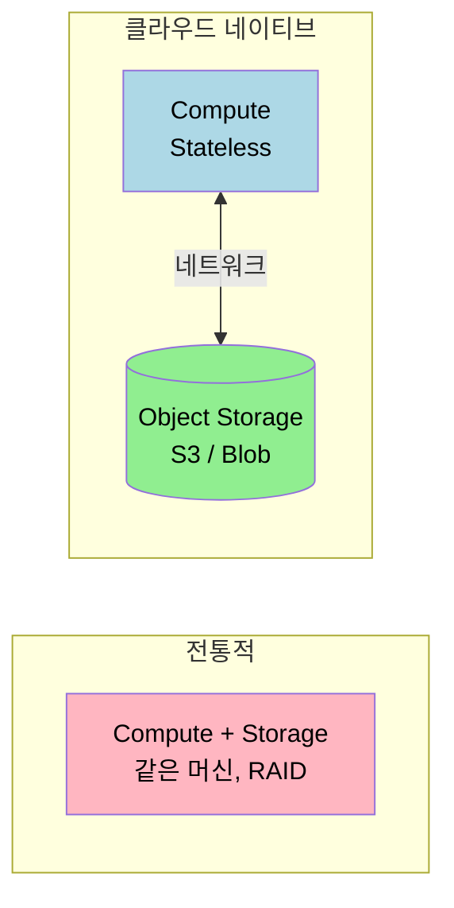

# 시스템 아키텍처 트레이드오프

---

> 데이터 시스템 아키텍처에는 정답이 없다. 모든 선택은 트레이드오프다. 본 챕터는 OLTP 와 OLAP 의 분리, 데이터 웨어하우스와 데이터 레이크, 시스템 오브 레코드와 파생 데이터, 클라우드와 셀프 호스팅, 분산과 단일 노드 사이의 결정 기준을 정리한다.

## 데이터 집약적 애플리케이션이라는 분류

> 컴퓨팅 자체보다 데이터 관리가 주된 도전인 시스템을 데이터 집약적이라고 부른다. 본 카테고리의 모든 챕터가 이 분류 위에서 동작한다.

데이터 집약적 시스템은 다섯 가지 구성 요소가 자주 함께 등장한다. **데이터베이스** 가 진실의 원천을 보관하고, **캐시** 가 비용 큰 연산 결과를 가까이 둔다. **검색 인덱스** 가 키워드 조회를 받쳐 주고, **스트림 처리** 가 이벤트를 실시간으로 다루며, **배치 처리** 가 대량 데이터를 주기적으로 가공한다. 어느 자리에 어느 도구를 둘지가 곧 아키텍처 결정이 된다.

비교 대상은 컴퓨팅 집약적(compute-intensive) 시스템이다. 머신러닝 학습, 시뮬레이션, 영상 인코딩처럼 CPU·GPU 가 병목인 워크로드는 다른 결의 결정(병렬화, 가속기 선택) 이 중심이고 본 카테고리 범위를 벗어난다.

## OLTP 와 OLAP — 분리해야 하는 이유

> 운영(OLTP) 과 분석(OLAP) 은 같은 데이터를 다루지만 읽기·쓰기 패턴이 정반대라 한 시스템에 두면 둘 다 손해를 본다.

| 항목 | OLTP | OLAP |
|------|------|------|
| 읽기 | Point query (키 1건) | 대량 집계 |
| 쓰기 | 개별 CRUD | 벌크 임포트(ETL/Stream) |
| 사용자 | 최종 사용자(웹·앱) | 내부 분석가 |
| 쿼리 | 애플리케이션이 정의한 고정 쿼리 | 임의의 탐색 쿼리 |
| 데이터 표현 | 현재 상태 | 시간에 따른 이벤트 히스토리 |
| 데이터 크기 | GB~TB | TB~PB |

분리가 표준이 된 이유는 네 가지다. 데이터가 여러 운영 시스템에 흩어져 있어 한 자리에 모아야 분석이 가능하고(데이터 사일로), OLTP 정규화 스키마가 분석 쿼리에는 비효율적이며(스키마 불일치), 분석 쿼리가 운영 시스템 자원을 빼앗고(성능 영향), 운영 DB 직접 접근이 보안·컴플라이언스 측면에서 막혀 있기 때문이다(접근 통제).

ETL(Extract → Transform → Load) 은 두 시스템 사이의 표준 다리다. 운영 DB 에서 추출하고, 분석 친화 스키마로 변환한 뒤, 웨어하우스에 적재한다. 변환을 웨어하우스 안으로 미루는 ELT 가 클라우드 시대에 더 흔해졌는데, 컴퓨트 비용이 싸진 결과다.

## 데이터 웨어하우스와 데이터 레이크

> 둘 다 분석을 위한 저장소지만 가정이 다르다.

웨어하우스는 관계형 모델을 강제한다. 분석가들이 SQL 로 묻고, BI 도구와 통합되며, Star Schema([`../05_data/01-01.데이터 모델과 쿼리 언어.md`](../05_data/01-01.데이터%20모델과%20쿼리%20언어.md)) 같은 정형 스키마 위에서 동작한다.

레이크는 파일 자체를 저장한다. Parquet·JSON·이미지·센서 로그 같은 비정형 데이터가 그대로 들어가고, 스키마는 읽는 쪽이 정한다(schema-on-read). Spark·Python·R 로 자유롭게 다룰 수 있어 데이터 사이언스 워크로드에 맞다. "Sushi Principle — Raw is better" 라는 표현이 이 발상을 요약한다.

| 항목 | 데이터 웨어하우스 | 데이터 레이크 |
|------|----------------|-------------|
| 데이터 모델 | 관계형(SQL 강제) | 파일(스키마 미강제) |
| 사용자 | 분석가, BI 도구 | 데이터 사이언스, ML |
| 비용 | 높음 | 오브젝트 스토리지로 저렴 |
| 데이터 형태 | 정형 | 정형 + 비정형 |

운영에서는 둘 다 두는 lakehouse 구성이 흔하다. 원본은 레이크에 그대로 두고, 분석 친화 변환본을 웨어하우스에 보관한다. Snowflake·Databricks·BigQuery 가 이 구성을 한 제품 안에서 제공한다.

HTAP(Hybrid Transactional/Analytic Processing) 은 OLTP 와 OLAP 를 한 시스템 안에서 모두 다루려는 시도다. 사기 탐지처럼 개별 트랜잭션 처리와 대량 패턴 스캔이 한 자리에 필요한 워크로드에 어울린다. 다만 내부 구조는 여전히 두 엔진이 공존하는 형태가 많아 진정한 통합은 쉽지 않다.

## 시스템 오브 레코드 vs 파생 데이터

> 어느 데이터가 진실의 원천이고 어느 것이 그 가공물인지를 명시적으로 구분하면 운영 사고가 줄어든다.

| 구분 | System of Record | Derived Data |
|------|------------------|--------------|
| 역할 | 정보의 권위 있는 원본 | 변환·가공 결과 |
| 중복성 | 정규화 (중복 없음) | 의도적 중복 |
| 손실 시 | 복구 불가 | 원본에서 재생성 |
| 예시 | Primary DB | 캐시·인덱스·뷰·ML 모델 |

이 구분이 운영에 가져오는 가치는 크다. 캐시·인덱스가 깨졌을 때 진실의 원천에서 다시 만들면 되니 두려움이 줄어든다. ML 모델 재학습, Materialized View 재생성, 검색 인덱스 재구축 모두 같은 발상 위에서 동작한다. Event Sourcing([`../05_data/01-01.데이터 모델과 쿼리 언어.md`](../05_data/01-01.데이터%20모델과%20쿼리%20언어.md) 의 해당 절) 이 이 패턴을 가장 명시적으로 끌고 가는 사례다.

## 클라우드 vs 셀프 호스팅

> 같은 시스템도 어디서 운영하느냐에 따라 비용·통제·민첩성이 갈린다.

배포 스펙트럼은 네 단계다. 자체 개발 + 자체 운영(Bespoke), 오픈소스/상용 + 자체 운영(셀프 호스팅), 클라우드 VM + 자체 운영(IaaS), 벤더 운영(SaaS). 왼쪽으로 갈수록 통제력이 크고 투자도 크다.

클라우드의 장점은 분명하다. 시스템 관리 경험 없이도 빠르게 시작할 수 있고, 부하 변동이 클 때 탄력적으로 확장한다. 운영 전문성의 규모의 경제로 단일 회사가 직접 관리하는 비용보다 싸진다.

단점도 분명하다. 필요한 기능이 빠져 있으면 직접 추가할 수 없고, 서비스 장애가 나도 대기만 가능하다. 성능 문제 디버깅이 어려운데 내부 메트릭에 접근이 안 되기 때문이다. 가장 큰 함정은 벤더 락인이다. 서비스 종료나 가격 인상 시 마이그레이션 비용이 운영 결정을 묶어 버린다. 보안·규제 측면도 복잡해지는데, 데이터 거주지 요구가 있는 산업에서는 SaaS 채택 자체가 막히기도 한다.

선택 기준은 단순하다. 부하 변동이 크고 운영 인력이 부족하면 클라우드가 안전하다. 부하가 예측 가능하고 데이터 통제가 핵심 요구라면 셀프 호스팅이 비용 면에서도 유리할 수 있다.

## 클라우드 네이티브 — 스토리지와 컴퓨트의 분리

> 클라우드 시대의 핵심 아키텍처 변화는 스토리지와 컴퓨트의 분리(disaggregation) 다.

전통적 아키텍처는 같은 머신에서 CPU 와 디스크를 함께 쓴다. 디스크 장애에 RAID 로 대응하고 머신 단위가 운영 경계가 된다. 클라우드 네이티브는 로컬 디스크를 임시 캐시로만 다루고 영구 데이터는 오브젝트 스토리지(S3·GCS·Azure Blob) 에 둔다. 컴퓨트 노드는 stateless 라 자유롭게 띄우고 죽일 수 있다.

이 분리의 가치는 두 가지다. 컴퓨트 부하와 데이터 양이 독립적으로 확장된다. 이전에는 데이터가 늘면 더 큰 머신이 필요했지만, 이제는 오브젝트 스토리지를 늘리고 컴퓨트는 워크로드에 맞게 따로 조절한다. 또 멀티테넌트가 자연스럽다. 한 하드웨어 풀이 여러 고객의 데이터를 다루므로 자원 활용률이 높다.

Snowflake·BigQuery·Aurora·Spanner 모두 이 패턴 위에 서 있다. ClickHouse 같은 셀프 호스팅 OLAP 시스템도 비슷한 분리 구조를 채택해 가는 중이다.

## 분산 시스템이 정말 필요한가

> 분산은 비용이 큰 결정이다. 단일 노드로 가능하면 단일 노드가 답이다.

분산이 정당화되는 사례는 여덟 가지 정도다. 본질적으로 분산된 워크로드(여러 사용자 간 상호작용), 클라우드 서비스 간 호출, 장애 내성(고가용성), 단일 머신 용량 초과, 지연 시간(전 세계 사용자에게 가까운 서버 제공), 탄력성(부하에 맞춘 자원 조절), 전문 하드웨어(GPU·RDMA), 법적 데이터 거주지 요구.

이 중 어느 하나가 *진짜로* 운영 요구라면 분산이 답이다. 그렇지 않다면 단일 노드의 단순함이 거의 항상 이긴다. CPU·메모리·디스크가 계속 성장한다. 단일 머신에 1TB RAM 과 32 코어가 흔한 시대고, DuckDB·SQLite 같은 단일 노드 분석 DB 가 수십 GB 데이터셋을 거뜬히 다룬다. "Big Data Is Dead"(Jordan Tigani, 2023) 같은 글이 같은 결론을 다른 각도에서 말한다.

분산이 들어왔을 때 따라오는 비용은 분명하다. 모든 요청이 타임아웃 가능성을 갖고, 네트워크 호출 지연이 로컬 함수 호출보다 자릿수 단위로 크며, 디버깅이 어려워(observability 도구 비용), 서비스 간 일관성 보장이 새 문제(자세한 일관성 모델은 [`./02-06.일관성과 합의.md`](./02-06.일관성과%20합의.md)) 다. 여기에 분산 시스템 특유의 부분 실패와 비동기 네트워크 문제(자세한 카탈로그는 [`./02-05.분산 시스템의 문제점.md`](./02-05.분산%20시스템의%20문제점.md)) 가 모두 따라온다.

## 마이크로서비스와 서버리스

> 분산을 받아들였을 때 안에서 어떻게 자를지의 결정이다.

마이크로서비스의 가치는 기술이 아니라 조직에 있다. 서비스별 독립 배포, 서비스별 자원 할당, API 뒤에 구현 세부를 숨겨 변경 가능, 서비스별 독립 DB 로 스키마 변경 자유. 모두 팀 간 독립성을 위한 도구다.

비용도 분명하다. 서비스마다 배포·모니터링·로깅 인프라가 따로 필요하고, 개발 시 의존 서비스도 함께 띄워야 하며, API 진화가 어려워진다. 클라이언트와의 호환성을 깨지 않으면서 변경하는 작업이 늘 PR 의 부담이 된다.

핵심 발상은 마이크로서비스가 **조직 문제의 해결책** 이라는 점이다. 100 명 팀에서 50 개 마이크로서비스가 의미가 있을 수 있지만 5 명 팀에서 같은 구조를 짜면 운영 부담이 가치를 압도한다. "조직 구조를 따라가는 시스템 구조" 라는 콘웨이의 법칙이 이 자리에서 동작한다.

서버리스(FaaS) 는 다른 결의 답이다. 인스턴스 시작·종료를 클라우드에 위임하고 실행 시간만큼만 과금한다. cold start 와 실행 시간 제약이 따라오므로 모든 워크로드에 맞지는 않지만, 트래픽이 급변하거나 idle 시간이 긴 워크로드에서 비용이 압도적이다. VM 이 월세 아파트라면 서버리스는 호텔 같은 모델이다.

## 데이터 시스템과 법률·사회

> 시스템 설계가 사용자의 권리·프라이버시와 직접 닿는 시대다.

GDPR·CCPA·EU AI Act 같은 규제는 "어떤 데이터를·왜·얼마나 오래 저장할지" 를 묻는다. 이전의 빅데이터 철학("미래에 유용할 수 있으니 모두 저장하자") 과 정면충돌한다. Datensparsamkeit(데이터 최소화) 가 새 표준 발상이다. 명시된 목적으로만 수집하고 필요 이상 보관하지 않는다.

데이터 저장의 진짜 비용은 S3 요금만이 아니다. 유출 시 책임과 평판 손상, 법적 비용과 벌금, 정부·경찰의 데이터 제출 요청 가능성까지 포함된다. 데이터는 자산이자 부채라는 인식이 운영의 첫날부터 들어가야 한다.

기술적 함의도 분명하다. Event Sourcing 의 불변 로그가 GDPR 의 "잊혀질 권리" 와 충돌한다(자세한 측면은 [`../05_data/01-01.데이터 모델과 쿼리 언어.md`](../05_data/01-01.데이터%20모델과%20쿼리%20언어.md)). 데이터 거주지 요구는 다지역 복제 토폴로지를 강제한다([`./02-03.복제.md`](./02-03.복제.md) 가 다룸). 각 규제가 시스템 설계의 변수로 직접 들어온다.

## 면접 대비 체크리스트

1. OLTP 와 OLAP 의 읽기·쓰기 패턴 차이가 한 시스템 안에 함께 두면 어떤 문제를 일으키는가?
2. 데이터 웨어하우스와 데이터 레이크의 차이는? 어느 자리에 어느 쪽이 맞는가?
3. 시스템 오브 레코드와 파생 데이터의 구분이 운영에 어떤 가치를 주는가? 캐시·검색 인덱스·ML 모델이 어느 쪽인가?
4. 클라우드 서비스의 단점 다섯 가지를 들 수 있는가? 벤더 락인을 어떻게 평가하는가?
5. 클라우드 네이티브의 스토리지·컴퓨트 분리가 가져오는 두 가지 이득은?
6. 분산 시스템이 정당화되는 8 가지 상황 중 자기 시스템에 해당하는 것이 몇 개인가? 단일 노드로도 가능한 자리는?
7. 마이크로서비스가 기술 문제가 아니라 조직 문제의 해결책이라는 주장의 의미는?
8. GDPR 의 데이터 최소화 원칙이 빅데이터 철학과 어디서 충돌하는가?

## 관련 문서

- [`./README.md`](./README.md) — 05_data 진입
- [`./02-02.시스템 아키텍처 트레이드오프 부록.md`](./02-02.시스템%20아키텍처%20트레이드오프%20부록.md) — 비기능 요구사항(성능·신뢰성·확장성·유지보수성)
- [`../05_data/01-01.데이터 모델과 쿼리 언어.md`](../05_data/01-01.데이터%20모델과%20쿼리%20언어.md) — Event Sourcing, Schema-on-Read
- [`./02-03.복제.md`](./02-03.복제.md) — 다지역 배포의 복제 측면
