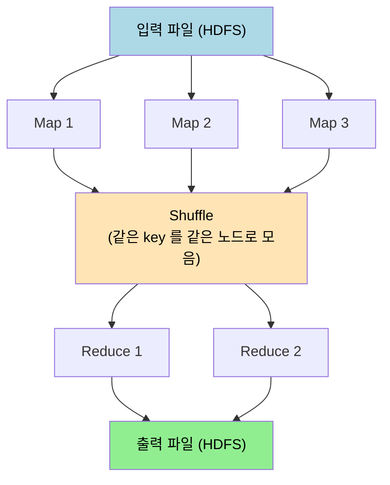

# 배치 처리

---

> 배치 처리는 유한한 입력을 받아 새 출력을 만드는 오프라인 처리다. 입력을 불변으로 다루고 부작용을 피하므로 버그가 났을 때 코드를 고쳐 다시 돌리면 정상 출력이 나온다. 이 **Human Fault Tolerance** 가 배치의 가장 큰 가치다. 본 챕터는 Unix 도구 → 분산 파일시스템 → MapReduce → Dataflow 엔진 으로 이어지는 진화와, Shuffle·분산 JOIN 같은 핵심 메커니즘을 정리한다.


## 데이터 처리 시스템의 세 갈래

> 같은 데이터를 어떻게 다루느냐에 따라 시스템 종류가 갈린다.

| 종류 | 입력 | 출력 시점 | 응답 시간 | 예시 |
|------|------|----------|----------|------|
| Online (Service) | 사용자 요청 | 요청 즉시 | ms 단위 | REST API, DB 쿼리 |
| Batch | 유한한 큰 데이터 | 작업 완료 후 | 분~시간 단위 | MapReduce, Spark 잡 |
| Stream | 무한한 이벤트 흐름 | 처리 직후 | 초 단위 | Kafka Streams, Flink |

배치는 응답 시간보다 *처리량* 과 *정확성* 이 핵심이다. 잡이 5 시간 걸려도 결과가 정확하면 그게 답이다. 그 대가로 사용자 응답에는 안 맞고, 분석·ETL·ML 학습 같은 자리에 어울린다.

배치의 본질적 가치 한 가지가 **불변 입력** 이다. 입력 파일이 바뀌지 않으니 같은 코드로 같은 결과가 나오고, 결과가 잘못되면 입력은 그대로 둔 채 코드만 고쳐 다시 돌린다. 이 재실행 가능성이 운영 사고를 자연스럽게 받쳐 준다.


## Unix 도구 — 배치의 원형

> Unix 파이프가 배치 처리의 작은 원형이다. `sort | uniq -c | sort -rn` 같은 한 줄이 분산 배치의 발상을 그대로 담고 있다.

```bash
# 웹 로그에서 가장 많이 본 페이지 Top 10
cat access.log |
  awk '{print $7}' |     # URL 컬럼 추출
  sort |                  # 같은 URL 인접하게
  uniq -c |               # 횟수 세기
  sort -rn |              # 횟수로 역정렬
  head -n 10
```

세 가지 발상이 들어가 있다. **각 단계가 독립** — 한 단계가 끝나야 다음이 시작하지만 단계 자체는 작은 책임만 진다. **Pipe 가 stdin/stdout 으로 연결** — 단계 사이의 인터페이스가 단순한 텍스트 스트림이라 어떤 도구든 끼울 수 있다. **Sort 가 핵심 빌딩 블록** — 같은 키를 인접하게 모아 다음 단계의 작업을 단순하게 만든다.

이 발상이 분산 환경으로 그대로 옮겨 가면 MapReduce 가 된다. Map 이 입력을 키-값으로 변환하고, Sort + Shuffle 이 같은 키를 모으며, Reduce 가 같은 키 묶음을 처리한다.


## 분산 파일시스템 — HDFS 와 오브젝트 스토리지

> 배치가 분산되려면 입력·출력 데이터가 분산 저장소에 있어야 한다.

HDFS(Hadoop Distributed File System) 가 시작이었다. 발상은 단순하다. 큰 파일을 64MB~256MB 블록으로 쪼개 여러 노드에 분산 저장하고, 각 블록을 3 개 복제본으로 둔다. NameNode 가 메타데이터(어느 블록이 어느 노드에 있는지) 를 관리하고, DataNode 들이 실제 블록을 보관한다.

데이터 지역성(data locality) 이 핵심 최적화다. 잡이 데이터를 *가져오는* 게 아니라 데이터가 있는 노드로 *작업을 보낸다*. 네트워크가 디스크보다 한참 비싸던 시절의 답이다.

오브젝트 스토리지(S3·GCS·Azure Blob) 가 클라우드 시대의 대안이다. 디스크와 컴퓨트가 분리되므로 데이터 지역성은 사라지지만, 스토리지가 거의 무한히 싸지고 컴퓨트를 워크로드에 맞춰 자유롭게 띄울 수 있다([`../../05_data/02-01.시스템 아키텍처 트레이드오프.md`](../../05_data/02-01.시스템%20아키텍처%20트레이드오프.md) 의 클라우드 네이티브 절 참고). 네트워크가 빨라진 시대의 답이다.

운영 시스템 대부분이 이제 오브젝트 스토리지 위에서 동작한다. EMR·Databricks·Snowflake·BigQuery 모두 같은 구조다. HDFS 는 온프레미스에 남아 있는 운영 자리가 줄어드는 추세다.


## MapReduce — 분산 배치의 첫 답

> Google 이 2004 년에 발표한 모델이다. 큰 데이터를 두 단계(Map → Reduce) 로 나눠 처리하는 단순한 계산 모델이 분산을 가능하게 했다.



**Map 단계** 는 입력의 한 줄(또는 레코드) 을 받아 0 개 이상의 (key, value) 쌍을 출력한다. 워드 카운트라면 한 줄을 단어로 쪼개고 각 단어에 대해 (word, 1) 을 내보낸다.

**Shuffle 단계** 는 모든 Map 출력을 모아 같은 키를 같은 Reducer 로 보낸다. 네트워크 트래픽이 압도적이고 디스크 I/O 도 크다. 이 단계가 MapReduce 잡의 가장 큰 비용이다.

**Reduce 단계** 는 같은 키의 모든 값을 받아 하나의 출력을 만든다. 워드 카운트면 (word, [1, 1, 1, ...]) 을 받아 (word, 합계) 를 내보낸다.

MapReduce 의 가치는 **장애 허용** 이다. 한 Map 또는 Reduce 작업이 실패하면 그 작업만 다시 돌리면 된다. 입력이 불변이고 모든 중간 결과가 디스크에 기록되므로 부분 재실행이 안전하다. 수천 노드 클러스터에서 일부가 죽어도 잡이 끝까지 돌아간다.

단점도 분명하다. 모든 중간 결과를 디스크로 내려 *Shuffle 비용이 압도적* 이다. 여러 단계로 짠 잡(예: Map → Reduce → Map → Reduce → ...) 은 매 단계마다 디스크에 쓰고 다시 읽는다. 같은 데이터가 디스크와 네트워크를 여러 번 오간다.


## Dataflow 엔진 — Spark 와 Flink

> MapReduce 의 디스크 부담을 메모리로 줄이는 후속 모델이다. 같은 분산 처리 모델 위에 *연산자 그래프* 를 구성한다.

Spark·Flink·Tez 같은 엔진은 잡을 DAG(Directed Acyclic Graph) 로 표현한다. 각 노드는 연산(Map·Filter·Join·GroupBy·...) 이고, 엣지는 데이터 흐름이다. 연속된 좁은 변환(narrow transformation — Map·Filter) 은 메모리에서 합쳐 한 번에 처리하고, 셔플이 필요한 넓은 변환(wide transformation — GroupBy·Join) 만 디스크/네트워크를 거친다.


이 모델의 가치는 **반복 워크로드** 에서 분명하다. 머신러닝 학습 같은 자리에서 같은 데이터를 100 번 반복 처리하는데, MapReduce 라면 매 반복마다 디스크 왕복이 일어나지만 Spark 는 메모리에 캐시한 상태로 반복한다. 처리 시간이 한 자릿수 단축된다.

Flink 는 한 발 더 나간다. 같은 엔진이 배치와 스트림을 모두 처리한다. 발상은 *배치도 결국 끝이 정해진 스트림이다* 라는 것이다. 같은 연산자가 두 모드에서 동작하므로 코드 재사용성이 좋다([`./02-03.스트리밍 시스템 철학.md`](./02-03.스트리밍%20시스템%20철학.md) 참고).


## Shuffle 알고리즘과 분산 JOIN

> Shuffle 이 배치의 가장 큰 비용이라 이 자리의 알고리즘 선택이 잡 시간을 가른다.

**Sort-Merge Join** — 양쪽 데이터셋을 같은 키로 정렬한 뒤 병합한다. 메모리 부족 환경에서 확실히 동작하지만 정렬 비용이 크다.

**Hash Join** — 작은 쪽 데이터셋을 해시 테이블로 메모리에 올리고 큰 쪽을 스캔하면서 매칭한다. 메모리에 들어갈 만큼 작은 쪽이 있을 때 빠르다.

**Broadcast Hash Join** — 작은 데이터셋을 모든 노드에 복제(broadcast) 해 두고 큰 데이터셋은 분산된 채 스캔한다. 한쪽이 GB 미만으로 작을 때 압도적 빠르다. Spark 의 자동 최적화 대상이다.

**Skewed Join** — 키 분포가 한쪽으로 치우칠 때(예: NULL 값이 90%) 그 키만 별도 처리한다. 같은 데이터 스큐가 분산 환경의 성능을 가장 자주 깨는 자리다.

GROUP BY 의 분산 처리도 비슷하다. 같은 키의 값을 같은 Reducer 로 모으는 것이 핵심이고, **combiner** (Reducer 이전에 Map 출력에서 부분 집계) 를 통해 셔플 양을 줄이는 최적화가 흔히 들어간다.


## 작업 오케스트레이션 — YARN·Kubernetes

> 분산 배치는 누가 어느 노드에서 돌지를 결정하는 스케줄러가 필요하다.

YARN(Hadoop 의 Yet Another Resource Negotiator) 이 시작이었다. 클러스터의 자원(CPU·메모리) 을 추적하고 잡 요청에 맞춰 컨테이너를 할당한다. Hadoop 생태계 안에서 표준이었다.

Kubernetes 가 클라우드 시대의 답이다. YARN 보다 일반적이라 배치뿐 아니라 서비스·머신러닝 학습·CI/CD 까지 같은 클러스터에서 돌린다. 운영 환경 대부분이 YARN 에서 Kubernetes 로 옮겨 가는 추세다.

**Cluster Autoscaler** 가 클라우드 환경에서 자연스럽게 따라온다. 잡이 들어오면 워커 노드를 자동으로 추가하고, 잡이 끝나면 제거한다. EMR·Dataproc 같은 관리형 서비스가 이 동작을 한 단계 더 자동화한다.


## 장애 처리 — 결정론과 멱등성

> 분산 배치의 신뢰성이 두 발상 위에 서 있다.

**결정론(determinism)** — 같은 입력에 같은 출력. 작업이 죽어 다시 돌아도 결과가 같아야 한다. 그래서 배치 코드 안에서는 시계·랜덤·환경 변수 같은 비결정 함수를 피한다. 시계가 필요하면 잡 시작 시점을 입력 파라미터로 받는다.

**멱등성(idempotency)** — 같은 작업을 여러 번 실행해도 결과가 한 번 실행한 것과 같다. 출력 파일이 부분적으로 쓰이다 죽었어도 다시 돌렸을 때 같은 출력이 나와야 한다. 보통 임시 디렉토리에 쓰고 마지막에 원자적으로 이름을 바꾸는 패턴으로 구현한다(speculative execution 의 이중 실행을 받아 주는 형태).

이 두 발상이 합쳐지면 **재실행 가능한 배치** 가 된다. 실패한 작업·잘못된 코드·부분 손상 모두 같은 답으로 받는다 — 입력은 그대로 두고 잡을 다시 돌린다.


## 활용 사례 — ETL·분석·ML 학습

> 배치가 자연스럽게 어울리는 자리들이다.

**ETL (Extract-Transform-Load)** — 운영 DB 에서 데이터를 뽑아 분석 친화 형태로 변환해 웨어하우스에 적재한다([`../../05_data/02-01.시스템 아키텍처 트레이드오프.md`](../../05_data/02-01.시스템%20아키텍처%20트레이드오프.md) 참고). 매일 새벽에 도는 야간 잡이 표준 패턴이다.

**Analytics 집계** — 일별·월별 매출, 사용자 활동 통계, 코호트 분석. SQL 로 표현 가능한 자리는 거의 모두 배치로 끝난다.

**ML 학습** — 모델 학습이 본질적으로 배치다. 큰 데이터셋을 여러 epoch 반복하며 가중치를 갱신한다. Spark MLlib·TensorFlow 의 분산 학습이 이 자리에 있다.

**검색 인덱스 빌드** — 전체 문서 코퍼스를 한꺼번에 색인한다. Elasticsearch 의 reindexing 같은 자리.

스트림 처리가 등장하면서 일부 자리(실시간 대시보드·이상 탐지) 가 스트림으로 옮겨갔지만, 큰 데이터의 정확한 일괄 가공은 여전히 배치가 표준이다.


## 면접 대비 체크리스트

1. Online·Batch·Stream 처리의 차이가 무엇이고, 배치가 어울리는 자리는?
2. Unix 파이프와 MapReduce 가 공유하는 세 가지 발상은? Sort 가 왜 핵심 빌딩 블록인가?
3. HDFS 의 데이터 지역성 가정이 클라우드 환경에서 왜 의미가 줄어들었는가?
4. MapReduce 의 Shuffle 비용이 압도적인 이유는? Dataflow 엔진(Spark·Flink) 이 그 비용을 어떻게 줄이는가?
5. 배치 환경의 분산 JOIN 네 가지(Sort-Merge·Hash·Broadcast·Skewed) 가 각각 어디에 어울리는가?
6. 작업 오케스트레이션이 YARN 에서 Kubernetes 로 옮겨가는 운영 동기는?
7. 결정론과 멱등성이 배치의 재실행 가능성에 어떻게 기여하는가?
8. 같은 ETL 워크로드를 배치로 짤지 스트림으로 짤지 어떤 기준으로 결정하는가?


## 관련 문서

- [`./README.md`](./README.md) — 05_data 진입
- [`./02-02.스트림 처리.md`](./02-02.스트림%20처리.md) — 무한 이벤트 흐름의 처리
- [`./02-03.스트리밍 시스템 철학.md`](./02-03.스트리밍%20시스템%20철학.md) — 배치·스트림 통합 관점
- [`./01-02.저장소와 검색.md`](./01-02.저장소와%20검색.md) — 컬럼 저장소가 배치 분석을 어떻게 받쳐 주는가
- [`../../05_data/02-04.샤딩.md`](../../05_data/02-04.샤딩.md) — 분산 데이터 분할
