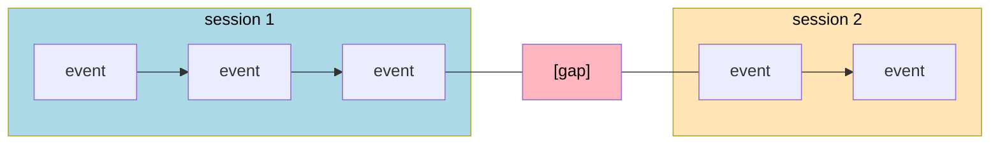

# 스트림 처리

---

> 스트림 처리는 무한히 흘러오는 이벤트를 연속적으로 다룬다. 배치가 *유한한* 입력을 가정한다면 스트림은 입력의 끝이 없다는 가정 위에서 동작한다. 메시지 브로커가 이벤트 전달을 받쳐 주고, CDC 가 DB 변경을 스트림으로 노출하며, 윈도우·조인·체크포인팅 같은 메커니즘이 정확한 결과를 보장한다. 본 챕터는 그 메커니즘들과 운영 함정을 정리한다.

## 배치와 스트림의 본질 차이

> 같은 데이터를 처리하지만 가정이 다르다.

| 항목 | 배치 | 스트림 |
|------|------|--------|
| 입력 | 유한(bounded) | 무한(unbounded) |
| 처리 시점 | 입력이 모두 도착한 후 | 도착하는 대로 |
| 응답 시간 | 분~시간 | 초~밀리초 |
| 결과 정정 | 잡 재실행 | 더 어려움 |
| 시간 모델 | 처리 시점 = 분석 시점 | 이벤트 시간 vs 처리 시간 분리 |

배치는 "오늘 끝난 데이터를 내일 새벽에 처리" 같은 패턴이라 입력의 *경계* 가 자연스럽게 정해진다. 스트림은 그 경계가 없다. 사용자 클릭 이벤트가 계속 들어오고 끝이 없다. 결과를 *언제* 만들지를 시스템이 결정해야 한다.

배치의 핵심 자산이었던 **재실행 가능성** 도 스트림에서는 약해진다. 입력이 무한하므로 "처음부터 다시" 가 불가능하고, 부분적으로만 재실행 가능하다(체크포인트 이후만). 이 비대칭이 스트림의 운영 비용을 크게 만든다.

## 메시지 브로커 — 두 갈래

> 이벤트를 어떻게 전달할지의 모델이 두 가지다.

**AMQP/JMS 스타일** (RabbitMQ·ActiveMQ) 은 메시지를 큐에 넣고 컨슈머가 받으면 큐에서 사라진다. 컨슈머가 ack 를 보내야 메시지가 *진짜로* 삭제되고, ack 전에 컨슈머가 죽으면 다른 컨슈머가 받는다. 한 메시지가 한 컨슈머에게만 전달되는 *작업 큐* 모델이다.

**로그 기반** (Kafka·Pulsar·Redpanda) 은 메시지가 추가 전용 로그에 영구 보관된다. 컨슈머는 자기 위치(offset) 를 들고 다니다가 새 메시지가 들어오면 읽는다. 같은 메시지를 여러 컨슈머가 각자의 속도로 읽을 수 있고, 옛 위치로 돌아가 같은 메시지를 다시 읽을 수도 있다.

두 모델의 운영 결과가 다르다.

| 항목 | AMQP/JMS | 로그 기반 |
|------|----------|----------|
| 메시지 보관 | 컨슈머가 받으면 삭제 | 영구 보관(retention 정책) |
| 처리량 | 중간 | 높음(수십만 건/초) |
| 재처리 | 어려움 | offset 되돌려서 가능 |
| 다수 독립 컨슈머 | 어려움 | 자연스러움 |
| 적합 자리 | 작업 큐, RPC 큐 | 이벤트 스트리밍, 로그 |

운영에서 스트림 처리는 거의 항상 로그 기반 위에서 동작한다. 재처리 가능성 + 높은 처리량이 핵심이라서다. AMQP/JMS 는 백그라운드 작업 큐 같은 자리에 남는다.

로그 기반의 운영 함정 한 가지가 **rebalance storm** 이다. 컨슈머 그룹의 한 인스턴스가 잠시 응답 못 하면 모든 파티션이 재할당되어 그동안 처리가 멈춘다. 한 그룹의 인스턴스 수가 늘어날수록 한 번의 rebalance 비용이 커진다. Kafka 2.4 이후의 **cooperative rebalancing**(`CooperativeStickyAssignor`) 이 이 비용을 줄여 준다 — 영향 받지 않는 파티션의 처리는 끊지 않고 점진적으로 재할당한다. 운영 환경에서 큰 컨슈머 그룹이라면 이 어사이너로 옮기는 편이 표준이다.

## Change Data Capture (CDC)

> DB 의 변경을 스트림으로 노출하는 도구다. 운영 DB 와 분석 시스템·검색 인덱스를 동기화하는 표준 답이다.

CDC 의 발상은 단순하다. DB 의 트랜잭션 로그(WAL) 를 읽어 모든 INSERT·UPDATE·DELETE 를 메시지 큐로 흘려보낸다. 다른 시스템들은 그 스트림을 구독해 자기 사본을 갱신한다.

PostgreSQL 의 logical replication, MySQL 의 binlog, MongoDB 의 oplog 가 모두 CDC 소스다. **Debezium** 이 운영 표준 도구로, 이런 DB 들의 로그를 Kafka 로 흘려 보낸다.

CDC 가 답하는 운영 문제는 분명하다. 캐시·검색 인덱스·데이터 웨어하우스를 운영 DB 와 동기화하려면 어떻게 할 것인가. 정기적으로 전체 데이터를 다시 로드하면 비용이 크고 신선도가 떨어진다. 애플리케이션이 dual-write(DB 와 인덱스에 동시 쓰기) 를 하면 일관성 깨짐 위험이 크다. CDC 는 DB 자체가 진실의 원천이고 다른 시스템들은 그 변경 스트림을 따라가는 모델이다.

**Initial snapshot + 증분** 패턴이 운영 표준이다. 처음에는 DB 전체를 한 번 스냅샷으로 보내고, 그 이후는 WAL 의 변경만 스트림으로 따라간다. Debezium 이 이 동작을 자동화한다.

## 시간 — 이벤트 시간 vs 처리 시간

> 스트림 처리의 가장 미묘한 부분이다. 두 시간이 다르고, 어느 쪽으로 윈도우를 잡을지가 결과를 가른다.

**이벤트 시간(event time)** 은 사건이 *실제로 발생한* 시각이다. 사용자가 모바일 앱에서 버튼을 누른 시각.

**처리 시간(processing time)** 은 그 이벤트가 스트림 처리 시스템에 *도착한* 시각이다. 모바일이 오프라인이었다가 한참 후 온라인 되면 두 시간 차이가 시간 단위로 벌어진다.

같은 "1 분 윈도우 매출 합계" 도 어느 시간 기준이냐에 따라 결과가 다르다. 처리 시간 기준은 빠르고 단순하지만, 늦게 도착한 이벤트가 *다른 윈도우* 에 들어가 의미를 잃는다. 이벤트 시간 기준은 정확하지만 "언제 윈도우를 닫을 것인가" 가 새 문제다.

답은 **워터마크(watermark)** 다. "이 시간 이전 이벤트는 더 이상 도착하지 않을 것" 이라는 휴리스틱 신호다. 워터마크가 윈도우 종료 시간을 넘어서면 그 윈도우를 닫는다. 워터마크는 확정이 아니므로 이후 늦은 이벤트가 도착하면 어떻게 처리할지(무시·별도 처리·윈도우 갱신) 가 또 결정 사항이다.

## 윈도우 유형

> 무한 스트림을 유한한 묶음으로 자르는 방식들이다.

**Tumbling Window** — 고정 크기, 겹치지 않음. "5 분 매출" 같은 단순 집계.

```mermaid
gantt
    title Tumbling Window (5분 고정, 겹침 없음)
    dateFormat HH:mm
    axisFormat %H:%M
    section windows
    W1 :00:00, 5m
    W2 :00:05, 5m
    W3 :00:10, 5m
    W4 :00:15, 5m
```

**Hopping Window** — 고정 크기, 겹침 허용. "최근 5 분 평균을 1 분마다 갱신" 같은 자리.

```mermaid
gantt
    title Hopping Window (5분 윈도우, 1분 hop)
    dateFormat HH:mm
    axisFormat %H:%M
    section windows
    W1 :00:00, 5m
    W2 :00:01, 5m
    W3 :00:02, 5m
```

**Session Window** — 동적 크기, 활동 간격으로 묶음. "사용자 세션" 같은 자연스러운 경계.

**Sliding Window** — 모든 이벤트를 중심으로 본다. "최근 5 분 안에 N 개 이상" 같은 패턴 탐지.

운영에서 자주 보는 자리는 다음과 같다. 매출 대시보드는 Tumbling, 실시간 평균은 Hopping, 사용자 행동 분석은 Session, 이상 탐지는 Sliding. Flink·Kafka Streams 가 모두 네 가지를 기본 지원한다.

## 스트림 조인

> 두 무한 스트림을 합치는 작업이다. 배치의 JOIN 보다 본질적으로 어렵다.

**Stream-Stream Join** — 두 스트림의 이벤트를 시간 윈도우 안에서 매칭한다. "광고 노출 → 클릭" 같은 자리. 윈도우 안의 두 쪽 이벤트를 모두 메모리에 들고 있어야 해서 상태 크기가 부담이 된다.

**Stream-Table Join** — 스트림 이벤트를 정적 테이블로 보강한다. "주문 이벤트에 사용자 프로필 결합" 같은 자리. 테이블이 자주 바뀌지 않으면 컨슈머가 메모리에 캐시하면 끝, 자주 바뀌면 CDC 로 테이블 변경도 함께 받는다(이 경우 다음 모델로 변한다).

**Table-Table Join (또는 Stream-Stream with state)** — 두 변경 스트림을 합쳐 양쪽 최신 상태를 유지한다. Materialized View 의 분산 버전이라고 봐도 된다. Flink·Kafka Streams 의 `KTable` 추상이 이 자리에 있다.

조인의 시간 정합성도 함정이다. 사용자 프로필이 어제 바뀌었는데 오늘 도착한 옛 주문 이벤트를 *오늘의* 프로필로 보강해야 하는가, *주문 시점의* 프로필로 보강해야 하는가. 비즈니스 의미에 따라 답이 다르고, 그에 따라 데이터 모델 자체가 달라진다.

## 장애 허용 — Exactly-Once 의 의미

> "정확히 한 번 처리" 는 본질적으로 불가능하다. 운영 시스템이 하는 약속은 *결과가 정확히 한 번 처리한 것처럼 보이게* 하는 것이다.

세 가지 메커니즘이 함께 동작한다.

**마이크로배칭(Micro-batching)** — Spark Streaming 의 접근. 무한 스트림을 작은 배치(예: 1 초 묶음) 로 잘라 배치 처리로 푼다. 한 마이크로배치가 실패하면 그 배치만 재실행한다. 단순하지만 지연 시간이 마이크로배치 크기로 제한된다.

**체크포인팅(Checkpointing)** — Flink 의 접근. 처리 상태를 주기적으로 영구 저장소에 저장한다. 노드가 죽으면 가장 최근 체크포인트로 돌아가 그 이후를 다시 처리한다. 체크포인트 사이의 작업이 두 번 처리되지만 *상태* 가 멱등이라면 결과는 한 번 처리한 것과 같다.

**멱등성(Idempotency)** — 외부 사이드 이펙트(DB 쓰기·이메일 발송 등) 도 두 번 일어났을 때 결과가 한 번과 같게 만든다. DB 쓰기는 idempotency key 와 함께 보내고, 이메일 같은 자리는 외부 시스템이 멱등 키를 받는 형태로 통합한다.

세 가지가 모두 들어가야 운영 환경에서 "exactly-once 처럼" 동작한다. 셋 중 하나라도 빠지면 중복 처리·데이터 손실 위험이 남는다.

Kafka 의 트랜잭션 API + Flink 의 체크포인팅 + 컨슈머의 멱등 출력 이 결합되면 *end-to-end exactly-once* 라고 부르는 운영 약속이 가능해진다. 다만 이 구성은 운영 비용이 크고 처리량이 떨어지므로, 정말 필요한 자리에만 적용한다.

## 활용 사례 — 어디서 빛나는가

> 스트림이 배치를 대체할 자리와 그렇지 않은 자리가 있다.

**실시간 대시보드** — 매출·트래픽·시스템 메트릭의 분 단위 갱신. 배치로는 신선도가 안 나오고 스트림이 자연스럽다.

**이상 탐지** — 신용카드 사기, DDoS 공격, 시스템 이상. 즉각 대응이 핵심이라 분 단위 지연도 못 받는다.

**이벤트 기반 통합** — 마이크로서비스 간 이벤트 발행·구독([`../../04_messaging/`](../../04_messaging/) 참고). Saga·Outbox 패턴이 여기 자리다.

**실시간 추천** — 사용자 행동을 즉시 모델에 반영. 보통 배치 학습된 모델 + 스트림으로 들어오는 최근 행동 결합.

스트림이 *덜* 어울리는 자리도 있다. 큰 데이터의 정확한 일괄 가공(월별 정산), 복잡한 SQL 분석 쿼리, 머신러닝 학습. 이 자리들은 배치가 여전히 답이다.

## 면접 대비 체크리스트

1. 배치와 스트림의 본질 차이는? 재실행 가능성이 스트림에서 왜 약해지는가?
2. AMQP/JMS 스타일과 로그 기반 메시지 브로커의 차이가 운영 결과에 어떻게 이어지는가? 어느 자리에 어느 것이 어울리는가?
3. CDC 가 dual-write 의 일관성 문제를 어떻게 우회하는가? Debezium 의 운영 패턴은?
4. 이벤트 시간과 처리 시간의 차이를 한 시나리오로 설명할 수 있는가? 워터마크가 푸는 문제는?
5. Tumbling·Hopping·Session·Sliding 윈도우가 각각 어떤 분석 패턴에 어울리는가?
6. 스트림 조인 세 갈래(Stream-Stream·Stream-Table·Table-Table) 의 차이와 메모리 비용은?
7. Exactly-once 가 본질적으로 불가능한 이유는? 운영에서 "exactly-once 처럼" 만드는 세 가지 메커니즘은?
8. 같은 ETL 워크로드에서 스트림과 배치 중 어느 쪽을 고를 것인가? 결정 기준은?

## 관련 문서

- [`./README.md`](./README.md) — 05_data 진입
- [`./02-01.배치 처리.md`](./02-01.배치%20처리.md) — 유한 입력의 처리
- [`./02-03.스트리밍 시스템 철학.md`](./02-03.스트리밍%20시스템%20철학.md) — 배치·스트림 통합 관점
- [`../../04_messaging/README.md`](../../04_messaging/README.md) — Kafka·Redpanda 의 운영 측면
- [`./01-03.인코딩과 진화.md`](./01-03.인코딩과%20진화.md) — Avro·Schema Registry 의 스트림 통합
