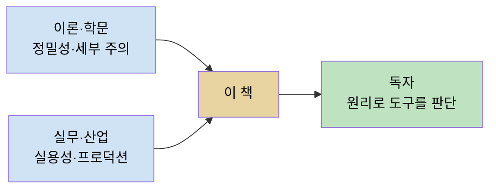
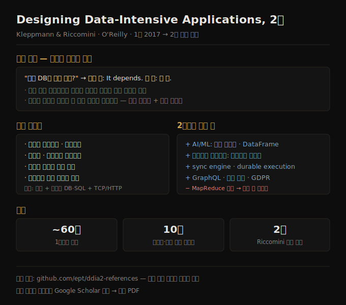

# 서문 — 책의 철학과 2판 변경점
> 제품 매뉴얼이 아니라 변하지 않는 원리를 다루는 책이며, 2판은 AI·클라우드 네이티브를 반영해 전면 개정됐습니다.

데이터 시스템을 고를 때 가장 정직한 대답은 "상황에 따라 다릅니다"입니다. 저자가 서문 첫 문장에서 던지는 질문 — "수백 개의 데이터베이스 중 무엇을 써야 하나?" — 에 대한 짧은 답이 바로 그것이고, 긴 답이 이 책 한 권입니다. 데이터를 저장하고 처리하는 기술마다 서로 다른 트레이드오프를 안고 있어서, 한 애플리케이션에 완벽히 맞는 시스템이 다른 애플리케이션에는 엉뚱한 선택이 됩니다. 그래서 이 책은 한 제품을 깊게 파는 대신, 여러 시스템의 강점과 약점을 나란히 놓고 비교합니다.

이 서문 노트는 본문에 들어가기 전에 책 전체의 좌표를 잡아 둡니다. 이 책이 *무엇을* 다루고 *누구를 위한* 책인지, 그리고 1판(2017)에서 2판으로 넘어오며 *무엇이 바뀌었는지*를 정리합니다. 본문 각 장의 상세는 해당 장 원문을 받을 때 채웁니다.

이 책 갈래는 합니다체로 정리합니다. 같은 `theory/` 폴더의 1판 기반 요약 노트는 한다체이지만, 2판 정독은 별도 폴더(`ddia2/`)에서 합니다체로 갑니다. 판본이 다른 별개의 책이기 때문입니다.

## 1. 이 책의 안내 철학 — 제품이 아니라 원리
> 도구는 빠르게 변하지만 그 밑을 받치는 원리는 오래가므로, 원리를 알면 어떤 도구든 제자리를 찾을 수 있습니다.

이 책의 중심에는 한 가지 믿음이 있습니다. 데이터를 처리하고 저장하는 기술의 지형은 다양하고 빠르게 변하지만, 그 밑을 받치는 원리는 오래간다는 것입니다. 저자는 그 원리를 이해하면 각 도구가 어디에 들어맞는지, 어떻게 잘 활용하는지, 어떤 함정을 피해야 하는지를 스스로 볼 수 있게 된다고 말합니다. 그래서 이 책은 그 원리에 집중합니다.

다만 이 책은 한 도구의 사용법을 가르치는 튜토리얼도, 마른 이론으로 가득한 교과서도 아닙니다. 대신 성공한 실제 데이터 시스템 — 수많은 인기 애플리케이션의 기반이 되고, 매일 프로덕션에서 확장성·성능·신뢰성 요구를 견뎌야 하는 기술 — 의 사례를 들여다봅니다. 그 시스템의 내부를 파고들어 핵심 알고리즘을 분리해 보고, 그들이 내린 트레이드오프를 따집니다. 단지 *어떻게* 동작하는가가 아니라 *왜* 그렇게 동작하는가까지 유용한 사고 방식을 찾는 것이 목표입니다.

저자가 밝히는 이 책의 안내 철학은 넓은 관점을 한자리에 모으는 것입니다. 이론과 실무, 최신과 오래된 것을 모두 끌어옵니다. 컴퓨팅 업계는 새롭고 반짝이는 것에 끌리고 오래되거나 학문적인 아이디어를 낮춰 보는 경향이 있는데, 저자는 이를 실수라고 지적합니다. 강력하고 기초적인 아이디어 다수가 연구에서 나왔고, 일부는 최근의 것이지만 일부는 수십 년 전의 것이기 때문입니다. 반대로 학계는 실무에서 무엇이 중요한지에 대한 감각이 부족할 때가 있습니다. 이 책은 양쪽의 가장 좋은 부분 — 학문적 정밀성과 세부에 대한 주의, 그리고 실용성에 대한 산업적 초점 — 을 결합합니다.

이 책을 다 읽고 나면, 어떤 종류의 기술이 어떤 목적에 적합한지 판단하고, 도구들을 어떻게 조합해 견고한 애플리케이션 아키텍처의 기반을 만드는지 이해하는 자리에 서게 됩니다. 시스템이 내부에서 무엇을 하고 있는지에 대한 강한 직관이 생겨서, 동작을 추론하고 좋은 설계 결정을 내리며 문제가 생겼을 때 추적할 수 있게 됩니다.

## 2. 누가 읽어야 하는가
> 시스템 아키텍처를 결정해야 하는 백엔드·데이터·클라우드 엔지니어, 그리고 시스템 디자인 면접 준비자가 대상입니다.

저자는 다음 중 하나라도 해당하면 이 책이 가치 있다고 말합니다.

1. 작업하는 시스템의 아키텍처를 결정해야 하는 소프트웨어 엔지니어·아키텍트·기술 매니저. 주어진 문제를 풀 도구를 고르고 그것을 어떻게 가장 잘 적용할지 알아내야 하는 경우입니다. 특히 백엔드 시스템에 해당합니다.
2. 다루는 시스템의 더 넓은 맥락을 이해하고 싶은 데이터 엔지니어, 또는 사용 중인 시스템의 토대를 들여다보고 싶은 클라우드 엔지니어. 현대 분산 시스템이 복잡성을 많이 감춰 주더라도, 그 밑의 원리를 이해하는 것은 성능 최적화와 디버깅에 크게 쓸모가 있습니다.
3. 데이터 시스템을 확장 가능하게(수백만 사용자 지원), 고가용으로(다운타임 최소화), 운영상 견고하게, 그리고 오래 유지보수하기 쉽게(성장하고 요구·기술이 바뀌어도) 만드는 법을 배우고 싶은 사람.
4. 시스템 디자인 면접을 준비하는 사람. 애플리케이션의 아키텍처를 스케치하라는 요청을 받고, 좋은 데이터 아키텍처의 원리를 익혀야 하는 경우입니다.
5. 주요 웹사이트·온라인 서비스의 무대 뒤, 그리고 여러 데이터베이스·데이터 처리 시스템의 내부에서 무슨 일이 벌어지는지 궁금한 사람. 버즈워드보다 깊이 파고들어 기술적으로 정확하고 정밀한 이해를 얻고 싶다면 더욱 그렇습니다.

저자가 전제하는 독자의 배경도 분명합니다. 이미 웹 기반 애플리케이션을 만들어 본 경험이 있고, 관계형 데이터베이스와 SQL에 익숙하다고 가정합니다. TCP·HTTP 같은 흔한 네트워크 프로토콜에 대한 높은 수준의 이해가 있으면 도움이 됩니다. 프로그래밍 언어나 프레임워크 선택은 이 책에서 차이를 만들지 않습니다.

## 3. 2판에서 바뀐 것
> AI와 클라우드 네이티브가 가장 큰 기술 변화이며, 그에 맞춰 새 주제를 더하고 낡은 주제(MapReduce)를 덜어냈습니다.

2판은 2017년에 나온 1판과 같은 목표·범위를 갖지만, 지난 10년의 기술 변화를 반영하고 설명을 더 명확하게 하려고 책 전체를 철저히 개정했습니다. 1판 이후 이 책에 영향을 준 가장 큰 기술 변화는 두 가지입니다 — **AI에 대한 관심 폭발**과 **클라우드 네이티브 데이터 시스템 아키텍처의 부상**입니다.

이 책이 AI 자체를 다루는 책은 아니지만, AI와 머신러닝을 뒷받침하는 데이터 시스템에 대한 내용을 추가했습니다. 여기에는 시맨틱 검색에 쓰이는 **벡터 인덱스(vector index)**, 학습 데이터셋에 쓰이는 **DataFrame**, 대량의 학습 데이터를 준비하는 **배치 처리 시스템**이 포함됩니다. 그리고 로컬 디스크 대신 오브젝트 스토어 위에 데이터 시스템을 구축하는 것 같은 **클라우드 네이티브** 아이디어가 책 전반에 짜여 들어갔습니다.

추가된 논의 주제도 여럿입니다.

| 추가된 주제 | 무엇 |
|------------|------|
| sync engine · local-first software | 클라이언트 우선 동기화 |
| workflow engine · durable execution | 워크플로 엔진·내구성 있는 실행 |
| formal methods · randomized testing | 형식 검증·무작위 테스트 |
| GraphQL | API 질의 |
| GDPR 등 법적 맥락 | EU 일반 개인정보보호법과 관련 법의 영향 |

덜어낸 것도 있습니다. **MapReduce가 이제 대체로 한물갔기 때문에**, 그에 맞춰 배치 처리 장을 다시 썼습니다. 그리고 아쉽지만 톨킨 스타일의 지도(Tolkien-style maps)는 빼기로 했습니다.

일부 논의는 재구성됐고 **장 번호가 바뀌었습니다**. 어떤 장은 가벼운 편집만 거쳤지만, 어떤 장 — 예를 들어 일관성과 합의를 다루는 **10장** — 은 더 명확하게 만들기 위해 거의 완전히 다시 썼습니다. 전체적으로 2판은 1판보다 **약 60쪽** 더 깁니다. 2판부터는 Chris Riccomini가 Martin Kleppmann의 공저자로 합류했습니다.

> ⚠️ **1판과 장 매핑이 다릅니다.** 같은 `theory/` 폴더의 1판 요약 노트(`01-01`~`03-04`)는 1판 ISBN(`9781491903063`)과 1판 장 번호를 따릅니다. 2판은 장 번호가 바뀌었으므로, 같은 주제라도 장 번호가 어긋날 수 있습니다. 두 판본은 이 폴더(`ddia2/`)와 상위 폴더로 분리해 두고, 겹치는 주제는 각 노트의 `related`에서 교차 참조합니다.

## 4. 참조를 활용하는 법
> 장말 참조 대부분이 온라인에 무료로 공개돼 있고, 깨진 링크는 검색·아카이브로 복구할 수 있습니다.

이 책에서 다루는 내용 대부분은 이미 어딘가에서 — 컨퍼런스 발표, 연구 논문, 블로그 글, 코드, 버그 트래커, 메일링 리스트, 엔지니어링 구전 — 어떤 형태로든 언급된 것입니다. 이 책은 수많은 출처에서 가장 중요한 아이디어를 요약하고, 본문 곳곳에 원전으로 가는 포인터를 넣습니다. 각 장 끝의 참조는 어떤 영역을 더 깊이 파고 싶을 때 좋은 자료이며, 대부분 온라인에서 무료로 볼 수 있습니다.

전자책 판에는 온라인 자료 전문으로 가는 링크를 넣었습니다. 웹의 속성상 링크는 자주 깨지므로 가능한 곳에는 아카이브 링크도 함께 넣었습니다. 깨진 링크를 만나거나 인쇄본을 읽고 있다면 검색 엔진으로 참조를 찾으면 됩니다. 학술 논문은 Google Scholar에서 제목으로 검색하면 무료(오픈 액세스) PDF를 찾을 수 있습니다. 책은 돈이 들 수 있어도 연구 논문에는 돈을 낼 필요가 없다는 것이 저자의 입장입니다.

모든 참조는 한곳에 모여 있기도 합니다.

- 참조 모음: [github.com/ept/ddia2-references](https://github.com/ept/ddia2-references) — 최신 링크를 유지합니다.
- 정오표·예제: [oreil.ly/DesigningDataIntensiveApps2](https://oreil.ly/DesigningDataIntensiveApps2)

## 면접에서 받을 만한 질문

1. **"DDIA가 특정 데이터베이스 제품을 다루지 않는 이유는?"** — 도구는 빠르게 변하지만 그 밑의 원리는 오래가기 때문입니다. 원리를 이해하면 어떤 도구가 어디에 맞는지, 어떻게 활용하고 어떤 함정을 피할지 스스로 판단할 수 있습니다. 제품 하나를 깊게 아는 것보다 트레이드오프를 비교하는 안목이 오래 쓸모가 있습니다.
2. **"2판에서 MapReduce 장을 다시 쓴 이유는?"** — MapReduce가 대체로 한물갔기 때문입니다. 2판은 이를 반영해 배치 처리 장을 재작성하고, 대신 학습 데이터 준비 같은 현대적 배치 처리 맥락을 더했습니다. 기술 지형 변화가 책 구조까지 바꾼 사례입니다.
3. **"데이터 시스템 선택에 '정답'이 없다는 말의 의미는?"** — 기술마다 트레이드오프가 다르고, 한 애플리케이션에 완벽한 시스템이 다른 애플리케이션에는 맞지 않기 때문입니다. 그래서 확장성·성능·신뢰성 요구를 먼저 정의하고, 그 축에서 각 시스템의 강약을 비교해 고르는 것이 올바른 접근입니다.

## 관련 문서

- [ddia2 README — 2판 정독 인덱스](./README.md)
- [상위 theory README — 데이터 이론 전체](../README.md)
