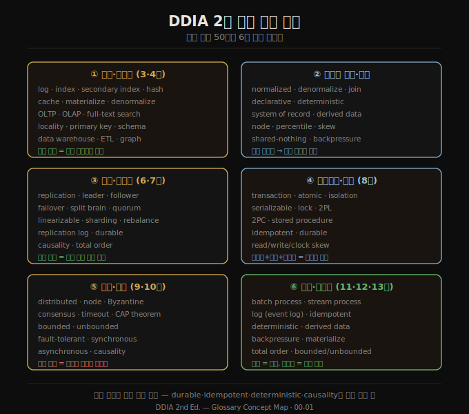

# 용어집 — DDIA 2판 핵심 용어 50선
> 책 전체에서 쓰인 핵심 용어를 개념 군으로 묶어 정의하고, 각 용어가 깊이 다뤄지는 학습 문서로 연결합니다. 조회용 사전입니다.

이 용어집은 DDIA 2판 부록 Glossary를 합니다체로 옮기되, 단순 나열 대신 여섯 개념 군(저장·인덱스 / 데이터 모델·일반 / 복제·일관성 / 트랜잭션·격리 / 분산·합의 / 배치·스트림)으로 묶었습니다. 같은 용어가 여러 장에 걸쳐 등장하므로, 각 정의 뒤에 그 개념을 깊이 다룬 정독 문서를 링크해 책과 노트를 잇습니다. 원서 주의대로, 여기 정의는 핵심만 짧게 전달하며 미묘한 차이는 본문 문서를 따라가야 합니다.

## 1. 저장·인덱스 군
> 데이터를 어떻게 저장하고 빠르게 찾을지에 관한 용어입니다. 대부분 3·4장에서 다룹니다.

- **index (인덱스)** — 특정 필드에 특정 값을 가진 레코드를 효율적으로 찾게 해주는 자료 구조입니다. → [04-01 OLTP 저장과 인덱스 기초](04-01.OLTP%20%EC%A0%80%EC%9E%A5%EA%B3%BC%20%EC%9D%B8%EB%8D%B1%EC%8A%A4%20%EA%B8%B0%EC%B4%88.md)
- **secondary index (보조 인덱스)** — 주 저장소와 함께 유지되며 특정 조건에 맞는 레코드를 효율적으로 찾게 하는 추가 자료 구조입니다. → [04-04 보조 인덱스와 인메모리 저장](04-04.%EB%B3%B4%EC%A1%B0%20%EC%9D%B8%EB%8D%B1%EC%8A%A4%EC%99%80%20%EC%9D%B8%EB%A9%94%EB%AA%A8%EB%A6%AC%20%EC%A0%80%EC%9E%A5.md)
- **log (로그)** — 데이터를 추가만 하는 append-only 파일입니다. 쓰기 선행 로그(크래시 내성), 로그 구조 저장 엔진, 복제 로그, 이벤트 로그 등 여러 형태로 쓰입니다. → [04-02 LSM 저장 엔진](04-02.LSM%20%EC%A0%80%EC%9E%A5%20%EC%97%94%EC%A7%84.md)
- **hash (해시)** — 입력을 무작위처럼 보이는 숫자로 바꾸는 함수입니다. 같은 입력은 늘 같은 출력을 내며, 드물게 다른 입력이 같은 출력을 내는 충돌이 생깁니다. → [07-02 해시 샤딩과 일관 해싱](07-02.%ED%95%B4%EC%8B%9C%20%EC%83%A4%EB%94%A9%EA%B3%BC%20%EC%9D%BC%EA%B4%80%20%ED%95%B4%EC%8B%B1.md)
- **cache (캐시)** — 최근 사용한 데이터를 기억해 같은 데이터의 다음 읽기를 가속하는 구성 요소입니다. 완전하지 않으며, 없는 데이터는 더 느린 하위 저장소에서 가져옵니다.
- **materialize (구체화)** — 요청 시점에 계산하는 대신, 미리 계산해 결과를 써두는 것입니다. → [03-06 이벤트 소싱·CQRS·DataFrame](03-06.%EC%9D%B4%EB%B2%A4%ED%8A%B8%20%EC%86%8C%EC%8B%B1%C2%B7CQRS%C2%B7DataFrame.md)
- **full-text search (전문 검색)** — 임의 키워드로 텍스트를 검색하는 것으로, 유사 철자·동의어 매칭 같은 기능을 더하기도 합니다. 전문 인덱스는 이를 지원하는 보조 인덱스입니다. → [04-06 다차원·전문·벡터 인덱스](04-06.%EB%8B%A4%EC%B0%A8%EC%9B%90%C2%B7%EC%A0%84%EB%AC%B8%C2%B7%EB%B2%A1%ED%84%B0%20%EC%9D%B8%EB%8D%B1%EC%8A%A4.md)
- **locality (지역성)** — 자주 함께 필요한 데이터를 같은 곳에 두는 성능 최적화입니다. → [04-05 분석용 컬럼 지향 저장](04-05.%EB%B6%84%EC%84%9D%EC%9A%A9%20%EC%BB%AC%EB%9F%BC%20%EC%A7%80%ED%96%A5%20%EC%A0%80%EC%9E%A5.md)
- **OLTP (온라인 트랜잭션 처리)** — 소수 레코드를 키로 빠르게 읽고 쓰는 접근 패턴입니다. → [01-01 운영 시스템 vs 분석 시스템](01-01.%EC%9A%B4%EC%98%81%20%EC%8B%9C%EC%8A%A4%ED%85%9C%20vs%20%EB%B6%84%EC%84%9D%20%EC%8B%9C%EC%8A%A4%ED%85%9C.md)
- **OLAP (온라인 분석 처리)** — 많은 레코드에 걸쳐 집계(count·sum·average)하는 접근 패턴입니다. → [01-01 운영 시스템 vs 분석 시스템](01-01.%EC%9A%B4%EC%98%81%20%EC%8B%9C%EC%8A%A4%ED%85%9C%20vs%20%EB%B6%84%EC%84%9D%20%EC%8B%9C%EC%8A%A4%ED%85%9C.md)
- **data warehouse (데이터 웨어하우스)** — 여러 OLTP 시스템의 데이터를 결합·준비해 분석에 쓰는 데이터베이스입니다. → [03-03 분석용 스키마 — 별·눈송이·OBT](03-03.%EB%B6%84%EC%84%9D%EC%9A%A9%20%EC%8A%A4%ED%82%A4%EB%A7%88%20%E2%80%94%20%EB%B3%84%C2%B7%EB%88%88%EC%86%A1%EC%9D%B4%C2%B7OBT.md)
- **ETL (추출-변환-적재)** — 원천 DB에서 데이터를 추출하고 분석에 맞게 변환해 웨어하우스에 적재하는 과정입니다. → [11-04 데이터플로우 엔진과 배치 활용](11-04.%EB%8D%B0%EC%9D%B4%ED%84%B0%ED%94%8C%EB%A1%9C%EC%9A%B0%20%EC%97%94%EC%A7%84%EA%B3%BC%20%EB%B0%B0%EC%B9%98%20%ED%99%9C%EC%9A%A9.md)
- **schema (스키마)** — 필드와 데이터 타입을 포함한 데이터 구조의 기술입니다. 시점마다 준수 여부를 검사할 수 있고 시간에 따라 바뀔 수 있습니다. → [03-04 모델 선택과 스키마 유연성](03-04.%EB%AA%A8%EB%8D%B8%20%EC%84%A0%ED%83%9D%EA%B3%BC%20%EC%8A%A4%ED%82%A4%EB%A7%88%20%EC%9C%A0%EC%97%B0%EC%84%B1.md)
- **graph (그래프)** — 정점(vertex)과 간선(edge)으로 이뤄진 자료 구조입니다. 정점은 참조 대상, 간선은 정점 사이 연결입니다. → [03-05 그래프 데이터 모델](03-05.%EA%B7%B8%EB%9E%98%ED%94%84%20%EB%8D%B0%EC%9D%B4%ED%84%B0%20%EB%AA%A8%EB%8D%B8.md)

## 2. 데이터 모델·일반 군
> 데이터를 구조화하고 시스템을 기술하는 일반 개념입니다. 1·2·3장에 흩어져 있습니다.

- **normalized (정규화된)** — 중복이나 복제가 없도록 구조화한 것입니다. 데이터가 바뀔 때 한 곳만 고치면 됩니다. → [03-02 정규화·비정규화·조인](03-02.%EC%A0%95%EA%B7%9C%ED%99%94%C2%B7%EB%B9%84%EC%A0%95%EA%B7%9C%ED%99%94%C2%B7%EC%A1%B0%EC%9D%B8.md)
- **denormalize (비정규화하다)** — 읽기를 빠르게 하려고 정규화된 데이터에 캐시·인덱스 형태로 중복을 도입하는 것입니다. 비정규화된 값은 일종의 미리 계산된 질의 결과입니다. → [03-02 정규화·비정규화·조인](03-02.%EC%A0%95%EA%B7%9C%ED%99%94%C2%B7%EB%B9%84%EC%A0%95%EA%B7%9C%ED%99%94%C2%B7%EC%A1%B0%EC%9D%B8.md)
- **join (조인)** — 공통점을 가진 레코드를 한데 모으는 것입니다. 보통 한 레코드가 다른 레코드를 참조(외래 키·문서 참조·간선)할 때 씁니다. → [03-02 정규화·비정규화·조인](03-02.%EC%A0%95%EA%B7%9C%ED%99%94%C2%B7%EB%B9%84%EC%A0%95%EA%B7%9C%ED%99%94%C2%B7%EC%A1%B0%EC%9D%B8.md)
- **declarative (선언적)** — 무엇을 원하는지 속성으로 기술하되 어떻게 달성할지는 정하지 않는 방식입니다. 질의 최적화기가 선언적 질의를 받아 실행 방법을 결정합니다. → [03-01 관계형 vs 문서 모델](03-01.%EA%B4%80%EA%B3%84%ED%98%95%20vs%20%EB%AC%B8%EC%84%9C%20%EB%AA%A8%EB%8D%B8.md)
- **deterministic (결정론적)** — 같은 입력이면 늘 같은 출력을 내는 함수를 가리킵니다. 난수·시각·네트워크 통신 같은 예측 불가 요소에 의존하지 않습니다. → [13-04 정확성과 신뢰·13장 종합](13-04.%EC%A0%95%ED%99%95%EC%84%B1%EA%B3%BC%20%EC%8B%A0%EB%A2%B0%C2%B713%EC%9E%A5%20%EC%A2%85%ED%95%A9.md)
- **system of record (기록 시스템)** — 데이터의 권위 있는 원본을 보유하는 시스템으로, 진실의 원천이라고도 합니다. 변경은 먼저 여기에 기록됩니다. → [01-02 기록 시스템 vs 파생 데이터](01-02.%EA%B8%B0%EB%A1%9D%20%EC%8B%9C%EC%8A%A4%ED%85%9C%20vs%20%ED%8C%8C%EC%83%9D%20%EB%8D%B0%EC%9D%B4%ED%84%B0.md)
- **derived data (파생 데이터)** — 다른 데이터에서 반복 가능한 과정으로 만들어진 데이터셋입니다. 인덱스·캐시·구체화 뷰가 예이며, 필요하면 다시 생성할 수 있습니다. → [01-02 기록 시스템 vs 파생 데이터](01-02.%EA%B8%B0%EB%A1%9D%20%EC%8B%9C%EC%8A%A4%ED%85%9C%20vs%20%ED%8C%8C%EC%83%9D%20%EB%8D%B0%EC%9D%B4%ED%84%B0.md)
- **node (노드)** — 컴퓨터에서 실행되는 소프트웨어 인스턴스로, 작업을 위해 네트워크로 다른 노드와 통신합니다.
- **percentile (백분위수)** — 임계값 위아래 값이 몇 개인지로 분포를 재는 방법입니다. 예를 들어 95번째 백분위 응답 시간은 요청의 95%가 그보다 빠르게 끝나는 시간입니다. → [02-02 성능 — 응답 시간과 처리량](02-02.%EC%84%B1%EB%8A%A5%20%E2%80%94%20%EC%9D%91%EB%8B%B5%20%EC%8B%9C%EA%B0%84%EA%B3%BC%20%EC%B2%98%EB%A6%AC%EB%9F%89.md)
- **shared-nothing (비공유)** — 각자 CPU·메모리·디스크를 가진 독립 노드를 일반 네트워크로 연결한 아키텍처입니다. 공유 메모리·공유 디스크와 대비됩니다. → [02-04 확장성](02-04.%ED%99%95%EC%9E%A5%EC%84%B1.md)
- **backpressure (배압)** — 수신자가 따라오지 못할 때 송신자를 늦추는 것으로, 흐름 제어(flow control)라고도 합니다. → [02-04 확장성](02-04.%ED%99%95%EC%9E%A5%EC%84%B1.md)

## 3. 복제·일관성 군
> 데이터를 여러 노드에 복사하고 일관성을 유지하는 용어입니다. 6·7장이 중심입니다.

- **replication (복제)** — 같은 데이터를 여러 노드(복제본)에 두어, 한 노드가 닿지 않아도 접근 가능하게 하는 것입니다. → [06-01 복제 개요와 단일 리더](06-01.%EB%B3%B5%EC%A0%9C%20%EA%B0%9C%EC%9A%94%EC%99%80%20%EB%8B%A8%EC%9D%BC%20%EB%A6%AC%EB%8D%94.md)
- **leader (리더)** — 데이터가 여러 노드에 복제될 때 변경을 가할 수 있도록 지정된 복제본입니다. 프라이머리·소스라고도 합니다. → [06-01 복제 개요와 단일 리더](06-01.%EB%B3%B5%EC%A0%9C%20%EA%B0%9C%EC%9A%94%EC%99%80%20%EB%8B%A8%EC%9D%BC%20%EB%A6%AC%EB%8D%94.md)
- **follower (팔로워)** — 클라이언트의 쓰기를 직접 받지 않고 리더에서 받은 변경만 처리하는 복제본입니다. 세컨더리·읽기 복제본·핫 스탠바이라고도 합니다. → [06-01 복제 개요와 단일 리더](06-01.%EB%B3%B5%EC%A0%9C%20%EA%B0%9C%EC%9A%94%EC%99%80%20%EB%8B%A8%EC%9D%BC%20%EB%A6%AC%EB%8D%94.md)
- **failover (장애 조치)** — 단일 리더 시스템에서 리더 역할을 한 노드에서 다른 노드로 옮기는 과정입니다. → [06-02 노드 장애 처리와 복제 로그](06-02.%EB%85%B8%EB%93%9C%20%EC%9E%A5%EC%95%A0%20%EC%B2%98%EB%A6%AC%EC%99%80%20%EB%B3%B5%EC%A0%9C%20%EB%A1%9C%EA%B7%B8.md)
- **split brain (스플릿 브레인)** — 두 노드가 동시에 자신을 리더로 믿는 상황으로, 시스템 보장이 깨질 수 있습니다. → [06-02 노드 장애 처리와 복제 로그](06-02.%EB%85%B8%EB%93%9C%20%EC%9E%A5%EC%95%A0%20%EC%B2%98%EB%A6%AC%EC%99%80%20%EB%B3%B5%EC%A0%9C%20%EB%A1%9C%EA%B7%B8.md)
- **quorum (정족수)** — 연산이 성공으로 간주되기 전 투표해야 하는 최소 노드 수입니다. → [06-06 리더리스 복제와 6장 종합](06-06.%EB%A6%AC%EB%8D%94%EB%A6%AC%EC%8A%A4%20%EB%B3%B5%EC%A0%9C%EC%99%80%206%EC%9E%A5%20%EC%A2%85%ED%95%A9.md)
- **linearizable (선형화 가능)** — 시스템에 데이터 사본이 하나뿐이고 원자적 연산으로 갱신되는 것처럼 동작하는 성질입니다. → [10-01 선형성](10-01.%EC%84%A0%ED%98%95%EC%84%B1.md)
- **sharding (샤딩)** — 한 머신에 너무 큰 데이터셋이나 계산을 작은 조각으로 나눠 여러 머신에 분산하는 것으로, 파티셔닝이라고도 합니다. → [07-01 샤딩 개요와 키 범위 샤딩](07-01.%EC%83%A4%EB%94%A9%20%EA%B0%9C%EC%9A%94%EC%99%80%20%ED%82%A4%20%EB%B2%94%EC%9C%84%20%EC%83%A4%EB%94%A9.md)
- **rebalance (리밸런스)** — 부하를 공평히 분산하려고 데이터나 서비스를 한 노드에서 다른 노드로 옮기는 것입니다. → [07-03 요청 라우팅과 리밸런싱](07-03.%EC%9A%94%EC%B2%AD%20%EB%9D%BC%EC%9A%B0%ED%8C%85%EA%B3%BC%20%EB%A6%AC%EB%B0%B8%EB%9F%B0%EC%8B%B1.md)
- **durable (지속적)** — 여러 결함이 생겨도 손실되지 않으리라 믿을 방식으로 데이터를 저장하는 것입니다. → [08-01 ACID와 트랜잭션 개요](08-01.ACID%EC%99%80%20%ED%8A%B8%EB%9E%9C%EC%9E%AD%EC%85%98%20%EA%B0%9C%EC%9A%94.md)
- **causality (인과성)** — 한 사건이 다른 사건보다 "먼저 일어날" 때 생기는 사건 간 의존입니다. 나중 사건이 앞 사건에 대한 응답이거나 그 위에 쌓일 때 나타납니다. → [10-03 ID 생성기와 논리 시계](10-03.ID%20%EC%83%9D%EC%84%B1%EA%B8%B0%EC%99%80%20%EB%85%BC%EB%A6%AC%20%EC%8B%9C%EA%B3%84.md)

## 4. 트랜잭션·격리 군
> 여러 읽기·쓰기를 묶고 동시성을 다루는 용어입니다. 8장이 중심입니다.

- **transaction (트랜잭션)** — 오류 처리와 동시성 문제를 단순화하려고 여러 읽기·쓰기를 논리 단위로 묶는 것입니다. → [08-01 ACID와 트랜잭션 개요](08-01.ACID%EC%99%80%20%ED%8A%B8%EB%9E%9C%EC%9E%AD%EC%85%98%20%EA%B0%9C%EC%9A%94.md)
- **atomic (원자적)** — 동시성 맥락에서는 한 시점에 일어난 것처럼 보여 다른 프로세스가 "반쯤 끝난" 상태를 보지 못하는 연산을, 트랜잭션 맥락에서는 모두 커밋되거나 모두 롤백되는 쓰기 묶음을 가리킵니다. → [08-01 ACID와 트랜잭션 개요](08-01.ACID%EC%99%80%20%ED%8A%B8%EB%9E%9C%EC%9E%AD%EC%85%98%20%EA%B0%9C%EC%9A%94.md)
- **isolation (격리)** — 동시 실행되는 트랜잭션이 서로 간섭할 수 있는 정도입니다. 직렬화 가능 격리가 가장 강하며 약한 수준도 쓰입니다. → [08-02 약한 격리 수준과 스냅샷 격리](08-02.%EC%95%BD%ED%95%9C%20%EA%B2%A9%EB%A6%AC%20%EC%88%98%EC%A4%80%EA%B3%BC%20%EC%8A%A4%EB%83%85%EC%83%B7%20%EA%B2%A9%EB%A6%AC.md)
- **serializable (직렬화 가능)** — 여러 트랜잭션이 동시 실행돼도 한 번에 하나씩 직렬 순서로 실행한 것과 같게 동작하는 격리 보장입니다. → [08-03 Write Skew와 직렬화 가능성](08-03.Write%20Skew%EC%99%80%20%EC%A7%81%EB%A0%AC%ED%99%94%20%EA%B0%80%EB%8A%A5%EC%84%B1.md)
- **lock (락)** — 한 스레드·노드·트랜잭션만 무언가에 접근하게 하고 나머지는 락이 풀릴 때까지 기다리게 하는 메커니즘입니다. → [08-03 Write Skew와 직렬화 가능성](08-03.Write%20Skew%EC%99%80%20%EC%A7%81%EB%A0%AC%ED%99%94%20%EA%B0%80%EB%8A%A5%EC%84%B1.md)
- **two-phase locking (2PL, 2단계 잠금)** — 트랜잭션이 읽고 쓰는 모든 데이터에 락을 걸고 종료까지 유지해 직렬화 가능 격리를 달성하는 알고리즘입니다. → [08-03 Write Skew와 직렬화 가능성](08-03.Write%20Skew%EC%99%80%20%EC%A7%81%EB%A0%AC%ED%99%94%20%EA%B0%80%EB%8A%A5%EC%84%B1.md)
- **two-phase commit (2PC, 2단계 커밋)** — 여러 DB 노드가 트랜잭션을 모두 원자적으로 커밋하거나 모두 중단하도록 보장하는 알고리즘입니다. → [08-04 분산 트랜잭션과 2PC](08-04.%EB%B6%84%EC%82%B0%20%ED%8A%B8%EB%9E%9C%EC%9E%AD%EC%85%98%EA%B3%BC%202PC.md)
- **stored procedure (저장 프로시저)** — 트랜잭션 로직을 인코딩해, 도중에 클라이언트와 주고받지 않고 DB 서버에서 전부 실행하게 하는 방식입니다. → [08-03 Write Skew와 직렬화 가능성](08-03.Write%20Skew%EC%99%80%20%EC%A7%81%EB%A0%AC%ED%99%94%20%EA%B0%80%EB%8A%A5%EC%84%B1.md)
- **idempotent (멱등)** — 안전하게 재시도할 수 있는 연산입니다. 두 번 이상 실행돼도 한 번 실행한 것과 같은 효과를 냅니다. → [12-04 시간 추론과 내결함성·12장 종합](12-04.%EC%8B%9C%EA%B0%84%20%EC%B6%94%EB%A1%A0%EA%B3%BC%20%EB%82%B4%EA%B2%B0%ED%95%A8%EC%84%B1%C2%B712%EC%9E%A5%20%EC%A2%85%ED%95%A9.md)
- **skew (스큐)** — 샤드 간 부하가 불균형해 일부 샤드에 요청·데이터가 몰리는 것(핫스팟)을, 또는 사건이 예상 밖 비순차 순서로 나타나는 타이밍 이상(읽기·쓰기·시계 스큐)을 가리킵니다. → [08-02 약한 격리 수준과 스냅샷 격리](08-02.%EC%95%BD%ED%95%9C%20%EA%B2%A9%EB%A6%AC%20%EC%88%98%EC%A4%80%EA%B3%BC%20%EC%8A%A4%EB%83%85%EC%83%B7%20%EA%B2%A9%EB%A6%AC.md)

## 5. 분산·합의 군
> 여러 노드에서 돌아가는 시스템의 어려움과 합의에 관한 용어입니다. 9·10장이 중심입니다.

- **distributed (분산된)** — 네트워크로 연결된 여러 노드에서 실행되는 것입니다. 부분 실패가 특징이라, 일부가 망가져도 다른 부분은 돌아가며 무엇이 망가졌는지 알기 어렵습니다. → [09-01 부분 실패와 비신뢰 네트워크](09-01.%EB%B6%80%EB%B6%84%20%EC%8B%A4%ED%8C%A8%EC%99%80%20%EB%B9%84%EC%8B%A0%EB%A2%B0%20%EB%84%A4%ED%8A%B8%EC%9B%8C%ED%81%AC.md)
- **Byzantine fault (비잔틴 결함)** — 노드가 임의로 잘못 동작하는 결함입니다. 모순되거나 악의적인 메시지를 다른 노드에 보내는 식입니다. → [09-03 진실·거짓·시스템 모델](09-03.%EC%A7%84%EC%8B%A4%C2%B7%EA%B1%B0%EC%A7%93%C2%B7%EC%8B%9C%EC%8A%A4%ED%85%9C%20%EB%AA%A8%EB%8D%B8.md)
- **timeout (타임아웃)** — 일정 시간 안에 응답이 없음을 관찰해 결함을 감지하는 가장 단순한 방법입니다. 다만 원격 노드 문제인지 네트워크 문제인지는 알 수 없습니다. → [09-01 부분 실패와 비신뢰 네트워크](09-01.%EB%B6%80%EB%B6%84%20%EC%8B%A4%ED%8C%A8%EC%99%80%20%EB%B9%84%EC%8B%A0%EB%A2%B0%20%EB%84%A4%ED%8A%B8%EC%9B%8C%ED%81%AC.md)
- **bounded (유계)** — 알려진 상한이나 크기를 가진 것입니다. 네트워크 지연이나 데이터셋 맥락에서 씁니다. → [09-01 부분 실패와 비신뢰 네트워크](09-01.%EB%B6%80%EB%B6%84%20%EC%8B%A4%ED%8C%A8%EC%99%80%20%EB%B9%84%EC%8B%A0%EB%A2%B0%20%EB%84%A4%ED%8A%B8%EC%9B%8C%ED%81%AC.md)
- **unbounded (무계)** — 알려진 상한이 없는 것으로, bounded의 반대입니다. → [12-01 스트림 전송 — 메시지 브로커와 로그 기반 브로커](12-01.%EC%8A%A4%ED%8A%B8%EB%A6%BC%20%EC%A0%84%EC%86%A1%20%E2%80%94%20%EB%A9%94%EC%8B%9C%EC%A7%80%20%EB%B8%8C%EB%A1%9C%EC%BB%A4%EC%99%80%20%EB%A1%9C%EA%B7%B8%20%EA%B8%B0%EB%B0%98%20%EB%B8%8C%EB%A1%9C%EC%BB%A4.md)
- **fault-tolerant (내결함성)** — 머신 크래시나 네트워크 링크 실패 같은 문제가 생겨도 자동 복구할 수 있는 성질입니다. → [02-03 신뢰성과 내결함성](02-03.%EC%8B%A0%EB%A2%B0%EC%84%B1%EA%B3%BC%20%EB%82%B4%EA%B2%B0%ED%95%A8%EC%84%B1.md)
- **consensus (합의)** — 여러 노드가 무언가(예: 클러스터 리더)에 동의하게 하는 분산 컴퓨팅의 근본 문제입니다. 첫인상보다 훨씬 어렵습니다. → [10-04 합의와 코디네이션 서비스](10-04.%ED%95%A9%EC%9D%98%EC%99%80%20%EC%BD%94%EB%94%94%EB%84%A4%EC%9D%B4%EC%85%98%20%EC%84%9C%EB%B9%84%EC%8A%A4.md)
- **CAP theorem (CAP 정리)** — 널리 오해받지만 실무에는 유용하지 않은 이론적 결과입니다. → [10-02 선형성의 비용과 CAP](10-02.%EC%84%A0%ED%98%95%EC%84%B1%EC%9D%98%20%EB%B9%84%EC%9A%A9%EA%B3%BC%20CAP.md)
- **total order (전순서)** — 두 대상을 비교해 늘 어느 쪽이 크고 작은지 말할 수 있는 순서입니다. 비교 불가한 쌍이 있으면 부분 순서입니다. → [10-03 ID 생성기와 논리 시계](10-03.ID%20%EC%83%9D%EC%84%B1%EA%B8%B0%EC%99%80%20%EB%85%BC%EB%A6%AC%20%EC%8B%9C%EA%B3%84.md)
- **synchronous / asynchronous (동기 / 비동기)** — 비동기는 무언가의 완료를 기다리지 않고 소요 시간도 가정하지 않는 것이며, 동기는 그 반대입니다. → [06-01 복제 개요와 단일 리더](06-01.%EB%B3%B5%EC%A0%9C%20%EA%B0%9C%EC%9A%94%EC%99%80%20%EB%8B%A8%EC%9D%BC%20%EB%A6%AC%EB%8D%94.md)

## 6. 배치·스트림 군
> 대량 데이터를 처리하는 두 방식에 관한 용어입니다. 11·12·13장이 중심입니다.

- **batch process (배치 처리)** — 고정된(보통 큰) 입력 데이터를 받아 입력을 수정하지 않고 다른 데이터를 출력하는 계산입니다. → [11-01 배치 처리 개요와 Unix 도구](11-01.%EB%B0%B0%EC%B9%98%20%EC%B2%98%EB%A6%AC%20%EA%B0%9C%EC%9A%94%EC%99%80%20Unix%20%EB%8F%84%EA%B5%AC.md)
- **stream process (스트림 처리)** — 끝없는 사건 스트림을 입력으로 소비해 출력을 도출하는, 계속 도는 계산입니다. → [12-03 스트림 처리 — CEP·윈도우·조인](12-03.%EC%8A%A4%ED%8A%B8%EB%A6%BC%20%EC%B2%98%EB%A6%AC%20%E2%80%94%20CEP%C2%B7%EC%9C%88%EB%8F%84%EC%9A%B0%C2%B7%EC%A1%B0%EC%9D%B8.md)
- **event log (이벤트 로그)** — 데이터 스트림을 표현하는 append-only 로그입니다. 로그 기반 메시지 브로커의 핵심 자료 구조입니다. → [12-01 스트림 전송 — 메시지 브로커와 로그 기반 브로커](12-01.%EC%8A%A4%ED%8A%B8%EB%A6%BC%20%EC%A0%84%EC%86%A1%20%E2%80%94%20%EB%A9%94%EC%8B%9C%EC%A7%80%20%EB%B8%8C%EB%A1%9C%EC%BB%A4%EC%99%80%20%EB%A1%9C%EA%B7%B8%20%EA%B8%B0%EB%B0%98%20%EB%B8%8C%EB%A1%9C%EC%BB%A4.md)
- **primary key (기본 키)** — 레코드를 고유하게 식별하는 값(보통 숫자나 문자열)입니다. 많은 경우 레코드 생성 시 시스템이 순차·무작위로 만듭니다. → [04-01 OLTP 저장과 인덱스 기초](04-01.OLTP%20%EC%A0%80%EC%9E%A5%EA%B3%BC%20%EC%9D%B8%EB%8D%B1%EC%8A%A4%20%EA%B8%B0%EC%B4%88.md)

## 용어 간 관계 — 군을 잇는 축
> 같은 용어가 여러 장에 등장하는 이유는, 몇몇 핵심 개념이 군을 가로지르는 축이기 때문입니다.

용어를 군으로 나눴지만 실제로는 서로 깊이 얽혀 있습니다. 군을 잇는 축이 되는 개념을 짚으면 책 전체의 골격이 보입니다.

1. **파생 데이터(derived data)** 는 ①저장 군(인덱스·캐시·구체화 뷰)과 ⑥스트림 군(이벤트 로그에서 도출)을 잇습니다. 기록 시스템에서 반복 가능한 과정으로 만들어지며, 13장의 DB 언번들링이 이 개념을 시스템 수준으로 확장합니다.
2. **멱등성(idempotent)·결정론(deterministic)** 은 ④트랜잭션 군과 ⑥스트림 군에 동시에 등장합니다. 분산 트랜잭션 없이 무결성을 달성하는 핵심 메커니즘이라, 12·13장의 exactly-once가 이 두 성질에 기댑니다.
3. **로그(log)** 는 군마다 다른 얼굴을 합니다. 쓰기 선행 로그(저장 군), 복제 로그(복제 군), 이벤트 로그(스트림 군)가 모두 같은 append-only 구조에서 출발합니다.
4. **인과성(causality)·전순서(total order)** 는 ③복제 군과 ⑤분산 군을 잇습니다. 사건 순서를 정하는 문제가 곧 합의이며, 13장의 전순서 한계가 이 축의 실용적 경계를 보여줍니다.
5. **지속성(durable)** 은 ③복제·④트랜잭션 두 군에서 똑같이 "결함이 생겨도 잃지 않는다"는 약속으로 쓰입니다.

## 관련 문서
- [00-00.서문 — 책의 철학과 2판 변경점](00-00.%EC%84%9C%EB%AC%B8%20%E2%80%94%20%EC%B1%85%EC%9D%98%20%EC%B2%A0%ED%95%99%EA%B3%BC%202%ED%8C%90%20%EB%B3%80%EA%B2%BD%EC%A0%90.md) — 책 전체 구조와 2판 변경점
- [01-02.기록 시스템 vs 파생 데이터](01-02.%EA%B8%B0%EB%A1%9D%20%EC%8B%9C%EC%8A%A4%ED%85%9C%20vs%20%ED%8C%8C%EC%83%9D%20%EB%8D%B0%EC%9D%B4%ED%84%B0.md) — 기록 시스템·파생 데이터의 핵심 정의
- [README](README.md) — 전체 학습 지도
