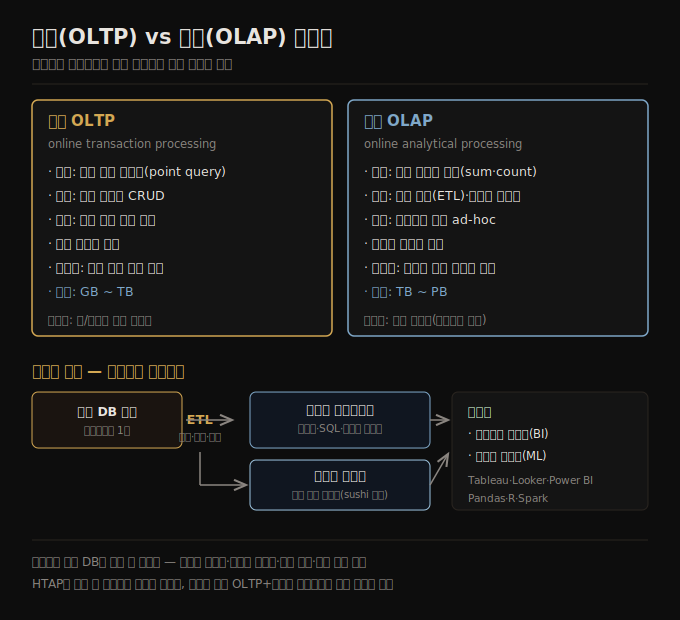
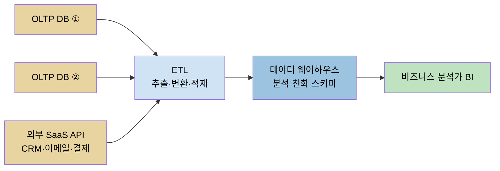

# 운영 시스템 vs 분석 시스템
> 데이터가 만들어지는 운영(OLTP)과 그 복사본을 읽기 전용으로 분석하는 OLAP은 접근 패턴도 사용자도 다릅니다.

이 노트를 읽고 나면 OLTP와 OLAP의 차이를 접근 패턴·사용자·데이터 표현의 세 축으로 그림 없이 설명하고, 데이터 웨어하우스와 데이터 레이크가 각각 어떤 소비자를 위한 것인지 구분하며, ETL과 ELT가 어디서 갈리는지 말할 수 있습니다.

데이터 시스템 아키텍처를 다루는 1장의 첫 주제는 트레이드오프입니다. 토머스 소웰의 말처럼 "해결책은 없고 트레이드오프만 있을" 뿐이며, 얻을 수 있는 최선의 균형을 잡는 것이 전부입니다. 데이터 관리가 애플리케이션 개발의 주요 난제 중 하나일 때 그 애플리케이션을 **데이터 집약적(data-intensive)** 이라 부릅니다. 계산 집약적 시스템의 난제가 거대한 연산을 병렬화하는 것이라면, 데이터 집약적 애플리케이션에서는 대량의 데이터를 저장·처리하고, 데이터 변경을 관리하고, 장애와 동시성 속에서 일관성을 보장하고, 서비스를 고가용으로 유지하는 일을 더 걱정합니다.

이런 애플리케이션은 흔히 필요한 기능을 제공하는 표준 빌딩 블록으로 짓습니다 — 나중에 다시 찾으려고 데이터를 저장하는 **데이터베이스**, 비싼 연산 결과를 기억해 읽기를 빠르게 하는 **캐시**, 키워드 검색·필터를 가능하게 하는 **검색 인덱스**, 이벤트·변경을 즉시 처리하는 **스트림 처리**, 누적된 대량 데이터를 주기적으로 처리하는 **배치 처리**입니다. 애플리케이션을 만들 때는 데이터베이스나 API 같은 여러 시스템을 가져와 애플리케이션 코드로 이어 붙입니다. 데이터 시스템이 설계된 그대로 쓰면 이 과정은 꽤 쉽지만, 애플리케이션이 야심차질수록 "어느 데이터베이스를 고를까", "캐싱·검색 인덱스를 어떻게 추론할까" 같은 난제가 생깁니다.

이 노트는 1장의 첫 트레이드오프 축인 **운영 시스템 대 분석 시스템**을 다룹니다. 본문에 들어가기 전에 책 전반에 쓰일 용어 하나(프론트엔드/백엔드)를 먼저 정리하고, OLTP와 OLAP의 차이, 데이터 웨어하우스와 데이터 레이크, 그리고 그 사이를 잇는 ETL을 따라갑니다.

## 1. 용어 — 프론트엔드와 백엔드
> 프론트엔드는 한 사용자의 데이터만 다루지만, 백엔드는 모든 사용자의 데이터를 대신 관리합니다.

이 책에서 다루는 내용 대부분은 백엔드 개발과 관련됩니다. 웹 애플리케이션에서 웹 브라우저 안에서 도는 클라이언트 측 코드를 **프론트엔드**라 부르고, 사용자 요청을 처리하는 서버 측 코드를 **백엔드**라 부릅니다. 모바일 앱도 사용자 인터페이스를 제공한다는 점에서 프론트엔드와 비슷하고, 보통 인터넷을 통해 서버 측 백엔드와 통신합니다.

프론트엔드도 때로 사용자 기기에서 데이터를 로컬로 관리하지만, 가장 큰 데이터 인프라 난제는 보통 백엔드에 있습니다. 그 이유가 핵심입니다 — 프론트엔드는 한 사용자의 데이터만 다루면 되지만, **백엔드는 모든 사용자를 대신해 데이터를 관리하기** 때문입니다. 한 사용자의 주소록을 그리는 것과 수백만 사용자의 주소록을 한 인프라에 담아 동시에 읽고 쓰는 것은 난이도가 다릅니다.

백엔드 서비스는 흔히 HTTP(때로는 WebSocket)로 닿을 수 있고, 보통 하나 이상의 데이터베이스에서 데이터를 읽고 쓰는 애플리케이션 코드로 이뤄지며, 캐시나 메시지 큐 같은 추가 데이터 시스템(이를 묶어 **데이터 인프라**라 부르기도 합니다)과 연결되기도 합니다. 애플리케이션 코드는 흔히 **무상태(stateless)** 입니다 — 한 HTTP 요청 처리를 끝내면 그 요청에 대한 모든 것을 잊습니다. 한 요청에서 다음 요청으로 이어져야 하는 정보는 클라이언트나 서버 측 데이터 인프라에 저장해야 합니다.

## 2. 운영 시스템과 분석 시스템의 분리
> 운영 시스템은 데이터가 만들어지는 곳이고, 분석 시스템은 그 읽기 전용 복사본 위에서 분석에 최적화된 곳입니다.

엔터프라이즈에서 데이터를 다루는 사람은 여러 유형입니다. 첫째는 데이터 읽기·갱신 요청을 처리하는 서비스를 만드는 **백엔드 엔지니어**로, 이 서비스는 외부 사용자를 직접 또는 다른 서비스를 통해 간접적으로 상대합니다. 여기에 더해 두 부류가 데이터 접근을 필요로 합니다 — 조직 활동에 대한 리포트를 만들어 경영 의사결정을 돕는 **비즈니스 분석가**(business intelligence, BI), 그리고 데이터에서 새로운 통찰을 찾거나 데이터 분석·머신러닝으로 사용자 대상 기능을 만드는 **데이터 과학자**입니다. 데이터 과학자가 만드는 예로는 "X를 산 사람이 Y도 샀다" 추천, 위험 점수·스팸 필터 같은 예측 분석, 검색 결과 순위가 있습니다.

비즈니스 분석가와 데이터 과학자는 도구도 방식도 다르지만 공통점이 있습니다. 첫째, 둘 다 **분석(analytics)** 을 합니다 — 사용자와 백엔드 서비스가 만들어 낸 데이터를 들여다봅니다. 둘째, 보통 이 데이터를 수정하지 않습니다(실수를 고치는 경우는 예외). 다만 원본을 어떤 식으로 가공한 파생 데이터셋을 만들 수는 있습니다. 이 점이 두 시스템 유형의 분리로 이어집니다.

1. **운영 시스템(operational systems)** — 데이터가 만들어지는 백엔드 서비스와 데이터 인프라입니다. 예를 들어 외부 사용자를 상대하면서, 애플리케이션 코드가 사용자 행동에 따라 데이터베이스의 데이터를 읽고 수정합니다.
2. **분석 시스템(analytical systems)** — 비즈니스 분석가와 데이터 과학자의 필요를 채웁니다. 운영 시스템에서 가져온 **읽기 전용 복사본**을 담고, 분석에 필요한 데이터 처리 유형에 최적화돼 있습니다.

이 시스템들이 성숙하면서 두 전문 역할이 새로 생겼습니다. **데이터 엔지니어**는 운영 시스템과 분석 시스템을 통합할 줄 알고 조직의 데이터 인프라를 더 넓게 책임지는 사람이고, **분석 엔지니어(analytics engineer)** 는 데이터를 모델링·변환해 분석가·과학자에게 더 쓸모 있게 만드는 사람입니다. 이 책은 운영과 분석 양쪽을 모두 다룹니다. 둘 다 조직 안 데이터의 생애주기에서 중요한 역할을 하기 때문입니다.

## 3. 트랜잭션 처리와 분석의 특성 — OLTP vs OLAP
> 운영은 키로 소수 레코드를 찾는 point query, 분석은 대량 레코드를 훑어 집계하는 패턴입니다.

이 구분은 같은 SQL 데이터베이스를 *어떤 질문에 쓰느냐*에서 출발합니다. DB 자체가 둘로 나뉜 게 아니라, 접근 패턴이 두 갈래로 갈라진 것을 일반화한 것입니다.

초창기 비즈니스 데이터 처리에서 데이터베이스 쓰기는 보통 상거래 **트랜잭션** — 판매, 공급사 발주, 급여 지급 — 에 대응했습니다. 데이터베이스가 돈이 오가지 않는 영역으로 넓어진 뒤에도 트랜잭션이라는 용어는 남아, **하나의 논리 단위를 이루는 읽기·쓰기 묶음**을 가리키게 됐습니다.

> 📌 트랜잭션의 정확한 의미는 2판 8장에서 자세히 다룹니다. 이 장에서는 *저지연 읽기·쓰기* 를 느슨하게 가리키는 말로 씁니다.

데이터베이스가 소셜 미디어 게시물, 게임 속 이동, 주소록 연락처 등 온갖 데이터로 쓰이게 된 뒤에도 기본 접근 패턴은 상거래 처리와 비슷했습니다. 운영 시스템은 보통 키로 소수의 레코드를 찾습니다(이를 **point query** 라 합니다). 사용자 입력에 따라 레코드를 삽입·갱신·삭제하고, 상호작용형이라 이 패턴을 **온라인 트랜잭션 처리(OLTP)** 라 부르게 됐습니다.

그런데 데이터베이스는 분석에도 점점 더 쓰이게 됐고, 분석은 OLTP와 접근 패턴이 크게 다릅니다. 보통 분석 쿼리는 거대한 수의 레코드를 훑어 개별 레코드를 반환하는 대신 집계 통계(count·sum·average 등)를 계산합니다. 슈퍼마켓 체인의 분석가라면 "1월 각 매장의 총매출은?", "최근 프로모션 동안 바나나를 평소보다 얼마나 더 팔았나?", "X 브랜드 기저귀와 가장 자주 함께 사는 이유식 브랜드는?" 같은 질문을 던집니다. 이 패턴을 트랜잭션 처리와 구분해 **온라인 분석 처리(OLAP)** 라 부릅니다.

| 속성 | 운영 시스템 (OLTP) | 분석 시스템 (OLAP) |
|------|-------------------|-------------------|
| 주 읽기 패턴 | point query(키로 개별 레코드) | 대량 레코드 집계 |
| 주 쓰기 패턴 | 개별 레코드 생성·갱신·삭제 | 대량 적재(ETL)·이벤트 스트림 |
| 사람 사용자 예 | 웹/모바일 앱 최종 사용자 | 내부 분석가(의사결정 지원) |
| 기계 사용 예 | 어떤 동작이 인가됐는지 확인 | 사기/남용 패턴 탐지 |
| 쿼리 유형 | 앱이 미리 정한 고정 쿼리 | 분석가의 임의 ad-hoc 탐색 |
| 쿼리 양 | 작은 쿼리가 다수 | 복잡한 쿼리가 소수 |
| 데이터가 표현하는 것 | 현재 시점 최신 상태 | 시간에 걸쳐 일어난 이벤트 이력 |
| 데이터셋 크기 | 기가바이트 ~ 테라바이트 | 테라바이트 ~ 페타바이트 |

> 📌 OLAP의 "online"이 무슨 뜻인지는 불분명합니다. 아마 미리 정한 리포트만이 아니라 분석가가 탐색적 쿼리를 *상호작용형으로* 돌린다는 뜻일 것입니다.

운영 시스템에서는 보통 사용자가 직접 SQL을 짜서 돌리도록 허용하지 않습니다. 권한 없는 데이터를 읽거나 수정할 수 있고, 비싼 쿼리로 다른 사용자의 성능을 해칠 수 있기 때문입니다. 그래서 OLTP는 대개 애플리케이션 코드에 박힌 고정 쿼리 집합을 돌리고, 일회성 커스텀 쿼리는 유지보수·문제 해결 때만 씁니다. 반면 분석 데이터베이스는 보통 사용자가 임의 SQL을 직접 짜거나 Tableau·Looker·Microsoft Power BI 같은 시각화·대시보드 도구로 쿼리를 자동 생성하도록 자유를 줍니다.

또 다른 유형은 분석 워크로드(많은 레코드를 집계하는 쿼리)를 위해 설계됐지만 사용자 대상 제품에 박혀 있는 시스템입니다. 이런 용도를 위한 시스템을 **제품 분석(product analytics)** 또는 **실시간 분석** 이라 부르고 Pinot, Druid, ClickHouse가 있습니다. 이들은 데이터를 실시간으로 받아들여 저지연 쿼리 응답에 최적화됩니다. 반면 전통적 OLAP 시스템은 보통 데이터를 배치로 받아들여 고처리량 쿼리 처리에 최적화됩니다.

## 4. 데이터 웨어하우스 — 분석 전용 데이터베이스
> 분석가가 운영을 방해하지 않고 마음껏 쿼리하도록, 모든 OLTP 시스템의 읽기 전용 복사본을 모은 별도 DB입니다.

처음에는 같은 데이터베이스를 트랜잭션 처리와 분석 쿼리에 함께 썼습니다. SQL은 이 점에서 꽤 유연해 두 유형 모두에 잘 동작합니다. 그러나 1980년대 말~1990년대 초, 기업들이 분석 목적으로 OLTP 시스템을 쓰는 것을 멈추고 별도 데이터베이스에서 분석을 돌리는 흐름이 생겼습니다. 이 별도 데이터베이스가 **데이터 웨어하우스** 입니다.

큰 기업은 OLTP 시스템을 수십, 수백 개 가질 수 있습니다 — 고객용 웹사이트, 매장 POS(계산대), 창고 재고 추적, 차량 경로 계획, 공급사 관리, 직원 관리 등입니다. 각 시스템은 복잡하고 유지보수에 팀이 필요해 대체로 서로 독립적으로 돌아갑니다. 분석가·과학자가 이 OLTP 시스템들을 직접 쿼리하는 것은 보통 바람직하지 않습니다.

1. 관심 데이터가 여러 운영 시스템에 흩어져 있어 한 쿼리로 합치기 어렵습니다(이를 **데이터 사일로** 라 합니다).
2. OLTP에 좋은 스키마·데이터 레이아웃은 분석에 덜 적합합니다.
3. 분석 쿼리는 꽤 비쌀 수 있어, OLTP 데이터베이스에서 돌리면 다른 사용자 성능에 영향을 줍니다.
4. OLTP 시스템이 보안·컴플라이언스 이유로 사용자가 직접 접근할 수 없는 별도 네트워크에 있을 수 있습니다.

데이터 웨어하우스는 이와 달리, 분석가가 OLTP 운영에 영향을 주지 않고 마음껏 쿼리할 수 있는 별도 데이터베이스입니다. 회사의 모든 OLTP 시스템에서 온 데이터의 읽기 전용 복사본을 담습니다. 데이터는 OLTP 데이터베이스에서 추출돼(주기적 덤프나 연속 업데이트 스트림으로), 분석 친화적 스키마로 변환되고, 정제된 뒤 웨어하우스에 적재됩니다. 이 과정을 **추출–변환–적재(extract–transform–load, ETL)** 라 합니다. 변환과 적재 순서를 바꿔(적재 후 웨어하우스 안에서 변환) **ELT** 가 되기도 합니다.

ETL의 데이터 소스가 CRM·이메일 마케팅·신용카드 처리 같은 외부 SaaS 제품인 경우도 있습니다. 이때는 원본 데이터베이스에 직접 접근할 수 없고 벤더의 API로만 닿습니다. 이런 외부 시스템 데이터를 자기 웨어하우스로 가져오면 SaaS API로는 불가능한 분석을 할 수 있습니다. SaaS API용 ETL은 흔히 Fivetran, Singer, Airbyte 같은 전문 데이터 커넥터 서비스로 구현합니다.

일부 데이터베이스는 **하이브리드 트랜잭션/분석 처리(HTAP)** 를 제공해, 한 시스템에서 다른 시스템으로의 ETL 없이 OLTP와 분석을 한 시스템에서 가능하게 하려 합니다. 그러나 많은 HTAP 시스템은 내부적으로 OLTP 시스템과 별도 분석 시스템이 공통 인터페이스 뒤에 결합된 형태라, 둘의 구분은 이 시스템들이 어떻게 동작하는지 이해하는 데 여전히 중요합니다. HTAP가 있어도 트랜잭션 시스템과 분석 시스템을 분리하는 것이 흔한데, 목표와 요구가 다르기 때문입니다. 특히 운영 시스템마다 자기 데이터베이스를 갖는 것이 좋은 관행이라 운영 데이터베이스는 수백 개가 될 수 있지만, 분석가가 여러 운영 시스템 데이터를 한 쿼리로 합칠 수 있도록 기업은 보통 단일 웨어하우스를 둡니다.

운영과 분석의 분리는 더 넓은 흐름의 일부입니다. 워크로드가 까다로워지면서 시스템은 특정 워크로드에 더 특화·최적화됐습니다. 범용 시스템은 작은 데이터 양은 편하게 다루지만, 규모가 클수록 시스템은 더 특화되는 경향이 있습니다 — 마이클 스톤브레이커의 "One Size Fits All은 시대가 지난 발상"이라는 지적이 이 흐름을 요약합니다.

## 5. 데이터 웨어하우스에서 데이터 레이크로
> 데이터 과학자는 관계형 스키마를 강제하지 않는 원본 파일 저장소(데이터 레이크)를 선호하며, "원본이 더 낫다"는 sushi 원칙을 따릅니다.

데이터 웨어하우스는 흔히 SQL로 쿼리하는 관계형 데이터 모델을 쓰고, 전문 BI 소프트웨어를 곁들이기도 합니다. 이 모델은 비즈니스 분석가의 쿼리에는 잘 맞지만, 데이터 과학자의 작업에는 덜 맞습니다.

1. **ML 모델 학습에 맞는 형태로의 변환** — 데이터베이스 테이블의 행·열을 **특징(feature)** 이라 부르는 수치 벡터·행렬로 바꿔야 할 때가 많습니다. 학습 모델 성능을 최대화하도록 이 변환을 수행하는 것을 **특징 공학(feature engineering)** 이라 하고, SQL로 표현하기 어려운 커스텀 코드가 흔히 필요합니다.
2. **자연어 처리(NLP)** — 제품 리뷰 같은 텍스트에서 구조화된 정보(저자의 감성, 언급 주제)를 뽑아내거나, 컴퓨터 비전으로 사진에서 구조화된 정보를 뽑아야 할 수 있습니다.

SQL 데이터 모델에 ML 연산자를 더하거나 관계형 기반 위에 효율적 ML 시스템을 짓는 노력이 있었지만, 많은 데이터 과학자는 웨어하우스 같은 관계형 데이터베이스에서 작업하지 않기를 선호합니다. 대신 Pandas·scikit-learn 같은 Python 데이터 분석 라이브러리, R 같은 통계 분석 언어, Spark 같은 분산 분석 프레임워크를 즐겨 씁니다.

그래서 조직은 데이터 과학자가 쓰기 좋은 형태로 데이터를 제공할 필요가 생깁니다. 그 답이 **데이터 레이크** 입니다 — 분석에 쓸모 있을 법한 데이터의 복사본을 운영 시스템에서 ETL로 가져와 담는 중앙 저장소입니다. 웨어하우스와 다른 점은, 데이터 레이크는 특정 파일 포맷·데이터 모델·스키마를 강제하지 않고 단지 **파일** 을 담는다는 것입니다. 데이터 레이크의 파일은 Avro·Parquet 같은 포맷으로 인코딩된 데이터베이스 레코드 모음일 수도 있지만, 텍스트·이미지·영상·센서 값·희소 행렬·특징 벡터·게놈 서열 등 어떤 데이터든 똑같이 담을 수 있습니다. 더 유연할 뿐 아니라, 오브젝트 스토어 같은 상용 파일 저장소를 쓸 수 있어 관계형 저장보다 흔히 더 쌉니다.

ETL 과정은 **데이터 파이프라인** 으로 일반화됐고, 데이터 레이크가 운영 시스템에서 웨어하우스로 가는 길의 중간 기착지가 되기도 합니다. 데이터 레이크는 운영 시스템이 만든 "원본(raw)" 형태의 데이터를 관계형 웨어하우스 스키마로 변환하지 않은 채 담습니다. 이러면 데이터의 각 소비자가 원본을 자기 필요에 가장 맞는 형태로 변환할 수 있다는 장점이 있습니다. 이를 **sushi 원칙** — "원본 데이터가 더 낫다(raw data is better)" — 이라 부르기도 합니다.

> 💬 비유로 보면, 웨어하우스는 *반찬을 미리 조리해 담은 도시락* 이고 레이크는 *손질 안 한 식재료 창고* 입니다. 도시락은 그대로 먹기 좋지만 다른 요리로 바꾸기 어렵고, 식재료 창고는 손이 더 가지만 어떤 요리로든 갈 수 있습니다. 이 비유는 *소비 직전 가공 시점* 까지는 유효하지만, 식재료가 시간이 지나면 상한다는 점(데이터는 그대로면 상하지 않음)에서는 깨집니다.

## 6. 데이터 레이크 너머 — DataOps·스트림·reverse ETL
> 분석이 성숙하며 거버넌스·규제 대응이 중요해지고, 데이터가 파일·테이블만이 아니라 이벤트 스트림으로도 제공되며, 분석 결과가 운영으로 되돌아갑니다.

분석 관행이 성숙하면서 조직은 분석 시스템과 데이터 파이프라인의 관리·운영에 점점 주목하게 됐고, 이는 **DataOps Manifesto** 같은 데 담겼습니다. 이 흐름은 부분적으로 거버넌스·프라이버시, 그리고 **GDPR**(EU 일반 개인정보보호법)·**CCPA**(캘리포니아 소비자 프라이버시법) 같은 규제 준수 문제에 떠밀린 것입니다(법·사회는 [01-05](./01-05.데이터%20시스템·법·사회.md)와 2판 14장에서 다룹니다).

또 다른 중요한 요인은, 분석용 데이터가 점점 파일·관계형 테이블만이 아니라 **이벤트 스트림** 으로 제공된다는 것입니다(2판 12장). 파일 기반 분석은 데이터 변화에 대응하려면 분석을 주기적으로(예: 매일) 다시 돌려야 하지만, 스트림 처리는 분석 시스템이 이벤트에 훨씬 빠르게(초 단위로) 대응하게 합니다. 애플리케이션과 그 시간 민감도에 따라, 스트림 처리 접근은 잠재적 사기·남용 활동을 식별·차단하는 데 가치가 있습니다.

분석 시스템의 출력이 운영 시스템으로 제공되는 경우도 있는데, 이를 **reverse ETL** 이라 부르기도 합니다. 예를 들어 분석 시스템 데이터로 학습한 ML 모델을 프로덕션에 배포해 "X를 산 사람이 Y도 샀다" 같은 추천을 최종 사용자에게 생성하게 합니다. 머신러닝 모델은 TFX·Kubeflow·MLflow 같은 전문 도구로 운영 시스템에 배포할 수 있습니다. 데이터가 운영 → 분석 → 다시 운영으로 한 바퀴 도는 셈이라, 운영과 분석의 경계가 흐려 보이지만 *권위 있는 원본이 어디인가* 는 여전히 운영 쪽에 남습니다(이 권위 축은 [01-02](./01-02.기록%20시스템%20vs%20파생%20데이터.md)에서 다룹니다).

## 자주 받는 오해

1. **"HTAP가 데이터 웨어하우스를 대체한다"** — 아닙니다. HTAP는 같은 애플리케이션이 많은 행을 훑는 분석 쿼리와 개별 레코드의 저지연 읽기·갱신을 *모두* 해야 할 때(예: 사기 탐지) 쓸모가 있습니다. 그러나 운영 데이터베이스는 시스템마다 따로 두고 웨어하우스는 단일로 두는 분리 관행은, 목표·요구가 달라 여전히 흔합니다.
2. **"분석가가 OLTP DB를 직접 쿼리하면 된다"** — 데이터 사일로, 분석에 부적합한 스키마, 비싼 쿼리의 성능 영향, 보안 격리 때문에 바람직하지 않습니다. 그래서 읽기 전용 복사본인 웨어하우스를 둡니다.
3. **"데이터 레이크는 그냥 싸구려 웨어하우스다"** — 차이는 *가격*이 아니라 *강제하지 않음*입니다. 레이크는 파일 포맷·모델·스키마를 강제하지 않아 각 소비자가 원본을 자기 형태로 변환합니다(sushi 원칙). ML·NLP처럼 SQL로 표현하기 어려운 작업에 맞습니다.
4. **"OLAP의 online은 실시간이라는 뜻이다"** — 꼭 그렇지 않습니다. 전통적 OLAP은 배치로 적재돼 고처리량에 최적화되고, 실시간 응답은 Pinot·Druid·ClickHouse 같은 *제품 분석* 시스템의 특징입니다. online은 분석가가 탐색적 쿼리를 상호작용형으로 돌린다는 의미에 가깝습니다.

## 면접에서 받을 만한 질문

1. **"OLTP와 OLAP의 차이를 접근 패턴으로 설명하라"** — OLTP는 키로 소수 레코드를 찾는 point query에 개별 CRUD, 고정 쿼리가 다수입니다. OLAP는 대량 레코드를 훑어 집계(sum·count)하고, 분석가의 임의 ad-hoc 쿼리가 소수입니다. 데이터도 OLTP는 현재 최신 상태, OLAP는 시간에 걸친 이벤트 이력을 표현합니다.
2. **"ETL과 ELT의 차이는?"** — 둘 다 운영 DB에서 데이터를 추출(E)해 분석용으로 옮기는 과정입니다. ETL은 적재 전에 변환(T→L), ELT는 적재 후 웨어하우스 안에서 변환(L→T)합니다. 레이크를 중간에 두면 원본을 그대로 적재하고 소비자별로 변환하는 sushi 원칙으로 갑니다.
3. **"데이터 웨어하우스와 데이터 레이크를 언제 각각 쓰나?"** — 웨어하우스는 관계형·SQL이라 BI 분석가의 정형 리포트에 맞고, 레이크는 포맷·스키마를 강제하지 않아 ML 특징 공학·NLP처럼 SQL로 표현하기 어려운 작업과 비정형 데이터(이미지·영상·센서)에 맞습니다. 흔히 레이크를 원본 기착지로 두고 웨어하우스로 변환해 보내는 파이프라인을 함께 씁니다.
4. **"systems of record와 derived data가 이 장의 다음 주제인 이유는?"** — 운영/분석 구분이 *시스템 종류* 축이라면, 기록/파생은 *데이터 권위와 흐름* 축입니다. 분석 시스템은 다른 곳에서 만든 데이터의 소비자이므로 대개 파생 데이터 시스템입니다. 자세한 구분은 [01-02](./01-02.기록%20시스템%20vs%20파생%20데이터.md)에서 다룹니다.

## 관련 문서

> 이 노트는 1장의 첫 트레이드오프 축(시스템 종류)이며, 다음 축들로 이어집니다.

- [01-02 기록 시스템 vs 파생 데이터](./01-02.기록%20시스템%20vs%20파생%20데이터.md) § "파생 데이터 시스템" — 분석 시스템이 왜 파생인지로 연결
- [01-04 분산 vs 단일 노드](./01-04.분산%20vs%20단일%20노드.md) — 분석 워크로드의 변동성이 분산·클라우드 결정과 연결
- [ddia2 README — 2판 정독 인덱스](./README.md)
- [1판 02-01 시스템 아키텍처 트레이드오프](../02-01.시스템%20아키텍처%20트레이드오프.md) — 1판 대응(장 번호 다름)
