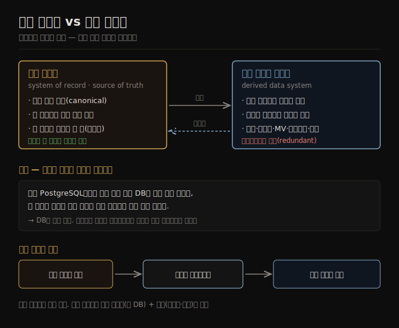

# 기록 시스템 vs 파생 데이터
> 기록 시스템은 권위 있는 정본이고, 파생 데이터는 원본에서 다시 만들 수 있는 중복 사본입니다.

이 노트를 읽고 나면 어떤 데이터가 진실의 원천이고 어떤 데이터가 그것에서 파생됐는지를 구분하고, 같은 데이터베이스가 왜 쓰임에 따라 기록 시스템도 파생 시스템도 될 수 있는지 설명할 수 있습니다.

운영 시스템과 분석 시스템의 구분([01-01](./01-01.운영%20시스템%20vs%20분석%20시스템.md))과 관련해, 이 책은 또 하나의 구분을 둡니다 — **기록 시스템(systems of record)** 과 **파생 데이터 시스템(derived data systems)** 입니다. 이 두 용어는 시스템을 관통하는 데이터의 흐름을 명확히 하는 데 쓸모가 있습니다.

앞 노트가 "운영이냐 분석이냐"라는 *시스템 종류* 축이었다면, 이 노트는 "어느 데이터가 권위를 갖고 어느 데이터가 그것에서 파생되는가"라는 *데이터 권위와 흐름* 축입니다. 같은 데이터베이스라도 어떻게 쓰느냐에 따라 기록 시스템이 되기도, 파생 시스템이 되기도 합니다.

## 1. 기록 시스템 — 진실의 원천
> 새 데이터가 가장 먼저 쓰이는 권위 있는 정본이며, 불일치가 생기면 정의상 이쪽이 옳습니다.

**기록 시스템** 은 **진실의 원천(source of truth)** 이라고도 하며, 데이터의 권위 있는(authoritative) 또는 정본(canonical) 버전을 담습니다. 새 데이터가 들어오면 — 예를 들어 사용자 입력으로 — 가장 먼저 여기에 쓰입니다. 각 사실은 정확히 한 번 표현되며, 그 표현은 보통 정규화돼 있습니다(정규화·역정규화·조인은 2판 3장에서 다룹니다). 다른 시스템과 기록 시스템 사이에 불일치가 있으면, 기록 시스템의 값이 (정의상) 옳은 값입니다.

핵심은 "정의상 옳다"는 부분입니다. 기록 시스템이 옳은지 따로 검증하는 게 아니라, **무엇이 권위를 갖는지를 우리가 정하는 것** 입니다. 그 자리에 둔 시스템이 곧 기준이 됩니다. 예를 들어 회원 가입 시 이메일이 회원 DB에 먼저 쓰이고 그것이 기준이라면, 검색 인덱스나 캐시에 다른 값이 남아 있어도 회원 DB의 값이 옳은 것으로 취급됩니다.

## 2. 파생 데이터 시스템 — 재생성 가능한 중복
> 다른 시스템의 데이터를 가공한 결과이며, 잃어도 원본에서 다시 만들 수 있습니다.

**파생 데이터 시스템** 의 데이터는 기존 데이터를 다른 시스템에서 가져와 어떤 식으로 변환·가공한 결과입니다. 파생 데이터를 잃어도 원본에서 다시 만들 수 있다는 것이 정의의 핵심입니다.

고전적인 예가 **캐시** 입니다. 데이터가 캐시에 있으면 캐시에서 내주고, 없으면 그 밑의 데이터베이스로 폴백합니다. 캐시가 통째로 날아가도 데이터베이스에서 다시 채울 수 있으므로, 캐시는 파생 데이터입니다. 역정규화된 값, 인덱스, **구체화 뷰(materialized view)**, 변환된 데이터 표현, 데이터셋으로 학습한 모델도 모두 이 범주에 듭니다.

기술적으로 파생 데이터는 **중복(redundant)** 입니다 — 이미 존재하는 정보를 복제하기 때문입니다. 그러나 이 중복은 읽기 쿼리 성능을 얻기 위해 흔히 필수입니다. 하나의 원본에서 여러 파생 데이터셋을 만들면, 같은 데이터를 서로 다른 관점에서 볼 수 있습니다. 예를 들어 같은 주문 데이터를 (a) 기본 키 조회용 주 테이블, (b) 전문 검색용 검색 인덱스, (c) 일별 매출 집계용 구체화 뷰로 동시에 파생해 각 쿼리를 빠르게 만들 수 있습니다.

## 3. 도구는 중립 — 쓰임이 결정한다
> 대부분의 DB·저장 엔진은 기록 시스템도 파생 시스템도 아니며, 애플리케이션에서 어떻게 쓰느냐가 그것을 결정합니다.

이 구분에서 가장 중요한 통찰은, **대부분의 데이터베이스·저장 엔진·쿼리 언어는 본질적으로 기록 시스템도 파생 시스템도 아니라는 것** 입니다. 데이터베이스는 그냥 도구이며, 그것을 어떻게 쓰는지는 사용자에게 달렸습니다. 기록 시스템이냐 파생 데이터 시스템이냐는 도구가 아니라 *애플리케이션에서의 쓰임* 에 달려 있습니다.

분석 시스템은 보통 파생 데이터 시스템입니다. 다른 곳에서 만든 데이터의 소비자이기 때문입니다. 운영 서비스는 기록 시스템과 파생 데이터 시스템의 혼합을 담을 수 있습니다 — 기록 시스템은 데이터가 가장 먼저 쓰이는 주 데이터베이스이고, 파생 데이터 시스템은 흔한 읽기를 빠르게 하는 인덱스·캐시입니다. 특히 기록 시스템이 효율적으로 답할 수 없는 쿼리를 위해 파생 시스템을 둡니다.

어느 데이터가 어느 데이터에서 파생되는지를 명확히 해 두면, 그렇지 않으면 혼란스러울 아키텍처에 명료함을 가져올 수 있습니다. 같은 사실이 세 곳에 있을 때 "어디가 기준이고 나머지는 거기서 파생된 것인가"를 답할 수 있으면, 불일치가 생겼을 때 무엇을 고쳐야 하는지 분명해집니다.

## 4. 파생 데이터 갱신 — 데이터 통합 예고
> 원본이 바뀌면 파생 데이터도 갱신해야 하며, 여러 시스템을 엮는 이 작업이 데이터 파이프라인입니다.

한 시스템의 데이터가 다른 시스템의 데이터에서 파생될 때, 기록 시스템의 원본이 바뀌면 파생 데이터를 갱신하는 절차가 필요합니다. 안타깝게도 많은 데이터베이스는 애플리케이션이 언제나 그 하나의 데이터베이스만 쓸 거라는 가정 위에 설계돼서, 이런 갱신을 전파하기 위해 여러 시스템을 통합하는 일을 쉽게 만들어 주지 않습니다.

2판 11장에서는 **데이터 파이프라인** 을 데이터 통합의 한 접근으로 다룹니다. 데이터 파이프라인은 여러 데이터 시스템을 조합해, 한 시스템만으로는 할 수 없는 일을 해내게 합니다. 예를 들어 주 데이터베이스에 주문이 쓰이면 그 변경을 감지해 검색 인덱스와 집계 뷰를 자동으로 갱신하는 흐름이 데이터 파이프라인입니다.

이 노트의 기록/파생 구분은 이후 책 전반에서 데이터 흐름을 추론하는 어휘가 됩니다. 어떤 데이터가 권위를 갖고 어떤 데이터가 거기서 파생됐는지를 분명히 해 두는 것이, 복잡한 시스템을 단순하게 보는 첫걸음입니다.

## 자주 받는 오해

1. **"파생 데이터는 중복이니 없애는 게 좋다"** — 기술적으로 중복인 건 맞지만, 읽기 성능을 위해 흔히 필수입니다. 인덱스·캐시·구체화 뷰가 없으면 기록 시스템이 모든 쿼리를 비효율적으로 처리해야 합니다. 중복을 *의도적으로 관리되는 중복* 으로 보는 게 맞습니다.
2. **"특정 DB는 기록 시스템 전용이다"** — 아닙니다. 대부분의 DB·저장 엔진은 중립이고, 기록 시스템이냐 파생이냐는 *쓰임* 이 결정합니다. 같은 PostgreSQL이 한 곳에선 주 DB(기록), 다른 곳에선 읽기 복제본(파생)일 수 있습니다.
3. **"파생 데이터가 틀리면 그게 버그다"** — 파생 데이터가 일시적으로 기록 시스템과 다를 수 있습니다. 갱신이 전파되는 동안의 불일치는 정상이며, 기준은 항상 기록 시스템입니다. 영구적 불일치라면 갱신 파이프라인을 점검합니다.

## 면접에서 받을 만한 질문

1. **"system of record와 derived data의 차이는?"** — 기록 시스템은 데이터가 가장 먼저 쓰이는 권위 있는 정본이라, 불일치 시 정의상 옳은 쪽입니다. 파생 데이터는 그 원본을 가공한 결과라 잃어도 재생성할 수 있습니다. 캐시·인덱스·구체화 뷰·학습 모델이 파생의 예입니다.
2. **"같은 DB가 기록 시스템도 파생도 될 수 있다는 게 무슨 뜻인가?"** — DB는 중립 도구이고, 그 인스턴스를 *무엇으로 쓰느냐* 가 역할을 정합니다. 주문이 처음 쓰이는 주 DB면 기록 시스템, 그 주문을 복제해 읽기 가속용으로 쓰면 파생입니다. 둘을 명확히 구분하면 불일치 시 어디를 고칠지 분명해집니다.
3. **"파생 데이터를 왜 두는가? 중복인데?"** — 읽기 쿼리 성능 때문입니다. 기록 시스템이 효율적으로 답할 수 없는 쿼리(전문 검색·대량 집계 등)를 위해 인덱스·캐시·구체화 뷰를 파생합니다. 하나의 원본에서 여러 파생을 만들어 같은 데이터를 여러 관점으로 볼 수 있습니다.

## 관련 문서

> 이 노트는 1장의 데이터 권위 축이며, 앞의 시스템 종류 축과 뒤의 인프라 축을 잇습니다.

- [01-01 운영 시스템 vs 분석 시스템](./01-01.운영%20시스템%20vs%20분석%20시스템.md) § "운영 시스템과 분석 시스템의 분리" — 분석 시스템이 왜 파생인지로 연결
- [01-03 클라우드 vs 셀프 호스팅](./01-03.클라우드%20vs%20셀프%20호스팅.md) — 기록·파생을 어디(클라우드/온프렘)에 둘지로 연결
- [ddia2 README — 2판 정독 인덱스](./README.md)
