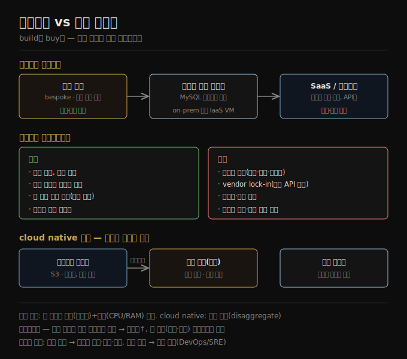

# 클라우드 vs 셀프 호스팅
> 클라우드는 운영을 벤더에 위탁해 빠르게 시작하고 탄력적으로 확장하지만, 통제를 잃고 lock-in 위험을 집니다.

이 노트를 읽고 나면 클라우드와 셀프 호스팅 중 어느 쪽이 더 싼지를 워크로드·전문성·부하 변동의 축으로 판단하고, cloud native 아키텍처가 저장과 연산을 왜 분리하는지 설명할 수 있습니다.

조직이 무언가를 해야 할 때 가장 먼저 던지는 질문 중 하나는 직접 할 것인가, 위탁할 것인가입니다 — 즉 **만들 것인가, 살 것인가(build vs buy)**. 궁극적으로 이것은 비즈니스 우선순위의 문제입니다. 흔한 경험칙은, 조직의 핵심 역량이나 경쟁 우위인 것은 직접 하고, 비핵심·일상적·흔한 것은 벤더에 맡기라는 것입니다. 극단적인 예로, 대부분의 회사는 CPU를 직접 제조하지 않습니다 — 반도체 제조사에서 사는 게 더 싸기 때문입니다.

이 노트는 1장의 세 번째 트레이드오프 축인 **클라우드 대 셀프 호스팅**을 다룹니다. 클라우드 서비스의 장단점, 클라우드를 활용하도록 처음부터 설계된 **cloud native** 아키텍처(특히 저장과 연산의 분리), 그리고 클라우드 시대에 달라진 운영의 역할을 따라갑니다.

## 1. 누가 만들고 누가 운영하는가 — 아웃소싱 스펙트럼
> 직접 작성·운영하는 맞춤 제작부터 벤더가 다 하는 SaaS까지 연속선이며, 가운데에 기성품 셀프 호스팅이 있습니다.

소프트웨어에서 내려야 할 중요한 두 결정은 **누가 소프트웨어를 만드는가** 와 **누가 그것을 배포·운영하는가** 입니다. 가능성의 스펙트럼은 다음과 같습니다. 한 극단에는 직접 작성해 사내에서 돌리는 **맞춤 제작(bespoke)** 소프트웨어가 있고, 다른 극단에는 외부 벤더가 구현·운영하며 웹 인터페이스나 API로만 접근하는 널리 쓰이는 **클라우드 서비스·SaaS 제품** 이 있습니다.

가운데 지점은 직접 배포하는 **기성품(off-the-shelf) 소프트웨어**(오픈소스나 상용)입니다 — 예를 들어 MySQL을 내려받아 자신이 통제하는 서버에 설치하는 것입니다. 이는 자기 하드웨어(흔히 **on premises**, 임대 데이터센터 랙이라도 그렇게 부름)일 수도, 클라우드의 VM(infrastructure as a service, **IaaS**)일 수도 있습니다. 오픈소스를 가져와 수정한 버전을 돌리는 등 스펙트럼 위에는 더 많은 지점이 있습니다.

서비스를 클라우드에 배포하든 온프렘에 배포하든, Kubernetes 같은 오케스트레이션 프레임워크를 쓰느냐 같은 결정도 관련됩니다. 다만 배포 도구의 선택은 데이터 시스템의 아키텍처에 다른 요인만큼 큰 영향을 주지는 않으므로 이 책의 범위 밖입니다.

## 2. 클라우드 서비스의 장단점
> 클라우드가 더 싸고 쉬운지는 전문성·부하 예측 가능성에 달렸으며, 가장 큰 단점은 통제권이 없다는 것입니다.

클라우드 서비스를 쓰는 것은 본질적으로 그 소프트웨어의 운영을 클라우드 제공자에게 위탁하는 것입니다. 클라우드 제공자는 시간·비용을 아끼고 더 빨리 움직이게 해 준다고 주장하지만, 실제로 더 싸고 쉬운지는 전문성과 워크로드에 크게 달렸습니다.

이미 필요한 시스템을 설치·운영할 경험이 있고 부하가 꽤 예측 가능하다면(필요한 머신 수가 크게 출렁이지 않으면), 직접 머신을 사서 돌리는 게 흔히 더 쌉니다. 반대로 배포·운영할 줄 모르는 시스템이 필요하다면, 클라우드 서비스를 쓰는 게 그것을 관리하는 법을 배우는 것보다 흔히 더 쉽고 빠릅니다. 그 시스템을 유지·운영할 직원을 고용·교육하는 비용이 상당히 들 수 있기 때문입니다.

클라우드 서비스는 부하가 시간에 따라 크게 변동할 때 특히 가치가 있습니다. 피크 부하를 처리하도록 머신을 프로비저닝해 두면 대부분의 시간에 그 자원이 유휴 상태라 비용 효율이 떨어집니다. 이때 클라우드는 수요 변화에 따라 자원을 키우거나 줄이기 쉽게 해 줍니다. 예를 들어 분석 시스템은 부하 변동이 극단적입니다 — 큰 분석 쿼리는 병렬로 많은 자원을 빠르게 쓰지만, 쿼리가 끝나면 다음 쿼리까지 자원이 유휴 상태가 됩니다.

가장 큰 단점은 서비스에 대한 **통제권이 없다는 것** 입니다.

1. 필요한 기능이 없으면 벤더에게 정중히 요청하는 것밖에 할 수 없고, 직접 구현할 수 없습니다.
2. 서비스가 다운되면 복구되기를 기다리는 것밖에 할 수 없습니다.
3. 버그·성능 문제를 유발하는 방식으로 쓰면, 내부에 접근할 수 없어 진단이 어렵습니다.
4. 서비스가 종료·고가화되거나 벤더가 제품을 바꿔도 옛 버전을 계속 돌리는 선택지가 보통 없어, 대안으로 이전해야 합니다 — 표준 API가 없는 경우가 많아 전환 비용이 큰 **vendor lock-in** 이 문제가 됩니다.
5. 클라우드 제공자가 다른 나라에 있고 정치적 갈등이 생기면, 제재로 서비스에서 차단될 위험이 있습니다.
6. 데이터 보안을 제공자가 지켜 줄 거라 신뢰해야 해서, 프라이버시·보안 규제 준수가 복잡해질 수 있습니다.

이런 위험에도 클라우드 위에 새 애플리케이션을 짓거나 하이브리드 접근을 택하는 것이 점점 더 흔해졌습니다. 다만 클라우드가 모든 사내 데이터 시스템을 흡수하지는 않습니다 — 클라우드보다 앞선 오래된 시스템, 그리고 고빈도 매매처럼 하드웨어를 완전히 통제해야 하는 지연 민감 애플리케이션에는 사내 시스템이 여전히 필요합니다.

## 3. cloud native 아키텍처 — 서비스의 레이어링
> 처음부터 클라우드를 활용하도록 설계된 시스템은 하위 클라우드 서비스 위에 상위 서비스를 쌓아 올립니다.

클라우드의 부상은 경제 모델(하드웨어 구매·라이선스 대신 서비스 구독)뿐 아니라 데이터 시스템이 기술적으로 구현되는 방식에도 깊은 영향을 줬습니다. **cloud native** 는 클라우드 서비스를 활용하도록 설계된 아키텍처를 가리킵니다.

원칙적으로 셀프 호스팅할 수 있는 거의 모든 소프트웨어를 클라우드 서비스로도 제공할 수 있고, 실제로 많은 인기 데이터 시스템에 managed 서비스가 나와 있습니다. 그러나 처음부터 cloud native로 설계된 시스템은 몇 가지 이점이 있습니다 — 같은 하드웨어에서 더 나은 성능, 장애에서 더 빠른 복구, 부하에 맞춰 자원을 빠르게 확장, 더 큰 데이터셋 지원입니다. 예로 OLTP에서는 AWS Aurora·Azure SQL DB Hyperscale·Google Cloud Spanner가, OLAP에서는 Snowflake·BigQuery·Azure Synapse가 cloud native 쪽에 듭니다.

cloud native 서비스의 핵심 발상은, 운영체제가 관리하는 컴퓨팅 자원만 쓰는 게 아니라 **더 낮은 수준의 클라우드 서비스 위에 더 높은 수준의 서비스를 쌓아 올리는 것** 입니다. 예를 들어 Amazon S3·Azure Blob Storage 같은 오브젝트 스토리지 서비스는 큰 파일을 저장하고, 일반 파일시스템보다 제한된 API를 제공하지만 그 대신 밑의 물리 머신을 숨깁니다. 서비스가 자동으로 데이터를 여러 머신에 분산해, 한 머신의 디스크가 가득 차거나 일부 머신·디스크가 망가져도 데이터를 잃지 않습니다. Snowflake 같은 분석 데이터베이스는 S3 위에 지어지고, 또 다른 서비스가 Snowflake 위에 지어지기도 합니다.

높은 수준의 추상화는 특정 사용 사례에 더 맞춰져 있습니다. 내 필요가 그 시스템이 설계된 상황과 맞으면 기존 상위 시스템을 쓰는 게 하위 컴포넌트로 직접 짓는 것보다 훨씬 수고가 적고, 맞는 상위 시스템이 없으면 하위 컴포넌트로 직접 짓는 것이 유일한 선택입니다.

## 4. 저장과 연산의 분리
> cloud native 시스템은 저장(오브젝트 스토어)과 연산을 분리해, 각각 독립적으로 확장하고 더 큰 데이터를 다룹니다.

전통적 컴퓨팅에서 디스크 저장은 **durable** 한 것으로 봅니다 — 디스크에 한번 쓰면 잃지 않는다고 가정합니다. 개별 디스크 고장을 견디려 같은 머신에 붙은 여러 디스크에 복사본을 두는 **RAID** 를 흔히 씁니다.

클라우드에서 연산 인스턴스(VM)에도 로컬 디스크가 붙지만, cloud native 시스템은 이 디스크를 장기 저장보다 **휘발성 캐시** 에 가깝게 취급합니다. 인스턴스가 망가지거나, 부하 변화에 맞춰 더 크거나 작은 인스턴스로 교체되면 로컬 디스크에 접근할 수 없어지기 때문입니다.

로컬 디스크 대신, 클라우드는 한 인스턴스에서 떼어 다른 인스턴스에 붙일 수 있는 가상 디스크 저장(Amazon EBS 등)도 제공합니다. 이 가상 디스크는 물리 디스크가 아니라 별도 머신 집합이 디스크의 동작을 흉내 내는 클라우드 서비스입니다. 덕분에 전통적 디스크 기반 소프트웨어를 클라우드에서 돌릴 수 있지만, 블록 장치 에뮬레이션은 오버헤드를 만들고 모든 I/O가 네트워크 호출이라 네트워크 끊김에 민감해집니다.

이 문제를 피하려고 cloud native 서비스는 보통 가상 디스크를 피하고 특정 워크로드에 최적화된 전용 저장 서비스 위에 짓습니다. S3 같은 오브젝트 스토리지는 수백 KB~수 GB의 꽤 큰 파일의 장기 저장에 설계됐습니다. 데이터베이스의 개별 행·값은 이보다 훨씬 작아서, 클라우드 데이터베이스는 작은 값은 별도 서비스로 관리하고 큰 데이터 블록(많은 값을 담은)은 오브젝트 스토어에 둡니다.

전통적 아키텍처에서는 같은 컴퓨터가 저장(디스크)과 연산(CPU·RAM)을 모두 책임지지만, cloud native에서는 이 둘이 어느 정도 분리(**disaggregate**)됩니다. 예를 들어 S3는 파일만 저장하고, 그 데이터를 분석하려면 분석 코드를 S3 밖 어딘가에서 돌려야 합니다. 이는 데이터를 네트워크로 전송한다는 뜻입니다.

## 5. 멀티테넌시 — 공유 하드웨어
> 여러 고객의 데이터·연산을 같은 하드웨어에서 처리해 활용률을 높이되, 격리를 위한 정밀한 엔지니어링이 필요합니다.

cloud native 시스템은 흔히 **멀티테넌트(multitenant)** 입니다 — 고객마다 별도 머신을 두는 대신, 여러 고객의 데이터·연산을 같은 공유 하드웨어에서 같은 서비스가 처리합니다. 멀티테넌시는 더 나은 하드웨어 활용, 쉬운 확장, 제공자의 쉬운 관리를 가능하게 합니다.

다만 한 고객의 활동이 다른 고객의 성능·보안에 영향을 주지 않도록 정밀한 엔지니어링이 필요합니다. 한 테넌트가 자원을 독점하거나 다른 테넌트의 데이터에 접근하면 안 되므로, 자원 격리·접근 제어가 멀티테넌시의 핵심 과제가 됩니다.

## 6. 클라우드 시대의 운영 — DevOps와 SRE
> 운영의 초점이 개별 머신에서 서비스로 옮겨가, 용량 계획은 재무 계획이 되고 성능 최적화는 비용 최적화가 됩니다.

전통적으로 조직의 서버 측 데이터 인프라를 관리하는 사람을 **DBA**(데이터베이스 관리자)나 **시스템 관리자(sysadmin)** 라 불렀습니다. 최근 많은 조직은 소프트웨어 개발과 운영의 역할을 백엔드 서비스·데이터 인프라를 함께 책임지는 팀으로 통합하려 했고, **DevOps** 철학이 이 흐름을 이끌었습니다. **SRE**(사이트 신뢰성 엔지니어)는 구글의 이 발상 구현입니다.

운영의 역할은 사용자에게 서비스를 신뢰성 있게 전달하고 안정적 프로덕션 환경을 보장하는 것입니다. 셀프 호스팅에서는 용량 계획(디스크 공간 모니터링·증설), 새 머신 프로비저닝, 서비스 이전, OS 패치 설치 같은 개별 머신 수준의 작업이 많습니다. 반면 많은 클라우드 서비스는 개별 머신을 숨기는 API를 제공합니다 — 예를 들어 클라우드 저장은 고정 크기 디스크를 미터링 과금으로 대체해, 용량을 미리 계획하지 않고 쓴 만큼 과금됩니다.

DevOps/SRE 철학은 다음을 강조합니다.

1. 수동 일회성 작업보다 반복 가능한 프로세스(자동화)를 선호합니다.
2. 오래 도는 서버 대신 휘발성 VM·서비스를 씁니다.
3. 잦은 애플리케이션 업데이트를 가능하게 합니다.
4. 사고에서 배웁니다.
5. 사람이 오고 가도 시스템에 대한 조직의 지식을 보존합니다.

클라우드의 부상으로 **역할의 분기(bifurcation)** 가 일어났습니다. 인프라 회사의 운영 팀은 많은 고객에게 신뢰성 있는 서비스를 제공하는 세부에 특화되고, 서비스 고객은 인프라에 가능한 한 적은 시간·노력을 씁니다. 클라우드 서비스 고객도 여전히 운영이 필요하지만 다른 측면 — 작업에 가장 알맞은 서비스 선택, 서비스 간 통합, 서비스 이전 — 에 집중합니다. 미터링 과금이 전통적 의미의 용량 계획을 없애도, 안 쓰는 자원에 돈을 낭비하지 않도록 무엇을 어떤 목적에 쓰는지 아는 건 여전히 중요합니다. **용량 계획은 재무 계획이 되고, 성능 최적화는 비용 최적화가 됩니다.** 또 클라우드 서비스에는 자원 한도·할당량(동시 실행 프로세스 최대 수 등)이 있어, 부딪히기 전에 알고 계획해야 합니다.

운영의 일부 측면은 클라우드에 완전히 위탁할 수 없습니다 — 애플리케이션과 그것이 쓰는 라이브러리의 보안 유지, 자기 서비스 간 상호작용 관리, 부하 모니터링, 성능 저하·장애 원인 추적입니다. 서비스 간 통합은 특히 어려운 과제인데, 벤더가 점점 더 넓은 범위의 클라우드 서비스를 내놓기 때문입니다. ETL은 이야기의 일부일 뿐, 운영 클라우드 서비스끼리도 통합해야 하는데 현재 이런 통합을 돕는 표준이 없어 상당한 수작업이 듭니다. 클라우드가 운영의 역할을 바꾸고 있어도, 운영의 필요는 여전히 큽니다.

## 자주 받는 오해

1. **"클라우드가 항상 더 싸고 쉽다"** — 기술과 워크로드에 달렸습니다. 익숙하고 부하가 예측 가능하면(머신 수가 출렁이지 않으면) 직접 사서 돌리는 게 흔히 더 쌉니다. 클라우드는 익숙하지 않은 시스템이거나 부하 변동이 큰 워크로드(분석 등)에 특히 유리합니다.
2. **"managed 서비스나 cloud native나 같다"** — 거의 모든 셀프 호스팅 소프트웨어를 managed 서비스로 제공할 수 있지만, 처음부터 cloud native로 *설계된* 시스템은 같은 하드웨어에서 더 나은 성능·빠른 복구·빠른 확장·더 큰 데이터셋이라는 이점이 따로 있습니다. 핵심은 저장과 연산의 분리 같은 설계입니다.
3. **"미터링 과금이면 용량 계획이 사라진다"** — 전통적 용량 계획은 사라지지만, 무엇을 어떤 목적에 쓰는지 알아야 돈 낭비를 막습니다. 용량 계획이 재무 계획으로, 성능 최적화가 비용 최적화로 형태를 바꾼 것입니다. 자원 할당량도 부딪히기 전에 계획해야 합니다.

## 면접에서 받을 만한 질문

1. **"cloud native에서 저장과 연산을 분리하는 이유는?"** — 로컬 디스크는 인스턴스가 망가지거나 교체되면 접근 불가라 휘발성 캐시처럼 취급되고, 가상 디스크는 모든 I/O가 네트워크 호출이라 오버헤드·네트워크 민감성이 큽니다. 그래서 S3 같은 전용 오브젝트 스토어에 저장을 맡기고 연산은 분리해, 각각 독립적으로 확장하고 더 큰 데이터셋을 다룹니다.
2. **"vendor lock-in이 왜 클라우드의 큰 단점인가?"** — 통제권이 없어 서비스가 종료·고가화되거나 벤더가 제품을 바꿔도 옛 버전을 계속 돌릴 수 없고 대안으로 이전해야 하는데, 많은 클라우드 서비스에 표준 API가 없어 전환 비용이 큽니다. 호환 API를 노출하는 대안이 있으면 위험이 줄어듭니다.
3. **"클라우드 시대에 운영이 사라지나?"** — 아닙니다. 역할이 개별 머신 관리에서 서비스 선택·통합·이전으로 바뀌었을 뿐입니다. 보안 유지, 서비스 간 상호작용 관리, 부하 모니터링, 장애 추적은 위탁할 수 없습니다. 용량 계획은 재무 계획으로, 성능 최적화는 비용 최적화로 형태만 바뀌었습니다.

## 관련 문서

> 이 노트는 1장의 인프라 위치 축이며, 클라우드의 분산성으로 다음 축(분산 vs 단일 노드)과 이어집니다.

- [01-02 기록 시스템 vs 파생 데이터](./01-02.기록%20시스템%20vs%20파생%20데이터.md) — 기록·파생을 어디에 둘지로 연결
- [01-04 분산 vs 단일 노드](./01-04.분산%20vs%20단일%20노드.md) § "분산을 쓰는 이유" — 클라우드는 본질적으로 분산이라는 점으로 연결
- [ddia2 README — 2판 정독 인덱스](./README.md)
