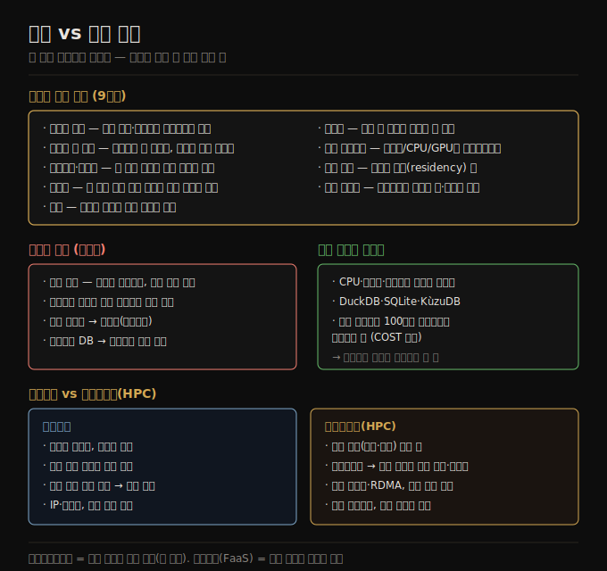

# 분산 vs 단일 노드
> 분산은 내결함성·확장성·지연 같은 이유로 필요하지만 부분 실패라는 대가가 따르며, 가능하면 단일 노드를 서두르지 않는 게 낫습니다.

이 노트를 읽고 나면 시스템을 분산으로 만드는 이유를 여러 가지로 나열하고, 분산이 단일 노드보다 어렵게 만드는 근본 원인(부분 실패)을 설명하며, 마이크로서비스가 기술이 아니라 사람 문제의 해법인 이유를 말할 수 있습니다.

여러 머신이 네트워크로 통신하는 시스템을 **분산 시스템(distributed system)** 이라 하고, 분산 시스템에 참여하는 각 프로세스를 **노드(node)** 라 부릅니다. 클라우드는 본질적으로 분산이므로([01-03](./01-03.클라우드%20vs%20셀프%20호스팅.md)), 분산이 주는 이점과 그 대가를 아는 것이 1장의 네 번째 트레이드오프 축입니다.

이 노트는 분산을 쓰는 이유, 분산이 가져오는 문제, 그리고 최근 다시 주목받는 단일 노드를 따라간 뒤, 가장 흔한 분산 방식인 마이크로서비스·서버리스와 클라우드와 결이 다른 슈퍼컴퓨팅을 살펴봅니다.

## 1. 분산을 쓰는 이유
> 본질적 분산·내결함성·확장성·지연·탄력성·특화 하드웨어·법적 준수·지속 가능성 등 여러 동기가 분산으로 이끕니다.

분산 시스템을 쓰고 싶은 이유는 여러 가지이고, 직접 작성한 애플리케이션 코드든 기성품 소프트웨어든 모두에 적용됩니다.

1. **본질적 분산** — 둘 이상의 사용자가 각자 기기로 상호작용하면 시스템은 불가피하게 분산입니다. 기기 사이 통신이 네트워크로 일어나기 때문입니다.
2. **서비스 간 요청** — 데이터가 한 서비스에 저장되고 다른 서비스에서 처리되면 그 데이터를 네트워크로 전송해야 합니다. cloud native 시스템과 마이크로서비스가 분산인 이유입니다.
3. **내결함성·고가용성** — 한 머신(또는 여러 머신, 네트워크, 데이터센터 전체)이 죽어도 애플리케이션이 계속 동작해야 하면, 여러 머신으로 중복을 둬 하나가 죽을 때 다른 하나가 인계하게 합니다.
4. **확장성** — 데이터 양이나 연산 요구가 한 머신이 감당할 수 있는 것보다 커지면 부하를 여러 머신에 분산할 수 있습니다.
5. **지연** — 전 세계에 사용자가 있으면 여러 지역에 서버를 둬, 각 사용자를 지리적으로 가까운 서버에서 응답해 패킷이 지구를 반 바퀴 도는 것을 피합니다.
6. **탄력성** — 어떤 때는 바쁘고 어떤 때는 한가하면 클라우드 배포로 수요에 맞춰 키우고 줄여 쓰는 자원만큼만 냅니다. 단일 머신은 최대 부하에 맞춰 프로비저닝해야 해 이게 더 어렵습니다.
7. **특화 하드웨어** — 부분마다 다른 하드웨어를 쓸 수 있습니다. 오브젝트 스토어는 디스크 많고 CPU 적은 머신, 분석은 CPU·메모리 많은 머신, 머신러닝은 GPU 머신처럼 워크로드에 맞춥니다.
8. **법적 준수** — 일부 국가는 자국민 데이터를 그 국가 안에서 저장·처리하라는 데이터 거주(residency) 법이 있어, 여러 관할권에 사용자가 있으면 데이터를 여러 위치에 분산해야 합니다.
9. **지속 가능성** — 작업 시점·장소에 유연성이 있으면 재생에너지가 풍부한 때·곳에서 돌려 탄소 배출을 줄이고 싼 전력을 활용할 수 있습니다.

## 2. 분산의 대가 — 부분 실패와 그 파생 문제
> 네트워크를 건너는 모든 호출은 실패 가능성을 다뤄야 하며, 이 부분 실패가 분산을 단일 노드보다 근본적으로 어렵게 만듭니다.

분산 시스템에는 단점도 있습니다. 네트워크를 건너는 모든 요청·API 호출은 실패 가능성을 다뤄야 합니다. 네트워크가 끊기거나, 서비스가 과부하·크래시될 수 있어 어떤 요청이든 응답 없이 타임아웃될 수 있습니다. 이때 서비스가 요청을 받았는지 알 수 없어, 단순히 재시도하는 것이 안전하지 않을 수 있습니다(자세한 내용은 2판 9장).

1. **느린 네트워크 호출** — 데이터센터 네트워크가 빠르긴 해도, 다른 서비스를 호출하는 것은 같은 프로세스 안 함수를 호출하는 것보다 훨씬 느립니다. 대량 데이터를 다룰 때는 데이터를 처리 머신으로 옮기는 대신 *데이터가 있는 머신으로 연산을 가져가는* 게 더 빠를 수 있습니다.
2. **더 많은 노드가 항상 빠른 건 아님** — 어떤 경우에는 한 컴퓨터의 단순 단일 스레드 프로그램이 100개가 넘는 CPU 코어 클러스터보다 크게 나을 수 있습니다(맥셰리의 "Scalability! But at What COST?" 논문).
3. **진단의 어려움** — 시스템이 느리게 응답할 때 어디가 문제인지 찾기 어렵습니다. 이를 다루는 분야가 **관측성(observability)** 이며, 시스템 실행 데이터를 모아 고수준 지표와 개별 이벤트를 함께 분석합니다. OpenTelemetry·Zipkin·Jaeger 같은 트레이싱 도구로 어느 클라이언트가 어느 서버를 어떤 연산으로 호출했고 얼마나 걸렸는지 추적합니다.
4. **서비스 간 일관성** — 서비스마다 자기 데이터베이스를 가지면 그 데이터베이스들 사이의 일관성 유지가 애플리케이션의 문제가 됩니다. **분산 트랜잭션**(2판 8장)이 한 방법이지만, 서비스를 서로 독립시키려는 목표에 어긋나고 많은 데이터베이스가 지원하지 않아 마이크로서비스 맥락에서는 거의 쓰지 않습니다.

이 모든 이유로, 단일 머신에서 작업을 수행하는 것이 분산 시스템을 세우는 것보다 흔히 더 단순하고 쌉니다.

## 3. 단일 노드의 재부상
> CPU·메모리·디스크가 커지고 빨라지면서, 단일 노드 데이터베이스로 많은 워크로드를 처리할 수 있게 됐습니다.

CPU·메모리·디스크는 더 커지고 빨라지고 신뢰성도 높아졌습니다. DuckDB·SQLite·KùzuDB 같은 단일 노드 데이터베이스와 결합하면 많은 워크로드를 한 노드에서 돌릴 수 있게 됐습니다.

여기서 책의 권고가 분명합니다 — 분산을 피할 수 없는 상황도 있지만, **단일 머신으로 유지할 수 있다면 시스템을 분산으로 만드는 일을 서두르지 않는 게 좋습니다.** 분산은 부분 실패·관측성·일관성이라는 비용을 새로 짊어지는 일이고, "더 많은 노드 = 더 빠름"이 항상 성립하지도 않기 때문입니다. 데이터셋이 한 노드 메모리·디스크에 들어오고 쿼리가 단일 노드로 충분하다면, 분산의 복잡성을 들이기 전에 단일 노드부터 검토하는 것이 합리적입니다.

## 4. 마이크로서비스와 서버리스
> 마이크로서비스는 팀이 독립적으로 일하게 하는 사람 문제의 기술 해법이고, 서버리스는 코드 실행에 미터링 과금을 가져온 배포 모델입니다.

시스템을 여러 머신에 분산하는 가장 흔한 방식은 클라이언트와 서버로 나눠 클라이언트가 서버에 요청하게 하는 것입니다. 보통 HTTP로 통신합니다. 같은 프로세스가 서버(요청 처리)이면서 클라이언트(다른 서비스로 요청)일 수 있습니다.

이 방식은 전통적으로 **서비스 지향 아키텍처(SOA)** 라 불렸고, 최근 **마이크로서비스 아키텍처** 로 다듬어졌습니다. 마이크로서비스에서 한 서비스는 잘 정의된 하나의 목적(예: S3는 파일 저장)을 갖고, 각 서비스는 네트워크로 호출되는 API를 노출하며, 한 팀이 그 유지보수를 책임집니다. 복잡한 애플리케이션을 여러 상호작용 서비스로 분해해 각각 별도 팀이 관리합니다.

서비스로 나누는 이점은 다음과 같습니다.

1. 각 서비스를 독립적으로 업데이트해 팀 간 조율 노력을 줄입니다.
2. 각 서비스에 필요한 하드웨어 자원을 따로 할당합니다.
3. 구현을 API 뒤에 숨겨, 서비스 소유자가 클라이언트에 영향을 주지 않고 구현을 바꿀 수 있습니다.

데이터 저장 면에서는 서비스마다 자기 데이터베이스를 갖고 서비스 간에 데이터베이스를 공유하지 않는 것이 흔합니다. 데이터베이스를 공유하면 그 구조 전체가 사실상 서비스 API의 일부가 돼 바꾸기 어려워지고, 한 서비스의 쿼리가 다른 서비스 성능을 해칠 수 있기 때문입니다.

다만 서비스가 많아지면 그 자체가 복잡성을 낳습니다. 개발 중 한 서비스를 테스트하려면 그것이 의존하는 다른 서비스도 모두 띄워야 하고, 각 서비스마다 배포·자원 조정·로그 수집·상태 모니터링·알림 인프라가 필요합니다. Kubernetes 같은 오케스트레이션 프레임워크가 이 인프라의 토대로 인기를 끈 이유입니다. 또 마이크로서비스 API는 진화가 까다롭습니다 — 클라이언트가 특정 필드를 기대하는데 필드를 더하거나 빼면 클라이언트가 실패할 수 있고, 그 실패가 배포 후에야 발견되곤 합니다. OpenAPI·gRPC 같은 API 기술 표준이 클라이언트·서버 API 관계를 관리하는 데 도움이 됩니다.

마이크로서비스는 **주로 사람 문제의 기술 해법** 입니다 — 서로 다른 팀이 조율 없이 독립적으로 진척을 내게 합니다. 큰 회사에서는 가치 있지만, 팀이 적은 작은 회사에서는 불필요한 오버헤드일 가능성이 커서 가능한 한 단순하게 구현하는 게 낫습니다.

**서버리스(serverless)**, 즉 **function as a service(FaaS)** 는 인프라 관리를 클라우드 벤더에 위탁하는 또 다른 배포 방식입니다. VM은 인스턴스를 언제 켜고 끌지 직접 정해야 하지만, 서버리스는 들어오는 요청에 따라 클라우드 제공자가 하드웨어 자원을 자동으로 할당·해제합니다. 클라우드 저장이 용량 계획을 미터링 과금으로 대체했듯, 서버리스는 코드 실행에 미터링 과금을 가져옵니다 — 자원을 미리 프로비저닝하는 대신 애플리케이션 코드가 도는 시간만큼만 냅니다.

이런 이점을 위해 많은 서버리스 제공자는 함수 실행 시간 제한·런타임 제한을 두고, 함수가 처음 호출될 때 느린 시작(cold start)을 겪기도 합니다. "서버리스"라는 말은 오해를 부를 수 있습니다 — 각 실행은 여전히 서버에서 돌지만, 다음 실행은 다른 서버에서 돌 수 있습니다. BigQuery·일부 Kafka 제공 서비스도 자동 확장·사용량 과금을 알리려 "서버리스" 용어를 씁니다.

## 5. 클라우드 컴퓨팅 vs 슈퍼컴퓨팅(HPC)
> HPC는 과학 계산 배치 잡으로 노드가 죽으면 전체를 멈췄다 재시작하지만, 클라우드는 부분 실패를 견디며 지속적으로 사용자를 응답합니다.

대규모 컴퓨팅을 짓는 방식이 클라우드만 있는 건 아닙니다 — **고성능 컴퓨팅(HPC)**, 즉 슈퍼컴퓨팅이 대안입니다. 겹치는 부분도 있지만 HPC는 우선순위와 기법이 클라우드와 다릅니다.

1. **용도** — 슈퍼컴퓨터는 기상 예보, 기후 모델링, 분자 동역학, 복잡한 최적화 같은 계산 집약적 과학 계산에 쓰입니다. 클라우드는 온라인 서비스·비즈니스 데이터 시스템처럼 고가용으로 사용자 요청을 처리하는 데 쓰입니다.
2. **장애 처리** — 슈퍼컴퓨터는 큰 배치 잡을 돌리며 계산 상태를 디스크에 체크포인트합니다. 노드가 죽으면 흔히 전체 클러스터 워크로드를 멈추고 고장 노드를 고친 뒤 마지막 체크포인트에서 재시작합니다. 클라우드 서비스는 사용자를 끊김 없이 응답해야 해 전체 정지가 보통 바람직하지 않습니다.
3. **통신** — 슈퍼컴퓨터 노드는 공유 메모리와 RDMA로 통신해 높은 대역폭·낮은 지연을 얻지만 사용자 간 높은 신뢰를 가정합니다. 클라우드는 네트워크·머신을 상호 불신하는 조직들이 공유해 자원 격리·암호화·인증 같은 강한 보안이 필요합니다.
4. **네트워크 토폴로지** — 클라우드 데이터센터 네트워크는 흔히 IP·이더넷에 Clos 토폴로지를 씁니다. 슈퍼컴퓨터는 다차원 메시·토러스 같은 특수 토폴로지로 알려진 통신 패턴에 더 나은 성능을 냅니다.
5. **지리적 분산** — 클라우드는 노드를 여러 지역에 분산할 수 있지만, 슈퍼컴퓨터는 보통 모든 노드가 한곳에 모여 있다고 가정합니다.

대규모 분석 시스템은 때로 슈퍼컴퓨팅과 특성을 공유하므로, 이 분야에서 일한다면 HPC 기법을 알아 둘 가치가 있습니다. 다만 이 책은 주로 지속적으로 가용해야 하는 서비스에 관심을 둡니다.

## 자주 받는 오해

1. **"노드를 더 추가하면 항상 빨라진다"** — 아닙니다. 네트워크 호출은 함수 호출보다 훨씬 느리고, 어떤 경우 단일 스레드 프로그램이 100코어 클러스터를 이기기도 합니다("at What COST?"). 분산은 부분 실패·일관성 비용을 새로 짊어지므로, 단일 노드로 되면 서두르지 않는 게 낫습니다.
2. **"마이크로서비스가 항상 더 좋은 아키텍처다"** — 마이크로서비스는 *사람 문제*(팀 독립)의 해법입니다. 팀이 적은 작은 회사에서는 테스트·배포·모니터링 오버헤드만 늘어 단순한 모놀리식이 나을 수 있습니다.
3. **"서버리스는 서버가 없다는 뜻이다"** — 각 함수 실행은 여전히 서버에서 돕니다. 다만 어느 서버인지 신경 쓰지 않고 사용량만큼 과금된다는 뜻이며, 실행 시간 제한·cold start 같은 제약이 있습니다.
4. **"분산 트랜잭션으로 서비스 간 일관성을 맞추면 된다"** — 분산 트랜잭션은 서비스를 독립시키려는 마이크로서비스 목표에 어긋나고 많은 DB가 지원하지 않아 거의 쓰이지 않습니다. 서비스 간 일관성은 보통 애플리케이션 수준에서 다른 방식으로 다룹니다.

## 면접에서 받을 만한 질문

1. **"시스템을 분산으로 만드는 이유를 들어 보라"** — 본질적 분산(여러 기기), 내결함성·고가용(중복으로 인계), 확장성(부하 분산), 지연(지역 서버), 탄력성(수요 맞춤), 특화 하드웨어(GPU 등), 법적 준수(데이터 거주), 지속 가능성(재생에너지)이 대표적입니다. 클라우드·마이크로서비스도 서비스 간 통신이라 분산입니다.
2. **"분산이 단일 노드보다 어려운 근본 이유는?"** — 부분 실패입니다. 네트워크를 건너는 요청은 타임아웃될 수 있고 도착 여부를 알 수 없어 재시도가 안전하지 않을 수 있습니다. 여기서 진단 어려움(관측성 필요)·서비스 간 일관성 문제가 파생됩니다.
3. **"마이크로서비스를 언제 쓰고 언제 피하나?"** — 팀이 많아 독립적 진척이 필요한 큰 조직에서 가치가 있습니다. 각 서비스를 독립 배포·확장하고 구현을 API 뒤에 숨깁니다. 반대로 팀이 적으면 테스트·배포·모니터링 오버헤드가 이점을 넘어서 단순한 구현이 낫습니다.
4. **"클라우드와 HPC(슈퍼컴퓨팅)의 장애 처리는 어떻게 다른가?"** — HPC는 체크포인트를 두고 노드가 죽으면 전체를 멈췄다 마지막 체크포인트에서 재시작합니다. 클라우드는 사용자를 끊김 없이 응답해야 해 전체 정지 대신 부분 실패를 견디며 계속 운영합니다.

## 관련 문서

> 이 노트는 1장의 분산 축이며, 다음 노트(법·사회)로 1장을 마무리합니다.

- [01-03 클라우드 vs 셀프 호스팅](./01-03.클라우드%20vs%20셀프%20호스팅.md) § "cloud native 아키텍처" — 클라우드가 본질적으로 분산이라는 점으로 연결
- [01-05 데이터 시스템·법·사회](./01-05.데이터%20시스템·법·사회.md) — 데이터 거주 법 등 분산을 강제하는 법적 요인으로 연결
- [1판 02-05 분산 시스템의 문제점](../02-05.분산%20시스템의%20문제점.md) — 부분 실패·합의의 1판 대응
- [ddia2 README — 2판 정독 인덱스](./README.md)
