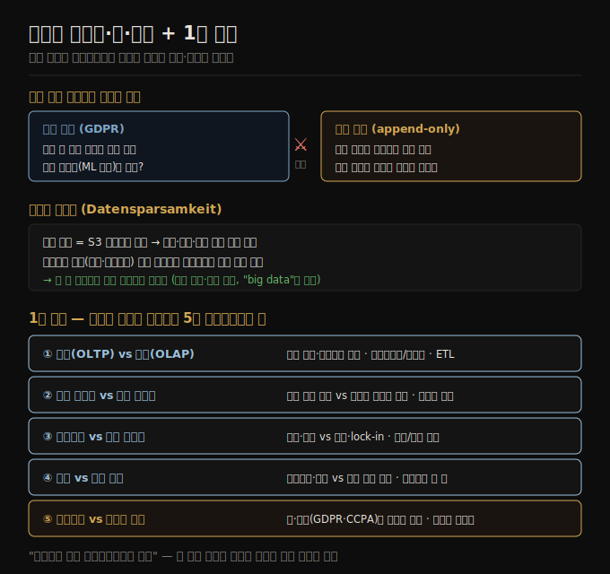

# 데이터 시스템·법·사회
> 데이터 시스템 아키텍처는 비즈니스 요구만이 아니라 사용자의 권리를 보호하는 프라이버시 규제에도 묶입니다.

이 노트를 읽고 나면 GDPR의 잊힐 권리가 왜 불변 로그 같은 설계와 충돌하는지 설명하고, 데이터 최소화 원칙이 "big data" 철학과 어떻게 대비되는지 말하며, 1장 전체의 다섯 트레이드오프 축을 한 흐름으로 요약할 수 있습니다.

지금까지 본 것처럼 데이터 시스템의 아키텍처는 기술 목표만이 아니라 그것을 떠받치는 조직의 인간적 필요에도 영향을 받습니다. 점점 더 많은 데이터 시스템 엔지니어가 자기 비즈니스의 필요를 채우는 것만으로는 충분하지 않으며, 사회 전체에 대한 책임도 있다는 것을 깨닫고 있습니다.

이 노트는 1장의 마지막 트레이드오프 축인 **비즈니스의 필요 대 사용자의 권리**를 다루고, 그 뒤에 1장 전체를 관통한 다섯 축을 한자리에 모아 정리합니다.

## 1. 법·규제 — GDPR·CCPA·AI 법
> 2018년 이후 GDPR을 비롯한 프라이버시 규제가 개인에게 자기 데이터에 대한 통제권과 법적 권리를 줬습니다.

사람과 그 행동에 대한 데이터를 저장하는 시스템이 특히 우려를 낳습니다. 2018년 이후 **GDPR**(EU 일반 개인정보보호법)은 많은 유럽 국가 주민에게 자기 개인 데이터에 대한 더 큰 통제권과 법적 권리를 줬고, 비슷한 프라이버시 규제가 세계 여러 나라·주에서 채택됐습니다(예: **CCPA**). **EU AI Act** 같은 AI 규제는 개인 데이터 사용에 추가 제약을 둡니다.

직접 규제 대상이 아닌 영역에서도 컴퓨터 시스템이 사람과 사회에 미치는 영향에 대한 인식이 커지고 있습니다. 소셜 미디어는 개인이 뉴스를 소비하는 방식을 바꿔 정치적 견해에 영향을 주고 선거 결과에 영향을 줄 수 있습니다. 자동화 시스템은 누구에게 대출·보험을 줄지, 누구를 면접에 부를지, 누구를 범죄 용의자로 볼지처럼 개인에게 큰 영향을 주는 결정을 점점 더 많이 내립니다.

이런 시스템을 다루는 모든 사람은 자기 결정의 윤리적 영향을 고려하고 관련 법을 준수할 책임을 나눠 집니다. 모두가 법·윤리 전문가가 될 필요는 없지만, 법·윤리 원칙에 대한 기본적 인식은 분산 시스템의 기초 지식만큼 중요합니다.

## 2. 법이 설계 밑바닥에 미치는 영향 — 잊힐 권리 vs 불변 로그
> GDPR의 삭제 권리는 append-only 로그 같은 불변 설계와 충돌하며, 이 충돌이 새 엔지니어링 과제를 만듭니다.

법적 고려는 데이터 시스템 설계의 바로 그 기초에 영향을 줍니다. 예를 들어 GDPR은 개인에게 요청 시 자기 데이터를 삭제할 권리(**잊힐 권리**, right to be forgotten)를 줍니다.

그런데 많은 데이터 시스템은 **append-only 로그** 같은 불변(immutable) 구조를 설계의 일부로 씁니다. 여기서 충돌이 생깁니다 — 불변이어야 하는 파일 한가운데의 데이터를 어떻게 삭제할 수 있을까요? 파생 데이터셋(예: [01-02](./01-02.기록%20시스템%20vs%20파생%20데이터.md)에서 본 ML 모델 학습 데이터)에 들어간 데이터의 삭제는 어떻게 다룰까요? 이 질문에 답하는 것이 새로운 엔지니어링 과제를 만듭니다.

현재로서는 어떤 기술·아키텍처가 GDPR을 준수하는지에 대한 명확한 지침이 없습니다. 규제는 기술이 빠르게 바뀔 수 있어 의도적으로 특정 기술을 강제하지 않고, 해석의 여지가 있는 고수준 원칙을 제시합니다. 따라서 프라이버시 규제를 준수하는 방법에 단순한 정답은 없지만, 이 책은 일부 기술을 이 렌즈로 들여다봅니다.

## 3. 데이터 최소화 — Datensparsamkeit
> 저장 비용은 요금만이 아니라 유출·평판·법적 위험을 포함하므로, 안 쓸 데이터는 아예 저장하지 않는 게 합리적입니다.

일반적으로 우리는 데이터의 가치가 저장 비용보다 크다고 생각해서 저장합니다. 그러나 저장 비용이 S3 같은 서비스에 내는 요금을 넘어선다는 것을 기억할 필요가 있습니다. 비용·이익 계산에는 데이터가 유출·탈취됐을 때의 책임·평판 손상 위험, 저장·처리가 법을 어긴 것으로 밝혀졌을 때의 법적 비용·벌금 위험도 넣어야 합니다.

정부·경찰이 회사에 데이터 제출을 강제할 수도 있습니다. 데이터가 범죄화된 행동(여러 중동·아프리카 국가의 동성애, 미국 일부 주의 낙태 시도 등)을 드러낼 수 있으면, 그 데이터를 저장하는 것 자체가 사용자에게 실제 안전 위험을 만듭니다. 예를 들어 낙태 클리닉으로의 이동은 위치 데이터로, 또는 시간에 걸친 IP 주소 로그(대략적 위치를 나타냄)로 쉽게 드러날 수 있습니다.

모든 위험을 고려하면, 어떤 데이터는 저장할 가치가 없어 삭제하는 게 합리적이라는 결론에 이를 수 있습니다. 이 **데이터 최소화(data minimization)** 원칙(독일어로 **Datensparsamkeit**)은 나중에 쓸모 있을지 모른다며 데이터를 투기적으로 잔뜩 저장하는 "big data" 철학과 대비됩니다. 데이터 최소화는 GDPR과 맞습니다 — GDPR은 개인 데이터를 명시된 명확한 목적으로만 수집하고, 이후 다른 목적으로 쓰지 않으며, 수집 목적에 필요한 기간보다 오래 보관하지 않도록 의무화합니다.

비즈니스도 프라이버시·안전 우려에 주목했습니다. 신용카드 회사는 결제 처리 업체에 엄격한 **PCI**(Payment Card Industry) 표준을 요구하고, 처리업체는 독립 감사를 자주 받습니다. 소프트웨어 벤더도 감시가 늘어, 많은 구매자가 벤더에게 **SOC**(Service Organization Control) Type 2 표준 준수를 요구하고 제3자 감사로 검증합니다. 일반적으로 비즈니스의 필요와 데이터를 수집·처리당하는 사람들의 필요 사이에서 균형을 잡는 것이 중요합니다(편향·차별 문제 등 더 깊은 내용은 2판 14장).

## 4. 1장 종합 — 데이터 시스템 아키텍처의 다섯 트레이드오프 축
> 1장은 정답이 하나가 아니라 각각 장단점이 있는 선택을 다뤘으며, 다섯 축이 그 핵심입니다.

1장의 주제는 트레이드오프를 이해하는 것이었습니다 — 많은 질문에 정답이 하나가 아니라 각각 장단점이 있는 여러 가능성이 있음을 인정하는 것입니다. 1장이 다룬 다섯 축을 한자리에 모으면 다음과 같습니다.

1. **운영(OLTP) vs 분석(OLAP)** — 다른 접근 패턴의 데이터를 다른 사용자에게 제공합니다. 데이터 웨어하우스와 데이터 레이크가 운영 시스템에서 ETL로 데이터를 받습니다. 운영과 분석은 서로 다른 내부 데이터 레이아웃을 쓰는데, 그 이유는 2판 4장에서 다룹니다([01-01](./01-01.운영%20시스템%20vs%20분석%20시스템.md)).
2. **기록 시스템 vs 파생 데이터** — 어느 데이터가 권위 있는 정본이고 어느 데이터가 거기서 파생된 재생성 가능한 중복인지의 축입니다. 도구가 아니라 쓰임이 역할을 정합니다([01-02](./01-02.기록%20시스템%20vs%20파생%20데이터.md)).
3. **클라우드 vs 셀프 호스팅** — 어느 쪽이 더 비용 효율적인지는 상황에 크게 달렸지만, cloud native 접근이 저장과 연산을 분리하는 식으로 아키텍처를 바꾸고 있습니다([01-03](./01-03.클라우드%20vs%20셀프%20호스팅.md)).
4. **분산 vs 단일 노드** — 클라우드는 본질적으로 분산이지만, 단일 머신으로 유지할 수 있다면 분산으로 서두르지 않는 게 좋습니다. 분산의 어려움은 2판 9장에서 더 다룹니다([01-04](./01-04.분산%20vs%20단일%20노드.md)).
5. **비즈니스의 필요 vs 사용자의 권리** — 아키텍처는 비즈니스 필요만이 아니라 데이터 주체의 권리를 보호하는 프라이버시 규제로도 결정됩니다. 법적 요구를 기술 구현으로 옮기는 방법은 아직 정형화되지 않았지만, 책 전반에서 이 질문을 염두에 둡니다.

토머스 소웰의 말처럼 "해결책은 없고 트레이드오프만" 있습니다. 다섯 축 모두 어느 하나가 본질적으로 더 낫지 않으며, 내 애플리케이션의 필요에 가장 잘 맞는 접근을 평가·비교하는 *올바른 질문을 던지는 법* 을 배우는 것이 1장의 목적이었습니다.

## 자주 받는 오해

1. **"GDPR 준수는 특정 기술을 쓰면 된다"** — GDPR은 기술이 빠르게 바뀔 수 있어 특정 기술을 강제하지 않고 고수준 원칙만 제시합니다. 따라서 단순한 정답은 없고, append-only 로그·파생 데이터의 삭제 같은 새 엔지니어링 과제를 각자 풀어야 합니다.
2. **"데이터는 많이 모을수록 좋다(big data)"** — 저장 비용은 요금만이 아니라 유출·평판·법적 벌금 위험을 포함합니다. 범죄화된 행동을 드러내는 데이터는 사용자에게 실제 안전 위험이 됩니다. 그래서 데이터 최소화(목적 명시·최소 보관)가 GDPR과 맞습니다.
3. **"법·윤리는 엔지니어의 일이 아니다"** — 법적 고려는 설계의 바로 그 기초(불변 로그 vs 삭제 권리 등)에 영향을 줍니다. 모두가 전문가일 필요는 없지만, 기본 인식은 분산 시스템 기초 지식만큼 중요합니다.

## 면접에서 받을 만한 질문

1. **"GDPR의 잊힐 권리가 왜 기술적으로 어려운가?"** — 많은 데이터 시스템이 append-only 로그 같은 불변 구조를 설계 기반으로 씁니다. 불변이어야 할 파일 한가운데의 데이터를 삭제하는 것, 그리고 ML 학습 데이터 같은 파생 데이터셋에 들어간 데이터를 삭제하는 것이 새 엔지니어링 과제가 됩니다.
2. **"데이터 최소화(Datensparsamkeit)가 big data와 어떻게 대비되나?"** — big data는 나중에 쓸모 있을지 모른다며 투기적으로 잔뜩 저장합니다. 데이터 최소화는 저장 비용이 요금을 넘어 유출·평판·법적·안전 위험을 포함한다고 보고, 안 쓸 데이터는 아예 저장하지 않습니다. 목적 명시·최소 보관을 의무화하는 GDPR과 맞습니다.
3. **"1장의 다섯 트레이드오프 축을 요약하라"** — ① 운영(OLTP) vs 분석(OLAP), ② 기록 시스템 vs 파생 데이터, ③ 클라우드 vs 셀프 호스팅, ④ 분산 vs 단일 노드, ⑤ 비즈니스 필요 vs 사용자 권리입니다. 공통 메시지는 정답이 하나가 아니라 상황에 맞는 균형을 찾는 것입니다.

## 관련 문서

> 이 노트는 1장의 마지막 축이자 1장 전체의 종합이며, 첫 축으로 되돌아가 흐름을 닫습니다.

- [01-04 분산 vs 단일 노드](./01-04.분산%20vs%20단일%20노드.md) § "분산을 쓰는 이유" — 데이터 거주 법 등 법적 요인이 분산을 강제하는 점으로 연결
- [01-01 운영 시스템 vs 분석 시스템](./01-01.운영%20시스템%20vs%20분석%20시스템.md) — 1장 첫 축으로 되돌아가 다섯 축의 흐름을 닫음
- [ddia2 README — 2판 정독 인덱스](./README.md)
