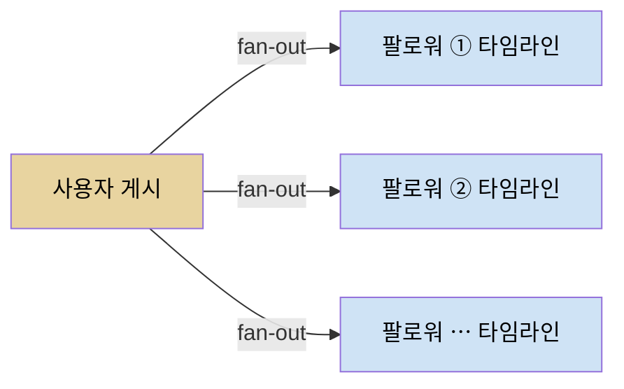
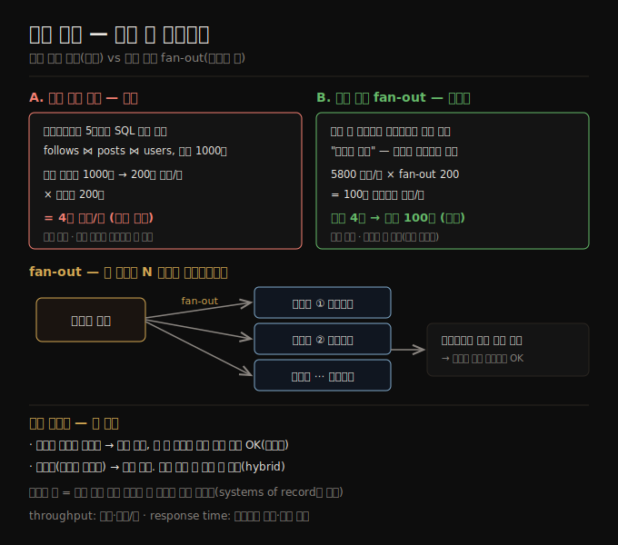

# 사례 연구 — 소셜 네트워크 홈 타임라인
> 읽기 시점에 매번 조인하는 폴링 대신, 게시 시점에 팔로워별로 미리 배달하는 fan-out으로 읽기 부하를 옮기는 것이 핵심입니다.

이 노트를 읽고 나면 읽기 시점 조인과 쓰기 시점 fan-out의 부하를 수치로 비교하고, 구체화 뷰가 읽기를 빠르게 하는 대신 쓰기에 더 일하는 트레이드오프를 설명하며, 유명인 같은 극단 케이스를 왜 따로 다뤄야 하는지 말할 수 있습니다.

2장은 **비기능 요구사항**(성능·신뢰성·확장성·유지보수성)을 다룹니다. 추상적 정의는 건조하므로, 책은 2장을 X(옛 트위터) 스타일 소셜 네트워크 사례로 시작합니다. 이 사례가 성능·확장성의 구체적 예를 제공하고, 이후 노트들이 쓸 어휘(처리량·응답 시간·fan-out·구체화 뷰)를 깔아 줍니다.

이 노트는 사례의 설정과 두 가지 타임라인 구현 방식을 따라갑니다. 가정은 다음과 같습니다 — 하루 5억 게시(평균 초당 5,800건, 스파이크 시 초당 150,000건), 평균 사용자는 200명을 팔로우하고 200명의 팔로워를 가집니다(다만 편차가 커서, 대부분은 팔로워가 소수이고 일부 유명인은 1억 명을 넘습니다).


## 1. 사용자·게시·팔로우 표현
> 사용자·게시·팔로우 세 테이블을 둔 관계형 스키마에서, 홈 타임라인은 팔로우한 사람들의 최근 게시를 조인으로 가져옵니다.

데이터를 관계형 데이터베이스에 둡니다 — 사용자(users) 테이블, 게시(posts) 테이블, 팔로우 관계(follows) 테이블 하나씩입니다. 이 소셜 네트워크가 지원해야 하는 주 읽기 연산은 **홈 타임라인** 으로, 사용자가 팔로우하는 사람들의 최근 게시를 보여 줍니다(광고·추천 게시 등 확장은 단순화를 위해 무시합니다).

특정 사용자의 홈 타임라인은 다음 SQL로 얻을 수 있습니다.

```sql
SELECT posts.*, users.* FROM posts
  JOIN follows ON posts.sender_id = follows.followee_id
  JOIN users   ON posts.sender_id = users.id
  WHERE follows.follower_id = current_user   -- 내가 팔로우하는 사람들
  ORDER BY posts.timestamp DESC              -- 최신순
  LIMIT 1000
```

이 쿼리를 실행하려면 데이터베이스는 follows 테이블로 current_user가 팔로우하는 모두를 찾고, 그 사용자들의 최근 게시를 찾아, timestamp로 정렬해 최신 1,000개를 고릅니다.

게시는 시의성이 있어야 하므로, 누군가 게시한 뒤 5초 안에 팔로워가 볼 수 있게 한다고 가정합니다. 한 방법은 사용자가 온라인인 동안 클라이언트가 5초마다 위 쿼리를 반복하는 것인데, 이를 **폴링(polling)** 이라 합니다. 동시에 로그인한 사용자가 1,000만 명이라면 초당 200만 번 쿼리를 돌린다는 뜻이고, 덜 자주 폴링해도 이건 많습니다.

이 쿼리는 비싸기도 합니다 — 200명을 팔로우하면 그 200명의 최근 게시 목록을 가져와 병합해야 합니다. 초당 200만 타임라인 쿼리 × 팔로우 200계정 = **초당 4억 조회** 라는 거대한 수입니다. 그것도 평균의 경우이고, 수만 계정을 팔로우하는 사용자에게는 이 쿼리가 너무 비싸서 빠르게 만들기 어렵습니다.


## 2. 타임라인 구체화와 갱신 — fan-out
> 게시 시점에 팔로워별 타임라인에 미리 배달해 두면, 읽기는 캐시에서 즉시 응답되고 부하가 쓰기로 옮겨갑니다.

어떻게 더 잘할 수 있을까요? 첫째, 폴링 대신 서버가 온라인 팔로워에게 새 게시를 능동적으로 밀어 주는 게 낫습니다. 둘째, 쿼리 결과를 미리 계산해 두면 홈 타임라인 요청을 캐시에서 응답할 수 있습니다.

각 사용자마다 홈 타임라인(팔로우하는 사람들의 최근 게시)을 담는 자료 구조를 저장한다고 상상해 봅니다. 사용자가 게시할 때마다 그의 모든 팔로워를 찾아 그 게시를 각 팔로워의 홈 타임라인에 삽입합니다 — 우편함에 메시지를 배달하는 것과 같습니다. 이제 사용자가 로그인하면 이 미리 계산된 타임라인을 그대로 주면 되고, 새 게시 알림은 클라이언트가 자기 타임라인에 추가되는 게시 스트림을 구독하기만 하면 됩니다.

이 방식의 단점은 사용자가 게시할 때마다 더 많은 일을 해야 한다는 것입니다. 홈 타임라인이 갱신돼야 하는 파생 데이터이기 때문입니다. 하나의 최초 요청이 여러 다운스트림 요청을 낳을 때, 요청 수가 늘어나는 배수를 **fan-out** 이라 부릅니다.



초당 5,800 게시에서 평균 게시가 200 팔로워에 닿으면(fan-out 계수 200), 초당 100만 건이 조금 넘는 홈 타임라인 쓰기가 필요합니다. 이것도 많지만, 그렇지 않았으면 해야 했을 초당 4억 게시 조회에 비하면 상당한 절감입니다.

특별한 이벤트로 게시율이 스파이크해도 타임라인 배달을 즉시 할 필요는 없습니다 — 큐에 적재하고 팔로워 타임라인에 게시가 뜨는 데 잠시 더 걸리는 것을 받아들이면 됩니다. 이런 부하 스파이크 동안에도 타임라인은 캐시에서 응답하므로 빠르게 로드됩니다.




## 3. 구체화 뷰 — 읽기를 위해 쓰기에 일한다
> 쿼리 결과를 미리 계산·갱신하는 것이 구체화이며, 타임라인 캐시는 읽기를 빠르게 하는 대신 쓰기 부담을 늘리는 구체화 뷰입니다.

쿼리 결과를 미리 계산하고 갱신하는 이 과정을 **구체화(materialization)** 라 하고, 타임라인 캐시는 **구체화 뷰(materialized view)** 의 예입니다(뒤 장들에서 더 다룹니다). 구체화 뷰는 읽기를 빠르게 하지만, 그 대가로 쓰기에 더 많은 일을 해야 합니다.

이 트레이드오프는 [01-02](./01-02.기록%20시스템%20vs%20파생%20데이터.md)의 기록/파생 구분과 맞닿습니다 — 게시 자체는 기록 시스템에 먼저 쓰이고, 팔로워별 타임라인은 거기서 파생된 구체화 뷰입니다. 타임라인을 잃어도 게시·팔로우 원본에서 다시 만들 수 있습니다.

대부분 사용자에게 쓰기 비용은 적당하지만, 소셜 네트워크는 두 극단 케이스도 고려해야 합니다.

1. **과도하게 많은 계정을 팔로우하고 그 계정들이 많이 게시하는 사용자** — 구체화 타임라인에 쓰기율이 높습니다. 다만 이 사용자가 타임라인의 모든 게시를 읽지는 않으니, 일부 타임라인 쓰기를 그냥 버리고 팔로우 계정 게시의 *샘플만* 보여 줘도 괜찮습니다.
2. **팔로워가 수백만에 이르는 유명인 계정의 게시** — 수백만 팔로워의 홈 타임라인에 삽입하는 큰 일이 듭니다. 이때는 쓰기를 버리는 게 괜찮지 않습니다. 한 해법은 유명인 게시를 다른 게시와 따로 처리하는 것입니다 — 유명인 게시를 별도로 저장해 두고, 타임라인을 *읽을 때* 구체화 타임라인과 병합합니다. 이런 최적화에도 유명인 처리는 많은 인프라를 요구할 수 있습니다.


## 자주 받는 오해

1. **"폴링으로 충분하다"** — 동시 온라인 1,000만 명에 5초 폴링이면 초당 200만 쿼리, 팔로우 200을 곱하면 초당 4억 조회가 됩니다. 읽기가 폭발하고 수만 팔로잉 사용자는 더 심해, 능동 푸시 + 구체화가 필요합니다.
2. **"fan-out이 항상 폴링보다 싸다"** — 평균적으로는 그렇지만(쓰기 100만 vs 읽기 4억), 유명인 게시는 fan-out 쓰기가 수백만 건이 돼 비쌉니다. 그래서 유명인은 fan-out하지 않고 읽을 때 병합하는 hybrid를 씁니다.
3. **"타임라인 쓰기는 절대 버리면 안 된다"** — 일반 사용자가 다 읽지 않는 타임라인은 일부 쓰기를 버려 샘플만 보여 줘도 됩니다. 다만 유명인 게시처럼 모두가 봐야 하는 쓰기는 버리면 안 됩니다 — 케이스별로 다릅니다.


## 면접에서 받을 만한 질문

1. **"소셜 타임라인을 읽기 시점 조인 대신 쓰기 시점 fan-out으로 바꾸는 이유는?"** — 읽기 시점 조인은 폴링 시 초당 4억 조회까지 폭발합니다. 쓰기 시점 fan-out은 게시할 때 팔로워 타임라인에 미리 배달해 두므로 읽기를 캐시에서 즉시 응답하고, 쓰기는 초당 약 100만 건으로 줄어듭니다. 부하를 읽기에서 쓰기로 옮기는 셈입니다.
2. **"fan-out 방식의 단점과 유명인 문제는?"** — 게시마다 팔로워 수만큼 쓰기가 늘어나는 게 단점입니다. 특히 유명인은 팔로워 수백만이라 fan-out 쓰기가 폭주합니다. 해법은 유명인 게시를 따로 저장해 두고 타임라인을 읽을 때 병합하는 hybrid입니다.
3. **"타임라인 캐시가 구체화 뷰이고 파생 데이터라는 게 무슨 뜻인가?"** — 타임라인은 게시·팔로우 원본에서 미리 계산·갱신한 결과라, 읽기를 빠르게 하는 대신 쓰기에 더 일합니다. 잃어도 원본에서 재생성할 수 있어 파생 데이터입니다. 게시 자체는 먼저 쓰이는 기록 시스템입니다.


## 관련 문서

> 이 사례는 2장의 출발점이며, 여기서 나온 처리량·응답 시간을 다음 노트가 정식 정의합니다.

- [02-02 성능 — 응답 시간과 처리량](./02-02.성능%20—%20응답%20시간과%20처리량.md) § "응답 시간과 처리량" — 게시/초·타임라인 로드 시간을 metric으로 정식화
- [01-02 기록 시스템 vs 파생 데이터](./01-02.기록%20시스템%20vs%20파생%20데이터.md) § "파생 데이터 시스템" — 타임라인 캐시가 구체화 뷰(파생)인 점으로 연결
- [ddia2 README — 2판 정독 인덱스](./README.md)
