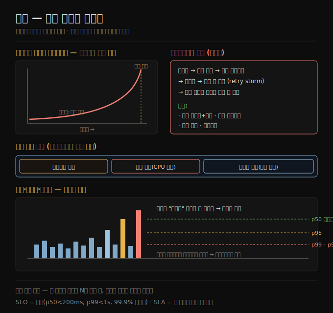

# 성능 — 응답 시간과 처리량
> 성능은 평균이 아니라 응답 시간의 분포(백분위)로 봐야 하며, 꼬리 지연이 사용자 경험을 직접 좌우합니다.

이 노트를 읽고 나면 응답 시간과 처리량을 구분해 정의하고, 왜 평균 대신 p50·p95·p99 백분위로 성능을 봐야 하는지 설명하며, 꼬리 지연 증폭과 메타스테이블 실패가 무엇인지 말할 수 있습니다.

이 노트는 2장의 첫 비기능 요구사항인 **성능**을 다룹니다. 앞 사례([02-01](./02-01.사례%20연구%20—%20소셜%20네트워크%20홈%20타임라인.md))에서 "게시/초"·"타임라인 쓰기/초"는 처리량 metric이었고 "타임라인 로드 시간"·"배달 지연"은 응답 시간 metric이었습니다. 이 둘을 정식으로 정의하고, 측정·악화·꼬리 지연·SLO/SLA를 따라갑니다.

## 1. 응답 시간과 처리량 — 두 가지 metric
> 응답 시간은 요청부터 응답까지 걸린 시간이고, 처리량은 초당 처리하는 요청·데이터 양이며, 둘은 큐잉으로 연결됩니다.

대부분의 소프트웨어 성능 논의는 두 metric을 봅니다.

1. **응답 시간(response time)** — 사용자가 요청한 순간부터 답을 받기까지 걸린 시간입니다. 단위는 초(또는 ms·µs)입니다.
2. **처리량(throughput)** — 시스템이 처리하는 초당 요청 수, 또는 초당 데이터 양입니다. 주어진 하드웨어 할당에는 처리할 수 있는 최대 처리량이 있습니다. 단위는 "초당 무언가"입니다.

처리량과 응답 시간은 흔히 연관됩니다. 온라인 서비스는 요청 처리량이 낮을 때 응답 시간이 낮지만, 부하가 늘면 응답 시간이 올라갑니다. **큐잉(queueing)** 때문입니다 — 부하가 높은 시스템에 요청이 도착하면 CPU가 이미 앞 요청을 처리 중일 가능성이 높아, 들어온 요청은 앞 요청이 끝날 때까지 기다려야 합니다. 처리량이 하드웨어가 감당할 수 있는 최대에 가까워지면 큐잉 지연이 가파르게 증가합니다.

성능 metric 면에서, 응답 시간은 보통 사용자가 가장 신경 쓰는 것이고, 처리량은 필요한 컴퓨팅 자원(서버 수)과 그에 따른 비용을 결정합니다. 처리량이 현재 하드웨어 능력을 넘어설 것 같으면 용량을 확장해야 하며, 컴퓨팅 자원을 추가해 최대 처리량을 크게 늘릴 수 있으면 그 시스템을 **확장 가능(scalable)** 하다고 합니다(확장성은 [02-04](./02-04.확장성.md)).

## 2. 과부하 시스템이 회복하지 못할 때 — 메타스테이블 실패
> 과부하 시스템은 타임아웃·재전송의 악순환(retry storm)에 빠져 부하가 줄어도 리부트 전까지 회복하지 못할 수 있습니다.

시스템이 과부하에 가까워 처리량이 한계에 밀리면, 때때로 덜 효율적이 돼 더 과부하되는 악순환에 빠질 수 있습니다. 예를 들어 긴 요청 큐가 대기하면 응답 시간이 너무 늘어 클라이언트가 타임아웃하고 요청을 재전송합니다. 이는 요청율을 더 높여 문제를 악화시키는 **retry storm** 입니다. 부하가 다시 줄어도 이런 시스템은 리부트되거나 리셋될 때까지 과부하 상태에 머물 수 있습니다. 이 현상을 **메타스테이블 실패(metastable failure)** 라 하고, 프로덕션에서 심각한 장애를 일으킬 수 있습니다.

재시도가 서비스를 과부하시키지 않게 하려면 다음을 씁니다.

1. **지수 백오프(exponential backoff) + 지터** — 클라이언트 측에서 연속 재시도 사이 시간을 늘리고 무작위화합니다.
2. **서킷 브레이커(circuit breaker) / 토큰 버킷** — 최근 에러·타임아웃한 서비스로의 요청을 일시 중단합니다.
3. **로드 셰딩(load shedding)** — 서버가 과부하에 다가가는 것을 감지해 능동적으로 요청을 거부합니다.
4. **백프레셔(backpressure)** — 클라이언트에게 속도를 늦추라는 응답을 돌려보냅니다.

큐잉·로드 밸런싱 알고리즘 선택도 차이를 만듭니다.

## 3. 지연과 응답 시간 — 용어 구분
> 응답 시간은 클라이언트가 보는 전체 시간이고, 그 안에 서비스 시간·큐잉 지연·네트워크 지연이 들어갑니다.

"지연(latency)"과 "응답 시간(response time)"은 때로 같은 뜻으로 쓰이지만, 이 책은 다음과 같이 구체적으로 구분합니다.

1. **응답 시간(response time)** — 클라이언트가 보는 것으로, 시스템 어디서든 발생한 모든 지연을 포함합니다.
2. **서비스 시간(service time)** — 서비스가 클라이언트 요청을 실제로 처리하는 동안의 시간입니다.
3. **큐잉 지연(queueing delay)** — 흐름의 여러 지점에서 발생합니다. 예를 들어 요청이 받아진 뒤 CPU가 가용해질 때까지 기다리거나, 같은 머신의 다른 작업이 네트워크를 많이 쓰면 응답 패킷이 전송 전 버퍼링될 수 있습니다.
4. **지연(latency)** — 요청이 능동적으로 처리되지 *않는*, 즉 잠재(latent) 상태인 시간을 통칭합니다. 특히 **네트워크 지연** 은 요청·응답이 네트워크를 지나는 시간입니다.

같은 요청을 반복해도 응답 시간은 요청마다 크게 달라질 수 있습니다. 배경 프로세스로의 컨텍스트 스위치, 네트워크 패킷 손실과 TCP 재전송, 가비지 컬렉션 일시 정지, 디스크 읽기를 강제하는 페이지 폴트, 서버 랙의 기계적 진동 등 많은 요인이 무작위 지연을 더합니다.

큐잉 지연은 응답 시간 변동의 큰 부분을 차지하곤 합니다. 서버는 병렬로 소수만 처리할 수 있어(예: CPU 코어 수로 제한), 느린 요청 몇 개가 뒤따르는 요청 처리를 막는 **head-of-line blocking** 이 생깁니다. 뒤 요청의 서비스 시간이 빨라도 클라이언트는 앞 요청을 기다린 탓에 느린 전체 응답을 봅니다. 큐잉 지연은 서비스 시간의 일부가 아니므로, **응답 시간을 클라이언트 측에서 측정하는 것이 중요합니다.**

## 4. 평균·중앙값·백분위 — 분포로 본다
> 평균은 전형적 응답을 알려주지 않으므로, 중앙값(p50)과 높은 백분위(p95·p99·p999)로 성능을 봅니다.

응답 시간은 요청마다 다르므로 하나의 숫자가 아니라 측정 가능한 *값의 분포* 로 봐야 합니다. 대부분의 요청은 꽤 빠르지만 가끔의 이상치(outlier)는 훨씬 오래 걸립니다(네트워크 지연의 변동을 **jitter** 라고도 합니다).

서비스의 **평균(arithmetic mean)** 응답 시간을 보고하는 게 흔합니다. 평균은 처리량 한계를 추정하는 데 쓸모가 있지만, "전형적" 응답 시간을 알고 싶다면 좋은 metric이 아닙니다. 얼마나 많은 사용자가 실제로 그 지연을 겪었는지 알려주지 않기 때문입니다.

보통은 **백분위(percentile)** 가 낫습니다. 응답 시간을 빠른 것부터 느린 것까지 정렬하면 **중앙값(median)** 은 중간 지점입니다 — 중앙값이 200ms면 절반의 요청은 200ms 미만, 절반은 그 이상이라는 뜻입니다. 중앙값은 사용자가 보통 얼마나 기다리는지 알고 싶을 때 좋은 metric이고, **50번째 백분위(p50)** 라고도 합니다.

이상치가 얼마나 나쁜지 보려면 더 높은 백분위를 봅니다 — 95·99·99.9번째(p95·p99·p999)가 흔합니다. 예를 들어 p95가 1.5초면 100개 중 95개는 1.5초 미만, 5개는 1.5초 이상이라는 뜻입니다.

높은 응답 시간 백분위, 즉 **꼬리 지연(tail latency)** 은 사용자의 서비스 경험에 직접 영향을 주어 중요합니다. 예를 들어 Amazon은 내부 서비스 응답 시간 요구를 p999로 표현하는데, 이는 1,000건 중 1건에만 영향을 주는데도 그렇습니다. 가장 느린 요청을 겪는 고객은 흔히 계정에 데이터가 가장 많은 — 구매를 많이 한 가장 가치 있는 — 고객이기 때문입니다. 반대로 p9999(10,000건 중 가장 느린 1건)를 최적화하는 것은 너무 비싸고 충분한 이득이 없다고 Amazon은 판단했습니다. 이렇게 높은 백분위의 응답 시간은 통제 밖 무작위 사건에 쉽게 영향받고 이득이 줄어들어 줄이기 어렵습니다.

## 5. 응답 시간 metric의 사용 — 꼬리 지연 증폭과 SLO/SLA
> 한 요청에 여러 백엔드 호출이 필요하면 하나만 느려도 전체가 느려지며, 백분위는 SLO·SLA로 성능 목표를 정의하는 데 쓰입니다.

높은 백분위는 단일 최종 사용자 요청을 처리하며 여러 번 호출되는 백엔드 서비스에서 특히 중요합니다. 호출을 병렬로 해도 요청은 가장 느린 병렬 호출이 끝나기를 기다려야 합니다. 느린 호출 하나가 전체 최종 사용자 요청을 느리게 만듭니다. 백엔드 호출의 일부만 느려도, 최종 사용자 요청이 여러 백엔드 호출을 요구하면 느린 호출을 만날 확률이 올라가 더 높은 비율의 요청이 느려집니다 — 이를 **꼬리 지연 증폭(tail latency amplification)** 이라 합니다.

백분위는 **SLO(service level objective)** 와 **SLA(service level agreement)** 에서 서비스의 기대 성능·가용성을 정의하는 데 자주 쓰입니다. 예를 들어 SLO는 "중앙값 응답 시간 200ms 미만, p99 1초 미만, 유효 요청의 99.9% 이상이 비에러 응답"을 목표로 둘 수 있습니다. **SLA** 는 SLO를 못 지키면 어떻게 되는지(예: 고객 환불) 명시하는 계약입니다. 다만 실무에서 SLO·SLA용 좋은 가용성 metric을 정의하는 것은 간단하지 않습니다.

백분위를 모니터링 대시보드에 더하려면 지속적으로 효율적으로 계산해야 합니다. 가장 단순한 구현은 시간 창의 모든 응답 시간 목록을 두고 매분 정렬하는 것이지만, 비효율적이면 최소 CPU·메모리로 좋은 근사를 계산하는 알고리즘이 있습니다 — HdrHistogram, t-digest, OpenHistogram, DDSketch 같은 오픈소스 라이브러리입니다.

> ⚠️ 백분위를 평균내는 것(시간 해상도를 줄이거나 여러 머신 데이터를 합치려고)은 수학적으로 무의미합니다. 응답 시간 데이터를 올바르게 집계하는 방법은 **히스토그램을 더하는 것** 입니다.

## 자주 받는 오해

1. **"평균 응답 시간으로 성능을 보면 된다"** — 평균은 처리량 한계 추정엔 쓸모 있지만 전형적 응답을 알려주지 않습니다. 몇 명이 그 지연을 실제로 겪었는지 모르기 때문입니다. 중앙값(p50)과 꼬리 백분위(p95·p99)로 분포를 봐야 합니다.
2. **"여러 머신의 p99를 평균내면 전체 p99다"** — 백분위 평균은 수학적으로 무의미합니다. 히스토그램을 더해서 집계해야 합니다.
3. **"꼬리 지연(p999)은 1,000건 중 1건이라 무시해도 된다"** — 가장 느린 요청을 겪는 고객이 흔히 데이터가 가장 많은 가치 있는 고객이고, 한 요청에 백엔드 호출이 여러 개면 꼬리 지연 증폭으로 느린 요청 비율이 커집니다. 그래서 Amazon도 p999로 목표를 잡습니다.
4. **"부하가 줄면 과부하는 자동으로 풀린다"** — 메타스테이블 실패에서는 retry storm으로 부하가 줄어도 리부트 전까지 회복하지 못합니다. 지수 백오프·서킷 브레이커·로드 셰딩·백프레셔로 악순환을 끊어야 합니다.

## 면접에서 받을 만한 질문

1. **"응답 시간과 처리량의 차이는? 둘은 어떻게 연관되나?"** — 응답 시간은 요청부터 응답까지 걸린 시간(사용자가 신경 쓰는 것)이고, 처리량은 초당 처리하는 요청·데이터 양(필요 자원·비용을 결정)입니다. 큐잉으로 연관되어, 처리량이 용량 한계에 가까워지면 요청이 대기하며 응답 시간이 가파르게 올라갑니다.
2. **"왜 평균이 아니라 백분위로 응답 시간을 보나?"** — 평균은 몇 명이 그 지연을 실제로 겪었는지 안 알려줍니다. 중앙값(p50)은 사용자가 보통 얼마나 기다리는지, p95·p99·p999는 이상치가 얼마나 나쁜지를 보여 줍니다. 꼬리 지연은 가치 있는 고객의 경험에 직접 영향을 줘 중요합니다.
3. **"꼬리 지연 증폭이 무엇인가?"** — 한 최종 사용자 요청이 여러 백엔드 호출을 요구하면, 병렬로 해도 가장 느린 호출을 기다려야 합니다. 호출 일부만 느려도 호출 수가 많으면 느린 호출을 만날 확률이 올라가, 결과적으로 더 높은 비율의 요청이 느려집니다.
4. **"메타스테이블 실패를 어떻게 막나?"** — 과부하 → 타임아웃 → 재전송의 retry storm을 끊어야 합니다. 클라이언트 측 지수 백오프+지터, 서킷 브레이커로 재시도 억제, 서버 측 로드 셰딩으로 능동 거부, 백프레셔로 속도 늦춤 요청을 씁니다.

## 관련 문서

> 이 노트는 2장의 성능 축이며, 신뢰성·확장성 노트와 이어집니다.

- [02-01 사례 연구 — 소셜 홈 타임라인](./02-01.사례%20연구%20—%20소셜%20네트워크%20홈%20타임라인.md) — 게시/초·타임라인 로드 시간의 처리량·응답 시간 출처
- [02-03 신뢰성과 내결함성](./02-03.신뢰성과%20내결함성.md) § "내결함성" — SLO 미달이 곧 failure라는 점으로 연결
- [02-04 확장성](./02-04.확장성.md) § "부하 이해" — 부하 증가 시 성능 유지가 확장성이라는 점으로 연결
- [ddia2 README — 2판 정독 인덱스](./README.md)
