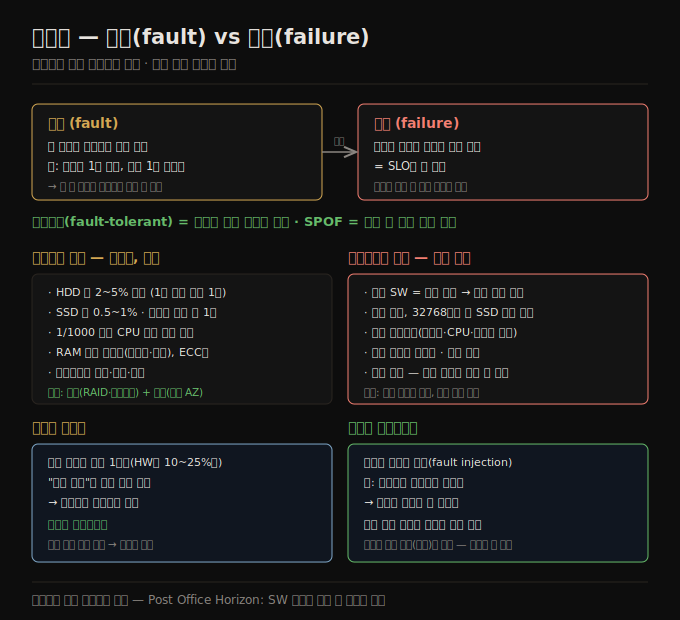

# 신뢰성과 내결함성
> 신뢰성은 "잘못돼도 계속 올바르게 동작하는 것"이며, 결함을 막기보다 견디는 내결함성으로 달성합니다.

이 노트를 읽고 나면 결함(fault)과 장애(failure)를 층위로 구분하고, 하드웨어 결함이 독립적인 반면 소프트웨어 결함은 왜 강하게 상관되는지 설명하며, "인적 오류"를 비난 대신 사회기술 시스템의 증상으로 보는 무비난 포스트모템을 말할 수 있습니다.

이 노트는 2장의 두 번째 비기능 요구사항인 **신뢰성**을 다룹니다. 소프트웨어에 대한 전형적 기대는 사용자가 기대한 기능을 수행하고, 사용자의 실수·예상 밖 사용을 견디고, 기대 부하·데이터 양에서 성능이 충분하고, 무단 접근·남용을 막는 것입니다. 이 모두를 묶어 "올바르게 동작"이라 하면, 신뢰성은 대략 **"잘못되는 일이 생겨도 계속 올바르게 동작하는 것"** 입니다.

## 1. 결함과 장애 — 같은 것, 다른 층위
> 결함은 한 부분이 멈추는 것이고 장애는 시스템 전체가 멈추는 것이며, 같은 사건이 어느 층위에서 보느냐에 따라 달라집니다.

"잘못되는 일"을 더 정확히 하려고 **결함(fault)** 과 **장애(failure)** 를 구분합니다.

1. **결함(fault)** — 시스템의 특정 부분이 올바르게 동작하기를 멈출 때입니다. 예를 들어 하드 드라이브 하나가 오작동하거나, 머신 하나가 크래시하거나, 의존하는 외부 서비스가 중단될 때입니다.
2. **장애(failure)** — 시스템 전체가 사용자에게 필요한 서비스를 제공하기를 멈출 때, 즉 SLO를 못 지킬 때입니다.

결함과 장애의 구분이 혼란스러운 이유는 둘이 *같은 것을 다른 층위에서* 본 것이기 때문입니다. 하드 드라이브 하나가 멈추면 그 드라이브가 "장애"났다고 말하고, 시스템이 그 드라이브 하나뿐이면 시스템도 장애난 것입니다. 그러나 시스템이 드라이브 여러 개로 이뤄지면, 드라이브 하나의 장애는 더 큰 시스템 관점에선 *결함일 뿐* 이고, 다른 드라이브에 데이터 사본을 둬 그 결함을 견딜 수 있습니다.

## 2. 내결함성 — 결함을 견디기, 일부러 주입하기
> 특정 결함이 나도 서비스를 지속하면 내결함성이며, 결함을 일부러 주입해 내결함 기계를 늘 시험하는 것이 카오스 엔지니어링입니다.

특정 결함이 발생해도 사용자에게 필요한 서비스를 계속 제공하면 그 시스템을 **내결함성(fault-tolerant)** 이 있다고 합니다. 어떤 부분이 결함나는 것을 견딜 수 없으면 그 부분을 **단일 장애점(SPOF, single point of failure)** 이라 합니다. 그 부분의 결함이 시스템 전체의 장애로 확대되기 때문입니다.

예를 들어 [02-01](./02-01.사례%20연구%20—%20소셜%20네트워크%20홈%20타임라인.md) 사례에서 fan-out 중 구체화 타임라인을 갱신하는 머신이 크래시할 수 있습니다. 이 과정을 내결함성 있게 만들려면, 다른 머신이 배달했어야 할 게시를 놓치거나 중복하지 않고 이 작업을 인계할 수 있어야 합니다(이를 **exactly-once 의미론** 이라 하고 2판 12장에서 다룹니다).

내결함성은 항상 특정 유형의 결함을 특정 개수까지로 한정됩니다. 디스크 두 개 동시 고장, 또는 세 노드 중 하나 크래시까지 견디는 식입니다. 어떤 개수의 결함이든 견디는 것은 말이 안 됩니다 — 모든 노드가 크래시하면 할 수 있는 게 없습니다. 지구 전체가 블랙홀에 빨려 들어가는 결함을 견디려면 우주에 웹 호스팅을 해야 하는데, 그 예산 항목 승인은 받기 어려울 것입니다.

직관과 달리, 이런 내결함성 시스템에서는 결함을 *일부러 유발해* 결함율을 높이는 게 합리적일 수 있습니다 — 예를 들어 경고 없이 개별 프로세스를 무작위로 죽이는 것입니다. 이를 **결함 주입(fault injection)** 이라 합니다. 많은 치명적 버그가 실제로 부실한 에러 처리 때문인데, 일부러 결함을 유발하면 내결함 기계가 끊임없이 시험돼 결함이 자연 발생할 때 올바르게 처리되리라는 확신이 커집니다. **카오스 엔지니어링(chaos engineering)** 은 일부러 결함을 주입하는 실험으로 내결함 메커니즘에 대한 확신을 높이려는 분야입니다.

일반적으로 결함을 막기보다 견디는 것을 선호하지만, 예방이 치료보다 나은 경우(치료법이 없어서)도 있습니다. 보안이 그렇습니다 — 공격자가 시스템을 침해해 민감 데이터에 접근하면 그 사건은 되돌릴 수 없습니다. 다만 이 책은 대부분 치료할 수 있는 종류의 결함을 다룹니다.

## 3. 하드웨어 결함 — 독립적, 중복으로 견딘다
> 하드웨어 결함은 대체로 독립적이라 중복(RAID·이중 전원)으로 견디지만, 대규모에서는 흔해 정상 운영의 일부가 됩니다.

시스템 장애 원인을 떠올릴 때 하드웨어 결함이 먼저 떠오릅니다.

1. 자기 하드 드라이브는 연 2~5% 고장합니다. 디스크 1만 개 클러스터면 평균 하루 1개 고장을 예상해야 합니다.
2. SSD는 연 0.5~1% 고장하고, 작은 비트 오류는 자동 정정되지만 비정정 오류가 드라이브당 연 1회쯤 발생합니다(꽤 새 드라이브에서도).
3. 전원 공급 장치·RAID 컨트롤러·메모리 모듈도 고장하지만 디스크보다는 덜합니다.
4. 약 1,000대 중 1대는 제조 결함으로 가끔 잘못된 결과를 계산하는 CPU 코어를 가집니다. 크래시로 이어지기도, 그냥 틀린 결과를 반환하기도 합니다.
5. RAM 데이터가 우주선 같은 무작위 사건이나 영구적 물리 결함으로 손상될 수 있습니다. ECC 메모리를 써도 1% 넘는 머신이 연간 비정정 오류를 겪습니다.
6. 데이터센터 전체가 정전·네트워크 오설정으로 불가용해지거나 화재·홍수·지진으로 영구 파괴될 수 있습니다.

이런 사건은 작은 시스템에서는 고장난 하드웨어를 쉽게 교체할 수 있는 한 자주 걱정하지 않아도 될 만큼 드뭅니다. 그러나 대규모 시스템에서는 하드웨어 결함이 충분히 자주 일어나 *정상 시스템 운영의 일부* 가 됩니다.

첫 대응은 보통 개별 하드웨어 컴포넌트에 **중복(redundancy)** 을 더해 시스템 고장률을 낮추는 것입니다 — RAID(여러 디스크에 데이터 분산), 이중 전원, 핫 스왑 CPU, 배터리·디젤 발전기 백업입니다. 중복은 컴포넌트 결함이 *독립적* 일 때(한 결함이 다른 결함 가능성을 바꾸지 않을 때) 가장 효과적이지만, 경험상 컴포넌트 고장 사이에 상당한 상관이 나타나곤 합니다.

하드웨어 중복은 단일 머신의 가동 시간을 늘리지만, [01-04](./01-04.분산%20vs%20단일%20노드.md)에서 봤듯 분산 시스템은 데이터센터 전체 중단을 견디는 이점이 있습니다. 그래서 클라우드 시스템은 개별 머신 신뢰성보다 소프트웨어 수준에서 결함 노드를 견뎌 서비스를 고가용으로 만드는 데 초점을 둡니다. 클라우드 제공자는 **가용 영역(availability zone)** 으로 물리적으로 같은 곳에 있는 자원을 식별합니다 — 같은 곳의 자원은 지리적으로 떨어진 자원보다 동시에 고장날 가능성이 높습니다.

전체 머신·랙·가용 영역의 손실을 견디는 시스템은 운영상 이점도 있습니다. 단일 서버 시스템은 OS 보안 패치를 적용하려 리부트하면 계획된 다운타임이 필요하지만, 다중 노드 내결함성 시스템은 한 번에 한 노드씩 재시작해 사용자 서비스에 영향 없이 패치할 수 있습니다 — 이를 **롤링 업그레이드(rolling upgrade)** 라 하며 2판 5장에서 다룹니다.

## 4. 소프트웨어 결함 — 강하게 상관된다
> 많은 노드가 같은 소프트웨어를 돌려 같은 버그를 공유하므로, 소프트웨어 결함은 강하게 상관되어 더 많은 장애를 일으킵니다.

하드웨어 고장은 약하게 상관될 수 있어도 대체로 독립적입니다 — 디스크 하나가 고장나도 같은 머신의 다른 디스크는 한동안 괜찮습니다. 반면 **소프트웨어 결함은 흔히 강하게 상관됩니다.** 많은 노드가 같은 소프트웨어를 돌려 같은 버그를 갖기 때문입니다. 이런 결함은 예측하기 더 어렵고, 상관 없는 하드웨어 결함보다 훨씬 많은 시스템 장애를 일으키는 경향이 있습니다. 예는 다음과 같습니다.

1. 특정 상황에서 모든 노드를 동시에 죽이는 버그 — 2012년 6월 30일 윤초가 Linux 커널 버그로 많은 Java 애플리케이션을 동시에 멈춰 여러 인터넷 서비스를 다운시켰습니다. 또 펌웨어 버그로 특정 모델 SSD가 정확히 32,768시간(4년 미만) 가동 후 일제히 고장나 데이터를 복구 불능으로 만들었습니다.
2. 공유·제한된 자원(CPU·메모리·디스크·네트워크·스레드)을 다 써버리는 폭주 프로세스 — 큰 요청 처리 중 메모리를 너무 써 OS에 죽거나, 클라이언트 라이브러리 버그로 예상보다 훨씬 많은 요청량을 낼 수 있습니다.
3. 의존하는 서비스가 느려지거나, 무응답이 되거나, 손상된 응답을 반환하기 시작합니다.
4. 시스템 간 상호작용이 각각 격리 테스트에선 없던 창발적(emergent) 행동을 낳습니다.
5. **연쇄 실패(cascading failure)** — 한 컴포넌트의 문제가 다른 컴포넌트를 과부하·둔화시키고, 그게 또 다른 컴포넌트를 무너뜨립니다.

이런 소프트웨어 결함을 일으키는 버그는 비정상적 상황이 유발하기 전까지 오래 휴면합니다. 그 상황에서, 소프트웨어가 환경에 대해 어떤 가정을 하고 있었음이 — 그 가정이 보통은 참이지만 어떤 이유로 결국 참이 아니게 됨이 — 드러납니다. 체계적 소프트웨어 결함에는 빠른 해법이 없습니다. 작은 것들이 도움이 됩니다 — 시스템의 가정·상호작용을 신중히 따지기, 철저한 테스트, 프로세스 격리, 프로세스 크래시·재시작 허용, retry storm 같은 피드백 루프 피하기, 프로덕션에서 행동 측정·모니터링·분석하기입니다.

## 5. 사람과 신뢰성 — 무비난 포스트모템
> "인적 오류"는 사건의 원인이 아니라 사회기술 시스템 문제의 증상이며, 처벌 대신 무비난 포스트모템으로 학습합니다.

사람이 소프트웨어를 설계·구축하고, 운영하는 사람도 사람입니다. 사람은 규칙만 따르지 않고 창의적·적응적으로 일을 해내는 강점이 있지만, 이 특성은 예측 불가능성과 때때로 장애로 이어지는 실수도 낳습니다. 한 대형 인터넷 서비스 연구는 운영자의 설정 변경이 장애의 주원인이었고 하드웨어 결함은 10~25%만 관여했다고 보고합니다.

이런 문제를 "인적 오류"로 이름 붙이고 더 엄격한 절차·규칙 준수로 사람 행동을 통제하면 해결되리라 바라기 쉽습니다. 그러나 실수로 사람을 비난하는 것은 역효과입니다. **우리가 "인적 오류"라 부르는 것은 사건의 원인이 아니라, 사람들이 최선을 다해 일하는 사회기술(sociotechnical) 시스템 문제의 증상입니다.** 복잡한 시스템은 흔히 창발적 행동을 보여, 컴포넌트 간 예상 밖 상호작용도 장애로 이어집니다.

여러 기술적 조치가 사람 실수의 영향을 줄입니다 — 철저한 테스트(수기 테스트 + 무작위 입력 속성 테스트), 설정 변경을 빠르게 되돌리는 롤백, 새 코드의 점진적 출시, 상세·명확한 모니터링, 프로덕션 진단용 관측성 도구, "옳은 일"을 권하고 "그른 일"을 막는 잘 설계된 인터페이스입니다. 다만 이 모두는 시간·돈 투자가 필요하고, 일상 비즈니스 현실에서 조직은 흔히 회복력보다 매출 창출 활동을 우선합니다. 더 많은 기능과 더 많은 테스트 중 많은 조직이 기능을 택합니다. 그러다 예방 가능한 실수가 결국 일어나면, 실수한 사람을 비난하는 것은 말이 안 됩니다 — 문제는 조직의 우선순위입니다.

점점 더 많은 조직이 **무비난 포스트모템(blameless postmortem)** 문화를 채택합니다 — 사건 후 관련자들이 처벌 두려움 없이 무슨 일이 있었는지 전말을 공유하도록 장려해, 조직의 다른 사람들이 비슷한 문제를 막는 법을 배우게 합니다. 사건을 조사할 때는 단순한 답을 경계해야 합니다. "Bob이 그 변경을 배포할 때 더 조심했어야 했다"는 생산적이지 않고, "백엔드를 Haskell로 다시 써야 한다"도 마찬가지입니다. 대신 경영진은 매일 그 시스템과 일하는 사람들의 관점에서 사회기술 시스템이 어떻게 동작하는지 배우고, 그 피드백을 바탕으로 개선해야 합니다.

## 6. 신뢰성은 얼마나 중요한가 — Horizon 사례
> 평범한 애플리케이션도 신뢰성이 기대되며, Post Office Horizon 사건은 소프트웨어 버그가 사람을 어떻게 해칠 수 있는지 보여 줍니다.

신뢰성은 원전·항공 관제만의 것이 아니라 평범한 애플리케이션에도 기대됩니다. 비즈니스 앱 버그는 생산성 손실(수치가 잘못 보고되면 법적 위험)을 낳고, 이커머스 사이트 중단은 매출 손실·평판 손상의 큰 비용을 낳습니다. 많은 앱에서 몇 분~몇 시간의 일시 중단은 견딜 만하지만, 영구적 데이터 손실·손상은 치명적입니다. 자녀의 모든 사진·영상을 당신의 사진 앱에 저장한 부모를 생각해 보면 — 그 DB가 갑자기 손상되면 어떤 기분일지, 백업에서 복원할 줄이나 알지 떠올려 봅니다.

신뢰성 없는 소프트웨어가 사람을 해친 예로 **Post Office Horizon 사건** 이 있습니다. 1999~2019년 영국에서 우체국 지점을 운영하던 수백 명이 회계 소프트웨어가 계정에 부족액을 표시했다는 이유로 절도·사기로 유죄를 받았습니다. 결국 이 부족액 다수가 소프트웨어 버그 탓임이 밝혀져 많은 유죄가 뒤집혔습니다. 영국 역사상 가장 큰 오심일 이 사건의 배경에는, *반대 증거가 없는 한 컴퓨터는 올바르게 작동한다(따라서 컴퓨터가 만든 증거는 신뢰할 수 있다)* 는 영국법의 가정이 있었습니다. 소프트웨어 엔지니어는 버그 없는 소프트웨어라는 발상을 비웃을 수 있지만, 이는 신뢰성 없는 컴퓨터 시스템 때문에 억울하게 투옥되거나 파산하거나 심지어 목숨을 끊은 사람들에게는 위로가 되지 않습니다.

때로는 개발 비용을 줄이려 신뢰성을 희생하기도 합니다(검증 안 된 시장의 프로토타입 개발 등). 다만 언제 모서리를 깎고 있는지를 분명히 의식하고 잠재적 결과를 염두에 둬야 합니다.

## 자주 받는 오해

1. **"결함과 장애는 같은 말이다"** — 같은 사건을 다른 층위에서 본 것입니다. 디스크 하나 고장은 그 디스크에겐 장애지만, 사본을 둔 더 큰 시스템에겐 견딜 수 있는 결함입니다. 결함이 격리 안 되고 전체로 확대되면 장애(SLO 미달)가 됩니다.
2. **"하드웨어 중복이면 신뢰성은 충분하다"** — 하드웨어 중복은 단일 머신 가동 시간을 늘리지만, 데이터센터 전체 중단은 못 견딥니다. 컴포넌트 고장도 상관될 수 있습니다. 그래서 클라우드는 소프트웨어 수준에서 결함 노드를 견뎌 여러 AZ로 분산합니다.
3. **"소프트웨어 결함도 하드웨어처럼 독립적이다"** — 반대입니다. 많은 노드가 같은 소프트웨어·같은 버그를 공유해 강하게 상관됩니다. 윤초·32768시간 SSD 버그처럼 모든 노드가 동시에 죽어 하드웨어 결함보다 큰 장애를 냅니다.
4. **"장애는 인적 오류 탓이니 절차를 강화하면 된다"** — "인적 오류"는 원인이 아니라 사회기술 시스템 문제의 증상입니다. 비난은 역효과이고, 무비난 포스트모템으로 조직 우선순위·인터페이스·인센티브를 고치는 게 학습으로 이어집니다.

## 면접에서 받을 만한 질문

1. **"결함(fault)과 장애(failure)의 차이는?"** — 결함은 한 부분이 올바르게 동작하기를 멈추는 것(디스크 1개 고장 등)이고, 장애는 시스템 전체가 서비스를 멈추는 것(SLO 미달)입니다. 같은 사건이 층위에 따라 달라져, 사본을 둔 시스템은 디스크 결함을 견뎌 장애로 확대되지 않게 합니다.
2. **"내결함성을 높이려 결함을 일부러 주입하는 이유는?"** — 치명 버그 다수가 부실한 에러 처리 때문이라, 일부러 결함을 주입(무작위 프로세스 종료 등)하면 내결함 기계가 끊임없이 시험됩니다. 자연 발생 시 올바르게 처리되리라는 확신이 커집니다 — 이것이 카오스 엔지니어링입니다.
3. **"소프트웨어 결함이 하드웨어 결함보다 다루기 어려운 이유는?"** — 하드웨어 결함은 대체로 독립적이지만, 소프트웨어 결함은 많은 노드가 같은 버그를 공유해 강하게 상관됩니다. 윤초·SSD 32768시간 버그처럼 모든 노드가 동시에 죽고, 휴면 버그는 환경 가정이 깨질 때 예측 못 한 채 발현합니다.
4. **"무비난 포스트모템이 왜 효과적인가?"** — "인적 오류"는 원인이 아니라 사회기술 시스템 문제의 증상이라, 비난하면 사람들이 전말을 숨겨 학습이 막힙니다. 처벌 없이 공유하게 하면 조직이 우선순위·인터페이스·인센티브의 진짜 문제를 찾아 고칠 수 있습니다.

## 관련 문서

> 이 노트는 2장의 신뢰성 축이며, 성능·확장성·분산 노트와 이어집니다.

- [02-02 성능 — 응답 시간과 처리량](./02-02.성능%20—%20응답%20시간과%20처리량.md) § "응답 시간 metric의 사용" — SLO 미달이 곧 failure 정의라는 점으로 연결
- [02-04 확장성](./02-04.확장성.md) § "shared-nothing 아키텍처" — 분산으로 내결함성을 얻는 점으로 연결
- [01-04 분산 vs 단일 노드](./01-04.분산%20vs%20단일%20노드.md) § "분산을 쓰는 이유" — 내결함성·고가용이 분산의 동기인 점으로 연결
- [ddia2 README — 2판 정독 인덱스](./README.md)
