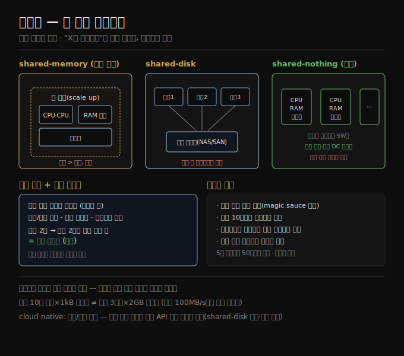

# 확장성
> 확장성은 부하 증가에 대처하는 능력이며, "X는 확장된다"가 아니라 "어떤 차원으로 늘면 어떻게 대처하는가"의 문제입니다.

이 노트를 읽고 나면 부하를 처리량·읽기쓰기 비율 같은 차원으로 기술하고, shared-memory·shared-disk·shared-nothing 세 아키텍처를 비교하며, 선형 확장성이 무엇이고 확장성 원칙이 왜 "작은 부분으로 분해 + 불필요한 복잡성 회피"인지 말할 수 있습니다.

이 노트는 2장의 세 번째 비기능 요구사항인 **확장성**을 다룹니다. 오늘 신뢰성 있게 동작해도 미래에 그러리라는 보장은 없고, 흔한 악화 원인이 부하 증가입니다 — 동시 사용자가 1만에서 10만으로, 데이터가 100만에서 1,000만으로 늘 수 있습니다. 확장성은 시스템이 이런 증가에 대처하는 능력을 가리킵니다.

"당신은 Google이나 Amazon이 아니니 규모 걱정 말고 그냥 관계형 DB를 쓰라"는 격언이 있습니다. 이게 맞는지는 만드는 애플리케이션 유형에 달렸습니다. 사용자가 적은 새 제품(스타트업 등)이라면 주된 엔지니어링 목표는 보통 시스템을 단순·유연하게 유지해 고객 필요를 배우며 쉽게 수정·적응하는 것입니다. 이런 환경에서 미래에 필요할지 모를 가상의 규모를 걱정하는 것은 역효과입니다 — 잘해야 조숙한 최적화로 낭비되고, 잘못하면 유연하지 못한 설계에 갇혀 진화를 어렵게 합니다.

## 1. 부하 이해 — 차원으로 기술한다
> 확장성을 논하려면 먼저 현재 부하를 처리량·읽기쓰기 비율 같은 차원으로 명확히 기술해야 합니다.

확장성은 1차원 라벨이 아니라서 "X는 확장 가능"·"Y는 확장 안 됨"이라는 말은 무의미합니다. 확장성을 논한다는 것은 다음 질문을 따지는 것입니다.

1. 시스템이 특정 방식으로 성장하면, 그 성장에 대처할 선택지는 무엇인가?
2. 추가 부하를 처리하려 컴퓨팅 자원을 어떻게 더할 수 있는가?
3. 현재 성장 추세로 볼 때, 현재 아키텍처의 한계에 언제 부딪히는가?

먼저 시스템의 현재 부하를 명확히 이해해야 합니다. 그래야 "부하가 2배가 되면?" 같은 성장 질문을 논할 수 있습니다. 흔히 이것은 처리량 측정입니다 — 초당 요청 수, 하루 도착 데이터 GB, 시간당 장바구니 결제 수입니다. 때로는 변동량의 *피크* 가 중요합니다(사례의 동시 온라인 사용자 수처럼).

부하의 다른 통계적 특성이 접근 패턴과 확장성 요구에 영향을 주기도 합니다 — DB의 읽기/쓰기 비율, 캐시 적중률, 사용자당 데이터 항목 수(사례의 팔로워 수) 같은 것입니다. 평균이 중요할 수도, 소수의 극단 케이스가 병목을 지배할 수도 있어 애플리케이션 세부에 달렸습니다.

부하를 이해하면 부하 증가 시 무슨 일이 생기는지 두 방식으로 볼 수 있습니다.

1. 부하를 특정 방식으로 늘리고 시스템 자원(CPU·메모리·네트워크 등)을 그대로 두면, 성능이 어떻게 영향받는가?
2. 부하를 특정 방식으로 늘릴 때, 성능을 그대로 유지하려면 자원을 얼마나 늘려야 하는가?

보통 목표는 시스템 성능을 SLA 요구 안에 유지하면서 운영 비용을 최소화하는 것입니다. 자원이 2배가 되면 부하 2배를 같은 성능으로 처리할 수 있으면 **선형 확장성(linear scalability)** 이라 하고 좋은 것으로 봅니다. 가끔은 규모의 경제나 피크 부하의 더 나은 분산으로 2배 미만 자원으로 2배 부하를 처리하기도 하지만, 비용이 선형보다 빠르게 늘 가능성이 훨씬 높습니다.

## 2. shared-memory·shared-disk·shared-nothing
> 자원을 늘리는 방식은 한 머신을 키우는 수직 확장과 여러 머신에 나누는 수평 확장으로 나뉘며, 후자가 선형 확장 잠재력을 가집니다.

서비스의 하드웨어 자원을 늘리는 가장 단순한 방법은 더 강력한 머신으로 옮기는 것입니다. 개별 CPU 코어는 더 이상 크게 빨라지지 않지만, CPU 코어·RAM·디스크가 더 많은 머신(또는 클라우드 인스턴스)을 살 수 있습니다. 이를 **수직 확장(vertical scaling)** 또는 **scale up** 이라 합니다.

1. **shared-memory 아키텍처** — 한 머신에서 여러 프로세스·스레드로 병렬성을 얻습니다. 같은 프로세스의 스레드는 같은 RAM에 접근하므로 이 접근을 shared-memory라 합니다. 문제는 비용이 선형보다 빠르게 는다는 것입니다 — 자원이 2배인 고급 머신은 보통 2배보다 훨씬 비싸고, 병목 때문에 실제로 2배 부하를 처리하지도 못할 가능성이 높습니다.
2. **shared-disk 아키텍처** — 독립적 CPU·RAM을 가진 여러 머신이, 빠른 네트워크(NAS·SAN)로 연결된 공유 디스크 배열에 데이터를 저장합니다. 전통적으로 온프렘 데이터 웨어하우스에 쓰였지만, 경합과 락 오버헤드가 확장성을 제한합니다.
3. **shared-nothing 아키텍처** — **수평 확장(horizontal scaling)** 또는 **scale out** 이라고도 하며, 각자 CPU·RAM·디스크를 가진 여러 노드의 분산 시스템입니다. 노드 간 조율은 소프트웨어 수준에서 일반 네트워크로 합니다.

shared-nothing은 최근 인기를 얻었고 이점은 선형 확장 잠재력, 최선의 가격/성능 하드웨어 사용(특히 클라우드), 부하에 따른 자원 조정의 용이성, 여러 데이터센터·지역 분산으로 더 큰 내결함성입니다. 단점은 명시적 샤딩(2판 7장)이 필요하고 분산 시스템의 모든 복잡성(2판 9장)을 진다는 것입니다.

일부 cloud native 데이터베이스는 저장과 트랜잭션 실행에 별도 서비스를 써([01-03](./01-03.클라우드%20vs%20셀프%20호스팅.md) "저장과 연산의 분리"), 여러 연산 노드가 같은 저장 서비스 접근을 공유합니다. 이 모델은 shared-disk와 비슷하지만 옛 시스템의 확장성 문제를 피합니다 — 파일시스템(NAS)이나 블록 장치(SAN) 추상화 대신, 저장 서비스가 데이터베이스의 특정 필요에 맞춘 전용 API를 제공하기 때문입니다.

## 3. 확장성 원칙 — 분해하고, 복잡하게 만들지 않는다
> 대규모 아키텍처는 애플리케이션마다 고유하며, 만능 확장 소스는 없고 작은 독립 부분으로 분해하는 것이 핵심 원칙입니다.

대규모로 동작하는 시스템의 아키텍처는 보통 애플리케이션에 고유합니다. 만능 확장 가능 아키텍처(속칭 **magic scaling sauce**)는 없습니다. 예를 들어 초당 100,000 요청(각 1kB)을 처리하도록 설계한 시스템은 분당 3 요청(각 2GB)을 위한 시스템과 판이하게 다릅니다 — 두 시스템의 데이터 처리량이 같은 100MB/초여도 그렇습니다.

또 한 부하 수준에 맞는 아키텍처는 그 10배 부하에 대처하지 못할 가능성이 높습니다. 빠르게 성장하는 서비스라면 부하가 한 자릿수(order of magnitude) 늘 때마다 아키텍처를 다시 생각해야 할 것입니다. 애플리케이션 필요가 진화할 가능성이 높으니, 보통 미래 확장 필요를 한 자릿수 이상 앞서 계획하는 것은 가치가 없습니다.

확장성의 좋은 일반 원칙은 다음과 같습니다.

1. **작은 독립 부분으로 분해** — 시스템을 서로 대체로 독립적으로 동작하는 작은 컴포넌트로 쪼갭니다. 마이크로서비스([01-04](./01-04.분산%20vs%20단일%20노드.md))·샤딩(7장)·스트림 처리(12장)·shared-nothing의 바탕 원칙입니다. 어려움은 함께 둘 것과 떼어 놓을 것 사이 선을 어디에 긋느냐입니다.
2. **필요 이상 복잡하게 만들지 않기** — 단일 머신 DB로 될 일이면 복잡한 분산 설정보다 그게 낫습니다. 자동 확장 시스템은 멋지지만 부하가 꽤 예측 가능하면 수동 확장이 운영 의외성이 적습니다. 서비스 5개가 50개보다 단순합니다. 좋은 아키텍처는 보통 여러 접근의 실용적 혼합입니다.

## 자주 받는 오해

1. **"X는 확장 가능하다 / Y는 확장 안 된다"** — 확장성은 1차원 라벨이 아닙니다. "어떤 차원으로 성장하면 어떻게 대처하는가, 자원을 어떻게 더하는가, 언제 한계에 부딪히는가"를 따지는 것이지, 시스템에 붙이는 단순 꼬리표가 아닙니다.
2. **"수직 확장(더 큰 머신)이 가장 쉽고 좋다"** — shared-memory 수직 확장은 비용이 선형보다 빠르게 늘고 병목 때문에 자원 2배가 부하 2배를 처리하지 못하곤 합니다. 큰 규모에서는 shared-nothing 수평 확장이 선형 확장·내결함성·가격 효율을 줍니다.
3. **"확장 가능한 만능 아키텍처가 있다"** — magic scaling sauce는 없습니다. 초당 10만 요청×1kB와 분당 3요청×2GB는 데이터 처리량이 같아도 판이하게 다릅니다. 아키텍처는 애플리케이션 고유이고 부하 10배마다 재고해야 합니다.
4. **"확장성을 미리 많이 설계해 둘수록 좋다"** — 스타트업 초기엔 단순·유연이 우선입니다. 가상의 미래 규모를 한 자릿수 이상 앞서 설계하면 조숙한 최적화로 낭비되거나 유연하지 못한 설계에 갇힙니다.

## 면접에서 받을 만한 질문

1. **"확장성을 어떻게 기술하나? '확장된다'는 말이 왜 부족한가?"** — 확장성은 1차원 라벨이 아니라, 부하가 특정 차원(요청/초·데이터양·읽기쓰기 비율·사용자당 항목)으로 늘 때 대처 선택지·자원 추가 방법·한계 시점을 따지는 것입니다. 먼저 현재 부하를 명확히 해야 성장 질문을 논할 수 있습니다.
2. **"shared-nothing이 shared-memory·shared-disk보다 나은 점과 그 대가는?"** — shared-nothing(수평 확장)은 선형 확장 잠재력, 가격 효율 하드웨어, 자원 조정 용이성, 다중 DC 내결함성을 줍니다. shared-memory는 비용이 선형 초과로 늘고, shared-disk는 경합·락으로 한계가 있습니다. 대가는 명시적 샤딩과 분산 시스템 복잡성입니다.
3. **"선형 확장성이 무엇인가?"** — 자원을 2배로 늘리면 부하 2배를 같은 성능으로 처리하는 것입니다. 좋은 것으로 보지만, 보통 비용은 선형보다 빠르게 늘어납니다(데이터가 많으면 같은 크기 쓰기도 더 많은 일이 들 수 있어서). 가끔 규모의 경제로 2배 미만 자원으로 되기도 합니다.
4. **"확장성의 핵심 원칙 두 가지는?"** — 첫째, 서로 독립적으로 동작하는 작은 부분으로 분해(마이크로서비스·샤딩·스트림·shared-nothing). 둘째, 필요 이상 복잡하게 만들지 않기 — 단일 머신으로 되면 분산보다 낫고, 예측 가능한 부하엔 수동 확장이 의외성이 적습니다.

## 관련 문서

> 이 노트는 2장의 확장성 축이며, 성능·유지보수성·분산 노트와 이어집니다.

- [02-02 성능 — 응답 시간과 처리량](./02-02.성능%20—%20응답%20시간과%20처리량.md) § "응답 시간과 처리량" — 부하 증가 시 성능 유지가 확장성이라는 점으로 연결
- [02-05 유지보수성](./02-05.유지보수성.md) § "단순성" — "필요 이상 복잡하게 만들지 않기"가 단순성과 맞닿는 점으로 연결
- [01-04 분산 vs 단일 노드](./01-04.분산%20vs%20단일%20노드.md) § "분산을 쓰는 이유" — shared-nothing 수평 확장이 분산의 한 형태인 점으로 연결
- [ddia2 README — 2판 정독 인덱스](./README.md)
