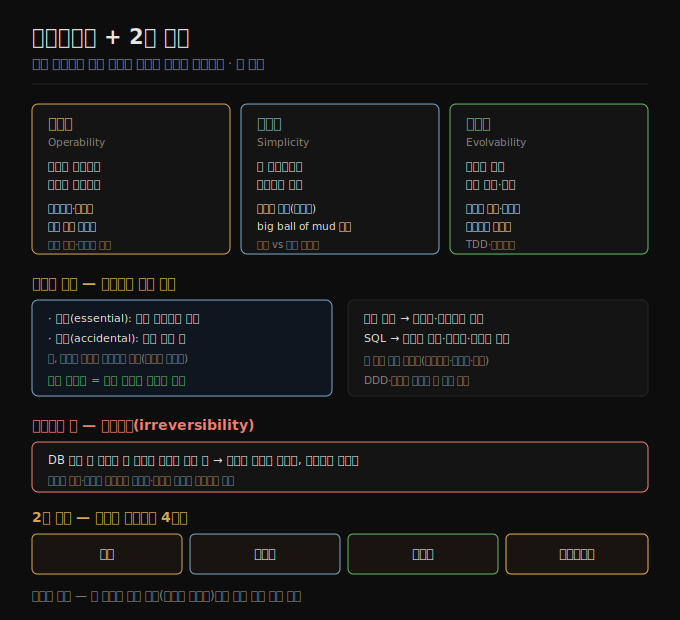

# 유지보수성
> 소프트웨어 비용 대부분은 초기 개발이 아니라 지속적 유지보수이며, 운영성·단순성·발전성 세 원칙으로 그 고통을 줄입니다.

이 노트를 읽고 나면 유지보수성을 운영성·단순성·발전성으로 나눠 설명하고, 본질 복잡도와 우발 복잡도의 구분이 왜 불완전한지 말하며, 추상화가 복잡성을 다루는 핵심 도구인 이유와 비가역성이 발전성의 적인 이유를 설명할 수 있습니다.

이 노트는 2장의 마지막 비기능 요구사항인 **유지보수성**을 다루고, 그 뒤에 2장 전체를 관통한 네 요구사항을 종합합니다. 소프트웨어는 닳거나 피로 파괴되지 않아 기계처럼 고장나지는 않습니다. 그러나 요구사항이 자주 진화하고, 소프트웨어가 도는 환경(의존성·플랫폼)이 바뀌고, 고쳐야 할 버그가 생깁니다.

소프트웨어 비용의 대부분이 초기 개발이 아니라 *지속적 유지보수* — 버그 수정, 운영 유지, 장애 조사, 새 플랫폼 적응, 새 사용 사례 수정, 기술 부채 상환, 기능 추가 — 에 있다는 것은 널리 인정됩니다. 오래 성공적으로 돌아온 시스템은 오늘날 많은 엔지니어가 모르는 낡은 기술(메인프레임·COBOL)을 쓰기도 하고, 왜 그렇게 설계됐는지의 제도적 지식이 사람들이 떠나며 사라지기도 합니다. 우리가 오늘 만드는 모든 시스템은 오래 살아남을 만큼 가치 있으면 언젠가 레거시가 됩니다. 그 고통을 줄이려 유지보수를 염두에 두고 설계하며, 이 책은 널리 적용되는 세 원칙에 주목합니다 — **운영성·단순성·발전성** 입니다.

## 1. 운영성 — 운영 팀의 삶을 편하게
> 운영성은 조직이 시스템을 원활히 운영하게 만드는 것이며, 좋은 소프트웨어도 나쁜 운영으로는 신뢰성 있게 돌지 못합니다.

운영의 역할은 [01-03](./01-03.클라우드%20vs%20셀프%20호스팅.md)에서 다뤘고, 신뢰성 있는 운영에는 소프트웨어 도구만큼 사람 프로세스가 중요했습니다. "좋은 운영은 흔히 나쁜(또는 불완전한) 소프트웨어의 한계를 우회할 수 있지만, 좋은 소프트웨어도 나쁜 운영으로는 신뢰성 있게 돌 수 없다"는 말이 있습니다.

수천 대 머신의 대규모 시스템에서 수동 유지보수는 비합리적으로 비싸 자동화가 필수입니다. 다만 자동화는 양날의 검입니다 — 수동 개입이 필요한 엣지 케이스(드문 장애 시나리오)가 늘 있고, 자동으로 처리 못 하는 케이스가 가장 복잡한 경향이라 더 숙련된 운영 팀이 필요합니다. 또 잘못된 자동화 시스템은 운영자가 수동으로 하는 시스템보다 문제 해결이 어렵곤 합니다. 그래서 자동화가 많을수록 운영성에 항상 좋은 것은 아니고, 적정선은 애플리케이션·조직에 달렸습니다.

좋은 운영성은 일상 작업을 쉽게 만들어 운영 팀이 고부가 활동에 집중하게 합니다. 데이터 시스템은 다음으로 도울 수 있습니다.

1. 모니터링 도구가 핵심 metric을 점검하고 관측성 도구가 런타임 행동 통찰을 주도록 지원합니다.
2. 개별 머신 의존을 피해, 머신을 유지보수로 내려도 시스템 전체는 중단 없이 돌게 합니다.
3. 좋은 문서와 이해하기 쉬운 운영 모델("내가 X를 하면 Y가 일어난다")을 제공합니다.
4. 좋은 기본 동작을 주되, 필요할 때 관리자가 기본값을 덮어쓸 자유를 줍니다.
5. 적절한 곳에서 자가 치유하되, 필요할 때 관리자가 시스템 상태를 수동 제어하게 합니다.
6. 예측 가능한 행동으로 의외성을 최소화합니다.

## 2. 단순성 — 복잡성 관리
> 큰 프로젝트는 big ball of mud로 변하기 쉬우며, 추상화가 복잡성을 다루는 핵심 도구입니다.

작은 소프트웨어 프로젝트는 즐겁도록 단순하고 표현력 있는 코드를 가질 수 있지만, 커지면 흔히 복잡하고 이해하기 어려워집니다. 이 복잡성은 시스템을 다뤄야 하는 모두를 느리게 해 유지보수 비용을 더 높입니다. 복잡성에 빠진 프로젝트를 **big ball of mud(진흙 공)** 라 부르곤 합니다. 복잡성이 유지보수를 어렵게 하면 예산·일정이 초과되고, 변경 시 버그를 넣을 위험도 커집니다. 시스템이 이해·추론하기 어려우면 숨은 가정·의도치 않은 결과·예상 밖 상호작용을 더 쉽게 놓칩니다. 반대로 복잡성을 줄이면 유지보수성이 크게 좋아져, 단순성은 핵심 목표가 돼야 합니다.

다만 무엇이 단순한지는 흔히 주관적이라 객관적 기준이 없습니다. 한 시스템은 복잡한 구현을 단순한 인터페이스 뒤에 감추고, 다른 시스템은 단순한 구현이 내부 세부를 더 드러낼 때 — 어느 쪽이 더 단순한지 정하기 어렵습니다.

복잡성을 추론하는 한 시도는 **본질(essential)** 과 **우발(accidental)** 두 범주로 나눕니다. 본질 복잡도는 애플리케이션 문제 도메인에 내재하고, 우발 복잡도는 도구의 한계 때문에만 생긴다는 발상입니다. 다만 이 구분도 불완전한데, 본질과 우발의 경계가 도구가 진화하며 이동하기 때문입니다.

복잡성을 다루는 최고의 도구 하나는 **추상화(abstraction)** 입니다. 좋은 추상화는 많은 구현 세부를 깔끔하고 이해하기 쉬운 외관 뒤에 감출 수 있고, 넓은 범위의 애플리케이션에 재사용될 수 있습니다. 이 재사용은 비슷한 것을 여러 번 다시 구현하는 것보다 효율적일 뿐 아니라, 추상화된 컴포넌트의 품질 개선이 그것을 쓰는 모든 애플리케이션에 이로워 더 높은 품질의 소프트웨어로 이어집니다.

예를 들어 고급 프로그래밍 언어는 기계어·CPU 레지스터·시스템 콜을 감추는 추상화이고, SQL은 복잡한 디스크·메모리 자료 구조, 다른 클라이언트의 동시 요청, 크래시 후 불일치를 감추는 추상화입니다. 이 책은 이런 애플리케이션 고유 추상화가 아니라, 그 위에서 애플리케이션을 짓는 범용 추상화 — 데이터베이스 트랜잭션·인덱스·이벤트 로그 — 를 다룹니다. DDD(도메인 주도 설계)·디자인 패턴 같은 기법을 쓰고 싶으면 이 책이 다루는 토대 위에 구현할 수 있습니다.

## 3. 발전성 — 변화를 쉽게
> 발전성은 요구사항 변화에 맞춰 시스템을 쉽게 수정·확장하는 것이며, 비가역성을 최소화할수록 유연성이 커집니다.

시스템 요구사항이 영원히 그대로일 가능성은 극히 낮습니다 — 새 사실을 배우고, 예상 못 한 사용 사례가 생기고, 비즈니스 우선순위가 바뀌고, 사용자가 새 기능을 요청하고, 새 플랫폼이 옛 것을 대체하고, 법·규제가 바뀌고, 성장이 아키텍처 변경을 강제합니다.

조직 프로세스 면에서 Agile 작업 패턴이 변화 적응 틀을 제공하고, TDD(테스트 주도 개발)·리팩토링 같은 기술 도구·프로세스도 발전했습니다. 데이터 시스템을 수정해 변화하는 요구에 적응시키는 용이성은 그 단순성·추상화와 밀접합니다. 느슨하게 결합되고 단순한 시스템은 보통 강하게 결합되고 복잡한 것보다 수정하기 쉽습니다. 이 발상이 중요해서, 이 책은 데이터 시스템 수준의 민첩성을 가리키는 별도 단어 **발전성(evolvability)** 을 씁니다.

큰 시스템에서 변화를 어렵게 만드는 주요 요인 하나는 **비가역성(irreversibility)** 입니다. 예를 들어 한 데이터베이스에서 다른 데이터베이스로 이전할 때, 새 시스템에 문제가 생겨도 옛 시스템으로 되돌릴 수 없으면 되돌릴 수 있을 때보다 위험이 훨씬 큽니다. 그래서 비가역적 작업은 신중히 해야 하고, 비가역성을 최소화하는 것이 유연성을 높입니다.

## 4. 2장 종합 — 비기능 요구사항 네 가지
> 2장은 성능·신뢰성·확장성·유지보수성을 다뤘으며, 공통 해법은 잘 이해된 빌딩 블록으로 짓는 것입니다.

2장은 여러 비기능 요구사항 — 성능·신뢰성·확장성·유지보수성 — 을 살폈고, 이를 통해 책 전반에 쓰일 원칙·용어를 만났습니다. 네 축을 한자리에 모으면 다음과 같습니다.

1. **성능** — 소셜 타임라인 사례로 규모의 난제를 본 뒤, 응답 시간 백분위로 성능을, 처리량 metric으로 부하를 측정하고 SLA에서 쓰는 법을 봤습니다([02-02](./02-02.성능%20—%20응답%20시간과%20처리량.md)).
2. **확장성** — 부하가 늘어도 성능이 유지되게 하는 데 초점을 둡니다. 작업을 독립적으로 동작하는 작은 부분으로 쪼개는 원칙을 봤습니다([02-04](./02-04.확장성.md)).
3. **신뢰성** — 내결함성 기법으로, 컴포넌트(디스크·머신·서비스)가 결함나도 서비스를 지속합니다. 강하게 상관된 소프트웨어 결함, 사람 실수에 대한 회복력, 무비난 포스트모템을 봤습니다([02-03](./02-03.신뢰성과%20내결함성.md)).
4. **유지보수성** — 운영 팀 지원, 복잡성 관리, 기능의 발전 용이성입니다. 이 목표들에 쉬운 답은 없지만, 유용한 추상화를 주는 잘 이해된 빌딩 블록으로 애플리케이션을 짓는 것이 한 방법입니다.

이 비기능 요구사항들에는 정답이 하나가 아니며, 책의 나머지는 실무에서 가치를 증명한 빌딩 블록(트랜잭션·인덱스·로그 등)을 다룹니다. 그 위에서 각 애플리케이션이 자기 상황에 맞는 균형을 잡습니다.

## 자주 받는 오해

1. **"소프트웨어 비용은 대부분 초기 개발이다"** — 반대입니다. 비용 대부분은 지속적 유지보수 — 버그 수정, 운영, 장애 조사, 플랫폼 적응, 기술 부채 상환, 기능 추가 — 입니다. 그래서 유지보수를 염두에 둔 설계(운영성·단순성·발전성)가 중요합니다.
2. **"본질 복잡도와 우발 복잡도는 명확히 나뉜다"** — 발상은 유용하지만 구분이 불완전합니다. 본질(도메인 내재)과 우발(도구 한계)의 경계가 도구가 진화하며 이동하기 때문입니다.
3. **"자동화는 많을수록 운영성에 좋다"** — 항상 그렇지는 않습니다. 수동 개입이 필요한 엣지 케이스가 늘 있고 그게 가장 복잡한 경향이며, 잘못된 자동화는 수동 시스템보다 문제 해결이 어렵습니다. 적정선은 애플리케이션·조직에 달렸습니다.
4. **"단순성은 객관적으로 정해진다"** — 무엇이 단순한지는 흔히 주관적이고 객관적 기준이 없습니다. 복잡한 구현을 단순한 인터페이스 뒤에 감춘 시스템과 단순한 구현이 세부를 드러내는 시스템 중 어느 쪽이 단순한지 정하기 어렵습니다.

## 면접에서 받을 만한 질문

1. **"유지보수성의 세 원칙은?"** — 운영성(조직이 시스템을 원활히 운영하게), 단순성(새 엔지니어가 이해하기 쉽게, 복잡성 관리), 발전성(변화에 맞춰 쉽게 수정·확장)입니다. 소프트웨어 비용 대부분이 유지보수라 이 셋을 염두에 두고 설계합니다.
2. **"추상화가 왜 복잡성 관리의 핵심 도구인가?"** — 좋은 추상화는 구현 세부를 깔끔한 외관 뒤에 감추고 넓은 범위에 재사용됩니다. 고급 언어가 기계어를, SQL이 디스크 구조·동시성·크래시를 감추듯이요. 재사용이 효율적이고, 추상화 컴포넌트의 품질 개선이 그것을 쓰는 모두에 이롭습니다.
3. **"비가역성이 왜 발전성의 적인가?"** — 비가역 작업은 문제가 생겨도 되돌릴 수 없어 위험이 큽니다. DB 이전에서 옛 시스템으로 못 돌아가면 되돌릴 수 있을 때보다 훨씬 위험합니다. 비가역성을 최소화하면 유연성이 커지고, 느슨한 결합·단순함이 수정을 쉽게 합니다.
4. **"본질 복잡도와 우발 복잡도 구분의 한계는?"** — 본질은 문제 도메인에 내재하고 우발은 도구 한계 탓이라는 발상이지만, 둘의 경계가 도구가 진화하며 이동해 구분이 불완전합니다. 그래서 단순성은 주관적 판단이 남고, 추상화로 복잡성을 감추는 게 실천적 해법입니다.

## 관련 문서

> 이 노트는 2장의 마지막 축이자 2장 전체의 종합이며, 사례·확장성 노트로 흐름을 닫습니다.

- [02-04 확장성](./02-04.확장성.md) § "확장성 원칙" — "필요 이상 복잡하게 만들지 않기"가 단순성과 맞닿는 점으로 연결
- [02-01 사례 연구 — 소셜 홈 타임라인](./02-01.사례%20연구%20—%20소셜%20네트워크%20홈%20타임라인.md) — 2장 출발점으로 되돌아가 네 축의 흐름을 닫음
- [ddia2 README — 2판 정독 인덱스](./README.md)
