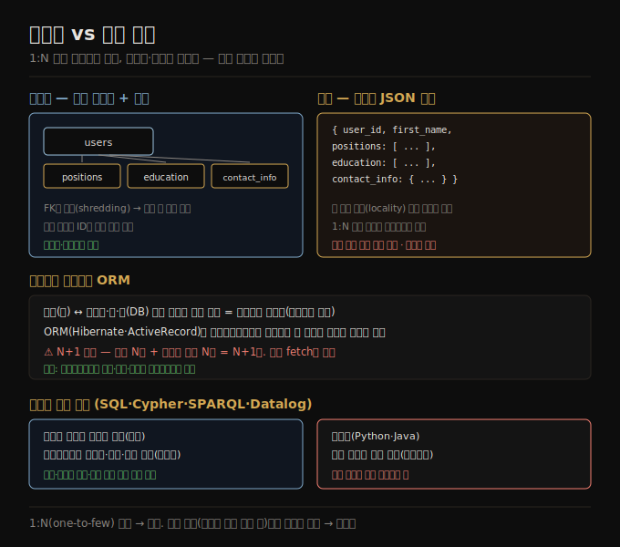

# 관계형 vs 문서 모델
> 한 그루의 1:N 트리로 한꺼번에 읽히는 데이터는 문서 모델이 맞고, 다대일·다대다 참조가 많으면 관계형이 맞습니다.

이 노트를 읽고 나면 선언형 쿼리 언어가 명령형과 무엇이 다른지 설명하고, 객체-관계 임피던스 불일치와 ORM의 N+1 문제를 말하며, 어떤 데이터가 문서 모델에 잘 맞는지 관계 유형으로 판단할 수 있습니다.

3장은 데이터 모델과 쿼리 언어를 다룹니다. 데이터 모델은 소프트웨어를 *어떻게 쓰는가* 뿐 아니라 풀려는 문제를 *어떻게 생각하는가* 에도 깊은 영향을 줘서, 어쩌면 소프트웨어 개발에서 가장 중요한 부분입니다. 비트겐슈타인의 말처럼 "내 언어의 한계가 내 세계의 한계"입니다. 대부분의 애플리케이션은 한 데이터 모델을 다른 모델 위에 층층이 얹어 만듭니다 — 앱 개발자는 현실을 객체·자료 구조로 모델링하고, 그것을 저장하려 JSON·관계형 테이블·그래프 같은 범용 데이터 모델로 표현하며, 그 아래는 DB 엔지니어가 바이트로, 다시 하드웨어 엔지니어가 전류·빛으로 표현합니다.

이 노트는 3장의 첫 비교축인 **관계형 대 문서 모델**을 다룹니다. 본문에 들어가기 전 선언형 쿼리 언어라는 용어를 먼저 잡고, 객체-관계 불일치와 ORM, 그리고 문서 모델이 1:N 관계를 어떻게 다루는지 따라갑니다.


## 1. 선언형 쿼리 언어
> 선언형은 원하는 데이터 패턴만 명시하고 실행 방법은 옵티마이저에 맡기므로, 간결하고 쿼리 변경 없이 성능을 개선할 수 있습니다.

이 장에서 다루는 많은 쿼리 언어(SQL·Cypher·SPARQL·Datalog)는 **선언형(declarative)** 입니다. 원하는 데이터의 패턴 — 결과가 충족할 조건과 데이터를 어떻게 변환(정렬·그룹·집계)할지 — 을 명시하되, 그것을 *어떻게* 달성할지는 명시하지 않습니다. 데이터베이스의 쿼리 옵티마이저가 어떤 인덱스·조인 알고리즘을 어떤 순서로 쓸지 결정합니다.

반대로 Python·Java 같은 대부분의 프로그래밍 언어에서는 컴퓨터에게 어떤 연산을 어떤 순서로 수행할지 알려 주는 알고리즘을 직접 써야 합니다. 선언형 쿼리 언어가 매력적인 이유는 보통 명시적 알고리즘보다 간결하고 쓰기 쉽다는 것, 그리고 더 중요하게는 쿼리 엔진의 구현 세부를 숨겨 쿼리를 바꾸지 않고도 데이터베이스가 성능 개선을 도입할 수 있다는 것입니다. 예를 들어 데이터베이스는 선언형 쿼리를 여러 CPU 코어·머신에 걸쳐 병렬 실행할 수 있는데, 사용자가 그 병렬성 구현을 신경 쓸 필요가 없습니다. 직접 짠 알고리즘으로 그런 병렬 실행을 구현하려면 큰 작업이 됩니다.


## 2. 관계형과 문서 모델의 약사
> 관계형 모델은 1970년 제안 이후 반세기 넘게 지배적이며, NoSQL 운동의 지속적 유산은 JSON 기반 문서 모델의 대중화입니다.

오늘날 가장 잘 알려진 데이터 모델은 1970년 에드거 코드가 제안한 관계형 모델에 기반한 SQL입니다. 이 모델에서 데이터는 **관계(relation, SQL에서 테이블)** 로 조직되고, 각 관계는 **튜플(tuple, SQL에서 행)** 의 순서 없는 모음입니다. 관계형 모델은 처음엔 이론적 제안이라 효율적 구현을 의심받았지만, 1980년대 중반 RDBMS와 SQL은 규칙적 구조의 데이터를 저장·쿼리하려는 대부분의 사람에게 선택의 도구가 됐습니다.

여러 경쟁 접근이 있었습니다 — 1970~80년대 초의 네트워크 모델·계층 모델, 1980년대 말~90년대 초의 객체 데이터베이스, 2000년대 초의 XML 데이터베이스입니다. 각각 당대에 큰 화제를 모았지만 오래가지 못했고, 대신 SQL이 XML·JSON·그래프 데이터 지원을 흡수하며 성장했습니다.

2010년대 **NoSQL** 이 관계형 지배를 뒤엎으려는 최신 유행어였습니다. NoSQL은 단일 기술이 아니라 새 데이터 모델·스키마 유연성·확장성·오픈소스 라이선스를 둘러싼 느슨한 아이디어 묶음입니다. 일부는 NoSQL의 확장성에 전통적 관계형의 데이터 모델·트랜잭션 보장을 더하려는 **NewSQL** 로 브랜딩했습니다. NoSQL·NewSQL 아이디어는 데이터 시스템 설계에 큰 영향을 줬지만, 원칙이 널리 채택되면서 그 용어 자체는 흐려졌습니다.

NoSQL 운동의 지속적 유산 하나가 보통 JSON으로 데이터를 표현하는 **문서 모델** 의 대중화입니다. MongoDB·Couchbase 같은 전문 문서 데이터베이스가 처음 대중화했고, 지금은 대부분의 관계형 데이터베이스도 JSON 지원을 더했습니다. 경직되고 유연하지 않은 스키마로 여겨지곤 하는 관계형 테이블에 비해, JSON 문서는 더 유연하다고 여겨집니다.


## 3. 객체-관계 불일치와 ORM
> 객체와 테이블·행·열 사이의 어색한 번역 계층이 임피던스 불일치이며, ORM은 보일러플레이트를 줄이지만 N+1 같은 함정을 남깁니다.

오늘날 많은 애플리케이션 개발은 객체 지향 언어로 이뤄져, SQL 데이터 모델에 흔한 비판이 따라옵니다 — 데이터가 관계형 테이블에 저장되면 애플리케이션 코드의 객체와 테이블·행·열이라는 데이터베이스 모델 사이에 어색한 번역 계층이 필요합니다. 두 모델의 단절을 **임피던스 불일치(impedance mismatch)** 라 부릅니다(전자공학 차용 — 출력·입력 임피던스가 안 맞으면 신호 반사 등 문제가 생기는 데서 옴).

**ORM(object-relational mapping)** 프레임워크(ActiveRecord·Hibernate)는 이 번역 계층의 보일러플레이트를 줄이지만 자주 비판받습니다.

1. ORM은 복잡하고 두 모델 차이를 완전히 숨기지 못해, 개발자가 여전히 관계형·객체 양쪽 표현을 생각해야 합니다.
2. ORM은 보통 OLTP 앱 개발에만 쓰여, 분석용 데이터를 다루는 데이터 엔지니어는 밑의 관계형 표현을 다뤄야 합니다 — ORM을 써도 관계형 스키마 설계는 여전히 중요합니다.
3. 많은 ORM은 관계형 OLTP 데이터베이스에만 동작해, 검색 엔진·그래프·NoSQL 같은 다양한 시스템에선 지원이 부족할 수 있습니다.
4. ORM이 자동 생성한 관계형 스키마는 직접 접근하는 사용자에게 어색하거나 밑의 데이터베이스에서 비효율적일 수 있습니다.
5. **N+1 쿼리 문제** — ORM은 비효율적 쿼리를 실수로 쓰기 쉽습니다. 댓글 N개를 반환하는 쿼리 하나에, 각 댓글 작성자 이름을 보이려 users 테이블을 댓글마다 따로 조회하면 총 N+1 쿼리가 됩니다. 손으로 쓴 SQL이라면 쿼리 안에서 조인해 작성자 이름을 함께 반환했을 것입니다. 회피하려면 ORM에게 댓글을 가져올 때 작성자 정보를 함께 가져오라고 알려야 합니다.

그래도 ORM에는 장점이 있습니다 — 관계형에 잘 맞는 데이터의 영속-인메모리 표현 사이 번역은 불가피한데 그 보일러플레이트를 줄여 주고, 쿼리 결과 캐싱을 도와 데이터베이스 부하를 줄이며, 스키마 마이그레이션 같은 관리 활동도 돕습니다.




## 4. 문서 모델 — 1:N 관계와 트리 구조
> 이력서 같은 1:N 트리 데이터는 JSON 문서 하나에 자족적으로 담겨 locality가 좋고, 조회가 빠르고 단순합니다.

모든 데이터가 관계형에 잘 맞는 것은 아닙니다. 링크드인 프로필(이력서)을 예로 보면, `first_name`·`last_name` 처럼 사용자당 정확히 한 번 나오는 필드는 users 테이블의 열로 모델링됩니다. 그러나 대부분 사람은 경력에 여러 직위(position)를 갖고, 학력·연락처도 개수가 다양합니다. 이런 **1:N(one-to-many) 관계** 를 표현하는 한 방법은 positions·education·contact_info를 users로의 외래 키 참조를 가진 별도 테이블에 두는 것입니다.

같은 정보를 표현하는 더 자연스럽고 객체 구조에 가까운 다른 방법은 JSON 문서입니다.

```json
{
  "user_id": 251,
  "first_name": "Barack",
  "last_name": "Obama",
  "positions": [
    {"job_title": "President", "organization": "United States of America"},
    {"job_title": "US Senator (D-IL)", "organization": "United States Senate"}
  ],
  "education": [
    {"school_name": "Harvard University", "start": 1988, "end": 1991}
  ],
  "contact_info": { "website": "https://barackobama.com" }
}
```

JSON 표현은 다중 테이블 스키마보다 **locality(지역성)** 가 좋습니다. 관계형에서 프로필을 가져오려면 여러 쿼리(테이블마다 user_id로 조회)를 하거나 users와 하위 테이블 사이의 지저분한 다방향 조인을 해야 합니다. JSON 표현은 관련 정보가 한 곳에 있어 쿼리가 더 빠르고 단순합니다. 프로필에서 직위·학력·연락처로 가는 1:N 관계는 데이터에 트리 구조를 함의하고, JSON 표현은 이 트리 구조를 명시적으로 만듭니다.

> 📌 1:N 관계는 때로 **one-to-few** 라 불립니다. 이력서엔 보통 직위가 소수이기 때문입니다. 그러나 유명인 게시물의 댓글 수천 개처럼 *진짜로 많은* 관련 항목이라면, 같은 문서에 다 임베딩하는 것은 너무 다루기 힘들어 관계형 접근이 낫습니다.

> 💬 비유로 보면, 문서 모델은 *서류 한 장에 한 사람의 모든 정보를 적은 이력서 파일* 이고, 관계형은 *항목별로 캐비닛 서랍을 나눠 ID 라벨로 연결한 것* 입니다. 이 비유는 *한 사람을 통째로 읽는* 경우까지 유효하지만, 여러 이력서가 같은 회사를 가리킬 때(다대다)는 서류 한 장 비유로 표현되지 않습니다.


## 자주 받는 오해

1. **"선언형 쿼리가 명령형보다 항상 느리다"** — 반대인 경우가 많습니다. 선언형은 실행 방법을 옵티마이저에 맡겨, 쿼리를 바꾸지 않고도 인덱스·조인 개선·병렬 실행을 도입할 수 있습니다. 명령형은 그런 병렬성을 직접 구현해야 합니다.
2. **"ORM을 쓰면 관계형 스키마를 신경 안 써도 된다"** — 아닙니다. ORM은 두 모델 차이를 완전히 숨기지 못하고, 분석용 데이터 엔지니어는 밑의 관계형 표현을 다뤄야 합니다. ORM 자동 생성 스키마가 비효율적일 수도 있습니다.
3. **"문서 모델은 모든 데이터에 더 유연하고 좋다"** — 1:N 트리로 한꺼번에 읽히는 데이터에만 유리합니다. 다대일·다대다 참조가 많거나 중첩 항목을 직접 참조해야 하면 관계형이 낫습니다. 항목이 수천 개로 많아지면 임베딩이 부담이 됩니다.
4. **"NoSQL이 관계형을 대체했다"** — 아닙니다. NoSQL·NewSQL 아이디어는 영향을 줬지만, 관계형은 데이터 웨어하우스·분석에서 여전히 지배적이고 SQL이 JSON·그래프를 흡수했습니다. 용어 자체는 흐려졌습니다.


## 면접에서 받을 만한 질문

1. **"선언형 쿼리 언어와 명령형의 차이는?"** — 선언형(SQL·Cypher)은 원하는 데이터 패턴과 변환만 명시하고 실행 방법은 옵티마이저가 정합니다. 명령형(Python·Java)은 연산 순서를 직접 작성합니다. 선언형은 간결하고, 구현 세부를 숨겨 쿼리 변경 없이 성능 개선·병렬 실행을 도입할 수 있습니다.
2. **"객체-관계 임피던스 불일치가 무엇이고 ORM은 어떻게 돕나?"** — 앱의 객체와 DB의 테이블·행·열 사이 어색한 번역 계층이 임피던스 불일치입니다. ORM(Hibernate 등)이 그 보일러플레이트를 줄이지만 두 모델을 완전히 숨기진 못하고, 캐싱·마이그레이션도 돕습니다.
3. **"N+1 쿼리 문제가 무엇이고 어떻게 피하나?"** — 댓글 N개를 가져온 뒤 작성자 이름을 보이려 사용자 테이블을 댓글마다 따로 조회하면 총 N+1 쿼리가 됩니다. DB에서 조인하는 것보다 느립니다. ORM에게 댓글과 작성자를 함께 가져오라고(조인 fetch) 알려 피합니다.
4. **"어떤 데이터가 문서 모델에 잘 맞나?"** — 1:N 관계의 트리이고 보통 트리 전체를 한꺼번에 읽는 데이터입니다(이력서 등). locality가 좋아 조회가 빠르고 객체 구조에 가깝습니다. 반대로 중첩 항목 직접 참조·다대다가 필요하면 관계형이 낫습니다.


## 관련 문서

> 이 노트는 3장의 첫 비교축이며, 정규화·모델 선택 노트로 이어집니다.

- [03-02 정규화·비정규화·조인](./03-02.정규화·비정규화·조인.md) § "정규화의 trade-off" — 문서가 비정규화와 자주 엮이는 이유로 연결
- [03-04 모델 선택과 스키마 유연성](./03-04.모델%20선택과%20스키마%20유연성.md) § "schema-on-read vs schema-on-write" — 문서의 스키마 유연성으로 연결
- [01-02 기록 시스템 vs 파생 데이터](./01-02.기록%20시스템%20vs%20파생%20데이터.md) — 비정규화를 파생 데이터로 보는 관점으로 연결
- [ddia2 README — 2판 정독 인덱스](./README.md)
