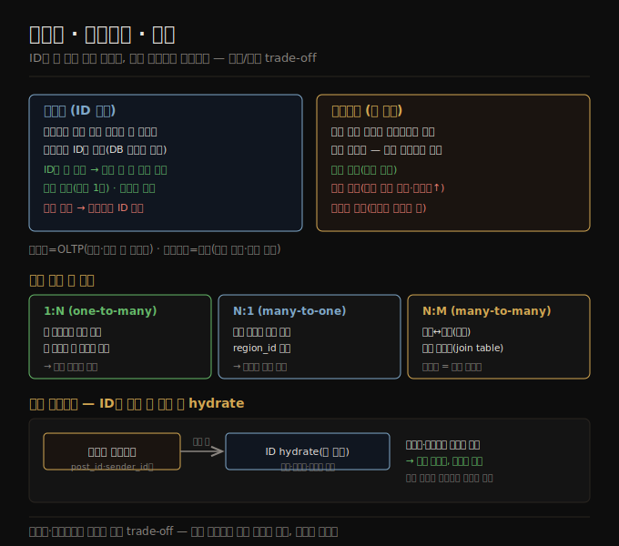

# 정규화·비정규화·조인
> 사람에게 의미 있는 정보를 ID로 한 곳에만 두면 정규화, 값을 레코드마다 복제하면 비정규화이며, 읽기와 쓰기의 trade-off입니다.

이 노트를 읽고 나면 정규화와 비정규화를 읽기·쓰기 비용으로 비교하고, 다대일·다대다 관계가 왜 정규화 표현에 맞는지 설명하며, 소셜 타임라인이 ID만 저장하고 읽을 때 hydrate하는 이유를 말할 수 있습니다.

이 노트는 [03-01](./03-01.관계형%20vs%20문서%20모델.md)에 이어 정규화·비정규화의 trade-off, 그리고 다대일·다대다 관계의 표현을 다룹니다. 핵심 질문은 단순합니다 — 어떤 값을 *직접 저장* 할지, 아니면 *ID로 참조* 할지입니다.


## 1. 정규화란 — ID로 참조하기
> ID는 사람에게 의미가 없어 절대 변하지 않으므로, 의미 있는 정보를 한 곳에만 두고 ID로 참조하면 변경이 쉽고 일관성이 안전합니다.

이력서 예에서 `region_id` 는 평문 "Washington, DC"가 아니라 ID로 주어집니다. 왜일까요? UI에 지역을 자유 입력하는 칸이 있으면 평문 저장이 맞지만, 표준화된 지역 목록에서 고르게 하면 이점이 있습니다 — 프로필 간 표기 일관성, 동명이지(같은 이름의 여러 장소) 모호성 회피, 이름 변경 시 한 곳만 수정, 지역화(다른 언어로 번역) 지원, 더 나은 검색(예: "미국 동부 해안" 검색이 이 프로필과 매칭 — Washington이 동부라는 사실을 목록이 인코딩하므로)입니다.

ID를 저장할지 텍스트를 저장할지는 **정규화** 의 문제입니다. ID를 쓰면 데이터가 더 정규화됩니다 — 사람에게 의미 있는 정보(텍스트 "Washington, DC")는 한 곳에만 저장되고, 그것을 가리키는 모든 것은 ID(DB 안에서만 의미)를 씁니다. 텍스트를 직접 저장하면 그 정보를 쓰는 모든 레코드에 복제하는 셈이라 **비정규화** 입니다.

ID를 쓰는 장점은, ID가 사람에게 의미가 없어 **절대 바뀔 필요가 없다는 것** 입니다 — 식별하는 정보가 바뀌어도 ID는 그대로일 수 있습니다. 사람에게 의미 있는 것은 미래에 바뀔 수 있고, 그 정보가 복제돼 있으면 모든 중복 사본을 갱신해야 합니다. 더 많은 코드·쓰기·디스크 공간이 들고, 일부 사본만 갱신되는 불일치 위험이 따릅니다.

정규화 표현의 단점은, ID를 담은 레코드를 보일 때마다 ID를 사람이 읽을 수 있는 것으로 해소하는 추가 조회가 필요하다는 것입니다. 관계형에서는 이를 **조인** 으로 합니다.

```sql
SELECT users.*, regions.region_name
FROM users
JOIN regions ON users.region_id = regions.id
WHERE users.id = 251;
```

문서 데이터베이스는 정규화·비정규화 데이터를 모두 저장할 수 있지만 흔히 비정규화와 엮입니다 — JSON이 비정규화 필드를 더하기 쉽게 하고, 많은 문서 데이터베이스의 약한 조인 지원이 정규화를 불편하게 하기 때문입니다. 일부는 조인을 전혀 지원하지 않아 애플리케이션 코드에서 해야 합니다(ID를 담은 문서를 먼저 가져오고, 두 번째 쿼리로 그 ID를 다른 문서로 해소). MongoDB는 집계 파이프라인의 `$lookup` 연산자로 조인할 수도 있습니다.




## 2. 정규화의 trade-off
> 정규화는 쓰기가 빠르지만 읽기에 조인이 들고, 비정규화는 읽기가 빠르지만 쓰기가 비싸 일관성 관리가 필요합니다.

이력서 예에서 region_id는 표준 지역 집합의 참조이지만, organization(근무한 회사·정부)과 school_name(공부한 곳)은 그냥 문자열입니다 — 비정규화입니다. 많은 사람이 같은 회사에서 일했어도 그들을 잇는 ID가 없습니다. 학교·회사 로고를 이름과 함께 넣고 싶다고 하면 차이가 드러납니다.

1. **비정규화 표현** — 로고 이미지 URL을 사람마다 프로필에 넣습니다. JSON 문서가 자족적이 되지만, 로고를 바꿀 때 옛 URL을 다 찾아 갱신해야 하는 골칫거리가 생깁니다.
2. **정규화 표현** — 조직·학교 엔티티를 만들어 이름·로고 URL·기타 속성을 한 번 저장합니다. 그 조직을 언급하는 모든 이력서는 ID만 참조하고, 로고 갱신이 쉽습니다.

일반 원칙으로, **정규화 데이터는 보통 쓰기가 빠르고(사본 하나) 읽기가 느리며(조인 필요), 비정규화 데이터는 보통 읽기가 빠르고(조인 적음) 쓰기가 비쌉니다(사본 다수 갱신·디스크 공간↑).** 비정규화는 [파생 데이터](./01-02.기록%20시스템%20vs%20파생%20데이터.md)의 한 형태로 보면 도움이 됩니다 — 중복 사본을 갱신하는 프로세스를 세워야 하기 때문입니다. 갱신 비용 외에, 프로세스가 갱신 도중 크래시할 때의 일관성도 고려해야 합니다. 원자적 트랜잭션을 제공하는 데이터베이스가 일관성 유지를 쉽게 하지만, 모든 데이터베이스가 다중 문서에 걸친 원자성을 제공하지는 않습니다.

정규화는 읽기·쓰기 둘 다 빨라야 하는 OLTP에 더 낫고, 분석 시스템은 대량 적재를 하고 읽기 전용 쿼리 성능이 지배적 관심사라 비정규화 데이터가 흔히 낫습니다. 작거나 중간 규모에서는 정규화 모델이 흔히 최선입니다 — 여러 사본의 일관성을 걱정하지 않아도 되고 조인 비용이 견딜 만하기 때문입니다. 그러나 대규모에서는 조인 비용이 문제가 될 수 있습니다.


## 3. 다대일·다대다 관계
> 다대일·다대다 관계는 자족적 JSON 문서에 잘 안 맞아 정규화 표현이 어울리며, 관계형에서는 연관 테이블로 표현합니다.

이력서의 positions·education은 1:N(one-to-few)이고, region_id는 **다대일(many-to-one)** 입니다(많은 사람이 같은 지역에 살지만, 각 사람은 한 지역에). 조직·학교 엔티티를 도입해 ID로 참조하면 **다대다(many-to-many)** 도 생깁니다(한 사람이 여러 조직에서 일했고, 한 조직에 여러 직원이 있음). 관계형에서 이런 관계는 보통 **연관 테이블(associative table)/조인 테이블** 로 표현합니다 — 각 직위가 한 user ID를 한 organization ID와 연결합니다.

다대일·다대다는 자족적 JSON 문서 하나에 잘 안 들어가, 정규화 표현에 더 어울립니다. 문서 모델의 한 표현은 조직·학교로의 링크를 다른 문서로의 참조로 두는 것입니다.

```json
{
  "user_id": 251,
  "positions": [
    {"start": 2009, "end": 2017, "job_title": "President", "org_id": 513}
  ]
}
```

다대다 관계는 흔히 "양방향"으로 쿼리해야 합니다 — 특정 사람이 일한 모든 조직, 그리고 특정 조직에서 일한 모든 사람입니다. 한 방법은 양쪽에 ID 참조를 저장하는 것이지만(이력서가 조직 ID를, 조직 문서가 이력서 ID를 담음), 관계가 두 곳에 저장돼 서로 불일치할 수 있는 비정규화입니다. **정규화 표현은 관계를 한 곳에만 저장하고 보조 인덱스에 의존해 양방향을 효율적으로 쿼리합니다.** 관계형이라면 positions 테이블의 user_id·org_id 양쪽에 인덱스를 만들고, 문서 모델이라면 positions 배열 안 객체의 org_id 필드를 인덱싱합니다. 많은 문서·관계형 데이터베이스가 문서 안 값에 이런 인덱스를 만들 수 있습니다.


## 4. 소셜 타임라인의 비정규화 — ID hydration
> 소셜 타임라인은 ID만 저장하고 읽을 때 본문·프로필을 조회(hydrate)하는데, 빠르게 변하는 정보는 복제가 부적합하기 때문입니다.

[02-01](./02-01.사례%20연구%20—%20소셜%20네트워크%20홈%20타임라인.md)에서 정규화 표현(posts ⋈ follows)과 비정규화 표현(구체화 타임라인)을 비교했습니다. 조인이 너무 비싸 구체화 타임라인이 그 조인 결과의 캐시였고, fan-out이 비정규화 표현을 일관되게 유지하는 방법이었습니다.

그런데 X(옛 트위터)의 구체화 타임라인 구현은 각 게시의 *실제 텍스트* 를 저장하지 않습니다. 각 항목은 post ID, 게시한 사용자 ID, 리포스트·답글 식별용 약간의 정보만 담습니다. 즉 대략 다음 쿼리의 미리 계산된 결과입니다.

```sql
SELECT posts.id, posts.sender_id FROM posts
  JOIN follows ON posts.sender_id = follows.followee_id
  WHERE follows.follower_id = current_user
  ORDER BY posts.timestamp DESC
  LIMIT 1000
```

이는 타임라인을 읽을 때마다 서비스가 여전히 두 조인을 한다는 뜻입니다 — post ID로 실제 본문(좋아요·답글 수 같은 통계 포함)을 가져오고, sender ID로 작성자 프로필(사용자명·프로필 사진)을 가져옵니다. ID로 사람이 읽을 정보를 조회하는 이 과정을 **ID hydration(하이드레이팅)** 이라 하고, 본질적으로 애플리케이션 코드에서 하는 조인입니다.

미리 계산된 타임라인에 ID만 저장하는 이유는, 그것이 가리키는 데이터가 *빠르게 변하기* 때문입니다. 인기 게시의 좋아요·답글 수는 초당 여러 번 바뀔 수 있고, 일부 사용자는 사용자명·프로필 사진을 자주 바꿉니다. 타임라인은 볼 때 최신 좋아요 수·프로필 사진을 보여야 하므로, 이 정보를 구체화 타임라인에 비정규화하는 것은 말이 안 되고 저장 비용도 크게 늘립니다.

이 예는 **데이터를 읽을 때 조인을 해야 하는 것이, 때로 주장되듯 고성능·확장 서비스의 장애물이 아님** 을 보여 줍니다. post·user ID hydration은 병렬화가 잘 돼 확장하기 쉽고, 비용이 팔로우·팔로워 수에 의존하지 않습니다. 무언가를 비정규화할지 결정할 때 이 사례가 보여 주듯 선택은 즉시 분명하지 않습니다 — 가장 확장적인 접근은 일부는 비정규화하고 일부는 정규화로 남기는 것일 수 있습니다. **정규화·비정규화는 본질적으로 좋거나 나쁘지 않고, 읽기·쓰기 성능과 구현 노력의 trade-off일 뿐입니다.**


## 자주 받는 오해

1. **"정규화가 항상 더 좋다(또는 비정규화가 항상 더 빠르다)"** — 둘 다 trade-off입니다. 정규화는 쓰기가 빠르고 일관성이 안전하지만 읽기에 조인이 듭니다. 비정규화는 읽기가 빠르지만 쓰기가 비싸고 불일치 위험이 있습니다. OLTP는 정규화, 분석은 비정규화가 흔히 낫습니다.
2. **"비정규화하면 그냥 복제하면 끝이다"** — 비정규화는 파생 데이터라, 원본이 바뀌면 중복 사본을 갱신하는 프로세스가 필요합니다. 갱신 도중 크래시 시 일관성도 문제라, 원자적 트랜잭션이나 스트림 처리로 다뤄야 합니다.
3. **"읽을 때 조인하면 확장이 안 된다"** — 소셜 타임라인의 ID hydration이 반례입니다. 병렬화가 잘 돼 확장하기 쉽고 비용이 팔로우·팔로워 수에 의존하지 않습니다. 빠르게 변하는 정보(좋아요·프로필)는 오히려 복제가 부적합합니다.
4. **"다대다는 문서에 임베딩하면 된다"** — 다대다·다대일은 자족적 문서에 잘 안 맞습니다. 양쪽에 ID를 복제하면 불일치 위험이 생기므로, 한 곳에 저장하고 보조 인덱스로 양방향 쿼리하는 정규화가 낫습니다.


## 면접에서 받을 만한 질문

1. **"정규화와 비정규화의 차이를 읽기·쓰기 비용으로 설명하라"** — 정규화는 의미 있는 정보를 ID로 한 곳에만 둬 쓰기가 빠르고(사본 1개) 일관성이 안전하지만 읽기에 조인이 듭니다. 비정규화는 값을 레코드마다 복제해 읽기가 빠르지만(조인 적음) 쓰기가 비싸고(사본 다수 갱신) 불일치 위험이 있습니다.
2. **"왜 정규화는 OLTP, 비정규화는 분석에 어울리나?"** — OLTP는 읽기·쓰기 둘 다 빨라야 하고 여러 사본 일관성이 부담이라 정규화가 낫습니다. 분석은 대량 적재를 하고 읽기 전용 쿼리 성능이 지배적이라, 사본 갱신·일관성 부담이 덜한 비정규화가 낫습니다.
3. **"다대다 관계를 양방향으로 쿼리하려면?"** — 관계를 한 곳(연관 테이블)에만 저장하고 양쪽 컬럼(user_id·org_id)에 보조 인덱스를 만들어 양방향을 효율적으로 쿼리합니다(정규화). 양쪽에 ID를 복제하면 불일치 위험이 생깁니다.
4. **"소셜 타임라인은 왜 본문이 아닌 ID만 저장하나?"** — 좋아요 수·프로필처럼 빠르게 변하는 정보를 비정규화하면 갱신 비용이 크고 항상 최신을 보여야 합니다. 그래서 ID만 저장하고 읽을 때 본문·프로필을 조회(hydration)합니다 — 이 조인은 병렬화가 잘 돼 확장하기 쉽습니다.


## 관련 문서

> 이 노트는 3장의 정규화 축이며, 분석 스키마·모델 선택 노트로 이어집니다.

- [03-01 관계형 vs 문서 모델](./03-01.관계형%20vs%20문서%20모델.md) § "문서 모델 — 1:N 관계와 트리 구조" — 문서가 비정규화와 엮이는 배경
- [03-03 분석용 스키마 — 별·눈송이·OBT](./03-03.분석용%20스키마%20—%20별·눈송이·OBT.md) § "별·눈송이" — 분석에서 비정규화(OBT)가 무난한 이유로 연결
- [02-01 사례 연구 — 소셜 홈 타임라인](./02-01.사례%20연구%20—%20소셜%20네트워크%20홈%20타임라인.md) — 구체화 타임라인이 비정규화·hydration의 실사례
- [ddia2 README — 2판 정독 인덱스](./README.md)
