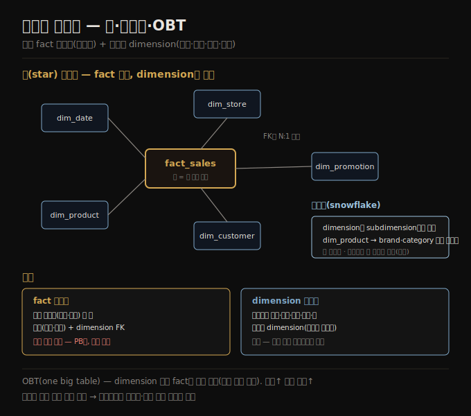

# 분석용 스키마 — 별·눈송이·OBT
> 데이터 웨어하우스는 중앙 fact 테이블(이벤트)을 dimension 테이블(누가·무엇·어디·언제)이 둘러싸는 별 스키마로 분석에 최적화합니다.

이 노트를 읽고 나면 fact 테이블과 dimension 테이블의 역할을 구분하고, 별 스키마와 눈송이 스키마의 차이를 설명하며, 분석에서 비정규화(OBT)가 OLTP만큼 문제 되지 않는 이유를 말할 수 있습니다.

이 노트는 3장에서 분석용 데이터 웨어하우스([01-01](./01-01.운영%20시스템%20vs%20분석%20시스템.md))의 테이블 구조 관례를 다룹니다. 데이터 웨어하우스는 보통 관계형이고, 별 스키마·눈송이 스키마·차원 모델링·OBT(one big table) 같은 널리 쓰이는 관례가 있습니다. 이 구조들은 비즈니스 분석가의 필요에 최적화돼 있고, ETL 과정이 운영 시스템 데이터를 선택한 스키마로 변환합니다.

## 1. 별 스키마 — fact와 dimension
> 중앙의 fact 테이블은 개별 이벤트를 한 행씩 담고, FK로 연결된 dimension 테이블이 그 이벤트의 누가·무엇·어디·언제를 담습니다.

식료품 소매상의 데이터 웨어하우스를 예로 보면, 스키마 중앙에 **fact 테이블**(예: `fact_sales`)이 있습니다. fact 테이블의 각 행은 특정 시점에 일어난 이벤트를 표현합니다(여기서는 고객의 상품 구매). 웹 트래픽을 분석한다면 각 행은 페이지 뷰나 클릭일 수 있습니다. 보통 fact는 개별 이벤트로 포착되는데, 나중에 분석의 유연성을 최대화하기 때문입니다. 다만 이는 fact 테이블이 극단적으로 커질 수 있다는 뜻입니다 — 큰 기업은 웨어하우스에 수 페타바이트의 거래 이력을 대부분 fact 테이블로 가질 수 있습니다.

fact 테이블의 일부 컬럼은 **속성** 입니다 — 상품이 팔린 가격, 공급사에서 사 온 원가(이익 마진 계산용) 같은 것입니다. 다른 컬럼은 **dimension 테이블** 로의 외래 키 참조입니다. fact 테이블의 각 행이 이벤트를 표현하므로, dimension은 그 이벤트의 *누가·무엇·어디·언제·어떻게·왜* 를 표현합니다.

예를 들어 한 dimension은 팔린 상품입니다 — `dim_product` 의 각 행은 판매 중인 한 상품 유형(SKU·설명·브랜드명·카테고리·포장 크기 등)을 표현하고, fact_sales의 각 행은 외래 키로 그 거래에서 어떤 상품이 팔렸는지 가리킵니다. 쿼리는 흔히 여러 dimension 테이블로의 다중 조인을 포함합니다. 날짜·시간조차 dimension 테이블로 표현되곤 하는데, 날짜에 대한 추가 정보(공휴일 등)를 인코딩해 공휴일·비공휴일 매출을 구분할 수 있게 하기 때문입니다.

**별 스키마(star schema)** 라는 이름은 테이블 관계를 시각화하면 fact 테이블이 가운데 있고 dimension 테이블이 둘러싸, 그 연결이 별빛 같다는 데서 옵니다.

## 2. 눈송이 스키마와 넓은 테이블
> 눈송이 스키마는 dimension을 subdimension으로 더 정규화하지만, 별 스키마가 분석가에게 더 단순해 흔히 선호됩니다.

이 템플릿의 변형이 **눈송이 스키마(snowflake schema)** 로, dimension을 subdimension으로 더 쪼갭니다. 예를 들어 브랜드·상품 카테고리에 별도 테이블을 두고, dim_product의 각 행이 브랜드·카테고리를 문자열로 저장하는 대신 외래 키로 참조할 수 있습니다. 눈송이 스키마는 별 스키마보다 더 정규화돼 있지만, 별 스키마가 분석가에게 더 단순해 흔히 선호됩니다.

전형적인 데이터 웨어하우스에서 테이블은 흔히 꽤 넓습니다 — fact 테이블은 자주 100개가 넘는, 때로 수백 개의 컬럼을 갖습니다. dimension 테이블도 분석에 관련될 수 있는 모든 메타데이터를 담아 넓을 수 있습니다 — 예를 들어 dim_store 테이블은 각 매장이 제공하는 서비스, 매장 내 베이커리 유무, 면적, 개점일·마지막 리모델링일, 가장 가까운 고속도로까지의 거리 등을 담을 수 있습니다.

별·눈송이 스키마는 대부분 다대일 관계로 이뤄집니다(많은 판매가 한 상품·한 매장에 대해 일어남) — fact 테이블이 dimension으로의 외래 키를 갖거나, dimension이 subdimension으로의 외래 키를 갖는 형태입니다. 원칙적으로 다른 관계 유형도 있을 수 있지만 쿼리를 단순화하려 흔히 비정규화됩니다. 예를 들어 고객이 한 번에 여러 상품을 사면 그 다중 상품 거래는 명시적으로 표현되지 않고, fact 테이블이 구매 상품마다 별도 행을 갖되 그 fact들이 같은 고객 ID·매장 ID·타임스탬프를 가질 뿐입니다.

## 3. OBT — 비정규화를 끝까지
> OBT는 dimension 테이블을 없애고 그 정보를 fact 테이블의 비정규화 컬럼으로 펼치며, 분석은 변치 않는 이력 로그라 비정규화 부담이 덜합니다.

일부 데이터 웨어하우스 스키마는 비정규화를 더 밀어붙여 dimension 테이블을 아예 없애고, dimension의 정보를 fact 테이블의 비정규화 컬럼으로 접어 넣습니다(본질적으로 fact와 dimension 사이 조인을 미리 계산). 이 접근을 **OBT(one big table)** 라 하고, 저장 공간이 더 들지만 때로 더 빠른 쿼리를 가능하게 합니다.

분석 맥락에서 이런 비정규화는 문제가 되지 않습니다. 데이터가 보통 바뀌지 않는(가끔 오류를 고치는 경우 외엔) 이력 데이터의 로그를 표현하기 때문입니다. OLTP에서 비정규화에 따르던 데이터 일관성·쓰기 오버헤드 문제가 분석에서는 덜 절실합니다([03-02](./03-02.정규화·비정규화·조인.md)의 trade-off가 분석에서는 한쪽으로 기웁니다).

## 자주 받는 오해

1. **"눈송이 스키마가 더 정규화돼 있으니 더 좋다"** — 더 정규화된 건 맞지만, 별 스키마가 분석가에게 더 단순해 흔히 선호됩니다. 분석은 일관성·쓰기 부담이 덜해 정규화의 이점이 OLTP만큼 크지 않습니다.
2. **"fact 테이블에 다중 상품 거래를 한 행으로 담는다"** — 아닙니다. 고객이 한 번에 여러 상품을 사면 구매 상품마다 별도 fact 행이 생기고, 그 행들이 같은 고객 ID·매장 ID·타임스탬프를 공유할 뿐입니다. 개별 이벤트로 포착해야 분석 유연성이 큽니다.
3. **"OBT는 저장만 늘고 이점이 없다"** — 저장 공간은 더 들지만 fact-dimension 조인을 미리 계산해 때로 더 빠른 쿼리를 줍니다. 분석은 변치 않는 이력이라 비정규화의 일관성 문제가 덜해 OBT가 무난합니다.
4. **"날짜는 그냥 타임스탬프 컬럼이면 된다"** — 날짜도 dimension 테이블로 두면 공휴일 같은 추가 정보를 인코딩해 공휴일·비공휴일 매출을 구분하는 분석이 가능합니다.

## 면접에서 받을 만한 질문

1. **"별 스키마의 fact 테이블과 dimension 테이블의 역할은?"** — fact 테이블은 개별 이벤트(구매·클릭)를 한 행씩 담고 속성(가격·원가)과 dimension FK를 가집니다. dimension 테이블은 그 이벤트의 누가·무엇·어디·언제(상품·매장·날짜·고객)를 담습니다. fact가 중앙, dimension이 별빛처럼 둘러싸 별 스키마입니다.
2. **"별 스키마와 눈송이 스키마의 차이는?"** — 눈송이는 dimension을 subdimension으로 더 쪼개 더 정규화합니다(브랜드·카테고리 별도 테이블). 별 스키마는 dimension에 문자열로 두어 덜 정규화됐지만 분석가에게 더 단순해 흔히 선호됩니다.
3. **"OBT가 무엇이고 분석에서 왜 무난한가?"** — OBT(one big table)는 dimension을 없애고 그 정보를 fact 테이블의 비정규화 컬럼으로 펼쳐 조인을 미리 계산합니다. 저장은 더 들지만 쿼리가 때로 빨라집니다. 분석은 변치 않는 이력 로그라 비정규화의 일관성·쓰기 부담이 덜합니다.

## 관련 문서

> 이 노트는 3장의 분석 스키마 축이며, 정규화·이벤트 소싱 노트와 이어집니다.

- [03-02 정규화·비정규화·조인](./03-02.정규화·비정규화·조인.md) § "정규화의 trade-off" — 분석에서 비정규화가 무난한 이유의 일반론
- [03-06 이벤트 소싱·CQRS·DataFrame](./03-06.이벤트%20소싱·CQRS·DataFrame.md) § "이벤트 소싱" — fact 테이블과 이벤트 로그의 유사·차이로 연결
- [01-01 운영 시스템 vs 분석 시스템](./01-01.운영%20시스템%20vs%20분석%20시스템.md) § "데이터 웨어하우스" — 웨어하우스가 별 스키마를 쓰는 배경
- [ddia2 README — 2판 정독 인덱스](./README.md)
