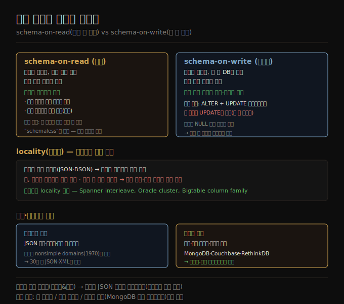

# 모델 선택과 스키마 유연성
> 문서 모델은 스키마 유연성·locality·객체 근접성으로, 관계형은 조인·다대일·다대다 지원으로 맞서며, 둘은 점점 수렴하고 있습니다.

이 노트를 읽고 나면 언제 문서 모델을 쓰고 언제 관계형을 쓸지 판단하고, schema-on-read와 schema-on-write를 정적·동적 타입 체크에 빗대 설명하며, 문서의 locality 이점이 어디까지 유효한지 말할 수 있습니다.

이 노트는 [03-01](./03-01.관계형%20vs%20문서%20모델.md)·[03-02](./03-02.정규화·비정규화·조인.md)에 이어, 모델 선택의 기준과 스키마 유연성·locality·쿼리 언어, 그리고 두 모델의 수렴을 다룹니다.


## 1. 언제 어느 모델을 쓰는가
> 1:N 트리를 통째로 읽는 데이터는 문서, 중첩 항목을 직접 참조하거나 다대다가 많은 데이터는 관계형이 맞습니다.

문서 데이터 모델을 지지하는 주 논거는 스키마 유연성, locality에 따른 더 나은 성능, 그리고 일부 애플리케이션에선 앱이 쓰는 객체 모델에 더 가깝다는 것입니다. 관계형 모델은 조인, 다대일·다대다 관계의 더 나은 지원으로 맞섭니다.

애플리케이션 데이터가 문서 같은 구조(1:N 관계의 트리이고 보통 트리 전체를 한꺼번에 로드)라면 문서 모델이 좋은 선택일 것입니다. 문서 같은 구조를 여러 테이블로 쪼개는 관계형 기법 — **shredding(분쇄)** — 은 번거로운 스키마와 불필요하게 복잡한 애플리케이션 코드로 이어질 수 있습니다.

문서 모델에는 한계가 있습니다. 문서 안 중첩 항목을 직접 참조할 수 없어 "user 251의 positions 리스트 두 번째 항목" 같은 식으로 말해야 합니다. 중첩 항목을 참조해야 하면 관계형이 낫습니다 — 어떤 항목이든 ID로 직접 참조할 수 있기 때문입니다. 반대로 사용자가 항목 순서를 정하는 경우(할 일 목록·이슈 트래커에서 드래그&드롭 재정렬)는 문서 모델이 잘 지원합니다 — 항목(또는 그 ID)을 JSON 배열에 담아 순서를 정하면 됩니다. 관계형에는 재정렬 가능 리스트의 표준 표현이 없어 정수 컬럼 정렬(중간 삽입 시 재번호), ID 연결 리스트, fractional indexing 같은 트릭을 씁니다.


## 2. 스키마 유연성 — schema-on-read vs schema-on-write
> 문서는 읽을 때 구조를 해석하는 schema-on-read(동적 타입 유사)이고, 관계형은 쓸 때 강제하는 schema-on-write(정적 타입 유사)입니다.

대부분의 문서 데이터베이스, 그리고 관계형의 JSON 지원은 문서 데이터에 스키마를 강제하지 않습니다. 임의의 키·값을 더할 수 있고, 읽을 때 클라이언트는 문서가 어떤 필드를 담을지 보장받지 못합니다. 문서 데이터베이스를 **schemaless** 라 부르기도 하지만, 데이터를 읽는 코드가 보통 어떤 구조를 가정하므로 오해입니다 — *암묵적 스키마* 가 있되 데이터베이스가 강제하지 않을 뿐입니다.

더 정확한 용어는 **schema-on-read**(데이터 구조가 암묵적이고 읽을 때만 해석)이며, 관계형의 전통적 접근인 **schema-on-write**(스키마가 명시적이고 쓸 때 데이터베이스가 적합성을 보장)와 대비됩니다. schema-on-read는 프로그래밍 언어의 동적(런타임) 타입 체크와, schema-on-write는 정적(컴파일 타임) 타입 체크와 비슷합니다. 정적·동적 타입 체크 지지자들의 큰 논쟁처럼, 데이터베이스의 스키마 강제도 논쟁적 주제이고 일반적으로 명확한 승자가 없습니다.

차이는 애플리케이션이 데이터 형식을 바꾸려 할 때 특히 두드러집니다. 사용자 전체 이름을 한 필드에 저장하다가 성·이름을 따로 저장하려 한다고 합시다. **문서 데이터베이스** 라면 새 필드를 가진 새 문서를 쓰기 시작하고, 옛 문서를 읽을 때 처리하는 코드를 앱에 둡니다.

```javascript
if (user && user.name && !user.first_name) {
    // 2023-12-08 이전에 쓰인 문서엔 first_name 이 없음
    user.first_name = user.name.split(" ")[0];
}
```

단점은 데이터베이스에서 읽는 앱의 모든 부분이 이제 오래전에 쓰였을 수도 있는 옛 형식 문서를 다뤄야 한다는 것입니다. 반면 **schema-on-write 데이터베이스** 라면 보통 마이그레이션을 합니다.

```sql
ALTER TABLE users ADD COLUMN first_name text DEFAULT NULL;
UPDATE users SET first_name = split_part(name, ' ', 1);      -- PostgreSQL
```

대부분의 관계형 데이터베이스에서 기본값 있는 컬럼 추가는 큰 테이블에서도 빠르고 무난합니다. 그러나 UPDATE 문은 모든 행을 재작성해야 해 큰 테이블에서 느릴 가능성이 높고, 컬럼 데이터타입 변경 같은 다른 작업도 보통 테이블 전체 복사를 요구합니다. 무중단 백그라운드 스키마 변경 도구가 있지만 큰 데이터베이스에선 여전히 운영상 도전입니다. 복잡한 마이그레이션은 first_name 컬럼을 기본값 NULL로 추가(빠름)하고 읽을 때 채워, 문서 데이터베이스처럼 회피할 수 있습니다.

schema-on-read는 모음의 항목이 모두 같은 구조가 아닐 때(데이터가 이질적일 때) 유리합니다 — 객체 유형이 많아 각각 자기 테이블에 두기 비현실적이거나, 데이터 구조가 통제 밖 외부 시스템에 의해 결정되고 언제든 바뀔 수 있을 때입니다. 이런 상황에서 스키마는 도움보다 해가 될 수 있어 schemaless 문서가 훨씬 자연스러운 모델일 수 있습니다. 그러나 모든 레코드가 같은 구조를 가질 것으로 기대되면, 스키마는 그 구조를 문서화·강제하는 쓸모 있는 메커니즘입니다.




## 3. 읽기·쓰기를 위한 locality
> 문서를 통째로 자주 접근하면 연속 저장의 locality 이점이 있지만, 일부만 필요해도 전체를 로드·재작성하므로 문서는 작게 유지해야 합니다.

문서는 보통 JSON·XML이나 그 이진 변형(MongoDB의 BSON)으로 인코딩된 하나의 연속 문자열로 저장됩니다. 애플리케이션이 흔히 전체 문서를 접근해야 하면(웹 페이지에 렌더링 등) 이 저장 locality에 성능 이점이 있습니다. 데이터가 여러 테이블로 쪼개지면 전부 가져오는 데 다중 인덱스 조회가 필요해 더 많은 디스크 탐색이 들 수 있습니다.

다만 locality 이점은 문서의 큰 부분을 동시에 필요로 할 때만 적용됩니다. 데이터베이스는 보통 전체 문서를 로드해야 하는데, 큰 문서의 작은 일부만 필요하면 낭비일 수 있습니다. 또 문서 갱신 시 보통 전체 문서를 재작성해야 합니다. 이런 이유로 문서를 꽤 작게 유지하고 잦은 소규모 갱신을 피하는 것이 일반적으로 권장됩니다.

그러나 관련 데이터를 locality를 위해 함께 저장하는 것은 문서 모델만의 것이 아닙니다. Google Spanner는 테이블 행을 부모 테이블 안에 **interleave(중첩)** 하도록 선언해 관계형에서 같은 locality를 제공하고, Oracle은 multi-table index cluster tables로, Bigtable·HBase의 **column family** 는 locality 관리라는 비슷한 목적을 가집니다.


## 4. 문서 쿼리 언어와 두 모델의 수렴
> 문서 쿼리는 키 접근부터 풍부한 쿼리까지 다양하며, 관계형과 문서 데이터베이스는 서로의 기능을 흡수하며 수렴하고 있습니다.

관계형과 문서 데이터베이스의 또 다른 차이는 쿼리에 쓰는 언어·API입니다. 대부분의 관계형은 SQL로 쿼리하지만, 문서 데이터베이스는 더 다양합니다 — 일부는 기본 키로의 키-값 접근만, 일부는 문서 안 값을 쿼리하는 보조 인덱스, 일부는 풍부한 쿼리 언어를 제공합니다. XML 데이터베이스는 XQuery·XPath로 쿼리하고, JSON에는 JSON Pointer·JSONPath가 XPath에 대응합니다. MongoDB의 집계 파이프라인은 JSON 문서 모음을 위한 쿼리 언어의 예입니다.

집계 예를 보면 두 표현 방식의 결이 드러납니다. 해양 생물학자가 매달 본 상어 수를 보고하려 할 때, PostgreSQL은 `date_trunc('month', ...)` + `GROUP BY` + `sum(...)` 으로, MongoDB는 `$match` → `$group` → `$sum` 의 집계 파이프라인으로 같은 일을 합니다. 집계 파이프라인 언어는 SQL의 부분 집합과 표현력이 비슷하지만 SQL의 영어 문장식 구문 대신 JSON 기반 구문을 씁니다 — 차이는 어쩌면 취향의 문제입니다.

문서 데이터베이스와 관계형 데이터베이스는 서로 다른 접근으로 출발했지만 시간이 지나며 더 비슷해졌습니다. 관계형은 JSON 타입·쿼리 연산자, 문서 안 속성 인덱싱을 더했고, 일부 문서 데이터베이스(MongoDB·Couchbase·RethinkDB)는 조인·보조 인덱스·선언형 쿼리 언어를 더했습니다. 이 **수렴(convergence)** 은 애플리케이션 개발자에게 좋은 소식입니다 — 관계형과 문서 모델은 같은 데이터베이스에서 결합할 수 있을 때 가장 잘 작동하기 때문입니다. 많은 문서 데이터베이스가 다른 문서로의 관계형식 참조를 필요로 하고, 많은 관계형 데이터베이스에 스키마 유연성이 유익한 부분이 있습니다 — 관계형-문서 하이브리드는 강력한 조합입니다.

> 📌 코드의 원래 관계형 모델 기술은 관계형 스키마 안에 JSON과 비슷한 것을 허용했습니다. 그는 이를 **nonsimple domains** 라 불렀습니다 — 행의 값이 숫자·문자열 같은 원시 타입일 필요 없이 중첩 관계(테이블)일 수 있어, 임의로 중첩된 트리 구조를 값으로 가질 수 있다는 발상입니다. 30년 넘게 지나 SQL에 더해진 JSON·XML 지원과 견줄 만합니다.


## 자주 받는 오해

1. **"문서 데이터베이스는 schemaless라 스키마가 없다"** — 오해입니다. 데이터를 읽는 코드가 보통 구조를 가정하므로 *암묵적 스키마* 가 있고, 다만 데이터베이스가 강제하지 않을 뿐입니다. 정확한 용어는 schema-on-read입니다.
2. **"스키마 강제는 항상 좋다(또는 항상 나쁘다)"** — 정적·동적 타입 체크처럼 명확한 승자가 없습니다. 데이터가 이질적이거나 외부가 구조를 결정하면 schema-on-read가 자연스럽고, 모두 같은 구조면 schema-on-write가 구조를 문서화·강제해 쓸모 있습니다.
3. **"locality는 문서 모델만의 이점이다"** — 아닙니다. Spanner interleave, Oracle cluster table, Bigtable column family로 관계형도 같은 locality를 줍니다. 또 문서도 일부만 필요해도 전체를 로드·재작성하므로 작게 유지해야 합니다.
4. **"문서와 관계형은 양자택일이다"** — 둘은 수렴하고 있습니다. 관계형이 JSON·인덱스를, 문서가 조인·보조 인덱스·선언형 쿼리를 흡수해, 관계형-문서 하이브리드가 가장 강력한 조합인 경우가 많습니다.


## 면접에서 받을 만한 질문

1. **"언제 문서 모델을, 언제 관계형을 쓰나?"** — 1:N 관계의 트리를 통째로 읽는 데이터는 문서가 좋습니다(locality·객체 근접). 중첩 항목을 직접 참조하거나 다대일·다대다가 많으면 관계형이 낫습니다. 재정렬 가능 리스트는 문서가 JSON 배열로 자연스럽습니다.
2. **"schema-on-read와 schema-on-write의 차이는?"** — schema-on-read(문서)는 구조가 암묵적이고 읽을 때 해석하며 동적 타입 체크와 유사합니다. schema-on-write(관계형)는 스키마가 명시적이고 쓸 때 DB가 강제하며 정적 타입 체크와 유사합니다. 형식 변경 시 전자는 읽을 때 분기, 후자는 ALTER+UPDATE 마이그레이션을 합니다.
3. **"문서의 locality 이점은 어디까지 유효한가?"** — 문서의 큰 부분을 동시에 접근할 때만 유효합니다. 작은 일부만 필요해도 전체를 로드하고, 갱신 시 전체를 재작성하므로 문서를 작게 유지하고 잦은 소규모 갱신을 피해야 합니다. locality는 관계형에서도(Spanner interleave 등) 얻을 수 있습니다.
4. **"관계형과 문서 데이터베이스가 수렴한다는 게 무슨 뜻인가?"** — 관계형이 JSON 타입·문서 내 인덱스를 더하고, 문서 데이터베이스가 조인·보조 인덱스·선언형 쿼리를 더해 서로의 기능을 흡수합니다. 두 모델을 같은 DB에서 결합하는 관계형-문서 하이브리드가 가장 잘 작동합니다.


## 관련 문서

> 이 노트는 3장의 모델 선택 축이며, 관계형/문서 비교와 그래프 모델을 잇습니다.

- [03-01 관계형 vs 문서 모델](./03-01.관계형%20vs%20문서%20모델.md) § "문서 모델 — 1:N 관계와 트리 구조" — 모델 선택 기준의 출발점
- [03-05 그래프 데이터 모델](./03-05.그래프%20데이터%20모델.md) § "그래프 같은 데이터 모델" — 다대다가 더 복잡해지면 그래프로 가는 흐름
- [ddia2 README — 2판 정독 인덱스](./README.md)
