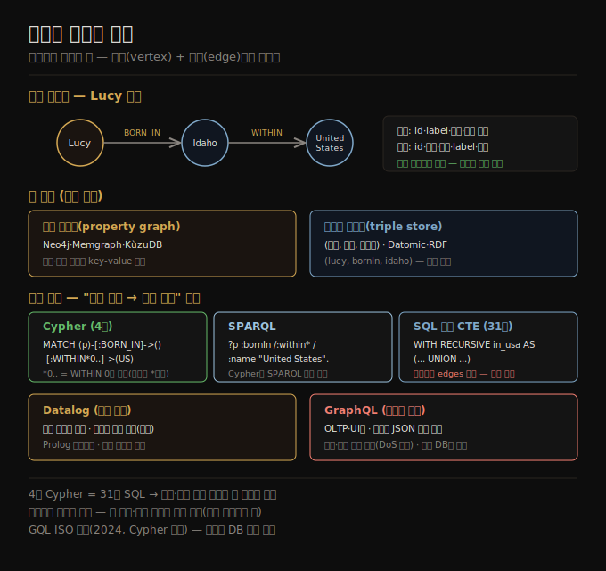

# 그래프 데이터 모델
> 모든 것이 모든 것과 연결될 수 있고 다중 홉 탐색이 필요할 때, 데이터를 정점과 간선의 그래프로 모델링하는 것이 자연스럽습니다.

이 노트를 읽고 나면 속성 그래프와 트리플 스토어를 같은 발상의 다른 표현으로 설명하고, Cypher·SPARQL·Datalog 같은 선언형 그래프 쿼리가 SQL 재귀 CTE보다 왜 간결한지 말하며, GraphQL이 왜 의도적으로 제한적인지 설명할 수 있습니다.

이 노트는 3장의 그래프 데이터 모델을 다룹니다. 데이터에 다대다 관계가 흔하고 연결이 복잡해지면, 관계형이 단순한 다대다는 다룰 수 있어도, 데이터를 **그래프** 로 모델링하는 것이 더 자연스러워집니다. 그래프는 두 종류의 객체로 이뤄집니다 — **정점(vertex, 노드·엔티티)** 과 **간선(edge, 관계·아크)** 입니다. 소셜 그래프(사람·교우), 웹 그래프(페이지·링크), 도로망(교차로·도로)이 전형적 예이고, 최단 경로·PageRank 같은 알고리즘이 동작합니다.

이 노트는 **속성 그래프 모델**(Neo4j·Memgraph·KùzuDB)과 **트리플 스토어 모델**(Datomic·AllegroGraph), 그리고 네 가지 그래프 쿼리 언어(Cypher·SPARQL·Datalog·GraphQL)와 SQL의 그래프 쿼리 지원을 따라갑니다. 실행 예는 미국 아이다호 출신 Lucy와 프랑스 생로 출신 Alain이 런던에 사는 그래프입니다.


## 1. 속성 그래프
> 정점과 간선 모두 label과 key-value 속성을 갖고, 아무 정점이나 연결할 수 있어 스키마 제약 없이 진화에 강합니다.

**속성 그래프(property graph, labeled property graph)** 모델에서 각 정점은 고유 식별자, 객체 유형을 기술하는 label(문자열), 나가는 간선 집합, 들어오는 간선 집합, 속성(key-value) 모음으로 이뤄집니다. 각 간선은 고유 식별자, 시작 정점(꼬리), 끝 정점(머리), 관계 종류를 기술하는 label, 속성 모음으로 이뤄집니다.

그래프 저장소는 정점 테이블 하나와 간선 테이블 하나로 이뤄진다고 생각할 수 있습니다.

```sql
CREATE TABLE vertices (
    vertex_id   integer PRIMARY KEY,
    label       text,
    properties  jsonb
);
CREATE TABLE edges (
    edge_id     integer PRIMARY KEY,
    tail_vertex integer REFERENCES vertices (vertex_id),
    head_vertex integer REFERENCES vertices (vertex_id),
    label       text,
    properties  jsonb
);
CREATE INDEX edges_tails ON edges (tail_vertex);
CREATE INDEX edges_heads ON edges (head_vertex);
```

이 모델의 중요한 점은 다음과 같습니다. 어떤 정점이든 다른 정점과 간선으로 연결될 수 있어 무엇이 연관될 수 있는지 제약하는 스키마가 없습니다. 어떤 정점이든 들어오는·나가는 간선을 효율적으로 찾아 그래프를 양방향으로 순회할 수 있습니다(그래서 tail_vertex·head_vertex 양쪽에 인덱스). 서로 다른 label로 여러 종류의 정보를 한 그래프에 저장하면서도 깔끔한 데이터 모델을 유지합니다.

> 📌 그래프 모델의 한계는 간선이 정점 두 개만 연결할 수 있다는 것입니다. 관계형 조인 테이블은 한 행에 외래 키를 여러 개 둬 3중·고차 관계를 표현할 수 있습니다. 그래프에서 이런 관계는 조인 테이블의 각 행에 대응하는 정점을 추가하거나 하이퍼그래프로 표현합니다.

그래프는 데이터 모델링에 큰 유연성을 줍니다. 나라마다 다른 지역 구조(프랑스의 département·région vs 미국의 county·state), 나라 안의 나라 같은 역사적 특이성, 데이터 입도의 차이(Lucy의 현 거주지는 도시 단위, 출생지는 주 단위)처럼 전통적 관계형 스키마로 표현하기 어려운 것을 담을 수 있습니다. **그래프는 진화에 좋습니다** — 애플리케이션에 기능을 더할 때 데이터 구조 변화를 쉽게 수용합니다. 예를 들어 식품 알레르기를 표현하려 알레르겐 정점과 사람-알레르겐 간선을 추가하고, 알레르겐을 어떤 음식이 어떤 물질을 함유하는지 보이는 정점들과 연결해, 각 사람이 무엇을 안전하게 먹을 수 있는지 쿼리할 수 있습니다.




## 2. Cypher 쿼리 언어
> Cypher는 속성 그래프용 선언형 언어로, 화살표 표기와 가변 길이 경로(`*0..`)로 그래프 패턴을 간결하게 표현합니다.

**Cypher** 는 Neo4j용으로 만들어져 openCypher 오픈 표준이 된 속성 그래프 쿼리 언어입니다(영화 매트릭스의 인물 이름, 암호학 cipher와 무관). 정점·간선 삽입은 화살표 표기를 씁니다 — `(idaho) -[:WITHIN]-> (usa)` 는 idaho를 꼬리, usa를 머리로 하는 WITHIN label 간선을 만듭니다.

미국에서 유럽으로 이주한 사람을 찾는 쿼리를 보면, MATCH 절에서 같은 화살표 표기로 패턴을 찾습니다.

```cypher
MATCH
  (person) -[:BORN_IN]->  () -[:WITHIN*0..]-> (:Location {name:'United States'}),
  (person) -[:LIVES_IN]-> () -[:WITHIN*0..]-> (:Location {name:'Europe'})
RETURN person.name
```

`(person) -[:BORN_IN]-> ()` 는 BORN_IN label 간선으로 연결된 두 정점을 매칭하고, 꼬리 정점을 person 변수에 묶고 머리 정점은 이름 없이 둡니다. `:WITHIN*0..` 는 "WITHIN 간선을 0회 이상 따라가라"는 뜻으로, 정규식의 `*` 연산자와 같습니다 — LIVES_IN 간선이 거리·도시·지역·주 어느 것이든 가리킬 수 있고 위치 계층의 여러 단계를 거칠 수 있기 때문입니다. 실행 방법은 여러 가지입니다 — 모든 사람을 훑어 출생지·거주지를 보거나, 반대로 US·Europe 두 Location 정점에서 시작해 들어오는 WITHIN 간선을 거슬러 올라가 사람을 찾을 수 있습니다(name 인덱스가 있으면 효율적).


## 3. SQL의 그래프 쿼리 — 재귀 CTE
> 그래프 데이터를 관계형에 담아 SQL로 쿼리할 수 있지만, 가변 길이 경로를 재귀 CTE로 표현하면 Cypher보다 훨씬 장황합니다.

그래프 데이터를 관계형에 담을 수 있다면 SQL로도 쿼리할 수 있을까요? 가능하지만 어렵습니다. 그래프 쿼리에서 순회하는 모든 간선은 사실상 edges 테이블과의 조인입니다. 관계형에서는 보통 어떤 조인이 필요한지 미리 알지만, 그래프 쿼리에서는 찾는 정점에 닿기까지 가변 개수의 간선을 순회해야 할 수 있어 조인 수가 미리 정해지지 않습니다.

Cypher의 `:WITHIN*0..` 가 그 사실을 한 줄로 간결하게 표현한 것을, SQL에서는 **재귀 공통 테이블 표현식(WITH RECURSIVE)** 으로 표현합니다. 같은 쿼리(미국 출생 → 유럽 거주)를 SQL로 쓰면 **4줄 Cypher가 31줄 SQL** 이 됩니다.

```sql
WITH RECURSIVE
  in_usa(vertex_id) AS (
      SELECT vertex_id FROM vertices
        WHERE label = 'location' AND properties->>'name' = 'United States'
    UNION
      SELECT edges.tail_vertex FROM edges
        JOIN in_usa ON edges.head_vertex = in_usa.vertex_id
        WHERE edges.label = 'within'
  ),
  -- in_europe, born_in_usa, lives_in_europe 도 비슷하게 정의 ...
SELECT vertices.properties->>'name'
FROM vertices
JOIN born_in_usa     ON vertices.vertex_id = born_in_usa.vertex_id
JOIN lives_in_europe ON vertices.vertex_id = lives_in_europe.vertex_id;
```

4줄 Cypher가 31줄 SQL을 요구한다는 사실은 데이터 모델·쿼리 언어의 올바른 선택이 얼마나 큰 차이를 만드는지 보여 줍니다. **GQL(Graph Query Language) ISO 표준** 이 Cypher에 기반해 2024년 발표됐는데, 아직 널리 채택되진 않았지만 앞으로 그래프 데이터베이스 간 통일성을 높일 것으로 기대됩니다.


## 4. 트리플 스토어와 SPARQL
> 트리플 스토어는 모든 정보를 (주어, 술어, 목적어) 세 부분 문장으로 저장하며, 속성 그래프와 거의 동등하고 SPARQL로 쿼리합니다.

**트리플 스토어(triple store)** 모델은 속성 그래프 모델과 대체로 동등하며 같은 발상을 다른 말로 기술합니다. 모든 정보가 단순한 세 부분 문장 **(주어, 술어, 목적어)** 로 저장됩니다 — 예를 들어 (Jim, likes, bananas)에서 Jim이 주어, likes가 술어, bananas가 목적어입니다. 트리플의 주어는 그래프의 정점에 해당하고, 목적어는 둘 중 하나입니다 — 원시 타입 값(이 경우 술어·목적어가 정점 속성의 키·값)이거나, 다른 정점(이 경우 술어가 간선, 주어가 꼬리, 목적어가 머리)입니다.

같은 데이터를 **Turtle** 형식(Notation3의 부분 집합)으로 쓰면 읽기 쉽습니다.

```turtle
@prefix : <urn:example:>.
_:lucy     a :Person;   :name "Lucy";          :bornIn _:idaho.
_:idaho    a :Location; :name "Idaho";         :type "state";   :within _:usa.
_:usa      a :Location; :name "United States"; :type "country".
```

트리플 스토어 연구·개발의 일부는 **시맨틱 웹(Semantic Web)** — 데이터를 사람이 읽는 웹 페이지뿐 아니라 표준화된 기계 판독 형식으로도 발행해 인터넷 전반의 데이터 교환을 촉진하려던 2000년대 초의 노력 — 에서 동기를 얻었습니다. 원래 구상대로 성공하진 못했지만, JSON-LD·생의학 온톨로지·페이스북 Open Graph 프로토콜·Wikidata·Schema.org 같은 유산이 남았습니다. **RDF(Resource Description Framework)** 는 시맨틱 웹용으로 설계된 데이터 모델이고 Turtle은 그 인코딩 방법입니다. RDF는 인터넷 전반 교환을 위해 주어·술어·목적어를 흔히 URI로 씁니다 — 남의 데이터와 합칠 때 within·lives_in에 다른 의미를 붙여도 서로 다른 URI라 충돌하지 않게 하기 위함입니다.

**SPARQL** 은 RDF 데이터 모델을 쓰는 트리플 스토어용 쿼리 언어입니다(SPARQL Protocol and RDF Query Language의 재귀 약자, "스파클"). Cypher보다 앞서 나왔고 Cypher의 패턴 매칭이 SPARQL에서 차용돼 둘은 꽤 비슷합니다.

```sparql
PREFIX : <urn:example:>
SELECT ?personName WHERE {
  ?person :name ?personName.
  ?person :bornIn  / :within* / :name "United States".
  ?person :livesIn / :within* / :name "Europe".
}
```

다음 두 표현은 동등합니다(SPARQL 변수는 `?` 로 시작).

```
(person) -[:BORN_IN]-> () -[:WITHIN*0..]-> (location)   # Cypher
?person :bornIn / :within* ?location.                   # SPARQL
```


## 5. Datalog — 재귀 관계형 쿼리
> Datalog는 기본 사실에서 파생 규칙을 쌓아 올리고 규칙이 자기 자신을 호출(재귀)할 수 있어, 그래프 순회에 강력합니다.

**Datalog** 는 SPARQL·Cypher보다 훨씬 오래된, 1980년대 학술 연구에서 나온 언어입니다. 소프트웨어 엔지니어에게 덜 알려졌고 주류 데이터베이스 지원도 적지만, 표현력이 뛰어나고 복잡한 쿼리에 강력해 더 알려질 만합니다(Datomic·LogicBlox·CozoDB가 씁니다). 그래프가 아닌 관계형 데이터 모델에 기반하지만, 그래프의 재귀 쿼리가 Datalog의 특별한 강점입니다.

Datalog 데이터베이스의 내용은 **사실(fact)** 이라 하고 각 사실은 관계형 테이블의 한 행에 대응합니다. 예를 들어 미국이 나라라는 사실은 `location(2, "United States", "country")` 로 씁니다. 미국 출생 → 유럽 거주 쿼리는 다음과 같습니다.

```prolog
within_recursive(LocID, PlaceName) :- location(LocID, PlaceName, _). /* 규칙 1 */
within_recursive(LocID, PlaceName) :- within(LocID, ViaID),          /* 규칙 2 */
                                      within_recursive(ViaID, PlaceName).
migrated(PName, BornIn, LivingIn)  :- person(PersonID, PName),       /* 규칙 3 */
                                      born_in(PersonID, BornID),
                                      within_recursive(BornID, BornIn),
                                      lives_in(PersonID, LivingID),
                                      within_recursive(LivingID, LivingIn).
us_to_europe(Person) :- migrated(Person, "United States", "Europe"). /* 규칙 4 */
```

Cypher·SPARQL이 곧장 SELECT로 들어가는 것과 달리, Datalog는 한 번에 작은 걸음을 뗍니다. 기본 사실에서 새 가상 테이블을 파생하는 규칙을 정의합니다 — 이 파생 테이블은 (가상) SQL 뷰와 같아 저장되진 않지만 저장된 사실처럼 쿼리할 수 있습니다. 규칙의 `:-` 앞부분이 가상 테이블 이름·컬럼을 정하고, 뒷부분이 어떤 패턴에 맞는 행을 찾는지 정합니다. 규칙은 함수처럼 다른 규칙을 참조할 수 있고, 함수가 재귀하듯 규칙 2처럼 자기 자신을 호출할 수 있어 그래프 순회를 가능하게 합니다. 이 접근은 다른 언어와 다른 사고를 요구하지만, 복잡한 쿼리를 규칙 단위로 쌓아 올리게 합니다.


## 6. GraphQL — 의도적으로 제한된 언어
> GraphQL은 신뢰할 수 없는 클라이언트용이라 재귀·임의 검색을 막고, 클라이언트가 필요한 JSON 구조만 요청하게 합니다.

**GraphQL** 은 이 장의 다른 언어보다 의도적으로 훨씬 제한적인 쿼리 언어입니다. OLTP 쿼리용으로, 사용자 기기에서 도는 클라이언트(모바일 앱·웹 프론트엔드)가 UI 렌더링에 필요한 필드를 담은 특정 구조의 JSON 문서를 요청하게 합니다. GraphQL 인터페이스는 서버 API를 바꾸지 않고 클라이언트 코드의 쿼리를 빠르게 바꾸게 하지만, 그 유연성에는 비용이 따릅니다 — 쿼리를 내부 서비스(REST·gRPC) 요청으로 변환하는 도구가 필요하고 인가·속도 제한·성능이 추가 관심사입니다.

GraphQL이 의도적으로 제한적인 이유는 쿼리가 신뢰할 수 없는 출처에서 오기 때문입니다. 실행이 비쌀 수 있는 것을 허용하지 않습니다 — 그러지 않으면 사용자가 비싼 쿼리를 잔뜩 돌려 서버에 서비스 거부를 유발할 수 있기 때문입니다. 특히 (Cypher·SPARQL·SQL·Datalog와 달리) 재귀 쿼리를 허용하지 않고, 서비스 소유자가 특정 검색 기능을 제공하기로 명시하지 않는 한 임의 검색 조건도 허용하지 않습니다.

```graphql
query ChatApp {
  channels {
    name
    recentMessages(latest: 50) {
      timestamp
      content
      sender { fullName, imageUrl }
      replyTo { content, sender { fullName } }
    }
  }
}
```

응답은 쿼리 구조를 그대로 비추는 JSON 문서로, 요청된 속성만 정확히 담습니다 — 서버는 클라이언트가 어떤 속성을 필요로 하는지 알 필요 없이 클라이언트가 필요한 것을 요청합니다. 같은 사용자가 여러 메시지를 보내면 sender 정보가 메시지마다 반복되는데, GraphQL은 응답 크기가 커지더라도 UI 렌더링을 단순하게 만드는 설계 선택을 합니다. 서버 데이터베이스는 데이터를 더 정규화된 형태로 저장하고 쿼리 처리 시 필요한 조인을 수행할 수 있지만, GraphQL 스키마에 명시적으로 선언된 조인만 클라이언트가 요청할 수 있습니다. 응답이 문서 데이터베이스 응답과 비슷해 보이고 이름에 "graph"가 들어가도, GraphQL은 관계형·문서·그래프 어느 유형의 데이터베이스 위에도 구현할 수 있습니다.


## 자주 받는 오해

1. **"속성 그래프와 트리플 스토어는 전혀 다른 모델이다"** — 거의 동등하며 같은 발상을 다른 말로 기술합니다. (lucy, bornIn, idaho) 트리플은 lucy 정점에서 idaho 정점으로 가는 bornIn 간선과 같습니다. Amazon Neptune 같은 일부 DB는 둘 다 지원합니다.
2. **"그래프 데이터는 SQL로 못 쓴다"** — 쓸 수 있지만 가변 길이 경로를 재귀 CTE(WITH RECURSIVE)로 표현해야 해 꽤 장황합니다. 4줄 Cypher가 31줄 SQL이 됩니다.
3. **"GraphQL은 그래프 데이터베이스 쿼리 언어다"** — 이름에 graph가 있지만 관계형·문서·그래프 어느 DB 위에도 구현됩니다. 신뢰할 수 없는 클라이언트용이라 재귀·임의 검색을 막은, UI용 JSON 요청 언어입니다.
4. **"Datalog는 그래프 모델 전용이다"** — Datalog는 관계형 데이터 모델에 기반합니다. 다만 규칙이 자기 자신을 호출(재귀)할 수 있어 그래프 순회가 특별한 강점일 뿐입니다.


## 면접에서 받을 만한 질문

1. **"언제 그래프 모델이 관계형·문서보다 자연스러운가?"** — 다대다 관계가 흔하고 연결이 복잡해, 무엇이든 무엇과 연결될 수 있고 다중 홉 탐색(여러 간선 순회)이 필요할 때입니다. 그래프는 진화에 좋아 새 정점·간선 유형을 쉽게 추가합니다.
2. **"속성 그래프의 정점·간선은 무엇으로 구성되나?"** — 정점은 id·label·속성(key-value)·입출 간선 집합을, 간선은 id·꼬리 정점·머리 정점·label·속성을 가집니다. 아무 정점이나 연결할 수 있고 양방향 순회를 위해 꼬리·머리 양쪽에 인덱스를 둡니다.
3. **"Cypher가 SQL 재귀 CTE보다 간결한 이유는?"** — 그래프 쿼리는 찾는 정점까지 가변 개수의 간선을 순회해 조인 수가 미리 정해지지 않습니다. Cypher는 `:WITHIN*0..`(0회 이상)로 이를 한 줄에 표현하지만, SQL은 WITH RECURSIVE로 같은 걸 표현해 4줄이 31줄이 됩니다.
4. **"GraphQL은 왜 의도적으로 제한적인가?"** — 쿼리가 신뢰할 수 없는 클라이언트에서 오기 때문입니다. 비싼 쿼리로 서비스 거부를 유발하지 못하게 재귀·임의 검색을 막고, 클라이언트가 UI에 필요한 JSON 구조만 요청하게 합니다.


## 관련 문서

> 이 노트는 3장의 그래프 축이며, 모델 선택과 이벤트 소싱 노트를 잇습니다.

- [03-04 모델 선택과 스키마 유연성](./03-04.모델%20선택과%20스키마%20유연성.md) § "언제 어느 모델을 쓰는가" — 다대다가 복잡해지면 그래프로 가는 흐름
- [03-06 이벤트 소싱·CQRS·DataFrame](./03-06.이벤트%20소싱·CQRS·DataFrame.md) — 쓰기 최적화 표현(이벤트 로그)이라는 또 다른 모델로 연결
- [ddia2 README — 2판 정독 인덱스](./README.md)
