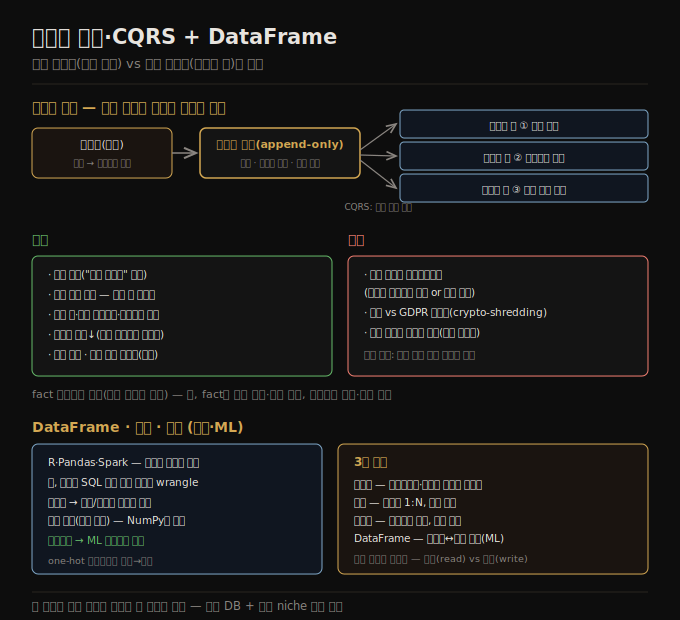

# 이벤트 소싱·CQRS·DataFrame
> 데이터를 불변 이벤트 로그로 쓰고 거기서 읽기 최적화 구체화 뷰를 파생하는 것이 이벤트 소싱·CQRS이며, DataFrame은 관계형과 행렬을 잇습니다.

이 노트를 읽고 나면 이벤트 소싱이 왜 쓰기에 최적화된 표현인지 설명하고, CQRS가 읽기·쓰기 표현을 어떻게 분리하는지 말하며, DataFrame이 관계형 데이터를 행렬로 변환해 ML로 잇는 방식을 설명할 수 있습니다.

이 노트는 3장의 마지막 두 모델 — 이벤트 소싱·CQRS, 그리고 DataFrame·행렬 — 을 다루고, 3장 전체를 종합합니다. 지금까지의 모델은 데이터를 *쓴 형태 그대로* 쿼리했습니다(JSON·행·정점). 그러나 복잡한 애플리케이션에서는 모든 쿼리·표현 방식을 만족하는 단일 표현을 찾기 어려울 수 있습니다. 이럴 때 데이터를 한 형태로 쓰고 거기서 읽기에 최적화된 여러 표현을 파생하면 유익합니다 — [01-02](./01-02.기록%20시스템%20vs%20파생%20데이터.md)의 기록/파생 발상을 더 밀어붙이는 것입니다.

## 1. 이벤트 소싱 — 불변 로그가 진실의 원천
> 모든 상태 변화를 불변 이벤트로 로그에 추가하고, 그 로그를 진실의 원천으로 삼는 것이 이벤트 소싱입니다.

데이터를 쓰는 가장 단순·빠르고 표현력 있는 방법은 **이벤트 로그(event log)** 입니다 — 데이터를 쓸 때마다 타임스탬프를 포함해 자족적 문자열(JSON 등)로 인코딩하고 이벤트 시퀀스에 추가합니다. 이 로그의 이벤트는 **불변** 입니다 — 절대 바꾸거나 삭제하지 않고 더 많은 이벤트를 추가할 뿐입니다(나중 이벤트가 앞 이벤트를 대체할 수는 있음).

컨퍼런스 관리 시스템을 예로 보면, 개별 참석자 등록·카드 결제뿐 아니라 회사가 좌석을 대량 주문해 송장 결제 후 개인에게 배정하고, 일부 좌석은 연사·후원사용으로 예약되고, 예약이 취소되고, 주최자가 다른 방으로 옮겨 정원을 바꿀 수도 있습니다. 이 모든 게 일어나면 가용 좌석 수 계산조차 까다로운 쿼리가 됩니다. 컨퍼런스 상태의 모든 변화(주최자의 등록 개시, 참석자의 등록·취소)를 먼저 이벤트로 저장하고, 이벤트가 로그에 추가될 때마다 여러 **구체화 뷰(materialized view, projection·read model)** 가 그 효과를 반영하도록 갱신됩니다 — 예약 상태 뷰, 대시보드 차트 뷰, 배지 인쇄 파일 뷰 같은 것입니다.

이벤트를 진실의 원천으로 쓰고 모든 상태 변화를 이벤트로 표현하는 발상을 **이벤트 소싱(event sourcing)** 이라 합니다. 읽기 최적화 표현을 따로 유지하고 그것을 쓰기 최적화 표현에서 파생하는 원칙을 **CQRS(command query responsibility segregation)** 라 합니다. 이 용어들은 DDD 커뮤니티에서 나왔지만 비슷한 발상은 상태 기계 복제 등에 오래 있었습니다.

사용자 요청이 들어오면 **커맨드(command)** 라 하고 먼저 검증해야 합니다. 커맨드가 실행돼 유효하다고 판정되면(예: 요청한 예약에 좌석이 충분) **사실(fact)** 이 되고 대응 이벤트가 로그에 추가됩니다. 따라서 이벤트 로그는 유효한 이벤트만 담아야 하고, 구체화 뷰를 만드는 소비자는 이벤트를 거부할 수 없습니다. 이벤트는 *과거형* 으로 명명하는 것이 권장됩니다(예: "좌석이 예약됨") — 이벤트는 무언가 일어난 사실의 기록이기 때문입니다. 사용자가 나중에 예약을 바꾸거나 취소해도 한때 예약을 했다는 사실은 참으로 남고, 변경·취소는 나중에 추가되는 별도 이벤트입니다.

## 2. 이벤트 소싱·CQRS의 장단점
> 이벤트는 의도를 명확히 전달하고 뷰를 재현 가능하게 하지만, 외부 정보의 결정성과 불변성-삭제권 충돌이라는 비용이 따릅니다.

이벤트 소싱·CQRS의 장점은 다음과 같습니다.

1. **의도 전달** — 이벤트는 무언가 일어난 *이유* 를 잘 전달합니다. "예약이 취소됨"이 "bookings 4001행 active를 false로, seat_assignments 3행 삭제, payments에 환불 행 삽입"보다 이해하기 쉽습니다.
2. **재현 가능한 뷰** — 구체화 뷰는 이벤트 로그에서 재현 가능하게 파생됩니다. 언제든 뷰를 삭제하고 같은 이벤트를 같은 순서로 같은 코드로 처리해 다시 계산할 수 있어, 뷰 유지 코드에 버그가 있으면 삭제 후 새 코드로 재계산하면 됩니다.
3. **여러 뷰** — 애플리케이션이 필요로 하는 쿼리에 최적화된 여러 구체화 뷰를 둘 수 있고, 어느 데이터 모델이든 쓰고 빠른 읽기를 위해 비정규화할 수 있습니다. 메모리에만 두고 재시작 시 재계산해도 됩니다.
4. **진화 용이** — 기존 이벤트 로그에서 새 구체화 뷰를 쉽게 만들고, 새 이벤트 유형·속성을 추가해 새 기능을 지원할 수 있습니다(옛 이벤트는 미변경).
5. **비가역성 감소** — 오류로 쓴 이벤트는 후속 삭제 이벤트로 되돌립니다. 직접 갱신·삭제하는 데이터베이스에서는 커밋된 트랜잭션을 되돌리기 어려운데, 이벤트 소싱은 [비가역 작업](./02-05.유지보수성.md)을 줄여 변경을 쉽게 합니다.
6. **감사 로그·높은 쓰기 처리량** — 이벤트 로그는 시스템에서 무슨 일이 있었는지의 감사 로그로도 쓰여 규제 산업에 유용하고, 순차 접근 패턴 덕에 데이터베이스보다 높은 쓰기 처리량을 다룰 수 있습니다.

단점도 있습니다.

1. **외부 정보의 결정성** — 이벤트 처리 로직이 결정적이어야 합니다. 이벤트에 한 통화 가격이 있고 다른 통화로 변환해야 하면, 환율이 변동하므로 처리 시 외부에서 환율을 가져오면 다른 날 재계산 시 다른 결과가 나옵니다. 환율을 이벤트 자체에 포함하거나, 이벤트 타임스탬프의 과거 환율을 항상 같은 결과로 조회하는 방법이 필요합니다.
2. **불변성 vs 삭제권** — 이벤트가 불변이라는 요건은 이벤트가 개인 데이터를 담을 때 문제가 됩니다. 사용자가 GDPR 삭제권을 행사할 수 있기 때문입니다. 사용자별 로그면 통째로 삭제하면 되지만 여러 사용자 이벤트가 섞이면 안 됩니다. 개인 데이터를 이벤트 밖에 저장하거나 나중에 삭제할 수 있는 키로 암호화(crypto-shredding)할 수 있지만, 파생 상태 재계산이 어려워집니다.
3. **외부 부작용 재처리** — 외부에 보이는 부작용이 있으면 이벤트 재처리에 주의해야 합니다 — 구체화 뷰를 재구축할 때마다 확인 이메일을 다시 보내면 안 됩니다.

이벤트 소싱은 어느 데이터베이스 위에도 구현할 수 있지만, EventStoreDB·MartenDB·Axon Framework처럼 이 패턴을 위해 설계된 시스템도 있습니다. Apache Kafka로 이벤트 로그를 저장하고 스트림 프로세서가 구체화 뷰를 갱신할 수도 있습니다. 유일한 중요 요건은 이벤트 저장 시스템이 모든 구체화 뷰가 로그에 나타난 순서와 정확히 같은 순서로 이벤트를 처리하도록 보장하는 것인데, 분산 시스템에서 이는 항상 쉽지 않습니다.

> 📌 이벤트 소싱은 [별 스키마 fact 테이블](./03-03.분석용%20스키마%20—%20별·눈송이·OBT.md)과 둘 다 과거에 일어난 이벤트의 모음이라는 유사점이 있습니다. 다만 fact 테이블 행은 모두 같은 컬럼 집합을 갖는 반면 이벤트 소싱은 각기 다른 속성의 여러 이벤트 유형이 있을 수 있고, fact 테이블은 순서 없는 모음이지만 이벤트 소싱은 순서가 중요합니다(예약 후 취소를 잘못된 순서로 처리하면 말이 안 됨).

## 3. DataFrame·행렬·배열
> DataFrame은 관계형 테이블과 비슷하지만 명령 연쇄로 조작하며, 관계형 데이터를 행렬로 변환해 ML 알고리즘의 입력으로 잇습니다.

지금까지의 데이터 모델은 트랜잭션 처리·분석 둘 다에 쓰이지만, 분석·과학 맥락에서 마주치되 OLTP에는 드문 모델도 있습니다 — DataFrame과 행렬 같은 다차원 숫자 배열입니다. **DataFrame** 모델은 R·Pandas·Apache Spark·Dask 등이 지원하며, 데이터 과학자가 ML 모델 학습용 데이터를 준비하는 인기 도구이자 데이터 탐색·통계 분석·시각화에도 널리 쓰입니다.

언뜻 DataFrame은 관계형 테이블·스프레드시트와 비슷합니다 — 행에 함수 적용, 조건 필터, 그룹·집계, 키 기준 조인(DataFrame에서는 흔히 merge라 부름) 같은 관계형식 연산을 지원합니다. 그러나 SQL 같은 선언형 쿼리 언어 대신, DataFrame은 보통 구조·내용을 수정하는 명령 연쇄로 조작됩니다. 이는 데이터 과학자가 데이터를 점진적으로 "wrangle(주무르기)"해 묻는 질문의 답을 찾는 전형적 작업 흐름에 맞습니다.

DataFrame API는 관계형 데이터베이스가 제공하는 것을 훨씬 넘어서고, 흔히 관계형 모델링과 사뭇 다르게 쓰입니다. 흔한 용도는 데이터를 관계형식 표현에서 **행렬(matrix)·다차원 배열** 표현으로 변환하는 것인데, 많은 ML 알고리즘이 입력으로 기대하는 형태입니다. 예를 들어 사용자의 영화 평점(1~5) 관계형 테이블을, 각 열이 영화이고 각 행이 사용자인 행렬로 변환할 수 있습니다(스프레드시트의 피벗 테이블처럼). 이 행렬은 **희소(sparse)** 합니다 — 많은 사용자-영화 조합에 데이터가 없지만 괜찮습니다. 수천 개 열을 가질 수 있어 관계형에는 잘 안 맞지만, DataFrame과 희소 배열 라이브러리(NumPy)는 쉽게 다룹니다.

행렬은 숫자만 담을 수 있어 비숫자 데이터를 숫자로 변환하는 기법을 씁니다. 날짜는 적절한 범위의 부동소수점으로 스케일링하고, 작은 고정 값 집합만 갖는 열(영화 장르 등)은 **one-hot 인코딩** — 가능한 값마다 열을 만들고(코미디·드라마·호러) 해당 장르 열에 1, 나머지에 0 — 을 씁니다. 데이터가 숫자 행렬이 되면 선형대수 연산이 가능해지고, 이는 많은 ML 알고리즘의 기반입니다. DataFrame은 데이터를 관계형에서 행렬로 점진적으로 진화시키면서 데이터 과학자가 분석·학습 목표에 가장 알맞은 표현을 통제하게 할 만큼 유연합니다. TileDB 같은 일부 데이터베이스는 큰 다차원 배열 저장에 특화돼(array database) 지리공간·의료 영상·천문 관측 같은 과학 데이터셋에 쓰입니다.

## 4. 3장 종합
> 관계형은 분석에 여전히 지배적이고, 문서·그래프·DataFrame이 각 영역을 채우며, 모델 간 흉내는 가능하나 어색합니다.

3장은 데이터 모델의 넓은 다양성을 빠르게 훑었습니다. 관계형 모델은 반세기 넘었지만 데이터 웨어하우스·비즈니스 분석에서 별·눈송이 스키마와 SQL로 여전히 지배적입니다. 그러나 다른 영역에서 대안들이 인기를 얻었습니다.

1. **문서 모델** — 데이터가 자족적 JSON 문서로 오고 문서 간 관계가 드문 경우를 겨냥합니다.
2. **그래프 모델** — 반대 방향으로, 무엇이든 잠재적으로 모든 것과 연관되고 쿼리가 여러 홉을 순회해야 하는 경우를 겨냥합니다(Cypher·SPARQL·Datalog의 재귀 쿼리).
3. **DataFrame** — 관계형 데이터를 많은 수의 열로 일반화해, 데이터베이스와 ML·통계 분석·과학 계산의 기반인 다차원 배열 사이를 잇습니다.

한 모델을 다른 모델로 흉내낼 수 있지만(그래프 데이터를 관계형에 표현하는 등) 결과는 어색할 수 있습니다(SQL의 재귀 쿼리 지원에서 봤듯). 그래서 각 모델에 특화된 전문 데이터베이스가 개발됐지만, 데이터베이스가 이웃 niche로 확장하는 추세도 있습니다 — 관계형이 JSON 컬럼을, 문서가 관계형식 조인을, SQL이 그래프 지원을 더하는 식입니다.

또 다른 모델 **이벤트 소싱** 은 데이터를 불변 이벤트의 append-only 로그로 표현해 복잡한 비즈니스 도메인 모델링에 유리하고, 효율적 쿼리를 위해 CQRS로 읽기 최적화 구체화 뷰로 변환됩니다. 비관계형 모델들의 공통점 하나는 보통 스키마를 강제하지 않아 변화하는 요구에 적응하기 쉽다는 것입니다. 다만 애플리케이션은 여전히 데이터가 어떤 구조를 가진다고 가정하므로, 스키마가 명시적(쓸 때 강제)이냐 암묵적(읽을 때 가정)이냐의 문제일 뿐입니다.

## 자주 받는 오해

1. **"이벤트 소싱은 현재 상태를 저장하지 않으니 쿼리가 느리다"** — 이벤트 로그(쓰기 최적화)에서 읽기 최적화 구체화 뷰를 파생합니다(CQRS). 읽기는 그 뷰에서 빠르게 하고, 뷰는 어느 모델이든 쓰고 비정규화할 수 있습니다. 로그는 쓰기 처리량이 오히려 높습니다.
2. **"이벤트는 나중에 수정·삭제하면 된다"** — 이벤트는 불변이라 과거형으로 명명하고, 변경·취소는 별도 이벤트로 추가합니다. 오류는 후속 삭제 이벤트로 되돌립니다. 이 불변성이 GDPR 삭제권과 충돌해 crypto-shredding 같은 기법이 필요합니다.
3. **"DataFrame은 그냥 관계형 테이블이다"** — 비슷하지만 선언형 SQL 대신 명령 연쇄로 조작하고, 관계형을 훨씬 넘는 연산을 제공합니다. 핵심 용도는 관계형 데이터를 희소 행렬로 변환해 ML 알고리즘의 입력으로 잇는 것입니다.
4. **"한 데이터 모델이 다른 것을 완전히 대체한다"** — 흉내는 가능하나 어색합니다(그래프를 SQL로). 모델마다 특화 DB가 있고, 동시에 DB들이 이웃 niche를 흡수해 한 DB가 여러 모델을 지원하는 추세입니다.

## 면접에서 받을 만한 질문

1. **"이벤트 소싱과 CQRS가 무엇인가?"** — 이벤트 소싱은 모든 상태 변화를 불변 이벤트로 append-only 로그에 추가하고 그것을 진실의 원천으로 삼습니다. CQRS는 읽기 최적화 표현(구체화 뷰)을 쓰기 최적화 표현(이벤트 로그)에서 파생하는 원칙입니다. 쓰기는 로그에, 읽기는 뷰에 최적화됩니다.
2. **"이벤트 소싱의 장점과 단점은?"** — 장점: 의도 전달, 재현 가능한 뷰, 여러 뷰, 비가역성 감소, 감사 로그, 높은 쓰기 처리량. 단점: 외부 정보의 결정성 필요(환율은 이벤트에 포함), 불변성과 GDPR 삭제권 충돌(crypto-shredding), 외부 부작용 재처리 주의, 모든 뷰가 같은 순서로 처리해야 함.
3. **"이벤트 소싱과 별 스키마 fact 테이블의 차이는?"** — 둘 다 과거 이벤트 모음이지만, fact 테이블 행은 모두 같은 컬럼을 갖고 순서가 무관한 반면, 이벤트 소싱은 다른 속성의 여러 이벤트 유형이 있고 순서가 중요합니다(예약 후 취소).
4. **"DataFrame이 관계형 데이터를 ML로 어떻게 잇나?"** — 관계형식 표현(예: 사용자-영화 평점)을 행렬·다차원 배열로 변환합니다(피벗처럼). 날짜는 스케일링, 범주는 one-hot 인코딩으로 숫자화해 희소 행렬을 만들고, 선형대수 연산으로 ML 알고리즘의 입력이 됩니다.

## 관련 문서

> 이 노트는 3장의 마지막 축이자 3장 전체의 종합이며, 그래프·분석 스키마 노트로 흐름을 닫습니다.

- [03-05 그래프 데이터 모델](./03-05.그래프%20데이터%20모델.md) — 쓰기 형태 그대로 쿼리하는 모델에서 쓰기/읽기 분리로 넘어가는 대비
- [03-03 분석용 스키마 — 별·눈송이·OBT](./03-03.분석용%20스키마%20—%20별·눈송이·OBT.md) § "별 스키마" — fact 테이블과 이벤트 로그의 유사·차이
- [01-02 기록 시스템 vs 파생 데이터](./01-02.기록%20시스템%20vs%20파생%20데이터.md) — 이벤트 로그=기록 시스템, 구체화 뷰=파생 데이터로 연결
- [ddia2 README — 2판 정독 인덱스](./README.md)
