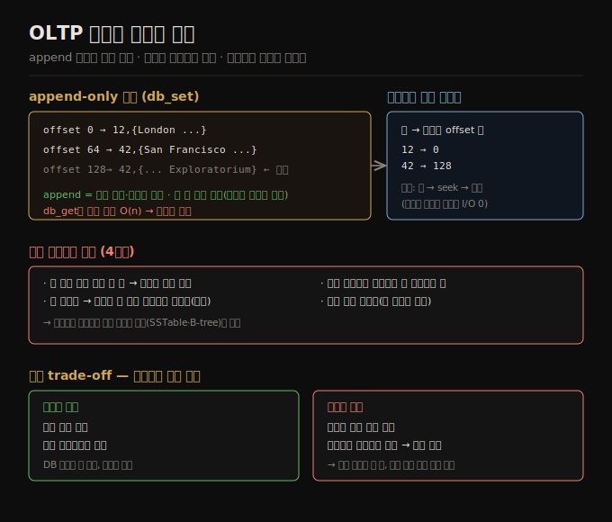

# OLTP 저장과 인덱스 기초
> append-only 로그는 쓰기가 가장 단순·빠르고, 읽기는 인덱스로 가속하되, 모든 인덱스는 쓰기를 늦추는 trade-off를 가집니다.

이 노트를 읽고 나면 데이터베이스가 왜 내부적으로 로그를 쓰는지 설명하고, 인메모리 해시 인덱스의 동작과 한계를 말하며, 인덱스가 읽기를 빠르게 하는 대신 쓰기를 늦추는 trade-off를 설명할 수 있습니다.

4장은 데이터베이스의 관점에서 저장과 검색을 다룹니다 — 준 데이터를 어떻게 저장하고, 다시 요청하면 어떻게 찾아내는가입니다. 파인만의 말처럼 컴퓨터는 산술 계산보다 본질적으로 *파일링 시스템* 입니다. 애플리케이션 개발자가 저장 엔진 내부를 알아야 하는 이유는, 직접 구현하진 않더라도 워크로드에 맞는 엔진을 고르고 잘 동작하게 튜닝하려면 내부에서 무슨 일이 벌어지는지 대략 알아야 하기 때문입니다. 특히 트랜잭션(OLTP)용과 분석(OLAP)용 저장 엔진은 크게 다릅니다([01-01](./01-01.운영%20시스템%20vs%20분석%20시스템.md)).

이 노트는 OLTP 저장의 출발점을 다룹니다 — 세상에서 가장 단순한 데이터베이스(두 bash 함수)에서 시작해 로그, 인메모리 해시 인덱스, 그리고 인덱스의 근본 trade-off를 따라갑니다.


## 1. 가장 단순한 데이터베이스 — append-only 로그
> db_set은 파일 끝에 추가만 하므로 쓰기가 효율적이지만, db_get은 전체를 훑어 O(n)이라 큰 데이터에서 느립니다.

세상에서 가장 단순한 데이터베이스는 두 bash 함수로 구현할 수 있습니다.

```bash
db_set () { echo "$1,$2" >> database; }              # 키,값을 파일 끝에 추가
db_get () { grep "^$1," database | sed -e "s/^$1,//" | tail -n 1; }  # 마지막 등장값
```

`db_set key value` 는 키-값을 저장하고, `db_get key` 는 그 키의 가장 최근 값을 돌려줍니다. 저장 형식은 단순합니다 — 각 줄이 쉼표로 구분된 키-값 쌍인 텍스트 파일(대략 CSV)입니다. db_set 호출마다 파일 끝에 추가하고, 키를 여러 번 갱신해도 옛 값을 덮어쓰지 않으므로 파일에서 그 키의 *마지막 등장* 을 봐야 최신 값을 찾습니다(그래서 `tail -n 1`).

db_set은 단순한 것치고 성능이 꽤 좋은데, 파일에 추가하는 것이 일반적으로 효율적이기 때문입니다. db_set이 하는 것과 비슷하게, 많은 데이터베이스가 내부적으로 **로그(log)** — append-only 데이터 파일 — 를 씁니다. 실제 데이터베이스는 동시 쓰기 처리, 로그가 무한히 커지지 않게 디스크 공간 회수, 크래시 복구 시 부분 기록 처리 같은 더 많은 문제를 다루지만 기본 원리는 같습니다.

> 📌 "로그"는 흔히 애플리케이션이 출력하는 텍스트(애플리케이션 로그)를 가리키지만, 이 책에서는 더 일반적 의미 — 디스크상 레코드의 append-only 시퀀스 — 로 씁니다. 사람이 읽을 필요 없이 이진이고 데이터베이스 내부용일 수 있습니다.

반면 db_get은 레코드가 많으면 성능이 끔찍합니다. 키를 찾을 때마다 데이터베이스 파일 전체를 처음부터 끝까지 훑어 키 등장을 찾기 때문입니다. 알고리즘적으로 조회 비용은 **O(n)** 입니다 — 레코드 수 n을 두 배로 하면 조회가 두 배 걸립니다. 특정 키의 값을 효율적으로 찾으려면 다른 자료 구조 — **인덱스(index)** — 가 필요합니다.


## 2. 인메모리 해시 인덱스
> 키마다 가장 최근 값의 바이트 offset을 인메모리 해시 맵에 두면 조회가 빨라지지만, 메모리 적재·비영속·범위 쿼리 같은 한계가 있습니다.

append-only 파일에 계속 저장하면서 읽기만 빠르게 하려면, 모든 키를 그 키의 가장 최근 값이 있는 **바이트 offset** 에 매핑하는 해시 맵을 메모리에 두는 방법이 있습니다. 새 키-값 쌍을 파일에 추가할 때마다 해시 맵도 갱신해 방금 쓴 데이터의 offset을 반영합니다. 값을 조회할 때는 해시 맵으로 로그 파일의 offset을 찾아 그 위치로 seek해 값을 읽습니다. 그 부분이 이미 파일시스템 캐시에 있으면 읽기에 디스크 I/O가 전혀 필요 없습니다.

이 접근은 훨씬 빠르지만 여러 문제가 있습니다.

1. 덮어써진 옛 로그 항목이 차지한 디스크 공간을 회수하지 못해, 계속 쓰면 디스크가 고갈될 수 있습니다.
2. 해시 맵이 영속되지 않아 재시작 시 — 예를 들어 전체 로그를 훑어 각 키의 최신 offset을 찾아 — 재구축해야 합니다. 데이터가 많으면 재시작이 느립니다.
3. 해시 테이블이 메모리에 다 들어가야 합니다. 디스크상 해시 맵은 무작위 접근 I/O가 많고, 가득 찰 때 키우기 비싸며, 해시 충돌 처리가 까다로워 잘 동작하게 만들기 어렵습니다.
4. 범위 쿼리가 비효율적입니다. 예를 들어 10000~19999의 모든 키를 쉽게 훑을 수 없고 각 키를 따로 조회해야 합니다.

이런 한계 때문에 실무에서 데이터베이스 인덱스에 해시 테이블은 자주 쓰이지 않습니다. 대신 키로 정렬된 구조([04-02](./04-02.LSM%20저장%20엔진.md)의 SSTable·LSM, [04-03](./04-03.B-tree와%20LSM%20비교.md)의 B-tree)를 두는 것이 훨씬 흔합니다.




## 3. 인덱스의 근본 trade-off
> 인덱스는 기본 데이터에서 파생된 추가 구조라 읽기를 빠르게 하지만, 디스크 공간을 더 쓰고 쓰기마다 갱신돼 쓰기를 늦춥니다.

특정 키의 값을 효율적으로 찾으려면 인덱스가 필요합니다. 일반 발상은 데이터를 특정 방식(예: 키로 정렬)으로 구조화해 원하는 데이터를 더 빨리 찾는 것입니다. 같은 데이터를 여러 방식으로 검색하려면 데이터의 서로 다른 부분에 여러 인덱스가 필요할 수 있습니다.

**인덱스는 기본 데이터에서 파생된 추가 구조** 입니다. 많은 데이터베이스가 인덱스를 더하거나 빼게 해 주는데, 이는 데이터베이스 내용에 영향을 주지 않고 쿼리 성능에만 영향을 줍니다. 추가 구조를 유지하면 오버헤드가 생기는데, 특히 쓰기에 그렇습니다. 쓰기에서는 그냥 파일에 추가하는 성능을 이기기 어렵습니다 — 그것이 가능한 가장 단순한 쓰기 연산이기 때문입니다. 어떤 종류의 인덱스든 보통 쓰기를 늦추는데, 데이터를 쓸 때마다 인덱스도 갱신해야 하기 때문입니다.

이것이 저장 시스템의 중요한 trade-off입니다 — **잘 고른 인덱스는 읽기 쿼리를 빠르게 하지만, 모든 인덱스는 추가 디스크 공간을 소비하고 쓰기를 늦춥니다(때로 상당히).** 이 때문에 데이터베이스는 보통 기본적으로 모든 것을 인덱싱하지 않고, 애플리케이션의 전형적 쿼리 패턴 지식을 바탕으로 사람이 인덱스를 수동 선택하게 요구합니다. 그러면 쓰기에 필요 이상의 오버헤드를 들이지 않으면서 애플리케이션에 가장 이로운 인덱스를 고를 수 있습니다.

> 💬 비유로 보면, 인덱스는 *책 뒤의 색인* 입니다. 색인이 있으면 특정 단어를 빨리 찾지만, 책을 새로 찍을 때마다 색인도 다시 만들어야 합니다. 이 비유는 *읽기 가속 vs 갱신 비용* 까지 유효하지만, 데이터베이스 인덱스는 색인과 달리 *원본을 잃어도 다시 만들 수 있는 파생 데이터* 라는 점은 책 비유로 표현되지 않습니다.


## 자주 받는 오해

1. **"append-only 로그는 비효율적이다"** — 반대입니다. 파일 끝에 추가하는 것은 가능한 가장 단순·효율적인 쓰기라, 많은 데이터베이스가 내부적으로 로그를 씁니다. 비효율적인 건 *인덱스 없는 조회*(전체 스캔 O(n))이지 로그 쓰기가 아닙니다.
2. **"해시 인덱스가 가장 단순하니 실무에서도 흔하다"** — 인메모리 해시 인덱스는 메모리 적재·비영속·범위 쿼리 한계가 있어 자주 쓰이지 않습니다. 실무에선 키로 정렬된 SSTable·B-tree가 흔합니다.
3. **"인덱스는 많을수록 좋다"** — 인덱스는 읽기를 빠르게 하지만 디스크 공간을 더 쓰고 쓰기를 늦춥니다. 그래서 전부 인덱싱하지 않고 쿼리 패턴을 보고 수동 선택합니다.
4. **"인덱스를 더하면 데이터가 바뀐다"** — 인덱스는 기본 데이터에서 파생된 추가 구조라 DB 내용에 영향을 주지 않고 쿼리 성능에만 영향을 줍니다. 잃어도 원본에서 재구축할 수 있습니다.


## 면접에서 받을 만한 질문

1. **"데이터베이스가 내부적으로 로그를 쓰는 이유는?"** — 파일 끝에 추가하는 것이 가능한 가장 단순·효율적인 쓰기이기 때문입니다. 옛 값을 덮지 않고 추가만 하므로 동시 쓰기·크래시 복구도 단순해집니다. 다만 조회는 인덱스 없이는 전체 스캔 O(n)이라, 로그에 인덱스를 곁들입니다.
2. **"인메모리 해시 인덱스의 동작과 한계는?"** — 키를 그 최신 값의 바이트 offset에 매핑해 조회를 seek 한 번으로 만듭니다. 한계는 옛 공간 미회수, 맵 비영속(재시작 시 재구축), 메모리 적재 필수, 범위 쿼리 비효율입니다. 그래서 정렬 구조가 흔히 낫습니다.
3. **"인덱스의 근본 trade-off는?"** — 인덱스는 읽기 쿼리를 빠르게 하지만, 추가 디스크 공간을 쓰고 쓰기마다 갱신돼 쓰기를 늦춥니다. 그래서 전부 인덱싱하지 않고 쿼리 패턴을 보고 수동으로 고릅니다.


## 관련 문서

> 이 노트는 4장의 출발점이며, 두 OLTP 저장 엔진 계열(LSM·B-tree)로 이어집니다.

- [04-02 LSM 저장 엔진](./04-02.LSM%20저장%20엔진.md) § "SSTable" — 키로 정렬된 불변 파일로 가는 흐름
- [04-03 B-tree와 LSM 비교](./04-03.B-tree와%20LSM%20비교.md) § "B-tree" — in-place 갱신 방식의 대안
- [01-01 운영 시스템 vs 분석 시스템](./01-01.운영%20시스템%20vs%20분석%20시스템.md) § "OLTP vs OLAP" — OLTP·OLAP 저장 엔진이 다른 배경
- [ddia2 README — 2판 정독 인덱스](./README.md)
