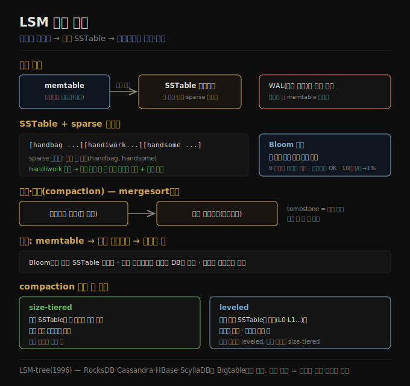

# LSM 저장 엔진
> 메모리의 정렬맵(memtable)에 쓰고 임계 초과 시 불변 SSTable로 내려, 백그라운드에서 병합·압축하는 것이 LSM 저장 엔진입니다.

이 노트를 읽고 나면 SSTable과 memtable의 역할을 구분하고, LSM 저장 엔진의 쓰기·읽기·병합 흐름을 설명하며, Bloom 필터가 왜 없는 키 조회를 빠르게 하는지 말할 수 있습니다.

이 노트는 [04-01](./04-01.OLTP%20저장과%20인덱스%20기초.md)에 이어, OLTP 저장 엔진의 첫 계열인 **로그 구조화(log-structured)** 저장을 다룹니다. 핵심은 불변 데이터 파일을 키로 정렬해 쓰고, 백그라운드에서 병합·압축하는 것입니다.

## 1. SSTable — 키로 정렬된 불변 파일
> SSTable은 키-값 쌍을 키로 정렬해 저장하고 각 키가 한 번만 나오게 해, sparse 인덱스로 일부 키만 메모리에 둬도 조회가 됩니다.

[04-01](./04-01.OLTP%20저장과%20인덱스%20기초.md)의 인메모리 해시 인덱스 대신, 실무에선 데이터를 **키로 정렬된** 구조에 두는 것이 훨씬 흔합니다. 그 한 예가 **SSTable(Sorted Strings Table)** 입니다. 키-값 쌍을 저장하되 키로 정렬돼 있고 각 키가 파일에 한 번만 나오는 것을 보장합니다.

이제 모든 키를 메모리에 둘 필요가 없습니다. SSTable 안 키-값 쌍을 수 킬로바이트 블록으로 묶고 각 블록의 첫 키만 인덱스에 둡니다. 일부 키만 저장하는 이런 인덱스를 **sparse(희소)** 라 하고, SSTable의 별도 부분(불변 B-tree·trie 등)에 저장합니다. 예를 들어 한 블록의 첫 키가 handbag, 다음 블록의 첫 키가 handsome인데 handiwork를 찾는다면, 정렬 덕에 handiwork가 둘 사이에 있음을 알아 handbag의 offset으로 seek해 거기서부터 스캔하면 됩니다. 수 킬로바이트 블록은 빠르게 스캔됩니다. 각 블록은 압축할 수도 있어, 디스크 공간을 아끼고 I/O 대역폭을 줄이되 CPU를 조금 더 씁니다.

## 2. SSTable 구성과 병합 — LSM 흐름
> 쓰기는 memtable에 쌓이고 임계 초과 시 SSTable로 내려가며, 읽기는 memtable→최신 세그먼트 순으로 찾고, 백그라운드가 세그먼트를 병합·압축합니다.

SSTable은 읽기에는 좋지만 쓰기를 어렵게 합니다 — 끝에 그냥 추가하면 정렬이 깨지기 때문입니다. 이를 로그 구조화 접근으로 해결합니다(append-only 로그와 정렬 파일의 하이브리드).

1. 쓰기가 오면 인메모리 정렬맵(레드-블랙 트리·스킵 리스트·trie)에 추가합니다. 이 인메모리 구조를 **memtable** 이라 합니다.
2. memtable이 임계(보통 수 메가바이트)를 넘으면 정렬된 순서로 디스크에 **SSTable 파일** 로 씁니다. 이것이 가장 최근 세그먼트가 되고, 쓰는 동안 데이터베이스는 새 memtable에 계속 씁니다.
3. 읽으려면 먼저 memtable과 가장 최근 디스크 세그먼트에서 키를 찾고, 없으면 다음 오래된 세그먼트로 계속 찾습니다. 모든 세그먼트에 없으면 데이터베이스에 없는 것입니다.
4. 때때로 백그라운드에서 병합·압축 프로세스를 돌려 세그먼트 파일을 합치고 덮어써진·삭제된 값을 버립니다.

세그먼트 병합은 **mergesort** 처럼 동작합니다 — 입력 파일들을 나란히 읽어 각 파일의 첫 키를 보고 가장 낮은 키를 출력에 복사하며 반복합니다. 같은 키가 여러 입력 파일에 있으면 더 최근 값만 유지합니다. 이는 새 병합 세그먼트(키 정렬, 키당 값 하나)를 만들고, SSTable을 한 키씩 순회하므로 최소 메모리만 씁니다. memtable 데이터가 크래시 시 손실되지 않게, 저장 엔진은 모든 쓰기를 즉시 추가하는 별도 로그(**WAL**)를 디스크에 둡니다. 이 로그는 키로 정렬되지 않지만, 유일한 목적이 크래시 후 memtable 복원이라 상관없습니다. 키를 삭제하려면 **tombstone(묘비)** 이라는 특수 삭제 레코드를 추가하고, 세그먼트 병합 시 tombstone이 그 키의 이전 값을 버리게 합니다.

여기 설명한 알고리즘이 본질적으로 RocksDB·Cassandra·ScyllaDB·HBase에 쓰이며, 모두 Google의 Bigtable 논문(SSTable·memtable 용어를 도입)에서 영감을 얻었습니다. 1996년 **Log-Structured Merge-tree(LSM-tree)** 라는 이름으로 발표돼, 정렬 파일의 병합·압축 원리에 기반한 저장 엔진을 흔히 **LSM 저장 엔진** 이라 부릅니다. 세그먼트 파일은 로컬 디스크만이 아니라 오브젝트 스토리지에도 잘 맞습니다(SlateDB·Delta Lake). 불변 세그먼트 파일은 크래시 복구도 단순하게 합니다 — 크래시 시 미완성 SSTable을 그냥 지우고 새로 시작하면 됩니다.

## 3. Bloom 필터 — 없는 키를 빠르게 거른다
> Bloom 필터는 키가 특정 SSTable에 있는지 빠르게 근사 판정해, 없는 키 조회 시 여러 세그먼트를 다 뒤지는 것을 피하게 합니다.

LSM 저장에서는 오래전에 갱신된 키나 존재하지 않는 키를 읽으면 여러 세그먼트 파일을 확인해야 해 느릴 수 있습니다. 이를 빠르게 하려고 각 세그먼트에 **Bloom 필터** 를 넣어, 특정 키가 특정 SSTable에 있는지 빠르지만 근사적으로 확인합니다.

동작은 이렇습니다 — SSTable의 각 키에 해시 함수를 적용해 비트 배열의 인덱스로 해석하고, 그 인덱스의 비트를 1로 설정합니다(예: handbag이 (2,9,4)로 해시되면 2·9·4번 비트를 1). 키가 있는지 알려면 같은 해시를 계산해 그 인덱스의 비트를 확인합니다. **비트 중 하나라도 0이면 그 키는 SSTable에 확실히 없습니다.** 비트가 모두 1이면 키가 있을 가능성이 높지만, 우연히 다른 키들이 그 비트를 1로 만들었을 수도 있습니다 — 이를 **거짓양성(false positive)** 이라 합니다. 거짓양성 확률은 키 수·키당 비트 수·총 비트 수에 달리며, 경험칙으로 SSTable 키당 10비트를 할당하면 거짓양성 1%, 키당 5비트 추가마다 확률이 10분의 1이 됩니다.

LSM 맥락에서 거짓양성은 문제가 안 됩니다 — Bloom 필터가 키 부재를 말하면 그 SSTable을 안전하게 건너뛰고, 존재를 말하면 sparse 인덱스를 보고 블록을 디코드해 실제로 있는지 확인합니다(거짓양성이면 약간의 헛수고지만 다음 세그먼트로 검색을 잇습니다).

## 4. compaction 전략과 임베디드 엔진
> size-tiered는 쓰기 많은 워크로드에, leveled는 읽기 많은 워크로드에 유리하며, LSM 엔진은 RocksDB·SQLite 같은 임베디드 형태로도 널리 쓰입니다.

LSM 저장이 언제·어떤 SSTable을 압축하는지가 중요한 세부입니다. 흔한 선택은 두 가지입니다.

1. **size-tiered compaction** — 새롭고 작은 SSTable을 오래되고 큰 SSTable로 차례로 병합합니다. 오래된 데이터의 SSTable이 크게 커질 수 있고 병합에 임시 디스크가 많이 들지만, 데이터 대부분이 큰 순차 병합에서 몇 번만 다시 쓰여 높은 쓰기 처리량을 다룰 수 있습니다.
2. **leveled compaction** — 큰 SSTable을 쓰는 대신 SSTable 크기를 고정하고 점점 커지는 "레벨"(L0·L1...)로 묶습니다. L0가 가장 최근 데이터이고, L0 너머는 키 범위로 분할된 SSTable입니다. 한 레벨이 최대 크기를 넘으면 그 레벨의 SSTable 일부가 다음 레벨로 병합됩니다. 점진적으로 진행돼 size-tiered보다 디스크를 적게 쓰고, 키 확인에 더 적은 SSTable을 읽어 읽기에 더 효율적입니다.

경험칙으로 **쓰기가 대부분이고 읽기가 적으면 size-tiered, 읽기가 지배적이면 leveled** 가 낫습니다. 많은 LSM 구현이 여러 전략을 제공합니다.

많은 데이터베이스가 네트워크로 쿼리를 받는 서비스로 돌지만, 네트워크 API를 노출하지 않는 **임베디드(embedded) 데이터베이스** 도 있습니다 — 애플리케이션 코드와 같은 프로세스에서 도는 라이브러리로, 보통 로컬 디스크 파일을 읽고 쓰며 일반 함수 호출로 상호작용합니다(RocksDB·SQLite·LMDB·DuckDB·KùzuDB). 모바일 앱에서 로컬 사용자 데이터 저장에 흔히 쓰이고, 백엔드에서는 데이터가 한 머신에 들어가고 동시 트랜잭션이 많지 않으면 적절합니다 — 예를 들어 테넌트마다 완전히 분리된 멀티테넌트 시스템에서 테넌트당 별도 임베디드 인스턴스를 쓸 수 있습니다.

## 자주 받는 오해

1. **"SSTable은 끝에 추가하면 되니 쓰기가 쉽다"** — SSTable은 키로 정렬돼야 해 끝에 그냥 추가하면 정렬이 깨집니다. 그래서 memtable에 쌓아 정렬한 뒤 임계 초과 시 한꺼번에 SSTable로 내리는 LSM 흐름을 씁니다.
2. **"Bloom 필터가 키 존재를 확정한다"** — 부재만 확정합니다. 비트가 하나라도 0이면 확실히 없지만, 모두 1이어도 거짓양성일 수 있어 sparse 인덱스로 실제 확인이 필요합니다. LSM에선 거짓양성이 약간의 헛수고일 뿐 문제가 안 됩니다.
3. **"size-tiered와 leveled 중 하나가 항상 낫다"** — 워크로드에 달렸습니다. 쓰기 많으면 size-tiered(높은 쓰기 처리량), 읽기 많으면 leveled(적은 SSTable 읽기·적은 디스크)가 낫습니다.
4. **"LSM은 크래시 복구가 복잡하다"** — 오히려 단순합니다. 세그먼트가 불변이라 크래시 시 미완성 SSTable을 지우고 새로 시작하면 되고, memtable은 WAL로 복원합니다.

## 면접에서 받을 만한 질문

1. **"SSTable과 memtable의 역할은?"** — memtable은 인메모리 정렬맵으로 쓰기를 받아 정렬해 두고, 임계를 넘으면 디스크에 키로 정렬된 불변 SSTable로 내립니다. SSTable은 sparse 인덱스로 일부 키만 메모리에 둬도 조회가 되고, 블록 압축으로 디스크·I/O를 아낍니다.
2. **"LSM 저장의 읽기는 어떻게 동작하나?"** — memtable → 가장 최근 세그먼트 → 더 오래된 세그먼트 순으로 키를 찾고, 모든 세그먼트에 없으면 DB에 없는 것입니다. 오래전 갱신·부재 키는 여러 세그먼트를 확인해 느릴 수 있어 Bloom 필터로 가속합니다.
3. **"Bloom 필터가 LSM에서 왜 유용한가?"** — 키가 특정 SSTable에 없는지 빠르게 근사 판정해, 없는 키 조회 시 그 SSTable을 건너뛰게 합니다. 비트가 하나라도 0이면 확실히 없습니다. 거짓양성은 약간의 헛수고일 뿐이라 문제가 안 됩니다.
4. **"size-tiered와 leveled compaction의 차이는?"** — size-tiered는 작은 SSTable을 큰 것으로 누적 병합해 높은 쓰기 처리량에 유리하지만 임시 디스크를 많이 씁니다. leveled는 고정 크기 SSTable을 레벨로 묶어 점진적으로 병합해 디스크를 적게 쓰고 읽기에 유리합니다.

## 관련 문서

> 이 노트는 4장의 LSM 계열이며, B-tree 및 그 비교 노트로 이어집니다.

- [04-01 OLTP 저장과 인덱스 기초](./04-01.OLTP%20저장과%20인덱스%20기초.md) § "인메모리 해시 인덱스" — 정렬 구조로 가는 동기
- [04-03 B-tree와 LSM 비교](./04-03.B-tree와%20LSM%20비교.md) § "B-tree vs LSM" — in-place 갱신 방식과의 비교
- [ddia2 README — 2판 정독 인덱스](./README.md)
