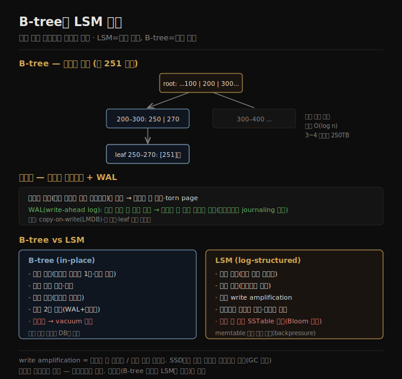

# B-tree와 LSM 비교
> B-tree는 고정 크기 페이지를 제자리 갱신하며 읽기에 유리하고, LSM은 불변 파일에 순차 쓰기를 해 쓰기에 유리합니다.

이 노트를 읽고 나면 B-tree의 페이지 구조와 분할·WAL을 설명하고, B-tree와 LSM을 읽기·쓰기·write amplification 축으로 비교하며, 순차 쓰기가 랜덤 쓰기보다 빠른 이유를 SSD 관점에서 말할 수 있습니다.

이 노트는 [04-02](./04-02.LSM%20저장%20엔진.md)에 이어, OLTP 저장 엔진의 두 번째 계열인 **B-tree** 와 두 계열의 비교를 다룹니다. 로그 구조화 접근이 인기지만 B-tree는 키로 레코드를 읽고 쓰는 가장 널리 쓰이는 구조입니다 — 1970년 도입돼 10년도 안 돼 "ubiquitous(어디에나 있는)"라 불렸고, 거의 모든 관계형 데이터베이스의 표준 인덱스 구현으로 남아 있습니다.

## 1. B-tree — 고정 크기 페이지의 트리
> B-tree는 데이터베이스를 고정 크기 페이지로 나눠 키로 정렬하고, 분기 계수가 수백이라 3~4 레벨로 수백 TB를 담습니다.

SSTable처럼 B-tree도 키-값 쌍을 키로 정렬해 효율적 조회·범위 쿼리를 가능하게 하지만, 설계 철학이 다릅니다. 로그 구조화 인덱스는 데이터베이스를 가변 크기 세그먼트(보통 수 메가바이트 이상)로 나눠 한 번 쓰고 불변으로 두는 반면, B-tree는 **고정 크기 블록(페이지)** 으로 나눠 페이지를 **제자리(in place)** 로 덮어쓸 수 있습니다. 페이지는 전통적으로 4 KiB이고, PostgreSQL은 8 KiB, MySQL은 16 KiB를 기본으로 씁니다.

각 페이지는 페이지 번호로 식별되어 한 페이지가 다른 페이지를 참조할 수 있습니다(메모리의 포인터와 비슷하되 디스크상). 이 참조로 페이지의 트리를 만듭니다. 한 페이지가 **루트(root)** 로 지정되어, 키를 조회할 때 여기서 시작합니다. 페이지는 여러 키와 자식 페이지 참조를 담고, 각 자식이 연속된 키 범위를 책임지며 참조 사이의 키가 그 범위 경계를 나타냅니다. 예를 들어 키 251을 찾으면 경계 200과 300 사이 참조를 따라가고, 그 페이지가 200–300 범위를 더 잘게 나눕니다. 결국 개별 키를 담은 **leaf 페이지** 에 닿아 값(또는 값의 위치 참조)을 얻습니다.

한 페이지의 자식 참조 수를 **분기 계수(branching factor)** 라 하며 보통 수백입니다. 값을 갱신하려면 그 키를 담은 leaf 페이지를 찾아 새 값으로 덮어쓰고, 새 키를 추가하려면 그 키 범위를 포함하는 페이지에 더합니다. 공간이 부족하면 페이지를 두 개의 절반 찬 페이지로 **분할(split)** 하고 부모 페이지를 갱신합니다(분할이 루트까지 이어질 수 있고, 루트가 분할되면 그 위에 새 루트를 만듭니다). 이 알고리즘은 트리를 균형 있게 유지해 n개 키의 B-tree는 항상 깊이 **O(log n)** 입니다 — 대부분 3~4 레벨로 충분하고, 4 KiB 페이지·분기 계수 500의 4레벨 트리는 최대 250 TB를 담습니다.

## 2. B-tree를 신뢰성 있게 — WAL
> 페이지 분할은 여러 페이지를 동시에 덮어써 크래시 시 손상 위험이 있어, 수정 전 먼저 WAL에 기록해 크래시 후 복원합니다.

B-tree의 기본 쓰기 연산은 디스크의 페이지를 새 데이터로 덮어쓰는 것입니다 — 덮어써도 페이지 위치가 바뀌지 않아 그 페이지로의 모든 참조가 유지된다고 가정합니다. 이는 파일에 추가만 하는 LSM-tree와 극명히 대비됩니다. 페이지 분할처럼 여러 페이지를 한꺼번에 덮어쓰는 것은 위험합니다 — 일부 페이지만 쓰인 채 크래시하면 손상된 트리(어느 부모의 자식도 아닌 고아 페이지 등)가 되고, 하드웨어가 페이지를 원자적으로 못 쓰면 부분 기록된 **torn page** 가 될 수 있습니다.

크래시에 견디게, B-tree 구현은 디스크에 추가 자료 구조 — **WAL(write-ahead log)** — 를 두는 것이 흔합니다. 모든 B-tree 수정을 트리 페이지에 적용하기 전에 먼저 이 append-only 파일에 써야 합니다. 크래시 후 복귀하면 이 로그로 B-tree를 일관 상태로 복원합니다(파일시스템에서는 journaling이 같은 메커니즘). 성능을 위해 B-tree 구현은 보통 수정 페이지를 즉시 디스크에 쓰지 않고 메모리에 잠시 버퍼링하며, WAL이 크래시 시 데이터 손실을 막습니다. WAL에 쓰이고 fsync로 디스크에 플러시되면 데이터는 내구성을 갖습니다.

B-tree는 오래돼 변형이 많습니다 — copy-on-write(LMDB는 페이지를 덮어쓰지 않고 다른 위치에 쓰고 부모의 새 버전을 만듦, 동시성 제어에도 유용), 키 축약(전체 키 대신 경계 역할만 하는 정보만 저장해 분기 계수를 높임), leaf 페이지를 디스크에 순차 배치, leaf 페이지에 형제 참조 추가(부모로 안 돌아가고 순서대로 스캔) 등입니다.

## 3. B-tree vs LSM — 읽기·쓰기
> B-tree는 읽기가 빠르고 예측 가능하며, LSM은 순차 쓰기로 높은 쓰기 처리량을 내지만 읽기 시 여러 SSTable을 확인합니다.

경험칙으로 **LSM-tree는 쓰기 많은 애플리케이션에, B-tree는 읽기에 더 빠릅니다.** 다만 벤치마크는 워크로드 세부에 민감해 자신의 워크로드로 테스트해야 하고, 엄밀한 양자택일도 아닙니다(B-tree 여럿을 LSM식으로 병합하는 혼합형도 있음).

1. **읽기 성능** — B-tree는 키 조회에 레벨당 페이지 하나를 읽고 레벨 수가 적어 읽기가 빠르고 예측 가능합니다. LSM은 여러 SSTable을 확인해야 하지만 Bloom 필터가 디스크 I/O를 줄입니다. 범위 쿼리는 B-tree가 정렬 구조로 단순·빠르고, LSM은 모든 세그먼트를 병렬 스캔해 결합해야 하며 Bloom 필터가 도움이 안 됩니다.
2. **순차 vs 랜덤 쓰기** — B-tree에서 키가 키 공간 전체에 흩어지면 디스크 연산도 무작위로 흩어집니다(**랜덤 쓰기**). LSM은 세그먼트 파일을 통째로 씁니다(**순차 쓰기**). 디스크는 보통 순차 쓰기 처리량이 랜덤보다 높아, LSM이 같은 하드웨어에서 더 높은 쓰기 처리량을 낼 수 있습니다. SSD에서도 이 차이는 줄지만 여전히 있습니다 — flash는 페이지 단위로 읽고 쓰지만 블록 단위로만 지울 수 있어, 랜덤 쓰기는 GC(garbage collection)가 더 많은 일을 해 드라이브를 더 빨리 마모시킵니다.

## 4. write amplification과 디스크 공간
> write amplification은 한 쓰기가 디스크 쓰기 여러 번이 되는 배수로, LSM이 보통 더 낮아 쓰기 많은 워크로드에 유리합니다.

어떤 저장 엔진이든 애플리케이션의 쓰기 요청 하나가 디스크의 I/O 연산 여러 개가 됩니다. LSM-tree에서 값은 내구성을 위해 로그에 한 번, memtable이 디스크에 쓰일 때 한 번, 그리고 compaction에 포함될 때마다 또 쓰입니다. B-tree 인덱스는 모든 데이터를 최소 두 번 씁니다 — WAL에 한 번, 트리 페이지 자체에 한 번. 게다가 몇 바이트만 바뀌어도 전체 페이지를 써야 할 때가 있습니다.

워크로드에서 디스크에 쓴 총 바이트를, 인덱스 없이 append-only 로그만 썼을 때의 바이트로 나눈 것이 **write amplification** 입니다. 쓰기 많은 애플리케이션에서 병목이 디스크 쓰기 속도면, write amplification이 높을수록 가용 대역폭 안에서 처리할 수 있는 초당 쓰기가 줄어듭니다. 전형적 워크로드에서 LSM-tree는 전체 페이지를 안 쓰고 SSTable 청크를 압축할 수 있어 보통 write amplification이 더 낮습니다 — LSM이 쓰기 많은 워크로드에 잘 맞는 또 다른 이유입니다. 이는 SSD 마모와도 관련됩니다(낮은 write amplification = SSD를 덜 마모).

**디스크 공간** 면에서 B-tree는 시간이 지나며 단편화될 수 있습니다(키 삭제로 안 쓰이는 페이지가 파일 중간에 남음) — PostgreSQL의 vacuum 같은 백그라운드 프로세스가 필요합니다. LSM은 compaction이 주기적으로 데이터 파일을 다시 써 단편화가 적고, SSTable 블록을 더 잘 압축해 흔히 디스크 파일이 더 작습니다. 다만 불변 SSTable은 스냅샷(백업·테스트 복제)에 유용합니다 — memtable을 쓰고 그때 존재한 세그먼트 파일을 기록해 두면, 그 파일을 안 지우는 한 실제 복사 없이 스냅샷이 됩니다. 페이지가 덮어써지는 B-tree에서는 이런 스냅샷이 더 어렵습니다. 한편 삭제 데이터가 정말 지워졌는지 확신이 필요할 때(데이터 보호 규제 등), LSM은 tombstone이 모든 compaction 레벨을 통과할 때까지 상위 레벨에 남아 오래 걸릴 수 있습니다.

## 자주 받는 오해

1. **"B-tree는 추가만 한다"** — 반대입니다. B-tree는 고정 크기 페이지를 *제자리로 덮어씁니다*. 추가만 하는 건 LSM입니다. 그래서 B-tree는 페이지 분할 시 손상 위험이 있어 WAL로 보호합니다.
2. **"LSM이 항상 더 빠르다(또는 B-tree가 항상 더 빠르다)"** — 워크로드에 달렸습니다. LSM은 순차 쓰기로 쓰기에, B-tree는 레벨당 페이지 하나로 읽기에 유리합니다. 엄밀한 양자택일이 아니라 측정해야 하고 혼합형도 있습니다.
3. **"SSD에선 순차·랜덤 쓰기 차이가 없다"** — 줄지만 여전히 있습니다. flash는 페이지 단위로 쓰고 블록 단위로 지워, 랜덤 쓰기는 GC가 더 많은 일을 해 대역폭을 쓰고 드라이브를 더 빨리 마모시킵니다.
4. **"write amplification은 LSM만의 문제다"** — B-tree도 WAL+페이지로 최소 2번 쓰고 몇 바이트 변경에 전체 페이지를 쓰기도 합니다. 다만 LSM이 전체 페이지를 안 쓰고 압축해 보통 더 낮습니다.

## 면접에서 받을 만한 질문

1. **"B-tree의 페이지 분할과 WAL이 왜 함께 필요한가?"** — 페이지 분할은 여러 페이지를 동시에 덮어써, 일부만 쓰인 채 크래시하면 고아 페이지·torn page로 트리가 손상됩니다. WAL에 수정을 먼저 기록하면 크래시 후 그 로그로 일관 상태로 복원할 수 있습니다.
2. **"B-tree와 LSM의 읽기·쓰기 특성 차이는?"** — B-tree는 레벨당 페이지 하나를 읽어 읽기가 빠르고 예측 가능하며 범위 쿼리에 강하지만, 랜덤 쓰기에 WAL+페이지로 최소 2번 씁니다. LSM은 세그먼트를 순차로 통째 써 쓰기 처리량이 높지만, 읽기 시 여러 SSTable을 확인합니다(Bloom으로 완화).
3. **"순차 쓰기가 랜덤 쓰기보다 빠른 이유는(SSD 기준)?"** — flash는 페이지 단위로 쓰지만 블록 단위로만 지웁니다. 순차 쓰기는 한 블록이 한 파일에 속해 삭제 시 GC 없이 통째로 지울 수 있지만, 랜덤 쓰기는 블록에 유효·무효 페이지가 섞여 GC가 유효 페이지를 옮겨야 해 대역폭을 쓰고 마모를 키웁니다.
4. **"write amplification이 무엇이고 왜 중요한가?"** — 한 애플리케이션 쓰기가 디스크 쓰기 여러 번이 되는 배수입니다. 쓰기 병목 시 높을수록 초당 처리 쓰기가 줄고 SSD 마모도 커집니다. LSM은 전체 페이지를 안 쓰고 압축해 보통 더 낮아 쓰기 많은 워크로드에 유리합니다.

## 관련 문서

> 이 노트는 4장의 B-tree 계열이며, 보조 인덱스·인메모리 저장으로 이어집니다.

- [04-02 LSM 저장 엔진](./04-02.LSM%20저장%20엔진.md) § "병합·압축" — 순차 쓰기·불변 파일과의 대비
- [04-04 보조 인덱스와 인메모리 저장](./04-04.보조%20인덱스와%20인메모리%20저장.md) § "보조 인덱스" — 두 저장 방식 위에 인덱스를 얹는 방법
- [ddia2 README — 2판 정독 인덱스](./README.md)
