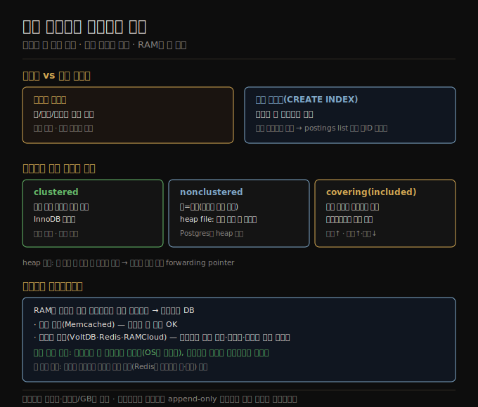

# 보조 인덱스와 인메모리 저장
> 보조 인덱스는 기본키 외 컬럼으로 검색하게 하고, 값을 인덱스 안에 둘지 참조로 둘지가 clustered·covering을 가르며, RAM이 싸지며 인메모리 DB가 자리 잡았습니다.

이 노트를 읽고 나면 보조 인덱스가 기본키 인덱스와 무엇이 다른지 설명하고, clustered·heap·covering 인덱스의 차이를 말하며, 인메모리 데이터베이스가 빠른 진짜 이유를 설명할 수 있습니다.

이 노트는 [04-03](./04-03.B-tree와%20LSM%20비교.md)에 이어, 키-값 인덱스를 넘어선 보조 인덱스, 인덱스에 값을 두는 방식, 그리고 모든 데이터를 메모리에 두는 인메모리 저장을 다룹니다.

## 1. 보조 인덱스 — 기본키 외 컬럼 검색
> 보조 인덱스는 기본키가 아닌 컬럼으로 검색하게 하며, 값이 유일하지 않아 postings list나 행 ID 덧붙임으로 처리합니다.

지금까지는 관계형의 기본키 인덱스에 해당하는 키-값 인덱스만 다뤘습니다. **기본키(primary key)** 는 관계형 테이블의 한 행, 문서 데이터베이스의 한 문서, 그래프의 한 정점을 유일하게 식별하고, 다른 레코드가 그것을 기본키로 참조하면 인덱스가 그 참조를 해소합니다.

**보조 인덱스(secondary index)** 도 흔히 쓰입니다. 관계형에서 `CREATE INDEX` 로 같은 테이블에 여러 보조 인덱스를 만들어 기본키 외 컬럼으로 검색할 수 있습니다 — 예를 들어 이력서 스키마에서 user_id 컬럼에 보조 인덱스를 둬 같은 사용자의 모든 행을 찾습니다. 보조 인덱스는 키-값 인덱스에서 쉽게 만들 수 있습니다. 주된 차이는 **인덱싱된 값이 반드시 유일하지 않다는 것** 입니다(같은 인덱스 항목에 여러 행이 있을 수 있음). 이는 두 방식으로 해결합니다 — 인덱스의 각 값을 일치하는 행 식별자의 리스트(전문 인덱스의 postings list처럼)로 만들거나, 행 식별자를 덧붙여 각 항목을 유일하게 만듭니다. B-tree 같은 in-place 갱신 저장과 로그 구조화 저장 둘 다 인덱스 구현에 쓸 수 있습니다.

## 2. 인덱스에 값을 두는 방식 — clustered·heap·covering
> 실제 행을 인덱스 안에 두면 clustered, 참조만 두면 heap 방식이며, 일부 컬럼을 포함하는 covering 인덱스는 인덱스만으로 쿼리에 답합니다.

인덱스의 키는 쿼리가 검색하는 대상입니다. 키 외에 어떤 데이터를 인덱스에 두느냐는 인덱스 유형에 달렸습니다.

1. **clustered index** — 실제 데이터(행·문서·정점)를 인덱스 구조 안에 직접 저장합니다. MySQL InnoDB에서 테이블의 기본키는 항상 clustered 인덱스이고, SQL Server는 테이블당 하나를 지정할 수 있습니다.
2. **nonclustered(참조)** — 값이 실제 데이터로의 참조입니다(해당 행의 기본키, 또는 디스크 위치의 직접 참조). 후자의 경우 행이 저장된 곳을 **heap file** 이라 하며, 특정 순서 없이 데이터를 저장합니다(append-only이거나 삭제된 행을 추적해 나중에 덮어씀). Postgres가 heap 방식을 씁니다.
3. **covering index(included columns)** — 둘의 중간으로, 테이블의 일부 컬럼을 인덱스 안에 저장합니다. 일부 쿼리를 기본키 해소나 heap 조회 없이 인덱스만으로 답할 수 있어(인덱스가 쿼리를 "cover") 일부 쿼리가 빨라지지만, 데이터 중복으로 디스크를 더 쓰고 쓰기를 늦춥니다.

키를 안 바꾸고 값을 갱신할 때 heap file 방식은 새 값이 옛 값보다 크지 않으면 제자리에 덮어쓸 수 있습니다. 더 크면 heap에서 충분한 공간이 있는 새 위치로 옮겨야 할 텐데, 이때 모든 인덱스를 새 heap 위치로 갱신하거나 옛 위치에 forwarding pointer를 남겨야 합니다.

## 3. 모든 것을 메모리에 — 인메모리 데이터베이스
> RAM이 싸지며 작은 데이터셋은 전부 메모리에 둘 수 있고, 인메모리 DB가 빠른 진짜 이유는 디스크용 인코딩 오버헤드를 피하기 때문입니다.

지금까지의 자료 구조는 모두 디스크의 한계에 대한 답이었습니다. 디스크는 메모리에 비해 다루기 까다롭지만(데이터를 신중히 배치해야 좋은 성능), 두 큰 장점이 있어 감수합니다 — **내구성**(전원이 꺼져도 내용이 안 사라짐)과 **GB당 더 낮은 비용** 입니다. RAM이 싸지며 비용 논거가 약해져, 많은 데이터셋이 그리 크지 않아 전부 메모리에 두는 것이 가능해졌습니다 — 이것이 **인메모리 데이터베이스** 입니다.

Memcached 같은 일부 인메모리 키-값 저장소는 캐시 전용이라 재시작 시 데이터 손실이 허용됩니다. 다른 인메모리 데이터베이스는 내구성을 목표로 하는데, 특수 하드웨어(배터리 RAM)나 더 흔하게는 변경 로그를 디스크에 쓰거나 주기적 스냅샷을 쓰거나 다른 머신에 복제해 달성합니다. 그러면 재시작 시 디스크나 복제본에서 상태를 다시 적재할 수 있습니다. 디스크에 쓰더라도 디스크가 내구성용 append-only 로그로만 쓰이고 읽기는 전부 메모리에서 처리되므로 여전히 인메모리 데이터베이스로 봅니다.

VoltDB·SingleStore·Oracle TimesTen은 관계형 인메모리 데이터베이스이고, RAMCloud는 내구성 있는 오픈소스 인메모리 키-값 저장소이며, Redis·Couchbase는 디스크에 비동기로 써 약한 내구성을 제공합니다. **인메모리 데이터베이스가 빠른 이유는 직관과 달리 디스크를 안 읽어서가 아닙니다** — 디스크 기반 엔진도 메모리가 충분하면 OS가 최근 블록을 캐시해 디스크를 안 읽을 수 있습니다. 오히려 **인메모리 자료 구조를 디스크에 쓸 수 있는 형태로 인코딩하는 오버헤드를 피하기 때문에** 빠릅니다. 성능 외에도 인메모리 데이터베이스의 또 다른 가치는 디스크 인덱스로 구현하기 어려운 데이터 모델을 제공하는 것입니다 — Redis는 우선순위 큐·집합 같은 자료 구조에 데이터베이스 같은 인터페이스를 제공하는데, 모든 데이터를 메모리에 둬 구현이 비교적 단순합니다.

## 자주 받는 오해

1. **"보조 인덱스는 기본키 인덱스와 근본적으로 다른 구조다"** — 키-값 인덱스에서 쉽게 만듭니다. 주된 차이는 값이 유일하지 않다는 것뿐이라, postings list나 행 ID 덧붙임으로 처리합니다. B-tree·LSM 둘 다 구현에 쓸 수 있습니다.
2. **"clustered 인덱스가 항상 더 좋다"** — clustered는 행을 인덱스 안에 둬 읽기가 빠르지만, covering은 일부 컬럼만 담아 인덱스만으로 답하되 공간·쓰기 비용이 있고, heap 방식은 참조만 둬 중복이 적습니다. 용도에 따라 다릅니다.
3. **"인메모리 DB가 빠른 건 디스크를 안 읽어서다"** — 아닙니다. 디스크 기반 엔진도 OS 캐시로 디스크를 안 읽을 수 있습니다. 인메모리가 빠른 진짜 이유는 디스크용 인코딩 오버헤드를 피하기 때문입니다.
4. **"인메모리 DB는 내구성이 없다"** — 캐시 전용(Memcached)은 그렇지만, VoltDB·Redis·RAMCloud는 변경 로그·스냅샷·복제로 내구성을 제공합니다. 디스크를 append-only 로그로만 쓰고 읽기는 메모리에서 합니다.

## 면접에서 받을 만한 질문

1. **"보조 인덱스가 기본키 인덱스와 다른 점은?"** — 기본키 인덱스는 행을 유일 식별해 값이 유일하지만, 보조 인덱스는 기본키 외 컬럼으로 검색해 값이 유일하지 않을 수 있습니다. 그래서 행 식별자 리스트(postings list)나 행 ID 덧붙임으로 처리합니다.
2. **"clustered, heap, covering 인덱스의 차이는?"** — clustered는 실제 행을 인덱스 안에 저장(InnoDB 기본키), heap 방식은 값이 행 위치 참조이고 행은 순서 없는 heap file에 저장(Postgres), covering은 일부 컬럼을 인덱스에 포함해 인덱스만으로 쿼리에 답합니다(공간·쓰기 비용 증가).
3. **"인메모리 데이터베이스가 빠른 진짜 이유는?"** — 디스크를 안 읽어서가 아닙니다(디스크 엔진도 OS 캐시로 안 읽을 수 있음). 인메모리 자료 구조를 디스크에 쓸 형태로 인코딩하는 오버헤드를 피하기 때문입니다. 또 디스크 인덱스로 어려운 자료 구조(큐·집합)도 단순하게 제공합니다.

## 관련 문서

> 이 노트는 4장의 OLTP 인덱스 마무리이며, 분석용 컬럼 지향 저장으로 넘어갑니다.

- [04-03 B-tree와 LSM 비교](./04-03.B-tree와%20LSM%20비교.md) § "B-tree" — 보조 인덱스를 얹는 두 저장 방식
- [04-05 분석용 컬럼 지향 저장](./04-05.분석용%20컬럼%20지향%20저장.md) § "컬럼 지향 저장" — OLTP(행 지향)에서 OLAP(컬럼 지향)으로 전환
- [ddia2 README — 2판 정독 인덱스](./README.md)
