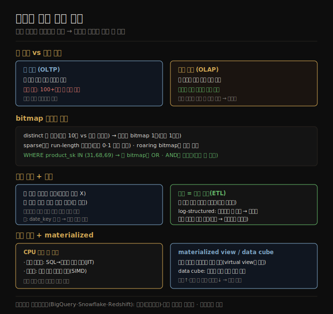

# 분석용 컬럼 지향 저장
> 분석 쿼리는 소수 컬럼만 보므로, 행이 아니라 컬럼별로 저장하면 필요한 컬럼만 읽고 잘 압축돼 훨씬 빨라집니다.

이 노트를 읽고 나면 컬럼 지향 저장이 분석 쿼리를 왜 빠르게 하는지 설명하고, bitmap 인코딩과 정렬 순서가 압축에 어떻게 기여하는지 말하며, 쿼리 컴파일과 벡터화가 CPU 시간을 줄이는 방식을 설명할 수 있습니다.

이 노트는 4장에서 분석(OLAP)에 최적화된 저장 엔진을 다룹니다. 데이터 웨어하우스([03-03](./03-03.분석용%20스키마%20—%20별·눈송이·OBT.md))는 SQL 인터페이스를 OLTP와 공유하지만, 사뭇 다른 쿼리 패턴에 최적화돼 내부가 크게 다릅니다.

## 1. 컬럼 지향 저장 — 필요한 컬럼만 읽는다
> 분석 쿼리는 100여 컬럼 중 4~5개만 보므로, 한 행의 모든 값 대신 각 컬럼의 모든 값을 함께 저장하면 쓰는 컬럼만 읽어 일을 크게 줄입니다.

데이터 웨어하우스는 보통 큰 fact 테이블이 dimension 테이블로의 외래 키를 갖는 관계형 스키마를 씁니다. fact 테이블은 흔히 100개가 넘는 컬럼인데, 전형적 분석 쿼리는 한 번에 4~5개만 접근합니다(분석에 `SELECT *` 는 드묾). 예를 들어 "사람들이 요일에 따라 신선 과일 vs 사탕 중 무엇을 더 사는가"를 분석하는 쿼리는 fact_sales의 date_key·product_sk·quantity 세 컬럼만 접근하고 나머지는 무시합니다.

대부분의 OLTP 데이터베이스는 **행 지향(row-oriented)** 으로 저장합니다 — 한 행의 모든 값을 나란히 둡니다. 인덱스가 있어도 행 지향 엔진은 그 행들(각 100여 속성)을 디스크에서 메모리로 다 로드해 파싱하고 조건에 안 맞는 것을 걸러야 해 오래 걸립니다. **컬럼 지향(columnar) 저장** 의 발상은 단순합니다 — 한 행의 모든 값을 함께 두는 대신 각 컬럼의 모든 값을 함께 둡니다. 각 컬럼이 따로 저장되면 쿼리는 그 쿼리가 쓰는 컬럼만 읽고 파싱하면 돼 일을 크게 줄입니다.

컬럼 지향 레이아웃은 각 컬럼이 행을 같은 순서로 저장하는 데 의존합니다 — 23번째 행을 재조립하려면 각 컬럼의 23번째 항목을 모으면 됩니다. 실무에선 전체 컬럼을 한꺼번에 저장하지 않고 테이블을 수천~수백만 행 블록으로 나눠 각 블록 안에서 컬럼별로 저장합니다. 컬럼 저장은 오늘날 거의 모든 분석 데이터베이스(Snowflake·DuckDB·Pinot·Druid)와 저장 포맷(Parquet·ORC·Lance)·인메모리 포맷(Arrow·Pandas/NumPy)에 쓰입니다.

> 📌 컬럼 지향 데이터베이스를 **wide-column(column-family)** 모델(Bigtable·HBase)과 혼동하면 안 됩니다. 이름은 비슷하지만 wide-column은 한 행의 모든 값을 함께 저장하는 *행 지향* 입니다.

## 2. 컬럼 압축 — bitmap 인코딩
> 컬럼의 distinct 값이 적으면 값마다 bitmap을 만들고 sparse하면 run-length 인코딩해, 웨어하우스의 전형적 쿼리를 bitwise 연산으로 효율적으로 처리합니다.

디스크에서 필요한 컬럼만 로드하는 것에 더해, 데이터를 압축해 디스크 throughput·네트워크 대역폭 요구를 더 줄일 수 있습니다. 컬럼 지향 저장은 흔히 압축에 잘 맞습니다 — 한 컬럼의 값 시퀀스에 반복이 많기 때문입니다.

웨어하우스에 특히 효과적인 기법이 **bitmap 인코딩** 입니다. 컬럼의 distinct 값 수가 행 수에 비해 작은 경우가 많습니다(소매상이 수십억 거래를 갖지만 distinct 상품은 10만 개). n개 distinct 값을 가진 컬럼을 n개 bitmap으로 바꿉니다 — distinct 값마다 bitmap 하나, 행마다 1비트. 행이 그 값이면 1, 아니면 0입니다. 이 bitmap은 보통 0이 많아(sparse), **run-length 인코딩**(연속 0·1 개수를 세어 저장)을 추가로 적용할 수 있습니다. roaring bitmap 같은 기법은 가장 압축적인 표현으로 둘을 전환합니다.

이런 bitmap 인덱스는 웨어하우스의 전형적 쿼리에 잘 맞습니다 — `WHERE product_sk IN (31, 68, 69)` 는 세 bitmap을 로드해 bitwise OR를 효율적으로 계산하고, `WHERE product_sk = 30 AND store_sk = 3` 은 두 bitmap의 bitwise AND를 계산합니다(컬럼이 같은 행 순서라 한 컬럼 bitmap의 k번째 비트가 다른 컬럼의 k번째 비트와 같은 행에 대응). bitmap은 소셜 네트워크 그래프 쿼리(X가 팔로우하고 Y도 팔로우하는 사용자 찾기)에도 쓸 수 있습니다.

## 3. 정렬 순서와 쓰기
> 컬럼 저장에서 행 전체 단위로 정렬하면 첫 정렬 키가 긴 반복으로 압축이 가장 잘 되고, 쓰기는 대량 적재로 비용을 분산합니다.

컬럼 저장에서 행을 저장하는 순서는 꼭 중요하진 않지만, SSTable처럼 순서를 부여해 인덱싱 메커니즘으로 쓸 수 있습니다. 단, 각 컬럼을 독립적으로 정렬하면 안 됩니다 — 그러면 컬럼의 어느 항목이 같은 행에 속하는지 모르게 됩니다. **행 전체 단위로 정렬** 하되 컬럼별로 저장합니다. 관리자가 흔한 쿼리 지식으로 정렬 컬럼을 고릅니다 — 예를 들어 쿼리가 자주 날짜 범위를 노리면 date_key를 첫 정렬 키로 둬 최근 달의 행만 스캔하게 합니다. 둘째 컬럼은 첫 컬럼 값이 같은 행들의 순서를 정합니다.

정렬의 또 다른 이점은 압축입니다. 첫 정렬 컬럼이 distinct 값이 적으면 정렬 후 같은 값이 길게 반복돼, 단순 run-length 인코딩으로 수십억 행 테이블도 몇 킬로바이트로 압축할 수 있습니다. 이 효과는 첫 정렬 키에서 가장 강하고, 이후 키는 더 뒤섞여 압축이 덜 됩니다.

쓰기는 보통 ETL을 통한 대량 적재입니다. 컬럼 저장에서 정렬 테이블 중간에 행 하나를 쓰는 것은 삽입 위치부터 모든 압축 컬럼을 다시 써야 해 비효율적이지만, 많은 행을 한꺼번에 쓰면 그 비용을 분산해 효율적입니다. 흔히 **log-structured** 접근을 씁니다 — 모든 쓰기가 먼저 행 지향 정렬 인메모리 저장으로 가고, 충분히 쌓이면 디스크의 컬럼 인코딩 파일과 병합해 새 파일로 일괄 씁니다. 옛 파일은 불변이고 새 파일을 한꺼번에 쓰므로 오브젝트 스토리지에 잘 맞습니다. 쿼리는 디스크의 컬럼 데이터와 메모리의 최근 쓰기를 둘 다 보고 결합하며, 쿼리 실행 엔진이 이 구분을 사용자에게 숨깁니다.

## 4. 쿼리 실행 — 컴파일과 벡터화
> 수백만 행을 훑는 분석 쿼리는 CPU 시간도 중요해, 쿼리를 기계어로 컴파일하거나 컬럼 값을 배치로 처리하는 벡터화로 가속합니다.

복잡한 분석 SQL 쿼리는 여러 단계(연산자)의 쿼리 계획으로 분해돼 여러 머신에 분산 실행될 수 있습니다. 수백만 행을 훑는 쿼리는 디스크에서 읽는 데이터 양뿐 아니라 복잡한 연산자 실행에 드는 CPU 시간도 걱정해야 합니다. 가장 단순한 연산자는 프로그래밍 언어 인터프리터 같아 행마다 어떤 비교·계산을 할지 자료 구조를 확인하는데, 많은 분석 목적엔 너무 느립니다. 두 대안이 등장했습니다.

1. **쿼리 컴파일(query compilation)** — 쿼리 엔진이 SQL을 실행하는 코드를 생성합니다. 코드가 행을 하나씩 훑어 관심 컬럼 값을 보고 필요한 비교·계산을 하고 조건을 만족하면 출력 버퍼에 복사합니다. 생성 코드를 기계어로 컴파일(흔히 LLVM)해 메모리에 로드된 컬럼 인코딩 데이터에 돌립니다 — JVM의 JIT 컴파일과 비슷합니다.
2. **벡터화 처리(vectorized processing)** — 쿼리를 컴파일하지 않고 해석하되, 행을 하나씩 도는 대신 컬럼의 많은 값을 배치로 처리해 빠르게 합니다. 미리 정의된 연산자에 인자를 넘겨 결과 배치를 받습니다 — 예를 들어 product_sk 컬럼과 상품 ID를 equality 연산자에 넘겨 bitmap을 받고, store_sk와 store ID로 또 bitmap을 받아 둘을 bitwise AND 연산자에 넘깁니다.

두 방식은 구현이 다르지만 둘 다 실무에 쓰이고, 현대 CPU 특성을 활용해 좋은 성능을 냅니다 — 순차 메모리 접근 선호(캐시 미스↓), 타이트한 내부 루프(분기 예측 실패↓), 병렬성(멀티스레드·SIMD), 압축 데이터를 별도 표현으로 디코드하지 않고 직접 연산입니다.

## 5. materialized view·data cube와 클라우드 웨어하우스
> materialized view는 쿼리 결과를 디스크에 실제로 복사해 반복 쿼리를 빠르게 하고, 클라우드 웨어하우스는 저장과 연산을 분리해 탄력적입니다.

**materialized view(구체화 뷰)** 는 관계형에서 쿼리 결과를 담는 테이블 같은 객체입니다. 쿼리 결과를 디스크에 실제로 복사한 것으로, 쿼리 작성 단축에 불과한 **virtual view** 와 대비됩니다. 밑 데이터가 바뀌면 갱신해야 해 쓰기에 더 일하지만, 같은 쿼리를 반복하는 워크로드에서 읽기 성능을 높입니다.

**data cube(OLAP cube)** 는 웨어하우스에 유용한 materialized view의 한 유형으로, 서로 다른 차원으로 그룹화된 집계의 격자를 만듭니다. 예를 들어 fact가 date_key·product_sk 두 차원에 외래 키를 가지면, 날짜를 한 축, 상품을 다른 축으로 한 2차원 표를 만들어 각 셀에 그 날짜-상품 조합의 집계(SUM 등)를 담습니다. 그러면 각 행·열을 따라 한 차원을 줄인 요약(날짜 무관 상품별 매출 등)을 얻습니다. 장점은 특정 쿼리가 미리 계산돼 크게 빨라지는 것이고, 단점은 원본 쿼리만큼 유연하지 않다는 것입니다(price가 차원이 아니면 $100 초과 비율을 계산할 수 없음). 그래서 대부분의 웨어하우스는 원본을 최대한 유지하고 data cube는 특정 쿼리의 성능 부스트로만 씁니다.

**클라우드 데이터 웨어하우스**(BigQuery·Redshift·Snowflake)는 오브젝트 스토리지·서버리스 연산 같은 확장 가능한 클라우드 인프라를 활용합니다. 쿼리 연산을 저장 계층에서 분리해 더 탄력적입니다 — 데이터가 로컬 디스크가 아닌 오브젝트 스토리지에 영속되어 저장 용량과 쿼리 연산 자원을 독립적으로 조정할 수 있습니다([01-03](./01-03.클라우드%20vs%20셀프%20호스팅.md)). 오픈소스 웨어하우스(Hive·Trino·Spark)는 데이터 레이크로 옮겨가며 쿼리 엔진·저장 포맷·테이블 포맷(Iceberg·Delta)·데이터 카탈로그로 분해됐습니다.

## 자주 받는 오해

1. **"컬럼 지향과 wide-column은 같다"** — 아닙니다. wide-column(Bigtable·HBase)은 한 행의 모든 값을 함께 저장하는 *행 지향* 입니다. 컬럼 지향은 각 컬럼의 모든 값을 함께 저장해 분석 쿼리가 필요한 컬럼만 읽게 합니다.
2. **"각 컬럼을 독립적으로 정렬하면 된다"** — 그러면 어느 항목이 같은 행에 속하는지 모르게 됩니다. 행 전체 단위로 정렬하되 컬럼별로 저장해야 k번째 항목들이 같은 행에 대응합니다.
3. **"data cube가 원본 데이터를 대체한다"** — data cube는 미리 계산돼 특정 쿼리는 빠르지만 유연성이 없습니다(차원이 아닌 속성으로는 계산 불가). 대부분의 웨어하우스는 원본을 유지하고 cube는 성능 부스트로만 씁니다.
4. **"분석 저장의 성능은 디스크 읽기만 줄이면 된다"** — 수백만 행을 훑으면 CPU 시간도 병목입니다. 그래서 쿼리 컴파일(JIT)이나 벡터화(SIMD·배치)로 CPU 시간도 줄입니다.

## 면접에서 받을 만한 질문

1. **"컬럼 지향 저장이 분석 쿼리를 빠르게 하는 이유는?"** — 분석 쿼리는 100여 컬럼 중 소수만 봅니다. 행 지향은 행 전체를 로드하지만, 컬럼 지향은 각 컬럼을 따로 저장해 쿼리가 쓰는 컬럼만 읽고 파싱합니다. 컬럼별 반복이 많아 압축도 잘 돼 디스크·I/O를 더 줄입니다.
2. **"bitmap 인코딩이 왜 웨어하우스에 효과적인가?"** — distinct 값이 행 수보다 훨씬 적을 때, 값마다 bitmap(행당 1비트)을 만들고 sparse하면 run-length 인코딩합니다. `IN`은 bitmap OR, `AND` 조건은 bitmap AND로 효율적으로 처리됩니다(컬럼이 같은 행 순서라 가능).
3. **"정렬 순서가 컬럼 저장에서 왜 중요한가?"** — 행 전체 단위로 정렬하면 첫 정렬 키가 긴 반복을 가져 run-length 인코딩으로 크게 압축됩니다(수십억 행도 수 KB). 또 자주 쓰는 범위(최근 달 등)를 첫 키로 두면 그 범위만 스캔해 빨라집니다.
4. **"쿼리 컴파일과 벡터화의 차이는?"** — 컴파일은 SQL을 기계어 코드로 생성해(JIT) 행을 돌며 실행합니다. 벡터화는 쿼리를 해석하되 컬럼 값을 배치로 처리하고 미리 정의된 연산자(SIMD)로 결과 배치를 받습니다. 둘 다 순차 접근·압축 데이터 직접 연산으로 CPU를 효율적으로 씁니다.

## 관련 문서

> 이 노트는 4장의 분석 저장 축이며, 다차원·전문·벡터 인덱스로 이어집니다.

- [04-04 보조 인덱스와 인메모리 저장](./04-04.보조%20인덱스와%20인메모리%20저장.md) § "인덱스에 값을 두는 방식" — 행 지향 OLTP에서 컬럼 지향 OLAP으로 전환
- [04-06 다차원·전문·벡터 인덱스](./04-06.다차원·전문·벡터%20인덱스.md) § "전문 검색" — bitmap·inverted index의 연결
- [03-03 분석용 스키마 — 별·눈송이·OBT](./03-03.분석용%20스키마%20—%20별·눈송이·OBT.md) § "별 스키마" — fact 테이블 저장 최적화의 배경
- [ddia2 README — 2판 정독 인덱스](./README.md)
