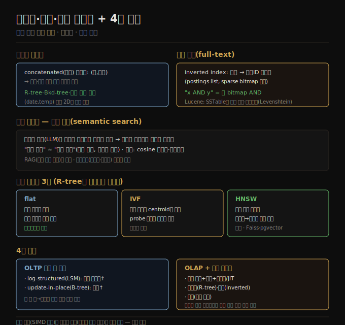

# 다차원·전문·벡터 인덱스
> 여러 조건을 동시에 검색하려면 다차원 인덱스(R-tree), 키워드 검색에는 전문 인덱스(inverted index), 의미 검색에는 벡터 인덱스를 씁니다.

이 노트를 읽고 나면 다차원 인덱스가 단일 컬럼 인덱스와 무엇이 다른지 설명하고, 전문 검색의 inverted index 동작을 말하며, 벡터 임베딩과 IVF·HNSW 인덱스로 의미 검색이 어떻게 이뤄지는지 설명할 수 있습니다.

이 노트는 4장의 마지막으로, 단일 속성 범위 쿼리를 넘어 여러 조건을 동시에 검색하는 인덱스를 다루고, 4장 전체를 종합합니다. B-tree·LSM은 단일 속성 범위 쿼리를 잘 하지만, 단일 속성만으로는 부족할 때가 있습니다.

## 1. 다차원 인덱스 — 여러 컬럼 동시 쿼리
> concatenated 인덱스는 여러 필드를 한 키로 잇지만 두 컬럼을 동시에 좁히지 못해, 지리공간 같은 경우엔 R-tree 같은 공간 인덱스를 씁니다.

가장 흔한 다중 컬럼 인덱스는 **concatenated index(연결 인덱스)** 로, 여러 필드를 한 컬럼 뒤에 다른 컬럼을 붙여 한 키로 잇습니다 — 종이 전화번호부가 (성, 이름)에서 전화번호로 가는 인덱스인 것과 같습니다. 정렬 순서 덕에 특정 성, 또는 특정 성-이름 조합의 사람을 찾을 수 있지만, 특정 이름만으로 찾는 데는 쓸모없습니다.

반면 **다차원 인덱스(multidimensional index)** 는 여러 컬럼을 한꺼번에 쿼리하게 합니다. 지리공간 데이터에 특히 중요합니다 — 레스토랑 검색 사이트가 위도·경도로 사각형 지도 영역 안 모든 레스토랑을 찾으려면 2차원 범위 쿼리가 필요합니다. 위도·경도의 concatenated 인덱스는 이를 효율적으로 못 합니다(한 범위의 위도, 또는 한 범위의 경도만 줄 뿐 둘을 동시에 못 함). 한 방법은 2차원 위치를 공간 채움 곡선(space-filling curve)으로 한 숫자로 변환해 B-tree를 쓰는 것이고, 더 흔하게는 **R-tree·Bkd-tree** 같은 전용 공간 인덱스를 씁니다(가까운 데이터 점을 같은 서브트리에 묶음). PostGIS는 PostgreSQL의 Generalized Search Tree로 R-tree 지리 인덱스를 구현합니다.

다차원 인덱스는 지리 위치만을 위한 게 아닙니다 — (red, green, blue) 3차원 인덱스로 색 범위 검색, (date, temperature) 2차원 인덱스로 특정 해의 25~30°C 관측을 동시에 좁힐 수 있습니다.

## 2. 전문 검색 — inverted index
> 전문 검색은 각 단어를 차원으로 보는 다차원 쿼리이며, 단어 → 문서ID 리스트의 inverted index로 답하고 두 단어 검색은 bitmap AND로 처리합니다.

**전문 검색(full-text search)** 은 텍스트 문서 모음을 텍스트 어디에든 나올 수 있는 키워드로 검색하게 합니다. 정보 검색은 큰 전문 주제이고 언어별 처리(공백 없는 언어의 단어 분리, 오타·동의어 매칭)를 흔히 포함하지만, 핵심만 보면 전문 검색도 다차원 쿼리의 한 종류입니다 — 텍스트에 나올 수 있는 각 단어(term)가 차원이고, 그 단어를 담은 문서는 그 차원에서 값 1, 아니면 0입니다. "red apples" 검색은 red 차원에 1이고 동시에 apples 차원에 1인 문서를 찾는 쿼리입니다.

많은 검색 엔진이 쓰는 자료 구조가 **inverted index** 입니다 — 키가 term이고 값이 그 term을 담은 모든 문서 ID 리스트(**postings list**)인 키-값 구조입니다. 문서 ID가 순차 숫자면 postings list를 sparse bitmap([04-05](./04-05.분석용%20컬럼%20지향%20저장.md))으로도 표현할 수 있습니다. term x와 y를 둘 다 담은 문서 찾기는 벡터화 웨어하우스 쿼리처럼 두 bitmap을 로드해 bitwise AND를 계산하는 것과 같습니다.

예를 들어 Elasticsearch·Solr가 쓰는 **Lucene** 은 term → postings list 매핑을 SSTable 같은 정렬 파일에 저장하고, 앞서 본 log-structured 접근으로 백그라운드에서 병합합니다. 단어 대신 길이 n의 모든 부분 문자열(**n-gram**)의 inverted index를 만들면 임의 부분 문자열·정규식 검색이 가능하고(크기가 큰 게 단점), Lucene은 term 집합을 유한 상태 오토마톤으로 저장해 편집 거리(Levenshtein 오토마톤) 내 단어 검색으로 오타를 다룹니다.

## 3. 벡터 임베딩 — 의미 검색
> 의미 검색은 임베딩 모델로 문서를 벡터로 변환해, 의미가 가까운 문서의 벡터가 가깝도록 만들고, 거리 함수로 유사 문서를 찾습니다.

**의미 검색(semantic search)** 은 동의어·오타를 넘어 문서 개념과 사용자 의도를 이해하려 합니다 — LLM 출력에 검색 결과를 넣는 **RAG(검색 증강 생성)** 의 중요한 부분이 되고 있습니다. 예를 들어 "구독 취소" 페이지를 "계정 닫기"·"계약 해지"로 검색해도 찾을 수 있어야 합니다(완전히 다른 단어지만 의미가 가까움).

문서의 의미를 이해하려고 의미 검색 인덱스는 **임베딩 모델(embedding model)** 로 텍스트 문서를 부동소수 값의 벡터(**벡터 임베딩**)로 변환합니다(흔히 LLM 사용). 벡터는 다차원 공간의 한 점을 나타내고, 임베딩 모델은 입력 문서가 의미상 유사할 때 벡터가 (그 공간에서) 서로 가깝게 생성합니다. 예를 들어 농업 위키 페이지의 3차원 임베딩이 [0.38, 0.83, 0.41]이면 채소 페이지는 [0.36, 0.64, 0.67]로 가깝고, 별 스키마 페이지는 [0.85, 0.10, -0.52]로 멉니다. 실제 모델은 1,000개가 넘는 벡터를 쓰지만 원리는 같습니다 — 개별 숫자의 의미를 이해하려 하지 않고, 추상 다차원 공간의 위치를 가리키는 방법일 뿐입니다. 검색 엔진은 **cosine 유사도**(두 벡터 각도의 코사인)나 **유클리드 거리**(직선 거리)로 벡터 거리를 잽니다.

> 📌 [04-05](./04-05.분석용%20컬럼%20지향%20저장.md)의 "벡터화 처리"와 의미 검색의 "벡터"는 다른 뜻입니다. 벡터화 처리에서 벡터는 최적화 코드로 처리하는 비트 배치를 뜻하고, 임베딩 모델에서 벡터는 다차원 공간의 위치를 나타내는 부동소수 배열입니다.

초기 임베딩 모델(Word2Vec·BERT·GPT)은 텍스트로 작동했고 보통 신경망으로 구현됩니다. 이후 영상·오디오·이미지용 모델이 나왔고, 더 최근엔 한 모델이 텍스트·이미지 등 여러 양식의 임베딩을 생성하는 멀티모달로 발전했습니다.

## 4. 벡터 인덱스 — flat·IVF·HNSW
> 고차원 벡터엔 R-tree가 안 맞아, 전체 비교(flat)·파티션(IVF)·다층 근접 그래프(HNSW) 같은 전용 벡터 인덱스를 씁니다.

의미 검색 엔진은 사용자가 쿼리를 입력하면 임베딩 모델로 쿼리의 벡터 임베딩을 생성하고, **벡터 인덱스(vector index)** 로 비슷한 임베딩의 문서를 찾습니다. 벡터 인덱스는 문서 모음의 임베딩을 저장하고, 쿼리의 임베딩을 받아 벡터가 가장 가까운 문서를 돌려줍니다. 앞서 본 R-tree는 차원이 많은 벡터에 잘 안 맞아 전용 벡터 인덱스를 씁니다.

1. **flat 인덱스** — 벡터를 그대로 저장합니다. 쿼리가 모든 벡터를 읽어 쿼리 벡터와의 거리를 잽니다. 정확하지만 느립니다.
2. **IVF(inverted file) 인덱스** — 벡터 공간을 파티션(centroid)으로 클러스터링해 비교할 벡터 수를 줄입니다. flat보다 빠르지만 근사적입니다(쿼리와 문서가 가까워도 다른 파티션에 떨어질 수 있음). 쿼리는 확인할 파티션 수(probe)를 정하는데, probe가 많을수록 정확하지만 느립니다.
3. **HNSW(Hierarchical Navigable Small World) 인덱스** — 벡터 공간의 여러 층을 유지합니다. 각 층이 그래프(노드=벡터, 엣지=근접)이고, 쿼리는 노드가 적은 최상층에서 가장 가까운 벡터를 찾아 아래층으로 내려가며 더 가까운 벡터를 찾습니다(마지막 층까지). IVF처럼 근사적입니다.

많은 벡터 데이터베이스가 IVF와 HNSW를 구현합니다 — Facebook의 Faiss 라이브러리에 각각의 여러 변형이 있고, PostgreSQL의 pgvector도 둘 다 지원합니다.

## 5. 4장 종합
> OLTP 저장은 LSM(쓰기↑)·B-tree(읽기↑) 두 학파이고, OLAP은 컬럼 지향+압축+벡터화이며, 고급 인덱스로 다차원·전문·벡터 검색을 합니다.

4장은 데이터베이스가 저장과 검색을 어떻게 하는지 파고들었습니다. OLTP용과 분석용 저장 엔진은 사뭇 다르게 생겼습니다.

1. **OLTP 시스템** — 각각 소수 레코드를 읽고 쓰며 빠른 응답이 필요한 많은 요청에 최적화됩니다. 레코드는 기본키·보조 인덱스로 접근되고, 이 인덱스는 보통 키→레코드 정렬 매핑으로 범위 쿼리도 지원합니다.
2. **분석 시스템** — 많은 레코드를 훑는 복잡한 읽기 쿼리에 최적화됩니다. 컬럼 지향 저장+압축으로 디스크에서 읽을 데이터를 최소화하고, 쿼리 JIT 컴파일·벡터화로 CPU 시간을 최소화합니다.

OLTP 저장에는 두 학파가 있었습니다 — **log-structured 접근**(파일 추가·폐기만, 쓴 파일은 갱신 안 함, 높은 쓰기 처리량 — SSTable·LSM·RocksDB·Cassandra·Lucene)과 **update-in-place 접근**(디스크를 덮어쓸 수 있는 고정 크기 페이지로 봄, 더 높은 읽기 처리량 — B-tree). 그 뒤 여러 조건을 동시에 검색하는 인덱스를 봤습니다 — 지도를 위도·경도로 검색하는 R-tree 같은 다차원 인덱스, 여러 키워드를 검색하는 전문 검색 인덱스, 그리고 더 많은 차원의 벡터로 유사 문서를 찾는 벡터 데이터베이스입니다. 저장 엔진 내부를 알면 애플리케이션에 맞는 도구를 고르고, 튜닝 파라미터의 효과를 상상할 수 있는 더 나은 위치에 서게 됩니다.

## 자주 받는 오해

1. **"concatenated 인덱스로 위도·경도 동시 검색이 된다"** — 안 됩니다. concatenated 인덱스는 한 범위의 위도(임의 경도) 또는 한 범위의 경도만 줄 뿐 둘을 동시에 못 좁힙니다. 2차원 동시 검색엔 R-tree 같은 다차원 인덱스가 필요합니다.
2. **"전문 검색은 데이터베이스와 다른 별개 기술이다"** — 핵심은 다차원 쿼리입니다. 각 단어가 차원이고, inverted index(단어→문서ID 리스트)로 답하며 두 단어 검색은 bitmap AND로 처리합니다 — 웨어하우스 bitmap 쿼리와 같은 원리입니다.
3. **"벡터화 처리와 임베딩 벡터는 같은 것이다"** — 다릅니다. 벡터화 처리의 벡터는 최적화 코드로 처리하는 비트 배치이고, 임베딩 벡터는 다차원 공간의 위치를 나타내는 부동소수 배열입니다.
4. **"벡터 인덱스는 R-tree로 하면 된다"** — R-tree는 차원이 많은 벡터에 안 맞습니다. flat(정확·느림)·IVF(파티션·근사)·HNSW(다층 그래프·근사) 같은 전용 벡터 인덱스를 씁니다.

## 면접에서 받을 만한 질문

1. **"다차원 인덱스가 concatenated 인덱스와 다른 점은?"** — concatenated는 여러 필드를 한 키로 이어 (성,이름) 순서로만 검색해 두 컬럼을 동시에 못 좁힙니다. 다차원 인덱스(R-tree·Bkd-tree)는 위도·경도 같은 여러 컬럼을 한꺼번에 쿼리해 가까운 점을 같은 서브트리에 묶습니다.
2. **"전문 검색의 inverted index는 어떻게 동작하나?"** — 단어(term)를 키로, 그 단어를 담은 문서 ID 리스트(postings list)를 값으로 둡니다. 문서 ID가 순차면 sparse bitmap으로 표현해, 두 단어 검색을 두 bitmap의 bitwise AND로 효율적으로 처리합니다. Lucene이 SSTable식 정렬 파일로 구현합니다.
3. **"벡터 임베딩으로 의미 검색이 어떻게 되나?"** — 임베딩 모델(LLM)이 문서를 부동소수 벡터로 변환해, 의미가 유사한 문서의 벡터가 다차원 공간에서 가깝도록 만듭니다. 쿼리도 벡터로 변환해 cosine 유사도·유클리드 거리로 가장 가까운 문서를 찾습니다("구독 취소"≈"계정 닫기").
4. **"벡터 인덱스 flat·IVF·HNSW의 차이는?"** — flat은 벡터를 그대로 저장해 모든 벡터와 거리를 재 정확하지만 느립니다. IVF는 공간을 파티션으로 나눠 probe 수만큼만 확인해 빠르나 근사입니다. HNSW는 다층 근접 그래프를 상위→하위층으로 따라 탐색하며 근사 결과를 빠르게 줍니다.

## 관련 문서

> 이 노트는 4장의 마지막 축이자 4장 전체의 종합이며, 컬럼 저장·OLTP 기초로 흐름을 닫습니다.

- [04-05 분석용 컬럼 지향 저장](./04-05.분석용%20컬럼%20지향%20저장.md) § "bitmap 인코딩" — bitmap이 inverted index에 쓰이는 연결
- [04-01 OLTP 저장과 인덱스 기초](./04-01.OLTP%20저장과%20인덱스%20기초.md) — 4장 출발점으로 되돌아가 저장·검색의 흐름을 닫음
- [ddia2 README — 2판 정독 인덱스](./README.md)
