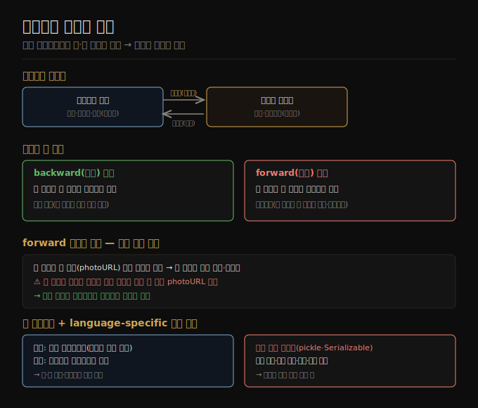

# 인코딩과 호환성 기초
> 롤링 업그레이드로 옛·새 코드와 데이터가 공존하므로, 새 코드가 옛 데이터를 읽는 backward와 옛 코드가 새 데이터를 읽는 forward 호환성이 둘 다 필요합니다.

이 노트를 읽고 나면 인코딩과 디코딩이 무엇인지 설명하고, backward·forward 호환성을 구분하며, forward 호환성이 왜 까다롭고 언어 내장 인코딩을 왜 피해야 하는지 말할 수 있습니다.

5장은 인코딩과 진화를 다룹니다. 헤라클레이토스의 말처럼 "모든 것은 변하고 멈추는 것은 없"습니다 — 애플리케이션은 시간이 지나며 불가피하게 바뀌고, 기능 변경은 흔히 저장 데이터 변경을 요구합니다. 2장에서 본 발전성([02-05](./02-05.유지보수성.md))의 핵심이 변화를 쉽게 만드는 것이었습니다.

데이터 형식·스키마가 바뀌면 애플리케이션 코드 변경도 따라야 하지만, 큰 애플리케이션에서 코드 변경은 즉각 일어나지 못합니다 — 서버는 **롤링 업그레이드**(노드별 점진 배포)를 하고, 클라이언트는 사용자가 업데이트를 미룹니다. 그래서 옛·새 코드와 옛·새 데이터 형식이 동시에 공존할 수 있고, 시스템이 매끄럽게 돌려면 양방향 호환성을 유지해야 합니다.

## 1. 인코딩과 디코딩
> 인메모리 객체를 바이트 시퀀스로 바꾸는 것이 인코딩, 그 반대가 디코딩이며, 다른 프로세스와 메모리를 공유하지 않으면 인코딩이 필요합니다.

프로그램은 보통 데이터를 두 가지 표현으로 다룹니다.

1. **인메모리** — 데이터를 객체·구조체·리스트·배열·해시 테이블·트리에 둡니다. CPU가 효율적으로 접근·조작하도록 최적화돼 보통 포인터를 씁니다.
2. **바이트 시퀀스** — 파일에 쓰거나 네트워크로 보낼 때는 자족적 바이트 시퀀스(예: JSON 문서)로 인코딩해야 합니다. 포인터는 다른 프로세스에 의미가 없어, 이 표현은 인메모리 자료 구조와 꽤 다르게 생기곤 합니다.

두 표현 사이 번역이 필요합니다. 인메모리 표현에서 바이트 시퀀스로의 번역을 **인코딩(encoding, 직렬화·마샬링)**, 그 반대를 **디코딩(decoding, 파싱·역직렬화·언마샬링)** 이라 합니다.

> 📌 "직렬화(serialization)"는 트랜잭션 맥락(8장)에서 완전히 다른 의미로도 쓰여, 이 책은 용어 충돌을 피하려 *인코딩* 을 씁니다.

대부분의 시스템은 인메모리 객체와 평평한 바이트 시퀀스를 변환해야 해 라이브러리·인코딩 형식이 무수히 많습니다. 다만 인코딩/디코딩이 불필요한 경우도 있습니다 — 데이터베이스가 디스크에서 로드한 압축 데이터에 직접 연산하거나([04-05](./04-05.분석용%20컬럼%20지향%20저장.md)), Cap'n Proto·FlatBuffers 같은 zero-copy 형식은 런타임·디스크·네트워크에서 명시적 변환 단계 없이 쓰입니다.

## 2. backward·forward 호환성
> backward 호환성은 새 코드가 옛 데이터를 읽는 것이고 forward 호환성은 옛 코드가 새 데이터를 읽는 것이며, 후자가 더 까다롭습니다.

옛·새 버전 코드와 데이터 형식이 공존하므로 양방향 호환성이 필요합니다.

1. **backward(하위) 호환성** — 새 코드가 옛 코드가 쓴 데이터를 읽을 수 있습니다.
2. **forward(상위) 호환성** — 옛 코드가 새 코드가 쓴 데이터를 읽을 수 있습니다.

API 맥락에서 옛 클라이언트가 새 서비스를 호출하려면 요청에 backward, 응답에 forward 호환성이 필요하고, 새 클라이언트가 옛 서비스를 호출하려면 요청에 forward, 응답에 backward 호환성이 필요합니다.

**backward 호환성은 보통 어렵지 않습니다.** 새 코드 작성자는 옛 코드가 쓴 데이터 형식을 알아 명시적으로 처리할 수 있습니다(필요하면 옛 데이터를 읽는 옛 코드를 그냥 남겨 둠). **forward 호환성은 더 까다롭습니다** — 옛 코드가 새 버전이 더한 것을 무시해야 하기 때문입니다.

forward 호환성의 또 다른 난점은 미지 필드 보존입니다. 레코드 스키마에 필드를 더하고 새 코드가 그 새 필드를 담은 레코드를 저장한 뒤, 옛 버전 코드(아직 새 필드를 모름)가 그 레코드를 읽고 갱신해 다시 쓴다고 합시다. 바람직한 동작은 옛 코드가 해석하지 못해도 새 필드를 그대로 보존하는 것입니다. 그러나 레코드가 미지 필드를 명시적으로 보존하지 않는 모델 객체로 디코드되면 데이터가 손실될 수 있습니다(예: photoURL 필드 소실).

## 3. 언어 특정 형식 — 피할 것
> Java Serializable·Python pickle 같은 언어 내장 인코딩은 편하지만 언어 종속·보안 위험·버전·효율 문제가 깊어, 일시적 용도 외엔 피해야 합니다.

많은 프로그래밍 언어가 인메모리 객체를 바이트 시퀀스로 인코딩하는 내장 지원을 제공합니다 — Java의 `java.io.Serializable`, Python의 `pickle`, Ruby의 `Marshal`, 그리고 Kryo 같은 서드파티가 있습니다. 이들은 최소 코드로 인메모리 객체를 저장·복원하게 해 편리하지만, 깊은 문제가 여럿 있습니다.

1. **언어 종속** — 인코딩이 특정 언어에 묶여 다른 언어로 읽기 어렵습니다. 이런 인코딩으로 저장·전송하면 오랫동안 현재 언어에 자신을 묶고, 다른 언어를 쓰는 조직 시스템과의 통합을 막습니다.
2. **보안 문제** — 같은 객체 타입으로 복원하려면 디코딩이 임의 클래스를 인스턴스화할 수 있어야 합니다. 공격자가 애플리케이션에 임의 바이트 시퀀스를 디코드하게 하면 임의 클래스를 인스턴스화해 원격 코드 실행 같은 끔찍한 일을 흔히 할 수 있습니다.
3. **버전 관리 뒷전** — 빠르고 쉬운 인코딩이 목적이라 forward·backward 호환성이라는 불편한 문제를 흔히 무시합니다.
4. **효율 뒷전** — 인코딩·디코딩 CPU 시간과 인코딩 크기도 흔히 뒷전입니다 — Java 내장 직렬화는 나쁜 성능과 부푼 인코딩으로 악명 높습니다.

이런 이유로 언어 내장 인코딩은 지극히 일시적인 용도 외에는 쓰는 것이 일반적으로 나쁜 생각입니다.

## 자주 받는 오해

1. **"backward와 forward 호환성은 같은 말이다"** — 방향이 반대입니다. backward는 새 코드가 옛 데이터를 읽는 것(보통 쉬움), forward는 옛 코드가 새 데이터를 읽는 것(까다로움 — 옛 코드가 새 추가를 무시·보존해야)입니다.
2. **"forward 호환성은 새 필드를 무시하면 끝이다"** — 무시만으로는 부족합니다. 옛 코드가 읽고 다시 쓸 때 모르는 필드를 보존하지 않으면 데이터가 손실됩니다. 미지 필드를 명시적으로 보존하는 인코딩이 필요합니다.
3. **"언어 내장 직렬화(pickle 등)가 편하니 써도 된다"** — 일시적 용도 외엔 피해야 합니다. 언어 종속, 임의 클래스 인스턴스화의 보안 위험, 버전·효율 뒷전이라는 깊은 문제가 있습니다.
4. **"인코딩은 항상 필요하다"** — 압축 데이터에 직접 연산하거나 Cap'n Proto·FlatBuffers 같은 zero-copy 형식은 명시적 변환 단계 없이 쓰입니다. 다만 대부분의 시스템은 인메모리 객체와 바이트 시퀀스를 변환합니다.

## 면접에서 받을 만한 질문

1. **"인코딩과 디코딩이 무엇인가?"** — 인메모리 객체(포인터 기반 자료 구조)를 파일·네트워크용 자족적 바이트 시퀀스로 바꾸는 것이 인코딩(직렬화)이고, 그 반대가 디코딩(파싱)입니다. 포인터는 다른 프로세스에 의미가 없어 다른 표현이 필요합니다.
2. **"backward와 forward 호환성의 차이는?"** — backward는 새 코드가 옛 데이터를 읽는 것으로, 옛 형식을 알아 명시 처리할 수 있어 보통 쉽습니다. forward는 옛 코드가 새 데이터를 읽는 것으로, 옛 코드가 모르는 새 추가를 무시·보존해야 해 까다롭습니다. 롤링 업그레이드로 둘 다 필요합니다.
3. **"언어 내장 인코딩을 왜 피해야 하나?"** — 언어 종속(다른 언어로 읽기 어려움), 임의 클래스 인스턴스화로 인한 보안 위험(원격 코드 실행), 버전 관리·효율이 뒷전입니다. 일시적 용도 외엔 표준 인코딩이 낫습니다.

## 관련 문서

> 이 노트는 5장의 출발점이며, 표준 인코딩 형식들로 이어집니다.

- [05-02 JSON·XML·이진 변형](./05-02.JSON·XML·이진%20변형.md) § "textual 형식" — 언어 독립 표준 인코딩으로 가는 흐름
- [02-05 유지보수성](./02-05.유지보수성.md) § "발전성" — 호환성이 발전성의 토대인 배경
- [ddia2 README — 2판 정독 인덱스](./README.md)
