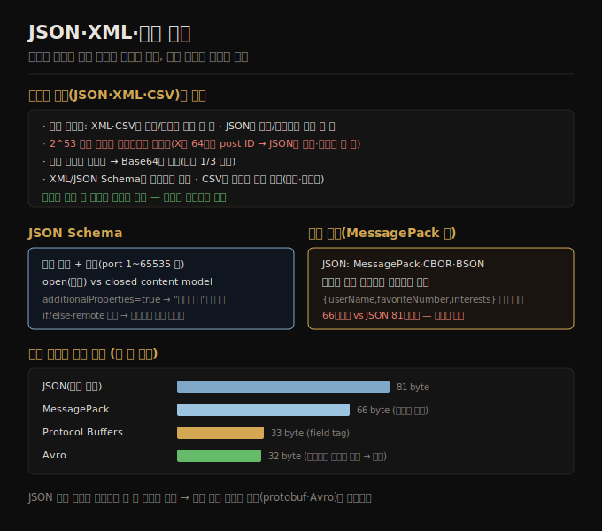

# JSON·XML·이진 변형
> JSON·XML·CSV는 언어 독립적이고 널리 쓰이지만 숫자·이진 문자열 처리에 결함이 있고, JSON 이진 변형은 필드명을 못 빼 약간만 작습니다.

이 노트를 읽고 나면 JSON·XML·CSV의 결함을 숫자·이진 문자열·스키마 관점에서 설명하고, JSON Schema의 open/closed content model을 구분하며, JSON 이진 변형이 왜 크게 작아지지 않는지 말할 수 있습니다.

이 노트는 [05-01](./05-01.인코딩과%20호환성%20기초.md)에 이어, 여러 언어가 읽고 쓸 수 있는 표준 인코딩을 다룹니다. JSON과 XML이 분명한 후보이고(널리 알려지고 지원됨), CSV는 중첩 없는 표 데이터만 지원하는 또 다른 언어 독립 형식입니다.


## 1. JSON·XML·CSV의 결함
> 세 텍스트 형식은 숫자·이진 문자열 처리와 스키마에 결함이 있지만, 조직 간 데이터 교환에는 충분히 좋아 인기를 유지합니다.

JSON·XML·CSV는 텍스트 형식이라 어느 정도 사람이 읽을 수 있지만, 표면적 구문 문제 외에도 여러 문제가 있습니다.

1. **장황함** — XML은 너무 장황하고 불필요하게 복잡하다고 비판받습니다.
2. **숫자 모호성** — XML·CSV는 숫자와 숫자로 된 문자열을 구분 못 합니다(외부 스키마 없이는). JSON은 문자열과 숫자는 구분하지만 정수와 부동소수는 구분 안 하고 정밀도를 명시 안 합니다. **2^53 초과 정수는 IEEE 754 배정밀도 부동소수로 정확히 표현 못 해**, JavaScript 같은 언어에서 파싱하면 부정확해집니다. 예를 들어 X는 64비트 숫자로 각 post를 식별하는데, JavaScript의 잘못된 파싱을 우회하려 API의 JSON에 post ID를 숫자와 십진 문자열 두 번 담습니다.
3. **이진 문자열 미지원** — JSON·XML은 Unicode 문자열은 잘 지원하지만 이진 문자열(문자 인코딩 없는 바이트 시퀀스)은 지원 안 합니다. 사람들은 Base64로 이진 데이터를 텍스트로 인코딩해 우회하는데, 동작하지만 약간 hacky하고 데이터 크기를 약 1/3 늘립니다.
4. **스키마 복잡성** — XML Schema·JSON Schema는 강력하지만 배우고 구현하기 꽤 복잡합니다. CSV는 스키마가 없어 각 행·열의 의미를 애플리케이션이 정해야 하고, 값에 쉼표·줄바꿈이 있으면 모호합니다.

이런 결함에도 JSON·XML·CSV는 많은 목적에 충분히 좋습니다. 특히 데이터 교환 형식(조직에서 조직으로 데이터 전송)으로 인기를 유지할 것입니다 — 사람들이 형식에 합의하기만 하면 얼마나 예쁘거나 효율적인지는 흔히 중요하지 않고, 다른 조직을 무언가에 합의시키는 어려움이 다른 관심사를 압도합니다.




## 2. JSON Schema — open vs closed content model
> JSON Schema는 검증 규칙을 얹을 수 있고 기본이 open content model(정의 안 된 필드 허용)이라 "금지된 것"의 정의에 가깝습니다.

**JSON Schema** 는 시스템 간 교환·저장 시 데이터를 모델링하는 방법으로 널리 채택됐습니다 — OpenAPI 명세, 스키마 레지스트리(Confluent·Apicurio), 데이터베이스(PostgreSQL pg_jsonschema·MongoDB $jsonSchema)에서 볼 수 있습니다. 기본 타입(string·number·integer·object·array·boolean·null)을 포함하고, 별도 검증 명세로 필드에 제약을 얹습니다(예: port 필드 최소 1, 최대 65535).

JSON Schema는 **open 또는 closed content model** 을 가질 수 있습니다. open content model은 스키마에 정의되지 않은 어떤 필드든 어떤 타입으로든 존재하게 허용하고, closed content model은 명시적으로 정의된 필드만 허용합니다. open content model은 `additionalProperties` 가 true(기본값)일 때 켜집니다. 따라서 **JSON Schema는 보통 허용된 것이 아니라 금지된 것(정의된 필드의 잘못된 값)의 정의** 입니다.

open content model은 강력하지만 복잡할 수 있습니다. 예를 들어 정수(ID)에서 문자열로의 맵을 정의하려는데 JSON은 정수 키 맵 타입이 없어(JSON 객체 키는 항상 문자열), `patternProperties` 와 `additionalProperties` 로 키는 숫자만, 값은 문자열만 담도록 제약합니다.

```json
{
  "$schema": "http://json-schema.org/draft-07/schema#",
  "type": "object",
  "patternProperties": { "^[0-9]+$": { "type": "string" } },
  "additionalProperties": false
}
```

JSON Schema는 if/else 조건 로직, 명명된 타입, remote 스키마 참조 등을 지원하는 강력한 스키마 언어입니다. 그러나 이런 기능은 다루기 힘든 정의로 이어집니다 — remote 스키마 해소, 조건 규칙 추론, forward·backward 호환되게 진화하기가 어려울 수 있습니다(XML Schema도 비슷한 우려).


## 3. 이진 인코딩 — JSON 이진 변형
> JSON 이진 변형(MessagePack 등)은 스키마가 없어 필드명을 데이터에 포함해야 하므로, 텍스트 JSON보다 약간만 작습니다.

JSON은 XML보다 덜 장황하지만 둘 다 이진 형식에 비해 공간을 많이 씁니다. 이 관찰이 JSON용 이진 인코딩(MessagePack·CBOR·BSON·BJSON 등)과 XML용(WBXML·Fast Infoset)의 등장으로 이어졌습니다. 이들은 더 압축적이고 때로 파싱이 빠르지만, JSON·XML의 텍스트 버전만큼 널리 채택되진 않았습니다.

일부는 데이터타입 집합을 확장하지만(정수·부동소수 구분, 이진 문자열 추가), JSON/XML 데이터 모델은 그대로 둡니다. 특히 **스키마를 규정하지 않아 객체 필드명을 인코딩 데이터에 모두 포함해야 합니다.** 예를 들어 `{userName, favoriteNumber, interests}` 레코드를 MessagePack으로 인코딩하면 userName·favoriteNumber·interests 문자열을 어딘가에 포함해야 합니다.

MessagePack 인코딩을 보면 첫 바이트 `0x83` 은 3개 필드 객체, 다음 `0xa8` 은 8바이트 문자열을 나타내고, 그다음 8바이트가 ASCII 필드명 userName입니다(길이가 앞서 표시돼 끝 마커·이스케이프 불필요). 이 이진 인코딩은 66바이트로, 텍스트 JSON(공백 제거)의 81바이트보다 조금 작을 뿐입니다. JSON의 모든 이진 인코딩이 이 점에서 비슷합니다 — 이렇게 작은 공간 절감(과 약간의 파싱 속도)이 사람이 못 읽게 되는 손실만큼 가치 있는지 분명하지 않습니다. 다음 절에서 스키마 기반(Protocol Buffers·Avro)으로 같은 레코드를 절반 바이트로 인코딩하는 법을 봅니다.


## 자주 받는 오해

1. **"JSON은 모든 숫자를 정확히 표현한다"** — 아닙니다. JSON은 정수와 부동소수를 구분 안 하고 정밀도를 명시 안 해, 2^53 초과 정수는 부동소수로 부정확해집니다. X가 post ID를 숫자·문자열 두 번 담는 이유입니다.
2. **"JSON Schema의 기본은 정의된 필드만 허용한다"** — 반대입니다. 기본이 open content model(additionalProperties=true)이라 정의 안 된 필드도 허용합니다. 그래서 "허용된 것"이 아니라 "금지된 것"의 정의에 가깝습니다.
3. **"JSON 이진 변형은 훨씬 작다"** — 약간만 작습니다(66 vs 81바이트). 스키마가 없어 필드명을 데이터에 포함해야 하기 때문입니다. 크게 줄이려면 스키마 기반 형식(protobuf·Avro)이 필요합니다.
4. **"텍스트 형식은 결함이 많으니 피해야 한다"** — 조직 간 데이터 교환엔 충분히 좋습니다. 형식에 합의하기만 하면 효율은 흔히 부차적이고, 다른 조직을 합의시키는 어려움이 더 큽니다.


## 면접에서 받을 만한 질문

1. **"JSON·XML·CSV의 숫자 처리 결함은?"** — XML·CSV는 숫자와 숫자 문자열을 구분 못 하고, JSON은 정수/부동소수를 구분 안 하며 정밀도를 명시 안 합니다. 그래서 2^53 초과 정수가 부동소수로 부정확해져, X는 64비트 post ID를 JSON에 숫자·십진 문자열 두 번 담아 우회합니다.
2. **"JSON Schema의 open과 closed content model 차이는?"** — open(기본, additionalProperties=true)은 정의 안 된 필드도 어떤 타입으로든 허용하고, closed는 명시적으로 정의된 필드만 허용합니다. open이라 JSON Schema는 보통 "금지된 것(정의 필드의 잘못된 값)"의 정의가 됩니다.
3. **"JSON 이진 변형이 왜 크게 작아지지 않나?"** — 스키마를 규정하지 않아 객체 필드명을 인코딩 데이터에 모두 포함해야 하기 때문입니다. MessagePack이 66바이트로 텍스트 JSON 81바이트보다 조금 작을 뿐입니다. 필드명을 빼려면 스키마 기반 형식이 필요합니다.


## 관련 문서

> 이 노트는 5장의 텍스트·이진 변형 축이며, 스키마 기반 형식으로 이어집니다.

- [05-01 인코딩과 호환성 기초](./05-01.인코딩과%20호환성%20기초.md) § "인코딩과 디코딩" — 표준 인코딩이 필요한 배경
- [05-03 Protocol Buffers와 Avro](./05-03.Protocol%20Buffers와%20Avro.md) § "Protocol Buffers" — 스키마로 필드명을 빼 절반 크기로
- [ddia2 README — 2판 정독 인덱스](./README.md)
