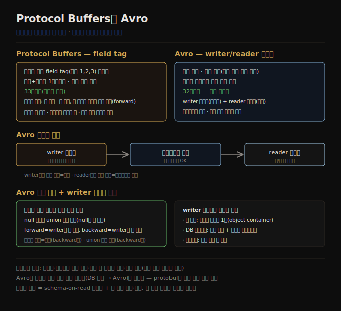

# Protocol Buffers와 Avro
> Protocol Buffers는 field tag로, Avro는 writer/reader 스키마로 필드명을 빼 압축적으로 인코딩하고 스키마 진화로 양방향 호환성을 제공합니다.

이 노트를 읽고 나면 Protocol Buffers가 field tag로 스키마 진화를 어떻게 다루는지 설명하고, Avro의 writer/reader 스키마 해소를 말하며, Avro가 왜 동적 생성 스키마에 더 친화적인지 설명할 수 있습니다.

이 노트는 [05-02](./05-02.JSON·XML·이진%20변형.md)에 이어, 스키마로 이진 인코딩을 기술하는 Protocol Buffers와 Avro를 다룹니다. 둘 다 같은 레코드를 텍스트 JSON의 절반 이하 바이트로 인코딩합니다.


## 1. Protocol Buffers — field tag와 스키마 진화
> Protocol Buffers는 필드명 대신 field tag(숫자)를 인코딩해 압축적이며, 새 필드에 새 태그를 주고 옛 코드가 모르는 태그를 무시해 양방향 호환됩니다.

**Protocol Buffers(protobuf)** 는 Google이 개발한 이진 인코딩 라이브러리로, Facebook이 만든 Apache Thrift와 비슷합니다. 인코딩하는 모든 데이터에 스키마가 필요합니다. IDL로 스키마를 기술합니다.

```protobuf
syntax = "proto3";
message Person {
    string user_name = 1;
    int64 favorite_number = 2;
    repeated string interests = 3;
}
```

코드 생성 도구가 이 스키마로 여러 언어의 클래스를 만들어 애플리케이션이 인코딩·디코딩에 씁니다. `{userName, favoriteNumber, interests}` 레코드를 인코딩하면 **33바이트** 입니다. JSON 이진 변형([05-02](./05-02.JSON·XML·이진%20변형.md))과 달리 필드명이 없고, 대신 **field tag**(스키마의 숫자 1·2·3)를 담습니다 — 필드명을 적지 않고 필드를 가리키는 압축적 방법입니다. 타입과 태그를 1바이트에 담고 가변 길이 정수를 써(1337은 2바이트), 더 작아집니다. 배열 타입은 없고 `repeated` 수식어가 리스트를 나타내며, 인코딩에선 같은 field tag의 반복으로 표현됩니다.

**스키마 진화** 는 어떻게 다룰까요? 인코딩 레코드는 인코딩된 필드의 연결일 뿐이고, 각 필드는 tag 번호로 식별되며 타입이 주석됩니다. 값이 없으면 인코딩에서 생략됩니다.

1. **필드명은 바꿀 수 있습니다** — 인코딩 데이터가 필드명을 참조하지 않기 때문입니다. 그러나 **태그는 못 바꿉니다** — 기존 인코딩 데이터가 모두 무효가 되기 때문입니다.
2. **새 필드 추가** — 새 tag 번호를 주면 됩니다. 옛 코드가 모르는 tag의 새 필드를 만나면 무시하고, 타입 주석으로 건너뛸 바이트 수를 알아 미지 필드를 보존합니다(forward 호환).
3. **backward 호환** — 각 필드가 유일한 tag를 가지면 새 코드가 옛 데이터를 항상 읽습니다. 새 스키마에 추가된 필드가 옛 데이터에 없으면 기본값(빈 문자열·0)으로 채웁니다.
4. **필드 제거** — 같은 tag 번호를 다시 쓰면 안 됩니다(옛 tag를 담은 데이터가 남아 있을 수 있어, 새 코드가 무시해야 함). 과거에 쓴 tag는 스키마에 reserved로 표시해 잊지 않게 합니다.

데이터타입 변경도 일부 가능하지만 값이 잘릴 위험이 있습니다 — 32비트 정수를 64비트로 바꾸면 새 코드는 옛 데이터를 쉽게 읽지만(빈 비트를 0으로 채움), 옛 코드가 새 데이터를 읽을 때 64비트 값이 32비트에 안 맞으면 잘립니다.




## 2. Avro — writer 스키마와 reader 스키마
> Avro는 태그 없이 값만 연결해 가장 압축적이고, 인코딩에 쓴 writer 스키마와 읽는 쪽의 reader 스키마를 필드명으로 매칭해 진화를 다룹니다.

**Apache Avro** 는 Protocol Buffers가 Hadoop 용례에 안 맞아 2009년 Hadoop 하위 프로젝트로 시작된 이진 인코딩 형식입니다. 두 스키마 언어가 있습니다 — 사람 편집용 Avro IDL과 기계 판독용(JSON 기반)입니다.

```
record Person {
    string               userName;
    union { null, long } favoriteNumber = null;
    array<string>        interests;
}
```

스키마에 **태그 번호가 없습니다.** 이 레코드를 인코딩하면 Avro 이진은 **32바이트** 로 가장 압축적입니다. 바이트 시퀀스를 보면 필드나 타입을 식별하는 것이 없고 값만 연결돼 있습니다 — 문자열은 길이 접두사 + UTF-8 바이트일 뿐, 그것이 문자열이라는 표시가 없습니다. 파싱하려면 스키마에 나온 순서대로 필드를 훑으며 스키마로 각 필드 타입을 결정합니다. 따라서 **데이터를 읽는 코드가 쓴 코드와 정확히 같은 스키마를 써야** 올바로 디코드됩니다.

그럼 Avro는 스키마 진화를 어떻게 지원할까요? 인코딩 시 애플리케이션은 아는 스키마(**writer 스키마**)를 씁니다. 디코딩 시 애플리케이션은 두 스키마를 씁니다 — 인코딩에 쓴 것과 동일한 **writer 스키마** 와, 다를 수 있는 **reader 스키마**(애플리케이션이 기대하는 필드·타입)입니다. 둘이 같으면 디코딩이 쉽고, 다르면 Avro가 둘을 비교해 writer 스키마의 데이터를 reader 스키마로 번역합니다. 필드는 **필드명으로 매칭** 되어 순서가 달라도 됩니다. writer 스키마에는 있지만 reader 스키마에 없는 필드는 무시되고, reader가 기대하지만 writer에 없는 필드는 reader 스키마의 기본값으로 채워집니다.


## 3. Avro 진화 규칙과 writer 스키마 전달
> Avro는 기본값 있는 필드만 추가·삭제할 수 있고, writer 스키마는 파일 헤더·버전 번호·연결 협상 등 맥락에 따라 reader에 전달됩니다.

Avro에서 **forward 호환성은 writer가 reader보다 새 버전** 을 쓰는 것이고, **backward 호환성은 writer가 reader보다 옛 버전** 을 쓰는 것입니다. 호환성을 유지하려면 **기본값이 있는 필드만 추가·삭제** 할 수 있습니다. 기본값 있는 새 필드를 추가하면 새 스키마로 읽는 reader가 옛 스키마로 쓴 레코드를 읽을 때 그 필드를 기본값으로 채웁니다. 기본값 없는 필드를 추가하면 새 reader가 옛 데이터를 못 읽어 backward 호환이 깨지고, 기본값 없는 필드를 제거하면 옛 reader가 새 데이터를 못 읽어 forward 호환이 깨집니다.

Avro에서 null은 어떤 변수의 기본값이 아닙니다 — 필드를 null 허용하려면 **union 타입**(`union { null, long }`)을 써야 하고, null이 union의 첫 분기일 때만 기본값으로 쓸 수 있습니다. 조금 장황하지만 무엇이 null일 수 있는지 명시해 버그를 막습니다. 필드명 변경은 reader 스키마에 별칭을 둬 가능하지만 backward 호환만 되고(forward 아님), union에 분기 추가도 backward 호환만 됩니다.

reader는 데이터를 인코딩한 writer 스키마를 어떻게 알까요? 레코드마다 전체 스키마를 담을 수는 없습니다(스키마가 인코딩 데이터보다 훨씬 커 공간 절감이 사라짐). 맥락에 따라 다릅니다.

1. **많은 레코드의 큰 파일** — 같은 스키마로 인코딩된 수백만 레코드면 파일 시작에 스키마를 1회 담습니다(object container files).
2. **개별 작성 레코드의 DB** — 다른 시점에 다른 스키마로 쓰일 수 있어, 인코딩 레코드 시작에 버전 번호를 담고 DB에 스키마 버전 목록을 둡니다(Confluent 스키마 레지스트리·LinkedIn Espresso).
3. **네트워크 연결** — 연결 설정 시 스키마 버전을 협상해 연결 수명 동안 씁니다(Avro RPC).

**동적 생성 스키마** 가 Avro의 장점입니다 — 관계형 DB를 파일로 덤프할 때 관계형 스키마에서 Avro 스키마를 쉽게 생성할 수 있습니다(각 테이블=record, 각 컬럼=field). DB 스키마가 바뀌면 새 Avro 스키마를 생성해 내보내면 되고, 필드가 이름으로 식별되니 새 writer 스키마가 옛 reader 스키마와 매칭됩니다. 반면 Protocol Buffers는 field tag를 손으로 할당해야 해, DB 스키마가 바뀔 때마다 관리자가 컬럼명→tag 매핑을 수동 갱신해야 합니다.


## 4. 스키마의 장점
> 스키마 기반 이진 인코딩은 압축적이고, 스키마가 최신 문서 역할을 하며, 배포 전 호환성 검사와 코드 생성을 가능하게 합니다.

Protocol Buffers와 Avro의 스키마 언어는 XML Schema·JSON Schema보다 훨씬 단순합니다(상세 검증 규칙을 지원 안 함). 단순해 구현·사용이 쉬워 넓은 범위의 언어에서 지원을 얻었습니다. 이 발상은 새롭지 않습니다 — 1984년 표준화된 ASN.1과 공통점이 많고(태그 번호로 스키마 진화), ASN.1의 이진 인코딩(DER)은 지금도 SSL 인증서(X.509) 인코딩에 쓰이지만 상당히 복잡하고 문서가 부실해 새 애플리케이션엔 권하기 어렵습니다.

텍스트 형식(JSON·XML·CSV)이 널리 퍼졌지만 스키마 기반 이진 인코딩도 좋은 선택지로, 여러 장점이 있습니다.

1. 다양한 "이진 JSON" 변형보다 훨씬 압축적입니다(필드명을 인코딩에서 뺄 수 있어서).
2. 스키마가 가치 있는 문서이고, 디코딩에 스키마가 필요하므로 최신임이 보장됩니다(수동 문서는 쉽게 현실과 어긋남).
3. 스키마 데이터베이스를 두면 배포 전에 forward·backward 호환성을 검사할 수 있습니다.
4. 정적 타입 언어 사용자에게 스키마에서 코드를 생성하는 능력이 유용합니다(컴파일 시 타입 검사 가능).

요약하면 스키마 진화는 schemaless/schema-on-read JSON 데이터베이스([03-04](./03-04.모델%20선택과%20스키마%20유연성.md))와 같은 유연성을 주면서, 데이터에 대한 더 나은 보장과 도구를 제공합니다. 다만 운영을 단순하게 유지하려 동시 스키마 형식 수는 최소로 두는 것이 좋습니다.


## 자주 받는 오해

1. **"Protocol Buffers에서 필드명을 바꾸면 데이터가 깨진다"** — 반대입니다. 인코딩 데이터가 필드명을 참조하지 않아 필드명은 바꿔도 됩니다. 바꾸면 안 되는 건 *태그 번호* 입니다(기존 인코딩 데이터가 무효가 됨).
2. **"Avro는 레코드마다 스키마를 담는다"** — 안 담습니다(스키마가 데이터보다 커짐). 큰 파일은 헤더에 1회, DB는 버전 번호+레지스트리, 네트워크는 연결 협상으로 writer 스키마를 전달합니다.
3. **"Avro에서 모든 필드는 null 가능하다"** — 아닙니다. null 허용은 union 타입이 필요하고 null이 첫 분기일 때만 기본값이 됩니다. 무엇이 null일 수 있는지 명시해 버그를 막습니다.
4. **"protobuf와 Avro는 동적 생성 스키마에 똑같이 좋다"** — Avro가 더 친화적입니다(태그가 없어 DB 스키마에서 자동 생성·이름 매칭). protobuf는 field tag를 수동 할당해야 해 DB 스키마 변경 시 매핑을 손으로 갱신해야 합니다.


## 면접에서 받을 만한 질문

1. **"Protocol Buffers는 field tag로 스키마 진화를 어떻게 다루나?"** — 필드를 tag 번호로 식별합니다. 새 필드에 새 태그를 주면 옛 코드가 모르는 태그를 무시해(타입 주석으로 건너뜀, 미지 필드 보존) forward 호환되고, 유일한 태그가 유지되면 새 코드가 옛 데이터를 읽어 backward 호환됩니다. 태그는 못 바꾸고 삭제 태그는 재사용 금지입니다.
2. **"Avro의 writer 스키마와 reader 스키마는?"** — writer 스키마는 인코딩에 쓴 것, reader 스키마는 읽는 쪽이 기대하는 것입니다. 둘이 달라도 Avro가 필드명으로 매칭해 번역합니다 — writer에만 있는 필드는 무시, reader에만 있는 필드는 기본값으로 채웁니다. Avro 데이터는 태그가 없어 값만 연결돼 가장 압축적입니다.
3. **"Avro가 Protocol Buffers보다 동적 생성 스키마에 친화적인 이유는?"** — Avro는 태그가 없어 관계형 DB 스키마에서 Avro 스키마를 자동 생성할 수 있고, 필드가 이름으로 매칭돼 DB 스키마가 바뀌어도 새 writer 스키마가 옛 reader 스키마와 맞습니다. protobuf는 field tag를 수동 할당해야 합니다.
4. **"스키마 기반 이진 인코딩의 장점은?"** — 필드명을 빼 압축적이고, 스키마가 디코딩에 필요해 최신 문서임이 보장되며, 스키마 DB로 배포 전 호환성을 검사하고, 정적 타입 언어용 코드 생성이 가능합니다. schema-on-read 유연성에 더 나은 보장·도구를 더한 셈입니다.


## 관련 문서

> 이 노트는 5장의 스키마 기반 인코딩 축이며, 그 인코딩이 흐르는 데이터플로우로 이어집니다.

- [05-02 JSON·XML·이진 변형](./05-02.JSON·XML·이진%20변형.md) § "이진 인코딩" — 스키마로 필드명을 빼는 동기
- [05-04 데이터플로우 — DB·REST·RPC](./05-04.데이터플로우%20—%20DB·REST·RPC.md) — 이 인코딩이 DB·서비스·메시지로 흐르는 방식
- [03-04 모델 선택과 스키마 유연성](./03-04.모델%20선택과%20스키마%20유연성.md) § "schema-on-read vs schema-on-write" — 스키마 진화와 유연성의 관계
- [ddia2 README — 2판 정독 인덱스](./README.md)
