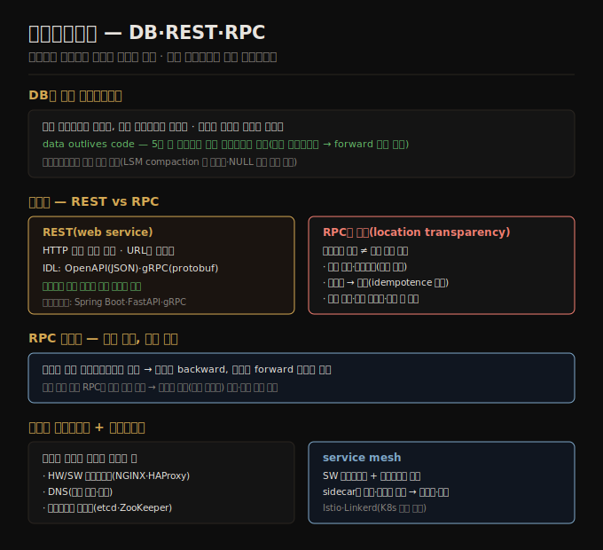

# 데이터플로우 — DB·REST·RPC
> 데이터는 DB·서비스·메시지로 흐르며, DB는 쓰는 쪽이 인코딩·읽는 쪽이 디코딩하고, RPC는 네트워크 호출을 로컬 함수처럼 보이게 하려다 근본적으로 어긋납니다.

이 노트를 읽고 나면 DB를 통한 데이터플로우에서 왜 forward 호환성도 필요한지 설명하고, "data outlives code"의 의미를 말하며, RPC가 로컬 함수 호출과 왜 근본적으로 다른지 설명할 수 있습니다.

이 노트는 5장에서 데이터가 프로세스 사이를 흐르는 방식을 다룹니다. 호환성은 데이터를 인코딩하는 프로세스와 디코딩하는 프로세스 사이의 관계입니다 — 누가 인코딩하고 누가 디코딩하는지에 따라 DB·서비스 호출·비동기 메시지로 갈립니다.

## 1. DB를 통한 데이터플로우 — data outlives code
> DB는 쓰는 프로세스가 인코딩하고 읽는 프로세스가 디코딩하며, 옛 데이터가 원래 인코딩으로 오래 남아(data outlives code) forward 호환성도 필요합니다.

데이터베이스에서 쓰는 프로세스가 데이터를 인코딩하고, 읽는 프로세스가 디코딩합니다. 한 프로세스만 접근하면 읽는 쪽은 같은 프로세스의 나중 버전이라, DB에 저장하는 것을 *미래의 나에게 메시지를 보내는 것* 으로 볼 수 있습니다 — backward 호환성이 분명히 필요합니다(아니면 미래의 내가 과거에 쓴 것을 디코드 못 함).

보통은 여러 프로세스가 동시에 DB에 접근합니다. 일부는 새 코드, 일부는 옛 코드를 돌릴 수 있습니다(롤링 업그레이드 중). 따라서 DB 값이 새 버전 코드로 쓰이고 아직 도는 옛 버전 코드로 읽힐 수 있어 **forward 호환성도 흔히 필요** 합니다.

서버 애플리케이션의 새 버전은 몇 분 안에 옛 버전을 대체할 수 있지만, **DB 내용은 그렇지 않습니다** — 5년 된 데이터는 명시적으로 다시 쓰지 않는 한 원래 인코딩으로 남습니다. 이를 **data outlives code(데이터가 코드보다 오래 산다)** 라 합니다. 새 스키마로 데이터를 다시 쓰는(마이그레이션) 것은 가능하지만 큰 데이터셋에선 비싸, 대부분의 DB는 이를 지연 처리합니다 — LSM-tree 저장 엔진은 compaction 시 최신 형식으로 다시 쓰고, 관계형 DB는 기존 데이터를 다시 쓰지 않고 NULL 기본값 컬럼 추가 같은 단순 변경을 허용합니다(옛 행을 읽을 때 빠진 컬럼을 NULL로 채움). 스키마 진화는 밑 저장이 여러 역사적 버전 스키마로 인코딩돼 있어도 DB 전체가 단일 스키마로 인코딩된 것처럼 보이게 합니다.

**아카이브 저장** 의 경우(백업·웨어하우스 적재), 데이터 덤프는 보통 최신 스키마로 인코딩됩니다 — 어차피 복사하니 일관되게 인코딩하는 게 낫습니다. 한 번에 쓰이고 불변이라 Avro object container 파일이 잘 맞고, Parquet 같은 분석 친화 컬럼 형식으로 인코딩할 좋은 기회입니다.

## 2. 서비스를 통한 데이터플로우 — REST와 web service
> 서비스는 애플리케이션 특정 API로 입출력을 제한해 캡슐화하며, REST는 HTTP 원리 위에 구축돼 IDL(OpenAPI·gRPC)로 정의·진화됩니다.

네트워크로 통신하는 프로세스는 흔히 클라이언트와 서버로 나뉩니다 — 서버가 네트워크로 API(**서비스**)를 노출하고 클라이언트가 요청합니다. 웹이 이렇게 동작합니다(브라우저가 웹 서버에 GET·POST). 서비스는 DB와 비슷하게 클라이언트가 데이터를 제출·쿼리하게 하지만, DB가 임의 쿼리를 허용하는 반면 **서비스는 비즈니스 로직이 미리 정한 입출력만 허용하는 애플리케이션 특정 API** 를 노출합니다 — 이 제한이 캡슐화를 제공해 클라이언트가 할 수 있는 것을 세밀히 제한합니다.

서비스 지향/마이크로서비스 아키텍처의 핵심 목표는 서비스를 독립 배포·진화 가능하게 만들어 애플리케이션을 바꾸기 쉽게 하는 것입니다. 각 서비스를 한 팀이 소유하고 다른 팀과 조율 없이 자주 새 버전을 낼 수 있어야 합니다. 따라서 옛·새 버전 서버·클라이언트가 동시에 돌 것을 예상해 데이터 인코딩이 버전 간 호환돼야 합니다.

HTTP를 서비스 통신의 밑 프로토콜로 쓰면 **web service** 라 합니다. 가장 인기 있는 설계 철학은 **REST** 로, HTTP 원리 위에 구축됩니다 — 단순 데이터 형식, URL로 리소스 식별, 캐시 제어·인증·콘텐츠 타입 협상에 HTTP 기능을 씁니다. REST 원리를 따른 API를 RESTful이라 합니다. 클라이언트가 어떤 HTTP 엔드포인트를 어떤 데이터 형식으로 호출할지 알아야 하므로, 개발자는 흔히 **IDL** 로 API를 정의·문서화합니다 — JSON을 주고받는 web service엔 **OpenAPI(Swagger)**, gRPC 서비스엔 **Protocol Buffers** 가 인기입니다. Spring Boot·FastAPI·gRPC 같은 서비스 프레임워크가 라우팅·메트릭·캐싱·인증을 처리해 개발자가 비즈니스 로직에 집중하게 합니다.

## 3. RPC의 문제 — location transparency
> RPC는 네트워크 호출을 로컬 함수 호출처럼 보이게 하려 하지만, 네트워크 호출은 예측 불가·타임아웃·중복·가변 지연이라 근본적으로 어긋납니다.

web service는 네트워크로 API 요청을 하는 긴 기술 계보의 최신 형태입니다 — EJB·RMI(Java 한정), DCOM(Microsoft 한정), CORBA(과도하게 복잡, 호환성 없음), SOAP·WS-*(복잡·호환성 문제)가 있었습니다. 모두 1970년대의 **RPC(remote procedure call)** 발상에 기반합니다. RPC 모델은 원격 네트워크 서비스 요청을 같은 프로세스 안 함수·메서드 호출처럼 보이게 하려 합니다(**location transparency**). 편해 보이지만 근본적으로 어긋납니다 — 네트워크 요청은 로컬 함수 호출과 여러모로 다릅니다.

1. **예측 가능성** — 로컬 함수 호출은 예측 가능하지만, 네트워크 요청은 통제 밖 이유로 예측 불가합니다(네트워크 문제로 요청·응답 손실, 원격 머신 느림·불가용). 애플리케이션이 이를 예상해야 합니다(재시도 등).
2. **타임아웃** — 로컬 함수는 결과를 반환하거나 예외를 던지거나 안 돌아옵니다. 네트워크 요청은 타임아웃이라는 결과가 더 있어, 응답을 못 받으면 요청이 도달했는지 알 수 없습니다.
3. **재시도 중복** — 실패한 요청을 재시도하면 이전 요청이 실제로 도달했고 응답만 손실됐을 수 있습니다. 그러면 중복 실행되므로 **idempotence(멱등성)** 메커니즘이 필요합니다.
4. **가변 지연** — 로컬 함수는 대체로 일정 시간이지만, 네트워크 요청은 훨씬 느리고 지연이 크게 변동합니다.
5. **인자 인코딩·언어 간 타입** — 로컬 함수엔 포인터를 효율적으로 넘기지만, 네트워크 요청은 모든 인자를 바이트로 인코딩해야 하고, 클라이언트·서버가 다른 언어면 타입 번역이 추해질 수 있습니다(JavaScript의 2^53 숫자 문제 등).

이 모든 요인은 원격 서비스를 프로그래밍 언어의 로컬 객체처럼 보이게 하려는 시도가 무의미함을 뜻합니다 — 근본적으로 다른 것이기 때문입니다. REST의 매력 일부는 네트워크 상태 전송을 함수 호출과 구분되는 과정으로 취급하는 데 있습니다.

**RPC 호환성** 은 쓰는 인코딩에서 상속됩니다. 데이터가 DB로 흐를 때와 달리 서비스에선 단순화 가정을 할 수 있습니다 — **모든 서버를 먼저 업데이트하고 클라이언트를 나중에 한다** 고 보면, 요청에 backward, 응답에 forward 호환성만 필요합니다. 다만 RPC는 조직 경계를 넘어 쓰여 서비스 제공자가 클라이언트를 강제할 수 없으므로, 호환성을 오래(때로 무기한) 유지하고 호환성을 깨는 변경이 필요하면 여러 버전을 병행 유지합니다. API 버전 관리 방법엔 합의가 없어 URL이나 HTTP Accept 헤더의 버전 번호 등을 씁니다.

## 4. 로드 밸런싱·서비스 디스커버리·서비스 메시
> 클라이언트가 서비스 주소를 찾는 것이 서비스 디스커버리이고, 여러 인스턴스에 요청을 분산하는 것이 로드 밸런싱이며, 둘을 결합한 것이 서비스 메시입니다.

모든 서비스는 네트워크로 통신하므로 클라이언트가 연결할 서비스 주소를 알아야 합니다 — **서비스 디스커버리(service discovery)** 문제입니다. 가장 단순한 방법은 IP·포트를 설정하는 것이지만, 서버가 오프라인이 되거나 옮겨지거나 과부하되면 수동 재설정이 필요합니다. 고가용·확장성을 위해 보통 여러 머신에 서비스 인스턴스 여럿이 돌고, 요청을 그 인스턴스들에 분산하는 것을 **로드 밸런싱(load balancing)** 이라 합니다.

1. **하드웨어 로드밸런서** — 데이터센터의 전용 장비로, 클라이언트가 단일 호스트·포트에 연결하면 서버 중 하나로 라우팅합니다.
2. **소프트웨어 로드밸런서(NGINX·HAProxy)** — 전용 장비 대신 표준 머신에 설치하는 애플리케이션입니다.
3. **DNS** — 한 도메인명에 여러 IP를 연결해 로드밸런싱합니다. 다만 DNS는 변경을 긴 기간에 전파하고 캐시해, 서버가 자주 바뀌면 클라이언트가 낡은 IP를 볼 수 있습니다.
4. **서비스 디스커버리 시스템** — etcd·ZooKeeper 같은 중앙 레지스트리로 가용 엔드포인트를 추적합니다. 인스턴스가 시작 시 호스트·포트·메타데이터(샤드 소유권·데이터센터 위치)를 등록하고 주기적으로 heartbeat를 보냅니다. 동적 환경을 지원하고 클라이언트가 더 똑똑한 로드밸런싱을 하게 합니다.
5. **서비스 메시(service mesh)** — SW 로드밸런서와 디스커버리를 결합한 정교한 형태입니다. 별도 머신 대신 클라이언트·서버 양쪽에 in-process 라이브러리나 sidecar 컨테이너로 배포됩니다. 연결이 전부 로컬을 거쳐 암호화를 로드밸런서 수준에서 처리해 SSL 인증서·TLS 복잡성을 가리고, 정교한 관측성(서비스 간 호출·실패·부하 추적)을 제공합니다. K8s 같은 동적 환경에선 Istio·Linkerd를 흔히 씁니다.

어느 해법이 맞는지는 조직 필요에 달렸습니다 — 고도로 동적인 환경엔 서비스 메시, 단순한 배포엔 SW 로드밸런서가 적합합니다.

## 자주 받는 오해

1. **"DB는 backward 호환성만 있으면 된다"** — 여러 프로세스가 동시에 접근하고 롤링 업그레이드로 옛 코드가 새 코드의 데이터를 읽을 수 있어 forward 호환성도 흔히 필요합니다. data outlives code라 옛 데이터가 원래 인코딩으로 오래 남습니다.
2. **"새 스키마를 배포하면 옛 데이터도 즉시 바뀐다"** — 코드는 몇 분 안에 대체되지만 5년 된 데이터는 명시적으로 다시 쓰지 않는 한 원래 인코딩으로 남습니다(data outlives code). 마이그레이션은 비싸 LSM compaction·NULL 기본 컬럼처럼 지연 처리됩니다.
3. **"RPC는 네트워크 호출을 로컬 함수처럼 다루니 편하다"** — 근본적으로 어긋납니다. 네트워크 호출은 예측 불가·타임아웃(결과 모름)·재시도 중복·가변 지연·인자 인코딩이라 로컬 함수와 다릅니다. REST는 이를 구분되는 과정으로 다룹니다.
4. **"서비스는 서버·클라 양쪽 호환성을 다 챙겨야 한다"** — 서버를 먼저 업데이트한다고 가정하면 요청에 backward, 응답에 forward 호환성만 필요합니다. 다만 조직 경계를 넘는 RPC는 클라를 강제 못 해 호환성을 오래 유지해야 합니다.

## 면접에서 받을 만한 질문

1. **"DB를 통한 데이터플로우에서 forward 호환성이 왜 필요한가?"** — 여러 프로세스가 동시에 접근하고 롤링 업그레이드 중 일부는 옛 코드를 돌립니다. 값이 새 코드로 쓰이고 옛 코드로 읽힐 수 있어 forward 호환성이 필요합니다. data outlives code라 옛 데이터가 오래 남는 것도 이유입니다.
2. **"서비스가 DB와 다른 점은?"** — DB는 임의 쿼리를 허용하지만, 서비스는 비즈니스 로직이 미리 정한 입출력만 허용하는 애플리케이션 특정 API를 노출합니다. 이 제한이 캡슐화를 제공해 클라이언트가 할 수 있는 것을 세밀히 제한하고, 서비스를 독립 진화 가능하게 합니다.
3. **"RPC가 로컬 함수 호출과 근본적으로 다른 이유는?"** — 네트워크 호출은 통제 밖 이유로 예측 불가하고, 타임아웃 시 결과를 모르며, 재시도가 중복을 일으켜 멱등성이 필요하고, 지연이 크게 변동하며, 인자를 바이트로 인코딩해야 하고 언어 간 타입 번역이 필요합니다. location transparency 시도가 무의미한 이유입니다.
4. **"서비스 디스커버리와 서비스 메시의 관계는?"** — 디스커버리는 클라이언트가 가용 엔드포인트를 찾는 것(etcd·ZooKeeper 등록·heartbeat)이고, 로드밸런싱은 인스턴스들에 요청을 분산하는 것입니다. 서비스 메시는 둘을 결합해 sidecar로 배포하고, 로컬 연결로 암호화·관측성을 로드밸런서 수준에서 처리합니다.

## 관련 문서

> 이 노트는 5장의 데이터플로우 축이며, 이벤트 기반 흐름으로 이어집니다.

- [05-03 Protocol Buffers와 Avro](./05-03.Protocol%20Buffers와%20Avro.md) § "스키마의 장점" — RPC 호환성이 인코딩에서 상속되는 배경
- [05-05 durable execution과 이벤트 기반 아키텍처](./05-05.durable%20execution과%20이벤트%20기반%20아키텍처.md) § "이벤트 기반 아키텍처" — 동기 RPC에서 비동기 메시지로
- [01-04 분산 vs 단일 노드](./01-04.분산%20vs%20단일%20노드.md) § "마이크로서비스와 서버리스" — 서비스 아키텍처의 배경
- [ddia2 README — 2판 정독 인덱스](./README.md)
